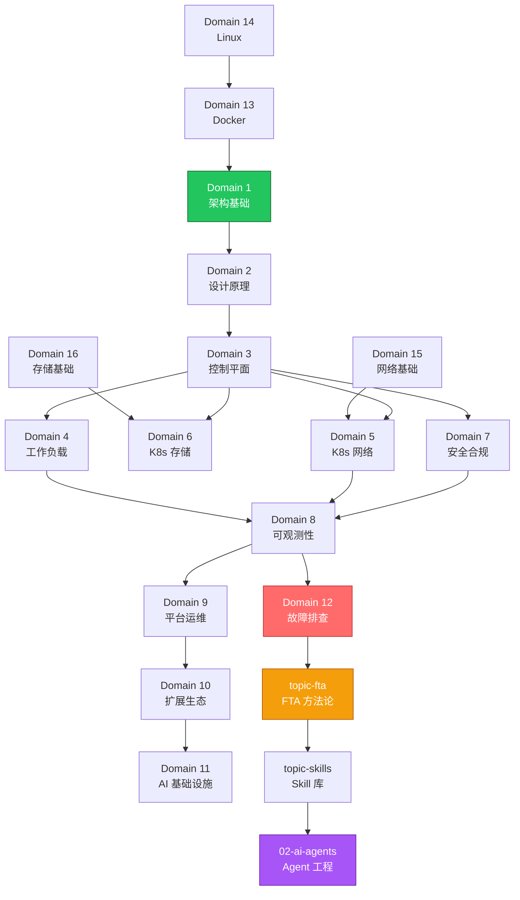

> 一句话定位：面向生产环境的 **Kubernetes + AI Infrastructure 全域知识库**，覆盖 950+ 篇文档、41 个知识领域、4300 万+ 字符，专为人类学习与 AI Agent 训练双重场景而设计。

## 项目定位与核心价值

**KUDIG-DATABASE**（Kubernetes Universal Database & Intelligence Gateway）是一个开源的云原生技术全域知识库。它并非零散文档的堆砌，而是以 **Domain（知识域）× Topic（专题）** 二维矩阵组织起来的、具有明确依赖关系和学习路径的结构化知识体系。项目内容从 Linux 内核、Docker 容器一路延伸到 Kubernetes 控制平面源码、AI/LLM 基础设施和 CNCF 218 个开源项目，覆盖了现代云原生工程师需要的完整技术栈。

这个项目有三个鲜明的差异化定位：**生产级**——所有 YAML/Shell 示例经过万级节点生产环境验证，非玩具代码；**AI-Ready**——文档结构天然适配 NotebookLM、RAG 检索增强生成和 Agent 训练场景；**方法论独创**——内置 FTA 故障树分析（演绎推理）、FEBM 取证循证（归纳取证）和 Skill 诊断-修复闭环三大原创运维方法论。项目采用 CC BY-SA 4.0 许可证开源，持续更新中。

Sources: [README.md](README.md#L1-L58), [INDEX.md](INDEX.md#L1-L10)

## 全域知识架构

在理解 KUDIG-DATABASE 的内容之前，你需要先建立对整个知识库架构的认知。下图展示了知识库的顶层组织结构——五大分支分别对应专题资源、核心知识域、底层基础、企业级专题和前沿技术。

```mermaid
graph TD
    ROOT["KUDIG-DATABASE<br/>全域知识库<br/>950+ 文档 | 41 知识域"] --> TOPIC["🔥 专题资源"]
    ROOT --> CORE["🎯 核心知识域<br/>Domain 1-12"]
    ROOT --> BASE["🏗️ 底层基础<br/>Domain 13-17, 31"]
    ROOT --> ENTERPRISE["🏢 企业级专题<br/>Domain 18-30"]
    ROOT --> ADVANCED["🚀 前沿技术<br/>Domain 32-40"]

    TOPIC --> T1["FTA 故障树<br/>29 + 36 篇"]
    TOPIC --> T2["FEBM 取证<br/>9 篇"]
    TOPIC --> T3["AI Agent 工程<br/>50 篇"]
    TOPIC --> T4["学习计划<br/>46 篇"]
    TOPIC --> T5["结构化排障<br/>49 篇"]

    CORE --> C1["架构/设计<br/>Domain 1-2"]
    CORE --> C2["控制平面<br/>Domain 3"]
    CORE --> C3["网络/存储<br/>Domain 5-6"]
    CORE --> C4["安全/可观测<br/>Domain 7-8"]
    CORE --> C5["工作负载/运维<br/>Domain 4, 9"]
    CORE --> C6["AI Infra<br/>Domain 11"]

    BASE --> B1["Docker / Linux"]
    BASE --> B2["网络/存储基础"]
    BASE --> B3["云厂商 × 13 家"]
    BASE --> B4["硬件知识"]

    ENTERPRISE --> E1["生产运维 / GitOps"]
    ENTERPRISE --> E2["监控日志 / 安全"]
    ENTERPRISE --> E3["数据库 / 灾备"]

    ADVANCED --> A1["CNCF 218 项目"]
    ADVANCED --> A2["eBPF / 平台工程"]
    ADVANCED --> A3["边缘 / Wasm / 供应链安全"]

    style ROOT fill:#326ce5,stroke:#1a3a8f,color:#fff
    style TOPIC fill:#ff6b6b,stroke:#c92a2a,color:#fff
    style CORE fill:#22c55e,stroke:#166534,color:#fff
    style BASE fill:#0ea5e9,stroke:#0369a1,color:#fff
    style ENTERPRISE fill:#f59e0b,stroke:#b45309,color:#fff
    style ADVANCED fill:#a855f7,stroke:#6b21a8,color:#fff
```

**Domain** 目录（编号 `domain-1` 到 `domain-40`）按知识领域纵向切分，每个 Domain 聚焦一个技术领域（如网络、存储、安全），内部文档用两位数编号排序（`01-xxx.md`, `02-xxx.md`...），形成从概览到深度的递进结构。**Topic** 目录（前缀 `topic-`）则横向贯穿多个 Domain，例如 `topic-fta` 横跨所有组件的故障树，`topic-skills` 提供可执行的运维 Skill 模板。这种 **Domain × Topic 矩阵**结构使得同一个知识点既能在所属领域内纵向学习，又能通过方法论专题横向串联。

Sources: [README.md](README.md#L192-L236), [INDEX.md](INDEX.md#L1-L135), [metadata/knowledge-map.md](metadata/knowledge-map.md#L1-L84)

## 关键数据一览

下表用数字量化了这个知识库的规模和覆盖范围，帮助你快速建立整体感知。

| 维度 | 指标 | 数值 |
|:---|:---|---|
| **规模** | Markdown 文档数 | 950+ 篇 |
| | 总字符数 | 4300 万+（约 1500 万中文字） |
| | 文件总数（含脚本/配置） | 1,477+ 个 |
| **覆盖** | 知识领域 | 41 个 Domain |
| | CNCF 开源项目 | 218 个 |
| | 云厂商 K8s 服务 | 13 家 |
| **AI 特色** | FTA 故障树 | 36 个组件级故障树 |
| | FEBM 取证方法论 | 9 篇 |
| | AI Agent 工程文档 | 50 篇 |
| **参考工具** | 速查卡 | 9 张（K8s/Linux/Docker/PromQL 等） |
| | Manpage 参考手册 | 14 个 |
| | 学习课程 | 46 篇（1 个月学习计划） |
| **版本** | 适用 K8s 版本 | v1.25 – v1.32 |

Sources: [reports/STATS.md](reports/STATS.md#L1-L26), [README.md](README.md#L346-L410)

## 五大内容层次详解

### 核心知识域（Domain 1-12）：Kubernetes 全技术栈

这是知识库的脊梁，覆盖 Kubernetes 从架构原理到故障排查的完整技术栈。12 个 Domain 之间存在明确的依赖关系——先理解架构（Domain 1），再学设计原理（Domain 2），然后深入控制平面（Domain 3），进而掌握工作负载（Domain 4）、网络（Domain 5）、存储（Domain 6）、安全（Domain 7）、可观测性（Domain 8）、平台运维（Domain 9）和扩展生态（Domain 10）。Domain 11 聚焦 AI 基础设施，Domain 12 是全组件故障排查的汇总。

| Domain | 名称 | 文档数 | 核心内容 |
|:---:|:---|:---:|:---|
| 1 | 架构基础 | 18 | K8s 架构总览、核心组件、kubectl 命令、升级策略、性能调优、安全架构 |
| 2 | 设计原理 | 18 | 声明式 API、控制器模式、Watch/List 机制、etcd 共识、高可用模式 |
| 3 | 控制平面 | 30 | etcd/API Server/Scheduler/KCM 深度解析、CRI/CSI/CNI 接口、生产部署 |
| 4 | 工作负载 | 25 | Pod 生命周期、调度策略、HPA/VPA 弹性伸缩、资源管理 |
| 5 | 网络 | 41 | CNI 架构、Service 五种类型、CoreDNS、Ingress、Gateway API |
| 6 | 存储 | 17 | PV/PVC 架构、StorageClass 动态供给、CSI 驱动集成 |
| 7 | 安全合规 | 21 | RBAC、NetworkPolicy、运行时安全、审计合规、零信任架构 |
| 8 | 可观测性 | 30 | Prometheus 监控、日志审计、分布式追踪、混沌工程 |
| 9 | 平台运维 | 25 | 集群生命周期、GitOps、FinOps 成本优化、多集群管理 |
| 10 | 扩展生态 | 16 | CRD/Operator 开发、Helm、CI/CD 流水线、服务网格 |
| 11 | AI 基础设施 | 36 | GPU 调度、分布式训练、LLM 推理、成本优化 |
| 12 | 故障排查 | 42+ | 全组件故障排查手册、结构化排障 |

Sources: [INDEX.md](INDEX.md#L7-L24), [README.md](README.md#L392-L409)

### 底层基础（Domain 13-17, 31）：从硬件到容器

Kubernetes 不是空中楼阁。要真正理解它，你需要掌握其下方的 Docker 容器技术（Domain 13）、Linux 系统（Domain 14）、网络协议栈（Domain 15）、存储技术（Domain 16）、主流云厂商的托管 K8s 服务（Domain 17，覆盖阿里云、AWS、GCP、Azure 等 13 家）以及服务器硬件知识（Domain 31）。这些 Domain 为上层 K8s 知识提供了必要的底层认知基础。

Sources: [INDEX.md](INDEX.md#L28-L39)

### 企业级专题（Domain 18-30）：生产环境全实践

当 Kubernetes 从测试走向生产，需要面对监控告警（Domain 20）、日志管理（Domain 21）、GitOps 流水线（Domain 23）、基础设施即代码（Domain 24）、云原生安全（Domain 25）、服务网格（Domain 26）、灾备恢复（Domain 30）等一系列企业级挑战。这 13 个 Domain 覆盖了从架构设计到成本治理的生产全生命周期。

Sources: [INDEX.md](INDEX.md#L44-L62)

### 前沿技术（Domain 32-40）：云原生技术前沿

知识库紧跟云原生前沿，包含 YAML 全资源配置手册（Domain 32，36 篇）、Kubernetes Events 事件体系（Domain 33）、CNCF 全景图 218 个项目（Domain 34）、eBPF 技术与 Cilium（Domain 35）、平台工程与 Backstage（Domain 36）、边缘计算与 KubeEdge（Domain 37）、WebAssembly 云原生工作负载（Domain 38）、供应链安全 SBOM/SLSA/Sigstore（Domain 39）和云原生 API 网关（Domain 40）。

Sources: [INDEX.md](INDEX.md#L66-L80)

### 方法论专题（Topic 系列）：独创运维方法论

这是 KUDIG-DATABASE 最具差异化价值的部分。知识库不是简单地罗列知识点，而是构建了三套相互补充的运维方法论体系：

- **FTA 故障树分析**（`topic-fta/`，65 篇）：基于演绎推理的故障排查方法论，从"系统出故障了"这个顶事件出发，逐层分解到底事件，形成树状推理骨架。包含 23 篇方法论理论 + 36 个 Kubernetes 组件级故障树（Pod、Node、etcd、API Server 等）。FTA 提供了"系统可能在哪里出问题"的分析框架。

- **FEBM 取证循证方法论**（`topic-febm/`，9 篇）：基于归纳推理的故障取证方法论，从现场证据出发，通过规范性程序还原"系统实际发生了什么"。FEBM 与 FTA 形成方法论互补——FTA 自上而下假设验证，FEBM 自下而上证据归纳。

- **运维 Skill 库**（`topic-skills/`，18 篇）：面向 AI Agent 可执行的诊断-修复闭环模板，每个 Skill 定义了故障现象 → 诊断步骤 → 修复方案 → 验证恢复的完整流程。

Sources: [README.md](README.md#L488-L570), [INDEX.md](INDEX.md#L84-L95)

## 知识域依赖与学习路径

知识域之间并非彼此孤立，而是存在明确的依赖关系。下图展示了核心 Domain 之间的前置依赖和推荐学习顺序，你可以将其作为制定个人学习计划的参考依据。

对于不同经验水平的读者，推荐的学习起点也不同。入门级开发者建议从 `topic-learn/`（1 个月学习计划）开始，按照 Week 1（Docker/Linux/架构）→ Week 2（控制平面/网络/存储）→ Week 3（安全/可观测/排障）→ Week 4（GitOps/FTA/最佳实践）的节奏系统学习。有一定经验的运维工程师可以直接进入 Domain 12 故障排查或 `topic-fta/` 故障树分析。AI 工程师则可以从 `02-ai-agents/` 入手，同时参考 `corpus-config/` 了解如何将知识库接入 RAG 系统。

Sources: [metadata/knowledge-map.md](metadata/knowledge-map.md#L1-L84), [metadata/difficulty-index.md](metadata/difficulty-index.md#L1-L84)

## AI 语料库设计

KUDIG-DATABASE 的文档结构天然适配 AI 应用场景。项目在 `corpus-config/` 目录下提供了预置的 RAG 分块策略和场景化 Profile 配置文件，支持四种主流 AI 使用模式：

| 场景 | 推荐导入内容 | 配置文件 | 预期效果 |
|:---|:---|:---|:---|
| NotebookLM 播客 | `topic-fta/` + `topic-learn/` | `notebooklm-profile.yaml` | 生成系统化技术播客 |
| SRE 运维 Agent | `topic-fta/` + `topic-skills/` + `domain-12/` | `rag-sre-profile.yaml` | 智能故障诊断与修复 |
| K8s 学习助手 | `topic-learn/` + `topic-cheat-sheet/` + `domain-1~6` | `rag-learning-profile.yaml` | 概念检索与答疑 |
| 全知识库检索 | 全部目录 | `rag-full-profile.yaml` | 全域知识问答 |

分块策略方面，深度文档（`domain-*`）推荐按 H2 标题分块（chunk_size ~2000），大型 FTA 文档按 H3 标题分块（chunk_size ~1500），速查卡保持整文档不分块，运维词典按条目分块（chunk_size ~500）。中文场景推荐使用 `bge-large-zh-v1.5` 或 `bge-m3` Embedding 模型以获得最佳检索效果。

Sources: [corpus-config/README.md](corpus-config/README.md#L1-L41), [corpus-config/rag-chunking-strategy.md](corpus-config/rag-chunking-strategy.md#L1-L117), [README.md](README.md#L240-L280)

## 项目基础设施

KUDIG-DATABASE 不仅包含知识文档，还提供了一套完整的基础设施来保障文档质量和使用体验：

| 组件 | 目录 | 功能 |
|:---|:---|:---|
| **本地 GitBook** | `gitbook/` | 基于 mdBook 的本地文档浏览，支持全文搜索和目录折叠 |
| **质量报告** | `reports/` | 多版本质量报告（v1.0–v4.0）+ 文档统计数据 |
| **元数据索引** | `metadata/` | 知识图谱、难度分级、标签索引三大元数据体系 |
| **文档模板** | `templates/` | 标准化模板（Domain/FTA/Skill/速查卡四种） |
| **脚本工具** | `scripts/` | 统计、质量检查、FTA 可视化、代码示例校验 |
| **Manpage** | `man/` | 14 个 Unix 手册页（K8s/Prometheus/etcd 等核心组件） |
| **GitHub Pages** | `.github/workflows/` | 自动构建并部署在线文档站 |

项目通过 GitHub Actions CI/CD 自动将文档构建为 mdBook 静态站点并部署到 GitHub Pages，实现文档的在线浏览。你也可以在本地通过 `cd gitbook && bash start.sh` 启动本地服务（浏览器访问 `http://localhost:3000`），获得更流畅的阅读体验。

Sources: [README.md](README.md#L650-L740), [.github/workflows/deploy-pages.yml](.github/workflows/deploy-pages.yml#L1-L74), [templates/README.md](templates/README.md#L1-L30)

## 推荐阅读路径

根据你的角色和学习目标，以下是本知识库维基中推荐的阅读路径：

**如果你是完全的初学者**，建议按以下顺序阅读：

1. **[快速开始：克隆、GitBook 浏览与 AI 语料库接入](2-kuai-su-kai-shi-ke-long-gitbook-liu-lan-yu-ai-yu-liao-ku-jie-ru)** —— 学会如何在本地浏览和接入 AI 工具
2. **[知识地图与学习路径规划](3-zhi-shi-di-tu-yu-xue-xi-lu-jing-gui-hua)** —— 建立对知识体系的全局认知
3. **[架构基础与核心组件原理](5-jia-gou-ji-chu-yu-he-xin-zu-jian-yuan-li)** —— 开始学习 Kubernetes 核心知识

**如果你是有经验的运维工程师**，可以直接进入：

1. **[FTA 故障树分析：从演绎推理到 AI Agent 知识骨架](13-fta-gu-zhang-shu-fen-xi-cong-yan-yi-tui-li-dao-ai-agent-zhi-shi-gu-jia)** —— 掌握故障排查方法论
2. **[结构化故障排查：配置优先方法论与全组件排障指南](15-jie-gou-hua-gu-zhang-pai-cha-pei-zhi-you-xian-fang-fa-lun-yu-quan-zu-jian-pai-zhang-zhi-nan)** —— 获得实战排障能力
3. **[运维 Skill 库：AI Agent 可执行的工单诊断-修复闭环](16-yun-wei-skill-ku-ai-agent-ke-zhi-xing-de-gong-dan-zhen-duan-xiu-fu-bi-huan)** —— 构建 Agent 自动化能力

**如果你想构建 AI 应用**，建议阅读：

1. **[AI Agent 工程：RAG、多 Agent 编排、安全护栏与生产部署](18-ai-agent-gong-cheng-rag-duo-agent-bian-pai-an-quan-hu-lan-yu-sheng-chan-bu-shu)** —— 理解 Agent 全生命周期
2. **[AI 语料库配置：RAG 分块策略、场景化 Profile 与向量库构建](19-ai-yu-liao-ku-pei-zhi-rag-fen-kuai-ce-lue-chang-jing-hua-profile-yu-xiang-liang-ku-gou-jian)** —— 接入 RAG 系统