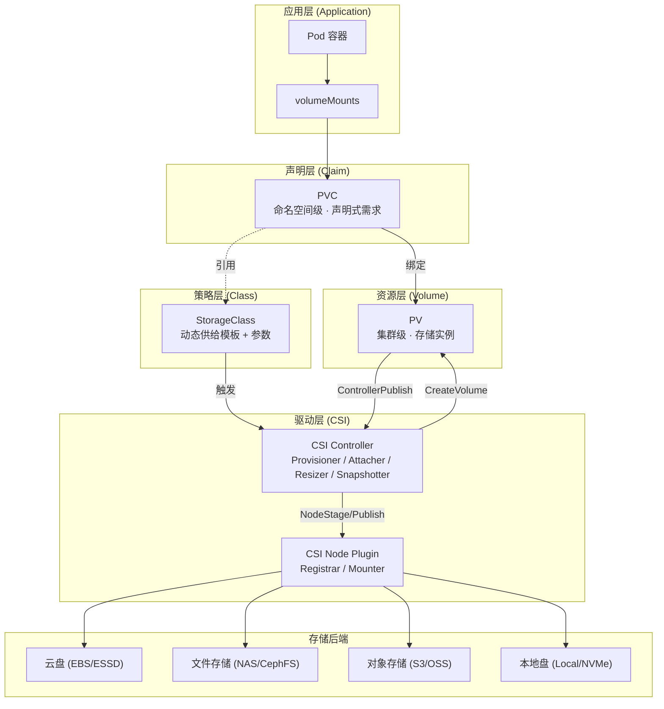
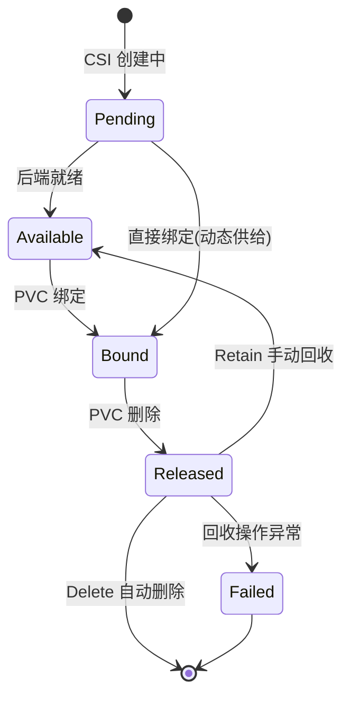
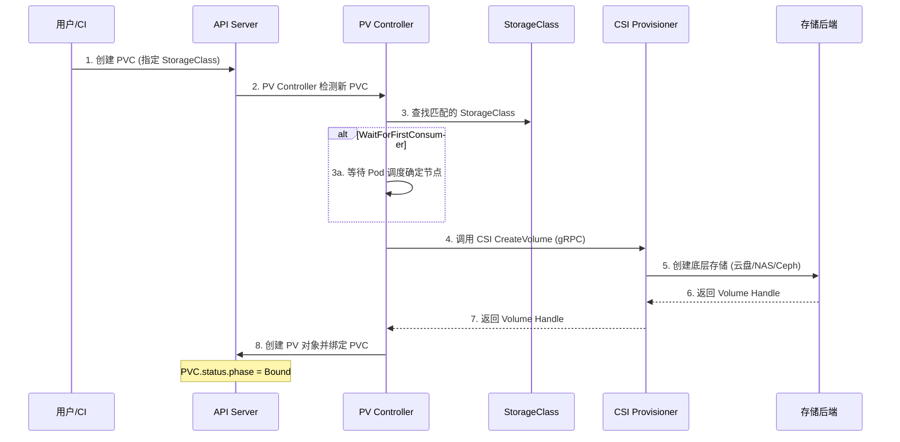
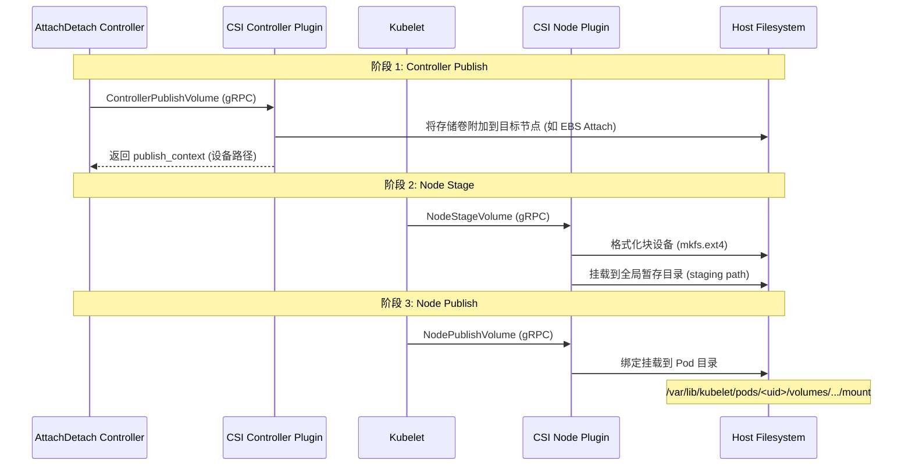
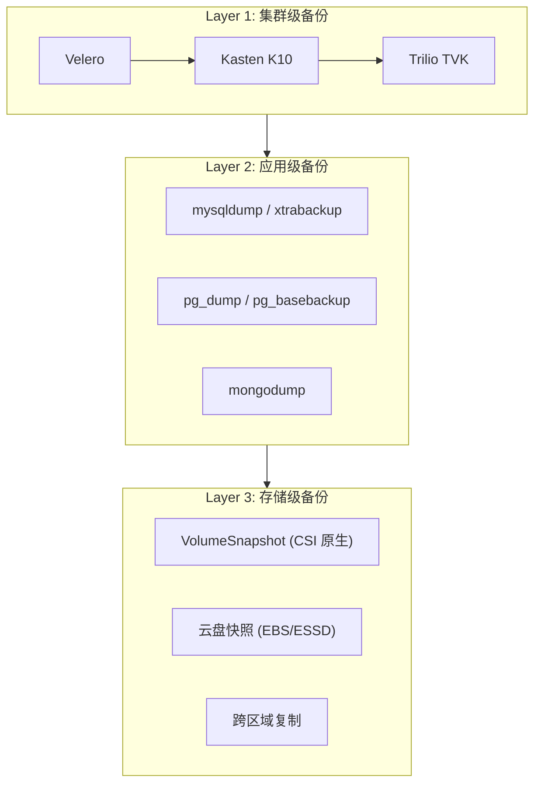
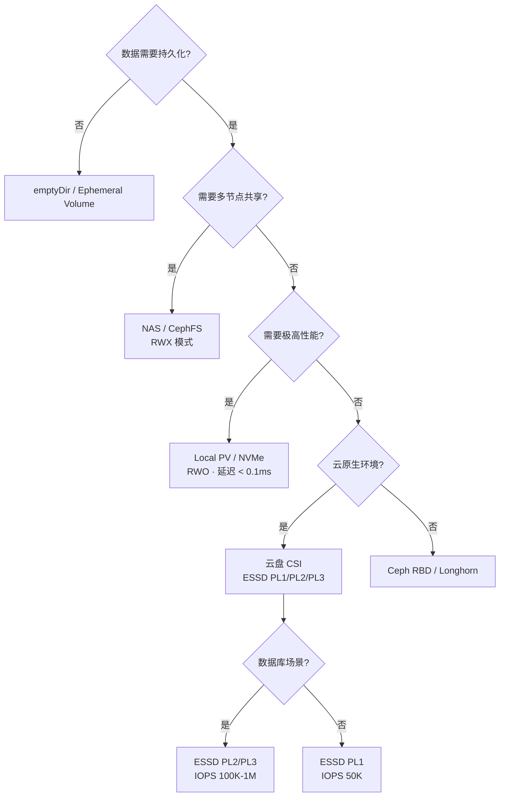

Kubernetes 存储体系是一套从声明到供给、从挂载到灾备的完整抽象栈——开发者通过 PVC 声明需求，平台工程师通过 StorageClass 定义策略，CSI 驱动将一切落地为存储后端操作。本文页站在高级开发者的视角，以**架构分层模型**为骨架，将知识库中 15 篇存储专题、17 篇存储字典条目、4 篇 YAML 清单、3 篇故障排查指南以及 CSI 深度实践论文串联为一幅完整的存储全景图。

Sources: [01-storage-architecture-overview.md](domain-04-storage-data/01-storage-architecture-overview.md#L1-L4), [README.md](domain-04-storage-data/README.md#L1-L10)

---

## 存储抽象栈：从应用到后端的全景架构

Kubernetes 存储设计的核心哲学是**解耦**：将存储供给（运维关注）与存储消费（开发关注）通过 PV/PVC 边界严格分离，再通过 StorageClass 桥接动态供给策略，最终由 CSI 标准接口将所有后端差异收敛为统一的 gRPC 调用。下面这张架构总览图展示了从 Pod 中容器挂载到物理存储的完整数据路径。



**关键抽象层级**中每一层都有明确的职责边界：**Volume** 是 Pod 内容器间共享存储的基础单元，生命周期与 Pod 绑定；**PVC** 作为命名空间级的声明式资源，将开发者的存储需求（容量、访问模式、性能等级）与底层实现完全隔离；**PV** 是集群级存储实例，承载实际的存储后端连接信息；**StorageClass** 作为动态供给的模板引擎，定义了 provisioner、回收策略、绑定模式和参数映射；**CSI Driver** 则是 Kubernetes 与存储后端之间的标准 gRPC 接口，所有 in-tree 插件已在 v1.26+ 废弃、v1.31+ 移除。

Sources: [01-storage-architecture-overview.md](domain-04-storage-data/01-storage-architecture-overview.md#L38-L54), [06-storage-fundamental-concepts.md](domain-04-storage-data/06-storage-fundamental-concepts.md#L18-L46), [persistent-volumes.md](topic-dictionary/storage/persistent-volumes.md#L1-L12)

---

## PV/PVC：声明式存储消费模型

### PersistentVolume 核心规格

PV 是集群管理员预置或动态供给创建的存储资源实例，其**生命周期独立于 Pod**，通过 `persistentVolumeReclaimPolicy` 控制回收行为。

| 字段 | 类型 | 必填 | 说明 |
|:---|:---|:---:|:---|
| `capacity.storage` | Quantity | 是 | 存储容量，如 `100Gi` |
| `accessModes` | []string | 是 | 访问模式：RWO / ROX / RWX / RWOP |
| `persistentVolumeReclaimPolicy` | string | 否 | 回收策略：Retain / Delete / Recycle(已弃用) |
| `storageClassName` | string | 否 | 关联的 StorageClass |
| `volumeMode` | string | 否 | 卷模式：Filesystem(默认) / Block |
| `mountOptions` | []string | 否 | 挂载选项如 `["noatime","discard"]` |
| `nodeAffinity` | NodeAffinity | 否 | 拓扑约束（Local PV 必须设置） |
| `csi` | CSIPersistentVolumeSource | 否 | CSI 卷配置 |

Sources: [02-pv-architecture-fundamentals.md](domain-04-storage-data/02-pv-architecture-fundamentals.md#L59-L71), [15-persistentvolume-reference.md](domain-18-manifests-patterns/15-persistentvolume-reference.md#L1-L10)

### PV 生命周期状态机

PV 在其生命周期中经历以下状态转换，理解这个状态机是排查存储问题的前提条件：



| 状态 (Phase) | 含义 | 触发条件 |
|:---|:---|:---|
| **Pending** | 等待中 | PV 创建中，后端存储尚未就绪 |
| **Available** | 可用 | PV 已就绪，等待 PVC 绑定 |
| **Bound** | 已绑定 | PV 已与 PVC 建立一对一绑定 |
| **Released** | 已释放 | PVC 已删除，PV 等待回收处理 |
| **Failed** | 失败 | 自动回收失败或后端存储错误 |

Sources: [02-pv-architecture-fundamentals.md](domain-04-storage-data/02-pv-architecture-fundamentals.md#L74-L106), [09-pv-pvc-troubleshooting.md](domain-04-storage-data/09-pv-pvc-troubleshooting.md#L18-L78)

### PVC 使用模式三分类

PVC 支持三种核心使用模式，按生产环境推荐程度排序如下：

**模式一：动态供给（Dynamic Provisioning）——生产首选**。开发者仅声明需求和 StorageClass，由 CSI Provisioner 自动创建底层存储和 PV 对象并完成绑定。这是现代云原生环境的标准做法。

```yaml
apiVersion: v1
kind: PersistentVolumeClaim
metadata:
  name: mysql-data
  namespace: production
spec:
  accessModes: [ReadWriteOnce]
  storageClassName: alicloud-disk-essd
  resources:
    requests:
      storage: 100Gi
```

**模式二：静态绑定（Static Binding）——NFS/遗留系统**。管理员预先创建 PV，PVC 通过 `volumeName` 或 `selector` 精确匹配。适用于 NFS、iSCSI 等非动态供给场景。

**模式三：标签选择器绑定（Selector Binding）——精细调度**。PVC 通过 `matchLabels` / `matchExpressions` 从多个候选 PV 中筛选，常用于 Local PV 按节点精确分配。

Sources: [03-pvc-patterns-practices.md](domain-04-storage-data/03-pvc-patterns-practices.md#L63-L162), [persistent-volumes.md](topic-dictionary/storage/persistent-volumes.md#L14-L22)

### PVC 规格字段速查

| 字段 | 类型 | 必填 | 说明 |
|:---|:---|:---:|:---|
| `accessModes` | []string | 是 | 访问模式：RWO/ROX/RWX/RWOP |
| `resources.requests.storage` | Quantity | 是 | 请求的存储容量 |
| `storageClassName` | string | 否 | 指定 StorageClass，空字符串禁用动态供给 |
| `volumeMode` | string | 否 | Filesystem(默认) / Block |
| `volumeName` | string | 否 | 静态绑定指定 PV 名称 |
| `selector` | LabelSelector | 否 | 标签选择器匹配 PV |
| `dataSource` | TypedLocalObjectReference | 否 | 克隆/恢复数据源 |
| `dataSourceRef` | TypedObjectReference | 否 | 跨命名空间数据源（v1.26+） |

Sources: [03-pvc-patterns-practices.md](domain-04-storage-data/03-pvc-patterns-practices.md#L47-L59), [16-persistentvolumeclaim-reference.md](domain-18-manifests-patterns/16-persistentvolumeclaim-reference.md#L1-L10)

### PV-PVC 绑定算法

PV Controller 在处理绑定时执行严格的多维匹配检查，优先级排序为**精确容量匹配 > 最小满足容量 > 先创建的 PV 优先**。绑定条件包括：StorageClass 名称一致、AccessModes 包含关系（PV ⊇ PVC）、容量满足（PV ≥ PVC）、Selector 标签匹配、VolumeMode 一致，以及 WaitForFirstConsumer 模式下的 NodeAffinity 拓扑匹配。

Sources: [02-pv-architecture-fundamentals.md](domain-04-storage-data/02-pv-architecture-fundamentals.md#L170-L198)

---

## 访问模式与回收策略深度矩阵

### 四种访问模式

| 模式 | 缩写 | 说明 | 典型场景 |
|:---:|:---|:---|:---|
| **ReadWriteOnce** | RWO | 单节点读写 | 数据库、有状态应用 |
| **ReadOnlyMany** | ROX | 多节点只读 | 静态资源、配置分发 |
| **ReadWriteMany** | RWX | 多节点读写 | 共享日志、媒体文件 |
| **ReadWriteOncePod** | RWOP | 单 Pod 独占读写（v1.27+ GA） | 严格单实例写场景 |

### 存储后端访问模式兼容性矩阵

| 存储类型 | RWO | ROX | RWX | RWOP | CSI 驱动 |
|:---|:---:|:---:|:---:|:---:|:---|
| 阿里云 ESSD | ✅ | ❌ | ❌ | ✅ | `diskplugin.csi.alibabacloud.com` |
| 阿里云 NAS | ✅ | ✅ | ✅ | ✅ | `nasplugin.csi.alibabacloud.com` |
| AWS EBS | ✅ | ❌ | ❌ | ✅ | `ebs.csi.aws.com` |
| AWS EFS | ✅ | ✅ | ✅ | ✅ | `efs.csi.aws.com` |
| Azure Disk | ✅ | ❌ | ❌ | ✅ | `disk.csi.azure.com` |
| Azure Files | ✅ | ✅ | ✅ | ✅ | `file.csi.azure.com` |
| GCP Persistent Disk | ✅ | ✅ | ❌ | ✅ | `pd.csi.storage.gke.io` |
| Ceph RBD | ✅ | ✅ | ❌ | ✅ | `rook-ceph.rbd.csi.ceph.com` |
| CephFS | ✅ | ✅ | ✅ | ✅ | `rook-ceph.cephfs.csi.ceph.com` |
| NFS | ✅ | ✅ | ✅ | ❌ | `nfs.csi.k8s.io` |
| Local PV | ✅ | ❌ | ❌ | ✅ | `kubernetes.io/no-provisioner` |

### 回收策略

| 策略 | 行为 | 数据安全 | 适用场景 |
|:---|:---|:---|:---|
| **Retain** | PVC 删除后保留 PV 和数据，需手动清理 | 高 | 生产环境、关键数据 |
| **Delete** | PVC 删除后自动删除 PV 和底层存储资产 | 低 | 临时数据、开发测试 |
| **Recycle** | 清空数据后重用（v1.14 已弃用） | 不推荐 | 不应使用 |

**生产环境铁律**：关键数据的 StorageClass 必须设置 `reclaimPolicy: Retain`，并在 PVC 创建后立即验证 PV 的回收策略。可通过 `kubectl patch pv <pv-name> -p '{"spec":{"persistentVolumeReclaimPolicy":"Retain"}}'` 动态修改。

Sources: [01-storage-architecture-overview.md](domain-04-storage-data/01-storage-architecture-overview.md#L171-L220), [02-pv-architecture-fundamentals.md](domain-04-storage-data/02-pv-architecture-fundamentals.md#L109-L143), [persistent-volumes.md](topic-dictionary/storage/persistent-volumes.md#L25-L33)

---

## StorageClass：动态供给的策略引擎

### 核心字段

| 字段 | 类型 | 必填 | 说明 |
|:---|:---|:---:|:---|
| `provisioner` | string | 是 | CSI 驱动名称 |
| `parameters` | map[string]string | 否 | 传递给 provisioner 的参数 |
| `reclaimPolicy` | string | 否 | 回收策略：Delete(默认) / Retain |
| `allowVolumeExpansion` | bool | 否 | 是否允许在线扩容（默认 false） |
| `volumeBindingMode` | string | 否 | Immediate(默认) / WaitForFirstConsumer |
| `allowedTopologies` | []TopologySelectorTerm | 否 | 拓扑约束（可用区限制） |
| `mountOptions` | []string | 否 | 挂载选项 |

Sources: [04-storageclass-dynamic-provisioning.md](domain-04-storage-data/04-storageclass-dynamic-provisioning.md#L58-L69), [17-storageclass-volumesnapshot.md](domain-18-manifests-patterns/17-storageclass-volumesnapshot.md#L35-L52)

### VolumeBindingMode：拓扑感知的关键

这是 StorageClass 中**最容易被忽视但影响最深远的配置**。

| 特性 | Immediate | WaitForFirstConsumer |
|:---|:---|:---|
| **绑定时机** | PVC 创建时 | Pod 调度确定节点后 |
| **拓扑感知** | 否——可能选择错误的可用区 | 是——根据 Pod 节点所在可用区创建存储 |
| **跨可用区风险** | 高 | 无 |
| **首次启动延迟** | 无 | 略有（需等待存储创建） |
| **适用场景** | 无拓扑约束的存储（NFS、CephFS） | 云盘、Local PV、多可用区集群 |

**生产环境强烈推荐** `WaitForFirstConsumer`。使用此模式时**不要在 Pod 规格中使用 `nodeName`** 直接指定节点，否则调度器被绕过、PVC 将永远 Pending。

Sources: [04-storageclass-dynamic-provisioning.md](domain-04-storage-data/04-storageclass-dynamic-provisioning.md#L72-L101), [storage-classes.md](topic-dictionary/storage/storage-classes.md#L34-L38)

### 动态供给全流程



Sources: [04-storageclass-dynamic-provisioning.md](domain-04-storage-data/04-storageclass-dynamic-provisioning.md#L18-L54)

### 多云 StorageClass 配置对照

知识库中提供了完整的云厂商 StorageClass 配置模板。以下是四大云平台的高性能存储类对比：

| 云厂商 | 高性能 StorageClass | Provisioner | 关键参数 | 最大 IOPS |
|:---|:---|:---|:---|:---:|
| **阿里云** | `alicloud-disk-essd-pl2` | `diskplugin.csi.alibabacloud.com` | `type: cloud_essd, performanceLevel: PL2` | 100,000 |
| **AWS** | `io2-high-perf` | `ebs.csi.aws.com` | `type: io2, iops: "64000"` | 64,000 |
| **Azure** | `ultra-ssd` | `disk.csi.azure.com` | `skuName: UltraSSD_LRS` | 160,000 |
| **GCP** | `pd-ssd` | `pd.csi.storage.gke.io` | `type: pd-ssd` | 100,000 |

Sources: [04-storageclass-dynamic-provisioning.md](domain-04-storage-data/04-storageclass-dynamic-provisioning.md#L104-L200), [17-storageclass-volumesnapshot.md](domain-18-manifests-patterns/17-storageclass-volumesnapshot.md#L83-L149)

---

## CSI 驱动体系：容器存储接口标准

### 存储接口演进历史

Kubernetes 存储插件经历了三个阶段：v1.0-v1.8 的 **In-Tree 插件**（代码耦合在 K8s 核心中，发布周期受限）、v1.9-v1.12 的 **FlexVolume + CSI 过渡期**、v1.13+ 的 **CSI Only**（统一接口，独立发布，解耦）。In-tree 插件在 v1.26 标记废弃，v1.31 已正式移除。

| CSI 版本 | Kubernetes 版本 | 状态 | 主要特性 |
|:---:|:---:|:---:|:---|
| v1.0 | 1.13 | GA | 稳定版本 |
| v1.1 | 1.14 | GA | Volume Expansion |
| v1.3 | 1.17 | GA | Volume Cloning |
| v1.4 | 1.18 | GA | Snapshot GA |
| v1.5 | 1.20 | GA | FSGroup Policy |
| v1.6 | 1.23 | GA | Volume Health |
| v1.7 | 1.24 | GA | ReadWriteOncePod |
| v1.8 | 1.27 | GA | SELinux Context |
| v1.9 | 1.29 | GA | VolumeAttributesClass |

Sources: [22-container-storage-deep-dive.md](domain-01-cluster-fundamentals/22-container-storage-deep-dive.md#L20-L64)

### CSI 架构组件

CSI 驱动由**控制器组件**（以 Deployment 方式运行）和**节点组件**（以 DaemonSet 方式运行）两大部分组成，通过 sidecar 容器桥接 Kubernetes 事件：

| 组件 | 部署方式 | 职责 |
|:---|:---|:---|
| **external-provisioner** | Deployment | 监听 PVC 创建，调用 `CreateVolume` |
| **external-attacher** | Deployment | 监听 VolumeAttachment，调用 `ControllerPublishVolume` |
| **external-resizer** | Deployment | 监听 PVC 扩容请求，调用 `ControllerExpandVolume` |
| **external-snapshotter** | Deployment | 监听 VolumeSnapshot，调用 `CreateSnapshot` |
| **node-driver-registrar** | DaemonSet | 向 kubelet 注册 CSI 驱动 |
| **livenessprobe** | Sidecar | CSI 驱动健康检查 |
| **CSI Driver** | 自定义 | 实现存储后端全部 gRPC 接口 |

Sources: [05-csi-drivers-integration.md](domain-04-storage-data/05-csi-drivers-integration.md#L19-L83), [18-csi-driver-resources.md](domain-18-manifests-patterns/18-csi-driver-resources.md#L14-L50)

### CSI 三阶段挂载流程

卷挂载是 CSI 中最关键的运行时操作，理解其三阶段流程是排查 `FailedMount` 事件的核心：



**卸载流程**严格反向执行：NodeUnpublishVolume → NodeUnstageVolume → ControllerUnpublishVolume。

Sources: [18-csi-driver-resources.md](domain-18-manifests-patterns/18-csi-driver-resources.md#L52-L80), [22-container-storage-deep-dive.md](domain-01-cluster-fundamentals/22-container-storage-deep-dive.md#L65-L100)

### CSI gRPC 接口一览

CSI 规范定义了三大 Service 接口，每个接口对应一组 RPC 调用：

**Identity Service**（驱动标识）：`GetPluginInfo`、`GetPluginCapabilities`、`Probe`

**Controller Service**（生命周期管理）：

| RPC | 说明 | 触发场景 |
|:---|:---|:---|
| `CreateVolume` | 创建存储卷 | PVC 创建 |
| `DeleteVolume` | 删除存储卷 | PV/PVC 删除 |
| `ControllerPublishVolume` | 挂载卷到节点 | Pod 调度 |
| `ControllerUnpublishVolume` | 从节点卸载 | Pod 删除 |
| `ControllerExpandVolume` | 扩容卷 | PVC 扩容 |
| `CreateSnapshot` | 创建快照 | VolumeSnapshot |
| `DeleteSnapshot` | 删除快照 | VolumeSnapshot 删除 |

**Node Service**（节点侧操作）：

| RPC | 说明 | 触发场景 |
|:---|:---|:---|
| `NodeStageVolume` | 格式化 + 挂载到暂存目录 | Pod 调度 |
| `NodeUnstageVolume` | 清理暂存目录 | Pod 删除 |
| `NodePublishVolume` | 绑定挂载到 Pod 目录 | Pod 启动 |
| `NodeUnpublishVolume` | 从 Pod 目录卸载 | Pod 删除 |
| `NodeGetVolumeStats` | 获取卷统计 | kubelet 监控 |
| `NodeExpandVolume` | 节点侧文件系统扩展 | 在线扩容 |

Sources: [05-csi-drivers-integration.md](domain-04-storage-data/05-csi-drivers-integration.md#L86-L124), [07-kubernetes-csi-storage-deep-practice.md](domain-19-landscape-references/07-kubernetes-csi-storage-deep-practice.md#L29-L63)

### CSIDriver 与 CSINode 资源

**CSIDriver** 是集群级资源，声明驱动的行为能力：

```yaml
apiVersion: storage.k8s.io/v1
kind: CSIDriver
metadata:
  name: ebs.csi.aws.com
spec:
  attachRequired: true              # 块存储需要 Attach → true; NFS → false
  podInfoOnMount: true              # 挂载时传递 Pod 信息
  volumeLifecycleModes:             # 支持的生命周期模式
  - Persistent                      # 持久卷 (PV/PVC)
  - Ephemeral                       # 临时卷 (inline CSI)
  fsGroupPolicy: File               # FSGroup 策略 (v1.23+ GA)
  storageCapacity: true             # 报告存储容量 (v1.24+ GA)
  seLinuxMount: false               # SELinux 挂载支持
```

**CSINode** 由 node-driver-registrar 自动创建，记录每个节点上可用的 CSI 驱动及其拓扑信息。`CSIStorageCapacity`（v1.24+ GA）则让调度器能感知存储容量约束，避免将 Pod 调度到存储不足的拓扑域。

Sources: [18-csi-driver-resources.md](domain-18-manifests-patterns/18-csi-driver-resources.md#L89-L150), [01-storage-architecture-overview.md](domain-04-storage-data/01-storage-architecture-overview.md#L310-L346)

---

## 存储高级特性：快照、克隆与扩容

### 卷快照体系（Volume Snapshot）

快照体系由三个 CRD 组成，其关系类比 PV/PVC/StorageClass：**VolumeSnapshot** ≈ PVC（用户请求），**VolumeSnapshotContent** ≈ PV（实际快照），**VolumeSnapshotClass** ≈ StorageClass（策略模板）。快照功能**仅支持 CSI 驱动**，in-tree 插件不支持。

```yaml
# 1. VolumeSnapshotClass 定义快照策略
apiVersion: snapshot.storage.k8s.io/v1
kind: VolumeSnapshotClass
metadata:
  name: production-snapshot-class
  annotations:
    snapshot.storage.kubernetes.io/is-default-class: "true"
driver: diskplugin.csi.alibabacloud.com
deletionPolicy: Retain  # 生产环境建议 Retain
parameters:
  instantAccess: "true"
---
# 2. 创建快照
apiVersion: snapshot.storage.k8s.io/v1
kind: VolumeSnapshot
metadata:
  name: data-snapshot-20260421
  namespace: production
spec:
  volumeSnapshotClassName: production-snapshot-class
  source:
    persistentVolumeClaimName: data-pvc
---
# 3. 从快照恢复新 PVC
apiVersion: v1
kind: PersistentVolumeClaim
metadata:
  name: data-pvc-restored
spec:
  storageClassName: alicloud-disk-essd
  dataSource:
    name: data-snapshot-20260421
    kind: VolumeSnapshot
    apiGroup: snapshot.storage.k8s.io
  accessModes: [ReadWriteOnce]
  resources:
    requests:
      storage: 100Gi
```

Sources: [11-storage-advanced-features.md](domain-04-storage-data/11-storage-advanced-features.md#L18-L42), [volume-snapshots.md](topic-dictionary/storage/volume-snapshots.md#L1-L46), [01-storage-architecture-overview.md](domain-04-storage-data/01-storage-architecture-overview.md#L387-L436)

### 卷克隆（Volume Cloning）

CSI 卷克隆允许从现有 PVC 创建精确副本，要求源 PVC 和目标 PVC 在**同一命名空间**，源 PVC 处于 **Bound 状态且未被使用**，目标容量 ≥ 源容量。克隆完成后，新 PVC 完全独立，源 PVC 的任何变更不影响克隆。

```yaml
apiVersion: v1
kind: PersistentVolumeClaim
metadata:
  name: db-data-clone
  namespace: staging
spec:
  accessModes: [ReadWriteOnce]
  storageClassName: gp3-encrypted
  resources:
    requests:
      storage: 100Gi
  dataSource:
    kind: PersistentVolumeClaim
    name: db-data          # 源 PVC（同命名空间）
```

Sources: [11-storage-advanced-features.md](domain-04-storage-data/11-storage-advanced-features.md#L94-L113), [csi-volume-cloning.md](topic-dictionary/storage/csi-volume-cloning.md#L1-L22)

### 在线扩容（Volume Expansion）

扩容三前提：StorageClass 设置 `allowVolumeExpansion: true`、CSI 驱动支持 `ControllerExpandVolume`、底层存储支持在线扩容。操作流程为修改 PVC 的 `resources.requests.storage` → 观察 PVC 状态从 `Resizing` 经 `FileSystemResizePending` 到 `Bound` → 某些文件系统需要重启 Pod 完成文件系统层扩展。

**关键约束**：Kubernetes **不支持 PVC 缩容**；云盘每次扩容最少增加 10GB；扩容期间可能有短暂 I/O 抖动。

Sources: [11-storage-advanced-features.md](domain-04-storage-data/11-storage-advanced-features.md#L157-L180), [persistent-volumes.md](topic-dictionary/storage/persistent-volumes.md#L44-L48)

### 临时卷（Ephemeral Volumes）

对于生命周期绑定 Pod 的临时存储需求，知识库中记录了三类临时卷：

| 类型 | 机制 | 存储容量感知 | 适用场景 |
|:---|:---|:---:|:---|
| **emptyDir** | kubelet 本地管理 | ❌ | 缓存、临时工作区 |
| **CSI Ephemeral** | Pod 内联 `csi` 卷 | ❌ | 需要 CSI 特殊能力的临时空间 |
| **Generic Ephemeral** | `ephemeral.volumeClaimTemplate` | ✅ | 需要调度器感知的临时持久存储 |

Sources: [ephemeral-volumes.md](topic-dictionary/storage/ephemeral-volumes.md#L1-L50)

---

## 灾备恢复：从 RPO/RTO 到多层防御

### 三层备份策略架构



**Layer 1 集群级备份**（Velero/Kasten/Trilio）覆盖 Kubernetes 资源清单 + PV 数据，适合集群迁移和整体恢复。**Layer 2 应用级备份**（mysqldump/pg_dump）在应用层保证数据一致性，适合逻辑恢复。**Layer 3 存储级备份**（VolumeSnapshot/云盘快照/跨区域复制）在存储后端层面操作，速度最快但粒度最粗。

Sources: [10-storage-backup-disaster-recovery.md](domain-04-storage-data/10-storage-backup-disaster-recovery.md#L18-L50)

### RPO/RTO 指标与备份策略对照

| 备份策略 | 典型 RPO | 典型 RTO | 成本 | 适用场景 |
|:---|:---:|:---:|:---:|:---|
| **实时复制** | 0 | 分钟级 | 高 | 核心交易系统 |
| **持续备份** | 分钟 | 小时级 | 中高 | 重要业务系统 |
| **每小时快照** | 1 小时 | 小时级 | 中 | 一般生产系统 |
| **每日备份** | 24 小时 | 天级 | 低 | 开发测试环境 |

Sources: [10-storage-backup-disaster-recovery.md](domain-04-storage-data/10-storage-backup-disaster-recovery.md#L54-L69)

### Velero 企业备份方案

Velero 是知识库中推荐的集群级备份工具，架构包含 Backup Controller、Restore Controller、Schedule Controller 三大控制器，将备份数据存入 BackupStorageLocation（OSS/S3/GCS/Azure Blob），卷快照存入 VolumeSnapshotLocation。

```bash
# Velero 安装（阿里云）
velero install \
  --provider alibabacloud \
  --plugins registry.cn-hangzhou.aliyuncs.com/acs/velero-plugin-alibabacloud:v1.8 \
  --bucket velero-backup-bucket \
  --secret-file ./credentials-velero \
  --backup-location-config region=cn-hangzhou \
  --snapshot-location-config region=cn-hangzhou \
  --use-volume-snapshots=true \
  --use-node-agent
```

生产环境建议的定时备份策略：**每日全量备份**（凌晨 2 点，保留 30 天）+ **每小时增量备份**（关键命名空间，保留 7 天）+ **每周归档**（长期保留，加密压缩）。

Sources: [10-storage-backup-disaster-recovery.md](domain-04-storage-data/10-storage-backup-disaster-recovery.md#L72-L200)

### 灾备架构三等级

```
主数据中心 ──实时同步──→ 同城灾备中心 ──异步复制──→ 异地灾备中心
    ↓                        ↓                        ↓
  同城双活                 同城灾备                  异地灾备
  RPO: 0s                 RPO: 5m                  RPO: 30m
  RTO: 2m                 RTO: 15m                 RTO: 2h
```

Sources: [15-storage-disaster-recovery.md](domain-04-storage-data/15-storage-disaster-recovery.md#L18-L64)

---

## 故障排查关键路径

### 存储事件速查索引

Kubernetes 存储系统的可观测性主要通过事件（Events）体现，关键事件及其排障指向如下：

| 问题场景 | 关注事件 | 事件来源 |
|:---|:---|:---|
| Pod 无法启动（卷未挂载） | `FailedAttachVolume`, `FailedMount` | kubelet |
| PVC 一直 Pending | `ProvisioningFailed`, `FailedBinding`, `WaitForFirstConsumer` | persistentvolume-controller |
| 卷扩容失败 | `VolumeResizeFailed`, `FileSystemResizeFailed` | kubelet |
| 卷无法删除 | `VolumeFailedDelete` | persistentvolume-controller |
| CSI 驱动异常 | `FailedMapVolume`, CSI Pod CrashLoop | kubelet |

Sources: [11-storage-volume-events.md](domain-17-system-foundation/11-storage-volume-events.md#L23-L71)

### 诊断命令速查

```bash
# 1. PVC/PV 状态
kubectl get pvc -A
kubectl describe pvc <pvc-name> -n <ns>

# 2. CSI 驱动状态
kubectl get csidriver,csinode
kubectl get pods -n kube-system | grep csi

# 3. VolumeAttachment（排查挂载残留）
kubectl get volumeattachment
kubectl describe volumeattachment <va-name>

# 4. 节点侧设备状态
kubectl debug node/<node-name> -it --image=busybox
chroot /host && lsblk && mount | grep kubelet

# 5. CSI Controller 日志
kubectl logs -n kube-system csi-diskplugin-xxxx -c disk-plugin
kubectl logs -n kube-system csi-diskplugin-xxxx -c disk-provisioner
```

Sources: [01-storage-architecture-overview.md](domain-04-storage-data/01-storage-architecture-overview.md#L602-L637), [07-storage-daily-operations.md](domain-04-storage-data/07-storage-daily-operations.md#L18-L51)

### 常见错误与解决方案

| 错误信息 | 根因 | 解决方案 |
|:---|:---|:---|
| `waiting for a volume to be created` | PVC 等待 PV 绑定 | 检查 StorageClass 和 provisioner 状态 |
| `FailedAttachVolume` | 卷无法附加到节点 | 检查 CSI 驱动、节点可用区、云盘配额 |
| `FailedMount` | 卷无法挂载到容器 | 检查权限、文件系统类型、mountOptions |
| `Multi-Attach error` | RWO 卷被多节点同时挂载 | 等待旧 Pod 终止或手动清理 VolumeAttachment |
| `Volume is already attached` | 云盘未正确卸载 | 手动 detach 云盘或清理残留 VolumeAttachment |

Sources: [01-storage-architecture-overview.md](domain-04-storage-data/01-storage-architecture-overview.md#L639-L668), [09-pv-pvc-troubleshooting.md](domain-04-storage-data/09-pv-pvc-troubleshooting.md#L1-L15)

---

## 数据持久化决策树



Sources: [01-storage-architecture-overview.md](domain-04-storage-data/01-storage-architecture-overview.md#L771-L793)

---

## 知识库资源导航

本页面的内容提炼自知识库中以下核心资源，建议按需深入研读：

### 存储架构与概念

| 文档 | 核心内容 | 路径 |
|:---|:---|:---|
| 存储架构概览 | PV/PVC/SC 完整配置、性能优化、故障排查 | [01-storage-architecture-overview.md](domain-04-storage-data/01-storage-architecture-overview.md) |
| PV 核心概念 | PV 分层模型、绑定算法、状态机 | [02-pv-architecture-fundamentals.md](domain-04-storage-data/02-pv-architecture-fundamentals.md) |
| PVC 使用模式 | 三种绑定模式、StatefulSet volumeClaimTemplates | [03-pvc-patterns-practices.md](domain-04-storage-data/03-pvc-patterns-practices.md) |
| 存储基础概念 | 抽象层次、供给方式、生命周期 | [06-storage-fundamental-concepts.md](domain-04-storage-data/06-storage-fundamental-concepts.md) |

### StorageClass 与动态供给

| 文档 | 核心内容 | 路径 |
|:---|:---|:---|
| StorageClass 动态供给 | VolumeBindingMode、多云配置、多租户策略 | [04-storageclass-dynamic-provisioning.md](domain-04-storage-data/04-storageclass-dynamic-provisioning.md) |
| StorageClass YAML 参考 | 全字段解析、主流云厂商参数 | [17-storageclass-volumesnapshot.md](domain-18-manifests-patterns/17-storageclass-volumesnapshot.md) |

### CSI 驱动

| 文档 | 核心内容 | 路径 |
|:---|:---|:---|
| CSI 驱动集成 | 架构组件、gRPC 接口、部署配置 | [05-csi-drivers-integration.md](domain-04-storage-data/05-csi-drivers-integration.md) |
| CSI 深度解析 | 接口规范、三阶段挂载、驱动开发 | [22-container-storage-deep-dive.md](domain-01-cluster-fundamentals/22-container-storage-deep-dive.md) |
| CSI YAML 参考 | CSIDriver/CSINode/CSIStorageCapacity | [18-csi-driver-resources.md](domain-18-manifests-patterns/18-csi-driver-resources.md) |
| CSI 深度实践论文 | 驱动开发、生产案例、高级特性 | [07-kubernetes-csi-storage-deep-practice.md](domain-19-landscape-references/07-kubernetes-csi-storage-deep-practice.md) |

### 高级特性与灾备

| 文档 | 核心内容 | 路径 |
|:---|:---|:---|
| 存储高级特性 | 快照、克隆、扩容、加密 | [11-storage-advanced-features.md](domain-04-storage-data/11-storage-advanced-features.md) |
| 存储备份与灾难恢复 | Velero 方案、RPO/RTO、备份策略 | [10-storage-backup-disaster-recovery.md](domain-04-storage-data/10-storage-backup-disaster-recovery.md) |
| 存储灾备与迁移 | 三级灾备、数据同步、业务连续性 | [15-storage-disaster-recovery.md](domain-04-storage-data/15-storage-disaster-recovery.md) |

### 故障排查

| 文档 | 核心内容 | 路径 |
|:---|:---|:---|
| PV/PVC 故障排查 | 状态机分析、常见错误、解决方案 | [09-pv-pvc-troubleshooting.md](domain-04-storage-data/09-pv-pvc-troubleshooting.md) |
| 存储卷事件 | 完整事件索引、排查路径 | [11-storage-volume-events.md](domain-17-system-foundation/11-storage-volume-events.md) |
| CSI FTA 故障树 | 演绎式故障分析树 | [csi-fta.md](topic-fta/list/csi-fta.md) |
| CSI 故障排查 | 配置优先方法论 | [02-csi-troubleshooting.md](topic-structural-trouble-shooting/04-storage/02-csi-troubleshooting.md) |

---

## 延伸阅读与学习路径

存储体系并非孤立存在，它与 Kubernetes 的多个子系统深度交互。以下是建议的进阶阅读路径：

- **继续深入控制平面**：阅读 [控制平面深度剖析](7-kong-zhi-ping-mian-shen-du-pou-xi-api-server-scheduler-kcm-yu-cri-csi-cni)，理解 PV Controller、AttachDetach Controller 与 Scheduler 如何协同完成存储调度
- **有状态应用编排**：阅读 [工作负载管理](8-gong-zuo-fu-zai-guan-li-pod-sheng-ming-zhou-qi-diao-du-ce-lue-yu-dan-xing-shen-suo)，掌握 StatefulSet 的 `volumeClaimTemplates` 如何实现 PVC 的有序管理
- **故障排查方法论**：阅读 [结构化故障排查](15-jie-gou-hua-gu-zhang-pai-cha-pei-zhi-you-xian-fang-fa-lun-yu-quan-zu-jian-pai-zhang-zhi-nan)，学习配置优先方法论下的存储问题诊断
- **YAML 配置清单**：阅读 [YAML 配置清单](29-yaml-pei-zhi-qing-dan-kubernetes-quan-zi-yuan-zi-duan-can-kao-shou-ce)，查阅 PV、PVC、StorageClass、VolumeSnapshot 的完整字段参考
- **云厂商实践**：阅读 [云厂商托管 Kubernetes 服务](22-yun-han-shang-tuo-guan-kubernetes-fu-wu-quan-jing-dui-bi-13-jia-han-shang)，对比各云平台的存储 CSI 驱动差异与最佳实践
- **底层存储基础**：阅读 [Linux 系统与网络/存储基础](24-linux-xi-tong-yu-wang-luo-cun-chu-ji-chu-cong-nei-he-dao-rong-qi-yun-xing-shi)，理解块设备、文件系统、iSCSI 等存储基础知识