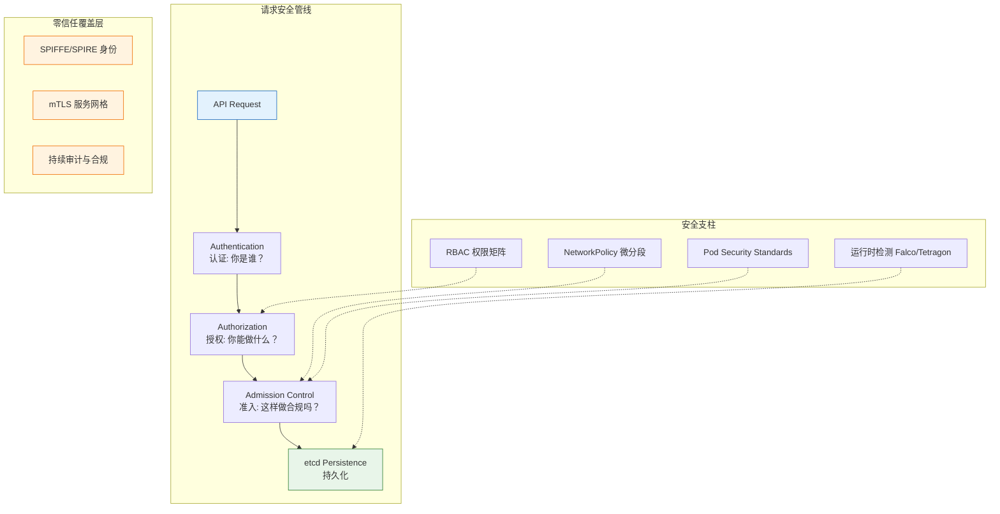

Kubernetes 安全是一个**纵深防御**的多层体系——从 API Server 认证授权入口的 RBAC 权限管控，到 NetworkPolicy 实现的微分段网络隔离，再到 Seccomp/AppArmor/Falco 构建的运行时威胁检测防线，最终收敛于"永不信任、始终验证"的零信任架构。本页作为安全知识域的总览，梳理四大安全支柱的核心概念、关键工具链与学习路径，帮助中级开发者建立系统化的安全思维框架。本知识域共覆盖 **domain-7-security** 的 21 篇文档、**domain-25-cloud-native-security** 的 5 篇企业级安全工具深度指南，以及跨域的零信任与 CIS 基准合规实践。

Sources: [README.md](domain-7-security/README.md#L1-L115)

## 安全架构总览：四层纵深防御模型

Kubernetes 的安全体系遵循"**身份认证 → 授权控制 → 准入拦截 → 运行时防护**"的请求处理管线。每一个 API 请求在到达 etcd 持久化之前，都必须经过认证（Authentication）识别身份、授权（Authorization）校验权限、准入控制（Admission Control）执行策略校验这三道关卡。理解这条管线是掌握所有后续安全主题的认知基石。



上述管线中的每一层都有对应的安全文档支撑。下表总结了本知识域的四个安全支柱及其核心组件：

| 安全支柱 | 核心机制 | 关键资源 | 威胁应对 |
|---------|---------|---------|---------|
| **身份与授权 (RBAC)** | Role/ClusterRole + RoleBinding/ClusterRoleBinding | `rbac.authorization.k8s.io` API 组 | 未授权访问、权限提升 |
| **网络安全策略** | NetworkPolicy + CNI 插件 + Service Mesh mTLS | `networking.k8s.io` API 组 | 横向移动、数据外泄 |
| **运行时安全防护** | SecurityContext + Falco + Seccomp/AppArmor | Pod Security Standards | 容器逃逸、恶意进程 |
| **零信任架构** | SPIFFE/SPIRE + OIDC + 动态策略引擎 | 跨层身份联邦 | 假设已被入侵的安全建模 |

Sources: [01-authentication-authorization-system.md](domain-7-security/01-authentication-authorization-system.md#L1-L60), [02-network-security-policies.md](domain-7-security/02-network-security-policies.md#L1-L55), [03-runtime-security-defense.md](domain-7-security/03-runtime-security-defense.md#L1-L61)

## 第一支柱：RBAC 权限管控体系

### 认证与授权的双层模型

Kubernetes 的认证机制支持多种身份凭证类型——X.509 客户端证书、Bearer Token（含 JWT）、Bootstrap Token、ServiceAccount Token，以及通过 Webhook 和 OIDC 对接外部身份提供商。在生产环境中，推荐使用 OIDC（如 Dex + LDAP/AD 集成）统一管理用户身份，ServiceAccount Token 则用于 Pod 内部工作负载的 API 访问。自 v1.24 起，ServiceAccount Token 默认采用 Bound ServiceAccount Token 机制（JWT 格式、可配置 audience 和有效期），替代了早期版本中存储在 Secret 中的静态 Token。

Sources: [01-authentication-authorization-system.md](domain-7-security/01-authentication-authorization-system.md#L62-L100)

授权层面，**RBAC**（Role-Based Access Control）是 Kubernetes 推荐且最广泛使用的授权模式。RBAC 的核心对象模型是四元组：**Subject（主体）→ Role（角色）→ Rule（规则）→ Resource（资源）**，通过 RoleBinding 和 ClusterRoleBinding 将 Subject（用户/组/ServiceAccount）与 Role/ClusterRole 绑定。

### 内置 ClusterRole 与权限矩阵

Kubernetes 提供了一组内置 ClusterRole，从 `cluster-admin`（全部权限）到 `view`（只读权限），形成了清晰的权限梯度。下表展示了四个核心内置角色的权限边界与安全风险：

| 角色 | 权限范围 | 典型授予对象 | 风险等级 | 关键危险操作 |
|------|---------|------------|---------|-------------|
| `cluster-admin` | 全部资源、全部操作、全部命名空间 | 超级管理员（紧急运维） | ⚠️ 极高 | 节点删除、etcd 直访、RBAC 修改 |
| `admin` | 命名空间内全部权限 + RBAC 管理 | 项目管理员 | 🔴 高 | Secret 访问、RoleBinding 创建 |
| `edit` | 读写大部分资源（不含 RBAC） | 开发人员 | 🟡 中 | Pod exec、Secret 读取 |
| `view` | 只读大部分资源（不含 Secret） | 查看人员/审计 | 🟢 低 | 敏感信息可能通过日志泄露 |

Sources: [07-rbac-matrix-configuration.md](domain-7-security/07-rbac-matrix-configuration.md#L1-L99)

### 最小权限原则与常见反模式

RBAC 最佳实践的核心是**最小权限原则**：每个工作负载使用独立的 ServiceAccount，仅授予必需的 verbs 和 resources。几个常见的反模式需要严格避免：

- **过度使用 cluster-admin**：日常操作应使用受限角色，cluster-admin 仅限紧急运维场景
- **共享 default ServiceAccount**：每个工作负载应创建专用 SA，禁用自动挂载 Token（`automountServiceAccountToken: false`）
- **宽松的 Secret 访问**：edit 角色默认可读取 Secret，需通过策略引擎进一步限制
- **危险权限组合**：`secrets` + `pods/exec` + `pods/attach` 的组合等同于容器内代码执行 + 凭据窃取

Sources: [08-security-best-practices.md](domain-7-security/08-security-best-practices.md#L24-L33), [07-rbac-matrix-configuration.md](domain-7-security/07-rbac-matrix-configuration.md#L50-L99)

排查 RBAC 权限问题时，使用 `kubectl auth can-i --list --as=<user> -n <namespace>` 可以快速列出某用户在特定命名空间内的所有权限，这是排查 Forbidden 错误的首选命令。详细的 RBAC 排障流程参见 [结构化故障排查：配置优先方法论与全组件排障指南](15-jie-gou-hua-gu-zhang-pai-cha-pei-zhi-you-xian-fang-fa-lun-yu-quan-zu-jian-pai-zhang-zhi-nan)。

## 第二支柱：网络安全策略

### NetworkPolicy 与微分段隔离

NetworkPolicy 是 Kubernetes 原生的网络流量控制机制，它以**白名单**模型工作——一旦 Pod 被 NetworkPolicy 选中，只有策略明确允许的流量才能通过，其余全部拒绝。生产环境的网络安全基础是建立三层策略体系：

| 策略层级 | 目的 | 示例配置 |
|---------|------|---------|
| **默认拒绝** | 基线隔离，拒绝所有入站/出站流量 | `podSelector: {}` + 空 rules |
| **命名空间隔离** | 阻止跨命名空间随意通信 | `namespaceSelector` 限定来源 |
| **应用级白名单** | 精确允许特定微服务间通信 | `podSelector.matchLabels: {app: backend}` |

Sources: [02-network-security-policies.md](domain-7-security/02-network-security-policies.md#L57-L120)

NetworkPolicy 的实现依赖于 CNI 插件。不同 CNI 的策略能力差异显著：

| CNI 插件 | NetworkPolicy 支持 | 扩展能力 | 推荐场景 |
|----------|-------------------|---------|---------|
| **Calico** | 完整支持 + 全局策略 + BGPSec | GlobalNetworkPolicy、策略优先级 | 企业网络、BGP 组网 |
| **Cilium** | 完整支持 + eBPF 高性能 | CiliumNetworkPolicy、L7 策略、身份感知 | 高性能、可观测性需求 |
| **Flannel** | 不支持原生 NetworkPolicy | 需额外部署 Calico 等策略层 | 简单网络、开发环境 |

### 纵深防御与 Service Mesh mTLS

网络安全不只停留在 NetworkPolicy 层面。完整的纵深防御体系覆盖**边界层 → 集群层 → 节点层 → 应用层**四个层次，每一层都部署独立的防护机制。在集群层，Service Mesh（Istio/Linkerd/Cilium）通过自动 mTLS 实现服务间通信加密，配合流量治理策略（如 AuthorizationPolicy）实现基于身份的 L7 访问控制——这是 NetworkPolicy（L3/L4）的重要补充。

Sources: [18-network-defense-depth.md](domain-7-security/18-network-defense-depth.md#L1-L93)

对于网络策略的 YAML 配置细节，完整的字段参考请查阅 [YAML 配置清单：Kubernetes 全资源字段参考手册](29-yaml-pei-zhi-qing-dan-kubernetes-quan-zi-yuan-zi-duan-can-kao-shou-ce)。

## 第三支柱：运行时安全防护

### Pod Security Standards 与 SecurityContext

运行时安全的第一道防线是 **Pod Security Standards**（PSS）——自 v1.25 起替代已废弃的 PodSecurityPolicy（PSP），PSS 定义了三个安全级别：

| 级别 | 限制程度 | 核心要求 | 适用场景 |
|------|---------|---------|---------|
| **Privileged** | 无限制 | 无 | 系统组件、CNI 插件 |
| **Baseline** | 基础限制 | 禁止 hostNetwork/hostPID/hostIPC、禁止特权容器 | 一般工作负载 |
| **Restricted** | 严格限制 | 必须非 root 运行、只读根文件系统、仅允许 NET_BIND_SERVICE capability | 安全敏感工作负载 |

PSS 通过命名空间标签 `pod-security.kubernetes.io/<MODE>: <LEVEL>` 执行，支持三种模式：**enforce**（拒绝违规 Pod）、**audit**（记录审计事件）、**warn**（返回警告）。生产环境推荐在 enforce 模式下至少使用 Baseline 级别。

Sources: [06-pod-security-standards.md](domain-7-security/06-pod-security-standards.md#L1-L100)

在 Pod 层面，**SecurityContext** 提供了细粒度的安全配置：`runAsNonRoot: true` 防止以 root 运行，`readOnlyRootFilesystem: true` 阻止恶意文件写入，`capabilities: {drop: [ALL], add: [NET_BIND_SERVICE]}` 实现最小 Linux 能力集。配合 Seccomp（系统调用过滤）和 AppArmor/SELinux（强制访问控制），构建了容器内部的深度防护。

Sources: [03-runtime-security-defense.md](domain-7-security/03-runtime-security-defense.md#L63-L120)

### 运行时威胁检测

即便配置了严格的 SecurityContext，仍需部署运行时威胁检测工具捕获异常行为。主流工具对比：

| 工具 | 检测原理 | 性能开销 | 核心能力 |
|------|---------|---------|---------|
| **Falco** | eBPF/Syscall 监控 | 低-中 | 丰富的规则引擎、CNCF 毕业项目 |
| **Tetragon** | eBPF 网络追踪 | 低 | Cilium 生态集成、进程级追踪 |
| **KubeArmor** | LSM/eBPF | 低 | Kubernetes 原生、策略阻断能力 |
| **Sysdig** | eBPF 全栈 | 中 | 商业平台、合规报告 |

Falco 的典型规则覆盖场景包括：容器内启动 shell（`Terminal shell in container`）、敏感文件读取（`Read sensitive file`）、网络连接异常（`Outbound connection to suspicious IP`）等。检测结果可集成到 SIEM/SOAR 平台实现自动化响应。

Sources: [15-runtime-security-detection.md](domain-7-security/15-runtime-security-detection.md#L1-L100)

### 镜像安全扫描

运行时安全的起点是**镜像安全**。在镜像进入集群之前，CI/CD 流水线应集成漏洞扫描工具（Trivy/Clair/Anchore），对已知 CVE 和配置缺陷进行拦截。Harbor 等企业级镜像仓库支持内置扫描和镜像签名验证（Cosign/Sigstore），配合准入控制器（如 Kyverno 的 `verifyImages` 规则）实现"未扫描不部署"的强制策略。

Sources: [13-image-security-scanning.md](domain-7-security/13-image-security-scanning.md#L1-L70)

## 第四支柱：零信任架构

### 核心原则与成熟度模型

零信任架构的核心信条是 **"Never Trust, Always Verify"**——不再依赖网络边界作为信任锚点，而是基于身份、设备、上下文进行持续验证。在 Kubernetes 环境中，零信任通过 SPIFFE/SPIRE 提供工作负载身份、Service Mesh 实现 mTLS 加密、策略引擎执行动态访问控制。

| 成熟度等级 | 特征 | 实施重点 | 预估时间 |
|-----------|------|---------|---------|
| **Level 1** | 基础身份认证 | 用户认证 + 基本 RBAC | 2-3 个月 |
| **Level 2** | 设备信任评估 | 终端检测 + 设备注册 | 3-6 个月 |
| **Level 3** | 动态访问控制 | 上下文感知 + 实时决策 | 6-12 个月 |
| **Level 4** | 持续风险评估 | 行为分析 + 威胁检测 | 12-18 个月 |

Sources: [19-zero-trust-architecture.md](domain-7-security/19-zero-trust-architecture.md#L1-L96)

### 身份联邦与多集群安全

企业级零信任实施需要统一身份联邦——通过 Dex/Keycloak 聚合 LDAP、OIDC、SAML 等多种认证源，配合 RBAC 在多个集群间实现一致的权限策略。SPIRE Agent 在每个节点上为工作负载签发 SVID（SPIFFE Verifiable Identity Document），实现**基于身份而非基于网络**的服务间认证。

在多集群环境中，安全策略的管理复杂度呈指数增长。推荐采用 Hub-Spoke 模型：中心管理集群（ACM/Rancher/GitOps）统一分发 OPA/Kyverno 策略，各业务集群通过 Agent 同步执行，确保安全基线的一致性。

Sources: [21-multicluster-security.md](domain-7-security/21-multicluster-security.md#L1-L80), [07-zero-trust-security-architecture.md](domain-18-production-operations/07-zero-trust-security-architecture.md#L1-L80)

## 策略引擎与合规自动化

### OPA/Gatekeeper vs Kyverno 选型

策略引擎是实现"安全即代码"的关键基础设施。两大主流方案的对比：

| 维度 | OPA/Gatekeeper | Kyverno |
|------|---------------|---------|
| **策略语言** | Rego（通用策略语言） | YAML/CEL（K8s 原生） |
| **学习曲线** | 高（需掌握 Rego） | 低（K8s 管理员友好） |
| **策略类型** | validate + mutate + audit | validate + mutate + generate + verifyImages |
| **K8s 集成** | Webhook 方式 | Webhook 方式，更原生 |
| **适用场景** | 跨平台策略复用 | K8s 专用、快速落地 |
| **社区成熟度** | CNCF 毕业，生态丰富 | CNCF 孵化，增长迅速 |

此外，Kubernetes v1.30 将 **ValidatingAdmissionPolicy** 提升为 GA，提供了无需外部依赖的原生策略验证能力，适合简单校验场景（如标签检查、资源限制检查）。

Sources: [14-policy-engines-opa-kyverno.md](domain-7-security/14-policy-engines-opa-kyverno.md#L1-L100)

### 合规框架与审计日志

合规审计是安全体系的"可验证性"保障。Kubernetes 原生审计日志（Audit Policy）通过 `None`/`Metadata`/`Request`/`RequestResponse` 四个级别记录 API 访问行为，建议对 Secret 访问、RBAC 变更、Pod exec 等高危操作启用 Request 级别审计。配合 kube-bench（CIS Benchmark 检测）、Kubescape（合规扫描）等工具，可自动生成 CIS/PCI-DSS/SOC2/等保 2.0 等合规报告。

Sources: [04-audit-logging-compliance.md](domain-7-security/04-audit-logging-compliance.md#L1-L100), [12-compliance-certification.md](domain-7-security/12-compliance-certification.md#L1-L60)

## 知识域文档地图与学习路径

本安全知识域的 21 篇文档按难度梯度组织，下表标注了各文档所属的安全支柱与难度等级：

| 文档 | 所属支柱 | 难度 | 学习时长 | 核心内容 |
|------|---------|------|---------|---------|
| [认证授权体系详解](domain-7-security/01-authentication-authorization-system.md) | RBAC | ⭐⭐ | 2h | 认证机制、RBAC 授权、Webhook 集成 |
| [RBAC 权限矩阵](domain-7-security/07-rbac-matrix-configuration.md) | RBAC | ⭐⭐⭐ | 2h | 内置角色对比、权限矩阵、危险组合 |
| [网络安全策略](domain-7-security/02-network-security-policies.md) | 网络安全 | ⭐⭐⭐ | 2h | NetworkPolicy、CNI 安全、mTLS |
| [网络安全纵深防御](domain-7-security/18-network-defense-depth.md) | 网络安全 | ⭐⭐⭐⭐⭐ | 3h | 多层防护、微分段、多租户隔离 |
| [运行时安全防护](domain-7-security/03-runtime-security-defense.md) | 运行时安全 | ⭐⭐⭐ | 2h | SecurityContext、沙箱运行时 |
| [运行时安全检测](domain-7-security/15-runtime-security-detection.md) | 运行时安全 | ⭐⭐⭐ | 2.5h | Falco/KubeArmor/Tetragon 配置 |
| [Pod 安全标准](domain-7-security/06-pod-security-standards.md) | 运行时安全 | ⭐⭐ | 1h | PSS 三级别、PSA 准入控制 |
| [零信任架构实施](domain-7-security/19-zero-trust-architecture.md) | 零信任 | ⭐⭐⭐⭐⭐ | 4h | SPIFFE/SPIRE、身份联邦、动态策略 |
| [多集群安全管理](domain-7-security/21-multicluster-security.md) | 零信任 | ⭐⭐⭐⭐⭐ | 4h | 联邦认证、统一策略、集中监控 |
| [策略引擎详解](domain-7-security/14-policy-engines-opa-kyverno.md) | 策略引擎 | ⭐⭐⭐⭐ | 2.5h | OPA Rego、Kyverno 策略编写 |
| [证书管理与 TLS](domain-7-security/10-certificate-management.md) | 密钥管理 | ⭐⭐⭐⭐ | 3h | PKI 体系、cert-manager、证书轮换 |
| [密钥管理工具](domain-7-security/11-secret-management-tools.md) | 密钥管理 | ⭐⭐⭐⭐ | 2.5h | Vault/External Secrets/Sealed Secrets |
| [镜像安全扫描](domain-7-security/13-image-security-scanning.md) | 供应链安全 | ⭐⭐ | 1.5h | Trivy/Clair/Anchore 工具链 |
| [安全事件响应](domain-7-security/20-incident-response-process.md) | 应急响应 | ⭐⭐⭐⭐ | 3h | SOC 建设、事件分类、取证分析 |

### 推荐学习路径

**中级开发者快速上手路径**（建议 1-2 周）：

```
01-认证授权体系 → 07-RBAC权限矩阵 → 06-Pod安全标准 → 02-网络安全策略 → 08-安全最佳实践
```

**进阶工程师安全深化路径**（建议 2-3 周）：

```
上述基础 → 03-运行时安全防护 → 04-审计日志 → 14-策略引擎 → 09-生产加固 → 13-镜像扫描
```

**安全专家零信任路径**（建议 4-6 周）：

```
全量文档 → 18-纵深防御 → 19-零信任架构 → 21-多集群安全 → 20-事件响应
```

Sources: [README.md](domain-7-security/README.md#L58-L74)

## 跨域关联

安全合规并非孤立的知识域，它与多个相邻域有深度交叉。以下列出了关键关联：

- **存储安全**：Secret 加密存储、CSI 密钥管理参见 [存储体系：PV/PVC、StorageClass、CSI 驱动与灾备恢复](10-cun-chu-ti-xi-pv-pvc-storageclass-csi-qu-dong-yu-zai-bei-hui-fu)
- **可观测性**：审计日志收集、安全事件告警参见 [可观测性：监控指标、日志审计、链路追踪与混沌工程](12-ke-guan-ce-xing-jian-kong-zhi-biao-ri-zhi-shen-ji-lian-lu-zhui-zong-yu-hun-dun-gong-cheng)
- **故障排查**：RBAC/NetworkPolicy 排障方法论参见 [结构化故障排查：配置优先方法论与全组件排障指南](15-jie-gou-hua-gu-zhang-pai-cha-pei-zhi-you-xian-fang-fa-lun-yu-quan-zu-jian-pai-zhang-zhi-nan)
- **YAML 参考**：Role/RoleBinding、NetworkPolicy 完整字段定义参见 [YAML 配置清单：Kubernetes 全资源字段参考手册](29-yaml-pei-zhi-qing-dan-kubernetes-quan-zi-yuan-zi-duan-can-kao-shou-ce)
- **供应链安全**：SBOM、SLSA、Sigstore 签名验证参见 [供应链安全：SBOM、SLSA、Sigstore 与合规自动化](28-gong-ying-lian-an-quan-sbom-slsa-sigstore-yu-he-gui-zi-dong-hua)
- **eBPF 安全**：Cilium/Tetragon 底层技术原理参见 [eBPF 技术、平台工程、边缘计算与 WebAssembly](27-ebpf-ji-zhu-ping-tai-gong-cheng-bian-yuan-ji-suan-yu-webassembly)
- **生产运维**：CIS Benchmark 合规审计参见 [生产运维：GitOps、FinOps、灾备恢复与变更管理](20-sheng-chan-yun-wei-gitops-finops-zai-bei-hui-fu-yu-bian-geng-guan-li)