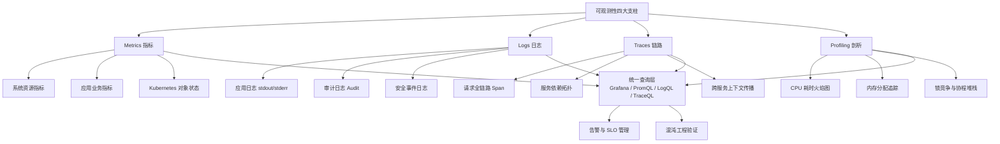
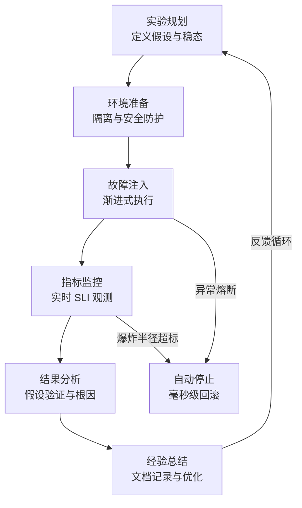

Kubernetes 可观测性是云原生运维的核心能力域——它回答的不是"系统出了什么问题"，而是"系统正在发生什么、为什么会发生、以及未来可能发生什么"。本页从四大支柱（Metrics 指标监控、Logs 日志审计、Traces 分布式追踪、Chaos 混沌工程）出发，系统梳理知识库中 27 篇域文档与多域交叉资料的核心架构、关键技术选型与生产实践要点，为中级开发者构建"从监控到韧性"的全栈认知提供一张高密度知识地图。

Sources: [01-observability-architecture-overview.md](domain-8-observability/01-observability-architecture-overview.md#L1-L8), [README.md](domain-8-observability/README.md#L1-L7)

---

## 一、可观测性架构总览：从"三大支柱"到"四大支柱"

### 1.1 核心架构认知

现代 Kubernetes 可观测性已从传统的"三大支柱"（Metrics / Logs / Traces）演进为"四大支柱"，引入了**持续剖析（Continuous Profiling）**——通过 eBPF 技术以极低开销在生产环境获得函数级 CPU / 内存 / 锁竞争分析能力。这一演进体现了从"知道发生了什么"到"知道为什么发生"的纵深洞察需求。



Sources: [15-observability-architecture.md](domain-1-architecture-fundamentals/15-observability-architecture.md#L11-L26), [16-observability-design-principles.md](domain-2-design-principles/16-observability-design-principles.md#L1-L9)

### 1.2 数据特征对比——理解每种信号的边界

| 维度 | Metrics 指标 | Logs 日志 | Traces 链路 | Profiling 剖析 |
|------|-------------|----------|------------|---------------|
| **数据结构** | 时间序列 (numeric) | 半结构化文本 | 分布式 Span 树 | 函数级堆栈快照 |
| **采集频率** | 高频定期（15s 级） | 事件驱动 | 选择性采样 | 按需 / 低频持续 |
| **存储效率** | 高（数值压缩） | 中（倒排索引） | 低（关联图） | 中（聚合后小） |
| **查询复杂度** | 低（PromQL） | 高（全文检索） | 中（图遍历） | 中（火焰图聚合） |
| **核心用途** | 容量规划、告警 | 故障排查、审计 | 性能瓶颈定位 | 静默性能损耗发现 |
| **成熟工具** | Prometheus / Thanos | Loki / Elasticsearch | Jaeger / Tempo | Parca / Pyroscope |

Sources: [01-observability-architecture-overview.md](domain-8-observability/01-observability-architecture-overview.md#L36-L67), [24-observability-tool-ecosystem.md](domain-8-observability/24-observability-tool-ecosystem.md#L93-L142)

### 1.3 设计原则矩阵

可观测性设计有一套被 Google SRE 实践反复验证的方法论体系，其中五种核心方法各有侧重：

| 原则 | 英文 | 核心思想 | 典型实施 |
|------|------|----------|---------|
| **白盒监控** | White-box | 监控系统内部状态（暴露 /metrics 端点） | Prometheus pull 模式采集 |
| **黑盒监控** | Black-box | 从用户视角验证端到端可用性 | Syntheis 探针、外部 ping |
| **黄金信号** | Golden Signals | Latency / Traffic / Errors / Saturation | SLO 告警核心指标 |
| **RED 方法** | RED | Rate / Errors / Duration（请求导向） | 适用于 API / 微服务监控 |
| **USE 方法** | USE | Utilization / Saturation / Errors（资源导向） | 适用于 CPU / 磁盘 / 网络监控 |

Sources: [16-observability-design-principles.md](domain-2-design-principles/16-observability-design-principles.md#L52-L61)

---

## 二、监控指标体系：Prometheus 生态与核心组件指标

### 2.1 Prometheus 生态系统架构

Prometheus 是 Kubernetes 可观测性的事实标准，其生态由五个核心组件构成闭环：**Prometheus Server**（采集 + 存储 + 查询）、**Alertmanager**（告警路由 + 去重 + 抑制）、**Pushgateway**（短生命周期作业指标）、**Prometheus Operator**（CRD 管理生命周期）、**Kube-Prometheus-Stack**（一站式部署）。数据流遵循 Pull 模型——Prometheus 主动从 `/metrics` 端点拉取时序数据，通过 PromQL 查询引擎提供灵活聚合能力。

Sources: [02-monitoring-metrics-system.md](domain-8-observability/02-monitoring-metrics-system.md#L13-L61)

### 2.2 核心组件关键指标速查表

以下是从 API Server 到 CoreDNS 全链路的核心运维指标清单，每一条都经过生产环境验证的告警阈值标定：

**控制平面指标**

| 组件 | 关键指标 | 类型 | 告警阈值 | 运维场景 |
|------|---------|------|---------|---------|
| **API Server** | `apiserver_request_duration_seconds` | Histogram | P99 > 1s | 请求延迟排查 |
| **API Server** | `apiserver_current_inflight_requests` | Gauge | > 80% 限制值 | 过载检测 |
| **etcd** | `etcd_server_has_leader` | Gauge | = 0（无 Leader） | 集群健康 |
| **etcd** | `etcd_disk_wal_fsync_duration_seconds` | Histogram | P99 > 10ms | 磁盘性能 |
| **etcd** | `etcd_mvcc_db_total_size_in_bytes` | Gauge | > 80% 配额 | 存储容量 |
| **Scheduler** | `scheduler_pending_pods` | Gauge | > 100 持续 | 调度瓶颈 |
| **KCM** | `workqueue_depth` | Gauge | > 100 | 控制器积压 |

**数据平面指标**

| 组件 | 关键指标 | 类型 | 告警阈值 | 运维场景 |
|------|---------|------|---------|---------|
| **Kubelet** | `kubelet_pleg_relist_duration_seconds` | Histogram | P99 > 3s | PLEG 健康 |
| **Kubelet** | `kubelet_running_pods` | Gauge | 接近 max-pods | 节点容量 |
| **Kube-proxy** | `kubeproxy_sync_proxy_rules_duration_seconds` | Histogram | P99 > 5s | 规则同步性能 |
| **CoreDNS** | `coredns_dns_request_duration_seconds` | Histogram | P99 > 100ms | DNS 解析性能 |
| **容器 (cAdvisor)** | `container_memory_working_set_bytes` | Gauge | > limits | OOM 风险 |

Sources: [10-monitoring-metrics-prometheus.md](domain-8-observability/10-monitoring-metrics-prometheus.md#L6-L136), [02-monitoring-metrics-system.md](domain-8-observability/02-monitoring-metrics-system.md#L112-L169)

### 2.3 高可用与企业级架构

对于超过 50 节点的集群，单一 Prometheus 实例无法满足可用性和长期存储需求。企业级方案采用两条主流路径：

| 方案 | 架构模式 | 核心优势 | 适用规模 |
|------|---------|---------|---------|
| **Thanos** | Prometheus Sidecar + 对象存储 + 全局 Query | 全局查询视图、长期存储、水平扩展 | 50-2000 节点 |
| **Cortex / Mimir** | 微服务架构 + 水平扩展 | 大规模多租户、高可用 | 2000+ 节点 |
| **Victoria Metrics** | 单二进制 + 高性能存储 | 部署简单、资源占用低 | 资源受限环境 |
| **联邦架构** | Leaf Prometheus → Global Prometheus | 实现简单、无额外依赖 | 中小规模多集群 |

Sources: [15-enterprise-scale-monitoring.md](domain-8-observability/15-enterprise-scale-monitoring.md#L73-L107), [02-monitoring-metrics-system.md](domain-8-observability/02-monitoring-metrics-system.md#L63-L106)

---

## 三、日志审计体系：从收集到合规

### 3.1 三层日志架构

Kubernetes 日志遵循清晰的三层模型：**应用层**（业务日志 stdout/stderr + 访问日志 + 错误日志）→ **容器运行时层**（Docker/Containerd 日志驱动，输出到 `/var/log/containers/*.log`）→ **基础设施层**（DaemonSet 部署采集器、Sidecar 或应用直推）。理解这个层次是选对日志收集模式的前提。

Sources: [03-logging-architecture.md](domain-8-observability/03-logging-architecture.md#L14-L53)

### 3.2 日志收集模式与工具选型

三种主流收集模式的取舍边界：

| 模式 | 架构 | 优势 | 代价 | 适用场景 |
|------|------|------|------|---------|
| **节点级代理 (DaemonSet)** | 每节点一个采集器 | 低侵入、统一管理、资源效率高 | 无法收集容器内文件日志 | 标准 stdout 日志 |
| **Sidecar 容器** | Pod 内专用采集容器 | 灵活、可处理文件日志 | 资源开销大、配置复杂 | 文件日志 / 日志预处理 |
| **直接推送** | 应用直推后端 | 最灵活、实时性强 | 应用耦合度高 | 特殊格式日志 |

**收集器与存储后端选型矩阵**

| 角色 | 推荐组件 | 关键特征 | 规模适配 |
|------|---------|---------|---------|
| 收集器（轻量） | **Fluent Bit** | < 100MB 内存、高性能 | 所有规模 |
| 收集器（全功能） | **Fluentd** | 插件丰富（200+） | 中大型集群 |
| 收集器（极致性能） | **Vector** (Rust) | < 50MB 内存 | 性能敏感场景 |
| 存储（低成本） | **Loki** | 标签索引、与 Grafana 原生集成 | 中小型集群 |
| 存储（全功能） | **Elasticsearch / OpenSearch** | 全文索引、Lucene 生态 | 大型集群 |
| 存储（云原生） | **SLS (阿里云)** | 免运维、SQL 查询 | ACK 环境 |

Sources: [03-logging-architecture.md](domain-8-observability/03-logging-architecture.md#L46-L104)

### 3.3 审计日志：合规性的最后一道防线

Kubernetes 审计日志（Audit Log）是企业安全合规的核心数据源，它记录了"谁在什么时间对什么资源做了什么操作"。审计策略通过四级粒度控制记录深度：

| 审计级别 | 记录内容 | 适用资源 | 典型场景 |
|---------|---------|---------|---------|
| **Metadata** | 仅记录请求元数据（用户、时间、动词） | Secrets、ConfigMaps 的读操作 | 敏感资源访问追踪 |
| **Request** | Metadata + 请求体 | RBAC 资源的写操作 | 权限变更审计 |
| **RequestResponse** | Metadata + 请求体 + 响应体 | Pods/Services 的写操作（管理员） | 完整操作记录 |
| **None** | 不记录 | system:kube-proxy 的 watch | 减少噪音 |

合规框架映射方面，知识库覆盖了 **GDPR**（个人数据保护，72 小时违规报告）、**SOX**（萨班斯法案，财务数据完整性）、**PCI-DSS**（支付卡安全）、**等保 2.0** 等主流法规的日志审计要求，并按四级数据敏感度（公开 → 内部 → 敏感 → 机密）制定了保留策略和加密标准。

Sources: [08-logging-audit-compliance.md](domain-8-observability/08-logging-audit-compliance.md#L54-L157), [09-events-audit-logs.md](domain-8-observability/09-events-audit-logs.md#L86-L124)

---

## 四、分布式追踪：OpenTelemetry 与全链路可观测

### 4.1 OpenTelemetry——统一可观测性的事实标准

OpenTelemetry（OTel）已成为 CNCF 可观测性领域的统治性标准，其核心价值在于**标准化数据协议（OTLP）**，使数据可在不同后端（Tempo、Mimir、Datadog）间无缝迁移，避免厂商锁定。架构分为三层：**Instrumentation**（自动 / 手动埋点）→ **Collector**（接收、处理、导出）→ **Backend**（Jaeger、Tempo、SigNoz 等存储分析）。

```
┌─────────────────────────────────────────────────────────────┐
│                   OpenTelemetry Collector 架构               │
│                                                              │
│   Receivers          Processors          Exporters           │
│  ┌──────────┐      ┌──────────┐      ┌──────────┐          │
│  │  OTLP    │      │  batch   │      │  Jaeger  │          │
│  │  gRPC:4317│ ──▶ │  memory  │ ──▶  │  Tempo   │          │
│  │  HTTP:4318│      │  limit   │      │  Loki    │          │
│  │  Jaeger  │      │  attrib  │      │  Prom    │          │
│  │  Zipkin  │      │  filter  │      │  logging │          │
│  └──────────┘      └──────────┘      └──────────┘          │
└─────────────────────────────────────────────────────────────┘
```

Sources: [04-distributed-tracing.md](domain-8-observability/04-distributed-tracing.md#L78-L136), [03-opentelemetry-distributed-tracing.md](domain-20-enterprise-monitoring-alerting/03-opentelemetry-distributed-tracing.md#L10-L58)

### 4.2 追踪核心概念与数据模型

追踪的核心数据单元是 **Span**——一个工作单元的执行表示。多个 Span 通过 `parent_span_id` 组装成一棵 **Trace** 树，通过 W3C 标准头部 `traceparent` 在服务间传播上下文。关键设计原则包括：

| 原则 | 说明 | 生产实践 |
|------|------|---------|
| **Span 粒度** | 每个重要业务操作一个 Span | 避免过细（每个函数）或过粗（整个请求） |
| **上下文传播** | HTTP Header: `traceparent` | 所有服务间调用必须自动传播 |
| **采样策略** | 成本与覆盖率平衡 | 生产 10%、预发 50%、开发 100% |
| **属性标注** | 用户 ID、订单号等业务字段 | 为 Span 添加 `k8s.namespace` 等环境属性 |
| **错误标记** | `StatusCode: ERROR` + 事件 | 记录异常堆栈和 DB 语句 |

Sources: [04-distributed-tracing.md](domain-8-observability/04-distributed-tracing.md#L16-L74), [16-observability-design-principles.md](domain-2-design-principles/16-observability-design-principles.md#L222-L282)

### 4.3 追踪与 Metrics / Logs 的关联

现代可观测性的关键突破在于**三大信号的关联**：Trace 中的 `trace_id` 可以关联到对应的 Log 条目和 Metric 时间点，实现"从告警 → 日志 → 链路"的一键下钻。OpenTelemetry Collector 的 `spanmetrics` 处理器可自动从 Span 数据生成指标（如请求速率、错误率、延迟分布），实现无需额外埋点的 RED 指标。

Sources: [04-distributed-tracing.md](domain-8-observability/04-distributed-tracing.md#L179-L184)

---

## 五、告警管理与 SLO 驱动告警

### 5.1 从阈值告警到 SLO 告警的范式转移

传统告警基于"CPU > 80%"等中间指标，这种方式容易产生告警风暴和假阳性。Google SRE 方法论推动的范式转移是：**告警应基于对用户有意义的 SLI（服务水平指标）**，通过**错误预算（Error Budget）**机制平衡质量与交付速度。例如，99.9% 可用性 SLO 意味着每月允许 43.2 分钟不可用——只要错误预算未耗尽，即使 CPU 100% 也不应触发紧急电话告警。

Sources: [18-slo-sli-system.md](domain-8-observability/18-slo-sli-system.md#L87-L123), [05-alerting-management.md](domain-8-observability/05-alerting-management.md#L11-L38)

### 5.2 告警成熟度模型

```
Level 1 基础告警 → 系统组件宕机告警、简单阈值、手动处理
Level 2 标准告警 → 多维度规则、自动化路由、告警分组和抑制
Level 3 智能告警 → 异常检测算法、预测性告警、根因关联分析
Level 4 自适应   → ML 驱动、业务影响评估、智能降噪
Level 5 自主运维 → 完全自动处理、预防性维护、持续自我改进
```

### 5.3 告警设计黄金法则

有效的告警必须同时满足三个属性：**Meaningful**（有意义的——影响用户或业务）、**Actionable**（可操作的——有明确处理步骤）、**Contextual**（上下文丰富的——包含 Pod 名称、节点信息、历史趋势）。避免的三种反模式：告警风暴（过多告警导致疲劳）、假阳性（频繁误报降低信任）、告警静默（重要问题被淹没）。

Sources: [05-alerting-management.md](domain-8-observability/05-alerting-management.md#L78-L171), [16-observability-design-principles.md](domain-2-design-principles/16-observability-design-principles.md#L129-L157)

---

## 六、混沌工程：验证系统韧性的科学方法

### 6.1 混沌工程核心原则

混沌工程不是"随手杀进程"的随意破坏，而是**对分布式系统假设的严谨科学验证**。它遵循四项核心原则：**假设驱动**（明确实验假设和稳态指标）→ **真实世界条件**（在生产或类生产环境中模拟真实故障）→ **自动化执行**（CI/CD 集成、定期运行）→ **最小爆炸半径**（渐进式扩大、毫秒级熔断）。其终局不是偶尔的"演习"，而是集成到每次发布的自动化验证流水线。

Sources: [15-chaos-engineering.md](domain-2-design-principles/15-chaos-engineering.md#L1-L9), [14-chaos-engineering.md](domain-8-observability/14-chaos-engineering.md#L67-L76)

### 6.2 工具选型对比

| 工具 | 架构 | K8s 原生 | 支持场景 | 学习曲线 | 社区活跃度 | 适用场景 |
|------|------|---------|---------|---------|-----------|---------|
| **Chaos Mesh** | Operator | ✅ | 全场景 | 中 | ⭐⭐⭐⭐⭐ | K8s 环境首选 |
| **LitmusChaos** | Operator | ✅ | 全场景 | 中 | ⭐⭐⭐⭐⭐ | GitOps 集成 |
| **Chaosblade** | Agent | ✅ | 全场景 | 中 | ⭐⭐⭐⭐ | 阿里生态 |
| **Gremlin** | SaaS | ✅ | 全场景 | 低 | ⭐⭐⭐⭐ | 企业级托管 |
| **AWS FIS** | 托管 | ❌ | AWS 资源 | 低 | ⭐⭐⭐⭐ | AWS 环境 |

Sources: [14-chaos-engineering.md](domain-8-observability/14-chaos-engineering.md#L78-L104)

### 6.3 故障注入层次模型

混沌实验按四层故障注入层次组织，从底层到顶层依次覆盖：

| 层次 | 故障类型 | Chaos Mesh CRD | 注入技术 | 验证目标 |
|------|---------|---------------|---------|---------|
| **基础设施层** | 云资源故障 | AWSChaos / GCPChaos | 云 API | 云故障转移 |
| **系统层** | IO 延迟、CPU 压力、时间偏移 | IOChaos / StressChaos / TimeChaos | fuse / eBPF / stress-ng | 存储韧性、资源竞争 |
| **服务层** | DNS 解析失败、网络分区、Pod 杀死 | DNSChaos / NetworkChaos / PodChaos | tc / iptables / API | 服务降级、自愈能力 |
| **应用层** | HTTP 错误、JVM 异常、gRPC 故障 | HTTPChaos / JVMChaos | eBPF / Byteman | API 容错、应用弹性 |

Sources: [14-chaos-engineering.md](domain-8-observability/14-chaos-engineering.md#L91-L104)

### 6.4 混沌实验生命周期



Sources: [15-chaos-engineering.md](domain-2-design-principles/15-chaos-engineering.md#L86-L118), [14-chaos-engineering.md](domain-8-observability/14-chaos-engineering.md#L6-L22)

---

## 七、生产实施路线图与知识导航

### 7.1 分阶段实施策略

从零构建可观测性平台应遵循渐进式路线：

```
Phase 1 基础监控 (Weeks 1-2)  →  部署 Prometheus + Grafana + 核心组件指标 + 基础告警
Phase 2 日志体系 (Weeks 3-4)  →  部署 Fluent Bit + Loki/Elasticsearch + 结构化日志标准
Phase 3 链路追踪 (Weeks 5-6)  →  集成 OpenTelemetry + 部署 Jaeger/Tempo + 应用埋点
Phase 4 SLO 治理  (Weeks 7-8)  →  建立 SLI/SLO 体系 + SLO 驱动告警 + 错误预算管理
Phase 5 韧性验证 (Weeks 9-10) →  部署 Chaos Mesh + 编排故障实验 + CI/CD 集成
Phase 6 持续优化 (持续)       →  告警调优 + 仪表盘优化 + 成本控制 + AIOps 探索
```

Sources: [01-observability-architecture-overview.md](domain-8-observability/01-observability-architecture-overview.md#L396-L433)

### 7.2 成本优化核心策略

| 策略 | 具体做法 | 节省效果 |
|------|---------|---------|
| **指标分级采集** | 关键指标 15s、重要指标 60s、一般指标 300s | 降低 40-60% 写入量 |
| **追踪采样** | 生产 10%、预发 50%、错误请求 100% | 降低 90% 追踪存储 |
| **日志分层保留** | Debug 24h / Info 7d / Error 90d / Audit 1y+ | 降低 70% 存储成本 |
| **冷热分层存储** | 热 SSD 7d → 温 SATA 90d → 冷 S3 3y+ | 降低 80% 存储成本 |

Sources: [01-observability-architecture-overview.md](domain-8-observability/01-observability-architecture-overview.md#L361-L392)

### 7.3 深度学习路径

本页作为可观测性知识域的总览入口，以下导航指向知识库中的深度专题文档：

**按技术栈深入**

| 学习方向 | 推荐文档 | 核心内容 |
|---------|---------|---------|
| 指标监控深度 | [02-monitoring-metrics-system.md](domain-8-observability/02-monitoring-metrics-system.md) | Prometheus HA 架构、核心组件指标详解 |
| Prometheus 实战 | [10-monitoring-metrics-prometheus.md](domain-8-observability/10-monitoring-metrics-prometheus.md) | 全组件关键指标速查表 |
| 日志架构设计 | [03-logging-architecture.md](domain-8-observability/03-logging-architecture.md) | Fluent Bit 生产配置、三种收集模式 |
| 审计与合规 | [08-logging-audit-compliance.md](domain-8-observability/08-logging-audit-compliance.md) | GDPR/SOX/PCI-DSS 合规映射 |
| 分布式追踪 | [04-distributed-tracing.md](domain-8-observability/04-distributed-tracing.md) | OTel Collector 生产配置、Span 数据模型 |
| 告警管理 | [05-alerting-management.md](domain-8-observability/05-alerting-management.md) | PrometheusRule 编写、告警成熟度模型 |
| SLO/SLI 体系 | [18-slo-sli-system.md](domain-8-observability/18-slo-sli-system.md) | 错误预算机制、用户旅程映射 |
| 混沌工程实践 | [14-chaos-engineering.md](domain-8-observability/14-chaos-engineering.md) | Chaos Mesh 全故障类型配置、NetworkChaos 实验 |
| 大规模监控 | [15-enterprise-scale-monitoring.md](domain-8-observability/15-enterprise-scale-monitoring.md) | Thanos 企业部署、联邦架构 |
| 工具生态全景 | [24-observability-tool-ecosystem.md](domain-8-observability/24-observability-tool-ecosystem.md) | CNCF 项目成熟度评估、商业 APM 对比 |

**跨域关联阅读**

| 关联主题 | 文档位置 | 关联原因 |
|---------|---------|---------|
| 可观测性设计原则 | [16-observability-design-principles.md](domain-2-design-principles/16-observability-design-principles.md) | 白盒 / 黑盒监控、USE / RED / Golden Signals 方法论 |
| 混沌工程设计 | [15-chaos-engineering.md](domain-2-design-principles/15-chaos-engineering.md) | 故障注入四原则、实验生命周期 Go 代码实现 |
| 架构层可观测性 | [15-observability-architecture.md](domain-1-architecture-fundamentals/15-observability-architecture.md) | 四大支柱理论、持续剖析第四支柱 |
| OTel 深度实践 | [03-opentelemetry-distributed-tracing.md](domain-20-enterprise-monitoring-alerting/03-opentelemetry-distributed-tracing.md) | 企业级 Collector 部署、数据模型深度解析 |

**下一步建议阅读**：根据目录结构，建议按顺序阅读 [故障排查方法论：FTA 故障树分析](13-fta-gu-zhang-shu-fen-xi-cong-yan-yi-tui-li-dao-ai-agent-zhi-shi-gu-jia) 了解如何将可观测性数据转化为结构化排障能力，以及 [安全合规：RBAC 与零信任架构](11-an-quan-he-gui-rbac-wang-luo-an-quan-ce-lue-yun-xing-shi-an-quan-yu-ling-xin-ren-jia-gou) 理解审计日志在安全体系中的定位。