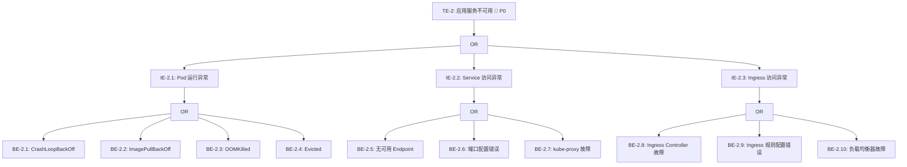
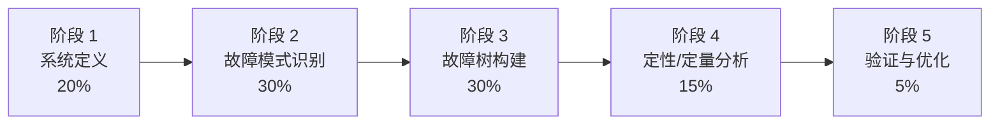
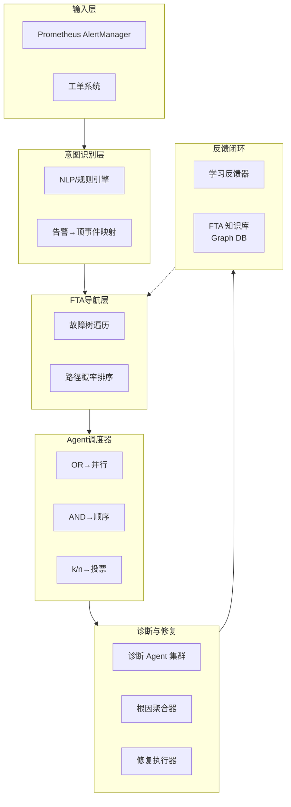

**故障树分析（Fault Tree Analysis, FTA）**是一种自顶向下的演绎式系统安全分析方法——它以系统中某个不期望事件为起点，逐层分解导致该事件发生的所有可能原因，直至找到最基本的根本原因，形成一棵结构化的因果树。本页将系统性地呈现 FTA 的理论根基、构建方法论、在 Kubernetes 运维中的实践落地，以及它如何成为 AI Agent 智能诊断的**知识骨架**。

Sources: [01-fta-origin-and-evolution.md](FTA故障树/01-fta-origin-and-evolution.md#L10-L13)

---

## 一、FTA 的起源与三阶段演进

FTA 诞生于 1961 年贝尔电话实验室，最初用于"民兵"洲际弹道导弹发射控制系统的安全性评估。此后半个世纪，它穿越核工业（WASH-1400 报告）、航空航天（NASA/ARP 4761）、汽车（ISO 26262）等多个安全关键行业，于 1981 年获得 IEC 61025 国际标准认可。进入 IT 运维领域后，FTA 经历了三个阶段：

| 阶段 | 时间 | 特征 | 代表实践 |
|:---|:---|:---|:---|
| **静态故障分析** | 2000-2015 | 纸质/文档 FTA、专家经验驱动、事后复盘 | 手工故障树绘制 |
| **自动化诊断** | 2015-2022 | Runbook 脚本化、规则引擎、告警联动 | PagerDuty Runbook Automation |
| **智能体驱动** | 2022-至今 | 知识图谱建模、自主推理、持续学习、全自动闭环 | 云厂商 AIOps 平台 |

第三阶段的本质转变在于：FTA 不再是一张静态的分析图，而是被建模为**可计算的知识图谱**，AI Agent 在其上进行动态推理、自动修复和经验学习。这正是本知识库将 FTA 定位为"AI Agent 知识骨架"的核心依据。

Sources: [01-fta-origin-and-evolution.md](FTA故障树/01-fta-origin-and-evolution.md#L14-L65)

---

## 二、方法论核心：演绎法与五大原则

### 2.1 演绎法 vs 归纳法

FTA 本质上是**演绎法**——从"系统失败了"出发，追问"为什么会失败"。这与 FMEA（故障模式与影响分析）的归纳法思路恰好互补：FMEA 从组件出发追问"坏了会怎样"，FTA 从系统出发追问"为什么会坏"。最佳实践是将两者协同使用：先用 FMEA 识别所有组件故障模式，再将结果作为 FTA 的底事件输入，分析故障传播路径。

```
FMEA 识别组件故障模式 → FTA 分析故障传播路径 → 定量概率计算

具体流程:
1. [FMEA] etcd: 磁盘满、OOM、网络分区、数据损坏...
2. [FTA]  TE: 集群不可用 → IE: 控制平面故障 → BE: etcd 磁盘满 (来自 FMEA)
3. [定量] etcd 磁盘满 → etcd 响应超时 → API Server 不可用 → 集群不可用
```

### 2.2 五大核心原则

FTA 的工程质量由以下五大原则保障：

| 原则 | 核心要求 | 典型违反场景 |
|:---|:---|:---|
| **MECE 完备性** | 同层事件互斥且穷尽 | OR 门下"网络故障"与"DNS 解析失败"存在包含关系 |
| **可观测性** | 每个底事件必须可检测、可度量、可告警 | 底事件描述为"内存不足"而非"内存使用率 > 95%" |
| **层次化设计** | 每层抽象粒度一致，推荐 3-5 层 | 底事件层出现"集群不可用"这种高层描述 |
| **独立性** | 同一逻辑门下子事件不应有因果依赖 | AND 门下"CPU > 95%"与"响应延迟 > 1s"实为因果关系 |
| **SLO 关联** | 顶事件应直接映射到 SLO 违约 | 顶事件定义为"进程异常"而非"用户不可用" |

其中**MECE 完备性**是 FTA 质量的核心保障。"互斥"要求同一逻辑门下的子事件不重叠——例如"网络故障"不应与"DNS 解析失败"并列（后者是前者的子集），应拆分为"传输层网络故障""DNS 解析失败""防火墙策略阻断"三个互斥维度。"穷尽"要求覆盖所有可能性——例如"Pod 无法调度"不应只考虑"资源不足"和"节点不可用"，还需纳入亲和性规则、污点/容忍、PDB 约束、资源配额等。

Sources: [04-fta-core-principles.md](FTA故障树/04-fta-core-principles.md#L10-L107)

---

## 三、数学基础与符号体系

### 3.1 布尔代数与概率计算

FTA 的核心数学工具是**布尔代数**。故障树中每个事件是一个布尔变量（发生=1，未发生=0），逻辑门对应布尔运算：

| 逻辑门 | 布尔表达 | 概率公式 | 故障语义 |
|:---|:---|:---|:---|
| **OR 门** | Q = A ∨ B | P(Q) = 1 - ∏(1-P(Aᵢ)) | 任一子事件即可导致故障 |
| **AND 门** | Q = A ∧ B | P(Q) = ∏P(Aᵢ) | 所有子事件同时发生才导致故障 |
| **k/n 投票门** | C(n,k) 组合 | Σ C(n,i)·P^i·(1-P)^(n-i) | n 个中至少 k 个发生 |

以 Kubernetes "集群完全不可用"为例，通过逐层 OR 门概率计算（P(API Server 崩溃)=0.001, P(etcd 故障)=0.0005, P(网络故障)=0.002998...），可得年故障概率约 0.48%，对应年化可用性 99.52%——这未达到 99.9% SLA 目标，需优先加固网络冗余。

### 3.2 最小割集与重要度分析

**最小割集（MCS）** 是 FTA 定量分析的核心概念——使顶事件发生的最小底事件组合。1 阶割集即**单点故障**，必须优先消除。通过 MOCUS 算法可自动求解所有最小割集，进而用 Fussell-Vesely 重要度量化每个底事件对顶事件的贡献比例，指导运维资源的优先分配。

```
示例: TE-2 "应用服务不可用" 的最小割集分析

MCS1 = {Ingress Controller 单实例故障}    → 1阶（单点故障！）
MCS2 = {所有 Pod 同时 OOMKilled}          → 1阶（单点故障！）
MCS3 = {DNS 服务故障}                      → 1阶（单点故障！）
MCS4 = {kube-proxy 故障, iptables 损坏}    → 2阶

关键发现: 存在 3 个 1 阶割集，Ingress 和 CoreDNS 是最大风险点
```

### 3.3 标准符号体系

FTA 采用 IEC 61025 标准定义的图形符号：矩形表示顶事件/中间事件（可分解），圆形表示底事件（不可再分解的基本故障），菱形表示未展开事件，三角形为转移符号。逻辑门包括 OR 门（弧形）、AND 门（平底）、k/n 投票门、抑制门、优先 AND 门和异或门六类。本知识库采用 `TE-{序号}` / `IE-{顶事件序号}.{序号}` / `BE-{序号}` / `HA-{底事件编号}.{序号}` 的统一编号体系，确保跨文档一致性。

Sources: [02-fta-mathematical-foundations.md](FTA故障树/02-fta-mathematical-foundations.md#L10-L108), [03-fta-symbol-system-and-standards.md](FTA故障树/03-fta-symbol-system-and-standards.md#L10-L141)

---

## 四、Kubernetes 全量故障树：8 大顶事件与 63 个底事件

本知识库为 Kubernetes 生产环境构建了完整的故障树体系，定义了 **8 个顶事件、63 个底事件**，覆盖从集群级故障到监控异常的全域故障空间：

| 编号 | 顶事件 | 严重程度 | 典型症状 |
|:---|:---|:---|:---|
| TE-1 | 集群完全不可用 | 🔴 P0 | kubectl 无法连接，所有服务中断 |
| TE-2 | 应用服务不可用 | 🔴 P0 | HTTP 5xx 错误，用户无法访问 |
| TE-3 | Pod 启动失败 | 🟠 P1 | Pod 处于 Pending/Error 状态 |
| TE-4 | 网络通信异常 | 🟠 P1 | DNS 解析失败，Pod 间无法通信 |
| TE-5 | 存储访问失败 | 🟠 P1 | PVC 无法绑定，卷挂载失败 |
| TE-6 | 资源调度异常 | 🟡 P2 | Pod 无法调度，调度结果异常 |
| TE-7 | 安全认证失败 | 🟠 P1 | 认证/授权失败，证书过期 |
| TE-8 | 监控告警异常 | 🟡 P2 | 指标丢失，告警不触发 |

每个顶事件通过 OR/AND 门逐层展开为中间事件和底事件。以 TE-2"应用服务不可用"为例，其故障树结构为：



在此基础上，本知识库还提供了 **36 个组件级 FTA 文档**，涵盖 Pod（80+ 底事件）、Node、API Server、etcd、DNS、Service、Ingress、HPA、证书、Webhook 准入控制、集群升级、ArgoCD 等全组件场景。每个 FTA 文档均包含 Mermaid 故障树图、底事件详细定义、JSON 工作流（支持 Agent 自动化遍历）以及 K8s 版本兼容说明。

Sources: [kubernetes-fta-full-analysis.md](FTA故障树/kubernetes-fta-full-analysis.md#L9-L196), [list/README.md](FTA故障树/list/README.md#L1-L199)

---

## 五、构建流程：五阶段方法论

构建一棵生产级故障树需要经过五个阶段：



**阶段一：系统定义**——明确系统边界（包含/排除哪些组件）、定义顶事件（需与 SLO 直接关联、可明确判定、影响范围清晰）、确定分析深度（基于"业务影响 × 可观测性"矩阵决定 3-5 层）。

**阶段二：故障模式识别**——三种方法协同：FMEA 分析（对每个组件列出故障模式、影响、原因、RPN 评分）、历史故障数据挖掘（统计各类故障占比与 MTTR）、架构依赖分析（绘制组件依赖图，识别故障传播路径）。行业数据表明，Kubernetes 生产故障中应用配置错误占 35%、资源耗尽占 22%、网络问题占 18%、控制平面故障占 10%。

**阶段三：故障树构建**——推荐混合策略：第 1-2 层按影响范围分解（对齐 SLO），第 3 层按子系统分解（对齐架构），第 4 层按故障类型分解（对齐运维团队）。

**阶段四：定性/定量分析**——求解最小割集，计算概率矩阵，进行重要度排序（Fussell-Vesely / Birnbaum），识别单点故障和高风险路径。

**阶段五：验证与优化**——静态验证（历史故障覆盖率 ≥ 95%、逻辑一致性检查）、动态验证（混沌工程注入故障，对比 FTA 预测与实际表现）、专家评审。

Sources: [05-fta-construction-process.md](FTA故障树/05-fta-construction-process.md#L10-L200), [06-fta-verification-and-quality.md](FTA故障树/06-fta-verification-and-quality.md#L10-L98)

---

## 六、FTA → AI Agent 知识骨架：逻辑门映射与执行引擎

### 6.1 为什么 FTA 是 Agent 的最佳知识表示

在众多知识表示方法中，FTA 对运维 Agent 具有独特优势：**天然的树形结构**直接映射为决策路径，无需额外转换；**逻辑门**直接映射为 Agent 编排策略；**概率信息**指导优先级排序；**修复动作库**提供执行依据；**完全的可解释性**使每一步推理都可追溯到 FTA 路径。相比之下，专家规则（if-else）存在规则爆炸问题，神经网络是黑盒不可解释，贝叶斯网络计算复杂度为 NP-hard。

### 6.2 逻辑门 → Agent 编排策略映射

FTA 的三种核心逻辑门天然对应三种 Agent 执行策略：

| FTA 逻辑门 | Agent 策略 | 执行语义 | 适用场景 |
|:---|:---|:---|:---|
| **OR 门** | 并行诊断（Parallel Probe） | 同时检查所有子事件，先确认者优先处理 | 多个独立可能根因 |
| **AND 门** | 顺序确认（Sequential Verify） | 逐一检查，任一条件不满足即排除该路径 | 需要多个条件同时成立 |
| **k/n 投票门** | 多数确认（Majority Confirm） | 并行检查所有子事件，达到 k 个确认即判定 | 集群仲裁、多数表决 |

以 OR 门为例：当 Agent 接收到"Service 不可用"告警后，同时派发三个诊断 Agent——Agent-A 检查 Pod 状态、Agent-B 检查 Endpoint、Agent-C 检查 Ingress。谁先确认故障，谁触发后续修复流程，同时通知其他 Agent 取消不必要的诊断。

### 6.3 FTA 驱动的 Agent 执行引擎架构

完整的 FTA-Agent 执行引擎包含六层：



Agent 执行核心逻辑（伪代码）为递归遍历故障树：遇到 OR 门时按概率排序并行检查所有子事件，返回第一个确认故障的路径；遇到 AND 门时顺序检查，任一正常即排除；遇到底事件时直接检查可观测数据（Metrics/Logs/Events）。修复时按成功率排序尝试修复动作，高风险操作需人工审批。每次故障处理后，Agent 记录诊断路径、更新概率数据、检测新的故障模式并提议扩展 FTA。

Sources: [08-ai-agent-ops-revolution.md](FTA故障树/08-ai-agent-ops-revolution.md#L10-L120), [09-fta-as-agent-knowledge-skeleton.md](FTA故障树/09-fta-as-agent-knowledge-skeleton.md#L10-L281)

---

## 七、实战案例：Pod OOMKilled 全自愈流程

以下是一个完整的生产级 FTA-Agent 自愈案例，展示从告警触发到修复验证的全流程：

**场景**：监控系统检测到生产环境 `order-service` Pod 持续 CrashLoopBackOff。

| 时间点 | 阶段 | Agent 行为 |
|:---|:---|:---|
| T+0s | 告警触发 | Prometheus AlertRule `KubePodCrashLooping` 触发 |
| T+2s | FTA 映射 | 告警标签映射到 TE-3"Pod 启动失败"，开始 FTA 导航 |
| T+5s | 并行诊断 | OR 门并行派发 3 个 Agent 检查调度/镜像/运行时 |
| T+12s | 定位底事件 | Agent-C 发现 Exit Code: 137, Reason: OOMKilled → BE-2.3 |
| T+15s | 证据收集 | `kubectl top pod` 显示内存 978Mi 接近 1Gi limit；日志确认 `java.lang.OutOfMemoryError` |
| T+30s | 根因推理 | 根因：Java 应用内存泄漏（OrderCache.loadAll），直接原因：limit 不足 |
| T+35s | 执行修复 | 自动执行 HA-2.3.1：`kubectl patch deployment` 将 memory limit 从 1Gi 调至 2Gi |
| T+180s | 验证恢复 | 滚动更新完成，3 个新 Pod 均为 Running，Prometheus 指标正常 |
| T+200s | 关闭告警 | 工单自动更新为 resolved，记录 FTA 路径 `TE-3 → IE-3.3 → BE-2.3` |
| T+230s | 学习反馈 | FTA 更新：BE-2.3 概率 +1，HA-2.3.1 成功率 90%→91%，生成长期建议 |

**总耗时**：MTTD 30s + MTTR 3min20s = **3min50s**（传统人工处理通常需要 30-60 分钟）。

Sources: [09-fta-as-agent-knowledge-skeleton.md](FTA故障树/09-fta-as-agent-knowledge-skeleton.md#L283-L385)

---

## 八、Runbook 自动化与智能工单处理

### 8.1 从 FTA 底事件自动生成 Runbook

传统 Runbook 由运维工程师手工编写，FTA 的结构化底事件天然包含生成 Runbook 所需的全部信息。自动生成算法从底事件中提取诊断命令（形成诊断步骤）、修复动作（按风险等级排序形成修复步骤）、验证条件（形成验证步骤）和回滚方案，输出结构化的 YAML/JSON Runbook。每个步骤有明确的成功/失败判定条件，高风险步骤标记需人工审批。

### 8.2 智能工单处理

FTA-Agent 架构实现了工单生命周期的全自动化：**用户报障 → NLP 意图识别 → FTA 顶事件映射 → Agent 树遍历诊断 → 自动修复 → 验证关闭 → 学习反馈**。NLP 映射器通过关键词规则将工单文本映射到 FTA 事件（如"crashloopbackoff"→TE-3/BE-2.1，"certificate"→TE-7/BE-7.1），按匹配置信度排序后启动 FTA 导航。对于 FTA 已覆盖的故障路径，可实现 MTTD < 1min、MTTR < 5min 的全自动闭环。

Sources: [11-fta-driven-runbook-automation.md](FTA故障树/11-fta-driven-runbook-automation.md#L10-L172), [13-intelligent-ticket-processing.md](FTA故障树/13-intelligent-ticket-processing.md#L10-L96)

---

## 九、LLM 增强与自进化展望

### 9.1 LLM 增强 FTA 推理

大语言模型为 FTA 带来三个维度的增强：**自然语言理解**——将用户模糊描述（"上午 10 点后应用特别慢"）提取为结构化故障特征并映射到 FTA 路径；**跨领域关联推理**——发现 FTA 未覆盖的关联（如"凌晨 2 点的批处理任务抢占了内存"）；**修复方案增强**——在 FTA 修复库的基础上，结合应用特征生成更精准的建议（如检测到 Java 应用时建议同时调整 JVM 参数）。

### 9.2 自进化运维系统

未来方向是构建**自进化的智能运维系统**：通过强化学习优化 FTA 路径权重（哪些分支概率最高、哪些修复最有效），通过联邦学习跨团队/跨集群共享 FTA 知识而不泄露敏感数据，通过数字孪生在虚拟环境中仿真故障场景、验证 FTA 完整性。最终目标是：Agent 从每次故障中学习，自动发现新的故障模式并提议扩展 FTA，经人工审核后纳入知识库——实现故障覆盖率的持续提升。

Sources: [20-fta-llm-opportunities.md](FTA故障树/20-fta-llm-opportunities.md#L10-L100)

---

## 十、30 天快速落地路线图

对于希望在生产环境中快速落地 FTA 的团队，本知识库提供了经过实践验证的 **30 天渐进式路线图**：

| 周次 | 主题 | 核心产出 |
|:---|:---|:---|
| **Week 1** | Foundation | 回顾 3 个月生产事件 → Top 5 高频故障列表 → 第一棵故障树（至少 3 层） |
| **Week 2** | Detection | 为每个底事件配置 Prometheus 告警 → 日志模式匹配 → 告警测试报告 |
| **Week 3** | Response | 基于 FTA 编写诊断 Runbook → 集成到工单系统 → On-call 团队培训 |
| **Week 4** | Feedback Loop | 复盘上月故障更新故障树 → Postmortem 模板更新 → 扩展到 2-3 个场景 → FTA ROI 报告 |

第一周的关键任务是选择**高频率 + 高影响 + 高 MTTR + 根因不明确**的故障场景。选择标准：发生 ≥ 5 次/季度、P0/P1 级别、解决时间 > 30 分钟。构建第一棵故障树时，推荐使用混合策略：第 1-2 层按影响范围分解（对齐 SLO），第 3-4 层按故障类型分解（对齐运维操作）。

Sources: [23-fta-production-quick-start.md](FTA故障树/23-fta-production-quick-start.md#L33-L118)

---

## 十一、知识库资源索引

本知识库中与 FTA 相关的核心资源分布如下：

| 资源类型 | 位置 | 规模 | 说明 |
|:---|:---|:---|:---|
| **方法论专题** | `topic-fta/` | 23 章 + 4 附录 + 2 主文档 | 从理论到 AI Agent 的完整知识体系 |
| **组件级 FTA** | `topic-fta/list/` | 36 个故障树文档 | 每个 K8s 组件的独立 FTA（含 Mermaid 图 + JSON 工作流） |
| **K8s 全量分析** | `topic-fta/kubernetes-fta-full-analysis.md` | 8 顶事件 / 63 底事件 | 统一的 Kubernetes 故障空间总览 |
| **FTA 模板** | `templates/fta-template.md` | 1 个模板 | 构建新故障树的标准模板 |
| **可视化脚本** | `scripts/fta_tree_visualization.py` | Node/Pod 双树 | matplotlib 高质量故障树图生成 |
| **合集文档** | `topic-fta/fta-methodology-and-agentic-practices.md` | 22 章合集 | 通读全文或快速搜索定位 |

**按角色的推荐阅读路径**：

| 角色 | 推荐路径 |
|:---|:---|
| 新手 | 第 1 章 → 第 4 章 → 第 5 章 → 第 23 章（快速启动） |
| SRE | 第 23 章（快速启动） → kubernetes-fta-full-analysis → 第 11 章（Runbook 自动化） |
| Agent 工程师 | 第 8-13 章（AI Agent 应用） → 第 14 章（系统工程） |
| 架构师 | 全集合集 → 第 20-22 章（未来展望与标准化） |

**推荐后续阅读**：

- [FEBM 法医鉴定循证方法论：从证据到结论的归纳式取证](14-febm-fa-yi-jian-ding-xun-zheng-fang-fa-lun-cong-zheng-ju-dao-jie-lun-de-gui-na-shi-qu-zheng)——与 FTA 互补的归纳式故障取证方法论
- [结构化故障排查：配置优先方法论与全组件排障指南](15-jie-gou-hua-gu-zhang-pai-cha-pei-zhi-you-xian-fang-fa-lun-yu-quan-zu-jian-pai-zhang-zhi-nan)——基于 FTA 的结构化排障实践
- [运维 Skill 库：AI Agent 可执行的工单诊断-修复闭环](16-yun-wei-skill-ku-ai-agent-ke-zhi-xing-de-gong-dan-zhen-duan-xiu-fu-bi-huan)——FTA 底事件到可执行修复 Skill 的映射