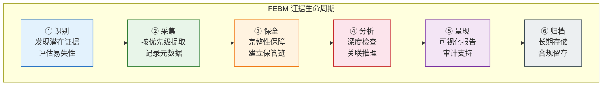

FEBM（Forensic Evidence-Based Methodology，法医鉴定循证方法论）是一套源于传统法医学、适配云原生数字环境的系统化调查方法论。它将物理世界中积累了数百年的法医学原理——尤其是洛卡德交换原理"每次接触都会留下痕迹"——迁移并重构为适用于 Kubernetes 环境的数字取证实践。与 [FTA 故障树分析](13-fta-gu-zhang-shu-fen-xi-cong-yan-yi-tui-li-dao-ai-agent-zhi-shi-gu-jia) 的**演绎法**（自上而下，从假设到验证）形成根本性互补，FEBM 采用**归纳法**（自下而上，从证据到结论），天然适应高度动态、短暂且分布式的云原生系统环境。本页涵盖 FEBM 的哲学基石、四大支柱、技术实现体系、五层可观测性架构、AI Agent 工单处理集成、五级成熟度建设路线以及生产环境快速启动指南，为 SRE、安全工程师、取证分析师和平台架构师提供完整的方法论全景。

Sources: [README.md](topic-febm/README.md#L1-L120), [febm-methodology-deep-dive.md](topic-febm/febm-methodology-deep-dive.md#L1-L36)

---

## 认识论定位：洛卡德交换原理与数字取证映射

FEBM 的哲学基石可追溯至 20 世纪法国犯罪学家埃德蒙·洛卡德（Edmond Locard, 1877-1966）提出的**洛卡德交换原理（Locard's Exchange Principle）**："Every contact leaves a trace." 这一原理在 Kubernetes 环境中有着极为深刻的映射关系——每次 API 调用都会在审计日志中留下痕迹，每次容器启动都会产生 cgroup 和 namespace 记录，每次网络连接都会在 conntrack 表中留下条目，每次 eBPF 程序触发都会捕获内核级事件。洛卡德原理的力量在于其**普遍性**——它不依赖于对具体故障模式的预知，只依赖于一个基本事实：交互必然产生痕迹。这使得 FEBM 天然适应动态、未知、复杂的系统环境。

FEBM 的学科定位横跨三个核心领域：**数字取证科学**（Digital Forensics）提供证据采集、保管、分析的程序规范；**循证方法论**（Evidence-Based Methodology）建立证据等级评估与假设-验证框架；**事件响应工程**（Incident Response Engineering）面向实际运维场景提供标准化响应流程。三者交叉融合，共同构建了 FEBM 的认识论体系。

Sources: [01-febm-theory-foundations.md](topic-febm/01-febm-theory-foundations.md#L21-L58), [01-febm-theory-foundations.md](topic-febm/01-febm-theory-foundations.md#L61-L121)

## 四大核心支柱

FEBM 的方法论体系建立在四大核心支柱之上，这些支柱不是独立存在的，而是相互支撑、互为前提的有机整体。**证据中心性**（Evidence Centricity）要求所有分析结论必须基于可验证的数字证据，拒绝一切无证据支撑的推断；**程序规范性**（Procedural Rigor）要求证据的收集、处理和存储遵循 NIST SP 800-61、ISO/IEC 27037 等既定标准；**时效敏感性**（Time Sensitivity）强调数字证据的易失性要求快速响应，容器内存状态在秒级即可永久丢失；**结论可辩护性**（Defensive Conclusions）确保分析过程和结论可审计、可复现，能经受技术审查、合规审计甚至法律程序的挑战。

支柱之间存在深刻的相互依赖关系：证据必须在失效前捕获（中心性↔时效性），规范的程序是可辩护结论的前提（规范性↔可辩护性），所有四个支柱共同支撑 FEBM 的认识论可靠性。

```
┌────────────────────────────────────────────────────────────────────┐
│                    FEBM 四大核心支柱                                │
├────────────────────────────────────────────────────────────────────┤
│                                                                    │
│  ┌──────────────┐  ┌──────────────┐  ┌──────────────┐  ┌────────┐│
│  │  证据中心性   │  │  程序规范性   │  │  时效敏感性   │  │ 结论   ││
│  │  Evidence     │  │  Procedural  │  │  Time        │  │ 可辩护 ││
│  │  Centricity   │  │  Rigor       │  │  Sensitivity │  │ 性     ││
│  ├──────────────┤  ├──────────────┤  ├──────────────┤  ├────────┤│
│  │ 所有分析结论 │  │ 遵循 NIST/   │  │ 内存驻留数据 │  │ 可审计 ││
│  │ 必须基于可   │  │ ISO 标准采集 │  │ 秒级丢失，   │  │ 可复现 ││
│  │ 验证的数字   │  │ 和保全证据   │  │ 需持续取证   │  │ 可辩护 ││
│  │ 证据         │  │              │  │              │  │        ││
│  └──────────────┘  └──────────────┘  └──────────────┘  └────────┘│
│                                                                    │
│  推理范式: 归纳法 (从证据到结论)                                    │
└────────────────────────────────────────────────────────────────────┘
```

Sources: [01-febm-theory-foundations.md](topic-febm/01-febm-theory-foundations.md#L192-L265), [febm-methodology-deep-dive.md](topic-febm/febm-methodology-deep-dive.md#L37-L62)

## 证据分类与易失性时间线

FEBM 将 Kubernetes 环境中的证据按**易失性**进行系统分级，这是决定证据采集优先级的核心依据。Level 0 的寄存器/缓存状态以纳秒级消失，Level 1 的进程内存和网络连接状态在秒级丢失，Level 7 的审计记录可保存数月至数年，Level 8 的 GitOps 配置历史近乎永久保存。这一分级直接决定了 FEBM 的**按易失性优先级采集**原则——在容器异常检测场景中，自动化流程必须首先捕获内存快照（CRIU 检查点），然后依次采集系统调用上下文、网络连接快照、容器文件系统导出，最后才是 Kubernetes 上下文和持久化日志。

| 易失性等级 | 证据类型 | 生命周期 | 采集优先级 | Kubernetes 示例 |
|:---:|:---|:---|:---:|:---|
| Level 0 | 寄存器/缓存 | 纳秒级 | 极高 | CPU 寄存器状态（CRIU 检查点） |
| Level 1 | 内存 | 秒级 | 极高 | 进程内存映射、网络连接状态 |
| Level 2 | 运行时状态 | 分钟级 | 高 | 系统调用序列、文件描述符 |
| Level 3 | 临时存储 | Pod 生命周期 | 高 | emptyDir、容器层文件系统 |
| Level 4 | 日志缓冲 | 小时级 | 中 | 未转发的 stdout/stderr |
| Level 5 | 事件 | 默认 1h TTL | 中 | Kubernetes Events |
| Level 6 | 持久化日志 | 天-月级 | 低 | 已转发到 Loki/ES 的日志 |
| Level 7 | 审计记录 | 月-年级 | 低 | API Server 审计日志 |
| Level 8 | 配置历史 | 永久 | 低 | GitOps 仓库、etcd 快照 |

Sources: [01-febm-theory-foundations.md](topic-febm/01-febm-theory-foundations.md#L252-L265), [01-febm-theory-foundations.md](topic-febm/01-febm-theory-foundations.md#L362-L397)

## FEBM vs. FTA：归纳法与演绎法的认识论对比

理解 FEBM 必须将其与 FTA 进行认识论层面的对比。FTA 属于**理性主义**传统，从预设的顶事件出发，通过布尔代数和概率论的数学推演，自上而下分解为基本事件，计算最小割集，量化概率——适合架构稳定、故障模式可枚举的场景。FEBM 属于**经验主义**传统，从实际观察到的数字证据出发，通过时间线重建、模式识别和因果推断，自下而上归纳出最可能的解释——天然适应动态环境、未知威胁和多因素叠加故障。

| 维度 | FTA（演绎法） | FEBM（归纳法） |
|:---|:---:|:---:|
| **推理方向** | 自上而下：假设→验证 | 自下而上：证据→结论 |
| **起点** | 预定义的顶事件和故障树模型 | 实际观察到的数字证据 |
| **对未知的态度** | 无法处理模型外的故障 | 天然适应未预期的事件 |
| **数学基础** | 布尔代数、概率论、最小割集 | 归纳逻辑、统计推断、贝叶斯推理 |
| **动态适应性** | 弱：静态模型需人工维护 | 强：证据驱动，自适应 |
| **核心假设** | 系统架构稳定、故障模式可枚举 | 每次接触留下痕迹（洛卡德原理） |
| **最佳场景** | 架构稳定、故障模式已知 | 动态环境、未知威胁 |

在成熟的运维实践中，两者形成**互补而非替代**的关系：设计阶段运用 FTA 进行系统性风险识别和架构优化，运行阶段运用 FEBM 进行实时诊断和深度调查，反馈阶段 FEBM 发现的新故障模式更新到 FTA 模型库，FTA 的关键路径指导 FEBM 的监控重点。在 AI Agent 工单处理中，推荐采用 FTA+FEBM 融合模式——初步分类匹配走 FTA 快速路径（置信度 > 0.9 时直接执行），无匹配或低置信度时启动 FEBM 证据驱动调查，无论哪条路径都用 FEBM 验证最终结论。

Sources: [01-febm-theory-foundations.md](topic-febm/01-febm-theory-foundations.md#L478-L530), [febm-methodology-deep-dive.md](topic-febm/febm-methodology-deep-dive.md#L119-L143), [febm-methodology-deep-dive.md](topic-febm/febm-methodology-deep-dive.md#L577-L614)

## 证据生命周期六阶段模型

FEBM 的技术实现核心是证据的六阶段生命周期管理：**识别**（Identify）→ **采集**（Collect）→ **保全**（Preserve）→ **分析**（Analyze）→ **呈现**（Present）→ **归档**（Archive）。每个阶段有特定的技术实践、质量控制要求和交付物。关键原则包括：单向流动（后续阶段不应影响前序阶段的证据状态）、可追溯性（每个阶段的操作都有完整日志）、完整性验证（每次转移都进行哈希验证）。

在 Kubernetes 环境的证据识别阶段，证据源被系统性地分为五大类别：控制平面层（API Server 审计日志、etcd 快照、Scheduler 决策日志）、运行时层（容器内存状态、系统调用序列、网络连接状态）、可观测性层（Prometheus 指标、分布式追踪 Spans、应用日志）、网络层（CNI 插件日志、Service Mesh 遥测、DNS 查询日志）和节点层（kubelet 日志、内核日志、节点审计日志）。对于不同事件类型——安全事件（容器逃逸、加密货币挖矿、数据泄露）、可用性事件（Pod CrashLoopBackOff、集群资源耗尽）、性能事件（应用延迟增加、网络延迟）——各有明确的必需证据源和辅助证据源定位。



Sources: [02-febm-technical-implementation.md](topic-febm/02-febm-technical-implementation.md#L10-L52), [02-febm-technical-implementation.md](topic-febm/02-febm-technical-implementation.md#L54-L147), [febm-methodology-deep-dive.md](topic-febm/febm-methodology-deep-dive.md#L149-L174)

## 关键技术组件

FEBM 在 Kubernetes 环境中的技术实现依赖四大核心组件的协同工作。

**容器检查点技术（CRIU）**是应对 Kubernetes ephemeral 特性的核心创新。Kubernetes 1.25+ 原生支持容器检查点 API，可在不停止工作负载的情况下保存完整的运行时状态——进程树结构、进程内存映射、CPU 寄存器状态、文件描述符、TCP/UDP 连接四元组、Socket 缓冲区内容、共享内存段等。典型自动化流程为：Falco 规则检测到恶意出站连接 → 自动触发 Argo 工作流 → 调用 Kubernetes API 创建检查点 → 将归档转移至安全云存储 → 在隔离集群中恢复容器进行动态分析。

**eBPF 遥测技术**提供内核级别的低开销监控能力，是 FEBM 实时证据采集的技术基石。其关键优势在于**即时性**——事件在发生时即被捕获，无需等待日志写入或轮询检查。系统能力涵盖系统调用追踪（< 1% CPU 开销）、网络包捕获（< 0.5% CPU）、文件系统监控（< 0.5% CPU）、进程生命周期监控（< 0.1% CPU），对容器生命周期以秒计量的 Kubernetes 环境而言，这种即时性不可替代。

**内存取证分析**（Volatility Framework）是检测 APT 和无文件攻击的核心能力，包括进程列表重建（含隐藏进程检测）、动态链接库注入检测、Rootkit 识别、加密密钥/凭证提取等。由于容器的短暂生命周期，传统的"关机取证"模式完全失效，FEBM 要求**运行时捕获和持续监控**成为标准做法。

**时间线重建技术**将分散在多源异构数据中的事件按时间顺序整合为统一时间线，通过 Pod UID、Container ID、Trace ID、Audit ID、Node Name 等关联标识符实现跨源证据关联。Kubernetes 审计日志为时间线重建提供了核心数据基础——API Server 记录的所有资源操作请求，包括请求者身份、操作类型、资源对象、时间戳、请求/响应体等详细信息。

Sources: [febm-methodology-deep-dive.md](topic-febm/febm-methodology-deep-dive.md#L176-L298), [02-febm-technical-implementation.md](topic-febm/02-febm-technical-implementation.md#L149-L200)

## 五层可观测性架构

FEBM 的有效实施依赖完善的可观测性基础设施。该架构被组织为五层模型，确保证据从生成到分析的完整链路：**Layer 1 数据生产层**（容器日志、K8s Events、eBPF Probes、CRIU Checkpoint、Audit Logs）→ **Layer 2 数据采集与转发层**（Fluentd/Fluent Bit、OpenTelemetry Collector）→ **Layer 3 数据存储与查询层**（Elasticsearch/Loki、Prometheus/Thanos、Jaeger）→ **Layer 4 安全检测层**（Falco 运行时检测、Trivy 镜像扫描、Kube-bench 合规检查、Cilium Hubble 网络可视化）→ **Layer 5 取证分析层**（Volatility 内存分析、Timesketch 时间线、Plaso 超级时间线、OSDFIR 取证基础设施）。

证据采集策略遵循三大原则：**分级采集，按易失性优先**（高易失性+高价值证据标记为 P0 立即采集，如内存快照和运行时系统调用）；**持续采集而非事后启动**（传统取证的"事件发生后启动调查"模式在 Kubernetes 环境中不可行，eBPF 探针持续监控系统调用、审计日志实时流式分析、异常模式即时触发增强采集）；**证据完整性保障**（采集阶段 SHA-256 哈希计算、传输阶段 TLS 加密、存储阶段不可变存储 WORM、全程链式监管 Chain of Custody 记录）。

Sources: [03-febm-best-practices.md](topic-febm/03-febm-best-practices.md#L1-L100), [febm-methodology-deep-dive.md](topic-febm/febm-methodology-deep-dive.md#L301-L392)

## 事件响应流程与取证即代码

FEBM 在 Kubernetes 环境中的标准事件响应流程对齐 NIST SP 800-61，分为四阶段：**准备**（部署可观测性基础设施、配置 Falco 运行时检测规则、启用 Kubernetes 审计日志、部署 eBPF 探针）→ **检测与分析**（Falco/eBPF 实时检测异常行为、触发容器检查点、采集多源证据、时间线重建、根因推断）→ **遏制/根除/恢复**（隔离受影响 Pod/Namespace、保全证据后执行修复、根除恶意组件）→ **事后活动**（生成完整事件报告、更新检测规则和响应手册、组织跨团队复盘）。

**取证即代码（Forensics as Code）** 是 FEBM 的工程化最佳实践，将检测规则（Falco/Sigma 规则）、响应 Playbook（Argo Workflow YAML）、分析脚本（Python 时间线构建器/审计日志分析器）和基线配置（正常 syscall profile、预期网络策略）全部纳入 Git 版本控制，通过 CI/CD 流水线测试和部署。这种实践与 GitOps 理念深度融合，确保不同环境、不同时间的一致性执行，是 FEBM 规模化落地的关键。

Sources: [febm-methodology-deep-dive.md](topic-febm/febm-methodology-deep-dive.md#L399-L478), [03-febm-best-practices.md](topic-febm/03-febm-best-practices.md#L1-L21)

## FEBM 驱动的 AI Agent 工单处理

FEBM 为 AI Agent 智能工单处理提供了全新的方法论基础。传统工单处理依赖**规则匹配**或 **FTA 故障树遍历**，在云原生环境中面临规则爆炸（1000+ 微服务 × 10+ 故障类型 = 10,000+ 规则）、无法处理未知故障和多因素叠加故障等根本性瓶颈。FEBM 驱动的 Agent 采用**证据驱动调查**模式：工单/告警输入 → 语义理解与上下文提取 → 多源并行证据采集 → 时间线重建 → 因果推断与假设验证 → 根因确认 → 修复执行与效果验证 → 知识沉淀。

FEBM Agent 具备七大核心能力：**证据感知**（多源证据实时采集与关联）、**时间线构建**（跨数据源事件序列重建）、**模式识别**（异常行为模式检测与分类）、**因果推断**（基于证据链的假设验证）、**动态适应**（无需预定义故障模式）、**结论可解释**（完整的推理链和证据引用）、**持续学习**（将新发现反馈到知识库）。在工单处理场景对比中，FEBM Agent 在未知故障模式、多因素叠加故障、性能劣化（渐变）、静默失败、安全事件、合规审计工单等场景中显著优于 FTA Agent。

以一个真实的"订单服务促销期间间歇性超时"工单为例，FEBM Agent 通过多源证据并行采集（Prometheus 指标显示连接池使用率从 40% 飙升至 100%、HPA 从 3 扩到 12 Pod、应用日志显示 "Connection pool exhausted"、分布式追踪显示阻塞在数据库连接获取阶段），在 T+35 秒内完成时间线重建和因果推断，确认根因为 HPA maxReplicas 调整后连接池配置未联动——每 Pod maxPoolSize=10 × 12 Pods = 120 连接 > 数据库 max_connections=100。这种动态反馈循环故障（HPA 扩容 → 连接需求增长 → 超过 DB 上限 → 连接超时 → 重试风暴 → 加剧竞争）完全超出了 FTA 的单一树结构表达能力。

Sources: [febm-methodology-deep-dive.md](topic-febm/febm-methodology-deep-dive.md#L482-L614), [04-febm-agent-ticket-processing.md](topic-febm/04-febm-agent-ticket-processing.md#L1-L148)

## 五级成熟度模型与分阶段建设路线

FEBM 体系建设遵循渐进式成熟度路径，从被动响应到智能预测的五级演进：

| 成熟度层级 | 特征 | 关键交付物 |
|:---:|:---|:---|
| **Level 1: 初始** | 基本日志收集，被动响应，无标准化流程 | 问题清单、现状评估报告 |
| **Level 2: 基础** | 可观测性三支柱部署，K8s 审计日志，基本 Falco 检测 | 统一日志/指标/追踪采集 |
| **Level 3: 系统化** | 标准化取证流程，Chain of Custody，多源关联分析 | SOP、证据保管链程序 |
| **Level 4: 自动化** | 事件驱动自动证据采集，SOAR 编排，Forensics as Code | Argo Workflow 自动化取证流水线 |
| **Level 5: 自进化** | AI/ML 预测性取证，因果推断模型，组织级知识图谱 | 预测性取证能力、自优化检测规则 |

建设路线分为五个阶段：**Phase 1 可观测性基座建设**（部署 Fluent Bit→Loki 日志采集、Prometheus+Grafana 指标监控、OpenTelemetry 分布式追踪、启用 K8s 审计日志 RequestResponse 级别、部署 Falco 运行时检测）→ **Phase 2 取证能力增强**（启用容器检查点 Kubernetes 1.25+、部署 eBPF 探针、部署 Cilium Hubble 网络可视化、建立证据存储不可变基础设施）→ **Phase 3 流程标准化**（制定事件响应 SOP、建立 Chain of Custody 程序、团队能力培训、定期演练）→ **Phase 4 自动化编排**（Falcosidekick 事件路由、Argo Workflows 取证流程编排、实现"检测→检查点→隔离→分析"自动化、Forensics as Code 全面实施）→ **Phase 5 AI 驱动自进化**（ML 预测组件失效概率、图神经网络重建攻击路径、结构因果模型融合 FTA 逻辑与 FEBM 证据）。

Sources: [febm-methodology-deep-dive.md](topic-febm/febm-methodology-deep-dive.md#L718-L797), [05-febm-construction-methodology.md](topic-febm/05-febm-construction-methodology.md#L1-L120)

## 关键工具链参考

| 工具类别 | 代表工具 | FEBM 应用 | 部署优先级 |
|:---|:---|:---|:---:|
| 运行时检测 | Falco, Sysdig, Aqua | 实时威胁检测，触发取证快照 | P0 |
| 日志聚合 | Fluentd/Fluent Bit + Loki/ES | 统一证据存储，全文检索 | P0 |
| 指标监控 | Prometheus + Grafana | 异常模式检测，基线偏差识别 | P0 |
| 分布式追踪 | Jaeger, Tempo, OpenTelemetry | 请求链路重建，跨服务因果分析 | P1 |
| 网络可视化 | Cilium Hubble, Calico Flow Logs | 流量模式分析，横向移动检测 | P1 |
| 镜像安全 | Trivy, Clair, Snyk | 漏洞证据固定，供应链追溯 | P1 |
| 取证分析 | Volatility, Rekall, Autopsy | 内存/磁盘深度分析 | P2 |
| 时间线分析 | Timesketch, Plaso | 多源事件关联，协作调查 | P2 |
| 自动化响应 | Falcosidekick, Argo Workflows | 事件驱动编排，证据保全 | P2 |
| 取证基础设施 | OSDFIR Infrastructure | 一体化云原生取证平台 | P2 |

Sources: [febm-methodology-deep-dive.md](topic-febm/febm-methodology-deep-dive.md#L892-L905)

## 生产环境第一周快速启动

对于需要快速落地 FEBM 的 SRE 团队，第七天行动计划提供了清晰的可操作路线：

- **Day 1**：部署 Falco DaemonSet（所有节点运行时安全监控，~200MB 内存/节点），验证 JSON 格式告警输出，测试 shell 触发 "Terminal shell in container" 告警
- **Day 2**：启用 K8s API Server 审计日志到 RequestResponse 级别（~500MB 磁盘/天，~5% API Server CPU 增加），验证 create/delete 操作被记录
- **Day 3**：部署 Loki + Fluent Bit 日志聚合（统一 Falco 告警、K8s audit、容器日志到单一查询入口），Fluent Bit ~100MB 内存/节点
- **Day 4**：部署 kube-prometheus-stack（Prometheus + Grafana + Alertmanager），配置 Loki 数据源实现日志-指标联合查询
- **Day 5-6**：配置告警规则（Falco 高优先级告警路由到 Alertmanager/PagerDuty），构建 FEBM 证据关联 Grafana 仪表板
- **Day 7**：模拟故障验证取证能力（部署 OOMKilled/CrashLoopBackOff 测试 Pod），验证端到端证据采集、存储和查询链路

生产环境快速启动指南还提供了 6 个 Kubernetes 常见故障场景的标准化 FEBM 取证 Runbook：OOMKilled 取证、CrashLoopBackOff 取证、NodeNotReady 取证、间歇性超时取证（含 FTA+FEBM 联合诊断流程）、证书过期取证、配置漂移取证。每个 Runbook 包含证据采集命令序列、时间线重建步骤、因果推断框架和修复建议。

Sources: [08-febm-production-quick-start.md](topic-febm/08-febm-production-quick-start.md#L1-L79), [08-febm-production-quick-start.md](topic-febm/08-febm-production-quick-start.md#L82-L180)

## 取证自动化蓝图与合规落地

FEBM 的终极目标是实现取证自动化的端到端闭环，涵盖六个阶段：**事件检测**（Falco/eBPF 异常检测，P0 告警 < 5 秒入队）→ **证据保全**（CRIU 容器检查点、内存/磁盘快照，采集延迟 < 30s）→ **自动化编排**（Argo Workflows/Temporal 编排"检测→保全→隔离→分析"流水线，成功率 ≥ 95%）→ **分析与时间线**（Timesketch/Plaso 多源事件关联，关键事件覆盖率 ≥ 90%）→ **遏制与修复**（K8s NetworkPolicy 隔离、OPA/Gatekeeper 策略执行，遏制动作 < 2 分钟）→ **知识回写**（GitOps 统一管理检测规则与 Runbook，变更均有 MR 评审）。

合规落地对齐 SOC 2 / ISO 27001 / 等保要求，核心控制域包括：访问控制（按场景拆分 ServiceAccount，证据采集与修复使用独立 SA）、日志与可观测性（RequestResponse 级别审计、WORM 远端存储）、变更管理（GitOps 审批、Runbook PR+CI）、业务连续性（季度 GameDay 演练）、数据保全（采集即 Hash、敏感数据脱敏、传输存储加密）、供应链安全（取证镜像签名验签、SBOM 生成）。建议的 SLO 体系：P0 场景 MTTA ≤ 5 分钟、MTTR ≤ 30 分钟、自动化率 ≥ 70%；合规要求审计留存 ≥ 180 天、哈希/CoC 覆盖率 ≥ 95%。

Sources: [febm-methodology-deep-dive.md](topic-febm/febm-methodology-deep-dive.md#L1010-L1066)

## 认知偏差防范与 OODA 循环

FEBM 的运行时推理过程映射到 John Boyd 的 OODA 循环：**Observe（观察）**对应多源证据采集（eBPF/日志/指标/追踪）→ **Orient（定向）**对应时间线重建和模式识别 → **Decide（决策）**对应假设生成、假设验证和根因确认 → **Act（行动）**对应遏制/修复/恢复/知识沉淀。循环速度在自动化场景下为秒-分钟级，在人工场景下为分钟-小时级。

方法论明确识别并防范六大认知偏差：**确认偏误**（强制列举和验证替代假设）、**锚定效应**（多源证据交叉验证）、**可得性偏差**（系统化证据采集不依赖记忆）、**近因效应**（时间线重建覆盖完整时间窗口）、**叙事偏差**（要求多条独立证据链）、**权威偏差**（证据优先于经验判断）。这些防范机制直接嵌入 FEBM 的证据采集和分析流程中，确保结论的客观性。

Sources: [01-febm-theory-foundations.md](topic-febm/01-febm-theory-foundations.md#L639-L681)

## 未来演进方向

FEBM 的演进方向聚焦于三个维度：**AI/ML 增强的混合方法**（ML 预测基本事件概率赋能 FTA、智能取证代理自动化证据关联、图神经网络重建攻击路径、结构因果模型 SCM 融合 FTA 的演绎严谨性和 FEBM 的归纳灵活性）；**云原生取证基础设施**（OSDFIR Infrastructure 将 Turbinia、GRR、Timesketch、Yeti 等开源取证工具容器化、Container Explorer 提供容器级取证处理能力）；**持续取证与 DevSecOps 融合**（将证据采集和分析嵌入日常运维流程，eBPF 探针持续监控系统调用，审计日志实时流式分析，异常模式即时触发增强采集，FEBM 从事后响应演进为持续风险感知）。

Sources: [febm-methodology-deep-dive.md](topic-febm/febm-methodology-deep-dive.md#L986-L1007), [06-febm-future-evolution.md](topic-febm/06-febm-future-evolution.md#L1-L7)

## FEBM 知识体系全景索引

本页所描述的 FEBM 方法论在仓库中由 10 篇文档（总计约 20,600 行）构成完整的知识体系：

| # | 文档 | 核心内容 | 行数 |
|:---:|:---|:---|:---:|
| 总纲 | [febm-methodology-deep-dive.md](topic-febm/febm-methodology-deep-dive.md) | 六大部分概览，取证自动化蓝图，合规落地清单 | 1,101 |
| 1 | [01-febm-theory-foundations.md](topic-febm/01-febm-theory-foundations.md) | 洛卡德原理、四大支柱、FEBM vs FTA 认识论差异、认知偏差防范 | 684 |
| 2 | [02-febm-technical-implementation.md](topic-febm/02-febm-technical-implementation.md) | 证据生命周期、CRIU 检查点、eBPF 遥测、内存取证、时间线重建 | 3,388 |
| 3 | [03-febm-best-practices.md](topic-febm/03-febm-best-practices.md) | 五层可观测性栈、证据采集策略、Forensics as Code、常见陷阱 | 3,163 |
| 4 | [04-febm-agent-ticket-processing.md](topic-febm/04-febm-agent-ticket-processing.md) | Agent 工单处理架构、七大核心能力、完整案例、人机协同 | 2,690 |
| 5 | [05-febm-construction-methodology.md](topic-febm/05-febm-construction-methodology.md) | 五级成熟度模型、分阶段建设路线、组织角色矩阵、预算规划 | 2,873 |
| 6 | [06-febm-future-evolution.md](topic-febm/06-febm-future-evolution.md) | AI/ML 增强、OSDFIR、DevSecOps 融合、数字孪生、量子计算 | 3,916 |
| 7 | [07-febm-appendix.md](topic-febm/07-febm-appendix.md) | 50+ 术语表、参考标准、40+ 工具速查表、规则模板 | 1,267 |
| 8 | [08-febm-production-quick-start.md](topic-febm/08-febm-production-quick-start.md) | 第一周行动清单、6 个 K8s 故障取证 Runbook、KPI 仪表板 | 4,297 |

Sources: [README.md](topic-febm/README.md#L46-L56)

---

**阅读建议**：

- **SRE 实践者**：从 [生产环境快速启动](topic-febm/08-febm-production-quick-start.md) 开始，然后深入 [最佳实践](topic-febm/03-febm-best-practices.md) 和 [工单 Agent](topic-febm/04-febm-agent-ticket-processing.md)
- **安全工程师**：从 [技术实现体系](topic-febm/02-febm-technical-implementation.md) 开始，然后阅读 [最佳实践](topic-febm/03-febm-best-practices.md) 和 [附录规则模板](topic-febm/07-febm-appendix.md)
- **平台架构师**：从 [理论基础](topic-febm/01-febm-theory-foundations.md) 开始，然后深入 [体系建设方法论](topic-febm/05-febm-construction-methodology.md) 和 [未来演进](topic-febm/06-febm-future-evolution.md)
- **方法论对比**：结合 [FTA 故障树分析](13-fta-gu-zhang-shu-fen-xi-cong-yan-yi-tui-li-dao-ai-agent-zhi-shi-gu-jia) 页面理解 FTA+FEBM 融合实践
- **下一步实践**：参考 [结构化故障排查](15-jie-gou-hua-gu-zhang-pai-cha-pei-zhi-you-xian-fang-fa-lun-yu-quan-zu-jian-pai-zhang-zhi-nan) 和 [运维 Skill 库](16-yun-wei-skill-ku-ai-agent-ke-zhi-xing-de-gong-dan-zhen-duan-xiu-fu-bi-huan) 了解 FEBM 在具体故障场景中的应用