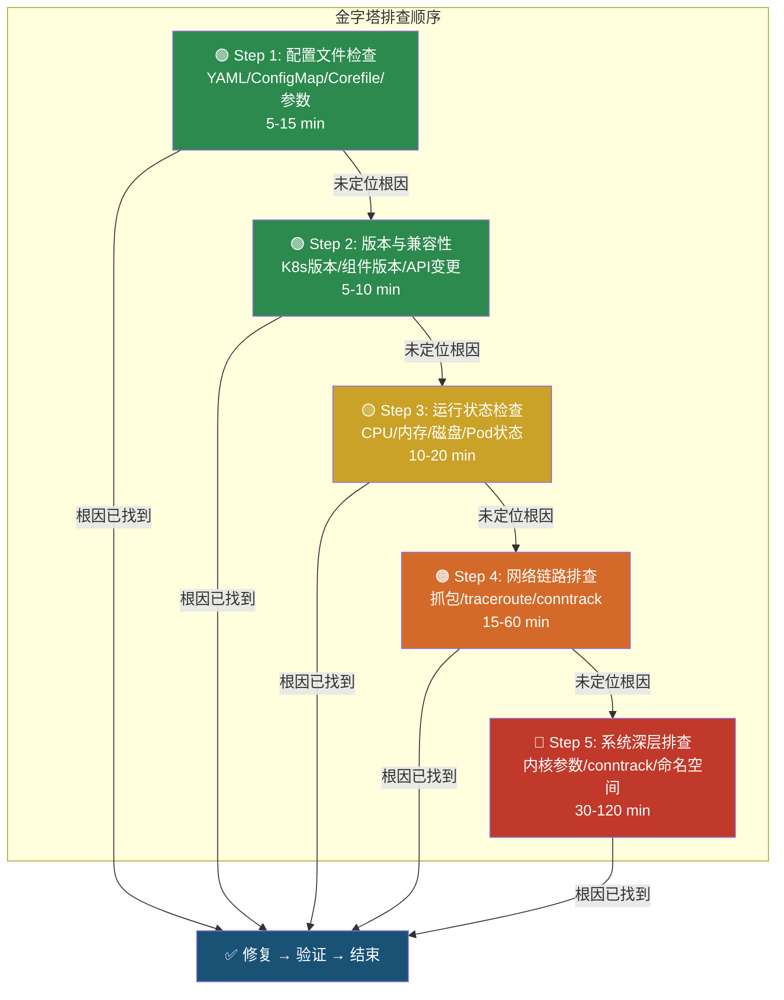
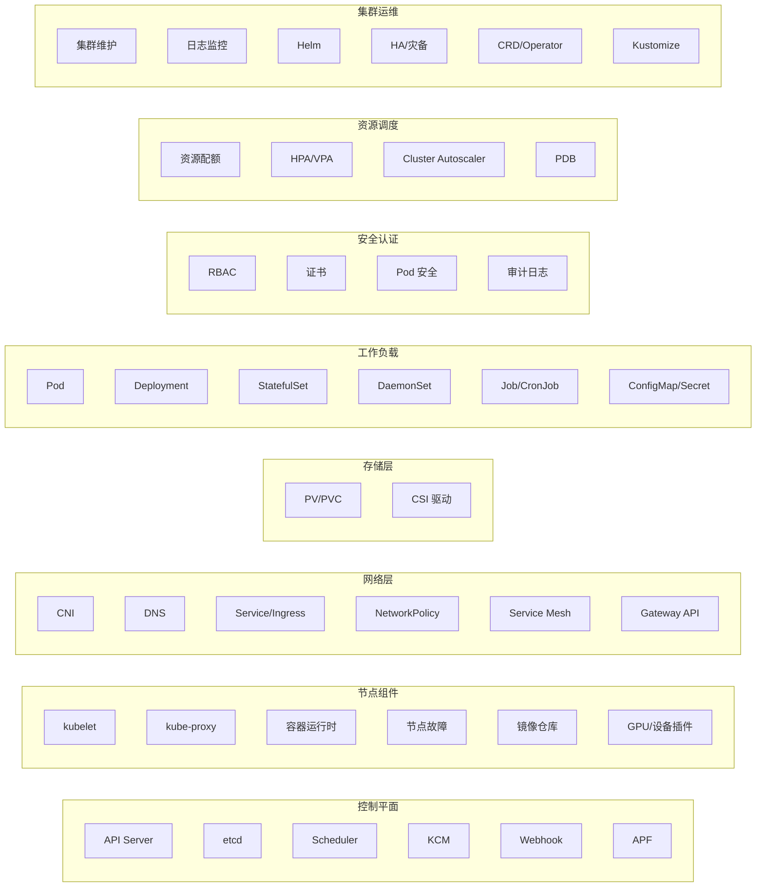
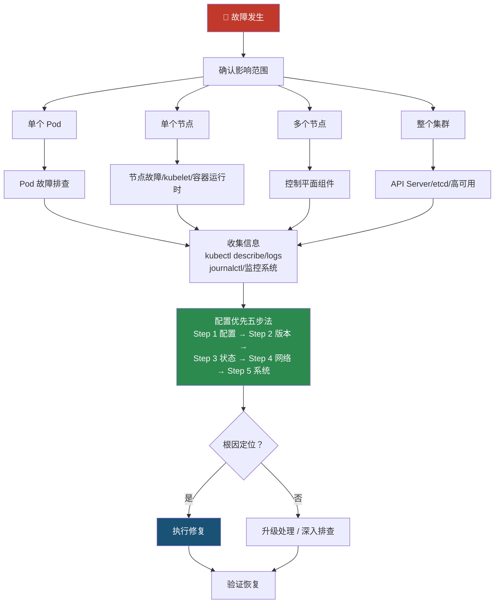

当 Kubernetes 生产集群出现疑难问题时，最常见的困境不是"没有排查手段"，而是"不知道该从哪里开始"。面对症状模糊、多组件交叉关联的复杂故障，SRE 工程师往往陷入"东查一下、西查一下"的无序状态。本页系统梳理了一套**配置优先（Configuration-First）**的结构化排查方法论，并基于 41 篇组件级排障指南，构建从现象到根因的全景式排查路径，帮助你在面对任何 Kubernetes 故障时都能快速定位排查起点、遵循最优排查顺序。

Sources: [00-configuration-first-methodology.md](topic-structural-trouble-shooting/00-configuration-first-methodology.md#L1-L29), [README.md](topic-structural-trouble-shooting/README.md#L1-L17)

## 方法论定位：四层排查体系

本页所介绍的"配置优先方法论"并非孤立存在，而是与 [FTA 故障树分析：从演绎推理到 AI Agent 知识骨架](13-fta-gu-zhang-shu-fen-xi-cong-yan-yi-tui-li-dao-ai-agent-zhi-shi-gu-jia)、[FEBM 法医鉴定循证方法论](14-febm-fa-yi-jian-ding-xun-zheng-fang-fa-lun-cong-zheng-ju-dao-jie-lun-de-gui-na-shi-qu-zheng)、[运维 Skill 库](16-yun-wei-skill-ku-ai-agent-ke-zhi-xing-de-gong-dan-zhen-duan-xiu-fu-bi-huan)共同构成完整的四层排查体系：

| 维度 | 配置优先方法论（本页） | FTA 故障树 | FEBM 取证 | Skills 自动化 |
|------|-------------|-----------|----------|--------|
| **解决的核心问题** | 排查顺序与策略——先查什么、后查什么 | 根因定位模型——为什么出问题 | 证据推导——如何从证据得出结论 | 自动化执行——Agent 怎么做 |
| **核心思想** | 先简后繁、先配置后链路 | 演绎分解 | 归纳推理 | 诊断-修复闭环 |
| **最佳使用时机** | 疑难问题的排查入口 | 构建因果关系图 | 事后复盘取证 | Agent 运行时自动诊断 |

**配置优先方法论**解决的是最前置的决策问题：当你面对一个疑难故障时，第一步该做什么？答案不是抓包，不是查内核参数，而是——**先检查配置文件**。

Sources: [00-configuration-first-methodology.md](topic-structural-trouble-shooting/00-configuration-first-methodology.md#L15-L37)

## 黄金法则：为什么配置必须优先

根据生产环境故障统计数据，**近一半（~45%）的故障根因是配置错误**，而配置检查是所有排查手段中成本最低、速度最快的——通常只需 5-15 分钟即可完成。如果跳过配置检查直接深入网络/内核排查，平均会浪费 30-120 分钟在错误的方向上。

| 根因分类 | 占比 | 典型排查时间 | 典型修复时间 |
|---------|------|-------------|-------------|
| **配置错误** | ~45% | 5-15 分钟 | 2-5 分钟 |
| 资源不足 | ~20% | 10-30 分钟 | 5-15 分钟 |
| 版本/兼容性 | ~10% | 15-60 分钟 | 10-30 分钟 |
| 网络链路 | ~10% | 30-120 分钟 | 15-60 分钟 |
| 内核/系统 | ~8% | 60-240 分钟 | 30-120 分钟 |
| 未知/复合 | ~7% | 120+ 分钟 | 60+ 分钟 |

这个数据的含义非常明确：**在投入任何高成本排查手段之前，配置验证是不可跳过的第一步**。

Sources: [00-configuration-first-methodology.md](topic-structural-trouble-shooting/00-configuration-first-methodology.md#L42-L59)

## 排查顺序金字塔与五步法

配置优先方法论将排查过程组织为一个自底向上的**成本递增金字塔**，并据此提炼出可操作的**五步法**：



五步法的关键约束规则：

- **禁止跳步**：不允许跳过 Step 1 直接进入 Step 4，除非有明确证据排除配置问题
- **证据驱动**：每一步的排除必须有明确的命令输出或日志证据支撑
- **时间门控**：每一步有建议的时间上限，超时应重新评估方向

Sources: [00-configuration-first-methodology.md](topic-structural-trouble-shooting/00-configuration-first-methodology.md#L61-L97)

## Step 1 详解：配置检查四层模型与通用检查清单

配置检查并非简单地"看一眼 YAML"——它需要按照层次化的模型系统性推进。对于 Kubernetes 中的任何组件，配置检查应覆盖以下四个层次：

| 层次 | 检查范围 | 典型内容 |
|------|---------|---------|
| **Layer 4: 应用层配置** | Pod 内部配置 | ConfigMap / Secret / 环境变量 / 命令行参数 |
| **Layer 3: Kubernetes 资源配置** | 集群资源定义 | Deployment / Service / Ingress / NetworkPolicy YAML |
| **Layer 2: 集群基础设施配置** | 节点级组件参数 | kubelet 参数 / kube-proxy 配置 / CNI 配置 |
| **Layer 1: 节点/系统配置** | 操作系统级配置 | /etc/resolv.conf / sysctl / 内核模块 |

在每个层次上，应回答以下七项**通用配置检查清单**（C1-C7）：

| 编号 | 检查项 | 检查内容 | 判定标准 |
|------|--------|---------|---------|
| C1 | **语法正确性** | 配置文件是否有语法错误 | 无解析错误、无 YAML 缩进问题 |
| C2 | **完整性** | 所有必需字段是否存在 | 必填字段均已配置 |
| C3 | **一致性** | 多个配置之间是否矛盾 | selector、port、名称等跨资源引用一致 |
| C4 | **版本适配** | 配置是否适用于当前 K8s 版本 | API version 正确、无已废弃字段 |
| C5 | **变更追溯** | 近期是否有配置变更 | 检查 git log / audit log / ConfigMap 修改时间 |
| C6 | **默认值陷阱** | 隐式默认值是否符合预期 | 确认关键字段未依赖不安全的默认值 |
| C7 | **权限与引用** | 配置引用的资源是否存在且可访问 | Secret/ConfigMap 存在、RBAC 允许访问 |

Sources: [00-configuration-first-methodology.md](topic-structural-trouble-shooting/00-configuration-first-methodology.md#L100-L135)

## 实战案例：CoreDNS 疑难问题的配置优先排查全流程

以下通过一个 CoreDNS 间歇性解析失败的典型案例，演示五步法的具体应用。

### 场景描述

**故障现象**：集群中部分 Pod 间歇性出现 DNS 解析失败，外部域名解析偶尔超时，应用日志报 `could not resolve host` 和 `i/o timeout`，但 CoreDNS Pod 状态显示 Running。

**疑难点**：CoreDNS 没有明显异常（未 Crash、未 OOM），症状间歇性出现，极容易误导排查方向直接进入网络链路排查。

### Step 1：CoreDNS 配置文件检查（首要步骤）

首先检查 CoreDNS 的核心配置——Corefile：

```bash
# 获取 CoreDNS 配置
kubectl get configmap coredns -n kube-system -o yaml
```

必须逐项验证的配置项：

| 编号 | 配置项 | 正确示例 | 常见错误 | 影响 |
|------|--------|---------|---------|------|
| CF1 | `kubernetes` 插件域名 | `kubernetes cluster.local in-addr.arpa ip6.arpa` | 域名拼写错误：`cluser.local` | 集群内部 Service 全部解析失败 |
| CF2 | `forward` 上游 DNS | `forward . /etc/resolv.conf` 或 `forward . 8.8.8.8` | 指向不可达的 DNS 服务器 | 外部域名解析全部失败 |
| CF3 | `loop` 插件 | 必须存在 `loop` | 缺少 loop 检测 | DNS 转发环路导致 CoreDNS 崩溃 |
| CF4 | `cache` 插件配置 | `cache 30` | 缓存时间过短或缺失 | DNS 查询量激增，性能下降 |

然后检查 Pod 的 DNS 配置（resolv.conf）和 Deployment/Service 配置一致性：

```bash
# 检查目标 Pod 的 DNS 配置
kubectl exec <problem-pod> -- cat /etc/resolv.conf

# 验证 kube-dns Service ClusterIP
kubectl get svc kube-dns -n kube-system -o jsonpath='{.spec.clusterIP}'

# 检查 Endpoints 是否正常填充
kubectl get endpoints kube-dns -n kube-system
```

完成 Step 1 后应明确填写检查结论模板，确认每项是通过或发现问题。

### Step 2-5 递进排查

当 Step 1 未发现配置问题时，依次进入**版本兼容性验证**（检查 CoreDNS 版本与 K8s 版本兼容矩阵）、**运行状态与资源检查**（CPU/内存使用、副本数、SERVFAIL 率）、**网络链路排查**（Pod IP 连通性、kube-proxy 规则、NetworkPolicy 阻断、conntrack 表），以及最后的**系统深层排查**（内核 conntrack 竞态、IPVS 规则、系统级 DNS 缓存）。每一步都附带明确的检查命令和判定标准。

Sources: [00-configuration-first-methodology.md](topic-structural-trouble-shooting/00-configuration-first-methodology.md#L138-L355)

## 全组件排障地图：41 篇指南全景覆盖

配置优先方法论提供了排查策略框架，而具体的组件级操作则由 41 篇排障指南承载。以下按照**控制平面 → 节点组件 → 网络 → 存储 → 工作负载 → 安全认证 → 资源调度 → 集群运维 → 云厂商/AI/GitOps/可观测性**的分层结构组织。



### 按错误现象快速定位

面对具体故障时，按下表快速定位对应的排障指南：

| 错误现象 | 推荐排查方向 |
|----------|------------|
| kubectl 连接失败 | API Server → 证书 → 高可用 |
| 节点 NotReady | kubelet → 容器运行时 → 节点故障专项 |
| Pod Pending | Scheduler → 资源配额 → PV/PVC → 节点故障 |
| Pod CrashLoopBackOff | Pod 故障排查 → 日志分析 |
| Pod OOMKilled | 资源配额 → 内存限制调优 |
| Service 不可达 | kube-proxy → Service/Ingress |
| DNS 解析失败 | DNS（CoreDNS）配置排查 |
| 镜像拉取失败 | kubelet → 容器运行时 → 镜像仓库认证 |
| 卷挂载失败 | PV/PVC → CSI 存储驱动 |
| 权限不足 (403) | RBAC → Pod 安全策略 |
| 证书过期/TLS 错误 | 证书故障排查 → cert-manager |
| Webhook 拒绝请求 | Webhook/准入控制排查 |
| HPA 不扩容 | HPA/VPA → metrics-server 状态 |
| GPU Pod 调度失败 | GPU/设备插件故障排查 |
| Helm 安装/升级失败 | Helm 部署故障排查 |
| CRD/CR 操作失败 | CRD/Operator 故障排查 |
| API 请求限流 (429) | API 优先级与公平性 (APF) |
| kubectl drain 卡住 | PodDisruptionBudget 排查 |

Sources: [README.md](topic-structural-trouble-shooting/README.md#L116-L157)

### 各组件 10 分钟快速诊断模板

每篇组件排障指南都内置了一个"10 分钟快速诊断"流程，包含七个标准步骤：**确认影响面 → 组件存活检查 → 资源与压力评估 → 接口/依赖交互检查 → 深层信号识别 → 快速缓解措施 → 证据留存**。以下展示几个关键组件的快速诊断要点：

**API Server**：确认 `kubectl version` 和 `/readyz` 是否返回 → 查看健康端点详细输出 → 检查资源与 APF 限流 → 检查 etcd 延迟 → 分析请求模式（LIST/watch 风暴）。

Sources: [01-apiserver-troubleshooting.md](topic-structural-trouble-shooting/01-control-plane/01-apiserver-troubleshooting.md#L28-L39)

**kubelet**：`kubectl get nodes -o wide` 查看节点面状态 → `curl localhost:10248/healthz` 检查存活 → `free -m`/`df -h` 确认资源压力 → `crictl info` 验证 CRI 交互 → `journalctl -u kubelet | grep PLEG` 检查 PLEG/驱逐信号。

Sources: [01-kubelet-troubleshooting.md](topic-structural-trouble-shooting/02-node-components/01-kubelet-troubleshooting.md#L14-L26)

**CNI 网络插件**：检查 CNI DaemonSet 存活 → 节点上验证 `/etc/cni/net.d/` 与 `/opt/cni/bin/` 完整性 → 检查 Pod IP 分配状态 → 验证路由/封装（VXLAN/BGP） → 测试 MTU 与跨节点连通。

Sources: [01-cni-troubleshooting.md](topic-structural-trouble-shooting/03-networking/01-cni-troubleshooting.md#L24-L37)

**Pod 故障排查**：四步法 `get → describe → logs → exec` → 定位 Pending/ContainerCreating/CrashLoopBackOff 阶段 → 确认镜像与拉取 → 检查资源与驱逐 → 验证网络/存储。

Sources: [01-pod-troubleshooting.md](topic-structural-trouble-shooting/05-workloads/01-pod-troubleshooting.md#L16-L27)

**PV/PVC 存储**：`kubectl get pvc -A` 查看 PVC 状态 → 核对 PV/StorageClass 配置 → 检查 VolumeAttachment 附件状态 → 节点上确认设备与挂载存在 → 排查 Multi-Attach 冲突。

Sources: [01-pv-pvc-troubleshooting.md](topic-structural-trouble-shooting/04-storage/01-pv-pvc-troubleshooting.md#L16-L27)

**RBAC/认证**：`kubectl auth whoami` 确认身份 → `kubectl auth can-i` 快速权限判断 → 检查事件与审计日志 → 排查绑定链路 → 验证 ServiceAccount Token。

Sources: [01-rbac-troubleshooting.md](topic-structural-trouble-shooting/06-security-auth/01-rbac-troubleshooting.md#L15-L26)

**AI/ML 工作负载**：检查 GPU 可见性 → Device Plugin DaemonSet 状态 → 分布式训练 Pod 的 NCCL/网络报错 → 数据集 PVC 挂载与 I/O 吞吐 → GPU 资源请求碎片化。

Sources: [01-ai-ml-workloads-troubleshooting.md](topic-structural-trouble-shooting/10-ai-ml-workloads/01-ai-ml-workloads-troubleshooting.md#L5-L15)

## 通用排查流程：从现象到修复

当面对一个未知的故障时，遵循以下标准流程：



Sources: [README.md](topic-structural-trouble-shooting/README.md#L201-L231)

## 反模式与陷阱：排查中最常见的五个错误

| 编号 | 反模式 | 描述 | 后果 | 正确做法 |
|------|--------|------|------|---------|
| A1 | **跳过配置直接抓包** | 看到网络相关现象就立即 tcpdump | 浪费 30-120 分钟，可能根因只是一个 typo | 先检查配置，排除配置问题后再抓包 |
| A2 | **症状驱动而非系统性** | 根据症状猜测根因，东查一下西查一下 | 遗漏真正的根因，延长故障时间 | 按五步法顺序排查，每步有明确的检查清单 |
| A3 | **不记录排除证据** | 检查了但没记录结果 | 重复排查、交接困难、复盘无据可查 | 每步填写检查结论模板 |
| A4 | **忽略近期变更** | 不查变更历史就开始排查 | 70% 的故障与近期变更相关 | Step 1 必须包含变更追溯 |
| A5 | **默认值盲区** | 假设默认配置没问题 | Kubernetes 默认值不一定适合所有场景 | 明确检查关键参数的默认值 |

Sources: [00-configuration-first-methodology.md](topic-structural-trouble-shooting/00-configuration-first-methodology.md#L486-L506)

## 其他常见组件的 Step 1 配置检查速查

配置优先方法论不仅适用于 CoreDNS，以下列出其他组件的 Step 1 配置检查要点：

### Ingress/Gateway 疑难排查

| 配置检查项 | 检查命令 | 常见配置错误 |
|-----------|---------|------------|
| Ingress 规则 | `kubectl get ingress -o yaml` | host/path 配置错误、TLS secret 引用不存在 |
| IngressClass | `kubectl get ingressclass` | 缺少默认 IngressClass 或指定了错误的 class |
| Backend Service | `kubectl get svc <backend>` | Service 端口与 Ingress 配置不匹配 |
| TLS 证书 | `kubectl get secret <tls-secret> -o yaml` | 证书过期、域名不匹配、格式错误 |

### Service 连通性疑难排查

| 配置检查项 | 检查命令 | 常见配置错误 |
|-----------|---------|------------|
| Selector 匹配 | `kubectl get svc <svc> -o jsonpath='{.spec.selector}'` | Selector 与 Pod label 不匹配 |
| 端口映射 | `kubectl get svc <svc> -o yaml` | targetPort 与容器端口不一致 |
| Endpoints 填充 | `kubectl get endpoints <svc>` | Endpoints 为空（Selector 错误或 Pod 未就绪） |

### etcd 疑难排查

| 配置检查项 | 检查命令 | 常见配置错误 |
|-----------|---------|------------|
| 集群成员配置 | `etcdctl member list` | 成员 URL 不一致或指向已下线节点 |
| 证书配置 | 检查 etcd 启动参数中的证书路径 | 证书过期、CA 不匹配 |
| 数据目录 | 检查 `--data-dir` 参数 | 磁盘满、权限错误 |
| 快照与压缩 | 检查 `--auto-compaction-*` 参数 | 未启用自动压缩导致数据库膨胀 |

### Pod 启动失败疑难排查

| 配置检查项 | 检查命令 | 常见配置错误 |
|-----------|---------|------------|
| 镜像名称与标签 | `kubectl get pod <pod> -o jsonpath='{.spec.containers[*].image}'` | 镜像名拼写错误、标签不存在 |
| 资源请求/限制 | `kubectl get pod <pod> -o yaml \| grep -A 5 resources` | requests 超出节点容量、limits 过低 |
| Volume 挂载 | `kubectl describe pod <pod> \| grep -A 10 Volumes` | ConfigMap/Secret/PVC 不存在或名称错误 |
| SecurityContext | `kubectl get pod <pod> -o yaml \| grep -A 10 securityContext` | 与 PSA 策略冲突 |

Sources: [00-configuration-first-methodology.md](topic-structural-trouble-shooting/00-configuration-first-methodology.md#L358-L398)

## 文档统计与覆盖范围

本知识库共包含 **41 篇**组件级排障指南，覆盖 Kubernetes 全栈组件：

| 类别 | 文档数 | 覆盖内容 | 生产环境优先级 |
|------|--------|----------|--------------|
| 控制平面 | 6 | API Server、etcd、Scheduler、KCM、Webhook、APF | ⭐⭐⭐ 集群核心组件 |
| 节点组件 | 6 | kubelet、kube-proxy、容器运行时、节点故障、镜像仓库、GPU/设备插件 | ⭐⭐⭐ 节点稳定性保障 |
| 网络 | 6 | CNI、DNS、Service/Ingress、NetworkPolicy、Service Mesh、Gateway API | ⭐⭐ 网络连通性保障 |
| 存储 | 2 | PV/PVC、CSI 驱动 | ⭐⭐ 数据持久化保障 |
| 工作负载 | 6 | Pod、Deployment、StatefulSet、DaemonSet、Job/CronJob、ConfigMap/Secret | ⭐⭐⭐ 业务应用保障 |
| 安全认证 | 4 | RBAC、证书、Pod 安全、审计日志 | ⭐⭐⭐ 安全合规保障 |
| 资源调度 | 4 | 资源配额、HPA/VPA、Cluster Autoscaler、PDB | ⭐⭐ 性能优化保障 |
| 集群运维 | 6 | 维护升级、日志监控、Helm、HA/灾备、CRD/Operator、Kustomize | ⭐⭐⭐ 运维效率提升 |
| 云厂商/AI/GitOps/可观测 | 4 | 云厂商集成、AI/ML 工作负载、GitOps/DevOps、监控可观测 | ⭐⭐ 扩展场景 |

Sources: [README.md](topic-structural-trouble-shooting/README.md#L236-L248)

## 排查前置条件与工具推荐

在进入排查流程前，请确保以下准备到位：

- **建议工具链**：`kubectl` + `stern`/`tail` + `kubectl-debug`/ephemeral container + `kubectl-trace` + eBPF 观测工具（bcc/bpftrace/inspektor-gadget）+ `perf`/flamegraph + `sysdig`/`ksniff` + `tcpdump`/wireshark
- **排查前置检查**：记录变更窗口、确认影响范围、备份关键配置/证书/etcd、准备回滚方案；生产环境操作优先在低峰执行并预留隔离窗口
- **数据留存规范**：操作前后收集 `kubectl get/describe/logs`，关键组件日志与指标快照，必要时保留 pprof/heapdump
- **安全提示**：涉及证书/密钥/审计日志时注意脱敏；对 Webhook、PSA、NetworkPolicy、PDB 等变更先在灰度/测试环境验证

此外，`domain-10-troubleshooting-diagnostics/tools/` 目录下提供了一个完整的 Shell 诊断工具套件 `domain12_troubleshooting_toolkit.sh`，可自动执行集群健康检查、节点诊断、Pod 状态分析等任务，适合作为排查流程中的辅助自动化工具。

Sources: [README.md](topic-structural-trouble-shooting/README.md#L108-L114), [domain12_troubleshooting_toolkit.sh](domain-10-troubleshooting-diagnostics/tools/domain12_troubleshooting_toolkit.sh#L1-L58)

## 配置优先排查 Checklist（可直接打印使用）

以下检查表可在实际排查中直接逐项勾选：

**通用配置检查表**：
- [ ] **C1** 核心配置文件获取并审查（语法、完整性）
- [ ] **C2** 配置文件中所有引用的资源存在且可访问（Secret、ConfigMap、Service）
- [ ] **C3** 跨资源配置一致性验证（selector、port、name 匹配）
- [ ] **C4** API 版本与 K8s 版本兼容性确认
- [ ] **C5** 近期配置变更追溯（24 小时内）
- [ ] **C6** 关键参数默认值确认（非依赖隐式默认值）
- [ ] **C7** 多副本/多实例配置一致性

**CoreDNS 专项检查表**（作为示例）：
- [ ] **CF1** Corefile 语法正确、插件链顺序正确
- [ ] **CF2** `kubernetes` 插件域名 `cluster.local` 拼写正确
- [ ] **CF3** `forward` 上游 DNS 可达且响应正常
- [ ] **CF4** `loop` 插件存在（防止转发环路）
- [ ] **CF5** `cache` 插件配置合理
- [ ] **CF6** `reload` 插件存在（支持热加载）
- [ ] **CF7-CF12** resolv.conf、Service selector、Endpoints、副本数、资源限制等

Sources: [00-configuration-first-methodology.md](topic-structural-trouble-shooting/00-configuration-first-methodology.md#L509-L537)

## 延伸阅读与下一步

本页是故障排查方法论的策略层入口。当你需要更深层的分析方法或自动化执行能力时，推荐按以下路径深入：

- **因果分析模型** → [FTA 故障树分析：从演绎推理到 AI Agent 知识骨架](13-fta-gu-zhang-shu-fen-xi-cong-yan-yi-tui-li-dao-ai-agent-zhi-shi-gu-jia)：当你需要构建故障的因果关系图、理解多因素耦合的根因链路时
- **事后复盘取证** → [FEBM 法医鉴定循证方法论](14-febm-fa-yi-jian-ding-xun-zheng-fang-fa-lun-cong-zheng-ju-dao-jie-lun-de-gui-na-shi-qu-zheng)：当故障已修复、需要从证据链归纳总结时
- **自动化诊断修复** → [运维 Skill 库：AI Agent 可执行的工单诊断-修复闭环](16-yun-wei-skill-ku-ai-agent-ke-zhi-xing-de-gong-dan-zhen-duan-xiu-fu-bi-huan)：当你需要让 AI Agent 自动执行排障流程时
- **Kubernetes 架构原理** → [架构基础与核心组件原理](5-jia-gou-ji-chu-yu-he-xin-zu-jian-yuan-li)：当排障过程中需要深入理解组件交互原理时
- **可观测性体系** → [可观测性：监控指标、日志审计、链路追踪与混沌工程](12-ke-guan-ce-xing-jian-kong-zhi-biao-ri-zhi-shen-ji-lian-lu-zhui-zong-yu-hun-dun-gong-cheng)：当需要构建预防性监控与告警体系时