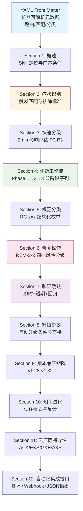
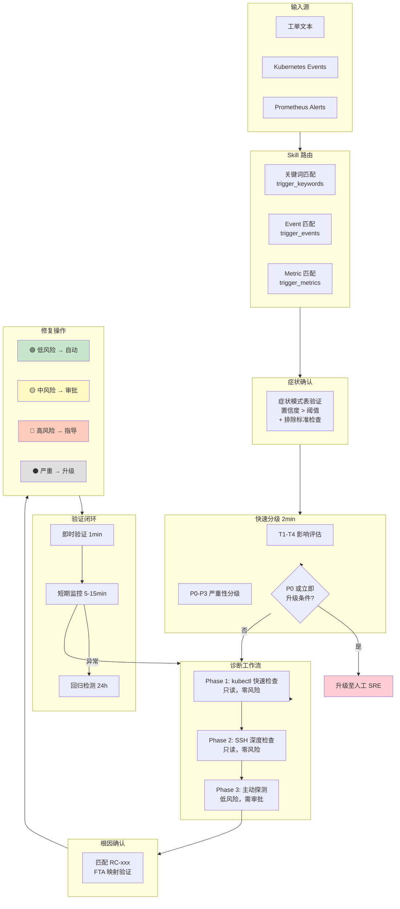

Skill 库（`topic-skills/`）是 KUDIG 知识体系中面向 **AI Agent 运行时** 的核心执行层。它将 18 类高频 Kubernetes 工单场景，封装为从**症状触发**到**修复验证**的完整闭环 Runbook——每个 Skill 都是自包含的、机器可解析的、带风险门控的诊断-修复执行单元。Agent 接收到工单或告警后，沿着「路由匹配 → 症状识别 → 快速分级 → 分阶段诊断 → 根因确认 → 风险分级修复 → 验证确认 → 必要时升级」的标准流水线推进，形成可追溯、可审计的自动化工单处理闭环。

Sources: [README.md](技能体系/README.md#L1-L9), [skill-schema.md](技能体系/skill-schema.md#L1-L27)

## 四层知识架构中的定位

Skill 库在 KUDIG 的知识分层中占据**最顶层执行位**，它向下依赖故障树分析模型、结构化排查指南和领域知识，向上为 Agent 运行时提供可直接调度的动作序列。理解这一定位，是正确使用 Skill 库的前提。

```
┌─────────────────────────────────────────────────────────────────┐
│  Layer 4: topic-skills/         (做什么 — Agent 执行层)          │
│  自包含 Runbook：症状触发 → 诊断 → 修复 → 验证 → 升级            │
├─────────────────────────────────────────────────────────────────┤
│  Layer 3: topic-fta/list/       (为什么 — 故障分析模型层)         │
│  FTA 故障树：概率模型、因果链、底事件分解                          │
├─────────────────────────────────────────────────────────────────┤
│  Layer 2: topic-structural-     (怎么查 — 深度排查参考层)         │
│           trouble-shooting/                                      │
├─────────────────────────────────────────────────────────────────┤
│  Layer 1: domain-*/             (背景知识 — 理论与架构层)          │
│  组件架构、设计原理、理论基础                                     │
└─────────────────────────────────────────────────────────────────┘
```

| 维度 | topic-fta/list/ | topic-structural-trouble-shooting/ | **topic-skills/** |
|------|----------------|-----------------------------------|-------------------|
| **定位** | 故障树分析模型 | 人类可读深度排查指南 | Agent 可执行工单处理 Runbook |
| **结构** | Mermaid 图 + JSON 工作流 | 决策树 + 解释性文字 | YAML 元数据 + 症状触发 + 分步诊断 + 风险分级修复 |
| **受众** | FTA 分析师 / Agent 推理引擎 | 初级到高级运维人员 | AI Agent 运行时（工单处理循环） |
| **粒度** | 按组件（37 个） | 按组件（40+ 文档） | 按故障场景（高频工单类型） |
| **输出** | 根因路径 + 概率 | 解释 + 命令 | 结构化动作序列 + 风险门控 + 验证关卡 |

**关键区别**：FTA 回答"为什么"（因果链推理），结构化排查指南回答"怎么查"（人类可读的深度方法论），Skill 则回答"做什么"——Agent 拿到工单后执行什么动作序列、在哪个步骤停下来等审批、何时升级到人工。三者共同构成从演绎推理到自动化执行的完整链路。

Sources: [README.md](技能体系/README.md#L14-L40)

## Skill 文档的 12-Section 规范结构

每个 Skill 文档严格遵循由 [skill-schema.md](技能体系/skill-schema.md) 定义的 12-Section 规范结构，Agent 运行时按章节编号定位内容。前 10 个 Section 为必选，Section 11-12 为可选扩展。这一固定结构保证了 Agent 解析的确定性和跨 Skill 的一致性。



| Section | 功能 | Agent 运行时角色 |
|---------|------|-----------------|
| YAML Front Matter | 路由匹配（关键词/Event/Metric）、分类、版本兼容 | **路由层**：决定激活哪个 Skill |
| Section 1: 概述 | 覆盖范围、典型场景、前置条件 | **上下文建立**：理解 Skill 边界 |
| Section 2: 症状识别 | 症状模式表（置信度）、工单关键词映射、排除标准 | **意图确认**：验证 Skill 选择的正确性 |
| Section 3: 快速分级 | 影响评估命令（T1-T4）、P0-P3 分级、立即升级条件 | **紧急度判定**：决定后续流程节奏 |
| Section 4: 诊断工作流 | Phase 1（kubectl 只读）→ Phase 2（SSH 深度）→ Phase 3（主动探测） | **证据收集**：按步骤执行，收集诊断数据 |
| Section 5: 根因分类 | RC-xxx 结构化枚举，概率分布，FTA 映射 | **根因匹配**：将证据映射到已知根因 |
| Section 6: 修复操作 | REM-xxx 四档风险分级（🟢🟡🔴⚫），含前置检查/回滚 | **动作执行**：按风险等级决定自动化程度 |
| Section 7: 验证确认 | 即时验证（1min）+ 短期监控（5-15min）+ 回归检测（24h） | **闭环确认**：确认修复生效 |
| Section 8: 升级协议 | 自动升级条件、消息模板、交接信息包 | **异常出口**：无法自动处理时的升级路径 |
| Section 9: 版本兼容矩阵 | v1.28-v1.32 功能差异、命令差异、API 版本 | **环境适配**：根据集群版本调整诊断策略 |
| Section 10: 知识进化 | 误诊模式、深度引用、Skill 改进记录 | **自学习**：从每次执行中积累经验 |
| Section 11: 云厂商特异性 | ACK/EKS/GKE/AKS 平台差异化诊断与修复 | **平台适配**：托管 K8s 的特殊路径 |
| Section 12: 自动化集成接口 | 脚本入口、Webhook 回调、JSON 输出规范 | **系统集成**：与外部工具链的标准化对接 |

Sources: [skill-schema.md](技能体系/skill-schema.md#L1-L27), [skill-schema.md](技能体系/skill-schema.md#L100-L230)

## YAML Front Matter：Agent 路由的元数据基石

每个 Skill 文档以 YAML front matter 开头，这是 Agent 路由引擎的核心输入。通过 `trigger_keywords`（NLP 关键词匹配）、`trigger_events`（Kubernetes Event Reason 匹配）和 `trigger_metrics`（Prometheus 指标模式匹配）三重路由机制，Agent 能够从工单文本、集群事件流、告警规则三种来源自动匹配到正确的 Skill。

以节点 NotReady（SKILL-NODE-001）为例，其 YAML 元数据展示了完整的路由声明：

```yaml
skill_id: "SKILL-NODE-001"
skill_name: "节点 NotReady 诊断与修复 / Node NotReady Diagnosis & Remediation"
category: "node"
severity_range: "P0-P2"
agent_execution_mode: "L1-advisory"   # 仅建议，人工执行
trigger_keywords:                      # NLP 匹配
  - "NotReady"
  - "节点不可用"
  - "kubelet stopped"
trigger_events:                        # Kubernetes Event 匹配
  - "NodeNotReady"
  - "NodeHasDiskPressure"
trigger_metrics:                       # Prometheus 指标匹配
  - 'kube_node_status_condition{condition="Ready",status="false"}'
related_skills:
  - "SKILL-POD-001"
  - "SKILL-SEC-001"
fta_refs:
  - "topic-fta/list/node-fta.md"
```

**分类 ID 命名规范**采用 `SKILL-{CATEGORY}-{SEQ}` 格式，12 个类别覆盖 Node（NODE）、Pod（POD）、网络（NET）、存储（STORE）、安全（SEC）、工作负载（WORK）、镜像（IMAGE）、控制平面（CP）、弹性伸缩（SCALE）、配置（CONFIG）、可观测性（MONITOR/LOG）、性能（PERF）。文档内部，诊断步骤使用 `D{Phase}.{Seq}`、根因使用 `RC-{SEQ}`、修复操作使用 `REM-{SEQ}`、验证步骤使用 `V{Seq}` 的唯一 ID 标识，确保 Agent 定位内容的精确性。

Sources: [skill-schema.md](技能体系/skill-schema.md#L50-L96), [01-node-notready.md](技能体系/01-node-notready.md#L1-L48), [skill-schema.md](技能体系/skill-schema.md#L448-L460)

## Agent 执行流水线：从工单到闭环

Skill 的执行流水线遵循严格有序的阶段推进，每个阶段都有明确的输入、输出和门控条件。以下 Mermaid 图展示了一个典型的工单处理全流程：



### 路由匹配：三重触发器

Agent 路由引擎通过三重匹配机制从输入源定位到正确的 Skill：**NLP 关键词**匹配工单文本中的自然语言描述（如"节点 NotReady"、"ImagePullBackOff"），**Event Reason**匹配 Kubernetes 集群事件流中的标准化事件标识（如 `NodeNotReady`、`FailedScheduling`），**Prometheus 指标**匹配告警规则中的指标模式（如 `kube_node_status_condition{condition="Ready",status="false"}`）。当多个 Skill 同时匹配时，Agent 进入症状模式表（Section 2）进行置信度排序，排除不适用的 Skill。

Sources: [README.md](技能体系/README.md#L176-L223)

### 症状识别与排除标准

Section 2 的症状模式表是路由决策的核心验证层。每个症状条目包含：症状描述（中英双语）、检测方法（具体的 kubectl 命令或指标查询）、置信度（0.0-1.0，反映该症状对此 Skill 的特异性）以及排除条件（明确指向应路由到的其他 Skill）。以 SKILL-NODE-001 为例，其症状模式表包含 10 个症状条目，覆盖从 `kubectl get nodes` 显示 NotReady（置信度 0.95）到 Prometheus `KubeNodeNotReady` 告警触发（置信度 0.95）等全部关键信号。

**排除标准**同样关键——它防止 Agent 将不属于本 Skill 的工单错误路由。例如节点状态 Ready 但 Pod CrashLoopBackOff 应路由到 SKILL-POD-001，节点被 cordon 标记为 SchedulingDisabled 但状态为 Ready 属于人工操作而非故障。

Sources: [skill-schema.md](技能体系/skill-schema.md#L115-L143), [01-node-notready.md](技能体系/01-node-notready.md#L78-L128)

### 快速分级：2 分钟影响评估

进入诊断之前，Agent 必须在 2 分钟内完成影响评估和严重性分级。通过不超过 5 条只读命令（T1-T4 步骤），评估 NotReady 节点数量占比、是否涉及控制平面节点、受影响工作负载规模、故障持续时间四个维度。分级结果决定后续流程的节奏和自动化边界：

| 条件 | 级别 | SLA 要求 |
|------|------|---------|
| >30% 节点 NotReady **或** 任何控制平面节点 NotReady | **P0** | 立即响应，15min 内确认根因 |
| 多个工作节点 NotReady（2-30%） | **P1** | 15min 内响应，30min 内修复 |
| 单个工作节点 NotReady | **P2** | 30min 内响应，2h 内修复 |
| 新节点未承载业务流量 | **P3** | 4h 内处理 |

存在**立即升级触发条件**（如 >50% 节点 NotReady、所有控制平面节点 NotReady、`kubectl get nodes` 本身超时）时，Agent 跳过全部诊断步骤，直接升级至人工。

Sources: [skill-schema.md](技能体系/skill-schema.md#L147-L184), [01-node-notready.md](技能体系/01-node-notready.md#L132-L200)

### 诊断工作流：三阶段递进

诊断工作流是 Skill 的核心知识载体，按**风险递增**原则分为三个 Phase：

**Phase 1（快速检查，只读零风险）**通过 kubectl 远程收集节点状态信息，包含 D1.1（节点全局状态概览）→ D1.2（节点详细 Conditions）→ D1.3（节点事件）→ D1.4（节点 Taints）→ D1.5（节点 Lease 对象）共 5 个步骤。每个步骤都有唯一 ID、超时时间、预期输出模式和明确的判断规则（条件 → 动作格式），Agent 按顺序执行并在每步根据输出决定分支走向。

**Phase 2（深度检查，只读零风险，需 SSH）**在 Phase 1 无法确认根因时进入，需要 SSH 到故障节点执行系统级检查：D2.1 kubelet 服务状态 → D2.2 kubelet 日志 → D2.3 containerd 服务状态 → D2.4 containerd 日志 → D2.5 系统资源压力（磁盘/内存/PID/inode）→ D2.6 PLEG 健康检查 → D2.7 网络连通性 → D2.8 证书检查 → D2.9 内核日志 → D2.10 NTP 时钟同步。每个步骤标注了 K8s 版本差异，如 `[v1.30+]` swap 支持影响内存压力判断、`[v1.31+]` EventedPLEG 默认启用减少 PLEG 误报。

**Phase 3（主动探测，低风险）**涉及轻量网络请求或修改操作，在 L1-advisory 模式下需人工确认。包含 apiserver 健康检查、CNI 插件状态、kube-proxy 状态等主动探测项。

对于批量 NotReady（多节点同时异常），Skill 还定义了 **Phase 4（级联故障分析）**：批量节点关联性分析（Zone/Rack 分布）→ 网络层面排查 → 控制平面健康检查 → 时钟偏差批量检查，用于区分独立故障和共同根因导致的级联故障。

Sources: [skill-schema.md](技能体系/skill-schema.md#L188-L230), [01-node-notready.md](技能体系/01-node-notready.md#L205-L399), [01-node-notready.md](技能体系/01-node-notready.md#L576-L666)

### 根因分类与 FTA 映射

Section 5 以结构化表格枚举所有已知根因，每条包含根因 ID（RC-xxx）、描述、概率（高/中/低）、诊断证据（引用 Section 4 的 Step ID）和 FTA 映射（引用 `topic-fta/list/` 中的底事件 ID）。以 SKILL-NODE-001 为例，它定义了 15 个根因，从高频的 kubelet 进程崩溃（RC-001，概率"高"）到低频的 kubelet 证书自动轮转失败（RC-015，概率~4%），每个根因都映射到对应的 FTA 故障树底事件，如 RC-001 映射到 `node-fta: BE-kubelet-crash`。

Sources: [01-node-notready.md](技能体系/01-node-notready.md#L669-L688), [skill-schema.md](技能体系/skill-schema.md#L233-L248)

## 风险门控：四档修复与 Human-in-the-Loop

修复操作（Section 6）是 Skill 的执行核心，按风险等级分为四档，每档对应不同的自动化程度。**这不仅是技术分级，更是安全护栏**——它确保 Agent 的自动化行为始终在可接受的风险边界内。

| 风险等级 | 标识 | Agent L1 模式 | Agent L2 模式 | Agent L3 模式 | 示例操作 |
|---------|------|-------------|-------------|-------------|---------|
| 低风险 | 🟢 | 建议执行 | 自动执行 | 自动执行 | uncordon 节点、清理磁盘 |
| 中风险 | 🟡 | 建议执行 | 人工审批后执行 | 自动执行 | 重启 kubelet/containerd、调整驱逐阈值 |
| 高风险 | 🔴 | 仅提供指导 | 建议 | 人工审批后执行 | drain 节点、替换节点、证书轮转 |
| 严重 | ⚫ | 升级至人工 | 升级至人工 | 升级至人工 | 内核热补丁、硬件更换 |

每个修复操作（REM-xxx）必须包含完整的 **前置检查** → **执行命令** → **后置验证** → **回滚方案** 四步链路。以 REM-002（清理磁盘空间）为例：前置检查确认磁盘使用率确实 >85%；执行清理已退出容器、无用镜像、旧日志和 journal 日志；后置验证确认使用率降至 85% 以下且 DiskPressure 恢复为 False；回滚方案说明清理为不可逆操作但仅涉及缓存/日志。对于 🔴 高风险操作如 REM-006（排空节点并重启），还必须包含 PodDisruptionBudget 检查、local storage 确认等安全检查项。

Sources: [README.md](技能体系/README.md#L250-L257), [01-node-notready.md](技能体系/01-node-notready.md#L691-L900), [skill-schema.md](技能体系/skill-schema.md#L254-L316)

## 验证闭环与升级协议

### 三级验证体系

修复操作执行后，Section 7 定义了三级验证体系确保问题真正解决：**即时验证**（修复后 1 分钟内，确认节点状态恢复、Conditions 正常、Lease 续租），**短期监控**（5-15 分钟，监控 CPU/内存/磁盘使用率、kubelet 心跳、PLEG 延迟等指标的趋势），**回归检测**（24 小时内关注节点状态稳定性、资源使用趋势、kubelet 重启次数等）。只有当 Section 7.3 定义的**解决确认标准**全部满足（如节点 Ready 持续 >5 分钟、所有 Conditions 为 False、Pod 恢复 Running、无新增 Warning 事件），才能确认工单关闭。

Sources: [skill-schema.md](技能体系/skill-schema.md#L319-L354), [01-node-notready.md](技能体系/01-node-notready.md#L1175-L1234)

### 升级协议与交接信息包

当 Agent 无法在既定 SLA 内解决问题时（诊断超时 10 分钟未确认根因、修复操作执行 2 次仍失败、严重性升级、未知根因、权限不足、发现安全疑虑），Section 8 定义了标准化的升级流程。升级时 Agent 必须准备完整的**交接信息包**：按时间顺序的完整诊断路径、已排除的根因及排除依据、可能的根因假设及置信度、关键资源的 YAML 快照、以及最近 30 分钟的关键事件时间线。这确保人工接手时不需要重复已完成的工作。

Sources: [skill-schema.md](技能体系/skill-schema.md#L358-L393), [01-node-notready.md](技能体系/01-node-notready.md#L1237-L1302)

## 18 个 Skill 全景索引

当前 Skill 库包含 **18 个 GA 级别 Skill**，覆盖 10 个运维领域、12 个分类，每个 Skill 平均包含 10+ 症状模式、10+ 根因分析、4-10 个修复操作，文档长度 1200-1600 行。

| # | Skill ID | 名称 | 类别 | 文件 | 典型行数 |
|---|----------|------|------|------|---------|
| 01 | SKILL-NODE-001 | 节点 NotReady 诊断与修复 | Node | [01-node-notready.md](技能体系/01-node-notready.md) | ~1416 |
| 02 | SKILL-POD-001 | Pod CrashLoop/OOMKilled 诊断 | Pod | [02-pod-crashloop-oomkilled.md](技能体系/02-pod-crashloop-oomkilled.md) | ~1400 |
| 03 | SKILL-POD-002 | Pod Pending 调度失败诊断 | Pod | [03-pod-pending.md](技能体系/03-pod-pending.md) | ~1350 |
| 04 | SKILL-NET-001 | DNS 解析故障诊断 | Network | [04-dns-resolution-failure.md](技能体系/04-dns-resolution-failure.md) | ~1380 |
| 05 | SKILL-NET-002 | Service 连通性故障诊断 | Network | [05-service-connectivity.md](技能体系/05-service-connectivity.md) | ~1360 |
| 06 | SKILL-SEC-001 | 证书过期与 TLS 故障诊断 | Security | [06-certificate-expiry.md](技能体系/06-certificate-expiry.md) | ~1340 |
| 07 | SKILL-STORE-001 | PVC/PV/CSI 存储故障诊断 | Storage | [07-pvc-storage-failure.md](技能体系/07-pvc-storage-failure.md) | ~1411 |
| 08 | SKILL-WORK-001 | Deployment 滚动更新故障 | Workload | [08-deployment-rollout-failure.md](技能体系/08-deployment-rollout-failure.md) | ~1328 |
| 09 | SKILL-SEC-002 | RBAC 权限与 ResourceQuota 故障 | Security | [09-rbac-quota-failure.md](技能体系/09-rbac-quota-failure.md) | ~1511 |
| 10 | SKILL-IMAGE-001 | 镜像拉取与仓库故障诊断 | Image | [10-image-pull-failure.md](技能体系/10-image-pull-failure.md) | ~1392 |
| 11 | SKILL-CP-001 | etcd 与控制平面故障诊断 | ControlPlane | [11-control-plane-failure.md](技能体系/11-control-plane-failure.md) | ~1535 |
| 12 | SKILL-SCALE-001 | HPA/VPA/CA 弹性伸缩故障 | Scaling | [12-autoscaling-failure.md](技能体系/12-autoscaling-failure.md) | ~1414 |
| 13 | SKILL-NET-003 | Ingress/Gateway 路由故障 | Network | [13-ingress-gateway-failure.md](技能体系/13-ingress-gateway-failure.md) | ~1383 |
| 14 | SKILL-CONFIG-001 | ConfigMap/Secret 配置管理故障 | Configuration | [14-configmap-secret-failure.md](技能体系/14-configmap-secret-failure.md) | ~1283 |
| 15 | SKILL-MONITOR-001 | 监控告警体系故障诊断 | Observability | [15-monitoring-alerting-failure.md](技能体系/15-monitoring-alerting-failure.md) | ~1343 |
| 16 | SKILL-LOG-001 | 日志收集与管理故障诊断 | Observability | [16-logging-pipeline-failure.md](技能体系/16-logging-pipeline-failure.md) | ~1500 |
| 17 | SKILL-PERF-001 | 性能瓶颈诊断与调优 | Performance | [17-performance-bottleneck.md](技能体系/17-performance-bottleneck.md) | ~1436 |
| 18 | SKILL-SECURITY-001 | 安全事件应急响应 | Security | [18-security-incident-response.md](技能体系/18-security-incident-response.md) | ~1619 |

### 症状→Skill 快速路由表

当 Agent 收到工单或告警时，以下高频症状可直接路由到对应 Skill：

| 常见现象 / 告警 | 对应 Skill | 置信度 |
|----------------|-----------|--------|
| `kubectl get nodes` 显示 NotReady | SKILL-NODE-001 | 0.95 |
| Pod 状态 CrashLoopBackOff / OOMKilled (exit 137) | SKILL-POD-001 | 0.95 |
| Pod 长期 Pending / Events 中 FailedScheduling | SKILL-POD-002 | 0.95 |
| 容器内 DNS 解析失败 (NXDOMAIN / timeout) | SKILL-NET-001 | 0.95 |
| Service ClusterIP 无法访问 / Endpoints 为空 | SKILL-NET-002 | 0.90 |
| `x509: certificate has expired` / TLS handshake failure | SKILL-SEC-001 | 0.95 |
| PVC 一直 Pending / StorageClass 不存在 | SKILL-STORE-001 | 0.95 |
| Deployment rollout 卡住 | SKILL-WORK-001 | 0.90 |
| RBAC Forbidden / ResourceQuota exceeded | SKILL-SEC-002 | 0.95 |
| ImagePullBackOff / ErrImagePull | SKILL-IMAGE-001 | 0.95 |
| etcd 集群不健康 / API Server 无响应 | SKILL-CP-001 | 0.95 |
| HPA 不触发扩容 / Metrics Server 无数据 | SKILL-SCALE-001 | 0.90 |
| Ingress 404/502/503 / Gateway 路由异常 | SKILL-NET-003 | 0.90 |

Sources: [README.md](技能体系/README.md#L44-L64), [README.md](技能体系/README.md#L106-L168)

## IDE 目录格式 Skill：可执行脚本与机器可解析数据

除单文件 Skill 外，Skill 库还提供符合主流 IDE（Qoder/Cursor）标准的**目录格式 Skill**，将诊断脚本、机器可解析元数据和模块化参考文档分离组织。目前 `skill-set/k8s-node-notready/` 是完整的标杆实现：

```
skill-set/k8s-node-notready/
├── SKILL.md                        # 入口: Skill 定义 + Agent 执行指令
├── reference/
│   ├── diagnostic-workflow.md      # 完整 Phase 1-3 诊断工作流
│   ├── root-cause-catalog.md       # 12+ 个根因详细说明 + 证据映射
│   ├── remediation-playbook.md     # 修复操作 + 验证 + 升级协议
│   └── version-matrix.md           # K8s v1.28-v1.32 版本兼容
├── scripts/
│   ├── diagnose-quick.sh           # Phase 1: kubectl 快速检查（只读）
│   ├── diagnose-deep.sh            # Phase 2: SSH 深度检查（只读）
│   ├── check-resources.sh          # 资源压力检查（磁盘/内存/PID/inode）
│   ├── cleanup-disk.sh             # 修复: 磁盘空间清理 (REM-002)
│   └── verify-node.sh              # 修复后: 节点健康验证
└── assets/
    ├── skill-metadata.yaml         # 机器可解析的完整元数据（含 RC→FTA 映射）
    ├── symptom-patterns.yaml       # 症状→Skill 匹配规则
    ├── root-cause-map.yaml         # 根因决策树数据
    └── escalation-template.md      # 升级消息模板
```

`assets/skill-metadata.yaml` 是整个目录格式的元数据核心，它不仅包含 YAML front matter 的所有路由信息，还额外声明了 RC→FTA 的双向映射索引（如 `RC-001: ["evt_kubelet_down", "evt_heartbeat_fail"]`）、脚本清单（含参数、风险级别、所属 Phase）、根因和修复操作的完整索引，以及典型触发场景的结构化描述。Agent 运行时可以仅解析此 YAML 文件即可获得完整的 Skill 执行上下文。

Sources: [README.md](技能体系/README.md#L348-L371), [SKILL.md](技能体系/skill-set/k8s-node-notready/SKILL.md#L1-L190), [skill-metadata.yaml](技能体系/skill-set/k8s-node-notready/assets/skill-metadata.yaml#L1-L200)

## 本地 Demo 框架：Kind 集群上的闭环演练

Skill 库配套了完整的本地 Demo 框架（`skills-run/`），允许在 Kind 多节点集群上实际运行从故障注入到修复验证的完整闭环。框架提供 10 个预置场景，每个场景严格映射到对应 Skill 的 Section 章节：

```bash
# 快速开始
cd topic-skills/skills-run
bash setup-kind-cluster.sh     # 创建 1 CP + 2 Worker 的 Kind 集群
bash run-skill-demo.sh          # 交互式选择场景
bash teardown.sh                # 清理
```

| # | 场景 | 对应 Skill | 根因 | 风险 |
|---|------|-----------|------|------|
| 01 | 节点被 cordon | SKILL-NODE-001 | RC-012 | 🟢 |
| 02 | Pod CrashLoopBackOff | SKILL-POD-001 | 启动命令错误 | 🟢 |
| 03 | Pod Pending | SKILL-POD-002 | 资源超限 | 🟢 |
| 04 | DNS 解析故障 | SKILL-NET-001 | CoreDNS 缩容 | 🟢 |
| 05 | Service 无 Endpoints | SKILL-NET-002 | Selector 不匹配 | 🟢 |
| 06 | PVC Pending | SKILL-STORE-001 | StorageClass 不存在 | 🟢 |
| 07 | Deployment rollout 卡住 | SKILL-WORK-001 | readinessProbe 失败 | 🟢 |
| 08 | RBAC 权限拒绝 | SKILL-SEC-002 | 缺少 RBAC 权限 | 🟡 |
| 09 | HPA 不触发扩容 | SKILL-SCALE-001 | 未设置 resources.requests | 🟡 |
| 10 | 镜像拉取失败 | SKILL-IMAGE-001 | 镜像不存在 | 🟢 |

每个 Demo 场景按照 6-Phase 结构运行：Phase 0 故障注入 → Phase 1 症状检测（Section 2）→ Phase 2 快速分级（Section 3）→ Phase 3 诊断工作流（Section 4）→ Phase 4 根因确认（Section 5）→ Phase 5 修复操作（Section 6）→ Phase 6 验证确认（Section 7）。

Sources: [skills-run/README.md](技能体系/skills-run/README.md#L1-L120), [README.md](技能体系/README.md#L317-L342)

## 反馈闭环与知识进化

Skill 库设计了内建的**知识进化机制**（Section 10）。每次 Agent 执行 Skill 后，系统记录以下反馈数据：诊断路径（实际执行了哪些 Step 及每步输出摘要）、根因确认结果（最终确认的根因 ID 及置信度）、修复结果（执行了哪个 REM 操作及是否成功）、验证状态（即时验证是否通过）、以及**新发现**——诊断过程中发现的未在 Skill 中覆盖的情况。

Section 10.1 的**常见误诊模式表**是这一机制的具象化成果。以节点 NotReady 为例，它记录了 6 个高频误诊场景：网络抖动误判为 kubelet 崩溃（实际为交换机端口 flapping）、DiskPressure 归因于镜像过多（实际为日志轮转失败）、PLEG 不健康误判为容器运行时故障（实际为容器 D 状态阻塞）、证书过期误判为网络故障等。每个误诊模式都附带避免方法，Agent 在诊断过程中可以参考这些经验避免重复犯错。

Sources: [skill-schema.md](技能体系/skill-schema.md#L423-L444), [01-node-notready.md](技能体系/01-node-notready.md#L1373-L1416)

## 版本兼容与云厂商适配

### Kubernetes v1.28-v1.32 兼容性

每个 Skill 的 Section 9 提供覆盖 5 个 K8s 版本的兼容矩阵。以下为影响 Skill 诊断行为的关键版本变更：

| 版本 | 关键变更 | 影响的 Skill |
|------|---------|-------------|
| **v1.28** | Native Sidecar Containers (alpha); ValidatingAdmissionPolicy (beta) | 02-pod-crashloop, 03-pod-pending |
| **v1.29** | ReadWriteOncePod GA; nftables kube-proxy (alpha) | 05-service-connectivity, 06-certificate-expiry |
| **v1.30** | Node swap support (beta); HPA container resource metrics | 01-node-notready, 05-service-connectivity |
| **v1.31** | AppArmor GA; Multiple service CIDRs (beta); EventedPLEG 默认启用 | 05-service-connectivity, 01-node-notready |
| **v1.32** | Auto-remove PV claim policy; nftables GA; InPlacePodVerticalScaling (Beta) | 03-pod-pending, 01-node-notready |

诊断工作流的每个步骤中，受版本影响的行为都通过 `**[vX.XX+]**` 标记明确指出，如 `[v1.30+]` NodeSwap 启用时 MemoryPressure 计算包含 swap 使用量、`[v1.31+]` EventedPLEG 默认启用减少 PLEG 误报、`[v1.32+]` nftables 模式下需使用 `nft list ruleset` 替代 `iptables -L`。

Sources: [README.md](技能体系/README.md#L269-L297), [01-node-notready.md](技能体系/01-node-notready.md#L1305-L1370)

### 云厂商特异性（Section 11）

Section 11 为托管 Kubernetes 服务提供平台差异化的诊断与修复指导，覆盖 ACK（阿里云）、EKS（AWS）、GKE（Google Cloud）、AKS（Azure）四大平台。每条差异项包含平台标识、与标准 K8s 的行为差异说明、云厂商 CLI 的诊断命令、平台特定的修复路径和官方文档链接。典型差异包括：ACK 控制平面托管导致无法直接访问 etcd，需通过 `aliyun cs DescribeClusterDetail` 或工单排查；EKS 的 ENI 模式网络需关注 IP 地址耗尽；GKE 自动升级可能导致意外重启。

Sources: [skill-schema.md](技能体系/skill-schema.md#L464-L493)

## 自动化集成接口（Section 12）

Section 12 定义了 Skill 与外部系统集成的标准接口，包含三个层面：

**脚本入口**：为 IDE 目录格式 Skill 提供标准化的 Shell 脚本入口，如 `diagnose-quick.sh --node <NODE_NAME>`、`diagnose-deep.sh --node <NODE_IP> --ssh`、`verify.sh --node <NODE_NAME>`，Agent 可直接调用而无需解析 Markdown 内容。

**Webhook 回调**：支持从 AlertManager/Prometheus 告警或工单系统（Jira/PagerDuty）自动触发 Skill，回调 JSON payload 包含 `skill_id`、`trigger_source`、`context` 等标准字段。

**输出规范**：诊断报告和修复建议以标准 JSON Schema 输出，包含 `findings`（每步发现）、`root_cause_candidates`（候选根因及置信度）、`recommended_action`（推荐修复操作、风险级别、执行命令、回滚命令），便于上游系统解析和审计。

Sources: [skill-schema.md](技能体系/skill-schema.md#L497-L563)

## 增强历程与质量标准

Skill 库经历过一次系统性全面增强（2026-04），将 Skill 数量从 6 个扩展到 18 个（+200%），运维场景覆盖率从 ~60% 提升至 95%+，自动化脚本覆盖率从 17% 提升至 80%+，Demo 场景从 5 个扩展到 10 个。Schema 规范从 10 个 Section 扩展到 12 个（新增云厂商特异性和自动化集成接口），并建立了 12 类 Skill 分类体系。

| 质量维度 | 标准 |
|---------|------|
| 结构规范 | 严格遵循 10+2 Section 模板结构 |
| 症状覆盖 | 每个 Skill 含 10+ 症状模式 |
| 根因分析 | 每个 Skill 含 10+ 根因分析（含概率分布） |
| 风险分级 | 修复操作覆盖四档风险（🟢🟡🔴⚫） |
| 版本兼容 | K8s v1.28-v1.32 版本兼容矩阵 |
| 命令验证 | 所有命令准确可执行 |

Sources: [ENHANCEMENT-RECORD.md](技能体系/ENHANCEMENT-RECORD.md#L1-L178)

## 后续演进方向

Skill 库的演进规划聚焦三个方向：**IDE 目录格式扩展**（为全部 18 个 Skill 提供可执行脚本和机器可解析数据），**云厂商特异性补充**（为现有 Skill 添加 ACK/EKS/GKE/AKS 差异化内容），以及**新 Skill 开发**（节点磁盘压力 SKILL-NODE-002、NetworkPolicy 连通性 SKILL-NET-004、StatefulSet/DaemonSet/Job 故障诊断 SKILL-WORK-002/003/004）。

Sources: [README.md](技能体系/README.md#L375-L394)

## 关联导航

Skill 库与 KUDIG 知识体系的多个模块深度关联，建议按以下路径拓展阅读：

- **故障分析理论基础**：[FTA 故障树分析：从演绎推理到 AI Agent 知识骨架](13-fta-gu-zhang-shu-fen-xi-cong-yan-yi-tui-li-dao-ai-agent-zhi-shi-gu-jia) — Skill 中每个 RC-xxx 都映射到 FTA 底事件
- **诊断方法论**：[FEBM 法医鉴定循证方法论](14-febm-fa-yi-jian-ding-xun-zheng-fang-fa-lun-cong-zheng-ju-dao-jie-lun-de-gui-na-shi-qu-zheng) — Agent 工单处理的理论基础
- **深度排查参考**：[结构化故障排查：配置优先方法论与全组件排障指南](15-jie-gou-hua-gu-zhang-pai-cha-pei-zhi-you-xian-fang-fa-lun-yu-quan-zu-jian-pai-zhang-zhi-nan) — 超出 Skill 覆盖范围的深度排查
- **Agent 工程实践**：[AI Agent 工程：RAG、多 Agent 编排、安全护栏与生产部署](18-ai-agent-gong-cheng-rag-duo-agent-bian-pai-an-quan-hu-lan-yu-sheng-chan-bu-shu) — Skill 的上层 Agent 架构
- **生产运维**：[生产运维：GitOps、FinOps、灾备恢复与变更管理](20-sheng-chan-yun-wei-gitops-finops-zai-bei-hui-fu-yu-bian-geng-guan-li) — Skill 运维场景的宏观上下文