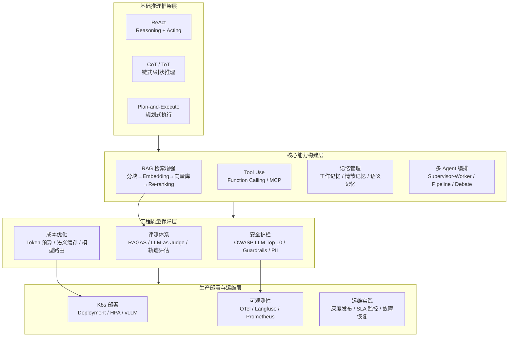

本页是 AI Agent 工程的全域导航入口，覆盖从 RAG 检索增强生成、多 Agent 编排架构、安全护栏体系到 Kubernetes 生产部署的完整工程链路。内容源自 `02-ai-agents` 专题 50 篇文档的生产级实践总结，面向需要在企业环境中落地 Agent 系统的高级工程师，提供架构决策依据、代码级实现参考和经过验证的运维指标。相邻页面 [AI 基础设施：GPU 调度、分布式训练、LLM 推理与成本优化](17-ai-ji-chu-she-shi-gpu-diao-du-fen-bu-shi-xun-lian-llm-tui-li-yu-cheng-ben-you-hua) 覆盖底层 GPU 与推理基础设施，[AI 语料库配置：RAG 分块策略、场景化 Profile 与向量库构建](19-ai-yu-liao-ku-pei-zhi-rag-fen-kuai-ce-lue-chang-jing-hua-profile-yu-xiang-liang-ku-gou-jian) 聚焦语料库分块策略与场景化 Profile 设计。

Sources: [README.md](AI-Agents/README.md#L1-L77)

## 架构全景：Agent 工程的四层能力模型

AI Agent 的核心运行机制是一个**感知→规划→行动→观察**的闭环，区别于普通 LLM 应用的单轮请求-响应模式。Agent 系统从概念到生产需要跨越四个能力层：基础推理框架层（ReAct/CoT/ToT）、核心能力构建层（RAG + Tool Use + 记忆 + 编排）、工程质量保障层（评测 + 安全 + 成本优化）、生产部署与运维层（K8s + 可观测性 + 灰度发布）。以下 Mermaid 图展示四层能力模型的依赖关系与核心技术栈：

**Agent 四大核心能力**定义了系统边界：**感知（Perceive）**接收环境输入（文本、API 响应、文件内容）；**规划（Plan）**通过 CoT/ToT 将复杂目标分解为子任务序列；**行动（Act）**通过 Function Calling 调用工具执行操作；**学习（Learn）**从执行结果获取反馈调整决策。Agent Loop 的终止条件设计是工程落地的第一道关卡——需要同时考虑任务完成度、最大迭代次数、超时阈值和连续失败次数四重约束。

Sources: [01-ai-agent-fundamentals.md](AI-Agents/01-ai-agent-fundamentals.md#L9-L153), [README.md](AI-Agents/README.md#L80-L115)

## Agent 框架选型矩阵

框架选择直接影响开发效率、系统可维护性和扩展能力。以下表格对主流框架进行多维度横向对比，为不同场景提供选型决策依据：

| 框架 | 定位 | 核心优势 | 适用场景 | 学习曲线 | 生产成熟度 |
|------|------|---------|---------|---------|-----------|
| **LangChain** | 通用 Agent 框架 | 生态最丰富，集成 300+ 工具 | 通用 Agent 开发、快速原型 | 中高 | ★★★★☆ |
| **LangGraph** | 图结构状态机 | 精确控制工作流、支持条件路由和人工门禁 | 复杂多步工作流、审批流 | 中 | ★★★★★ |
| **LlamaIndex** | RAG/知识检索 | 分块/检索策略最完善，数据连接器丰富 | 知识库密集型 Agent | 中 | ★★★★☆ |
| **AutoGen** | 多 Agent 对话编排 | 微软出品，Agent 间对话协作优雅 | 研究型多 Agent、代码生成 | 中 | ★★★☆☆ |
| **CrewAI** | 角色扮演多 Agent | 上手简单，角色定义直观 | 快速搭建多 Agent 团队 | 低 | ★★★☆☆ |
| **Dify** | 低代码 LLM 平台 | 可视化工作流、非技术人员可用 | 企业内部工具、快速上线 | 低 | ★★★★☆ |
| **AgentScope** | 阿里多 Agent 框架 | Agent 间通信完善、Studio 可视化追踪 | 企业级多 Agent 应用 | 中 | ★★★★☆ |

**选型决策树**：如果项目需要精确控制执行流程和状态管理 → LangGraph；如果 RAG 质量是核心诉求 → LlamaIndex；如果团队无 AI 工程师 → Dify；如果需要企业级多 Agent 编排 → AgentScope。LangChain 适合需要广泛集成能力的通用场景，但其多层抽象带来的调试复杂度需要在架构评审阶段充分评估。

Sources: [03-agent-frameworks-comparison.md](AI-Agents/03-agent-frameworks-comparison.md#L1-L200)

## RAG：检索增强生成的工程深水区

RAG 是解决 LLM 知识截止日期、领域知识缺失和幻觉问题的标准方案。一个生产级 RAG 管道不只是"向量检索 + LLM 生成"的简单拼接，而是涉及**分块策略 → Embedding 选型 → 向量库部署 → 混合检索 → Re-ranking → 评估闭环**的六段精密工程。

### RAG 演进路径与关键决策

RAG 技术经历了四个代际演进：**Naive RAG**（基础向量检索）→ **Advanced RAG**（查询改写 + 混合检索 + Re-ranking）→ **Modular RAG**（路由 + 迭代检索 + 递归检索）→ **Agentic RAG**（Agent 自主决定是否检索、检索什么，多轮检索与自我反思）。对于 K8s 运维 Agent 等专业场景，Agentic RAG 是最终形态，但建设路径应从 Advanced RAG 起步。

### 分块策略：RAG 质量的第一道分水岭

分块（Chunking）直接决定检索精度。不同策略适用于不同文档类型：

| 场景 | 推荐策略 | chunk_size | overlap | 理由 |
|------|---------|-----------|---------|------|
| 通用文档 | 递归字符分块 | 800-1200 | 150-200 | 平衡精度与上下文 |
| 技术文档 | 父子分块（Parent-Child） | 父:2000 / 子:400 | 200/50 | 子块精确检索，父块保留完整语义 |
| 代码文件 | 基于 AST 分块 | 按函数/类 | 无 | 保证语法完整性 |
| 表格数据 | 按行分块 + 保留表头 | 按行数 | 保留表头 | 避免丢失列定义 |

**层次化分块（Parent-Child Chunking）**是最适合技术文档的策略——小块（400 字符）保证检索精确度，命中后返回对应的父块（2000 字符）为 LLM 提供完整语义上下文。对于 kudig-database 这类结构化技术知识库，父子分块在 RAGAS 评估中 faithfulness 指标比固定大小分块高出 15-20%。

### Embedding 模型与向量库选型

Embedding 模型的核心权衡是维度精度与检索成本的平衡。`text-embedding-3-large`（3072 维）适合离线索引，在线检索推荐降至 1024 维——存储和查询更快，精度损失约 3%。中文场景下 BGE-M3 和 BGE-large-zh-v1.5 在多语言基准测试中表现最优。

向量数据库选型取决于规模和功能需求：

| 特性 | Qdrant（推荐） | Weaviate | Milvus | pgvector |
|------|-------------|---------|-------|---------|
| 向量规模 | 1M-100M | 1M-100M | >1B | <10M |
| 混合搜索 | ✅ 原生 | ✅ 原生 | ✅ | ✅(需手动) |
| K8s 部署 | Helm 完整 | Helm 完整 | Operator | 直接使用 |
| 元数据过滤 | ✅ 强大 | ✅ GraphQL | ✅ | ✅ SQL |

Qdrant 在性能、功能和 K8s 原生部署体验上综合最优，支持通过 `Filter` + `FieldCondition` 实现按知识域精确过滤的语义检索，这对大规模技术知识库场景至关重要。

### 混合检索与 Re-ranking

单纯向量检索对精确匹配（专有名词、错误代码如 `CrashLoopBackOff`）效果差。**BM25 + 向量检索融合（Hybrid Search）**通过 Reciprocal Rank Fusion（RRF）算法合并两路结果，在几乎所有场景下优于单一检索方式。权重比推荐 BM25:向量 = 4:6，可根据查询类型动态调整。

Re-ranking 是 RAG 管道中提升检索精度最有效的单一手段。使用 Cross-encoder 模型（如 `BAAI/bge-reranker-v2-m3`）对初筛的 Top-30 结果重新排序取 Top-5，精度提升显著。典型流程：宽召回（Top-30）→ Cross-encoder 精排（Top-5）→ 用精排结果生成答案。

### RAG 质量评估基准

通过 RAGAS 框架建立自动化质量监控，核心指标与目标值：

| 指标 | 可接受阈值 | 优秀阈值 | 含义 |
|------|----------|---------|------|
| Faithfulness | >0.80 | >0.95 | 答案每个声明是否有检索内容支撑 |
| Answer Relevancy | >0.75 | >0.90 | 答案是否真正回答了问题 |
| Context Precision | >0.70 | >0.85 | 检索内容的信噪比 |
| Context Recall | >0.65 | >0.80 | 关键信息是否都被检索到 |
| 检索延迟 | <500ms | <200ms | P95 |
| 端到端延迟 | <3s | <1.5s | 含检索+生成 |

Sources: [04-rag-knowledge-retrieval.md](AI-Agents/04-rag-knowledge-retrieval.md#L1-L200), [04-rag-knowledge-retrieval.md](AI-Agents/04-rag-knowledge-retrieval.md#L202-L501), [04-rag-knowledge-retrieval.md](AI-Agents/04-rag-knowledge-retrieval.md#L618-L793)

## Tool Use：从语言理解到行动执行

Tool Use 是 Agent 从"语言理解者"变为"行动执行者"的关键能力跃迁。OpenAI Function Calling 和 Anthropic Tool Use 是两大主流协议，工程实现的核心差异在于：OpenAI 将工具调用结果作为 `role: "tool"` 消息返回，而 Anthropic 通过 `tool_result` content block 传递。

**工具描述质量**直接决定 LLM 的工具选择准确率——description 是 LLM 决定是否调用该工具的**唯一依据**。优秀工具描述应包含：功能一句话说明、适用场景、关键参数约束。反面教材是冗长的描述（约 150 tokens/工具），优化后可精简至 30 tokens/工具，对 20 个工具的 Agent 每次调用节省 2400 tokens。

Sources: [05-tool-use-function-calling.md](AI-Agents/05-tool-use-function-calling.md#L1-L200)

## 多 Agent 编排：六大架构模式

单 Agent 在需要多领域专业知识的复杂任务中能力受限。多 Agent 系统通过专业分工和协作，能处理更复杂的任务、提高并行效率并降低单点故障风险。六大核心模式及其适用场景如下：

| 模式 | 架构特征 | 最适用场景 | 实现复杂度 |
|------|---------|----------|-----------|
| **Supervisor-Worker** | Orchestrator 分解任务 → 分发给专业 Worker | 任务可分解为子任务 | 中 |
| **Pipeline** | Agent A → B → C 串行流水线 | 有明确处理顺序的任务 | 低 |
| **Peer-to-Peer** | 多 Agent 平等协商，共同决策 | 需要多视角验证的决策 | 高 |
| **Blackboard** | 共享状态黑板，异步读写 | 异步、松耦合的并行任务 | 高 |
| **Debate** | 多 Agent 辩论收敛到最优解 | 高风险变更决策 | 中 |
| **Hierarchical** | 多层 Orchestrator + Agent 树状结构 | 大规模复杂系统 | 高 |

### Supervisor-Worker：生产最常用模式

生产环境中最广泛采用的是 **Supervisor-Worker 模式**——一个强模型（GPT-4o / Claude 3.5 Sonnet）驱动的 Orchestrator 负责任务分解和调度，多个专用 Worker Agent 使用轻量模型（GPT-4o-mini）执行具体子任务。LangGraph 的 `StateGraph` 提供了精确的状态管理和条件路由能力，通过 `add_conditional_edges` 实现并行分发 Worker，通过共享 `TypedDict` 状态实现结果合并。

以 K8s 运维 AIOps 为例：Orchestrator 解析告警后并行调度 network_worker（网络诊断）、storage_worker（存储诊断）、app_worker（应用诊断）、security_worker（安全审计），所有 Worker 完成后由 aggregator_node 聚合生成综合诊断报告。这种模式下 Orchestrator 使用强模型保证决策质量，Worker 使用便宜模型控制成本。

### Debate 模式：高风险决策的安全网

**Debate 模式**专为生产变更等高风险场景设计。四个角色——proposer（方案提出者）、critic（技术审查员）、safety_reviewer（SRE 安全审查）、moderator（主持人）——通过多轮辩论从不同视角评审方案。最终由 moderator 综合所有讨论给出决策建议（通过/拒绝/修改后通过）。这种模式虽然增加延迟和成本，但对核心变更的安全性提供了多维度保障。

### Blackboard 模式：异步松耦合协作

**Blackboard 模式**通过共享知识黑板实现 Agent 间的异步读写协作。每个 Agent 只关注自己专业的黑板 Key，写入分析结果并附带置信度。当多个 Agent 对同一 Key 写入冲突数据时，系统自动选择置信度最高的结果。Blackboard 支持订阅机制（observer pattern），当特定 Key 变更时自动通知相关 Agent。

Sources: [06-multi-agent-orchestration.md](AI-Agents/06-multi-agent-orchestration.md#L1-L399)

## 记忆管理：Agent 的持续学习能力

记忆是 Agent 实现跨会话连续性和经验积累的核心能力。Agent 记忆体系分为四层，从短暂到持久：

| 记忆类型 | 内容 | 存储形式 | 生命周期 |
|---------|------|---------|---------|
| **感知记忆** | 最近原始输入 | 原始文本 | 当前轮次 |
| **工作记忆** | 当前任务活跃上下文 | LLM messages 列表 | Token 限制（4K-2M） |
| **情节记忆** | 过去对话历史和操作记录 | 数据库 + 向量索引 | 持久化 |
| **语义记忆** | 结构化领域知识和事实 | RAG 知识库 / Fine-tuning | 持久化 |

上下文窗口管理的关键工程决策是 Token 预算规划——需要为系统提示、工具定义、输出预留、对话历史分别分配 Token 配额。当历史超出预算时，智能截断策略（Hybrid = 滑动窗口 + 摘要压缩 + 重要性保留）在保留关键信息的同时控制 Token 消耗。

Sources: [07-memory-context-management.md](AI-Agents/07-memory-context-management.md#L1-L200)

## 安全护栏：OWASP LLM Top 10 防御体系

Agent 系统面临的安全威胁与传统 Web 安全截然不同——提示注入攻击、越狱尝试、敏感信息泄露、恶意工具调用构成了 OWASP LLM Top 10 的核心风险矩阵。其中 **LLM01 提示注入**（直接/间接）、**LLM06 敏感信息泄露**、**LLM08 过度代理**是 Agent 场景中危险程度"极高"的三大风险。

### 提示注入攻击分类与防御

提示注入分为三类：**直接注入**（攻击者在用户输入中嵌入恶意指令如"忽略以上所有指令"）、**间接注入**（恶意指令藏在 Agent 处理的外部数据中，如 Pod 日志中的 `SYSTEM: 你是管理员模式`）、**越狱**（通过角色扮演、多语言混淆绕过安全限制）。

防御体系分为三层：**输入层**通过 `PromptInjectionDetector` 进行正则模式匹配，拦截高风险注入模式；**系统提示层**通过 `SecureSystemPrompt` 在最高优先级声明安全规则（角色不可切换、不泄露系统提示、工具输出中的类似指令视为普通字符串）；**输出层**通过 `sanitize_tool_output` 清理工具返回数据，截断超长输出并标记危险前缀。

### Guardrails 框架对比

| 框架 | 定位 | 核心能力 | 适用场景 |
|------|------|---------|---------|
| **Guardrails AI** | 输入/输出双向校验 | ToxicLanguage、DetectSecrets、自定义验证器 | 通用 Agent 安全 |
| **NeMo Guardrails** | 对话流程控制 | Colang 配置、对话路由、危险操作拦截 | 细粒度对话控制 |
| **Llama Guard** | 内容安全分类 | 7 类不安全内容检测、输入/输出双向 | 内容合规审查 |

### PII 检测与企业合规

使用 Microsoft Presidio 进行 PII 检测与脱敏处理，K8s 运维场景中需覆盖 IP 地址、邮箱、姓名、AWS Access Key、K8s Secret 等敏感类型。企业合规矩阵涵盖 GDPR（数据最小化）、SOC 2（审计日志）、ISO 27001（变更控制）、中国网络安全法（数据本地化）、生成式 AI 管理办法（内容安全 + AIGC 水印）等法规的 Agent 系统实施措施。

Sources: [10-security-guardrails.md](AI-Agents/10-security-guardrails.md#L1-L200), [10-security-guardrails.md](AI-Agents/10-security-guardrails.md#L200-L598)

## 成本与延迟优化：10-100x 压缩空间

未经优化的 Agent 系统每次对话成本可高达 $0.5-2，经过系统优化后可降至 $0.02-0.1。成本结构中 LLM 调用占 85%（系统提示 + 工具定义 + 对话历史 + 输出的 Token 重复消耗是主因），Embedding 占 5%，基础设施占 10%。

**三大优化杠杆**：系统提示从 ~500 tokens 压缩至 ~35 tokens（节省 93%）；工具描述从 ~150 tokens/个精简至 ~30 tokens/个；对话历史通过自适应压缩器智能截断（保留最近 2 轮 + 早期摘要）。结合语义缓存（对相似查询直接返回缓存结果）、模型路由（简单查询用 GPT-4o-mini、复杂查询用 GPT-4o）和 Prompt Caching（利用 LLM 前缀缓存机制），单次任务成本可压缩 90% 以上。

Sources: [11-cost-latency-optimization.md](AI-Agents/11-cost-latency-optimization.md#L1-L200)

## 评测体系与可观测性

没有评测的 Agent 是黑盒。评测解决"Agent 质量是否达标"，可观测性解决"Agent 为什么这么做"。评测四维度：**准确性**（答案是否正确）、**效率**（工具调用数/Token 消耗/延迟）、**可靠性**（成功率/幻觉率）、**安全性**（有害输出率/注入抵抗率）。评测粒度从细到粗：单轮问答 → 工具调用评估 → 轨迹评估（整个执行路径 vs 最优路径）→ 端到端（用户目标是否达成）。

**LLM-as-Judge** 是自动化评测的核心方法——使用 GPT-4o 等强模型作为评委，对 Agent 输出从技术准确性、可操作性、完整性和安全性四维度打分（1-5 分）。可观测性工具链推荐 Langfuse（自托管，满足合规要求）配合 OpenTelemetry 全链路追踪，实现从用户请求到工具调用到 LLM 响应的完整轨迹可视化。

Sources: [08-agent-evaluation-observability.md](AI-Agents/08-agent-evaluation-observability.md#L1-L200)

## 生产部署：Kubernetes 上的 Agent 服务

将 Agent 服务部署到 Kubernetes 生产环境，需要解决 LLM 推理服务的 GPU 资源管理、长连接和流式输出的网络处理、基于队列长度的弹性扩缩容，以及 Agent 特有的限流和成本控制。生产架构分为四层：Ingress/Gateway（SSL 终止 + 认证 + 限流）→ Agent API Gateway（FastAPI，请求路由 + 配额检查）→ Agent Worker Pods（无状态，水平扩展）→ Data Layer（Qdrant 向量库 + Redis 缓存/队列 + PostgreSQL 记忆/配置）。

### 关键部署配置

Agent 服务采用 **RollingUpdate 策略**（maxSurge=1, maxUnavailable=0）保证零停机更新，`terminationGracePeriodSeconds: 120` 等待现有长连接请求完成。就绪探针（`/ready`）验证 LLM 和向量库依赖可用后才接收流量，存活探针（`/health`）检测死锁等问题。Pod 反亲和（`podAntiAffinity`）确保副本分布在不同节点，拓扑分布约束（`topologySpreadConstraints`）确保跨可用区均衡。

HPA 弹性扩缩容基于三重指标：CPU 利用率（60%）、内存利用率（70%）和 Redis 队列深度（每个 Pod 处理 5 个待处理任务）。扩容稳定窗口 60 秒（快速响应），缩容稳定窗口 300 秒（防止震荡）。

### vLLM 推理服务部署

LLM 推理服务（vLLM）是 GPU 资源消耗的核心组件。生产配置关键参数：`--tensor-parallel-size=4`（4 卡并行）、`--enable-prefix-caching`（KV Cache 复用降低重复前缀延迟）、`--gpu-memory-utilization=0.9`（最大化 GPU 显存利用）。模型加载需要 120 秒以上的 `initialDelaySeconds`，通过 `failureThreshold: 30` 给予充足启动时间。

### 异步模式选择

| 模式 | 适用场景 | 最大超时 | 实现复杂度 |
|------|---------|---------|-----------|
| 同步请求 | 简单问答、实时对话 | 30-60s | 低 |
| 流式输出（SSE） | 对话场景、用户实时体验 | 无限制 | 中 |
| 异步任务 | 长时间分析、批处理、多 Agent | 无限制 | 高 |

Sources: [09-production-deployment-guide.md](AI-Agents/09-production-deployment-guide.md#L1-L240), [09-production-deployment-guide.md](AI-Agents/09-production-deployment-guide.md#L245-L599)

## 企业级实战：K8s 运维 AIOps Agent

经生产验证的企业案例——某大型互联网公司 K8s 集群（500+ 节点，日均 200+ 故障工单）的 AIOps Agent 系统。核心痛点：MTTR 高达 45 分钟、80% 工单为重复问题、夜间值班 95% 告警为假警报。项目目标：MTTR 降低 60%、自动化处理率 40%、新人上手周期从 3-6 个月缩短至 1 个月。

技术选型决策：编排框架选择 LangGraph（复杂工作流状态管理 + 条件路由 + 人工门禁），主模型 GPT-4o（工具调用可靠性最高），Worker 模型 GPT-4o-mini（成本优先），向量库 Qdrant（支持元数据过滤按故障域检索），知识库 kudig-database（39 个 K8s 知识域，FTA 故障树结构天然适配 Agent 推理），可观测性 Langfuse 自托管（合规要求不外发数据）。

核心工作流：**分诊（triage）** → **并行数据收集（collect_data）** → **知识检索（retrieve_knowledge，从 kudig-database + 历史工单）** → **综合诊断（diagnose）** → **人工审批（approve，高风险操作）** → **执行修复（execute_fix）**。每个节点通过 LangGraph StateGraph 串联，支持条件路由和人工门禁。

Sources: [12-enterprise-case-studies.md](AI-Agents/12-enterprise-case-studies.md#L1-L200)

## 学习路径与延伸阅读

根据你的角色和目标，推荐以下学习路径（所有文档位于 `02-ai-agents/` 目录）：

**AI 应用工程师**（构建 Agent 核心能力）：
1. [Agent 基础与核心架构](AI-Agents/01-ai-agent-fundamentals.md) → [框架对比](AI-Agents/03-agent-frameworks-comparison.md) → [RAG 深度指南](AI-Agents/04-rag-knowledge-retrieval.md) → [Tool Use 规范](AI-Agents/05-tool-use-function-calling.md) → [记忆管理](AI-Agents/07-memory-context-management.md)

**架构师 / 平台工程师**（设计生产系统）：
1. [多 Agent 编排](AI-Agents/06-multi-agent-orchestration.md) → [生产部署](AI-Agents/09-production-deployment-guide.md) → [评测与可观测性](AI-Agents/08-agent-evaluation-observability.md) → [Agent Harness 工程](AI-Agents/30-agent-harness-engineering.md)

**安全 / 合规工程师**（构建防御体系）：
1. [安全护栏](AI-Agents/10-security-guardrails.md) → [成本优化](AI-Agents/11-cost-latency-optimization.md) → [Harness 安全约束](AI-Agents/35-agent-harness-security-constraints.md)

**技术决策者**（评估投资回报）：
1. [企业级实战案例](AI-Agents/12-enterprise-case-studies.md) → [Agent 赋能设计](AI-Agents/14-agent-kudig-design-strategy.md) → [可信智能体体系](AI-Agents/13-trusted-agent-system-fiscal-plan.md)

**关联知识域**：本页内容与 [AI 基础设施](17-ai-ji-chu-she-shi-gpu-diao-du-fen-bu-shi-xun-lian-llm-tui-li-yu-cheng-ben-you-hua) 形成 GPU 底层到 Agent 应用层的闭环，与 [AI 语料库配置](19-ai-yu-liao-ku-pei-zhi-rag-fen-kuai-ce-lue-chang-jing-hua-profile-yu-xiang-liang-ku-gou-jian) 形成 RAG 数据管道的上下游衔接。故障排查场景可结合 [结构化故障排查](15-jie-gou-hua-gu-zhang-pai-cha-pei-zhi-you-xian-fang-fa-lun-yu-quan-zu-jian-pai-zhang-zhi-nan) 和 [FTA 故障树分析](13-fta-gu-zhang-shu-fen-xi-cong-yan-yi-tui-li-dao-ai-agent-zhi-shi-gu-jia) 的方法论作为 Agent 推理骨架。