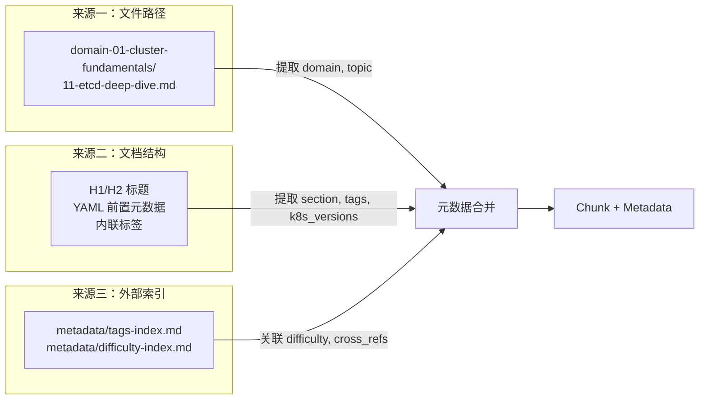
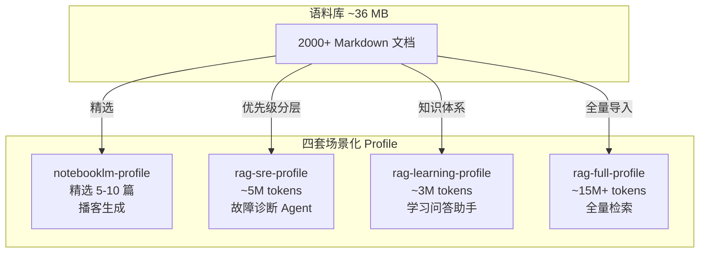
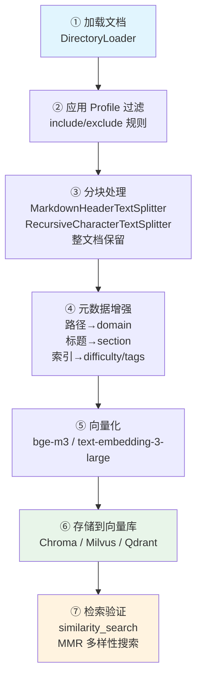

KUDIG-DATABASE 知识库的核心价值不仅在于其 2000+ 篇 Markdown 文档所承载的 Kubernetes 全域知识，更在于这些文档天然具备的结构化特征——统一的标题层级、显式的 YAML 前置元数据、跨文档的语义关联——使其成为构建高质量 RAG（Retrieval-Augmented Generation）系统的理想语料。本页系统阐述如何将这一知识库转化为 AI 可检索、可推理的结构化语料库：从文档结构分析推导分块策略，到四套场景化 Profile 的设计哲学，再到向量库构建的完整工程流水线。掌握这些配置方法后，你可以为 SRE Agent、学习助手、NotebookLM 播客乃至全知识库检索等不同场景，快速组装出语义精度与检索效率兼具的向量数据库。

Sources: [README.md](corpus-config/README.md#L1-L41), [rag-chunking-strategy.md](corpus-config/rag-chunking-strategy.md#L1-L117)

## 语料库全景：结构与量化特征

在制定任何分块策略之前，必须首先理解语料库的全景拓扑。KUDIG-DATABASE 包含 40 个 `domain-*` 知识域和 15 个 `topic-*` 专题，合计 2000+ 篇 Markdown 文档（排除 Release Notes），总文本量约 36 MB。这些文档在粒度、结构和语义密度上存在显著差异，而这正是分块策略必须因地制宜的根本原因。

下面的架构图展示了语料库的层次结构和各模块的典型文档规模：

```mermaid
graph TB
    subgraph "知识库全景 ~36MB / 2000+ 文档"
        direction TB
        DEEP["domain-* 深度文档<br/>40 个知识域 / ~550 篇<br/>单篇 10-95 KB"]
        TOPIC["topic-* 专题文档<br/>15 个专题 / ~700 篇<br/>粒度差异大"]
        META["metadata 元数据<br/>标签索引 / 难度分级 / 知识图谱"]
    end

    subgraph "文档结构光谱"
        direction LR
        COMPACT["紧凑型<br/>cheat-sheet<br/>10-50 KB 全文"] --> MEDIUM["标准型<br/>domain 深度文档<br/>30-90 KB 按 H2"] --> LARGE["巨体型<br/>FTA 全量分析<br/>130 KB+ 按 H3"]
    end

    DEEP --> MEDIUM
    TOPIC --> COMPACT
    TOPIC --> LARGE
    META -.-> "元数据增强"
```

各核心目录的量化指标如下：

| 目录 | 文件数 | 总大小 | 单篇均大小 | 典型结构 | 推荐分块 |
|:---|---:|---:|---:|:---|:---|
| `domain-1-architecture` | 19 | 728 KB | ~71 KB | H1 → H2 → H3 三级 | 按 H2 标题 |
| `domain-11-ai-infra` | 37 | 1.4 MB | ~73 KB | H1 → H2 → H3 三级 | 按 H2 标题 |
| `domain-12-troubleshooting` | 45 | 1.3 MB | ~29 KB | H1 → H2 → 表格/代码 | 按 H2 标题 |
| `domain-32-yaml-manifests` | 37 | 1.8 MB | ~95 KB | H1 → H2 → YAML 清单 | 按资源类型 |
| `topic-fta/list/` | 36 | 1.7 MB | ~47 KB | Mermaid FTA 树 + H3 底事件 | 按 H3 标题 |
| `topic-skills/` | 30 | 1.7 MB | ~57 KB | YAML 前置元 + Section | 按 Section |
| `topic-dictionary/` | 207 | 3.0 MB | ~13 KB | H1 → H2 → H3 条目式 | 按条目 |
| `topic-cheat-sheet/` | 10 | 204 KB | ~20 KB | 紧凑表格 + 命令块 | 整文档 |
| `topic-ai-agent/` | 58 | 1.2 MB | ~20 KB | H1 → H2 → 代码示例 | 按 H2 标题 |

Sources: [README.md](corpus-config/README.md#L21-L31), [difficulty-index.md](metadata/difficulty-index.md#L1-L84), [tags-index.md](metadata/tags-index.md#L1-L137)

## RAG 分块策略：三种范式与适用场景

**分块（Chunking）是 RAG 系统中影响检索质量的第一道关口**。分块过大，检索时混入无关内容，降低 LLM 推理精度；分块过小，语义片段被截断，丧失上下文完整性。KUDIG-DATABASE 的文档结构天然形成了三种分块范式，分别对应不同文档类型的语义边界。

Sources: [rag-chunking-strategy.md](corpus-config/rag-chunking-strategy.md#L1-L117)

### 策略一：按 Markdown 标题层级分块

这是**覆盖面最广的默认策略**，适用于所有 `domain-*` 深度文档和大部分 `topic-*` 文档。核心思想是利用 Markdown 的标题层级（H1/H2/H3）作为天然的语义边界——每个 H2 Section 通常讨论一个完整的子主题，长度在 2000-5000 字符之间，恰好落在 Embedding 模型的高效编码范围内。

```python
from langchain.text_splitter import MarkdownHeaderTextSplitter

# 按 H1/H2 分块，保持知识完整性
splitter = MarkdownHeaderTextSplitter(
    headers_to_split_on=[
        ('#', 'title'),
        ('##', 'section'),
    ]
)
```

对于 `topic-fta/list/` 中的故障树文档，由于其 H3 层级对应具体的底事件（如"调度失败/挂起"下的"节点不可用/污点无法容忍"），应采用 H3 级别分块以确保每个故障路径作为独立检索单元：

```python
# FTA 故障树：按 H3 分块，每个底事件独立 chunk
fta_splitter = MarkdownHeaderTextSplitter(
    headers_to_split_on=[
        ('#', 'title'),
        ('##', 'section'),
        ('###', 'subsection'),  # 底事件级别
    ]
)
```

Sources: [rag-chunking-strategy.md](corpus-config/rag-chunking-strategy.md#L9-L23), [pod-fta.md](topic-fta/list/pod-fta.md#L1-L40)

### 策略二：递归字符分块 + 重叠

当文档规模超过 100 KB（如 `topic-fta/kubernetes-fta-full-analysis.md` 约 130 KB），或文档结构不够规整时，纯标题分块可能产生过大的 Chunk。此时应采用 **递归字符分块 + 语义重叠** 策略，优先在段落边界（`\n\n`）和标题边界（`\n## `）处切割，并保留 10% 的重叠区域以维持上下文衔接：

```python
from langchain.text_splitter import RecursiveCharacterTextSplitter

splitter = RecursiveCharacterTextSplitter(
    chunk_size=2000,       # 中文约 700 字
    chunk_overlap=200,     # 10% 重叠
    separators=['\n## ', '\n### ', '\n\n', '\n', ' ']
)
```

`chunk_size=2000` 的选取基于以下考量：中文文本中一个汉字约 1-2 个 token，2000 字符约 700-1000 个中文字，这在 `text-embedding-3-large`（8191 token 上限）和 `bge-large-zh-v1.5`（512 token 上限）之间找到了平衡点。

Sources: [rag-chunking-strategy.md](corpus-config/rag-chunking-strategy.md#L25-L35)

### 策略三：整文档保留

对于 `topic-cheat-sheet/` 中的速查卡（10-50 KB），内容高度紧凑且内部关联紧密——将 `k8s.md` 的"kubectl 基础操作"与"故障排查命令"拆分为独立 Chunk 反而会破坏速查卡的查询体验。此类文档应**整篇作为一个 Chunk** 保留，仅附加元数据以辅助过滤。

| 分块策略 | 适用文档类型 | chunk_size | 语义边界 | 检索粒度 |
|:---|:---|---:|:---|:---|
| 按标题层级 | `domain-*`、`topic-ai-agent` | ~2000 字符 | H2/H3 标题 | 章节级 |
| 递归字符+重叠 | `topic-fta` 全量分析 | 2000 字符 + 200 重叠 | 段落/标题 | 段落级 |
| 整文档保留 | `topic-cheat-sheet` | 全文 | 文档整体 | 文档级 |
| 按条目分块 | `topic-dictionary` | ~500 字符 | H2/H3 条目 | 条目级 |

Sources: [rag-chunking-strategy.md](corpus-config/rag-chunking-strategy.md#L62-L72), [k8s.md](topic-cheat-sheet/k8s.md#L1-L30)

## 元数据增强：让向量检索从"模糊匹配"升级为"精准定位"

分块只是第一步。**元数据增强是区分"能用"和"好用"的 RAG 系统的关键分水岭**。KUDIG-DATABASE 中每个文档都携带了丰富的结构信息——文件路径隐含了知识域归属，标题层级标记了语义层级，Skill 文档的 YAML 前置元数据更是包含了触发关键词、Kubernetes 版本范围、严重级别等可直接用于检索过滤的结构化字段。

Sources: [rag-chunking-strategy.md](corpus-config/rag-chunking-strategy.md#L45-L59)

### 标准元数据 Schema

以下是为每个 Chunk 推荐附加的元数据结构，其中 `source`、`domain`、`difficulty` 三个字段是必选项：

```python
metadata = {
    # --- 必选字段 ---
    'source': 'domain-01-cluster-fundamentals/11-etcd-deep-dive.md',  # 源文件路径
    'domain': 'control-plane',       # 知识域（从路径提取）
    'difficulty': 'advanced',        # 难度：beginner/intermediate/advanced/expert

    # --- 推荐字段 ---
    'section': '## 3. Raft 共识协议', # 所属章节标题
    'tags': ['etcd', 'raft', 'consensus'],  # 技术标签
    'k8s_versions': ['v1.25', 'v1.32'],     # 适用的 K8s 版本范围

    # --- 可选字段（仅 Skill 文档） ---
    'skill_id': None,                # Skill 唯一标识
    'severity_range': None,          # 严重级别范围
    'trigger_keywords': [],          # 触发关键词
}
```

### 元数据提取流水线

元数据的来源分为三个层次，形成自动化的提取流水线：



**路径提取**是最可靠的方式——`domain-3-control-plane` 直接映射为 `domain: control-plane`，`topic-skills/01-node-notready.md` 映射为 `domain: skills, topic: node-ops`。**YAML 前置元数据**在 Skill 文档中尤为丰富，例如 `SKILL-NODE-001` 包含了 `trigger_keywords`（NotReady、NodeNotReady 等）和 `k8s_versions`（1.28-1.32），这些字段可直接作为向量数据库的过滤条件，实现"查找适用于 K8s 1.30 的 Node NotReady 诊断步骤"这类精准查询。**外部索引文件**则提供了跨文档的关联信息，`tags-index.md` 将同一标签（如 `etcd`）下的所有文档聚合在一起，可用于构建 Chunk 间的显式链接关系。

Sources: [rag-chunking-strategy.md](corpus-config/rag-chunking-strategy.md#L49-L59), [tags-index.md](metadata/tags-index.md#L1-L80), [difficulty-index.md](metadata/difficulty-index.md#L1-L84), [01-node-notready.md](topic-skills/01-node-notready.md#L1-L40)

## 场景化 Profile：四套预置语料配置

不同 AI 应用场景对语料的需求在**规模、优先级、分块粒度**上差异巨大。一个 SRE Agent 需要的是故障树的推理骨架和 Skill 的修复步骤，而非 Kubernetes 架构的入门教程；反过来，一个学习助手需要的是循序渐进的知识体系，而非 130 KB 的全量故障树分析。`corpus-config/profiles/` 目录下的四套 Profile 正是为了解决这种需求分化而设计的——每个 Profile 定义了导入路径、优先级分层和分块策略，直接可用作自动化流水线的配置输入。

Sources: [README.md](corpus-config/README.md#L33-L41)

### Profile 架构总览



### Profile 1：NotebookLM 播客配置

**设计哲学**：NotebookLM 有明确的文档数量限制，无法导入全量语料，因此采用**精选方案**策略。配置文件提供了三个独立的方案（故障排查专题、系统学习、AI 基础设施），每个方案仅包含 5 篇高密度文档，确保 NotebookLM 在有限上下文中生成深度而非广度的播客内容。

| 方案 | 包含文档 | 适合场景 |
|:---|:---|:---|
| `troubleshooting_podcast` | FTA 快速落地 + K8s 全量故障树 + FEBM 快速落地 + Pod/Node 排障 | 运维团队故障排查研讨 |
| `learning_podcast` | 学习计划 + 架构概览 + 设计原理 + etcd 深度 + 网络架构 | 新人系统性学习 |
| `ai_infra_podcast` | AI 基础设施总览 + GPU 调度 + LLM 推理 + Agent 基础 + Harness 工程 | AI 平台团队技术分享 |

关键设计决策在于文档选择逻辑——`kubernetes-fta-full-analysis.md`（130 KB）被选入故障排查方案而非拆分为 36 个独立故障树，是因为 NotebookLM 的播客生成需要**完整的故事线**，而非碎片化的检索片段。

Sources: [notebooklm-profile.yaml](corpus-config/profiles/notebooklm-profile.yaml#L1-L31)

### Profile 2：SRE 运维 Agent 语料配置

**设计哲学**：SRE Agent 的核心任务是从告警触发到根因定位再到修复建议的**闭环流程**，因此语料配置采用**三级优先级分层**：`core`（必须导入的推理骨架）、`methodology`（推荐导入的推理方法论）、`reference`（可选的参考速查）。

```yaml
# 核心语料（必须导入）—— 构成 Agent 的推理能力
core:
  - path: topic-fta/list/           # 36 个组件故障树 → 演绎推理骨架
    priority: critical
    chunking: by_h3                 # 每个底事件独立 chunk
  - path: topic-skills/             # 18 个诊断-修复 Skill → 自动化修复步骤
    priority: critical
    chunking: by_section
  - path: domain-10-troubleshooting-diagnostics/ # 42+ 篇故障排查 → 知识支撑
    priority: critical
    chunking: by_h2

# 方法论语料（推荐导入）—— 增强 Agent 的推理质量
methodology:
  - path: topic-fta/01-23*.md       # FTA 方法论体系
    priority: high
    chunking: by_h2
  - path: topic-febm/               # FEBM 取证方法
    priority: high
    chunking: by_h2
```

值得注意的是 `core` 层的三组语料形成了完整的推理链：`topic-fta/list/` 的故障树提供了**从顶事件到底事件的演绎推理路径**，`topic-skills/` 的 Skill 文档提供了**从诊断到修复的可执行步骤**，而 `domain-10-troubleshooting-diagnostics/` 则提供了**详细的技术解释和案例**。Agent 在实际运行中可以先用故障树定位故障分支，再调用对应的 Skill 获取修复命令，最后参考 troubleshooting 文档验证操作风险。

Sources: [rag-sre-profile.yaml](corpus-config/profiles/rag-sre-profile.yaml#L1-L47)

### Profile 3：K8s 学习助手语料配置

**设计哲学**：学习场景的需求是**循序渐进的概念解释与命令查询**，因此语料覆盖从入门到中级的完整知识链条。与 SRE Profile 相比，学习助手不包含故障树和 Skill 文档（这些属于高级/专家级内容），但增加了 `topic-dictionary/`（运维词典）和 `domain-18-manifests-patterns/`（YAML 配置参考）等学习高频使用的参考材料。

该 Profile 的语料规模约 **3M tokens**，`core` 层覆盖学习计划 + 速查卡 + 架构基础，`knowledge` 层覆盖设计原理/控制平面/工作负载/网络/存储五大核心域，`reference` 层则提供 Docker、Linux、YAML 参考等基础支撑。

Sources: [rag-learning-profile.yaml](corpus-config/profiles/rag-learning-profile.yaml#L1-L55)

### Profile 4：全量语料配置

全量配置采用通配符导入策略（`domain-*/` + `topic-*/`），约 **15M+ tokens**。关键在于 `exclude` 列表的设计——排除了二进制文件（`.pdf`、`.png`、`.xlsx`）、构建产物（`gitbook/book/`、`gitbook/dist/`）、质量报告和 `topic-release-notes/`（1322 个版本说明文件，占用 17 MB 但对 RAG 检索价值极低）。这一排除规则将实际导入量从约 50 MB 压缩至 36 MB，同时保持了语义密度的最大化。

| Profile | 规模 | 核心场景 | 优先级分层 | 典型 Chunk 数 |
|:---|---:|:---|:---|---:|
| `notebooklm-profile` | 5-10 篇精选 | 播客生成 | 无（手动精选） | 5-10 |
| `rag-sre-profile` | ~5M tokens | 故障诊断 Agent | critical/high/medium | ~3000 |
| `rag-learning-profile` | ~3M tokens | 学习问答助手 | critical/high/medium | ~2000 |
| `rag-full-profile` | ~15M+ tokens | 全量检索 | 无（统一处理） | ~8000 |

Sources: [rag-full-profile.yaml](corpus-config/profiles/rag-full-profile.yaml#L1-L28), [README.md](corpus-config/README.md#L33-L41)

## Embedding 模型选型：中文场景的精度-成本博弈

Embedding 模型决定了文本转化为向量时的语义编码质量。在 KUDIG-DATABASE 的场景中，文档以中文为主、夹杂大量英文技术术语和 YAML/代码片段，这要求模型同时具备优秀的中文语义理解和代码结构感知能力。

Sources: [rag-chunking-strategy.md](corpus-config/rag-chunking-strategy.md#L75-L83)

| 模型 | 维度 | 中文能力 | 代码能力 | 最大 Token | 成本/1K tokens | 推荐场景 |
|:---|---:|:---:|:---:|---:|---:|:---|
| `text-embedding-3-large` | 3072 | 好 | 好 | 8191 | $0.13 | 通用场景，追求精度 |
| `text-embedding-3-small` | 1536 | 好 | 一般 | 8191 | $0.02 | 成本敏感，快速原型 |
| `bge-large-zh-v1.5` | 1024 | **优秀** | 一般 | 512 | 开源免费 | **中文优先推荐** |
| `bge-m3` | 1024 | **优秀** | 好 | 8192 | 开源免费 | **多语言混合推荐** |

对于 KUDIG-DATABASE 的语料特征，推荐 **`bge-m3`** 作为首选模型。理由有三：其一，该模型在 MTEB 中文排行榜上表现优异，能准确区分"Pod 调度失败"与"Pod 驱逐"等语义相近但技术含义不同的术语；其二，支持 8192 token 的输入长度，足以覆盖按 H2 分块后的大多数 Chunk；其三，开源免费，无 API 调用成本，适合全量 15M+ tokens 的批量向量化。

如果使用 OpenAI 的商业模型，`text-embedding-3-large` 在混合语言场景（如"用 kubectl explain 查看 Pod spec 的字段说明"这类中英混合查询）中表现更稳定，但需要承担 API 调用成本——以全量导入估算，约需 $20-50 的一次性 Embedding 费用。

Sources: [rag-chunking-strategy.md](corpus-config/rag-chunking-strategy.md#L75-L83)

## 向量库构建：从分块到检索的完整流水线

将上述分块策略、元数据增强和 Embedding 选型整合为一条完整的工程流水线，其架构如下：



### 完整构建示例

以下代码展示了以 SRE Agent Profile 为例的完整向量库构建流程。这段代码直接对应 [rag-chunking-strategy.md](corpus-config/rag-chunking-strategy.md#L86-L116) 中的端到端示例，但增加了 Profile 过滤和元数据增强两个关键步骤：

```python
import os
import yaml
from pathlib import Path
from langchain.document_loaders import DirectoryLoader, UnstructuredMarkdownLoader
from langchain.text_splitter import MarkdownHeaderTextSplitter, RecursiveCharacterTextSplitter
from langchain.schema import Document
from langchain_community.embeddings import HuggingFaceEmbeddings
from langchain_community.vectorstores import Chroma

# ─── ① 加载 Profile 配置 ───
with open('corpus-config/profiles/rag-sre-profile.yaml') as f:
    profile = yaml.safe_load(f)

# ─── ② 按优先级收集文档路径 ───
docs_paths = []
for tier in ['core', 'methodology', 'reference']:
    for entry in profile.get(tier, []):
        pattern = entry['path']
        if os.path.isdir(pattern):
            for md in Path(pattern).rglob('*.md'):
                docs_paths.append((str(md), entry['chunking'], tier))
        else:
            for md in Path('.').glob(pattern):
                docs_paths.append((str(md), entry['chunking'], tier))

# ─── ③ 按策略分块 ───
h2_splitter = MarkdownHeaderTextSplitter(
    headers_to_split_on=[('#', 'title'), ('##', 'section')]
)
h3_splitter = MarkdownHeaderTextSplitter(
    headers_to_split_on=[('#', 'title'), ('##', 'section'), ('###', 'subsection')]
)

all_chunks = []
for path, strategy, tier in docs_paths:
    with open(path) as f:
        content = f.read()

    # 根据策略选择分块器
    if strategy == 'by_h2':
        chunks = h2_splitter.split_text(content)
    elif strategy == 'by_h3':
        chunks = h3_splitter.split_text(content)
    elif strategy == 'full_doc':
        chunks = [Document(page_content=content, metadata={})]
    elif strategy == 'by_section':
        chunks = RecursiveCharacterTextSplitter(
            chunk_size=3000, chunk_overlap=300
        ).split_documents([Document(page_content=content)])

    # ─── ④ 元数据增强 ───
    domain = path.split('/')[0].replace('domain-', '').replace('topic-', '')
    for chunk in chunks:
        chunk.metadata.update({
            'source': path,
            'domain': domain,
            'priority_tier': tier,
        })

    all_chunks.extend(chunks)

# ─── ⑤ 向量化 + ⑥ 存储 ───
embeddings = HuggingFaceEmbeddings(
    model_name='BAAI/bge-m3',
    model_kwargs={'device': 'cpu'},
    encode_kwargs={'normalize_embeddings': True}
)

vectorstore = Chroma.from_documents(
    documents=all_chunks,
    embedding=embeddings,
    collection_name='kudig-sre-agent',
    persist_directory='./vectorstore/sre-agent'
)

# ─── ⑦ 检索验证 ───
results = vectorstore.similarity_search(
    'Pod CrashLoopBackOff 怎么排查',
    k=5,
    filter={'priority_tier': 'core'}  # 优先从核心语料检索
)
for r in results:
    print(f"[{r.metadata['domain']}] {r.metadata.get('section', 'N/A')}")
    print(f"  {r.page_content[:100]}...\n")
```

Sources: [rag-chunking-strategy.md](corpus-config/rag-chunking-strategy.md#L86-L116), [rag-sre-profile.yaml](corpus-config/profiles/rag-sre-profile.yaml#L9-L20)

### 向量数据库选型参考

| 数据库 | 适用规模 | 特色能力 | 推荐场景 |
|:---|:---|:---|:---|
| **Chroma** | < 100K chunks | 零配置嵌入式，开发友好 | 开发测试、小规模部署 |
| **Milvus** | 1M+ chunks | GPU 加速、分布式、多索引类型 | 生产环境大规模部署 |
| **Qdrant** | < 1M chunks | Rust 高性能、丰富的过滤语法 | 中等规模、需要元数据过滤 |
| **Weaviate** | < 1M chunks | 内置多模态、GraphQL API | 需要多模态检索的场景 |
| **pgvector** | 任意（PostgreSQL） | 与现有 PG 基础设施集成 | 已有 PostgreSQL 的团队 |

对于 SRE Agent 场景（~3000 chunks），Chroma 完全足够；对于全量语料（~8000+ chunks 且持续增长），推荐 Milvus 或 Qdrant 以获得更好的过滤性能和水平扩展能力。

### 检索策略增强

单纯的 `similarity_search` 在面对 KUDIG-DATABASE 这种高度结构化的语料时并非最优选择。推荐组合以下检索策略：

**最大边际相关性（MMR）搜索**：在 `topic-dictionary/` 这类条目密集的语料中，`similarity_search` 倾向于返回同一术语的多个近似变体，而 MMR 通过引入多样性惩罚，确保返回结果覆盖不同的故障域或技术主题：

```python
results = vectorstore.max_marginal_relevance_search(
    'K8s 节点不可用如何排查',
    k=8,
    fetch_k=20,         # 先检索 20 个候选
    lambda_mult=0.7     # 0=最大多样性，1=最大相关性
)
```

**元数据过滤 + 向量检索混合**：利用 SRE Profile 的三级优先级分层，可以构建"先核心后参考"的级联检索——优先从 `core` 层检索推理骨架，若无足够匹配再扩展到 `methodology` 和 `reference` 层：

```python
def tiered_search(query: str, k: int = 5):
    for tier in ['core', 'methodology', 'reference']:
        results = vectorstore.similarity_search(
            query, k=k, filter={'priority_tier': tier}
        )
        if results:
            return results
    return vectorstore.similarity_search(query, k=k)
```

Sources: [rag-chunking-strategy.md](corpus-config/rag-chunking-strategy.md#L86-L116), [rag-sre-profile.yaml](corpus-config/profiles/rag-sre-profile.yaml#L9-L46)

## 配置文件参考速查

所有配置文件位于 `corpus-config/` 目录下，以下为快速参考：

| 文件 | 用途 | 关键内容 |
|:---|:---|:---|
| [README.md](corpus-config/README.md) | 语料配置总览 | 目录结构、语料特点、推荐场景矩阵 |
| [rag-chunking-strategy.md](corpus-config/rag-chunking-strategy.md) | 分块策略详细指南 | 三种分块范式、目录策略矩阵、Embedding 选型、完整代码示例 |
| [profiles/notebooklm-profile.yaml](corpus-config/profiles/notebooklm-profile.yaml) | NotebookLM 播客配置 | 三个精选方案（故障排查/系统学习/AI 基础设施） |
| [profiles/rag-sre-profile.yaml](corpus-config/profiles/rag-sre-profile.yaml) | SRE Agent 语料配置 | 三级优先级（core/methodology/reference）、~5M tokens |
| [profiles/rag-learning-profile.yaml](corpus-config/profiles/rag-learning-profile.yaml) | 学习助手语料配置 | 三级优先级（core/knowledge/reference）、~3M tokens |
| [profiles/rag-full-profile.yaml](corpus-config/profiles/rag-full-profile.yaml) | 全量语料配置 | 通配符导入 + 排除规则、~15M+ tokens |

辅助元数据索引：

| 文件 | 用途 |
|:---|:---|
| [metadata/difficulty-index.md](metadata/difficulty-index.md) | 四级难度分级索引（beginner → expert） |
| [metadata/tags-index.md](metadata/tags-index.md) | 按技术标签聚合的文档索引 |
| [metadata/knowledge-map.md](metadata/knowledge-map.md) | 模块间依赖关系与学习路径 |

Sources: [README.md](corpus-config/README.md#L1-L41)

## 延伸阅读

本页聚焦于语料库的静态配置和向量库构建。语料库建好后，下一步是将检索能力集成到 AI Agent 的运行时中：

- **检索增强生成的工程实践**：[AI Agent 工程：RAG、多 Agent 编排、安全护栏与生产部署](18-ai-agent-gong-cheng-rag-duo-agent-bian-pai-an-quan-hu-lan-yu-sheng-chan-bu-shu) 中的 RAG 知识检索章节详细阐述了如何将本页构建的向量库接入 Agent 的推理循环
- **Agent 可执行的工单处理闭环**：[运维 Skill 库：AI Agent 可执行的工单诊断-修复闭环](16-yun-wei-skill-ku-ai-agent-ke-zhi-xing-de-gong-dan-zhen-duan-xiu-fu-bi-huan) 展示了 `topic-skills/` 中的 Skill 文档如何被 Agent 直接消费执行
- **故障树的推理骨架作用**：[FTA 故障树分析：从演绎推理到 AI Agent 知识骨架](13-fta-gu-zhang-shu-fen-xi-cong-yan-yi-tui-li-dao-ai-agent-zhi-shi-gu-jia) 解释了为什么 `topic-fta/list/` 的 36 棵故障树是 SRE Agent 的核心推理资产