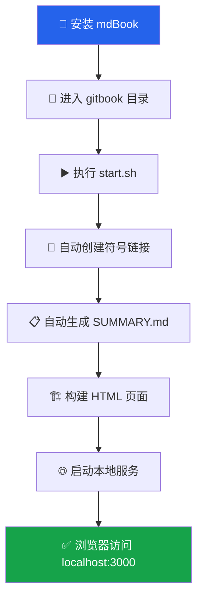
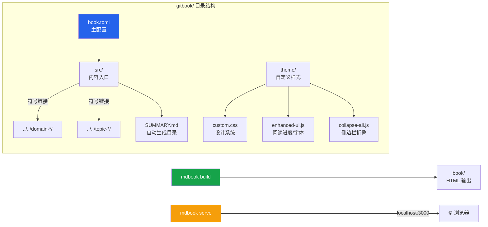
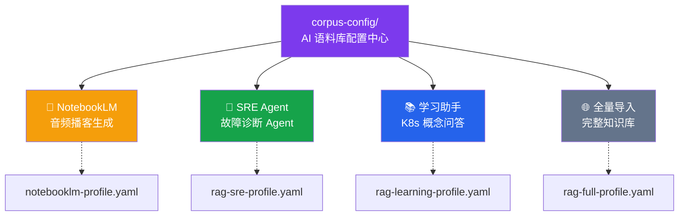

KUDIG-DATABASE 是一个面向生产环境的 Kubernetes + AI Infrastructure 全域知识库，涵盖 950+ 篇技术文档、41 个知识领域、4300 万+ 字符。本文将引导你从零完成三件事：**克隆仓库到本地**、**启动 GitBook 离线浏览系统**、**将知识库接入 AI 语料工具（NotebookLM / RAG 等）**。整个过程不需要任何 Kubernetes 经验——你只需要一台能运行终端命令的电脑。

Sources: [README.md](README.md#L1-L71), [gitbook/README.md](gitbook/README.md#L1-L25)

---

## 前置条件

在开始之前，请确认你的环境满足以下基本要求：

| 工具 | 最低版本 | 用途 | 检查命令 |
|:---|:---|:---|:---|
| **Git** | 2.x | 克隆仓库 | `git --version` |
| **mdBook** | 0.4.x | 本地 GitBook 构建 | `mdbook --version` |
| **Rust / Cargo**（可选） | 1.70+ | 通过 Cargo 安装 mdBook | `cargo --version` |

> **提示**：如果你只想浏览 Markdown 原文或接入 AI 工具，Git 和 mdBook 并不是必须的——直接在 GitHub 网页上阅读或下载 ZIP 包即可。mdBook 仅在需要**本地离线阅读体验**时才需安装。

Sources: [gitbook/documentation/快速安装mdbook.md](gitbook/documentation/快速安装mdbook.md#L1-L18)

---

## 第一步：克隆仓库

```bash
# 克隆仓库到本地
git clone https://github.com/kudig-io/kudig-database.git
cd kudig-database
```

克隆完成后，你将看到如下顶层目录结构。**理解这个结构是高效使用知识库的关键**——每个目录前缀代表不同的知识分类：

```
kudig-database/
├── domain-*/          ← 🎯 核心知识域（按 Kubernetes 技术栈划分）
├── topic-*/           ← 🔥 横切专题（FTA故障树、AI Agent、学习计划等）
├── gitbook/           ← 📖 离线浏览系统（mdBook 构建）
├── corpus-config/     ← 🤖 AI 语料库配置（RAG 分块策略、场景化 Profile）
├── man/               ← 📋 Linux Manpage 参考手册
├── scripts/           ← 🛠️ 辅助脚本
├── templates/         ← 📝 文档模板
└── reports/           ← 📊 质量报告与统计
```

其中 `domain-*` 目录按编号递增覆盖 Kubernetes 技术栈的各个层面，而 `topic-*` 则是跨领域的专题合集（故障树分析、AI Agent 工程等）。这种 **domain 纵深 + topic 横切** 的双轴组织方式，使得无论你是按知识体系系统学习，还是按场景快速定位，都能高效检索。

Sources: [README.md](README.md#L164-L175), [CONTRIBUTING.md](CONTRIBUTING.md#L29-L36)

---

## 第二步：本地 GitBook 浏览

KUDIG-DATABASE 基于 [mdBook](https://rust-lang.github.io/mdBook/) 构建了一套完整的离线浏览系统，提供**全文搜索、目录折叠导航、自定义主题**等能力。以下是完整的启动流程：



### 2.1 安装 mdBook

**macOS / Linux（推荐 Cargo 安装）：**

```bash
# 如果没有 Rust，先安装
curl --proto '=https' --tlsv1.2 -sSf https://sh.rustup.rs | sh

# 安装 mdBook
cargo install mdbook

# 验证安装
mdbook --version
```

**macOS Homebrew（更快捷）：**

```bash
brew install mdbook
```

**Windows（推荐预编译下载）：**

访问 [mdBook Releases](https://github.com/rust-lang/mdBook/releases) 页面，下载最新的 `mdbook-vX.X.X-x86_64-pc-windows-msvc.zip`，解压后将 `mdbook.exe` 放入 PATH 目录即可。详细步骤参见项目内的安装文档。

Sources: [gitbook/documentation/快速安装mdbook.md](gitbook/documentation/快速安装mdbook.md#L20-L57)

### 2.2 启动本地服务

```bash
cd gitbook
bash build-scripts/start.sh
```

`start.sh` 脚本会自动完成四件事：① 为所有 `domain-*` 和 `topic-*` 目录创建符号链接到 `src/` 目录；② 自动扫描目录结构并生成 `SUMMARY.md` 导航索引；③ 调用 `mdbook build` 构建 HTML 页面；④ 启动 `mdbook serve` 本地 HTTP 服务。启动成功后，在浏览器中访问 **http://localhost:3000** 即可看到完整的知识库。

Sources: [gitbook/build-scripts/start.sh](gitbook/build-scripts/start.sh#L1-L86)

### 2.3 日常操作速查

| 场景 | 命令 | 说明 |
|:---|:---|:---|
| 首次启动 | `bash build-scripts/start.sh` | 初始化 + 构建 + 启动服务 |
| 自定义端口 | `PORT=8080 bash build-scripts/start.sh` | 默认端口 3000 |
| 内容更新后刷新 | `bash build-scripts/refresh.sh` | 重建符号链接 + 目录 + 构建 |
| 仅重新构建（快） | `bash build-scripts/refresh.sh build` | 跳过符号链接和目录生成 |
| 导出离线静态站 | `bash build-scripts/export-static.sh` | 输出到 `dist/`，可直接浏览器打开 |
| 导出并打包 ZIP | `bash build-scripts/export-static.sh --zip` | 生成可分享的压缩包 |

Sources: [gitbook/README.md](gitbook/README.md#L110-L151), [gitbook/build-scripts/refresh.sh](gitbook/build-scripts/refresh.sh#L1-L12)

### 2.4 Windows 用户：一键构建

Windows 环境下最简方式是双击 `QUICK-BUILD.cmd`，它会自动完成构建并生成 ZIP 压缩包：

```powershell
cd gitbook
QUICK-BUILD.cmd
```

构建产物输出到 `export/kudig-gitbook-YYYYMMDD-HHMMSS/`，可直接用浏览器打开 `index.html`。

Sources: [gitbook/README.md](gitbook/README.md#L5-L24)

### 2.5 GitBook 系统架构

理解 GitBook 子系统的内部结构有助于你排查问题或进行自定义：



`book.toml` 是整个系统的控制中枢，它配置了书籍元数据（标题、语言为 `zh-CN`）、HTML 输出选项（主题、搜索增强、目录折叠）以及自定义 CSS/JS 资源路径。`src/` 目录通过**符号链接**映射到项目根目录的各知识域，这意味着你在 `src/` 下修改文件等同于直接修改原始文档——任何改动都会实时反映到 GitBook 中。

Sources: [gitbook/book.toml](gitbook/book.toml#L1-L36), [gitbook/README.md](gitbook/README.md#L26-L62)

---

## 第三步：AI 语料库接入

KUDIG-DATABASE 的文档组织天然适配 AI 场景——统一的 Markdown 格式、清晰的标题层级、生产级验证的内容。项目在 `corpus-config/` 目录下提供了**开箱即用的场景化配置文件**，让你无需从零设计分块策略。

### 3.1 四种接入场景概览



| 场景 | 推荐导入范围 | 配置文件 | 预估 Token |
|:---|:---|:---|:---|
| **NotebookLM 播客** | 精选 5-10 篇核心文档 | `notebooklm-profile.yaml` | 受 NotebookLM 文档数量限制 |
| **SRE 运维 Agent** | FTA 故障树 + Skills + 排障文档 | `rag-sre-profile.yaml` | ~5M |
| **K8s 学习助手** | 学习计划 + 速查卡 + 核心知识域 | `rag-learning-profile.yaml` | ~3M |
| **全量知识库** | 全部 domain + topic | `rag-full-profile.yaml` | ~15M+ |

Sources: [corpus-config/README.md](corpus-config/README.md#L1-L41)

### 3.2 场景一：NotebookLM 音频播客

NotebookLM 可以将文档转化为**双人对话式技术播客**，非常适合通勤或碎片时间学习。操作步骤如下：

1. 访问 [notebooklm.google.com](https://notebooklm.google.com)，创建新笔记本
2. 添加本仓库的 GitHub 链接，或手动上传精选的 Markdown 文件
3. NotebookLM 自动解析文档内容，生成结构化知识图谱
4. 使用「生成音频摘要」功能，即可获得一段专业的技术讨论播客

项目已为你预设了三个专题方案——**故障排查播客**（FTA + 排障文档）、**系统学习播客**（架构 + 设计原理）、**AI 基础设施播客**（GPU 调度 + LLM 推理），每个方案精选 5 篇文档，在 NotebookLM 的文档数量限制内实现最大知识密度。

Sources: [README.md](README.md#L119-L128), [corpus-config/profiles/notebooklm-profile.yaml](corpus-config/profiles/notebooklm-profile.yaml#L1-L31)

### 3.3 场景二：构建 RAG 智能运维助手

如果你想构建一个能回答 Kubernetes 故障诊断问题的 AI Agent，`rag-sre-profile.yaml` 提供了分层语料配置：**核心语料**（36 个组件故障树 + 18 个诊断 Skill + 42 篇排障文档）作为 Agent 的推理骨架，**方法论语料**（FTA 演绎推理 + FEBM 归纳取证）赋予 Agent 系统化的分析框架，**参考语料**（速查卡 + 结构化排障指南）则提供快速查证支持。

```python
from langchain.document_loaders import DirectoryLoader
from langchain.text_splitter import MarkdownHeaderTextSplitter
from langchain.embeddings import OpenAIEmbeddings
from langchain.vectorstores import Chroma

# 1. 加载核心语料
loader = DirectoryLoader(
    './domain-10-troubleshooting-diagnostics/',
    glob='**/*.md',
    show_progress=True
)
docs = loader.load()

# 2. 按 H2 标题分块（保持知识完整性）
splitter = MarkdownHeaderTextSplitter(
    headers_to_split_on=[('#', 'title'), ('##', 'section')]
)
chunks = []
for doc in docs:
    chunks.extend(splitter.split_text(doc.page_content))

# 3. Embedding + 向量化
embeddings = OpenAIEmbeddings(model='text-embedding-3-large')
vectorstore = Chroma.from_documents(chunks, embeddings)

# 4. 检索测试
results = vectorstore.similarity_search('Pod CrashLoopBackOff 怎么排查', k=5)
```

Sources: [corpus-config/profiles/rag-sre-profile.yaml](corpus-config/profiles/rag-sre-profile.yaml#L1-L47), [corpus-config/rag-chunking-strategy.md](corpus-config/rag-chunking-strategy.md#L86-L117)

### 3.4 RAG 分块策略选择

分块策略直接决定 RAG 检索质量。KUDIG-DATABASE 针对不同目录结构推荐了差异化策略：

| 目录类型 | 推荐策略 | chunk_size | 原因 |
|:---|:---|:---:|:---|
| `domain-*` 深度文档 | 按 H2 标题分块 | ~2000 | 每章 10-60KB，按标题切割保持语义完整 |
| `topic-fta/list/` 故障树 | 按 H3 标题分块 | ~1500 | 每个底事件独立 chunk，便于精准检索 |
| `topic-skills/` 技能库 | 按 Section 分块 | ~3000 | 每个 Skill 含完整诊断-修复闭环 |
| `topic-cheat-sheet/` 速查卡 | 整文档不分块 | 全文 | 10-50KB 内容紧凑，分块反而破坏关联 |
| `topic-dictionary/` 词典 | 按条目分块 | ~500 | 每个术语独立 chunk，精准匹配 |

**Embedding 模型推荐**：中文优先场景选 `bge-large-zh-v1.5`（1024 维，中文表现优秀）；多语言混合场景选 `bge-m3`；通用场景选 `text-embedding-3-large`（3072 维）。

Sources: [corpus-config/rag-chunking-strategy.md](corpus-config/rag-chunking-strategy.md#L1-L84)

### 3.5 场景三：学习助手与全量导入

**学习助手**配置（`rag-learning-profile.yaml`）围绕学习路径设计：以 `topic-learn/` 学习计划和 `topic-cheat-sheet/` 速查卡为核心，配合 domain-1 到 domain-6 的六大核心知识域（架构、设计、控制平面、工作负载、网络、存储），再以 Docker、Linux、YAML 参考和运维词典作为补充参考，预估约 3M Token。

**全量导入**配置（`rag-full-profile.yaml`）则包含全部 `domain-*` 和 `topic-*` 目录，约 15M+ Token，适合需要覆盖所有知识点的场景。该配置自动排除了 PDF、图片、Git 缓存、构建产物和版本说明（`topic-release-notes/`），确保语料纯净度。

Sources: [corpus-config/profiles/rag-learning-profile.yaml](corpus-config/profiles/rag-learning-profile.yaml#L1-L55), [corpus-config/profiles/rag-full-profile.yaml](corpus-config/profiles/rag-full-profile.yaml#L1-L28)

---

## GitHub Pages 在线访问

除了本地构建，项目还通过 GitHub Actions 自动部署到 GitHub Pages——每次推送到 `main` 分支都会触发自动构建和部署。工作流会自动安装 mdBook、创建符号链接、生成目录、构建 HTML 并发布，无需任何手动操作。如果你不想克隆仓库，直接访问 GitHub Pages 即可在线浏览完整知识库。

Sources: [.github/workflows/deploy-pages.yml](.github/workflows/deploy-pages.yml#L1-L74)

---

## 常见问题排查

| 问题 | 原因 | 解决方案 |
|:---|:---|:---|
| `mdbook: command not found` | mdBook 未安装 | 执行 `cargo install mdbook` 或下载预编译版本 |
| 符号链接指向不存在路径 | 在 Windows 上克隆后链接失效 | 运行 `bash build-scripts/refresh.sh` 重建链接 |
| 浏览器打开 `index.html` 样式错乱 | `site-url` 配置导致路径问题 | 使用 `export-static.sh` 导出（自动去除 site-url） |
| 中文显示为乱码 | 编码问题 | 确保终端和编辑器使用 UTF-8 编码 |
| NotebookLM 导入后内容缺失 | 超出文档数量限制 | 使用 `notebooklm-profile.yaml` 中的精选方案，每次导入 5-10 篇 |

Sources: [gitbook/build-scripts/export-static.sh](gitbook/build-scripts/export-static.sh#L52-L67), [EXTRACT-TROUBLESHOOTING.md](EXTRACT-TROUBLESHOOTING.md#L1-L1)

---

## 推荐阅读路径

完成本页操作后，建议按以下顺序深入探索知识库：

1. **[项目总览：KUDIG-DATABASE 全域知识库](1-xiang-mu-zong-lan-kudig-database-quan-yu-zhi-shi-ku)** — 了解 41 个知识域的全景布局和核心特性
2. **[知识地图与学习路径规划](3-zhi-shi-di-tu-yu-xue-xi-lu-jing-gui-hua)** — 根据你的角色（SRE / 开发 / 学习者）找到最优学习路径
3. **[贡献指南：文档规范、命名规则与提交流程](4-gong-xian-zhi-nan-wen-dang-gui-fan-ming-ming-gui-ze-yu-ti-jiao-liu-cheng)** — 如需贡献内容，了解命名规范和提交流程
4. **[AI 语料库配置：RAG 分块策略、场景化 Profile 与向量库构建](19-ai-yu-liao-ku-pei-zhi-rag-fen-kuai-ce-lue-chang-jing-hua-profile-yu-xiang-liang-ku-gou-jian)** — 深入理解分块策略和 Embedding 选型