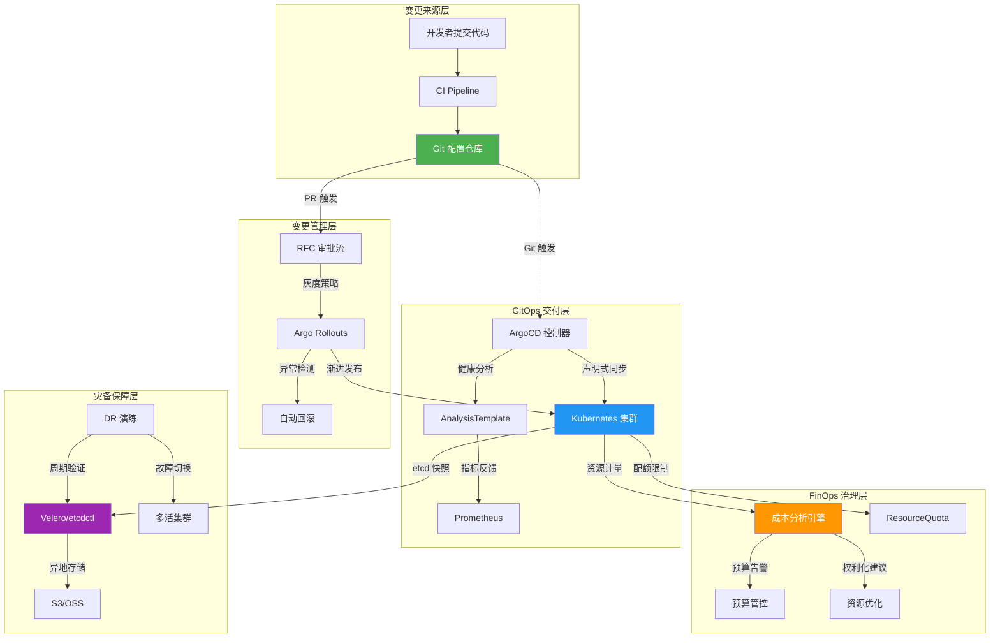
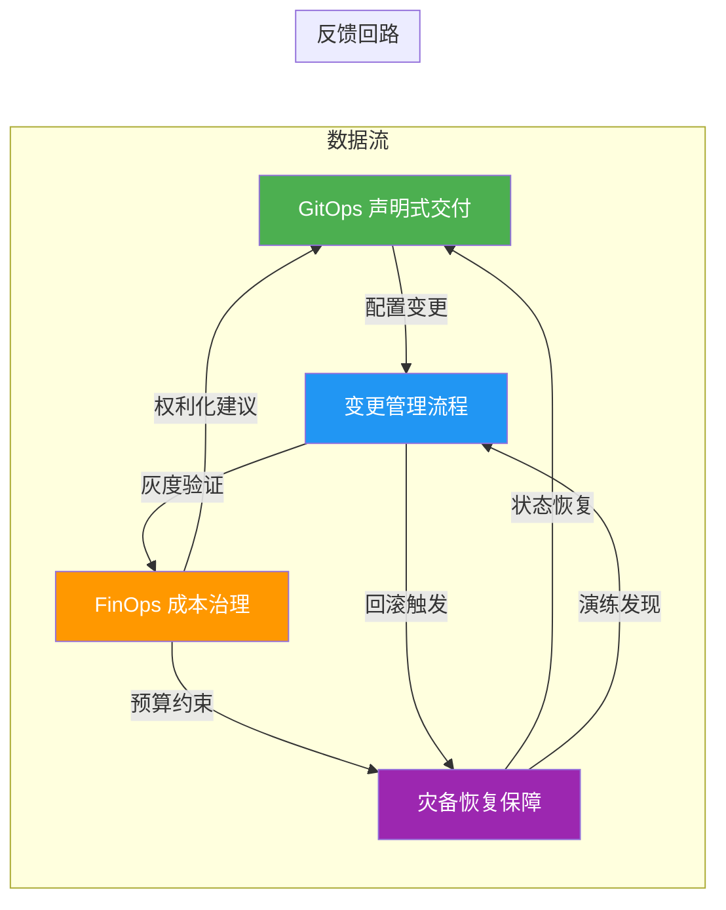

生产环境是 Kubernetes 技术栈的终极战场——架构设计再精妙，若缺少系统化的运维体系支撑，终将在规模增长与故障冲击下暴露出脆弱性。本文档聚焦生产运维的**四大核心支柱**：**GitOps 声明式交付**、**FinOps 成本治理**、**灾备恢复与业务连续性**、**变更管理流程**，将 `domain-18-production-operations` 中 24 篇专题文档的知识提炼为面向高级开发者的全景实践指南。每个支柱均提供架构设计原理、关键配置范式、自动化实现路径与质量验收标准，帮助你从"能跑通"走向"能扛住"。

Sources: [README.md](domain-11-production-operations/README.md#L1-L50)

## 全局架构：四大支柱的协同关系

在深入各支柱之前，先理解它们在生产运维闭环中的逻辑关系。**GitOps 是变更的单一事实来源**，所有配置变更经由 Git 提交触发 ArgoCD/FluxCD 自动同步；**变更管理** 在 GitOps 之上叠加审批流与灰度策略，控制变更的节奏和风险；**FinOps** 为变更提供成本约束与资源配额治理，确保每次部署都在预算可控范围内；**灾备恢复** 作为底线保障，验证备份完整性、定期演练故障场景，并在变更失败时提供回退通路。



Sources: [10-gitops-pipeline-practices.md](domain-11-production-operations/10-gitops-pipeline-practices.md#L1-L67), [22-change-management-process.md](domain-11-production-operations/22-change-management-process.md#L1-L60), [13-kubernetes-cost-governance.md](domain-11-production-operations/13-kubernetes-cost-governance.md#L1-L53), [16-enterprise-backup-strategy.md](domain-11-production-operations/16-enterprise-backup-strategy.md#L1-L56)

---

## 支柱一：GitOps 声明式交付

### 核心原理与架构选型

GitOps 的本质是将 **Git 仓库确立为基础设施和应用状态的单一事实来源（Single Source of Truth）**，通过声明式配置与自动化同步机制，消除手动 kubectl apply 带来的配置漂移风险。在本知识库中，GitOps 实践以 **ArgoCD** 为主要工具，辅以 Tekton CI/CD 流水线和 Helm/Kustomize 多环境配置管理，构建从代码提交到集群部署的完整自动化链路。

ArgoCD 部署采用 HA 模式，核心组件包括 Application Controller、Repo Server、Redis Proxy（3 副本 HA），配合 RBAC ConfigMap 实现 `role:org-admin` / `role:developer` 的最小权限分离。ApplicationSet Generator 支持按 `list`、`git`、`cluster` 等模式批量生成多环境 Application，将 production / staging / development 三个环境统一在一个 Git 仓库的 `overlays/` 目录结构下管理。

Sources: [10-gitops-pipeline-practices.md](domain-11-production-operations/10-gitops-pipeline-practices.md#L1-L90)

### 部署策略：蓝绿与金丝雀

**蓝绿部署**通过 ArgoCD Application 的 `strategy.blueGreen` 配置实现：定义 `activeService` 和 `previewService`，设置 `autoPromotionEnabled: false` 确保人工确认后再切流，`scaleDownDelaySeconds: 300` 保留旧版本 5 分钟以便紧急回退。**金丝雀部署**通过 Argo Rollouts 的 `strategy.canary.steps` 精确控制流量比例递进（20% → 40% → 60% → 80% → 100%），每个阶段暂停 60 秒用于观察，并在 step 2 起启动 AnalysisTemplate 进行自动化指标验证。

```yaml
# 金丝雀部署核心步骤配置
strategy:
  canary:
    steps:
    - setWeight: 20
    - pause: {duration: 60s}
    - setWeight: 40
    - pause: {duration: 60s}
    analysis:
      templates:
      - templateName: success-rate
      startingStep: 2
```

Sources: [10-gitops-pipeline-practices.md](domain-11-production-operations/10-gitops-pipeline-practices.md#L91-L172)

### CI/CD 集成与门禁控制

Tekton Pipeline 将整个流程编排为 `fetch-repository → run-tests → build-image → deploy-to-staging` 四阶段流水线。部署门禁分为**预部署检查**和**部署后验证**两个环节：预部署阶段执行 `cosign verify` 镜像签名校验、`trivy image` 安全扫描、`conftest test` 策略合规检查三项串行验证；部署后验证通过 `AnalysisTemplate` 对 Prometheus 指标进行周期性采样——HTTP 成功率 ≥ 95%、内存使用率 < 80% 方视为部署成功。

Sources: [10-gitops-pipeline-practices.md](domain-11-production-operations/10-gitops-pipeline-practices.md#L256-L433)

### 安全与权限治理

GitOps 安全体系包含三层：**身份认证**层通过 OIDC（如 Okta）集成企业 SSO，禁用本地 admin 账户；**项目级权限**层通过 AppProject 定义 `sourceRepos`、`destinations`、`clusterResourceWhitelist` 实现命名空间与资源类型的白名单控制；**配置完整性**层通过 Git commit 签名校验（`git verify-commit HEAD`）和镜像签名验证（`cosign verify`）确保部署物的可信来源。

Sources: [10-gitops-pipeline-practices.md](domain-11-production-operations/10-gitops-pipeline-practices.md#L531-L655)

### 基础设施即代码（IaC）

与 GitOps 互补的 IaC 实践以 **Terraform** 和 **Crossplane** 为核心。Terraform 模块化架构将集群、网络、存储、安全拆分为独立 module，通过 `for_each` 批量管理命名空间，`helm_release` 声明式安装 Ingress Controller。环境分离通过独立目录（`environments/production/`、`environments/staging/`）和 S3 backend + DynamoDB 锁实现状态隔离与并发安全。Crossplane 则以 Kubernetes CRD 形式管理云资源，将基础设施纳入 GitOps 的声明式管理范围。

Sources: [11-infrastructure-as-code.md](domain-11-production-operations/11-infrastructure-as-code.md#L1-L200)

### GitOps 实施检查清单

| 类别 | 检查项 | 优先级 |
|------|--------|--------|
| 基础设施 | 部署 ArgoCD/FluxCD 控制器并配置 HA | P0 |
| 基础设施 | 建立 `applications/` + `clusters/` + `overlays/` 仓库结构 | P0 |
| 基础设施 | 集成 OIDC 身份认证并禁用本地 admin | P1 |
| 流水线 | 配置 Tekton/GitHub Actions CI 集成 | P1 |
| 流水线 | 实施镜像签名校验与安全扫描门禁 | P1 |
| 流水线 | 配置蓝绿/金丝雀渐进式部署策略 | P2 |
| 安全 | 实施配置签名验证与审计日志 | P2 |
| 运营 | 建立同步失败诊断脚本与性能调优参数 | P2 |

Sources: [10-gitops-pipeline-practices.md](domain-11-production-operations/10-gitops-pipeline-practices.md#L716-L752)

---

## 支柱二：FinOps 成本治理

### 成本分析框架：从标签到计量

FinOps 在 Kubernetes 环境中的落地始于**成本标签体系**和**分摊模型**。强制标签包括 `cost-center`（成本中心，正则 `^[A-Z0-9]{3,10}$`）、`team`（所属团队）、`environment`（环境层级，production/staging/development）、`project`（项目名称）、`owner`（负责人邮箱）。分摊模型支持三种策略：`proportional`（按资源使用比例分摊）、`fixed`（固定百分比）、`tiered`（分层倍率，如 production 1.0x、staging 0.5x、development 0.2x）。

成本计量通过 Prometheus Recording Rules 持续聚合四大资源维度的消耗：`cost:cpu_hours:sum_rate`（CPU 小时成本）、`cost:memory_gb_hours:sum_rate`（内存 GB 小时成本）、`cost:storage_gb_hours:sum_rate`（存储成本）、`cost:network_bytes:sum_rate`（网络流量成本）。`CostAnalyzer` 类从 Prometheus 查询范围数据后，按命名空间聚合成本明细，并生成包含优化建议的完整报告。

Sources: [13-kubernetes-cost-governance.md](domain-11-production-operations/13-kubernetes-cost-governance.md#L1-L362)

### 资源权利化（Rightsizing）

资源权利化是 FinOps 中**ROI 最高**的优化手段。`RightsizingOptimizer` 的工作流程为：采集目标工作负载过去一周（168 个数据点）的 CPU/内存使用历史 → 计算 P95 分位值 → CPU 乘以 1.2 倍缓冲、内存乘以 1.25 倍缓冲作为推荐值 → 与当前 request/limit 比较计算节省潜力 → 对月度节省超过 $10 的工作负载批量输出优化建议。权利化的核心算法是：

```python
# CPU 推荐值 = P95 使用量 × 1.2 缓冲系数
cpu_recommendation = round(np.percentile(cpu_data, 95) * 1.2, 3)
# 内存推荐值 = P95 使用量 × 1.25 缓冲系数
memory_recommendation = f"{round(p95 * 1.25 * 1000)}Mi"
```

Sources: [13-kubernetes-cost-governance.md](domain-11-production-operations/13-kubernetes-cost-governance.md#L364-L554)

### Spot 实例优化与中断处理

对于可容忍中断的批处理和弹性工作负载，**Spot 实例**可降低 60-90% 的计算成本。实施要点包括：通过 `nodeAffinity` 的 `preferredDuringSchedulingIgnoredDuringExecution` 偏好调度到 Spot 节点；配置 `tolerations` 容忍 `spot:NoSchedule` 污点；`SpotInterruptionHandler` 监听 SQS 队列中的中断预警信号，在 2 分钟内完成节点排水（cordon + drain），并检查 PodDisruptionBudget 确保驱逐操作不违反可用性约束。

Sources: [13-kubernetes-cost-governance.md](domain-11-production-operations/13-kubernetes-cost-governance.md#L556-L866)

### 预算管控与成本告警

成本告警体系通过 PrometheusRule 定义三级告警规则：**BudgetExceeded**（月度预算超支，severity: warning）、**AbnormalCostIncrease**（日成本环比增长超 30%，severity: warning）、**ResourceWasteDetected**（命名空间 CPU 分配浪费超 40%，severity: info）。预算配置支持按团队（frontend/backend/platform/data）和按项目设置独立阈值，超阈值自动通知对应负责人。

Sources: [13-kubernetes-cost-governance.md](domain-11-production-operations/13-kubernetes-cost-governance.md#L868-L996)

### 资源配额管理

资源配额是 FinOps 的**技术执行层**，通过 `ResourceQuota` 对象在集群级和命名空间级实施硬限制。生产环境配额典型值：CPU requests 50 核、memory requests 100Gi、pods 上限 1000、LoadBalancer 上限 20。`DynamicQuotaController` 实现配额的弹性调整：当使用率达到 80% 时触发扩容（1.2 倍系数），低于 30% 时考虑缩容，并设有 1 小时冷却期防止频繁波动。PriorityClass 体系（`cluster-critical: 1000000` → `cluster-high: 100000` → `cluster-medium: 10000`）确保关键工作负载在资源争抢时获得优先调度。

Sources: [14-resource-quota-management.md](domain-11-production-operations/14-resource-quota-management.md#L1-L200)

### FinOps 实施检查清单

| 类别 | 检查项 | 预期收益 |
|------|--------|----------|
| 标签体系 | 建立 5 维强制标签（cost-center/team/environment/project/owner） | 成本可归因性 |
| 成本计量 | 部署 Prometheus Recording Rules 四维成本指标 | 实时可见性 |
| 资源权利化 | 运行 RightsizingOptimizer 批量优化 | 降低 20-40% 资源浪费 |
| Spot 实例 | 配置 Spot 节点组与中断处理程序 | 降低 60-90% 计算成本 |
| 预算管控 | 配置多级预算阈值与告警规则 | 超支预防 |
| 配额治理 | 实施 ResourceQuota + DynamicQuotaController | 资源隔离与弹性 |

Sources: [13-kubernetes-cost-governance.md](domain-11-production-operations/13-kubernetes-cost-governance.md#L976-L1004), [14-resource-quota-management.md](domain-11-production-operations/14-resource-quota-management.md#L1-L50)

---

## 支柱三：灾备恢复与业务连续性

### 分层备份架构

灾备恢复体系采用**分层备份策略**：第一层是 **etcd 快照备份**——通过 `etcdctl snapshot save` 每日凌晨 2 点执行全量快照，加密压缩后上传至 S3，保留 30 天；第二层是 **Velero 应用备份**——覆盖 production/staging 命名空间的 Deployment、StatefulSet、ConfigMap、Secret、PVC 等资源，开启 `snapshotVolumes: true` 进行卷快照，通过 `hooks` 在备份前执行 `mysqldump` 确保数据库一致性；第三层是 **BackupPolicy CRD** 自定义备份策略，支持按目标类型（etcd/applications/volumes/databases）定义独立的调度、保留和加密配置。

Sources: [16-enterprise-backup-strategy.md](domain-11-production-operations/16-enterprise-backup-strategy.md#L1-L157)

### 备份验证与恢复测试

**备份不做验证等同于没有备份**。自动化验证通过 CronJob 每日 6:00 执行完整性检查脚本（`verify-etcd-backup.sh` + `verify-app-backup.sh`）。`RestoreTester` 框架执行完整的恢复测试流程：创建隔离测试命名空间 → 获取最新备份 → 执行恢复 → 验证恢复后环境 → 生成测试报告 → 清理环境。恢复测试的验证维度包括资源存在性、应用健康状态、数据完整性三个方面。

Sources: [16-enterprise-backup-strategy.md](domain-11-production-operations/16-enterprise-backup-strategy.md#L279-L420)

### 备份监控告警

备份状态通过 ServiceMonitor 持续采集指标，PrometheusRule 定义两条核心告警：**BackupFailed**（`backup_last_status{status="failed"} == 1` 持续 5 分钟，severity: critical）和 **BackupDelayed**（最近成功备份超过 24 小时，severity: warning）。告警触发后自动通知 SRE 团队介入排查。

Sources: [16-enterprise-backup-strategy.md](domain-11-production-operations/16-enterprise-backup-strategy.md#L423-L474)

### 灾难恢复演练框架

DR 演练分为四类场景，按不同频率执行：

| 场景类型 | 频率 | RTO/RPO | 预计时长 | 关键验证点 |
|----------|------|---------|----------|------------|
| 基础设施故障 | 季度 | 4h / 15m | 4-6h | 集群切换、流量迁移 |
| 数据中心断电 | 半年 | 8h / 30m | 8-12h | 异地接管、数据恢复 |
| 网络安全攻击 | 年度 | 6h / 5m | 6-8h | 隔离、取证、恢复 |
| 应用级故障 | 月度 | 2h / 5m | 2-4h | 应用恢复、数据一致性 |

`DR演练Planner` 自动生成年度演练计划：每季度第二个月第二个周二执行基础设施演练，每年 3 月和 9 月执行数据中心演练，11 月中旬执行网络安全演练。每次演练包含 5 个标准步骤：故障注入 → 隔离受影响系统 → 激活备用资源 → 数据恢复验证 → 流量渐进切换。

Sources: [17-disaster-recovery-drills.md](domain-11-production-operations/17-disaster-recovery-drills.md#L1-L200)

### 跨区域容灾部署

跨区域容灾采用**三地域五中心**架构，通过 Cluster API（CAPI）统一管理 primary / secondary / tertiary 三个区域的 Kubernetes 集群。流量分发通过 Istio VirtualService 实现地域亲和路由：同一区域请求路由到本地集群（weight: 100），默认流量按 60/30/10 比例分配到三个区域。数据层通过 MySQL 主主复制（GTID 模式）和 Redis Cluster 跨地域部署实现数据同步。

Sources: [18-cross-region-disaster-recovery.md](domain-11-production-operations/18-cross-region-disaster-recovery.md#L1-L200)

### 灾备实施检查清单

| 类别 | 检查项 | 关键参数 |
|------|--------|----------|
| 备份策略 | 配置 etcd 全量快照 + Velero 应用备份 | 保留 30 天，每日执行 |
| 备份验证 | 部署 RestoreTester 自动恢复测试框架 | 每日验证，含数据一致性检查 |
| 备份告警 | 配置 BackupFailed + BackupDelayed 告警 | critical 级别，5 分钟触发 |
| DR 演练 | 制定年度四类场景演练计划 | 季度/半年/月度/年度 |
| 跨区域 | 部署三地域集群 + Istio 地域路由 | RTO ≤ 4h，RPO ≤ 15m |

Sources: [16-enterprise-backup-strategy.md](domain-11-production-operations/16-enterprise-backup-strategy.md#L476-L504), [17-disaster-recovery-drills.md](domain-11-production-operations/17-disaster-recovery-drills.md#L1-L50), [18-cross-region-disaster-recovery.md](domain-11-production-operations/18-cross-region-disaster-recovery.md#L1-L50)

---

## 支柱四：变更管理流程

### RFC（Request for Change）流程设计

变更管理通过自定义 CRD `RFCRequest` 将变更请求标准化为 Kubernetes 原生资源。RFC 的核心字段包括：**changeType**（infrastructure/application/configuration/security/maintenance）、**riskLevel**（low/medium/high/critical）、**impact**（none/low/medium/high/critical）、**deploymentStrategy**（blue-green/canary/rolling/recreate）、**rollbackPlan**（回滚步骤/时间窗口/验证方法）。RFC 状态机定义了 9 个状态：`draft → submitted → approved/rejected → scheduled → in-progress → completed/failed/rolled-back`。

审批链根据风险等级自动匹配审批人：low 需 platform-architect，medium 需 +sre-manager，high 需 +security-officer，critical 需 +cto。`RFCApprovalWorkflow` 引擎验证 RFC 完整性（必需字段、审批链一致性、时间窗口合理性），通过 CronJob 在计划时间自动触发变更执行。

Sources: [22-change-management-process.md](domain-11-production-operations/22-change-management-process.md#L1-L195)

### 灰度发布策略

灰度发布通过 **Argo Rollouts** 配合 **Istio 流量管理**实现四阶段渐进式部署：

```
阶段 1: 10% 流量 → 暂停 10 分钟 → error-rate + latency 分析
阶段 2: 30% 流量 → 暂停 15 分钟 → +business-metrics 分析
阶段 3: 60% 流量 → 暂停 20 分钟 → comprehensive-analysis
阶段 4: 100% 流量 → 暂停 30 分钟 → 最终观察期
```

分析模板定义了四类自动验证指标：**error-rate**（错误率 > 1% 失败）、**latency-p95**（延迟 > 500ms 失败）、**conversion-rate**（转化率下降 > 20% 失败）、**comprehensive-analysis**（综合错误率 + CPU + 内存多维度检测）。Istio VirtualService 配合 DestinationRule 的 outlierDetection（连续 5 次 5xx → 熔断 30 秒）实现流量级的故障隔离。

Sources: [22-change-management-process.md](domain-11-production-operations/22-change-management-process.md#L578-L821)

### 自动化回滚机制

回滚是变更管理的**最后一道防线**。`AutomatedRollbackController` 定义了四类回滚触发器及其阈值：

| 触发器 | 阈值 | 观测窗口 | 连续触发次数 |
|--------|------|----------|-------------|
| 错误率 | > 2% | 5m | 3 次 |
| 延迟 P95 | > 1s | 5m | 3 次 |
| 可用性 | < 95% | 10m | 2 次 |
| 业务影响 | 下降 > 15% | 15m | 2 次 |

回滚执行流程：触发条件满足 → 记录回滚事件 → 查找上一个稳定 ReplicaSet → `patch_namespaced_deployment` 回退镜像版本 → 发送告警通知 → 审计日志记录 → 5 分钟后验证系统稳定性（错误率 < 1%、延迟 < 500ms、可用性 > 98% 三项满足两项即视为稳定）。回滚失败则升级为紧急事件，通知 oncall 工程师。

Sources: [22-change-management-process.md](domain-11-production-operations/22-change-management-process.md#L823-L1158)

### 变更管理实施检查清单

| 类别 | 检查项 | 关键依赖 |
|------|--------|----------|
| 流程建设 | 建立 RFC CRD 与审批状态机 | Kubernetes CRD + Controller |
| 灰度发布 | 配置 Argo Rollouts 四阶段渐进策略 | Argo Rollouts + Istio |
| 自动回滚 | 部署 AutomatedRollbackController | Prometheus + AlertManager |
| 效果评估 | 实施变更后多维指标评估 | AnalysisTemplate |
| 审计合规 | 建立变更审计日志与回放能力 | 集中式日志系统 |

Sources: [22-change-management-process.md](domain-11-production-operations/22-change-management-process.md#L1792-L1820)

---

## 四大支柱的协同闭环

回到全局架构视图，生产运维的四大支柱并非孤立存在，而是通过**数据流与控制流**形成闭环：

1. **GitOps → 变更管理**：Git PR 触发 RFC 审批流，审批通过后 ArgoCD 执行灰度发布
2. **变更管理 → FinOps**：每次变更记录资源消耗变化，权利化建议反馈为新的 PR
3. **FinOps → 灾备**：成本约束驱动备份策略优化（如 Tier 分级存储），配额治理防止资源滥用
4. **灾备 → GitOps**：备份恢复依赖 GitOps 重新同步期望状态，DR 演练验证整个闭环的有效性



Sources: [README.md](domain-11-production-operations/README.md#L26-L49)

---

## 延伸阅读

本文档覆盖了 `domain-18-production-operations` 中与 GitOps、FinOps、灾备恢复、变更管理直接相关的核心实践。以下关联页面提供更深度的专题知识：

- **[平台运维与扩展生态：Helm、CI/CD、Operator 开发与服务网格](21-ping-tai-yun-wei-yu-kuo-zhan-sheng-tai-helm-ci-cd-operator-kai-fa-yu-fu-wu-wang-ge)** — GitOps 工具链（ArgoCD、Flux）的架构深度解析与 Operator 开发模式
- **[可观测性：监控指标、日志审计、链路追踪与混沌工程](12-ke-guan-ce-xing-jian-kong-zhi-biao-ri-zhi-shen-ji-lian-lu-zhui-zong-yu-hun-dun-gong-cheng)** — 部署后验证与成本监控的 Prometheus/Grafana 底层配置
- **[安全合规：RBAC、网络安全策略、运行时安全与零信任架构](11-an-quan-he-gui-rbac-wang-luo-an-quan-ce-lue-yun-xing-shi-an-quan-yu-ling-xin-ren-jia-gou)** — GitOps 安全层的 OIDC/OPA/Kyverno 策略引擎详解
- **[架构基础与核心组件原理](5-jia-gou-ji-chu-yu-he-xin-zu-jian-yuan-li)** — etcd 备份恢复的底层原理与 HA 架构设计