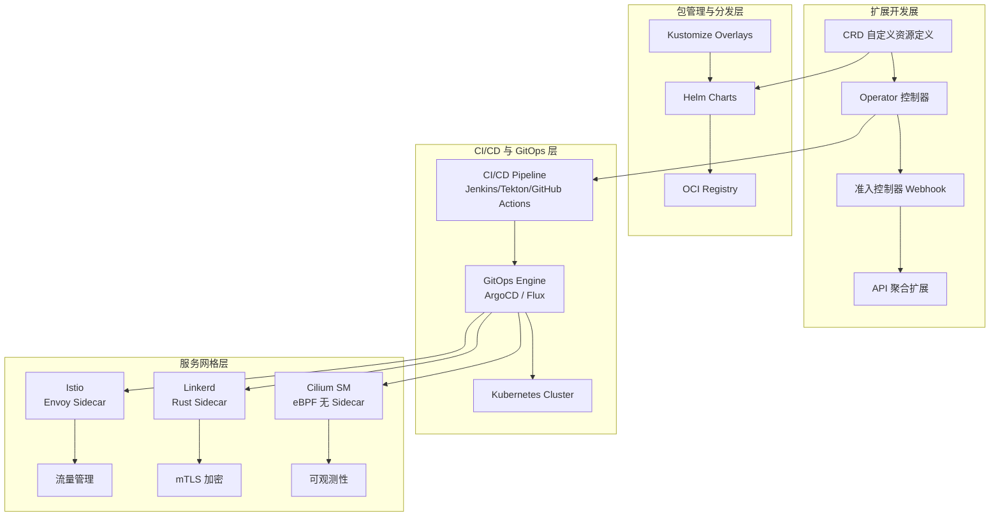
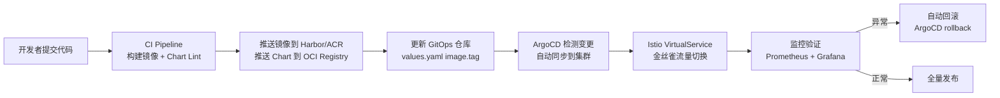

本页是 Kubernetes 平台运维与扩展生态的全景指南，聚焦于 **四大核心支柱**：Helm 包管理与应用分发、CI/CD 流水线与 GitOps 自动化、Operator/CRD 扩展开发模式、以及服务网格（Istio/Linkerd/Cilium）的流量治理与安全。这些技术共同构成了企业级 Kubernetes 平台从"可用"迈向"可扩展、可治理、可自动化"的关键跃迁路径。无论你是正在构建内部开发者平台（IDP）的平台工程师，还是负责应用交付流水线的 DevOps 工程师，抑或是需要封装领域知识为 Operator 的后端开发者，本文档都将为你提供从架构决策到生产实践的系统性参考。
Sources: [README.md](domain-10-extensions/README.md#L1-L106), [README.md](domain-9-platform-ops/README.md#L1-L44)

---

## 架构总览：扩展生态的分层模型

Kubernetes 平台扩展生态可划分为四个清晰的层次，每一层各自承担独立职责又紧密协作：



**扩展开发展**定义自定义资源和控制器逻辑，将领域运维知识编码为可复用的自动化代码。**包管理与分发层**将应用及其配置打包为版本化制品，通过 OCI Registry 进行安全分发。**CI/CD 与 GitOps 层**实现从代码提交到集群部署的全链路自动化，确保部署过程的可审计性和可回滚性。**服务网格层**在应用层之上提供流量治理、安全加密和全链路可观测，是微服务架构治理的核心基础设施。
Sources: [01-crd-development-guide.md](domain-10-extensions/01-crd-development-guide.md#L1-L25), [05-package-management-tools.md](domain-10-extensions/05-package-management-tools.md#L7-L73), [11-service-mesh-overview.md](domain-10-extensions/11-service-mesh-overview.md#L5-L18)

---

## 一、Kubernetes 扩展开发：CRD、Operator 与准入控制

### 1.1 CRD 自定义资源定义

CRD（CustomResourceDefinition）是 Kubernetes 扩展 API 的核心机制，它允许用户在不修改 Kubernetes 源码的情况下定义新的资源类型。CRD 通过 OpenAPI v3 Schema 进行声明式验证，数据存储在 etcd 中，生命周期完全由 Kubernetes API Server 管理。

CRD 与 API Aggregation 的关键对比：

| 特性 | CRD | API Aggregation |
|:-----|:----|:----------------|
| **开发复杂度** | 声明式 YAML，低 | 需编写 Go 扩展 API Server，高 |
| **数据存储** | etcd 内置 | 自定义存储后端 |
| **Schema 验证** | OpenAPI v3 Schema | 自定义验证逻辑 |
| **版本转换** | 支持 Webhook 转换 | 完全自定义 |
| **适用场景** | 结构化资源扩展 | 复杂业务逻辑、自定义存储 |

一个生产级 CRD 定义涵盖版本管理、Schema 验证、子资源、打印列和 CEL 表达式验证（v1.25+）。以下 CRD 示例定义了一个 `MySQLCluster` 资源，展示了从字段约束到状态子资源的完整声明：

```yaml
apiVersion: apiextensions.k8s.io/v1
kind: CustomResourceDefinition
metadata:
  name: mysqlclusters.database.example.com
spec:
  group: database.example.com
  versions:
  - name: v1beta1
    served: true
    storage: true
    schema:
      openAPIV3Schema:
        type: object
        properties:
          spec:
            type: object
            properties:
              replicas:
                type: integer
                minimum: 1
                maximum: 10
                default: 1
              version:
                type: string
                enum: ["5.7", "8.0"]
                default: "8.0"
              storage:
                type: object
                properties:
                  size:
                    type: string
                    pattern: "^[0-9]+Gi$"
                required: ["size"]
            required: ["replicas", "storage"]
          status:
            type: object
            properties:
              phase:
                type: string
                enum: [Pending, Creating, Running, Failed]
              replicas:
                type: integer
    subresources:
      scale:
        specReplicasPath: .spec.replicas
        statusReplicasPath: .status.replicas
      status: {}
    additionalPrinterColumns:
    - name: Replicas
      type: integer
      jsonPath: .spec.replicas
    - name: Status
      type: string
      jsonPath: .status.phase
    - name: Age
      type: date
      jsonPath: .metadata.creationTimestamp
  scope: Namespaced
  names:
    plural: mysqlclusters
    singular: mysqlcluster
    kind: MySQLCluster
    shortNames: [mc]
```

注意 v1.25+ 引入的 **CEL 验证规则**（`x-kubernetes-validations`）允许在 Schema 层面定义跨字段约束，例如 `"self.replicas <= 10 || has(self.highAvailability)"`，这大幅减少了 Webhook 层面的验证负担。
Sources: [01-crd-development-guide.md](domain-10-extensions/01-crd-development-guide.md#L28-L149), [20-crd-operator-development.md](domain-9-platform-ops/20-crd-operator-development.md#L5-L150)

### 1.2 Operator 开发模式与控制器实现

Operator 模式将**人类的运维知识编码为自动化控制器代码**，通过 Reconcile（协调）循环持续将集群的实际状态收敛到用户声明的期望状态。其核心机制是 Watch → Diff → Act 三段式循环：Informer 监听资源变更事件，WorkQueue 缓冲事件实现削峰，Reconciler 计算差异并执行 CRUD 操作。

Operator 开发框架的选择直接影响开发效率和运行时特性：

| 框架 | 语言 | 学习曲线 | 生态成熟度 | 适用场景 |
|:-----|:-----|:---------|:-----------|:---------|
| **Kubebuilder** | Go | 中 | ⭐⭐⭐⭐⭐ | 企业级 Operator |
| **Operator SDK** | Go/Ansible/Helm | 中 | ⭐⭐⭐⭐⭐ | 全功能开发 |
| **KUDO** | YAML | 低 | ⭐⭐⭐ | 声明式 Operator |
| **Metacontroller** | 多语言 | 低 | ⭐⭐⭐ | 简单场景 |

以 Kubebuilder 为例，Operator 开发流程遵循 `初始化 → API 定义 → 控制器实现 → RBAC 配置 → 测试` 五步范式。API 类型定义中通过 `+kubebuilder` 注解标记验证规则和打印列配置，控制器实现中通过 `controllerutil.CreateOrUpdate` 实现"创建或更新"的幂等操作，配合 Finalizer 机制确保资源删除前的清理逻辑：

```go
// Reconcile 核心逻辑框架
func (r *MySQLClusterReconciler) Reconcile(ctx context.Context, req ctrl.Request) (ctrl.Result, error) {
    log := log.FromContext(ctx)
    
    // 1. 获取资源实例
    cluster := &databasev1beta1.MySQLCluster{}
    if err := r.Get(ctx, req.NamespacedName, cluster); err != nil {
        if apierrors.IsNotFound(err) {
            return ctrl.Result{}, nil
        }
        return ctrl.Result{}, err
    }
    
    // 2. 处理删除（Finalizer 模式）
    if cluster.DeletionTimestamp != nil {
        return r.handleDeletion(ctx, cluster)
    }
    
    // 3. 添加 Finalizer
    if !controllerutil.ContainsFinalizer(cluster, "mysqlcluster.finalizers.example.com") {
        controllerutil.AddFinalizer(cluster, "mysqlcluster.finalizers.example.com")
        if err := r.Update(ctx, cluster); err != nil {
            return ctrl.Result{}, err
        }
    }
    
    // 4. 协调 StatefulSet、Service 等子资源
    sts, err := r.reconcileStatefulSet(ctx, cluster)
    // 5. 更新状态
    return r.updateStatus(ctx, cluster, sts)
}
```

控制器通过 `ctrl.SetControllerReference` 建立 OwnerReference 关系，确保子资源的垃圾回收随 CR 实例自动级联。
Sources: [02-operator-development-patterns.md](domain-10-extensions/02-operator-development-patterns.md#L1-L100), [02-operator-development-patterns.md](domain-10-extensions/02-operator-development-patterns.md#L222-L445)

### 1.3 准入控制器（Admission Webhook）

准入控制器拦截 Kubernetes API Server 的写入请求，在持久化到 etcd 之前执行变更或验证。**Mutating Webhook** 可以修改请求对象（如注入 sidecar 容器、设置默认值），**Validating Webhook** 只做策略验证（如拒绝不符合安全规范的 Pod）。两者组合形成完整的"先变更、后验证"拦截链。

生产级 Webhook 部署必须关注：**高可用性**（至少 3 副本 + Pod 反亲和）、**安全加固**（最小权限 RBAC、只读根文件系统、非 root 运行）、以及 **证书管理**（推荐 cert-manager 自动轮换）。Webhook 的 `failurePolicy` 设置需要谨慎：`Fail` 模式在 Webhook 不可用时会拒绝所有请求，适合安全关键场景；`Ignore` 模式则允许请求绕过，适合非关键验证。
Sources: [03-admission-webhook-configuration.md](domain-10-extensions/03-admission-webhook-configuration.md#L1-L186)

### 1.4 API 聚合扩展

API 聚合（API Aggregation）是 CRD 之外的高级扩展机制，适用于需要自定义存储后端、复杂业务逻辑或非 etcd 数据的场景。它通过 `APIService` 资源将自定义 API Server 注册为 Kubernetes API 的一部分，API Server Aggregator 层负责路由转发。典型用例包括 `metrics-server`（`metrics.k8s.io`）和自定义监控 API。开发 Extension API Server 需要实现 REST 存储接口和 Kubernetes 认证授权集成，复杂度显著高于 CRD。
Sources: [04-api-aggregation-extension.md](domain-10-extensions/04-api-aggregation-extension.md#L1-L161)

---

## 二、Helm 包管理：从 Chart 开发到企业级分发

### 2.1 包管理工具生态对比

Kubernetes 应用包管理生态包含多种工具，它们在抽象层级和适用场景上各有侧重：

| 工具 | 核心定位 | 学习曲线 | 生产优势 |
|:-----|:---------|:---------|:---------|
| **Helm** | 应用包管理器 | 中 | Chart 版本控制、回滚、依赖管理、生态最丰富 |
| **Kustomize** | 声明式配置管理 | 低 | 无模板、原生集成 kubectl、多环境叠加 |
| **Carvel** | 工具套件 | 中 | ytt 模板、kapp 部署、vendir 依赖管理 |
| **Crossplane** | 基础设施即代码 | 高 | 云资源统一管理、Composition 模式 |
| **Timoni** | CUE 模块分发 | 高 | 强类型、模块化、OCI 原生 |

**Helm** 是 CNCF 毕业项目，以其庞大的 Chart 生态、完善的版本管理和成熟的 CI/CD 集成成为企业首选。**Kustomize** 作为 kubectl 内置的配置管理工具，以"无模板叠加"的理念适配 GitOps 工作流。
Sources: [05-package-management-tools.md](domain-10-extensions/05-package-management-tools.md#L76-L87)

### 2.2 Helm Chart 开发核心要素

Helm 3 的 Chart 目录结构严格遵循约定：

```
mychart/
├── Chart.yaml          # Chart 元数据（名称、版本、依赖）
├── Chart.lock          # 依赖锁定文件
├── values.yaml         # 默认配置值
├── values.schema.json  # JSON Schema 值验证
├── templates/          # Go 模板目录
│   ├── _helpers.tpl    # 模板助手函数（命名、标签）
│   ├── deployment.yaml
│   ├── service.yaml
│   ├── ingress.yaml
│   └── tests/          # Chart 测试（helm test）
├── charts/             # 子 Chart 依赖
└── crds/               # CRD 定义（安装时自动创建）
```

**Chart.yaml** 是 Chart 的核心元数据文件，其中 `apiVersion: v2` 标识 Helm 3 格式，`dependencies` 块声明子 Chart 并通过 `condition` 字段控制可选依赖的启用：

```yaml
apiVersion: v2
name: myapp
version: 1.0.0
appVersion: "2.0.0"
type: application
kubeVersion: ">=1.25.0-0"
dependencies:
  - name: postgresql
    version: "12.x.x"
    repository: https://charts.bitnami.com/bitnami
    condition: postgresql.enabled
  - name: redis
    version: "17.x.x"
    repository: https://charts.bitnami.com/bitnami
    condition: redis.enabled
```

**模板助手函数**（`_helpers.tpl`）通过 `define`/`include` 机制实现标签、命名等公共逻辑的复用，`include` 相比 `template` 支持 pipeline 操作，是推荐写法。
Sources: [06-helm-charts-management.md](domain-10-extensions/06-helm-charts-management.md#L1-L120)

### 2.3 多环境配置与 CI/CD 集成

生产级 Helm 部署的核心挑战是**多环境配置管理**。推荐模式是分层 Values 文件：`values.yaml`（基础默认值）→ `values-dev.yaml`（开发覆盖）→ `values-staging.yaml`（预发布覆盖）→ `values-prod.yaml`（生产覆盖）。Helm 按文件顺序叠加，后者覆盖前者：

```bash
helm install myapp . -f values.yaml -f values-prod.yaml
```

生产级 Values 文件应包含完整的**安全上下文**（`runAsNonRoot`、`readOnlyRootFilesystem`、`capabilities.drop: ALL`）、**三层探针**（startup → liveness → readiness）、**资源配额**（requests + limits）以及 **PDB** 配置。

Helm 与 CI/CD 的集成覆盖三大主流平台：

| CI/CD 平台 | 集成方式 | 关键步骤 |
|:-----------|:---------|:---------|
| **GitHub Actions** | `helm/chart-testing-action` + `helm/chart-releaser-action` | lint → 变更检测 → kind 集群测试 → 发布 |
| **GitLab CI** | Shell Executor + Helm CLI | lint → dry-run 测试 → tag 触发发布 |
| **Jenkins** | Kubernetes Plugin + Pipeline | 参数化环境选择 → dry-run → 确认部署 |

**OCI Registry** 是 Helm 3 推荐的 Chart 分发方式，通过 `helm push`/`helm pull` 直接与容器镜像仓库交互，统一了镜像和 Chart 的存储后端：

```bash
helm push mychart-1.0.0.tgz oci://registry.cn-hangzhou.aliyuncs.com/mycharts
helm pull oci://registry.cn-hangzhou.aliyuncs.com/mycharts/mychart --version 1.0.0
```
Sources: [05-package-management-tools.md](domain-10-extensions/05-package-management-tools.md#L200-L400), [07-helm-advanced-operations.md](domain-10-extensions/07-helm-advanced-operations.md#L1-L225), [07-helm-advanced-operations.md](domain-10-extensions/07-helm-advanced-operations.md#L725-L854)

---

## 三、CI/CD 流水线与 GitOps 自动化

### 3.1 CI/CD 工具决策矩阵

企业级 Kubernetes CI/CD 工具选型需综合考虑团队规模、技术栈和云厂商集成度：

| 工具 | 类型 | K8s 集成 | 学习曲线 | 企业支持 | 典型规模 |
|:-----|:-----|:---------|:---------|:---------|:---------|
| **ArgoCD** | GitOps CD | 原生 | 中 | 商业版 | 1000+ Apps |
| **Flux** | GitOps CD | 原生 | 低 | 社区 | 500+ Apps |
| **Tekton** | K8s 原生 CI/CD | CRD 定义 | 高 | IBM/Red Hat | 复杂流水线 |
| **Jenkins** | 传统 CI/CD | 插件 | 中 | CloudBees | 企业级 CI |
| **GitLab CI** | 一体化 | Runner | 中 | GitLab Inc | 全能平台 |
| **GitHub Actions** | CI/CD | Action | 低 | GitHub | 开源项目 |

**GitOps 决策树**提供快速选型指引：

```
是否需要 GitOps?
├─ 是 → 团队规模?
│   ├─ <50人 → Flux（轻量简单）
│   ├─ 50-200人 → ArgoCD（功能完整，UI 强大）
│   └─ >200人 → ArgoCD + ApplicationSet（多租户）
├─ 否 → 已有 CI 工具?
    ├─ GitHub → GitHub Actions + kubectl
    ├─ GitLab → GitLab CI + kubectl
    └─ Jenkins → Jenkins + Kubernetes Plugin
```
Sources: [08-cicd-pipelines.md](domain-10-extensions/08-cicd-pipelines.md#L1-L33)

### 3.2 ArgoCD 生产级配置

ArgoCD 是 CNCF 毕业项目，采用 Pull 模式持续监听 Git 仓库变更并自动同步到目标集群。其核心概念包括 **Application**（部署单元）、**AppProject**（应用分组与权限控制）和 **SyncPolicy**（同步策略）。

生产级 ArgoCD 部署的关键配置项：

**Application 同步策略**定义了自动化程度和安全边界。`automated.prune: true` 确保删除 Git 中已移除的资源，`selfHeal: true` 自动修复手动变更导致的配置漂移，`ServerSideApply: true`（v1.25+）避免大资源的 Annotation 膨胀。`ignoreDifferences` 配置避免 HPA 管理的 `replicas` 字段触发不必要的同步：

```yaml
apiVersion: argoproj.io/v1alpha1
kind: Application
metadata:
  name: myapp-production
  namespace: argocd
  finalizers:
    - resources-finalizer.argocd.argocd.argoproj.io
spec:
  project: production-apps
  source:
    repoURL: https://github.com/org/repo.git
    targetRevision: release-v1.2.3
    path: manifests/production
    helm:
      valueFiles:
        - values-prod.yaml
      parameters:
        - name: image.tag
          value: "v1.2.3"
  destination:
    server: https://kubernetes.default.svc
    namespace: production
  syncPolicy:
    automated:
      prune: true
      selfHeal: true
    syncOptions:
      - CreateNamespace=true
      - PruneLast=true
      - ServerSideApply=true
    retry:
      limit: 5
      backoff:
        duration: 5s
        factor: 2
        maxDuration: 3m
```

**RBAC 策略**通过 `argocd-rbac-cm` ConfigMap 实现细粒度权限控制：平台管理员拥有全部权限，项目管理员限定项目范围，开发者拥有同步和查看权限，只读用户仅可查看。
Sources: [08-cicd-pipelines.md](domain-10-extensions/08-cicd-pipelines.md#L34-L200), [09-gitops-workflow-argocd.md](domain-10-extensions/09-gitops-workflow-argocd.md#L1-L109)

### 3.3 FluxCD 轻量级 GitOps

FluxCD v2 采用模块化架构，每个控制器（source-controller、kustomize-controller、helm-controller、image-automation-controller）独立运行，支持增量采用。其 `HelmRelease` CRD 直接将 Helm Chart 与 GitOps 工作流融合，`valuesFrom` 支持从 ConfigMap/Secret 动态注入配置，`image-automation-controller` 实现基于镜像标签策略的自动更新。
Sources: [09-gitops-workflow-argocd.md](domain-10-extensions/09-gitops-workflow-argocd.md#L111-L189)

### 3.4 容器镜像构建工具

CI/CD 流水线中的镜像构建环节对安全性要求极高。**Kaniko** 是 Google 开源的 Kubernetes 原生镜像构建工具，**完全在用户空间执行**，无需 Docker Daemon 和特权容器，是 CI/CD 流水线的首选：

| 工具 | 运行环境 | 核心特性 | 安全性 |
|:-----|:---------|:---------|:-------|
| **Kaniko** | K8s Pod | 无需 Docker Daemon | 高 |
| **Buildah** | 任意环境 | OCI 标准、Rootless | 高 |
| **BuildKit** | Docker/Standalone | 并行构建、缓存优化 | 中 |
| **ko** | Go 环境 | 无需 Dockerfile | 高 |
| **Jib** | Maven/Gradle | 无需 Dockerfile | 高 |

Kaniko 在 Pod 内通过 `executor` 二进制解析 Dockerfile、提取基础镜像层、在用户空间执行 `RUN` 指令，最终推送镜像到 Registry。生产配置需关注 `--cache=true --cache-repo`（远程缓存加速）、`--snapshot-mode=redo`（增量构建）和安全上下文（`runAsUser: 0`，但无需 `privileged: true`）。
Sources: [10-image-build-tools.md](domain-10-extensions/10-image-build-tools.md#L1-L200)

---

## 四、服务网格：流量治理、安全与可观测性

### 4.1 服务网格选型对比

服务网格在应用层之上提供**透明的流量管理、安全加密和全链路可观测**，是微服务架构从"能通信"到"可治理"的关键基础设施：

| 特性 | Istio | Linkerd | Cilium Service Mesh |
|:-----|:------|:--------|:--------------------|
| **架构** | Envoy Sidecar | Rust Sidecar | eBPF 无 Sidecar |
| **资源开销** | 高 | 低 | 很低 |
| **学习曲线** | 陡峭 | 平缓 | 中等 |
| **功能丰富度** | 最全面 | 核心功能 | 核心功能 |
| **mTLS** | 自动 | 自动 | 自动（透明加密） |
| **流量管理** | 强大（VirtualService + DestinationRule） | 基本 | 基本 |
| **可观测性** | 全面（Telemetry API） | 好 | 好（Hubble） |
| **ACK 集成** | ASM 托管 | 手动 | 手动 |

**Istio** 适合需要精细化流量控制和丰富功能的大型企业；**Linkerd** 适合追求轻量、稳定的核心服务网格能力；**Cilium Service Mesh** 基于 eBPF 实现**无 Sidecar 架构**，性能开销极低，是下一代服务网格的代表方向。
Sources: [11-service-mesh-overview.md](domain-10-extensions/11-service-mesh-overview.md#L5-L18), [12-service-mesh-advanced.md](domain-10-extensions/12-service-mesh-advanced.md#L192-L200)

### 4.2 Istio 流量管理核心 CRD

Istio 的流量管理通过四个核心 CRD 实现：

| CRD | 用途 | 核心能力 |
|:----|:-----|:---------|
| **VirtualService** | 流量路由规则 | 按 Header/权重路由、重试、超时、故障注入 |
| **DestinationRule** | 目标策略 | 连接池、负载均衡、离群检测、子集定义 |
| **Gateway** | 入口/出口网关 | TLS 终止、HTTP→HTTPS 重定向 |
| **AuthorizationPolicy** | 授权策略 | 基于身份、命名空间、HTTP 方法的细粒度访问控制 |

**金丝雀发布**是 VirtualService + DestinationRule 的经典组合应用：DestinationRule 定义 v1/v2 子集，VirtualService 按权重分配流量（如 90:10），逐步扩大 v2 权重直至全量切换。配合 `outlierDetection`（离群检测）实现自动熔断：

```yaml
apiVersion: networking.istio.io/v1
kind: VirtualService
metadata:
  name: reviews
spec:
  hosts: [reviews]
  http:
  - route:
    - destination:
        host: reviews
        subset: v1
      weight: 90
    - destination:
        host: reviews
        subset: v2
      weight: 10
    retries:
      attempts: 3
      perTryTimeout: 2s
    timeout: 10s
---
apiVersion: networking.istio.io/v1
kind: DestinationRule
metadata:
  name: reviews
spec:
  host: reviews
  trafficPolicy:
    outlierDetection:
      consecutive5xxErrors: 5
      interval: 10s
      baseEjectionTime: 30s
  subsets:
  - name: v1
    labels: { version: v1 }
  - name: v2
    labels: { version: v2 }
```
Sources: [12-service-mesh-advanced.md](domain-10-extensions/12-service-mesh-advanced.md#L1-L103), [11-service-mesh-overview.md](domain-10-extensions/11-service-mesh-overview.md#L70-L129)

### 4.3 服务网格安全：零信任 mTLS

Istio 的安全架构基于 **SPIFFE** 身份框架，自动为每个工作负载签发 X.509 证书并轮换。`PeerAuthentication` CRD 控制命名空间级别的 mTLS 模式（`STRICT` 强制加密 / `PERMISSIVE` 兼容模式），`AuthorizationPolicy` 实现基于身份的 L7 授权（如仅允许特定 Service Account 访问特定 API 路径）：

```yaml
apiVersion: security.istio.io/v1beta1
kind: PeerAuthentication
metadata:
  name: default
  namespace: production
spec:
  mtls:
    mode: STRICT
---
apiVersion: security.istio.io/v1beta1
kind: AuthorizationPolicy
metadata:
  name: frontend-ingress
  namespace: production
spec:
  selector:
    matchLabels: { app: frontend }
  action: ALLOW
  rules:
  - from:
    - source:
        principals: ["cluster.local/ns/production/sa/api-gateway"]
    to:
    - operation:
        methods: ["GET", "POST"]
        paths: ["/api/*"]
```
Sources: [11-service-mesh-overview.md](domain-10-extensions/11-service-mesh-overview.md#L131-L163)

### 4.4 可观测性集成

Istio 通过 `Telemetry` CRD（v1.12+）统一配置访问日志、分布式追踪和 Prometheus 指标采集。`randomSamplingPercentage` 控制追踪采样率（生产推荐 1-10%），避免存储和性能开销：
Sources: [12-service-mesh-advanced.md](domain-10-extensions/12-service-mesh-advanced.md#L170-L190)

---

## 五、生产集成最佳实践与常见陷阱

### 5.1 端到端交付流水线集成模式

企业级 Kubernetes 应用的完整交付链路将上述四大支柱串联为**代码提交 → 镜像构建 → Chart 打包 → GitOps 同步 → 网格治理**的端到端自动化流水线：



### 5.2 Helm 常见故障排除

| 问题 | 根因 | 解决方案 |
|:-----|:-----|:---------|
| Chart 依赖解析失败 | `Chart.yaml` 中仓库 URL 错误 | 检查 URL，运行 `helm dependency update` |
| 模板渲染错误 | Go 模板语法或缩进问题 | 使用 `helm template --debug` 逐步定位 |
| 权限不足 | ServiceAccount/RBAC 配置不当 | 检查 SA 绑定和 Role 权限 |
| 资源已存在 | 上次安装未正确清理 | `helm uninstall` 清理，或 `--no-hooks` 跳过 Hook |
| 镜像拉取失败 | 私有仓库凭据缺失 | 配置 `imagePullSecrets` |

### 5.3 关键安全实践

生产环境必须落实的安全措施清单：

- **Helm**：`values.yaml` 中设置 `podSecurityContext.runAsNonRoot: true`、`securityContext.capabilities.drop: ALL`、`readOnlyRootFilesystem: true`；敏感配置通过 External Secrets Operator 注入，不在 Chart 中硬编码
- **Operator**：RBAC 遵循最小权限原则（`+kubebuilder:rbac` 注解精确声明）；Finalizer 确保资源清理；Status 子资源使用 `status: {}` subresource 避免全对象更新
- **ArgoCD**：`policy.default: role:readonly` 作为默认策略；SSO 集成企业身份提供商；`ServerSideApply` 避免字段冲突
- **服务网格**：`STRICT` mTLS 模式；`AuthorizationPolicy` 默认拒绝（`action: DENY` 全局规则 + `action: ALLOW` 白名单）
Sources: [07-helm-advanced-operations.md](domain-10-extensions/07-helm-advanced-operations.md#L391-L460), [03-admission-webhook-configuration.md](domain-10-extensions/03-admission-webhook-configuration.md#L119-L186)

---

## 六、学习路径与进阶阅读

本页内容横跨 Kubernetes 扩展生态的四大领域，建议按以下路径循序渐进：

| 阶段 | 学习内容 | 对应源文件 | 预计周期 |
|:-----|:---------|:----------|:---------|
| **入门** | CRD 定义 + Helm 基础 | `01-crd-development-guide.md`, `06-helm-charts-management.md` | 1-2 周 |
| **进阶** | Operator 开发 + CI/CD 集成 | `02-operator-development-patterns.md`, `08-cicd-pipelines.md` | 2-4 周 |
| **实战** | GitOps ArgoCD + 服务网格 | `09-gitops-workflow-argocd.md`, `11-service-mesh-overview.md` | 2-3 周 |
| **专家** | API 聚合 + 网格高级流量管理 | `04-api-aggregation-extension.md`, `12-service-mesh-advanced.md` | 3-4 周 |

**推荐后续阅读**：

- 若需深入了解生产运维的灾备恢复与成本治理，请参阅 [生产运维：GitOps、FinOps、灾备恢复与变更管理](20-sheng-chan-yun-wei-gitops-finops-zai-bei-hui-fu-yu-bian-geng-guan-li)
- 若对 eBPF 和 Cilium 无 Sidecar 服务网格的底层原理感兴趣，请参阅 [eBPF 技术、平台工程、边缘计算与 WebAssembly](27-ebpf-ji-zhu-ping-tai-gong-cheng-bian-yuan-ji-suan-yu-webassembly)
- 若需要从故障排查视角理解 Helm 和 GitOps 的常见问题，请参阅 [结构化故障排查：配置优先方法论与全组件排障指南](15-jie-gou-hua-gu-zhang-pai-cha-pei-zhi-you-xian-fang-fa-lun-yu-quan-zu-jian-pai-zhang-zhi-nan)