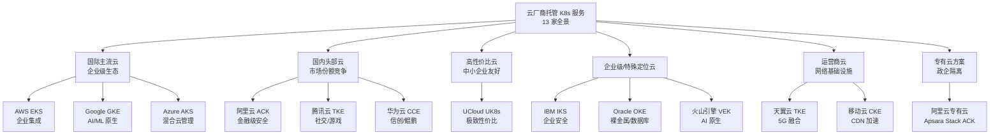

本文对 **13 家云厂商的托管 Kubernetes 服务**进行系统性横向对比，覆盖国际三大云（AWS EKS、Google GKE、Azure AKS）、国内头部云（阿里云 ACK、腾讯云 TKE、华为云 CCE）、以及 UCloud UK8s、IBM IKS、Oracle OKE、火山引擎 VEK、天翼云 TKE、移动云 CKE 和阿里云专有云 Apsara Stack ACK。每家厂商的产品定位、架构特色、SLA 承诺、计费模式、网络/存储方案均源自本库中的深度实战文档，旨在为架构决策者提供**从技术参数到选型逻辑**的全景视图。

Sources: [README.md](domain-12-cloud-providers/README.md#L1-L218)

---

## 总体架构关系：13 家厂商的分类体系

在深入每一家厂商之前，先建立整体的分类认知框架。13 家厂商可以按照**市场定位**与**技术基因**划分为六个梯队，每一梯队的厂商具有相似的业务驱动逻辑和技术取舍偏好。

**架构解读**：国际三强以**生态广度**和**全球部署能力**为核心壁垒；国内头部云以**本地化合规**和**特定行业深度适配**为差异化方向；运营商云则依赖其**物理网络基础设施**优势构建不可替代性。选型时应首先确定自身所属的业务梯队，再在同一梯队内做精细化对比。

Sources: [README.md](domain-12-cloud-providers/README.md#L20-L64)

---

## 核心参数全景对比矩阵

以下表格从**产品基础信息**、**SLA 与规模**、**网络/存储方案**三个维度，对 13 家厂商的核心参数进行并排对比。这些参数直接决定了集群的**可靠性上限**和**扩展性天花板**。

### 产品基础信息对比

| # | 云厂商 | 服务名称 | 发布年份 | K8s 版本 | 部署模式 | Serverless 支持 | 混合云方案 |
|:---:|:---|:---|:---:|:---|:---|:---|
| 01 | AWS | EKS | 2018 | 1.29 | 托管 + 自管 | Fargate Profiles | EKS Anywhere |
| 02 | Google | GKE | 2015 | 1.29 | Standard + Autopilot | Autopilot 全托管 | Anthos |
| 03 | Azure | AKS | 2018 | 1.29 | 免费控制平面 + VNet | Virtual Nodes | Azure Arc |
| 04 | 阿里云 | ACK | 2017 | 1.28 | 托管版 + 专有版 | ACK Serverless (ECI) | 多集群联邦 |
| 05 | 腾讯云 | TKE | 2018 | 1.28 | 托管 + 独立 + 超级节点 | Super Node | TKE Mesh |
| 06 | 华为云 | CCE | — | — | 托管 + 专有云 | CCI Serverless | 专有云混合 |
| 07 | UCloud | UK8s | — | — | 托管 | Serverless | 基础功能 |
| 08 | IBM | IKS | 2017 | 1.28 | Classic + VPC + OpenShift | Serverless | 多云管理 |
| 09 | Oracle | OKE | — | 1.27 | 托管 + 裸金属 | 虚拟节点 | 混合云支持 |
| 10 | 火山引擎 | VEK | — | — | 托管 | Serverless | 字节优化 |
| 11 | 天翼云 | TKE | 2019 | 1.27 | 托管 | Serverless | 混合云 |
| 12 | 移动云 | CKE | — | — | 托管 + 专属宿主机 | Serverless | CDN 集成 |
| 13 | 阿里云专有云 | Apsara Stack ACK | — | — | 本地化独立部署 | 专有版 | 混合架构 |

**关键发现**：Google GKE（2015 年首发）是**最早商用的托管 K8s 服务**，在版本跟进和功能成熟度上始终保持领先。Azure AKS 的**免费控制平面**是其独特差异化策略。火山引擎 VEK 虽为新入局者，但在**集群规模上限**和**调度延迟**指标上达到业界领先水平。

Sources: [aws-eks-overview.md](domain-12-cloud-providers/01-aws-eks/aws-eks-overview.md#L1-L10), [google-cloud-gke-overview.md](domain-12-cloud-providers/02-google-cloud-gke/google-cloud-gke-overview.md#L1-L10), [azure-aks-overview.md](domain-12-cloud-providers/03-azure-aks/azure-aks-overview.md#L1-L10), [alicloud-ack-overview.md](domain-12-cloud-providers/04-alicloud-ack/alicloud-ack-overview.md#L1-L10), [tencent-tke-overview.md](domain-12-cloud-providers/05-tencent-tke/tencent-tke-overview.md#L1-L10), [huawei-cce-overview.md](domain-12-cloud-providers/06-huawei-cce/huawei-cce-overview.md#L1-L10), [ucloud-uk8s-overview.md](domain-12-cloud-providers/07-ucloud-uk8s/ucloud-uk8s-overview.md#L1-L10), [ibm-iks-overview.md](domain-12-cloud-providers/08-ibm-iks/ibm-iks-overview.md#L1-L10), [oracle-oke-overview.md](domain-12-cloud-providers/09-oracle-oke/oracle-oke-overview.md#L1-L10), [volcengine-vek-overview.md](domain-12-cloud-providers/10-volcengine-vek/volcengine-vek-overview.md#L1-L10), [ctyun-tke-overview.md](domain-12-cloud-providers/11-ctyun-tke/ctyun-tke-overview.md#L1-L10), [ecloud-cke-overview.md](domain-12-cloud-providers/12-ecloud-cke/ecloud-cke-overview.md#L1-L10), [alicloud-apsara-ack-overview.md](domain-12-cloud-providers/13-alicloud-apsara-ack/alicloud-apsara-ack-overview.md#L1-L10)

### SLA 承诺与集群规模上限对比

| 云厂商 | SLA 承诺 | 控制平面高可用 | 单集群最大节点数 | 调度延迟 | 资源利用率 |
|:---|:---:|:---|:---:|:---:|:---:|
| AWS EKS | 99.95% | 三可用区 | 5,000 | — | — |
| Google GKE | 99.95%+ | Regional 多区域 | 15,000+ | — | — |
| Azure AKS | 99.95% | 可用区部署 | 5,000 | — | — |
| 阿里云 ACK | 99.95% | 三可用区 | 5,000+ | — | — |
| 腾讯云 TKE | 99.95% | 三可用区 | **10,000（万级）** | — | — |
| 华为云 CCE | 99.95% | 多可用区 | 2,000 | <50ms | >80% |
| UCloud UK8s | 99.99% | 电信级 HA | — | — | — |
| IBM IKS | 99.95% | 多区域 | — | — | — |
| Oracle OKE | 99.95% | 多可用区 | — | — | — |
| 火山引擎 VEK | — | 超大规模 | **100,000（十万级）** | **<10ms** | >85% |
| 天翼云 TKE | 99.99% | 三物理机房 | — | — | — |
| 移动云 CKE | 99.95% | 三网络区域 | 3,000 | <1ms（网络） | — |
| 阿里云专有云 | **99.99%** | 同城双活+异地容灾 | — | — | — |

**关键发现**：在集群规模维度，火山引擎 VEK 的**10 万节点**单集群支持能力远超同行，这源于字节跳动内部超大规模容器平台的实战积累。在 SLA 维度，阿里云专有云和天翼云承诺的 **99.99%** 金融/电信级 SLA 是行业最高标准，代价是更高的部署成本和更受限的灵活性。华为云 CCE 的 2000 节点上限虽低于头部厂商，但在**信创环境**下仍是最成熟的选择。

Sources: [aws-eks-overview.md](domain-12-cloud-providers/01-aws-eks/aws-eks-overview.md#L555-L643), [tencent-tke-overview.md](domain-12-cloud-providers/05-tencent-tke/tencent-tke-overview.md#L10-L23), [huawei-cce-overview.md](domain-12-cloud-providers/06-huawei-cce/huawei-cce-overview.md#L10-L10), [volcengine-vek-overview.md](domain-12-cloud-providers/10-volcengine-vek/volcengine-vek-overview.md#L10-L17), [ecloud-cke-overview.md](domain-12-cloud-providers/12-ecloud-cke/ecloud-cke-overview.md#L10-L19), [alicloud-apsara-ack-overview.md](domain-12-cloud-providers/13-alicloud-apsara-ack/alicloud-apsara-ack-overview.md#L18-L21)

### 网络与存储方案对比

| 云厂商 | CNI 方案 | 网络特色 | 块存储 | 文件存储 | 对象存储 |
|:---|:---|:---|:---|:---|:---|
| AWS EKS | VPC CNI | Pod 直连 VPC、ENI 动态管理 | EBS (gp3/io2) | EFS | S3 |
| Google GKE | Dataplane V2 (eBPF) | eBPF 数据平面、原生 Network Policy | Persistent Disk | Filestore | GCS |
| Azure AKS | Azure CNI / Kubenet | VNet 原生集成、Calico 策略 | Azure Disk | Azure Files | Azure Blob |
| 阿里云 ACK | Terway / Flannel | ENI 高性能、IPv4/IPv6 双栈 | ESSD/SSD 云盘 | NAS | OSS |
| 腾讯云 TKE | VPC-CNI | 独立 VPC IP、延迟 <1ms | CBS | CFS | COS |
| 华为云 CCE | — | 鲲鹏 ARM 原生、国密算法 | — | — | — |
| 阿里云专有云 | — | 完全隔离网络、国密 SM4 | 云盘 CSI | NAS CSI | OSS CSI |

**关键发现**：Google GKE 的 **Dataplane V2 基于 eBPF** 实现，代表了云厂商 CNI 技术的最前沿——将网络策略执行、负载均衡和可观测性统一在内核层完成。阿里云 ACK 的 **Terway** 基于 ENI 弹性网卡，在 VPC 直连场景下性能优于传统 Overlay 方案。腾讯云 TKE 的 VPC-CNI 可实现**亚毫秒级网络延迟**，这对在线游戏和实时通信场景至关重要。

Sources: [aws-eks-overview.md](domain-12-cloud-providers/01-aws-eks/aws-eks-overview.md#L53-L68), [google-cloud-gke-overview.md](domain-12-cloud-providers/02-google-cloud-gke/google-cloud-gke-overview.md#L45-L61), [azure-aks-overview.md](domain-12-cloud-providers/03-azure-aks/azure-aks-overview.md#L31-L46), [alicloud-ack-overview.md](domain-12-cloud-providers/04-alicloud-ack/alicloud-ack-overview.md#L37-L47), [tencent-tke-overview.md](domain-12-cloud-providers/05-tencent-tke/tencent-tke-overview.md#L46-L57), [huawei-cce-overview.md](domain-12-cloud-providers/06-huawei-cce/huawei-cce-overview.md#L14-L21)

---

## 计费模式与成本结构对比

计费模型的差异往往是选型决策中的**决定性因素**。各厂商在控制平面收费、节点计费粒度和 Serverless 计费方式上存在显著差异。

| 云厂商 | 控制平面费用 | 节点计费模式 | Serverless 计费 | Spot/竞价实例 | 成本优势场景 |
|:---|:---|:---|:---|:---:|:---|
| AWS EKS | 按小时计费 ($0.10/hr) | EC2 按需/预留 | Fargate 按 vCPU+内存 | ✅ 最高省 90% | 大规模生态应用 |
| Google GKE | Standard 免费 / Autopilot 按 Pod | GCE 按需/承诺使用 | Autopilot 按 Pod 资源 | ✅ | AI/ML 工作负载 |
| Azure AKS | **完全免费** | VM 按需/预留 | Virtual Nodes 按用量 | ✅ 最高省 90% | 企业 Microsoft 生态 |
| 阿里云 ACK | 托管版按量 | ECS 按需/包年包月 | ECI 按实例 | ✅ | 国内业务、金融合规 |
| 腾讯云 TKE | 按量 | CVM 按需/包年包月 | Super Node 按 Pod | ✅ 最高省 80% | 游戏、社交高并发 |
| 华为云 CCE | 按量 | ECS 按需/包年包月 | CCI 按实例 | ✅ | 信创环境、政企 |
| UCloud UK8s | 低成本 | 按需计费 | 按量 | — | **中小企业首选** |

**成本选型建议**：若控制平面费用是关键考量，Azure AKS 的**免费控制平面**策略使其在低负载场景下总拥有成本最低。对于需要极致弹性的场景，Google GKE Autopilot 和 AWS Fargate 的**按 Pod 资源消耗计费**模式可避免为空闲节点付费。在国内市场，UCloud UK8s 凭借**比传统方案低 40-60% 的成本**成为中小企业和创业公司的性价比之选。

Sources: [aws-eks-overview.md](domain-12-cloud-providers/01-aws-eks/aws-eks-overview.md#L759-L767), [azure-aks-overview.md](domain-12-cloud-providers/03-azure-aks/azure-aks-overview.md#L851-L859), [ucloud-uk8s-overview.md](domain-12-cloud-providers/07-ucloud-uk8s/ucloud-uk8s-overview.md#L14-L20), [tencent-tke-overview.md](domain-12-cloud-providers/05-tencent-tke/tencent-tke-overview.md#L33-L42)

---

## 各厂商差异化竞争力深度解析

### 国际三强：生态广度 vs. 技术深度

**AWS EKS** 的核心竞争力在于**企业级生态集成**——从 IAM 身份管理到 CloudWatch 可观测性，从 ALB 负载均衡到 RDS 数据库，EKS 几乎与 AWS 全部 200+ 服务实现原生集成。其 EKS Anywhere 方案允许在本地数据中心和边缘位置运行与云端一致的 Kubernetes 集群，统一了混合云管理平面。EKS 控制平面跨三个可用区部署，提供 99.95% SLA，单集群支持最大 5000 节点。VPC CNI 插件使每个 Pod 直接获得 VPC IP 地址，无需 NAT 即可与 VPC 内其他资源通信。

Sources: [aws-eks-overview.md](domain-12-cloud-providers/01-aws-eks/aws-eks-overview.md#L1-L68), [aws-eks-overview.md](domain-12-cloud-providers/01-aws-eks/aws-eks-overview.md#L551-L596)

**Google GKE** 是 Kubernetes 的**原生发源地**（Google 内部 Borg/Omega 系统的技术延续），在版本更新速度和功能成熟度上始终领先。GKE 提供两种截然不同的运行模式：Standard 模式用户管理节点，Autopilot 模式由 Google 完全托管整个集群——包括节点配置优化、自动扩缩容和安全补丁。其 Dataplane V2 基于 **eBPF** 技术构建，将网络策略、负载均衡和可观测性下沉到内核层，性能远超传统 iptables 方案。Anthos 平台提供跨多云和本地环境的统一管理能力。

Sources: [google-cloud-gke-overview.md](domain-12-cloud-providers/02-google-cloud-gke/google-cloud-gke-overview.md#L1-L61), [google-cloud-gke-overview.md](domain-12-cloud-providers/02-google-cloud-gke/google-cloud-gke-overview.md#L842-L853)

**Azure AKS** 的差异化策略体现在两个维度：一是**免费的控制平面**（其他主流厂商均对控制平面收费），显著降低了入门成本；二是通过 **Azure Arc** 实现业界最成熟的混合云管理方案，可将非 Azure 环境（包括其他公有云和本地数据中心）的 Kubernetes 集群纳入统一管理平面。AKS 深度集成 Azure Active Directory 和 Microsoft 生态，对企业级合规场景天然友好。

Sources: [azure-aks-overview.md](domain-12-cloud-providers/03-azure-aks/azure-aks-overview.md#L1-L46), [azure-aks-overview.md](domain-12-cloud-providers/03-azure-aks/azure-aks-overview.md#L648-L673)

### 国内头部云：合规适配 vs. 场景深耕

**阿里云 ACK** 在中国市场份额第一，提供**托管版**和**专有版**两种架构。托管版控制平面由阿里云运维，部署在专用 VPC 中与用户网络隔离；专有版用户自管控制平面，支持离线环境和私有化部署，适用于金融、政府等对数据安全要求极高的行业。网络方面，Terway 插件基于阿里云 ENI 实现高性能 VPC 直连，支持 IPv4/IPv6 双栈。存储方面，ESSD 云盘单盘最高可达 100 万 IOPS，NAS 文件存储支持万级并发共享访问。ACK Serverless（ECI）按弹性容器实例计费，秒级启动，适合突发性工作负载。

Sources: [alicloud-ack-overview.md](domain-12-cloud-providers/04-alicloud-ack/alicloud-ack-overview.md#L1-L47), [alicloud-ack-overview.md](domain-12-cloud-providers/04-alicloud-ack/alicloud-ack-overview.md#L357-L386)

**腾讯云 TKE** 承载了微信、QQ、王者荣耀等超大规模业务，具备**万级节点、十万级 Pod** 的集群管理能力。TKE 提供三种集群模式：托管集群（99.95% SLA）、独立集群（更高安全隔离）和超级节点集群（无服务器模式）。其 VPC-CNI 网络插件使每个 Pod 获得独立 VPC IP，网络延迟低于 1ms，非常适合在线游戏和实时通信场景。Spot 实例支持最高节省 80% 成本，GPU 节点池专门优化 AI/ML 工作负载。

Sources: [tencent-tke-overview.md](domain-12-cloud-providers/05-tencent-tke/tencent-tke-overview.md#L1-L57), [tencent-tke-overview.md](domain-12-cloud-providers/05-tencent-tke/tencent-tke-overview.md#L1168-L1169)

**华为云 CCE** 的核心竞争力在于**信创全栈支持**和**鲲鹏 ARM 架构优化**。控制平面支持鲲鹏 ARM 原生部署，采用国密算法加密通信，国产化 etcd 存储引擎经过专门优化。单集群支持 2000 节点，调度延迟 <50ms，资源利用率 >80%。CCE 深度融合了华为在通信、云计算和 AI 领域的技术积累，特别适合政企客户、信创改造和边缘计算场景。

Sources: [huawei-cce-overview.md](domain-12-cloud-providers/06-huawei-cce/huawei-cce-overview.md#L1-L10), [huawei-cce-overview.md](domain-12-cloud-providers/06-huawei-cce/huawei-cce-overview.md#L14-L21)

### 企业级与特殊定位厂商

**IBM IKS** 专为金融、医疗、政府等高安全行业设计，提供经典集群、VPC 集群和 **OpenShift 集群**三种模式。OpenShift 集成提供企业级 CI/CD、监控和日志等开箱即用的工具链。IBM Cloud Direct Link 专线连接和 VPN 隧道使其在混合云网络连通性方面具有独特优势。99.95% 企业级 SLA，配合 Watson AI 智能调度算法，在大规模企业部署中表现出色。

Sources: [ibm-iks-overview.md](domain-12-cloud-providers/08-ibm-iks/ibm-iks-overview.md#L1-L63)

**Oracle OKE** 的独特价值在于**裸金属节点**和**数据库深度集成**。Oracle 自主研发的网络虚拟化技术支持高达 100Gbps 的网络吞吐量和微秒级延迟优化。OKE 与 Oracle Autonomous Database、Exadata 等企业级数据库原生集成，适合对数据库性能和安全性有极致要求的关键业务场景。企业级 SLA 保证 99.95% 可用性。

Sources: [oracle-oke-overview.md](domain-12-cloud-providers/09-oracle-oke/oracle-oke-overview.md#L1-L55)

**火山引擎 VEK** 继承字节跳动内部超大规模容器平台（Bytedance Container Platform）的技术积累，在**集群规模**和**调度性能**上达到业界顶级水平：单集群支持 **10 万节点**，调度延迟 **<10ms**，资源利用率 **>85%**，支持千万级 QPS。VEK 自研 ByteScheduler 分布式调度算法，采用机器学习调度策略，支持 NVIDIA A100/H100/V100 全系列 GPU 和字节跳动自研 AI 芯片。特别适合推荐系统、短视频处理、实时搜索等高并发 AI 场景。

Sources: [volcengine-vek-overview.md](domain-12-cloud-providers/10-volcengine-vek/volcengine-vek-overview.md#L1-L22), [volcengine-vek-overview.md](domain-12-cloud-providers/10-volcengine-vek/volcengine-vek-overview.md#L86-L124)

### 运营商云：网络基础设施的不可替代性

**天翼云 TKE** 基于中国电信的骨干网络基础设施，深度融合 **5G 网络切片技术**。控制平面跨三个物理机房部署，99.99% 电信级 SLA 保障。特色包括边缘计算节点就近接入（部署在 5G 基站附近）、安全增强节点（国产化硬件平台）和电信级网络 QoS 保障。特别适合对网络延迟敏感和对数据主权有严格要求的政企客户。

Sources: [ctyun-tke-overview.md](domain-12-cloud-providers/11-ctyun-tke/ctyun-tke-overview.md#L1-L38), [ctyun-tke-overview.md](domain-12-cloud-providers/11-ctyun-tke/ctyun-tke-overview.md#L1343-L1343)

**移动云 CKE** 发挥中国移动在 **CDN 网络**和 5G 技术方面的独特优势。控制平面跨三大运营商网络区域部署，与中国移动骨干网深度融合，网络延迟优化 50%。CDN 加速可提升访问速度 **300%**，专属宿主机架构提供物理级隔离。单集群支持 3000 节点，数据持久性达 99.999%。特别适合内容分发、视频直播、大型政企应用场景。

Sources: [ecloud-cke-overview.md](domain-12-cloud-providers/12-ecloud-cke/ecloud-cke-overview.md#L1-L19), [ecloud-cke-overview.md](domain-12-cloud-providers/12-ecloud-cke/ecloud-cke-overview.md#L78-L80)

### 专有云方案

**阿里云 Apsara Stack ACK** 是面向政企客户的**金融级容器平台**，基于阿里云飞天操作系统构建。控制平面三副本跨机房部署，金融级 etcd 集群采用 5 节点 Raft 协议，支持同城双活和异地容灾。99.99% 金融级 SLA 保障，支持国密 SM4 加密和等保四级认证。完全独立部署、自主可控，支持离线运行，适用于政府、金融、电信等对数据安全和合规性要求极高的行业。

Sources: [alicloud-apsara-ack-overview.md](domain-12-cloud-providers/13-alicloud-apsara-ack/alicloud-apsara-ack-overview.md#L1-L21), [alicloud-apsara-ack-overview.md](domain-12-cloud-providers/13-alicloud-apsara-ack/alicloud-apsara-ack-overview.md#L14-L21)

---

## 典型场景选型决策矩阵

以下矩阵将**业务场景**与**厂商推荐**进行交叉映射，帮助决策者快速定位候选方案。

| 业务场景 | 首选厂商 | 备选厂商 | 选型理由 |
|:---|:---|:---|:---|
| 全球化 SaaS 平台 | AWS EKS | Google GKE | 全球 30+ 区域部署、生态集成深度 |
| AI/ML 训练推理 | 火山引擎 VEK | Google GKE | VEK 10 万节点+ML 调度；GKE Autopilot+A100 |
| 金融交易系统 | 阿里云专有云 ACK | IBM IKS | 99.99% SLA + 国密算法 + 等保四级 |
| 在线游戏/实时通信 | 腾讯云 TKE | — | 亚毫秒延迟 + 万级节点 + 游戏场景优化 |
| 信创/国产化改造 | 华为云 CCE | 天翼云 TKE | 鲲鹏 ARM + 国密 + 信创全栈 |
| 内容分发/视频直播 | 移动云 CKE | 天翼云 TKE | CDN 加速 300% + 5G 边缘 |
| 企业 Microsoft 生态 | Azure AKS | — | 免费控制平面 + AD 集成 + Azure Arc |
| 中小企业起步 | UCloud UK8s | Azure AKS | 成本低 40-60% + 按需计费 + 易上手 |
| 数据库密集型应用 | Oracle OKE | — | 裸金属 + Autonomous DB 深度集成 |
| 推荐/内容算法平台 | 火山引擎 VEK | — | ByteScheduler + BytePS + 千万级 QPS |
| 混合多云统一管理 | Azure AKS (Arc) | Google GKE (Anthos) | Arc 跨云管理成熟度最高 |
| 5G 边缘计算 | 天翼云 TKE | 移动云 CKE | 5G 切片 + 基站级边缘节点 |

Sources: [README.md](domain-12-cloud-providers/README.md#L69-L84)

---

## 安全合规能力对比

对于政企客户而言，**安全合规认证**是不可妥协的硬性要求。以下对比涵盖了各厂商在身份管理、网络隔离、加密和行业认证方面的差异。

| 云厂商 | 身份管理 | 网络隔离 | 加密能力 | 合规认证 |
|:---|:---|:---|:---|:---|
| AWS EKS | IAM + IRSA | VPC 隔离 + 私有端点 | KMS + ACM 证书管理 | SOC 1/2/3, ISO 27001, PCI DSS, HIPAA |
| Google GKE | Workload Identity | VPC SC + 私有集群 | CMEK + Binary Authorization | SOC 1/2/3, ISO 27001, PCI DSS, HIPAA |
| Azure AKS | Azure AD + Pod Identity | VNet 隔离 + Private Link | Azure Key Vault + Disk Encryption | SOC 1/2/3, ISO 27001, PCI DSS, HIPAA |
| 阿里云 ACK | RAM + RRSA | VPC 隔离 + 安全组 | KMS + 国密算法 | 等保三级, CIS 基准 |
| 华为云 CCE | IAM + 企业项目 | VPC 隔离 + 安全组 | **国密 SM4** + KMS | 等保三级, 信创认证 |
| 阿里云专有云 | RAM + 专有隔离 | **完全物理隔离** | **国密 SM4** + 金融加密 | **等保四级**, 金融行业认证 |
| Oracle OKE | OCI IAM | VCN 隔离 | OCI Vault + 传输加密 | SOC 1/2/3, ISO 27001, PCI DSS, HIPAA |

**安全选型要点**：阿里云专有云是唯一达到**等保四级**认证的方案（其他国内厂商多为三级），其完全物理隔离和国密 SM4 加密能力使其成为金融、国防等最高安全等级场景的唯一选择。在国际厂商中，三家均通过了 SOC、ISO 27001、PCI DSS 和 HIPAA 认证，但 Google GKE 的 Binary Authorization（二进制授权）在供应链安全方面更为领先。

Sources: [aws-eks-overview.md](domain-12-cloud-providers/01-aws-eks/aws-eks-overview.md#L104-L120), [google-cloud-gke-overview.md](domain-12-cloud-providers/02-google-cloud-gke/google-cloud-gke-overview.md#L97-L115), [azure-aks-overview.md](domain-12-cloud-providers/03-azure-aks/azure-aks-overview.md#L82-L105), [alicloud-ack-overview.md](domain-12-cloud-providers/04-alicloud-ack/alicloud-ack-overview.md#L18-L28), [huawei-cce-overview.md](domain-12-cloud-providers/06-huawei-cce/huawei-cce-overview.md#L14-L21), [alicloud-apsara-ack-overview.md](domain-12-cloud-providers/13-alicloud-apsara-ack/alicloud-apsara-ack-overview.md#L14-L60), [oracle-oke-overview.md](domain-12-cloud-providers/09-oracle-oke/oracle-oke-overview.md#L7-L10)

---

## 节点规格选型速查：四大核心厂商推荐实例

以下汇总了 AWS EKS、Google GKE、Azure AKS 和阿里云 ACK 四大核心厂商的**节点规格推荐矩阵**，可直接用于容量规划参考。

| 工作负载类型 | AWS EKS | Google GKE | Azure AKS | 阿里云 ACK |
|:---|:---|:---|:---|:---|
| Web 服务 | m5.large (2C8G) | e2-standard-2 (2C8G) | Standard_D2_v3 (2C8G) | ecs.g7.2xlarge (8C32G) |
| 微服务 | c5.xlarge (4C8G) | n2-standard-4 (4C16G) | Standard_D4_v3 (4C16G) | ecs.c7.4xlarge (16C32G) |
| 数据库 | r5.xlarge (4C32G) | n2-highmem-4 (4C32G) | Standard_E4_v3 (4C32G) | ecs.r7.4xlarge (16C128G) |
| AI/ML 训练 | p3.2xlarge (8C61G+V100) | a2-highgpu-1g (12C85G+A100) | Standard_NC6 (6C56G+K80) | ecs.gn7 (GPU 实例) |

**注意**：阿里云 ACK 推荐规格整体偏高，反映了其面向中大型企业客户的定位策略。实际选型时应根据具体业务负载进行压测验证。

Sources: [aws-eks-overview.md](domain-12-cloud-providers/01-aws-eks/aws-eks-overview.md#L93-L103), [google-cloud-gke-overview.md](domain-12-cloud-providers/02-google-cloud-gke/google-cloud-gke-overview.md#L86-L96), [azure-aks-overview.md](domain-12-cloud-providers/03-azure-aks/azure-aks-overview.md#L72-L81), [alicloud-ack-overview.md](domain-12-cloud-providers/04-alicloud-ack/alicloud-ack-overview.md#L74-L80)

---

## 延伸阅读与相关页面

本文覆盖的 13 家厂商各有独立的深度实战文档，建议按需深入阅读：

**国际厂商深度解析**：
- [AWS EKS 企业级实战](domain-12-cloud-providers/01-aws-eks/aws-eks-overview.md) — Fargate 无服务器、Node Groups 管理、混合云部署
- [Google GKE 企业级实战](domain-12-cloud-providers/02-google-cloud-gke/google-cloud-gke-overview.md) — Autopilot 全托管、Anthos 混合多云
- [Azure AKS 企业级实战](domain-12-cloud-providers/03-azure-aks/azure-aks-overview.md) — 免费控制平面、Azure Arc 混合云管理

**国内厂商深度解析**：
- [阿里云 ACK 实战指南](domain-12-cloud-providers/04-alicloud-ack/alicloud-ack-overview.md) — 托管版/专有版架构、Terway 网络深度解析
- [腾讯云 TKE 实战指南](domain-12-cloud-providers/05-tencent-tke/tencent-tke-overview.md) — 超级节点、万级节点集群管理
- [华为云 CCE 实战指南](domain-12-cloud-providers/06-huawei-cce/huawei-cce-overview.md) — 鲲鹏 ARM 优化、信创全栈支持

**关联知识域**：
- [多云混合部署策略](20-sheng-chan-yun-wei-gitops-finops-zai-bei-hui-fu-yu-bian-geng-guan-li) — 生产运维中的多云架构设计
- [Kubernetes 架构基础](5-jia-gou-ji-chu-yu-he-xin-zu-jian-yuan-li) — 理解控制平面/数据平面分离的底层原理
- [网络体系深度解析](9-wang-luo-ti-xi-cni-service-ingress-gateway-api-yu-duo-ji-qun-wang-luo) — CNI 插件对比与选型
- [存储体系深度解析](10-cun-chu-ti-xi-pv-pvc-storageclass-csi-qu-dong-yu-zai-bei-hui-fu) — CSI 驱动集成与灾备恢复