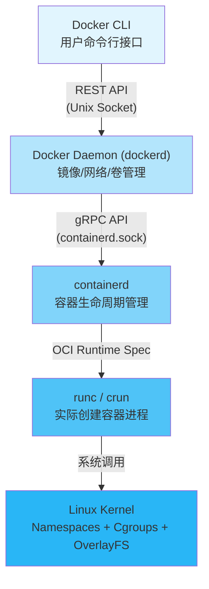
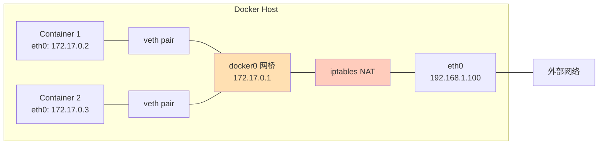
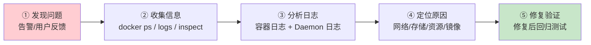

Docker 是容器技术的核心引擎，也是理解 Kubernetes 和云原生生态的**第一块基石**。本页面对 `domain-13-docker` 目录下 12 篇深度文档进行全景式导读，从架构原理、网络模型、存储机制到故障排查方法论，帮你建立对 Docker 技术栈的系统认知。无论你是刚接触容器的开发者，还是准备向 Kubernetes 迈进的运维工程师，这里就是你的起点。

Sources: [README.md](domain-13-docker/README.md#L1-L49)

---

## Docker 是什么：从"集装箱"到"标准化交付单元"

想象你写了一个 Web 应用，在你笔记本上运行完美，但部署到服务器后却报了一堆依赖缺失、版本冲突的错误——这就是经典的"在我机器上能跑"问题。**Docker 的核心价值就是彻底消灭这个问题**：它把应用程序连同其全部依赖（运行时、库、配置文件）打包成一个标准化的**容器镜像**，确保在任何 Linux 环境下行为完全一致。

用一句话概括：**镜像是集装箱，容器是正在运输的货物，Docker Engine 是港口吊车**。你只需关心"装什么"（Dockerfile）和"运到哪"（部署目标），底层运输细节由 Docker 引擎透明处理。

Sources: [01-docker-architecture-overview.md](domain-13-docker/01-docker-architecture-overview.md#L22-L48)

---

## 架构全景：四层调用链与 OCI 标准

### 组件交互：从 CLI 到内核的一行命令之旅

当你执行 `docker run nginx:latest` 时，背后经历了四个层次的组件协作。理解这条调用链是掌握 Docker 架构的关键：



| 组件 | 进程名 | 职责 | 通信方式 |
|:---|:---|:---|:---|
| **Docker CLI** | `docker` | 用户命令行接口，解析命令参数 | 发送 HTTP 请求到 Daemon |
| **Docker Daemon** | `dockerd` | API 网关、镜像/网络/卷管理中枢 | 监听 `/var/run/docker.sock` |
| **containerd** | `containerd` | 容器生命周期管理、镜像分发 | gRPC 调用 shim 进程 |
| **runc** | `runc` | 根据 OCI 规范实际创建容器 | 操作 Linux Namespace/Cgroup |

一个关键的设计细节：**runc 在容器启动后立即退出**，由 `containerd-shim` 接管后续的 IO 转发和生命周期管理。这意味着即使 containerd 重启，运行中的容器也不会受到影响——这就是 Docker 生产环境中 `live-restore` 特性的底层基础。

Sources: [01-docker-architecture-overview.md](domain-13-docker/01-docker-architecture-overview.md#L52-L111), [01-docker-architecture-overview.md](domain-13-docker/01-docker-architecture-overview.md#L115-L141)

### 容器运行时层级：高/中/低三级架构

容器生态将运行时分为三层，各司其职：

| 层级 | 名称 | 代表项目 | 职责 |
|:---|:---|:---|:---|
| **高级运行时** | Container Engine | Docker, Podman | 面向用户的镜像管理、API 服务、网络/存储编排 |
| **中级运行时** | Container Manager | containerd, CRI-O | 容器生命周期管理、镜像拉取/推送、快照管理 |
| **低级运行时** | OCI Runtime | runc, crun, youki | 根据 OCI Runtime Spec 实际 fork 出容器进程 |

**对初学者的意义**：当你在 Kubernetes 环境中看到 "containerd" 而非 "Docker" 时，不必困惑——Kubernetes 只是从 2022 年起跳过了 Docker Daemon 这一层，直接使用 containerd 作为容器运行时。你用 Docker 构建的镜像在 Kubernetes 中依然完全兼容，因为它们都遵循 **OCI（Open Container Initiative）标准**。

Sources: [01-docker-architecture-overview.md](domain-13-docker/01-docker-architecture-overview.md#L190-L199), [01-docker-architecture-overview.md](domain-13-docker/01-docker-architecture-overview.md#L258-L267)

### OCI 标准规范：容器世界的"通用语言"

OCI 定义了三份核心规范，确保任何符合标准的镜像可以在任何符合标准的运行时上运行：

| 规范 | 解决的问题 | 当前版本 |
|:---|:---|:---|
| **Runtime Spec** | 容器应该怎样运行（config.json 定义了文件系统挂载、Namespace、Cgroup、Capabilities 等配置） | v1.2.0 |
| **Image Spec** | 镜像应该长什么样（层级结构、manifest、config blob） | v1.1.0 |
| **Distribution Spec** | 镜像如何分发（Registry 推拉 API、认证流程） | v1.1.0 |

Sources: [01-docker-architecture-overview.md](domain-13-docker/01-docker-architecture-overview.md#L258-L330)

---

## 镜像与容器：分层复用的精髓

### 镜像分层原理

Docker 镜像不是一个大文件，而是由多个**只读层**堆叠而成，每一层对应 Dockerfile 中的一条指令。**联合文件系统（OverlayFS）** 将这些层合并为一个统一的文件视图。

```
┌─────────────────────────────────────────┐
│  容器层 (可读写) ← 容器运行时修改写入这里  │
├─────────────────────────────────────────┤
│  Layer 3: COPY app.jar /app/            │  ← 只读
├─────────────────────────────────────────┤
│  Layer 2: RUN apt-get install java      │  ← 只读
├─────────────────────────────────────────┤
│  Layer 1: FROM ubuntu:22.04             │  ← 只读（基础镜像）
└─────────────────────────────────────────┘
```

**这种设计的巨大优势**：如果你有 10 个基于 `ubuntu:22.04` 的容器，基础镜像层在磁盘上只存储一份，内存中也只需加载一份。这是容器比虚拟机轻量得多的根本原因。

Sources: [02-docker-images-management.md](domain-13-docker/02-docker-images-management.md#L22-L52)

### 容器生命周期：六种状态与退出码

容器有六种核心状态，理解状态流转是排查容器问题的基础：

| 状态 | 触发条件 | `docker ps` 显示 |
|:---|:---|:---|
| **created** | `docker create` | Created |
| **running** | `docker start/run` | Up X seconds |
| **paused** | `docker pause` | Up (Paused) |
| **exited** | 进程退出或 `docker stop` | Exited (code) |
| **dead** | 删除失败等异常 | Dead |
| **removing** | `docker rm` 过程中 | Removal In Progress |

退出码是诊断容器异常的第一线索，初学者务必记住这几个最常见的：

| 退出码 | 含义 | 典型原因 |
|:---|:---|:---|
| **0** | 正常退出 | 程序执行完毕 |
| **1** | 应用错误 | 代码异常、配置错误 |
| **137** | 被 SIGKILL 强杀 | **OOM（内存不足）** 或 `docker kill` |
| **139** | 段错误 | 内存访问违规 |
| **143** | 被 SIGTERM 终止 | `docker stop` 正常停止 |

Sources: [03-docker-container-lifecycle.md](domain-13-docker/03-docker-container-lifecycle.md#L22-L79)

### Dockerfile 核心指令一览

Dockerfile 是构建镜像的"配方"，以下是初学者最常用的指令：

| 指令 | 作用 | 示例 |
|:---|:---|:---|
| `FROM` | 指定基础镜像 | `FROM node:20-alpine` |
| `WORKDIR` | 设置工作目录 | `WORKDIR /app` |
| `COPY` | 复制文件到镜像 | `COPY package*.json .` |
| `RUN` | 构建时执行命令 | `RUN npm ci --production` |
| `ENV` | 设置环境变量 | `ENV NODE_ENV=production` |
| `EXPOSE` | 声明监听端口 | `EXPOSE 8080` |
| `USER` | 指定运行用户 | `USER 1000:1000` |
| `CMD` | 容器启动默认命令 | `CMD ["node", "server.js"]` |
| `ENTRYPOINT` | 容器入口点（不易被覆盖） | `ENTRYPOINT ["python"]` |

**多阶段构建**是生产环境镜像优化的关键技巧——在构建阶段用完整 SDK 编译代码，在运行阶段只拷贝编译产物到一个精简镜像中，可将最终镜像从数百 MB 缩减到几十 MB：

```dockerfile
# 构建阶段
FROM golang:1.22-alpine AS builder
WORKDIR /src
COPY . .
RUN CGO_ENABLED=0 go build -o /app/server .

# 运行阶段（最终镜像）
FROM alpine:3.19
COPY --from=builder /app/server /app/server
USER 1000:1000
ENTRYPOINT ["/app/server"]
```

Sources: [02-docker-images-management.md](domain-13-docker/02-docker-images-management.md#L78-L101), [02-docker-images-management.md](domain-13-docker/02-docker-images-management.md#L152-L180)

---

## 网络模型：六种驱动与 DNS 服务发现

### 六种网络驱动对比

Docker 提供六种网络驱动，每种对应不同的隔离级别和使用场景：

| 驱动 | 隔离性 | 性能 | 典型场景 |
|:---|:---|:---|:---|
| **bridge**（默认） | 中 | 中 | 单机容器通信，最常用 |
| **host** | 无 | 高 | 性能敏感应用、监控工具 |
| **none** | 完全 | — | 不需要网络或自定义网络栈 |
| **overlay** | 高 | 中 | Swarm 多主机容器互联 |
| **macvlan** | 高 | 高 | 容器需要独立 MAC、直接接入物理网络 |
| **ipvlan** | 高 | 高 | 共享 MAC、IP 级隔离 |

### Bridge 网络：默认模式详解

当你执行 `docker run nginx` 而不指定网络时，容器自动接入 `docker0` 网桥。其工作原理如下：



关键机制：每个容器通过一对 **veth pair**（虚拟网卡对）连接到 `docker0` 网桥。容器访问外网时，iptables 通过 **MASQUERADE（SNAT）** 将容器 IP 转换为主机 IP；外部访问容器端口时，通过 **DNAT** 将流量转发到容器 IP。

Sources: [04-docker-networking-deep-dive.md](domain-13-docker/04-docker-networking-deep-dive.md#L21-L67), [04-docker-networking-deep-dive.md](domain-13-docker/04-docker-networking-deep-dive.md#L70-L82)

### DNS 服务发现

在同一自定义网络中，Docker 内置 DNS 服务器（`127.0.0.11`）自动将容器名解析为 IP 地址。这意味着你可以直接用容器名作为主机名来通信，无需硬编码 IP：

```bash
# 创建自定义网络
docker network create mynet

# 启动数据库容器
docker run -d --network mynet --name database mysql:8

# 启动应用容器，通过容器名连接数据库
docker run -d --network mynet --name webapp myapp
# webapp 内部可直接使用 "database:3306" 连接 MySQL
```

**注意**：默认的 `docker0` 网桥不支持自动 DNS 解析——这也是为什么生产环境推荐始终使用自定义 bridge 网络的原因之一。

Sources: [04-docker-networking-deep-dive.md](domain-13-docker/04-docker-networking-deep-dive.md#L280-L341)

---

## 存储体系：Volume、Bind Mount 与 tmpfs

### 三种挂载类型对比

容器的文件系统在容器删除后会随之消失。为了持久化数据，Docker 提供了三种挂载方式：

| 类型 | 存储位置 | 生命周期 | 性能 | 最佳场景 |
|:---|:---|:---|:---|:---|
| **Volume（命名卷）** | `/var/lib/docker/volumes/` | Docker 管理，独立于容器 | 高 | ✅ 生产环境首选，数据库持久化 |
| **Bind Mount（绑定挂载）** | 主机任意路径 | 依赖主机目录 | 高 | 开发环境代码热更新 |
| **tmpfs** | 内存 | 容器停止即消失 | 最高 | 敏感临时数据、高性能缓存 |

```bash
# Volume（推荐）—— Docker 全权管理
docker run -d -v mydata:/app/data myapp

# Bind Mount —— 直接映射主机目录
docker run -d --mount type=bind,source=/host/config,target=/app/config,readonly myapp

# tmpfs —— 纯内存存储
docker run -d --tmpfs /app/temp:size=100m myapp
```

### overlay2 存储驱动：镜像层的底层实现

`overlay2` 是 Docker 默认且推荐的生产级存储驱动，它基于 Linux 内核的 OverlayFS 实现**写时复制**机制。当容器修改文件时，修改写入 upperdir（可写层），不触碰 lowerdir（只读的镜像层）。这意味着同一镜像可以被数百个容器共享，只有各自的增量修改占用额外磁盘空间。

Sources: [05-docker-storage-volumes.md](domain-13-docker/05-docker-storage-volumes.md#L22-L69), [05-docker-storage-volumes.md](domain-13-docker/05-docker-storage-volumes.md#L73-L101)

---

## 故障排查方法论：五步诊断框架

当容器出现问题时，遵循系统化的排查流程可以大幅缩短定位时间：



### 高频故障速查表

以下是初学者最常遇到的五类问题及其快速诊断方法：

| 问题类别 | 典型症状 | 诊断命令 | 常见根因 |
|:---|:---|:---|:---|
| **容器启动失败** | Exited(1), Exited(137) | `docker logs <容器>` | 应用配置错误、OOM 内存不足 |
| **镜像拉取失败** | image not found, unauthorized | `docker pull <镜像>` | 网络不通、未 `docker login`、磁盘满 |
| **网络不通** | 容器间 ping 失败 | `docker exec <容器> ping <目标>` | 不在同一网络、DNS 配置错误 |
| **存储权限错误** | Permission denied | `docker inspect -f '{{json .Mounts}}' <容器>` | UID/GID 不匹配、SELinux 标签缺失 |
| **性能异常** | CPU/内存持续飙高 | `docker stats --no-stream` | 应用内存泄漏、未设资源限制 |

### 关键诊断命令清单

```bash
# 第一步：看清全局状态
docker ps -a                          # 所有容器状态
docker info                           # Docker 引擎信息
docker system df -v                   # 磁盘使用详情

# 第二步：深入单个容器
docker logs --tail 100 -f <容器>      # 实时跟踪日志
docker inspect <容器>                 # 完整配置信息
docker stats --no-stream <容器>       # 资源使用快照

# 第三步：系统级排查
journalctl -u docker.service -f       # Daemon 日志（systemd 系统）
docker events --since 1h              # 最近一小时事件流
docker network inspect bridge         # 网络配置详情
```

Sources: [08-docker-troubleshooting-guide.md](domain-13-docker/08-docker-troubleshooting-guide.md#L22-L52), [08-docker-troubleshooting-guide.md](domain-13-docker/08-docker-troubleshooting-guide.md#L54-L91), [08-docker-troubleshooting-guide.md](domain-13-docker/08-docker-troubleshooting-guide.md#L252-L305)

---

## 安全加固：最小权限原则

容器安全遵循**纵深防御**理念，从四个层面逐层加固：

| 层次 | 防护机制 | 关键操作 |
|:---|:---|:---|
| **镜像层** | 使用精简基础镜像、漏洞扫描 | Distroless/Alpine + Trivy 扫描 |
| **运行时层** | 非 root 运行、只读文件系统、能力裁剪 | `--user 1000:1000 --read-only --cap-drop ALL` |
| **内核层** | Namespaces 隔离、Seccomp 系统调用过滤 | 默认启用，可自定义 profile |
| **主机层** | SELinux/AppArmor 强制访问控制 | 配置安全策略、审计日志 |

生产环境容器启动的最小权限配置示例：

```bash
docker run -d \
  --user 1000:1000 \
  --read-only \
  --tmpfs /tmp:size=100m \
  --security-opt no-new-privileges:true \
  --cap-drop ALL \
  --cap-add NET_BIND_SERVICE \
  myapp:v1.0
```

Sources: [07-docker-security-best-practices.md](domain-13-docker/07-docker-security-best-practices.md#L20-L39), [07-docker-security-best-practices.md](domain-13-docker/07-docker-security-best-practices.md#L42-L76)

---

## Docker 与 Kubernetes：演进关系

Docker 和 Kubernetes 并非替代关系，而是**分层协作**：

```
2014-2020: K8s 通过 dockershim 调用 Docker Daemon
2020:     K8s 宣布弃用 dockershim（v1.20）
2022:     dockershim 正式移除（v1.24）
2022+:    K8s 节点直接使用 containerd/CRI-O
          Docker 构建的 OCI 镜像依然完全兼容
```

| 环境 | 推荐方案 | 理由 |
|:---|:---|:---|
| **K8s 生产节点运行时** | containerd / CRI-O | 轻量、K8s 原生支持 |
| **镜像构建** | Docker + BuildKit | 工具链成熟、缓存高效 |
| **本地开发测试** | Docker / Podman | 易用性好 |

Sources: [01-docker-architecture-overview.md](domain-13-docker/01-docker-architecture-overview.md#L501-L527)

---

## 知识域文件索引

本页面内容萃取自以下 12 篇文档，建议按编号顺序深入阅读：

| 编号 | 文档 | 核心主题 |
|:---|:---|:---|
| 01 | [Docker 架构概述与核心概念](domain-13-docker/01-docker-architecture-overview.md) | 架构全景、OCI 标准、运行时层级、与 K8s 关系 |
| 02 | [Docker 镜像管理详解](domain-13-docker/02-docker-images-management.md) | 分层原理、Dockerfile 参考、多阶段构建、安全扫描 |
| 03 | [Docker 容器生命周期管理](domain-13-docker/03-docker-container-lifecycle.md) | 状态机、资源限制、健康检查、信号处理 |
| 04 | [Docker 网络深度解析](domain-13-docker/04-docker-networking-deep-dive.md) | 六种网络驱动、DNS 服务发现、端口映射原理 |
| 05 | [Docker 存储与数据卷](domain-13-docker/05-docker-storage-volumes.md) | overlay2 驱动、Volume/BindMount/tmpfs、备份恢复 |
| 06 | [Docker Compose 编排](domain-13-docker/06-docker-compose-orchestration.md) | 多容器编排、服务依赖、多环境配置 |
| 07 | [Docker 安全最佳实践](domain-13-docker/07-docker-security-best-practices.md) | 安全加固、漏洞扫描、权限管控 |
| 08 | [Docker 故障排查指南](domain-13-docker/08-docker-troubleshooting-guide.md) | 五步诊断法、高频故障速查、常用诊断命令 |
| 09 | [Docker 性能监控与调优](domain-13-docker/09-docker-performance-monitoring.md) | 指标体系、监控工具、资源优化 |
| 10 | [Docker 日志管理与分析](domain-13-docker/10-docker-logging-management.md) | 日志驱动、集中式日志架构、ELK/Loki 集成 |
| 11 | [Docker 自动化运维与 CI/CD 集成](domain-13-docker/11-docker-automation-devops.md) | IaC 实践、流水线设计、灾备回滚 |
| 99 | [Docker 命令大全参考](domain-13-docker/99-docker-commands-reference.md) | 全量命令速查（含安全风险提示） |

另可参考速查卡：[Docker & Containerd 速查表](topic-cheat-sheet/docker.md)

Sources: [README.md](domain-13-docker/README.md#L9-L47)

---

## 推荐学习路径

基于本知识库的目录结构，建议按以下顺序继续学习：

1. **巩固 Linux 基础** → [Linux 系统与网络/存储基础：从内核到容器运行时](24-linux-xi-tong-yu-wang-luo-cun-chu-ji-chu-cong-nei-he-dao-rong-qi-yun-xing-shi) — Docker 的 Namespace、Cgroup、OverlayFS 全部来自 Linux 内核能力
2. **向上进阶 K8s** → [架构基础与核心组件原理](5-jia-gou-ji-chu-yu-he-xin-zu-jian-yuan-li) — 从单机容器走向集群编排
3. **掌握排障方法论** → [结构化故障排查：配置优先方法论与全组件排障指南](15-jie-gou-hua-gu-zhang-pai-cha-pei-zhi-you-xian-fang-fa-lun-yu-quan-zu-jian-pai-zhang-zhi-nan) — 从 Docker 排障扩展到 Kubernetes 全栈排障
4. **命令速查随身带** → [速查卡合集：K8s、Linux、Docker、PromQL、Git、SQL](30-su-cha-qia-he-ji-k8s-linux-docker-promql-git-sql) — 日常运维的口袋工具