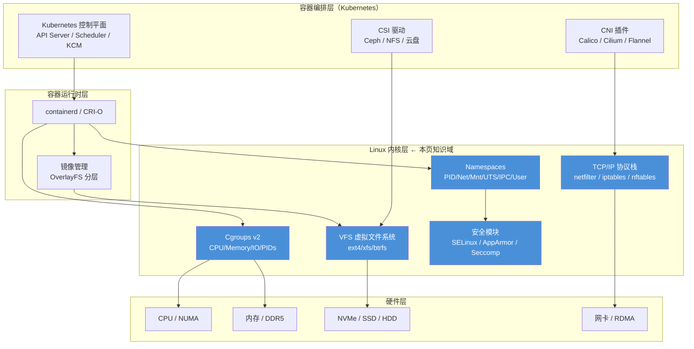

本页是理解 Kubernetes 与云原生技术栈的**底层基础设施知识枢纽**，整合了三大基础领域——Linux 系统原理、计算机网络基础、存储技术基础——的知识精华。这三个领域构成了容器运行时、CNI 插件和 CSI 驱动的直接技术依赖：Linux 内核的 Namespaces 和 Cgroups 提供容器隔离与资源限制能力，TCP/IP 协议栈与 Overlay 网络是 Kubernetes 集群通信的基石，而块/文件/对象存储的分类体系与 IOPS 性能模型则是 PV/PVC 抽象层的物理现实。本文档面向已具备基本 Linux 操作经验的开发者，从"为什么 Kubernetes 需要这些底层机制"的视角出发，系统梳理从内核启动到容器运行的关键技术链路。

## 全景架构：Linux 如何支撑容器与编排系统

理解 Kubernetes 的前提是理解它运行于其上的 Linux 内核能力矩阵。以下架构图展示了从裸金属硬件到容器工作负载的完整技术栈层次，以及本页三个知识域在其中的定位：



上图蓝色高亮部分即为本页覆盖的 Linux 内核核心子系统。这些子系统共同构成了容器技术的**三大支柱**：**隔离**（Namespaces）、**限制**（Cgroups）、**安全**（Seccomp/Capabilities/SELinux），外加**分层存储**（OverlayFS）和**网络通信**（TCP/IP 栈）两大支撑能力。

Sources: [01-linux-system-architecture.md](domain-14-linux/01-linux-system-architecture.md#L36-L80), [08-linux-container-fundamentals.md](domain-14-linux/08-linux-container-fundamentals.md#L33-L52)

---

## 一、Linux 系统架构与内核机制

### 1.1 内核层次结构与子系统

Linux 系统分为**用户空间**和**内核空间**两个隔离的执行域。用户空间的应用程序通过**系统调用（syscall）**接口向内核请求服务，内核则通过调度器、内存管理器、VFS 和网络协议栈四大核心子系统完成实际工作。这种分层设计意味着容器进程虽然共享宿主内核，但通过 Namespaces 在用户空间层面实现了资源视图的隔离。

| 子系统 | 功能 | 与容器/K8s 的关联 |
|:---|:---|:---|
| **进程管理** | CFS 调度器、fork/exec | 容器本质是进程组，受调度器管理 |
| **内存管理** | 虚拟内存、分页、slab 分配 | Cgroups memory 控制器限制容器内存 |
| **文件系统** | VFS 抽象层、ext4/xfs/btrfs | OverlayFS 基于 VFS 实现镜像分层 |
| **网络子系统** | TCP/IP 协议栈、netfilter | CNI 插件依赖 netfilter/iptables/ipvs |
| **设备驱动** | 块设备、字符设备、网络设备 | CSI 驱动通过块设备接口操作存储 |
| **安全模块** | SELinux、AppArmor | Pod Security Standards 的底层实现 |

Sources: [01-linux-system-architecture.md](domain-14-linux/01-linux-system-architecture.md#L40-L68), [01-linux-system-architecture.md](domain-14-linux/01-linux-system-architecture.md#L70-L79)

### 1.2 系统启动过程：从 BIOS 到 systemd

理解 Linux 启动流程对排查 Node NotReady 问题至关重要。Kubernetes 节点的完整启动链路为：**BIOS/UEFI → GRUB2 → Kernel → initramfs → systemd → kubelet → 容器运行时**。其中 GRUB2 负责加载内核和 initramfs（临时根文件系统），内核初始化硬件驱动后切换到真实根文件系统，最终由 systemd 作为 PID 1 拉起所有用户空间服务。

**关键调优点**：在 Kubernetes 生产环境中，`/etc/default/grub` 中的内核启动参数直接影响节点行为。例如 `cgroup_enable=memory` 和 `swapaccount=1` 是 Kubelet 正常运行的前提条件，`processor.max_cstate=1` 可在低延迟场景下禁用 CPU 深度节能。systemd 的 Unit 文件中，`Restart=on-failure` 和 `RestartSec=5` 配置确保了 Kubelet 和容器运行时等关键服务的自愈能力。

Sources: [01-linux-system-architecture.md](domain-14-linux/01-linux-system-architecture.md#L93-L130), [01-linux-system-architecture.md](domain-14-linux/01-linux-system-architecture.md#L148-L200)

### 1.3 内核参数调优：生产环境必备配置

内核参数通过 `sysctl` 工具动态调整，是 Kubernetes 节点优化的核心手段。以下表格整理了生产环境中最关键的三类内核参数：

**网络参数**（直接影响 CNI 和 Service 性能）：

| 参数 | 说明 | 推荐值 | 影响场景 |
|:---|:---|:---|:---|
| `net.ipv4.ip_forward` | IP 转发 | 1 | 容器跨节点通信 |
| `net.bridge.bridge-nf-call-iptables` | 网桥 iptables | 1 | Calico/Flannel 等CNI |
| `net.core.somaxconn` | 监听队列 | 65535 | 高并发 Service |
| `net.ipv4.tcp_tw_reuse` | TIME_WAIT 重用 | 1 | 短连接密集场景 |

**内存与文件系统参数**：

| 参数 | 说明 | 推荐值 | 影响场景 |
|:---|:---|:---|:---|
| `vm.swappiness` | swap 倾向 | 10 | Kubelet 要求关闭 swap |
| `vm.max_map_count` | mmap 限制 | 262144 | Elasticsearch 等应用 |
| `fs.inotify.max_user_watches` | 文件监控数 | 524288 | ConfigMap/Secret 挂载 |

Sources: [01-linux-system-architecture.md](domain-14-linux/01-linux-system-architecture.md#L231-L292), [09-linux-operations-basics.md](domain-14-linux/09-linux-operations-basics.md#L70-L98)

### 1.4 容器相关的内核模块

Kubernetes 节点需要加载以下关键内核模块才能正常工作：

| 模块 | 用途 | 必要性 |
|:---|:---|:---|
| `overlay` | OverlayFS 存储驱动 | 容器镜像分层必需 |
| `br_netfilter` | 网桥 iptables 过滤 | CNI 网络策略必需 |
| `ip_vs` / `ip_vs_rr` | IPVS 负载均衡 | kube-proxy IPVS 模式 |
| `nf_conntrack` | 连接跟踪 | Service 会话保持 |

这些模块通常通过 `/etc/modules-load.d/` 配置文件在启动时自动加载。

Sources: [01-linux-system-architecture.md](domain-14-linux/01-linux-system-architecture.md#L296-L327)

---

## 二、进程管理与资源监控

### 2.1 进程生命周期：理解容器进程的本质

Linux 进程在生命周期中经历 **就绪(R) → 运行(R) → 睡眠(S/D) → 僵尸(Z) → 终止** 五个状态。容器中的进程与普通 Linux 进程共享同一套状态机，但被 Namespaces 隔离后只能看到同一 PID Namespace 下的进程。理解进程状态对诊断容器 CrashLoopBackOff 至关重要：当容器主进程（PID 1）退出时，容器即被标记为失败。

| 状态码 | 名称 | 说明 | 容器场景关联 |
|:---:|:---|:---|:---|
| **R** | Running | 运行中或就绪 | 正常工作负载 |
| **S** | Sleeping | 可中断睡眠 | 等待请求的服务进程 |
| **D** | Disk Sleep | 不可中断 I/O | 存储挂起导致 Pod NotReady |
| **Z** | Zombie | 僵尸进程 | 容器主进程未正确回收子进程 |
| **T** | Stopped | 已停止 | 被信号暂停（如 strace 调试） |

Sources: [02-linux-process-management.md](domain-14-linux/02-linux-process-management.md#L57-L94)

### 2.2 信号与进程控制

容器中 PID 1 进程的信号处理是一个常见的故障源。Linux 信号（Signal）是进程间异步通信的基本机制，容器主进程必须正确注册 SIGTERM 处理器以实现**优雅终止（Graceful Shutdown）**——这正是 Kubernetes `terminationGracePeriodSeconds` 的工作原理。Kubelet 先发送 SIGTERM，等待超时后发送 SIGKILL 强制终止。如果容器镜像使用 shell 脚本作为 entrypoint（`/bin/sh -c`），shell 进程作为 PID 1 **不会将信号转发给子进程**，这是 Pod 终止卡住的常见原因。

Sources: [02-linux-process-management.md](domain-14-linux/02-linux-process-management.md#L1-L16)

### 2.3 性能分析方法论：USE 方法

在生产环境中系统性地排查性能瓶颈，推荐采用 Brendan Gregg 提出的 **USE 方法（Utilization、Saturation、Errors）**：对每个资源检查使用率、饱和度和错误率三个维度。下表汇总了核心分析工具：

| 工具 | CPU | 内存 | I/O | 网络 | 典型用途 |
|:---:|:---:|:---:|:---:|:---:|:---|
| top/htop | ✓ | ✓ | ✓ | - | 实时资源概览 |
| vmstat | ✓ | ✓ | ✓ | - | 系统级统计 |
| iostat | - | - | ✓ | - | 磁盘 IOPS/延迟 |
| perf | ✓ | - | - | - | CPU 火焰图分析 |
| sar | ✓ | ✓ | ✓ | ✓ | 历史性能数据 |
| ss/netstat | - | - | - | ✓ | 连接与套接字状态 |

关键性能指标的警戒阈值：**%us < 70%**（用户态 CPU）、**%sy < 30%**（内核态 CPU）、**%wa < 5%**（I/O 等待）、**load avg < CPU 核数**。当 `%wa` 持续超过 5% 时，通常意味着存储性能成为瓶颈，这在 CSI 卷场景中尤为常见。

Sources: [06-linux-performance-tuning.md](domain-14-linux/06-linux-performance-tuning.md#L30-L52), [06-linux-performance-tuning.md](domain-14-linux/06-linux-performance-tuning.md#L78-L104)

---

## 三、文件系统与存储管理

### 3.1 VFS 虚拟文件系统：一切皆文件

Linux 的 VFS（Virtual File System）是所有文件系统的统一抽象层，它定义了四个核心对象：**superblock**（文件系统元数据）、**inode**（文件元数据）、**dentry**（目录项映射）、**file**（打开文件描述符）。VFS 的设计使得 OverlayFS 这种"堆叠式"文件系统成为可能——它将多个底层文件系统统一呈现为一个联合视图。

| VFS 对象 | 说明 | 作用 |
|:---|:---|:---|
| **superblock** | 文件系统元数据 | 类型、大小、状态 |
| **inode** | 文件元数据 | 权限、大小、数据块位置 |
| **dentry** | 目录项 | 文件名到 inode 的映射缓存 |
| **file** | 打开文件 | 进程与文件描述符的关联 |

Sources: [03-linux-filesystem-deep-dive.md](domain-14-linux/03-linux-filesystem-deep-dive.md#L31-L62)

### 3.2 文件系统选型对比

Kubernetes 节点的根文件系统和工作负载存储选择直接影响集群稳定性：

| 文件系统 | 最大文件 | 最大卷 | 特点 | 推荐场景 |
|:---|:---|:---|:---|:---|
| **ext4** | 16TB | 1EB | 稳定、广泛支持 | 通用场景、OS 盘 |
| **xfs** | 8EB | 8EB | 高性能、大文件 | 生产环境数据盘 |
| **btrfs** | 16EB | 16EB | CoW、快照、校验 | 需要快照的场景 |
| **tmpfs** | - | - | 内存文件系统 | 容器 /tmp、/dev/shm |

特殊文件系统对容器运行时的意义：`/proc`（进程信息）和 `/sys`（设备信息）是容器中 `limits` 和 `requests` 配置生效的接口路径；`/sys/fs/cgroup` 是 Cgroups v2 的挂载点，Kubelet 通过读写该目录控制 Pod 资源限制；`tmpfs` 常用于 Kubernetes 的 emptyDir 卷（`medium: Memory`）。

Sources: [03-linux-filesystem-deep-dive.md](domain-14-linux/03-linux-filesystem-deep-dive.md#L65-L85)

### 3.3 LVM 逻辑卷管理

LVM 在 PV（Physical Volume）、VG（Volume Group）、LV（Logical Volume）三个层次上提供灵活的存储管理。在 Kubernetes 环境中，LVM 常作为本地持久卷的底层技术：

```
┌─────────────────────────────────────────────┐
│  Logical Volume (LV)   ← 文件系统挂载点       │
│     /dev/vg01/lv_data                       │
├─────────────────────────────────────────────┤
│  Volume Group (VG)     ← 存储池              │
│     vg01                                    │
├─────────────────────────────────────────────┤
│  Physical Volume (PV)  ← 物理磁盘/分区        │
│     /dev/sdb1  /dev/sdc1  /dev/sdd1         │
└─────────────────────────────────────────────┘
```

LVM 的在线扩容能力（`lvextend --resizefs`）对 Kubernetes PVC 扩容场景至关重要——用户可以在线扩展 PVC 容量而无需卸载卷。

Sources: [05-linux-storage-management.md](domain-14-linux/05-linux-storage-management.md#L72-L100)

### 3.4 I/O 调度器

I/O 调度器决定了块设备请求的排序和合并策略。在 Kubernetes 生产环境中，调度器选择直接影响数据库类工作负载的延迟表现：

| 调度器 | 特点 | 适用设备 |
|:---|:---|:---|
| **mq-deadline** | 延迟保证、防饥饿 | SATA SSD、HDD |
| **bfq** | 公平带宽分配 | 桌面、交互式 |
| **kyber** | 低延迟 | NVMe SSD |
| **none** | 无调度（直接提交） | NVMe SSD（现代默认） |

对于 NVMe SSD，现代内核默认使用 `none` 调度器（即不排队直接提交），因为 NVMe 设备本身支持硬件级队列管理。查看当前调度器：`cat /sys/block/sdX/queue/scheduler`。

Sources: [05-linux-storage-management.md](domain-14-linux/05-linux-storage-management.md#L1-L28)

---

## 四、Linux 网络配置与协议栈

### 4.1 网络配置体系

Linux 网络配置分为**临时配置**（`ip` 命令，重启失效）和**永久配置**（Netplan/NetworkManager 配置文件）。容器网络依赖于内核的 `ip_forward` 和 `bridge-nf-call-iptables` 参数，这两项是 CNI 插件正常工作的前提条件：

```bash
# 临时配置（立即生效）
ip addr add 192.168.1.100/24 dev eth0
ip link set eth0 up
ip route add default via 192.168.1.1

# 永久配置（Ubuntu Netplan）
# /etc/netplan/01-network.yaml
network:
  version: 2
  ethernets:
    eth0:
      addresses: [192.168.1.100/24]
      routes:
        - to: default
          via: 192.168.1.1
      nameservers:
        addresses: [8.8.8.8, 8.8.4.4]
```

Sources: [04-linux-networking-configuration.md](domain-14-linux/04-linux-networking-configuration.md#L30-L87)

### 4.2 OSI 与 TCP/IP 网络模型

Kubernetes 网络的底层是 TCP/IP 协议栈。理解 OSI 七层与 TCP/IP 四层模型的映射关系，是排查 Service、Ingress 和 NetworkPolicy 问题的基础：

| OSI 层 | 名称 | TCP/IP 对应 | K8s 相关技术 |
|:---:|:---|:---|:---|
| 7 | 应用层 | 应用层 | Ingress、Gateway API、HTTP 路由 |
| 4 | 传输层 | 传输层 | Service（ClusterIP/NodePort）、kube-proxy |
| 3 | 网络层 | 网络层 | Pod IP、CNI 路由、VXLAN 封装 |
| 2 | 数据链路层 | 网络接口层 | veth pair、网桥、MAC 地址 |
| 1 | 物理层 | 网络接口层 | 网卡、光纤、物理交换机 |

**数据封装过程**的直观理解：当一个 Pod 发送 HTTP 请求时，数据从应用层逐层封装——添加 TCP 头（端口号）、IP 头（Pod IP）、以太网帧头（MAC 地址），最终通过物理链路传输。CNI 插件（如 Calico IPIP 模式或 Flannel VXLAN 模式）在网络层额外添加封装头以实现跨节点 Pod 通信。

Sources: [01-network-protocols-stack.md](domain-15-network-fundamentals/01-network-protocols-stack.md#L18-L58), [01-network-protocols-stack.md](domain-15-network-fundamentals/01-network-protocols-stack.md#L100-L118)

### 4.3 TCP 连接管理：握手、挥手与 Kubernetes

TCP 的**三次握手**和**四次挥手**直接影响 Kubernetes 的连接管理行为。`TIME_WAIT` 状态（持续 2MSL，通常 60 秒）在高并发短连接场景下会大量积累，导致端口耗尽——这在 Service 大量转发短连接请求时尤为突出。

**关键内核参数与 K8s 的关联**：

| 参数 | 作用 | K8s 场景 |
|:---|:---|:---|
| `net.ipv4.tcp_fin_timeout` | FIN_WAIT_2 超时 | 缩短可减少连接占用 |
| `net.ipv4.tcp_tw_reuse` | 允许重用 TIME_WAIT | 高并发出站连接 |
| `net.core.somaxconn` | listen() backlog 上限 | Service 高并发入站 |

TCP 拥塞控制算法的选择也值得关注：现代内核默认使用 **BBR**（Bottleneck Bandwidth and RTT）替代传统的 Cubic，在高延迟、有丢包的网络环境（如跨云通信）中可显著提升吞吐量。

Sources: [02-tcp-udp-deep-dive.md](domain-15-network-fundamentals/02-tcp-udp-deep-dive.md#L18-L100)

### 4.4 DNS 解析原理

DNS 是 Kubernetes 服务发现的核心机制。CoreDNS 作为集群内 DNS 服务器，其工作原理遵循标准的**递归查询 + 迭代查询**流程：Pod 发起 DNS 请求 → CoreDNS 检查缓存 → 未命中则从根域开始逐级迭代查询（根 → TLD → 权威服务器）。理解这个过程对排查集群内 DNS 解析失败至关重要。

| DNS 记录类型 | 说明 | K8s Service 对应 |
|:---|:---|:---|
| **A** | IPv4 地址 | ClusterIP |
| **AAAA** | IPv6 地址 | IPv6 ClusterIP |
| **SRV** | 服务记录 | Headless Service + 端口 |
| **CNAME** | 别名 | ExternalName Service |

Kubernetes 内部 DNS 命名规则：`<service-name>.<namespace>.svc.cluster.local`，CoreDNS 通过 Kubernetes 插件监听 API Server 的 Service/Endpoint 变化动态生成 DNS 记录。

Sources: [03-dns-principles-configuration.md](domain-15-network-fundamentals/03-dns-principles-configuration.md#L18-L100)

### 4.5 负载均衡技术：从 LVS 到 Ingress

负载均衡是 Kubernetes Service 的核心实现机制。理解四层（L4）与七层（L7）负载均衡的区别，是选择 Service 类型（ClusterIP/NodePort/LoadBalancer）和 Ingress Controller 的理论基础：

| 类型 | OSI 层 | 特点 | K8s 对应实现 |
|:---|:---:|:---|:---|
| **四层负载均衡** | 传输层 | 基于 IP+端口转发，高性能 | kube-proxy（iptables/IPVS 模式） |
| **七层负载均衡** | 应用层 | 基于 URL/Header 路由，灵活 | Ingress Controller、Gateway API |

kube-proxy 的 **IPVS 模式**相比 iptables 模式具有更优的大规模 Service 性能，因为它使用内核的 IPVS 模块（基于哈希表查找 O(1)）替代 iptables 的线性规则匹配 O(n)。常用的负载均衡算法：轮询（RR）、加权轮询（WRR）、最少连接（LC）、一致性哈希——分别适用于无状态服务、异构后端、长连接、缓存亲和等不同场景。

Sources: [04-load-balancing-technologies.md](domain-15-network-fundamentals/04-load-balancing-technologies.md#L18-L100)

### 4.6 SDN 与网络虚拟化

软件定义网络（SDN）将网络控制平面与数据平面分离，是实现 Kubernetes 网络虚拟化的理论基础。Overlay 网络技术（VXLAN、GRE、GENEVE）在物理网络之上构建虚拟网络，是 Kubernetes 跨节点 Pod 通信的核心实现方式：

| 技术 | 说明 | K8s CNI 应用 |
|:---|:---|:---|
| **VXLAN** | MAC-in-UDP 封装 | Flannel 默认模式 |
| **IPIP** | IP-in-IP 封装 | Calico 默认跨节点模式 |
| **GENEVE** | 通用封装协议 | Cilium 支持 |
| **eBPF** | 内核可编程 | Cilium 绕过 iptables |

Open vSwitch（OVS）和 Linux Bridge 是容器网络的两种基础桥接技术。Kubernetes 的 veth pair（虚拟以太网设备对）将 Pod 网络命名空间与宿主网络命名空间连接起来，一端在 Pod 内（eth0），另一端在宿主机的网桥上。

Sources: [06-sdn-network-virtualization.md](domain-15-network-fundamentals/06-sdn-network-virtualization.md#L18-L100)

### 4.7 网络安全基础

网络安全遵循 **CIA 三要素**（机密性、完整性、可用性）。在 Kubernetes 环境中，网络安全的分层实现如下：

| 层次 | 安全措施 | K8s 实现 |
|:---|:---|:---|
| 应用层 | WAF、认证授权 | Ingress TLS、OAuth2 Proxy |
| 传输层 | TLS/SSL 加密 | Secret 证书、cert-manager |
| 网络层 | 防火墙、IDS/IPS | NetworkPolicy、Cilium NetworkPolicy |

Linux `iptables`/`nftables` 是 Kubernetes NetworkPolicy 的底层实现机制。Calico 和 Cilium 等 CNI 插件通过编程 iptables 规则或 eBPF 程序来实现 Pod 间的网络隔离策略。

Sources: [05-network-security-fundamentals.md](domain-15-network-fundamentals/05-network-security-fundamentals.md#L18-L100)

---

## 五、存储技术基础

### 5.1 存储类型三角：块、文件与对象

存储技术按照访问方式分为三种基本类型，理解它们的本质差异是选择 Kubernetes StorageClass 和 CSI 驱动的基础：

| 特性 | 块存储 | 文件存储 | 对象存储 |
|:---|:---|:---|:---|
| **访问方式** | 块设备接口（SCSI/NVMe） | 文件路径（NFS/SMB） | HTTP API（S3/Swift） |
| **性能** | 最高（IOPS/延迟） | 中等 | 较低（高吞吐） |
| **可扩展性** | 有限 | 中等 | 海量 |
| **共享访问** | 通常单节点 | 多节点 | 多节点 |
| **典型协议** | iSCSI、FC、NVMe-oF | NFS、SMB | S3、Swift |
| **K8s 场景** | 数据库 PV | 共享 PVC（RWX） | 备份、静态资源 |

**架构演进**：从 DAS（直连存储）→ SAN（存储区域网络）→ NAS（网络附加存储）→ 对象存储，体现了从本地化到网络化、从高性能到海量扩展的演进方向。Kubernetes 的 PV/PVC 机制本质上是对这三种存储类型的统一抽象。

Sources: [01-storage-technologies-overview.md](domain-16-storage-fundamentals/01-storage-technologies-overview.md#L18-L53), [02-block-file-object-storage.md](domain-16-storage-fundamentals/02-block-file-object-storage.md#L17-L62)

### 5.2 RAID 级别与企业级选型

RAID（Redundant Array of Independent Disks）是数据冗余和性能提升的基础技术。在 Kubernetes 生产环境中，节点本地存储和分布式存储后端通常采用不同的 RAID 策略：

| RAID 级别 | 最少盘 | 容量利用 | 容错 | 读性能 | 写性能 | K8s 适用场景 |
|:---:|:---:|:---:|:---:|:---:|:---:|:---|
| RAID 0 | 2 | 100% | 无 | 高 | 高 | 测试环境、临时数据 |
| RAID 1 | 2 | 50% | 1 盘 | 高 | 中 | OS 盘、etcd 数据 |
| RAID 5 | 3 | (n-1)/n | 1 盘 | 高 | 中 | 文件服务器 |
| RAID 6 | 4 | (n-2)/n | 2 盘 | 高 | 低 | 备份存储 |
| RAID 10 | 4 | 50% | 每组 1 盘 | 最高 | 高 | 数据库 PV、Ceph OSD |

**企业级 RAID 选型指南**：数据库主库推荐 RAID 10（兼顾性能与冗余），虚拟化存储推荐 RAID 10（高 IOPS + 高可靠性），备份存储推荐 RAID 6（最大容量利用）。etcd 作为 Kubernetes 的核心存储组件，其数据目录通常部署在 SSD 的 RAID 1 阵列上以保证数据安全和低延迟。

Sources: [03-raid-storage-redundancy.md](domain-16-storage-fundamentals/03-raid-storage-redundancy.md#L17-L100)

### 5.3 分布式存储系统：Ceph 与 MinIO

Kubernetes 持久化存储的终极方案往往指向分布式存储。**Ceph** 是最成熟的开源统一分布式存储方案，提供三种存储接口：

```
┌─────────────────────────────────────────────┐
│           客户端访问层                        │
│   RBD (块)     CephFS (文件)     RGW (对象)   │
├─────────────────────────────────────────────┤
│           RADOS 层（分布式对象存储）           │
├─────────────────────────────────────────────┤
│  OSD (存储) │ MON (监控) │ MGR (管理) │ MDS   │
└─────────────────────────────────────────────┘
```

| 组件 | 功能 | K8s CSI 对应 |
|:---|:---|:---|
| **OSD** | 存储数据、复制、恢复 | Ceph CSI RBD/Layer 1 |
| **MON** | 集群状态、认证 | 集群健康监控 |
| **MGR** | 监控、管理界面 | Prometheus 指标 |
| **MDS** | CephFS 元数据 | Ceph CSI CephFS |

数据保护策略对比：**多副本**（3 副本，简单快速恢复，空间效率 33%）vs **纠删码**（如 8+3，空间效率 73%，计算开销大）。在 Kubernetes 环境中，Rook 项目提供了 Ceph 的 Kubernetes 原生部署和管理能力。

Sources: [04-distributed-storage-systems.md](domain-16-storage-fundamentals/04-distributed-storage-systems.md#L17-L100)

### 5.4 存储性能指标：IOPS、吞吐量与延迟

存储性能是影响 Kubernetes 数据库类工作负载的关键因素。三个核心性能指标之间的关系：**吞吐量 = IOPS × 块大小**。例如 100K IOPS × 4KB = 400 MB/s。

**企业级存储介质性能基准**：

| 存储类型 | 随机 IOPS | 顺序吞吐 | 延迟 | 典型 K8s 场景 |
|:---|:---:|:---:|:---:|:---|
| NVMe SSD（企业级） | 500K-1M | 6-8 GB/s | <50μs | 数据库、etcd |
| SATA SSD（企业级） | 80K-150K | 500-600 MB/s | <200μs | 通用 PV |
| SAS 15K HDD | 150-200 | 150-200 MB/s | 3-5ms | 归档 |
| SATA 7.2K HDD | 70-120 | 100-150 MB/s | 8-15ms | 冷数据 |

**应用场景与存储性能需求**：OLTP 数据库需要 10K-100K IOPS 和 <5ms 延迟（推荐 NVMe SSD），Web 应用需要 1K-5K IOPS（SATA SSD 即可），备份归档以吞吐优先（SATA HDD）。使用 `fio` 工具进行基准测试是验证 StorageClass 性能等级（如 AWS gp3 vs io2）的标准方法。

Sources: [06-storage-performance-iops.md](domain-16-storage-fundamentals/06-storage-performance-iops.md#L17-L78)

---

## 六、容器运行时基础：Namespaces、Cgroups 与 OverlayFS

### 6.1 Namespaces：进程隔离的六大维度

Linux Namespaces 是容器隔离的核心内核机制。每个 Namespace 类型隔离一类系统资源，容器进程通过 `clone()` 或 `unshare()` 系统调用创建新的 Namespace 实例：

| 类型 | Flag | 隔离内容 | K8s 应用场景 |
|:---|:---|:---|:---|
| **PID** | CLONE_NEWPID | 进程 ID | 容器内 PID 1（主进程） |
| **Network** | CLONE_NEWNET | 网络栈 | Pod 网络隔离、CNI 配置 |
| **Mount** | CLONE_NEWNS | 挂载点 | 容器文件系统视图、Volume 挂载 |
| **UTS** | CLONE_NEWUTS | 主机名/域名 | Pod hostname 设置 |
| **IPC** | CLONE_NEWIPC | 进程间通信 | 共享内存隔离 |
| **User** | CLONE_NEWUSER | 用户/组 ID | 容器 root ≠ 宿主 root |
| **Cgroup** | CLONE_NEWCGROUP | Cgroup 根视图 | Cgroup 命名空间隔离 |
| **Time** | CLONE_NEWTIME | 系统时间 | 5.6+ 内核新增 |

Kubernetes Pod 模型的关键设计：同一 Pod 内的所有容器**共享 Network、UTS 和 IPC Namespace**（所以它们可以通过 localhost 通信），但各自拥有独立的 PID、Mount 和 User Namespace。`nsenter` 命令是排查容器网络问题的关键工具——它允许你"进入"目标进程的 Namespace 执行诊断命令。

Sources: [08-linux-container-fundamentals.md](domain-14-linux/08-linux-container-fundamentals.md#L55-L111)

### 6.2 Cgroups v2：资源限制的统一管理

Cgroups（Control Groups）是 Linux 内核提供的资源限制机制。**Cgroups v2**（Kubernetes 1.25+ 默认）相比 v1 的核心改进是采用**单一层级树**结构，所有控制器（CPU、Memory、I/O）统一管理，避免了 v1 中多层级不一致的问题：

| 控制器 | 功能 | 主要参数 | K8s 对应 |
|:---|:---|:---|:---|
| **cpu** | CPU 时间分配 | cpu.max, cpu.weight | resources.limits.cpu |
| **memory** | 内存限制 | memory.max, memory.high | resources.limits.memory |
| **io** | I/O 限制 | io.max, io.weight | 磁盘 I/O 限制 |
| **pids** | 进程数限制 | pids.max | Pod 的最大进程数 |

Cgroups 的实际配置路径：Kubelet 在 `/sys/fs/cgroup/kubepods/` 下为每个 Pod 和容器创建 cgroup 目录，通过写入 `cpu.max` 和 `memory.max` 文件实现资源限制。当容器内存使用超过 `memory.max` 时，内核触发 OOM Killer 终止进程——这正是 Kubernetes Pod OOMKilled 事件的底层原因。

Sources: [08-linux-container-fundamentals.md](domain-14-linux/08-linux-container-fundamentals.md#L115-L171)

### 6.3 OverlayFS：镜像分层的技术基础

OverlayFS 是容器镜像**分层存储**的核心实现。它将多个目录（lowerdir 只读层 + upperdir 可写层）叠加为一个统一的 merged 视图。容器镜像的每一层对应一个 lowerdir 目录，容器运行时的修改写入 upperdir：

```
┌─────────────────────────────────────────┐
│         merged（联合视图）                │
│         用户/容器进程看到的文件系统         │
├─────────────────────────────────────────┤
│  upperdir（可写层）                       │
│  容器运行时的所有修改（新增/修改/删除）     │
├─────────────────────────────────────────┤
│  lowerdir（只读层）                       │
│  镜像层叠加（基础镜像 + 各层修改）         │
└─────────────────────────────────────────┘
```

OverlayFS 的 **CoW（Copy-on-Write）** 机制：当容器修改 lowerdir 中的文件时，内核先将该文件复制到 upperdir 再修改，确保只读层不被污染。这解释了为什么容器镜像可以被多个容器共享——每个容器有自己的 upperdir，但共享相同的 lowerdir 镜像层。

Sources: [08-linux-container-fundamentals.md](domain-14-linux/08-linux-container-fundamentals.md#L174-L219)

### 6.4 容器安全：Capabilities、Seccomp 与安全模块

容器安全的内核层面依赖三大机制：

| 机制 | 功能 | K8s 配置 |
|:---|:---|:---|
| **Capabilities** | 细粒度权限控制 | securityContext.capabilities |
| **Seccomp** | 系统调用过滤 | securityContext.seccompProfile |
| **SELinux/AppArmor** | 强制访问控制（MAC） | securityContext.seLinuxOptions |

Linux Capabilities 将传统的 root 权限拆分为数十个独立能力（如 `CAP_NET_BIND_SERVICE` 允许绑定低端口、`CAP_NET_ADMIN` 允许网络管理）。Kubernetes Pod Security Standards 的 Restricted 级别要求丢弃所有 Capabilities，只保留必需的少数几个。

Sources: [08-linux-container-fundamentals.md](domain-14-linux/08-linux-container-fundamentals.md#L223-L250)

---

## 七、安全加固与运维实践

### 7.1 Linux 安全基线

Kubernetes 节点的安全加固从 Linux 系统层面开始。核心措施包括：**禁用 root SSH 登录**、**强制公钥认证**、**配置密码复杂度策略**（最小 12 位，含大小写/数字/特殊字符）、**限制 sudo 权限范围**。SELinux（RHEL/CentOS）和 AppArmor（Ubuntu）提供强制访问控制，Kubernetes 通过 Pod Security Standards 将这些能力暴露给集群管理员。

```bash
# SSH 安全加固关键配置
PermitRootLogin no                    # 禁用 root 登录
PasswordAuthentication no             # 禁用密码认证
PubkeyAuthentication yes              # 启用公钥认证
AllowUsers admin deploy               # 限制允许登录的用户
MaxAuthTries 3                        # 最大认证尝试次数
ClientAliveInterval 300               # 空闲超时检测
```

Sources: [07-linux-security-hardening.md](domain-14-linux/07-linux-security-hardening.md#L30-L120)

### 7.2 存储运维管理体系

企业级存储运维遵循**四层框架**：战略规划层（容量规划、技术路线）→ 架构设计层（方案设计、标准制定）→ 运营管理层（SLA 管理、变更管控）→ 执行操作层（日常巡检、故障处理）。在 Kubernetes 环境中，这对应于 StorageClass 设计 → CSI 驱动配置 → PVC 管理 → PV 故障排查的完整链路。

**每日存储巡检关键检查项**：
1. **磁盘健康状态**：`smartctl -H /dev/sdX` 检查 SMART 状态
2. **RAID 阵列状态**：`cat /proc/mdstat` 检查是否有降级
3. **文件系统使用率**：`df -h` 检查是否超过 80% 阈值
4. **I/O 性能状态**：`iostat -xz 1 5` 检查 await 和 %util
5. **错误日志**：`dmesg | grep -i error` 检查磁盘/控制器错误

Sources: [05-storage-management-operations.md](domain-16-storage-fundamentals/05-storage-management-operations.md#L22-L100)

---

## 八、知识域全景索引

本页整合了三大基础知识域共 21 篇文档的核心内容。以下表格提供完整的知识导航：

### Linux 系统知识域（Domain-14）

| 编号 | 文档 | 核心内容 | 与 K8s 的关联 |
|:---:|:---|:---|:---|
| 01 | Linux 系统架构 | 内核架构、启动过程、systemd、内核调优 | 节点启动链路、内核参数 |
| 02 | 进程管理 | 进程生命周期、信号控制、优先级 | 容器进程管理、优雅终止 |
| 03 | 文件系统深度解析 | VFS、文件系统选型、inode | OverlayFS、Volume 挂载 |
| 04 | 网络配置 | ip 命令、路由、iptables、性能调优 | CNI 网络配置、NetworkPolicy |
| 05 | 存储管理 | LVM、RAID、I/O 调度器 | 本地 PV、存储性能 |
| 06 | 性能调优 | USE 方法、CPU/内存/I/O/网络分析 | 节点性能瓶颈诊断 |
| 07 | 安全加固 | 用户管理、SSH、SELinux、审计 | 节点安全基线 |
| 08 | 容器技术基础 | Namespaces、Cgroups、OverlayFS | 容器运行时底层机制 |
| 09 | 运维基础 | 监控、故障排查、备份恢复 | 节点日常运维 |

### 网络基础知识域（Domain-15）

| 编号 | 文档 | 核心内容 | 与 K8s 的关联 |
|:---:|:---|:---|:---|
| 01 | 网络协议栈 | OSI/TCP-IP 模型、数据封装 | CNI 网络模型基础 |
| 02 | TCP/UDP 详解 | 三次握手、四次挥手、拥塞控制 | Service 连接管理 |
| 03 | DNS 原理配置 | 解析流程、记录类型、性能优化 | CoreDNS 服务发现 |
| 04 | 负载均衡技术 | L4/L7 负载均衡、LVS、算法 | kube-proxy、Ingress |
| 05 | 网络安全基础 | 防火墙、TLS/SSL、VPN | NetworkPolicy、证书管理 |
| 06 | SDN 网络虚拟化 | SDN 架构、VXLAN、容器网络 | CNI Overlay 网络实现 |

### 存储基础知识域（Domain-16）

| 编号 | 文档 | 核心内容 | 与 K8s 的关联 |
|:---:|:---|:---|:---|
| 01 | 存储技术概览 | 块/文件/对象存储、架构演进 | StorageClass 选型 |
| 02 | 块文件对象存储 | 三种类型深度对比、iSCSI | PV 后端存储技术 |
| 03 | RAID 存储冗余 | RAID 级别、配置、监控 | 节点本地存储冗余 |
| 04 | 分布式存储系统 | Ceph、MinIO、GlusterFS | CSI 分布式存储驱动 |
| 05 | 存储管理运维 | 巡检、监控、容量规划、备份 | PV 运维管理 |
| 06 | 存储性能 IOPS | 性能指标、fio 测试、优化 | StorageClass 性能等级 |

Sources: [domain-14-linux/README.md](domain-14-linux/README.md#L19-L54), [domain-15-network-fundamentals/README.md](domain-15-network-fundamentals/README.md#L20-L29), [domain-16-storage-fundamentals/README.md](domain-16-storage-fundamentals/README.md#L20-L28)

---

## 阅读路径与进阶方向

掌握本页的基础知识后，建议按以下路径向 Kubernetes 层面进阶：

1. **容器技术实战**：本页的 Namespaces/Cgroups/OverlayFS 理论 → [Docker 容器技术：架构、网络、存储与排障](23-docker-rong-qi-ji-zhu-jia-gou-wang-luo-cun-chu-yu-pai-zhang) 中 Docker 对这些内核特性的封装与使用
2. **Kubernetes 网络深入**：本页的 TCP/IP/DNS/负载均衡/SDN 基础 → [网络体系：CNI、Service、Ingress、Gateway API 与多集群网络](9-wang-luo-ti-xi-cni-service-ingress-gateway-api-yu-duo-ji-qun-wang-luo) 中 K8s 网络的具体实现
3. **Kubernetes 存储深入**：本页的块/文件/对象/RAID/IOPS 基础 → [存储体系：PV/PVC、StorageClass、CSI 驱动与灾备恢复](10-cun-chu-ti-xi-pv-pvc-storageclass-csi-qu-dong-yu-zai-bei-hui-fu) 中 K8s 存储抽象层的设计
4. **性能调优实战**：本页的 USE 方法与内核参数 → [硬件知识体系：CPU、内存、存储与故障排查](25-ying-jian-zhi-shi-ti-xi-cpu-nei-cun-cun-chu-yu-gu-zhang-pai-cha) 中硬件层面的性能优化

本页知识域与上下页面的依赖关系可以概括为：**底层硬件**（Page 25）→ **Linux 内核/网络/存储**（本页）→ **容器运行时**（Page 23）→ **Kubernetes 核心**（Pages 5-12）。这种自底向上的技术栈结构，要求从内核机制入手逐层构建理解，才能真正掌握云原生基础设施的运作原理。