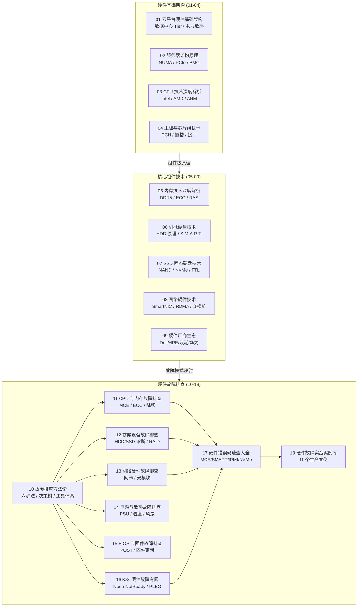

硬件是云原生基础设施的物理基石——无论 Kubernetes 集群编排多么精妙，一次 CPU MCE 错误、一片内存 ECC 故障或一块 NVMe SSD 的静默失效，都能让整个节点从 Ready 跌入 NotReady。本页是 **domain-31-hardware** 知识域的导览总纲，覆盖从数据中心架构到组件技术原理、再到生产级故障排查的完整知识链路，帮助中阶开发者在"看到 K8s 告警"与"定位到物理硬件根因"之间建立清晰的技术通路。

Sources: [README.md](domain-17-system-foundation/README.md#L1-L115)

## 知识域全景架构

**domain-31-hardware** 包含 18 篇专题文档，按照认知层次划分为三个递进板块：**硬件基础架构**（01–04）建立对数据中心和服务器内部拓扑的宏观理解；**核心组件技术**（05–09）深入 CPU、内存、存储介质、网络硬件和厂商生态的技术细节；**硬件故障排查**（10–18）则提供从方法论到实战案例的完整诊断闭环。三板块的关系可通过以下架构图直观呈现：



Sources: [README.md](domain-17-system-foundation/README.md#L9-L40)

## 硬件基础架构：从数据中心到服务器内部

### 数据中心层级体系

云平台硬件的顶层设计从数据中心 Tier 等级开始。Uptime Institute 定义的四级标准直接影响可用性目标：Tier III（99.982%，年停机 1.6 小时）是大型企业关键业务的最低要求，Tier IV（99.995%，年停机 0.8 小时）则服务于金融、医疗等零容忍场景。物理布局上采用冷/热通道隔离设计，电力系统从市电双路输入经 UPS 冗余到 PDU 列头柜分配，形成完整的供电保障链路。

| Tier 等级 | 可用性 | 年停机时间 | 冗余级别 | 典型应用场景 |
|-----------|--------|-----------|---------|-------------|
| Tier I | 99.671% | 28.8 小时 | 无冗余 | 小型企业、开发测试 |
| Tier II | 99.749% | 22.0 小时 | 部分冗余 | 中型企业、非关键业务 |
| Tier III | 99.982% | 1.6 小时 | N+1 冗余 | 大型企业、关键业务 |
| Tier IV | 99.995% | 0.8 小时 | 2N+1 冗余 | 金融、医疗、政府核心 |

Sources: [01-cloud-hardware-architecture.md](domain-17-system-foundation/01-cloud-hardware-architecture.md#L9-L35)

### 服务器内部架构与 NUMA 拓扑

现代双路服务器的核心拓扑是 **NUMA（Non-Uniform Memory Access）** 架构——每个 CPU Socket 拥有本地内存控制器和直连的 DIMM 通道，跨 Socket 访问则通过 UPI（Ultra Path Interconnect）总线互联，延迟显著高于本地访问。理解 NUMA 对于数据库、AI 训练等内存密集型工作负载的性能调优至关重要。服务器内部的数据流路径为：CPU → 内存控制器（IMC）→ DIMM 通道 → 主存储；扩展设备则通过 PCIe 总线连接至 CPU 或 PCH 芯片组，包括 NIC、GPU、NVMe SSD、HBA 等各类加速器与存储控制器。

服务器按物理形态分为**机架式**（1U/2U/4U，平衡密度与扩展性）、**刀片式**（极高密度、共享电源散热）和**塔式**（小规模独立部署）。按应用类型则分为通用计算、HPC/AI 训练（多 GPU）、存储服务器（大容量硬盘位）等。

Sources: [02-server-architecture-principles.md](domain-17-system-foundation/02-server-architecture-principles.md#L1-L73), [01-cloud-hardware-architecture.md](domain-17-system-foundation/01-cloud-hardware-architecture.md#L76-L175)

## CPU 技术原理：三大架构阵营与微架构深度

### 服务器 CPU 三大阵营对比

当前服务器 CPU 市场由三大架构阵营主导，各自的架构哲学决定了不同的应用场景适配性：

| 维度 | Intel Xeon Scalable | AMD EPYC | ARM (Graviton/Ampere/鲲鹏) |
|------|-------------------|----------|--------------------------|
| 最新代际 | Sapphire Rapids (4th Gen) | Genoa (9004) | Graviton3 / AmpereOne |
| 制程工艺 | Intel 7 (10nm) | TSMC 5nm | 5nm |
| 最大核心数 | 60 核 | 96 核 | 192 核 (AmpereOne) |
| 内存通道 | 8 通道 DDR5 | 12 通道 DDR5 | 8 通道 DDR4/DDR5 |
| PCIe 通道 | 80 条 PCIe 5.0 | 128 条 PCIe 5.0 | 128 条 PCIe 4.0 |
| 特色加速器 | AMX/QAT/DLB/DSA | 高核心密度、Chiplet | 极高能效比 |
| 典型场景 | 通用企业、虚拟化、AI 推理 | 高密度计算、云计算 | 云原生、Scale-out |

AMD EPYC 的 **Chiplet 设计** 是其核心架构创新：将计算单元（CCD，每 CCD 8 个 Zen 4 核心）与 I/O 单元（IOD）分离制造，通过 Infinity Fabric 高速互联，最多 12 个 CCD 提供 96 核。Intel 则走 **Monolithic + 加速器** 路线，在单芯片内集成 AMX（AI 矩阵加速）、QAT（加密压缩）等专用加速引擎。ARM 阵营以极致能效比和核心密度取胜，AWS Graviton3 比 Graviton2 性能提升 25% 的同时能效提升 60%。

Sources: [03-cpu-technology-deep-dive.md](domain-17-system-foundation/03-cpu-technology-deep-dive.md#L1-L138)

### CPU 微架构与缓存层次

无论哪个厂商，现代 CPU 微架构都遵循**前端（取指/解码）→ 执行引擎（乱序调度/寄存器重命名）→ 后端（加载/存储/重排序/提交）**的三段式流水线。缓存层次呈金字塔结构：L1 I-Cache（32KB/核心，4 周期延迟）→ L1 D-Cache（48KB/核心）→ L2（1.25MB/核心，12 周期）→ L3（30–60MB 共享，40–50 周期）→ 主存 DRAM（80–120ns）。多核间通过 **MESI/MESIF 缓存一致性协议**维护数据一致性，假共享（False Sharing）是常见的性能陷阱。

Sources: [02-server-architecture-principles.md](domain-17-system-foundation/02-server-architecture-principles.md#L76-L198), [03-cpu-technology-deep-dive.md](domain-17-system-foundation/03-cpu-technology-deep-dive.md#L140-L200)

## 内存技术：从 DDR 标准到 ECC 保护

### DDR5 架构突破

DDR5 相比 DDR4 实现了四项关键架构突破：**双通道架构**（每 DIMM 两个独立 32-bit 通道取代 DDR4 单 64-bit 通道）、**片上 ECC**（On-Die ECC 在 DRAM 芯片内部纠正单比特错误）、**PMIC 集成**（电源管理 IC 从主板迁移至 DIMM，支持更精确的电压调节和更高频率）、以及 **Bank/BL 翻倍**（32 Bank / BL16 提升并发性）。DDR5-4800 的峰值带宽达 67.2 GB/s，较 DDR4-3200 的 25.6 GB/s 提升 162%。

| DDR 标准 | 频率范围 | 电压 | 单条最大容量 | 带宽峰值 |
|----------|---------|------|-------------|---------|
| DDR4 | 1600–3200 MT/s | 1.2V | 128GB | 25.6 GB/s |
| DDR5 | 4800–8400 MT/s | 1.1V | 256GB | 67.2 GB/s |

### 服务器内存模块与 ECC 体系

服务器内存按缓冲方式分为 **UDIMM**（无缓冲，入门级）、**RDIMM**（寄存器缓冲地址/命令，主流服务器，最大 128GB/条）、**LRDIMM**（数据缓冲，高密度，最大 256GB/条）三类。**ECC（Error Correcting Code）** 是服务器内存的标配，SEC-DED（单错纠正双错检测）能纠正 1-bit 错误并检测 2-bit 错误；更高级的 Chipkill/ADDDC 技术可容忍整个 DRAM 芯片失效。DDR5 新增的 On-Die ECC 与系统级 ECC 形成双层保护。

Sources: [05-memory-technology-deep-dive.md](domain-17-system-foundation/05-memory-technology-deep-dive.md#L1-L200)

## 存储技术：从 HDD 到 NVMe SSD 的介质光谱

### HDD 与 SSD 介质特性对比

存储介质的选择是性能、成本和耐久性的三角权衡。HDD 凭借磁记录技术提供极致的单位成本容量，但受限于机械寻道延迟（毫秒级）；SSD 基于 NAND 闪存实现微秒级延迟和数十万 IOPS，但面临写入寿命限制。两者在企业级场景中并非替代关系，而是互补：热数据走 NVMe SSD，温/冷数据走 HDD。

| 维度 | 企业级 HDD | SATA/SAS SSD | NVMe SSD (PCIe 4.0) |
|------|-----------|-------------|---------------------|
| 随机读 IOPS | ~200 | ~50K–100K | ~500K–1M+ |
| 顺序读带宽 | ~250 MB/s | ~550 MB/s | ~7 GB/s |
| 延迟 | 5–10 ms | 50–100 μs | 10–30 μs |
| 容量 | 20TB+ | 8TB | 15TB+ |
| 成本/GB | 极低 | 中等 | 较高 |

### NAND 闪存层次与 NVMe 协议

NAND 闪存按每单元存储位数分为 SLC（1-bit，100K P/E）、MLC（2-bit，10K）、TLC（3-bit，3K）、QLC（4-bit，1K），密度递增但耐久性递减。3D NAND 通过垂直堆叠（当前 232 层，未来 300+ 层）在保持耐久性的同时提升密度。NVMe 协议是闪存存储的里程碑——65535 个队列 × 65535 条命令的并行度（对比 AHCI 仅 1 队列 × 32 命令）、精简的 13 条命令集、MSI-X 每队列独立中断，将存储子系统从 SATA 的 6Gbps 串行瓶颈彻底解放。SSD 控制器内部的 FTL（Flash Translation Layer）负责逻辑到物理地址映射、磨损均衡、垃圾回收和 ECC 纠错。

Sources: [06-storage-hdd-technology.md](domain-17-system-foundation/06-storage-hdd-technology.md#L1-L100), [07-storage-ssd-technology.md](domain-17-system-foundation/07-storage-ssd-technology.md#L1-L200)

## 网络硬件：从 25GbE 到 DPU 的技术演进

服务器网络接口已从 1GbE 时代的"基础收发"演进为 SmartNIC/DPU 时代的"可编程卸载"——NVIDIA BlueField-3 DPU 集成 ARM 核心和 400G 带宽，能卸载 TCP/IP、加密、OVS、NVMe-oF 等全部网络/存储/安全处理，将主机 CPU 完全释放给业务负载。**RDMA（Remote Direct Memory Access）** 是高性能网络的核心技术，通过零拷贝和内核旁路实现亚微秒延迟，主流实现包括 InfiniBand（专用网络，<1μs）、RoCE v2（以太网封装 UDP/IP，可路由）和 iWARP（TCP/IP 封装，兼容性好）。在 AI 训练、分布式存储（Ceph/Bluestore）、数据库（Oracle RAC）等场景中，RDMA 已成为标配。数据中心交换机采用 **Spine-Leaf** 架构取代传统三层树，实现任意两点等距、无阻塞、水平扩展。

Sources: [08-network-hardware-technology.md](domain-17-system-foundation/08-network-hardware-technology.md#L1-L200)

## 硬件故障排查：从方法论到 K8s 场景映射

### 六步诊断法与故障分类

硬件故障排查遵循**信息收集 → 现象分析 → 假设验证 → 故障定位 → 故障修复 → 复盘总结**的六步闭环。故障按影响程度分为 Critical（系统无法启动/完全宕机）、Major（性能严重下降/部分功能丧失）、Minor（冗余组件失效/可降级运行）；按表现分为硬性故障（完全失效、可复现）、软性故障（间歇性、难复现）和降级故障（功能可用但性能下降）。诊断决策树从"能否上电 → 能否 POST → 能否启动 OS → 系统是否稳定"逐层缩小故障范围。

Sources: [10-hardware-troubleshooting-methodology.md](domain-17-system-foundation/10-hardware-troubleshooting-methodology.md#L1-L200)

### 关键诊断命令速查

以下命令是硬件故障排查的日常工具集，覆盖 CPU、内存、存储、网络、电源散热五大维度：

```bash
# CPU 诊断
mcelog --client                    # MCE 错误统计
turbostat                          # CPU 频率与功耗实时监控
sensors                            # 温度传感器读数

# 内存诊断
edac-util -s                       # ECC 错误统计
dmidecode -t memory                # 内存模组详细信息

# 存储诊断
smartctl -a /dev/sda              # HDD S.M.A.R.T. 全属性
nvme smart-log /dev/nvme0         # NVMe 健康日志
storcli64 /c0 show                # RAID 控制器状态

# 网络诊断
ethtool eth0                      # 链路速率/双工/状态
ethtool -S eth0                   # 收发包错误统计

# 电源散热
ipmitool sensor                   # 全部传感器（温度/电压/风扇/功耗）
ipmitool sel elist                # 系统事件日志
```

Sources: [README.md](domain-17-system-foundation/README.md#L78-L102)

### 硬件故障 → Kubernetes 症状映射

这是连接硬件层与 K8s 层的关键桥梁。硬件故障在 Kubernetes 中的表现往往"伪装"成软件问题，需要运维人员具备跨层诊断能力：

| 硬件故障类型 | Kubernetes 表现 | 系统日志特征 |
|-------------|----------------|-------------|
| CPU MCE 错误 | Node NotReady、kubelet 无响应 | `kernel: mce: CPU x` |
| 内存 ECC UCE | Node 突然宕机、Pod CrashLoopBackOff | `EDAC MC: UE`、`kernel panic` |
| 内存 ECC CE（频繁） | Pod 随机 OOMKilled、性能波动 | `EDAC MC: CE`、`mcelog: corrected` |
| 磁盘故障 | PVC 挂载失败、Pod ContainerCreating 卡住 | `sd X: I/O error`、`EXT4-fs error` |
| NVMe 故障 | 高延迟、IOPS 下降、containerd 超时 | `nvme: I/O error`、`nvme: controller fatal` |
| 网卡故障 | Node NetworkUnavailable、Service 不可达 | `netdev_watchdog: TIMEOUT` |
| 电源故障 | Node 突然消失、etcd 集群选举 | 无日志（直接断电） |
| 散热故障 | CPU throttling、调度延迟增加 | `thermal_zone: critical` |

Sources: [16-kubernetes-hardware-troubleshooting.md](domain-17-system-foundation/16-kubernetes-hardware-troubleshooting.md#L1-L91)

### CPU 与内存故障排查要点

**CPU 故障** 的核心诊断链路：温度检查（`sensors` / `ipmitool sensor`）→ MCE 分析（`mcelog --client` / `dmesg | grep mce`）→ 频率状态检查（`turbostat` / `cat /proc/cpuinfo`）。MCE Bank 编号直接指示故障来源——Bank 0/1 为 L1 数据/指令缓存、Bank 2 为 L2 缓存、Bank 4 为内存控制器、Bank 8 为 UPI 链路。**降频排查**是最常见的 CPU 性能问题，需区分热节流（温度 >85°C）、功率限制（达到 TDP 上限）、电源管理策略（BIOS 功耗配置）三种原因。

**内存故障** 通过 `edac-util` 和 `dmidecode -t memory` 定位到具体 DIMM 槽位。ECC 可纠正错误（CE）频繁出现是 DIMM 老化预警，不可纠正错误（UCE）则通常导致 kernel panic。内存诊断脚本可自动化 CE/UCE 计数、定位故障 DIMM、关联 NUMA 节点。

Sources: [11-cpu-memory-troubleshooting.md](domain-17-system-foundation/11-cpu-memory-troubleshooting.md#L1-L200)

### 存储设备故障排查要点

**HDD 故障** 的第一道防线是 S.M.A.R.T. 监控。关键属性包括：`Reallocated_Sector_Ct`（重映射扇区数，>100 为高风险）、`Current_Pending_Sector`（等待重映射扇区，>0 即需关注）、`Offline_Uncorrectable`（离线不可纠正扇区）、`Power_On_Hours`（通电时长）。风险评级从 LOW（正常监控）→ MEDIUM（计划更换）→ HIGH（立即备份并更换）。

**SSD/NVMe 故障** 侧重于写入寿命（`Percentage Used` / `TBW`）、备用空间（`Available_Spare`）和温度。NVMe 设备通过 `nvme smart-log` 获取健康状态，关注 `critical_warning` 位、`media_and_data_integrity_errors`、`available_spare_threshold` 等字段。RAID 控制器故障则通过 `storcli64` 检查阵列状态、电池/电容健康度和重建进度。

Sources: [12-storage-troubleshooting.md](domain-17-system-foundation/12-storage-troubleshooting.md#L1-L200)

### PLEG 故障与硬件关联

**PLEG（Pod Lifecycle Event Generator）** 是 kubelet 的核心组件，其 "not healthy" 状态与硬件强相关——PLEG 依赖容器运行时（containerd）的及时响应，而磁盘 I/O 延迟（`await > 50ms`）、内存压力（使用率 > 90% + swap 活动）、CPU throttling 或 ECC 错误累积都会导致 PLEG 超时。诊断脚本需同时检查 `journalctl -u kubelet` 中的 PLEG 日志、`iostat -x` 磁盘延迟、`vmstat` 内存压力和 CPU 热节流计数器。

Sources: [16-kubernetes-hardware-troubleshooting.md](domain-17-system-foundation/16-kubernetes-hardware-troubleshooting.md#L92-L199)

### 实战案例：CPU MCE 导致 Node 随机 NotReady

案例库收录了 11 个生产环境真实故障。以 CASE-001 为例：生产集群 `node-worker-07` 在 Ready/NotReady 间反复切换，kubelet 心跳超时。排查路径为 `kubectl describe node` → SSH 检查 kubelet → `dmesg` 发现 `mce: CPU 12 BANK 4` → `mcelog --client` 解析为内存控制器不可纠正错误 → `ipmitool sel elist` 确认 CPU Machine Check 事件 → 交叉测试（DIMM 互换）确认故障跟随 CPU 而非 DIMM → 更换 CPU 2。复盘结论：部署 `mcelog` 监控 + Prometheus `node_edac` 指标采集 + MCE 错误数 > 0 即告警。

Sources: [18-hardware-failure-case-studies.md](domain-17-system-foundation/18-hardware-failure-case-studies.md#L1-L200)

## 硬件厂商生态与选型参考

服务器整机市场由 Dell（~18% 份额）、HPE（~15%）、联想（~8%）、浪潮（~10%，AI 服务器领先）、华为（~5%，鲲鹏生态）等主导。CPU 方面 Intel 仍占约 70% 份额，AMD EPYC 凭借核心数优势快速追赶至 ~20%，ARM 阵营在云服务商自研芯片（AWS Graviton、阿里倚天）中增长迅猛。内存市场由三星（~45%）、SK 海力士（~30%）、美光（~25%）三分天下。国产 CPU 生态包括龙芯（自主架构）、兆芯（x86 兼容）、飞腾（ARM）、海光（x86 兼容），在政企和自主可控场景中占有一席之地。

Sources: [09-hardware-vendors-ecosystem.md](domain-17-system-foundation/09-hardware-vendors-ecosystem.md#L1-L100)

## 推荐阅读路径

本知识域的 18 篇文档可按以下路径渐进阅读，每条路径针对不同的学习目标：

**路径一：K8s 运维工程师（硬件故障速查优先）**
1. [10 硬件故障排查方法论](domain-17-system-foundation/10-hardware-troubleshooting-methodology.md) → 建立系统化诊断思维
2. [16 K8s 硬件故障专题](domain-17-system-foundation/16-kubernetes-hardware-troubleshooting.md) → 掌握硬件→K8s 症状映射
3. [17 硬件错误码速查大全](domain-17-system-foundation/17-hardware-error-codes-reference.md) → 快速解码 MCE/SMART/IPMI 错误
4. [18 硬件故障实战案例库](domain-17-system-foundation/18-hardware-failure-case-studies.md) → 通过真实案例积累经验

**路径二：系统架构师（硬件选型与性能优化）**
1. [01 云平台硬件基础架构](domain-17-system-foundation/01-cloud-hardware-architecture.md) → 数据中心 Tier 等级与电力散热设计
2. [02 服务器架构原理](domain-17-system-foundation/02-server-architecture-principles.md) → NUMA 拓扑与 PCIe 总线
3. [03 CPU 技术深度解析](domain-17-system-foundation/03-cpu-technology-deep-dive.md) + [05 内存技术深度解析](domain-17-system-foundation/05-memory-technology-deep-dive.md) → CPU/内存选型
4. [07 SSD 固态硬盘技术](domain-17-system-foundation/07-storage-ssd-technology.md) + [08 网络硬件技术](domain-17-system-foundation/08-network-hardware-technology.md) → 存储/网络硬件选型
5. [09 硬件厂商生态](domain-17-system-foundation/09-hardware-vendors-ecosystem.md) → 厂商对比与供应链决策

**路径三：全面深入学习（自顶向下完整覆盖）**
按编号 01→18 顺序阅读，每篇约 30–60 分钟，总计约 15 小时完成全部知识域。

**关联知识域**：硬件故障排查是 [结构化故障排查：配置优先方法论与全组件排障指南](15-jie-gou-hua-gu-zhang-pai-cha-pei-zhi-you-xian-fang-fa-lun-yu-quan-zu-jian-pai-zhang-zhi-nan) 的物理层补充；Linux 层面的硬件交互可参考 [Linux 系统与网络/存储基础：从内核到容器运行时](24-linux-xi-tong-yu-wang-luo-cun-chu-ji-chu-cong-nei-he-dao-rong-qi-yun-xing-shi)；Kubernetes 存储故障排查则与 [存储体系：PV/PVC、StorageClass、CSI 驱动与灾备恢复](10-cun-chu-ti-xi-pv-pvc-storageclass-csi-qu-dong-yu-zai-bei-hui-fu) 紧密关联。