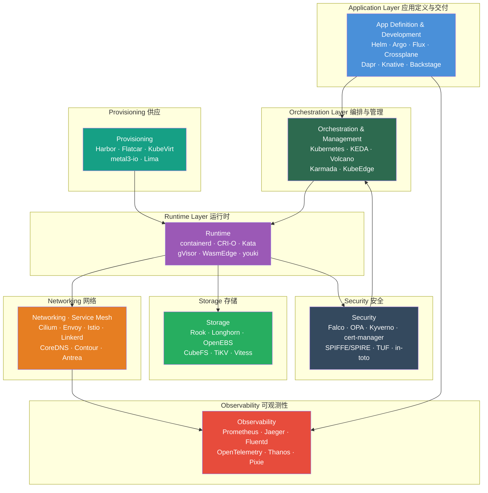
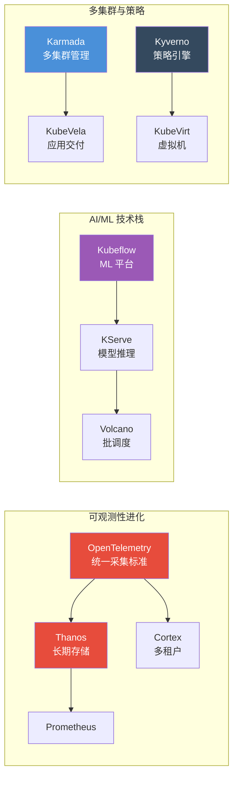

CNCF（Cloud Native Computing Foundation）云原生全景图是当今云计算领域最具影响力的开源技术生态图谱。本域收录了 CNCF 托管的全部 **218 个开源项目**，按成熟度分为 Graduated（毕业）、Incubating（孵化）、Sandbox（沙箱）三个层级，覆盖容器编排、服务网格、可观测性、安全合规、存储、AI/ML 等云原生技术全栈。本文将从架构视角出发，对这 218 个项目进行系统化的分类解析，帮助高级开发者建立全景认知框架并快速定位关键技术选型。

Sources: [README.md](domain-34-cncf-landscape/README.md#L1-L26)

## CNCF 项目成熟度模型：三级孵化体系

CNCF 采用严格的三级成熟度模型管理旗下项目，每个层级的晋升需要通过技术架构评审、社区健康度评估和生产验证。

| 成熟度级别 | 项目数量 | 核心要求 | 典型特征 |
|:---|:---:|:---|:---|
| **Graduated（毕业）** | 34 | 采用率、文档完备、治理成熟 | 生产就绪，广泛采用，API 稳定 |
| **Incubating（孵化）** | 37 | 多组织采用、健康社区、技术可行 | 快速成长，生态活跃，API 可能演变 |
| **Sandbox（沙箱）** | 147 | 创新性、开源规范、CNCF 价值对齐 | 早期探索，前沿方向，社区雏形 |

三级模型的核心逻辑是：Sandbox 验证创新方向 → Incubating 确认生产可行性 → Graduated 标志行业标准化。一个项目从 Sandbox 到 Graduated 通常需要 3-5 年的迭代周期，例如 Kubernetes 在 2016 年作为首个托管项目进入 CNCF，2018 年成为首个毕业项目；Cilium 在 2021 年进入孵化，2023 年即毕业——这反映了 eBPF 网络技术的快速成熟。

Sources: [README.md](domain-34-cncf-landscape/README.md#L19-L26)

## 生态全景架构：云原生技术栈分层视图



这张分层架构图揭示了云原生生态的核心设计哲学：每一层都遵循**可替换接口 + 多实现竞争**的模式。例如在网络层，CNI 规范定义了标准接口，Cilium、Antrea、Kube-OVN 等项目在相同接口下提供不同实现策略；在可观测性层，OpenTelemetry 定义了统一采集标准，Prometheus、Jaeger、Loki 等分别在指标、追踪、日志维度提供最佳方案。

Sources: [README.md](domain-34-cncf-landscape/README.md#L30-L69), [kubernetes.md](domain-34-cncf-landscape/graduated/kubernetes/kubernetes.md#L46-L67), [prometheus.md](domain-34-cncf-landscape/graduated/prometheus/prometheus.md#L46-L63)

## Graduated 毕业项目（34 个）：生产级技术基石

毕业项目是 CNCF 生态中经过最严格验证的核心组件，代表该技术领域的行业事实标准。以下按功能领域分组解析。

### 容器编排与运行时

| 项目 | 核心定位 | 技术特征 | 典型规模 |
|:---|:---|:---|:---|
| **Kubernetes** | 容器编排平台 | 声明式 API + 控制器模式 + etcd 共识 | 5000+ 节点集群 |
| **containerd** | 容器运行时 | OCI 运行时标准实现，CRI 兼容 | 生产级默认选择 |
| **CRI-O** | 轻量容器运行时 | 专为 Kubernetes 设计，最小化依赖 | 安全敏感环境 |

Kubernetes 作为云原生生态的基石，其声明式 API 和控制器模式定义了整个生态的编程范式。containerd 和 CRI-O 在运行时层面竞争：前者由 Docker 演进而来，生态更丰富；后者由 Red Hat 主导，更轻量安全。

Sources: [kubernetes.md](domain-34-cncf-landscape/graduated/kubernetes/kubernetes.md#L1-L32), [containerd.md](domain-34-cncf-landscape/graduated/containerd/containerd.md#L1-L15), [cri-o.md](domain-34-cncf-landscape/graduated/cri-o/cri-o.md#L1-L15)

### 服务网格与网络

| 项目 | 核心定位 | 技术路线 | 适用场景 |
|:---|:---|:---|:---|
| **Envoy** | 高性能代理 | C++ 实现，xDS 动态配置 | 数据平面通用代理 |
| **Istio** | 服务网格平台 | Sidecar + istiod 控制面 | 企业级微服务治理 |
| **Linkerd** | 超轻量服务网格 | Rust 代理，极低资源开销 | 资源敏感型环境 |
| **Cilium** | eBPF 网络方案 | 内核级数据路径，可替代 kube-proxy | 高性能网络 + 安全 |
| **CoreDNS** | 云原生 DNS | Go 实现，插件化架构 | Kubernetes 集群 DNS |

服务网格领域存在三条技术路线的竞争：Istio 代表的 **Sidecar 模式**（功能最完整）、Linkerd 代表的 **极简 Sidecar 模式**（资源占用最低）、Cilium 代表的 **eBPF Sidecar-less 模式**（性能最优）。Cilium 的快速毕业标志着 eBPF 技术正在从创新走向主流。

Sources: [istio.md](domain-34-cncf-landscape/graduated/istio/istio.md#L1-L32), [cilium.md](domain-34-cncf-landscape/graduated/cilium/cilium.md#L1-L32), [envoy.md](domain-34-cncf-landscape/graduated/envoy/envoy.md#L1-L15), [linkerd.md](domain-34-cncf-landscape/graduated/linkerd/linkerd.md#L1-L15), [coredns.md](domain-34-cncf-landscape/graduated/coredns/coredns.md#L1-L15)

### 可观测性

| 项目 | 核心定位 | 信号类型 | 架构特点 |
|:---|:---|:---|:---|
| **Prometheus** | 监控告警 | Metrics（指标） | Pull 模式 + TSDB + PromQL |
| **Jaeger** | 分布式追踪 | Traces（追踪） | OpenTelemetry 兼容，多存储后端 |
| **Fluentd** | 统一日志层 | Logs（日志） | 插件化架构，500+ 插件 |

Prometheus 定义了云原生监控的标准范式：基于拉取模式的数据采集、多维标签数据模型、PromQL 查询语言。其局限性（单机存储、不支持长期历史）催生了 Thanos 和 Cortex 两个孵化项目作为补充。Jaeger 和 Fluentd 分别在追踪和日志维度提供标准方案，三者共同构成可观测性的三大支柱。

Sources: [prometheus.md](domain-34-cncf-landscape/graduated/prometheus/prometheus.md#L1-L32), [jaeger.md](domain-34-cncf-landscape/graduated/jaeger/jaeger.md#L1-L15), [fluentd.md](domain-34-cncf-landscape/graduated/fluentd/fluentd.md#L1-L15)

### 安全与合规

| 项目 | 核心定位 | 防护层面 | 技术机制 |
|:---|:---|:---|:---|
| **Falco** | 运行时安全 | 运行时检测 | eBPF/内核模块监控系统调用 |
| **OPA** | 开放策略代理 | 策略决策 | Rego 语言，策略即代码 |
| **cert-manager** | 证书管理 | 传输安全 | 自动签发/轮换 TLS 证书 |
| **SPIFFE/SPIRE** | 身份框架 | 服务身份 | SVID 身份文档 + 工作负载 API |
| **in-toto** | 供应链安全 | 构建完整性 | 链式元数据验证 |
| **TUF** | 更新安全 | 软件分发 | 框架级安全更新 |

安全领域呈现**纵深防御**的架构趋势：Falco 在运行时层面监控异常行为、OPA/Kyverno 在准入层面执行策略、cert-manager 在传输层面保障加密、SPIFFE/SPIRE 在身份层面建立信任、in-toto/TUF 在供应链层面保障完整性。这一链条覆盖了从代码构建到运行时全生命周期。

Sources: [falco.md](domain-34-cncf-landscape/graduated/falco/falco.md#L1-L32), [opa.md](domain-34-cncf-landscape/graduated/opa/opa.md#L1-L15), [cert-manager.md](domain-34-cncf-landscape/graduated/cert-manager/cert-manager.md#L1-L15), [spiffe.md](domain-34-cncf-landscape/graduated/spiffe/spiffe.md#L1-L15), [spire.md](domain-34-cncf-landscape/graduated/spire/spire.md#L1-L15)

### 应用交付与供应

| 项目 | 核心定位 | 模式 | 适用场景 |
|:---|:---|:---|:---|
| **Helm** | 包管理器 | Chart 模板 + values 覆盖 | 标准化应用分发 |
| **Argo** | GitOps 工作流 | 声明式 Workflow + CD | 复杂工作流编排 |
| **Flux** | GitOps CD | 轻量 Git 同步控制器 | 简单 GitOps 部署 |
| **Crossplane** | 云原生控制平面 | Kubernetes 风格管理云资源 | 多云基础设施编排 |
| **Harbor** | 企业镜像仓库 | 镜像扫描 + RBAC + 复制 | 企业级镜像安全治理 |

GitOps 已成为云原生交付的事实标准，Argo 和 Flux 分别代表了两种设计哲学：Argo 提供完整的 UI 和工作流引擎，适合需要可视化编排的团队；Flux 更轻量，遵循 Kubernetes 原生设计，适合偏好极简工具链的团队。Crossplane 则将 Kubernetes 的声明式 API 模式延伸到云资源管理，实现了基础设施即 Kubernetes 资源。

Sources: [argo.md](domain-34-cncf-landscape/graduated/argo/argo.md#L1-L15), [flux.md](domain-34-cncf-landscape/graduated/flux/flux.md#L1-L15), [crossplane.md](domain-34-cncf-landscape/graduated/crossplane/crossplane.md#L1-L15), [harbor.md](domain-34-cncf-landscape/graduated/harbor/harbor.md#L1-L15), [helm.md](domain-34-cncf-landscape/graduated/helm/helm.md#L1-L15)

### 存储与数据库

| 项目 | 核心定位 | 数据模型 | 差异化优势 |
|:---|:---|:---|:---|
| **Rook** | 存储编排 | Ceph/EdgeFS 等后端 | Kubernetes 原生存储管理 |
| **CubeFS** | 分布式存储 | 对象 + 块 + 文件三合一 | 多协议统一存储 |
| **TiKV** | 事务键值库 | 分布式事务 KV | Raft 共识 + 强一致性 |
| **Vitess** | MySQL 集群 | 分片 MySQL | YouTube 诞生，水平扩展 |

### 边缘计算与 Serverless

| 项目 | 核心定位 | 边缘/云 | 技术特点 |
|:---|:---|:---|:---|
| **KubeEdge** | 边缘计算 | 云边协同 | 离线自治 + 设备管理 |
| **Knative** | 无服务器 | 云端 | Serving + Eventing 双组件 |
| **KEDA** | 事件驱动伸缩 | 云端 | 0→N 事件驱动自动扩缩容 |
| **Dapr** | 分布式运行时 | 通用 | 多语言 SDK + 标准化 API |

Sources: [rook.md](domain-34-cncf-landscape/graduated/rook/rook.md#L1-L15), [cubefs.md](domain-34-cncf-landscape/graduated/cubefs/cubefs.md#L1-L15), [tikv.md](domain-34-cncf-landscape/graduated/tikv/tikv.md#L1-L15), [vitess.md](domain-34-cncf-landscape/graduated/vitess/vitess.md#L1-L15), [kubeedge.md](domain-34-cncf-landscape/graduated/kubeedge/kubeedge.md#L1-L15), [knative.md](domain-34-cncf-landscape/graduated/knative/knative.md#L1-L15), [keda.md](domain-34-cncf-landscape/graduated/keda/keda.md#L1-L15), [dapr.md](domain-34-cncf-landscape/graduated/dapr/dapr.md#L1-L15)

## Incubating 孵化项目（37 个）：快速成长的技术力量

孵化项目已完成技术验证，正在被多个组织采用，代表未来 1-2 年内即将标准化的技术方向。

### 关键孵化项目深度解析



#### OpenTelemetry：可观测性的统一标准

OpenTelemetry 是近年来 CNCF 最具战略意义的孵化项目。它合并了 OpenTracing 和 OpenCensus 两个项目，定义了 Traces、Metrics、Logs 三大信号的统一 API 和 SDK 标准，从根本上解决了遥测数据采集的碎片化问题。其架构由三层组成：**API 层**定义接口规范（厂商无关）、**SDK 层**提供实现和处理管道（采样、批处理、导出）、**Collector 层**提供供应商中立的数据收集和路由能力。

Sources: [opentelemetry.md](domain-34-cncf-landscape/incubating/opentelemetry/opentelemetry.md#L1-L43)

#### Karmada：多云多集群编排

Karmada 提供了 Kubernetes 风格的多集群管理 API，其核心创新是 PropagationPolicy（传播策略）和 OverridePolicy（覆盖策略）两个 CRD，前者定义资源如何分发到成员集群，后者定义不同集群的差异化配置。这种设计让运维团队可以用单一的声明式配置管理跨地域、跨云的多集群工作负载。

Sources: [karmada.md](domain-34-cncf-landscape/incubating/karmada/karmada.md#L1-L29)

#### KServe：标准化模型推理

KServe 定义了 InferenceService CRD，将模型推理标准化为 Predictor（推理）、Transformer（预处理）、Explainer（解释）三个组件，支持 TensorFlow、PyTorch、Triton 等主流框架，基于 Knative 实现自动扩缩容至零。这使得 ML 工程师可以用统一的声明式 API 部署任何框架的模型。

Sources: [kserve.md](domain-34-cncf-landscape/incubating/kserve/kserve.md#L1-L29)

### 孵化项目全量分类

| 分类 | 项目 | 技术方向 |
|:---|:---|:---|
| **可观测性** | OpenTelemetry, Thanos, Cortex, OpenCost, Litmus, Chaos Mesh | 统一采集、长期存储、成本监控、混沌工程 |
| **AI/ML** | Kubeflow, KServe, Volcano | ML 平台、模型推理、批调度 |
| **网络** | CNI, Contour, Emissary-Ingress | 网络规范、Ingress 控制器、API 网关 |
| **安全** | Kyverno, Keycloak, Kubescape, Notary, OpenFGA | 策略引擎、身份管理、安全扫描、制品签名 |
| **应用定义** | Backstage, Buildpacks, KubeVela, OpenKruise, Operator Framework | 开发者门户、构建工具、应用交付、工作负载增强 |
| **存储** | Longhorn, Fluid | 分布式块存储、数据集编排 |
| **编排** | Karmada | 多集群管理 |
| **边缘** | OpenYurt | 边缘 Kubernetes |
| **供应** | Flatcar, KubeVirt, metal3-io, Lima | 容器 OS、虚拟机、裸金属、开发环境 |
| **消息/流** | NATS, Strimzi | 消息系统、Kafka on K8s |
| **Serverless** | wasmCloud | WebAssembly 应用平台 |
| **其他** | Artifact Hub, Cloud Custodian, gRPC, OpenFeature | 制品发现、云治理、RPC 框架、特性标志 |

Sources: [README.md](domain-34-cncf-landscape/README.md#L73-L116)

## Sandbox 沙箱项目（147 个）：前沿技术风向标

沙箱项目代表了云原生技术的未来探索方向，其中相当比例将在未来 2-3 年内晋升为孵化项目。以下按功能领域解析关键项目。

### Kubernetes 发行版与管理（25 个）

轻量级 Kubernetes 发行版是沙箱中一个显著的趋势类别，反映了 Kubernetes 向边缘、IoT 和开发者桌面场景的渗透。

| 项目 | 核心特征 | 资源要求 | 最佳场景 |
|:---|:---|:---|:---|
| **k3s** | 单二进制 ~100MB，内置 containerd + Flannel | 512MB RAM | IoT、边缘、CI/CD |
| **k0s** | 零依赖单二进制，CNCF 认证 | 1GB RAM | 简易部署、离线环境 |
| **Kairos** | 不可变 OS，P2P 自引导 | 低至 2GB | 边缘设备、安全场景 |

k3s 由 Rancher/SUSE 维护，将 Kubernetes 全部组件打包到一个小于 100MB 的二进制文件中，默认使用 SQLite 作为数据存储，30 秒内完成安装。这一设计使得在 ARM 设备和资源受限的边缘节点上运行 Kubernetes 成为现实。

Sources: [k3s.md](domain-34-cncf-landscape/sandbox/k3s/k3s.md#L1-L34), [k0s.md](domain-34-cncf-landscape/sandbox/k0s/k0s.md#L1-L15)

### AI/ML 与 GPU 管理（10 个）

AI 基础设施是当前沙箱中最活跃的技术方向，项目覆盖从 GPU 虚拟化到模型部署的全链路。

| 项目 | 定位 | 关键能力 |
|:---|:---|:---|
| **KAITO** | AI 模型推理 Operator | 指定模型名即可部署，自动 GPU 节点配置 |
| **K8sGPT** | AI 诊断助手 | LLM 驱动的集群问题分析与解释 |
| **kagent** | AI 代理框架 | Kubernetes 原生的 AI Agent 构建 |
| **hami** | GPU 虚拟化 | 多容器共享 GPU，细粒度资源分配 |
| **Koordinator** | 混合编排 | CPU/GPU 混合工作负载协同调度 |
| **Armada** | 多集群批处理 | 大规模 AI 训练任务跨集群调度 |

KAITO 代表了一种新的 Kubernetes 原生 AI 部署范式：用户只需声明 `preset.name: "llama-2-7b-chat"` 即可完成 LLM 推理服务的部署，Operator 自动处理 GPU 节点配置、模型下载和服务暴露。这种声明式体验将 AI 部署的复杂度从基础设施层面完全屏蔽。

Sources: [kaito.md](domain-34-cncf-landscape/sandbox/kaito/kaito.md#L1-L29), [k8sgpt.md](domain-34-cncf-landscape/sandbox/k8sgpt/k8sgpt.md#L1-L33), [hami.md](domain-34-cncf-landscape/sandbox/hami/hami.md#L1-L15), [koordinator.md](domain-34-cncf-landscape/sandbox/koordinator/koordinator.md#L1-L15)

### 服务网格与网络（15 个）

沙箱网络项目呈现两大趋势：**eBPF 原生方案**（Kmesh、bpfman、LoxiLB）和**多集群连接**（Submariner、k8gb、KubeSlice）。

| 项目 | 技术路线 | 创新点 |
|:---|:---|:---|
| **Kmesh** | eBPF 服务网格 | 可编程内核级服务治理，无 Sidecar |
| **MetalLB** | 裸金属负载均衡 | 为裸金属集群提供 LoadBalancer 服务 |
| **Submariner** | 多集群网络 | 跨集群 Pod 直连，L3 连接 |
| **Kube-OVN** | OVN 网络 | 企业级 SDN，丰富网络策略 |

### 安全（20 个）

安全沙箱项目覆盖了机密计算、零信任、策略即代码等前沿方向。

| 项目 | 安全层面 | 核心创新 |
|:---|:---|:---|
| **Confidential Containers** | 机密计算 | 硬件可信执行环境中的容器 |
| **Keylime** | 远程证明 | 节点完整性验证 |
| **KubeArmor** | 运行时防护 | 进程/文件/网络访问控制 |
| **external-secrets** | 密钥同步 | 统一外部密钥管理到 K8s Secret |
| **SOPS** | 密钥管理 | 加密文件中的结构化数据 |
| **Ratify** | 制品验证 | 供应链验证策略引擎 |

Sources: [README.md](domain-34-cncf-landscape/README.md#L158-L181)

### 应用定义与交付（25 个）

这一类别代表了**平台工程**（Platform Engineering）理念的技术实现，多个项目都在试图降低开发者的认知负载。

| 项目 | 定位 | 核心价值 |
|:---|:---|:---|
| **CDK8s** | 代码定义 K8s 资源 | TypeScript/Python/Java 编写 Kubernetes 配置 |
| **KCL** | 配置语言 | 类型安全的配置策略语言 |
| **OpenTofu** | IaC 工具 | Terraform 开源分叉，社区治理 |
| **Carvel** | 应用构建工具集 | kapp、ytt、kbld 等一组专注工具 |
| **Backstage**（孵化中）| 开发者门户 | 统一开发体验平台 |

### 可观测性（15 个）

| 项目 | 信号类型 | 差异化价值 |
|:---|:---|:---|
| **Pixie** | 全栈可观测性 | eBPF 零埋点自动采集 |
| **Kepler** | 能耗监控 | Pod 级别能源消耗追踪 |
| **Inspektor Gadget** | eBPF 调试 | 内核级容器调试工具集 |
| **Perses** | 仪表盘即代码 | GitOps 管理监控仪表盘 |
| **HolmesGPT** | AI 故障诊断 | AI 驱动的 SRE 诊断助手 |

Sources: [README.md](domain-34-cncf-landscape/README.md#L243-L261)

### 存储（10 个）

| 项目 | 存储模型 | 核心特征 |
|:---|:---|:---|
| **OpenEBS** | 容器原生存储 | 多引擎架构（Jiva/LocalPV/Mayastor） |
| **HwameiStor** | 高可用本地存储 | 自动化数据卷迁移 |
| **Vineyard** | 内存数据管理 | 分布式内存共享 |
| **zot** | OCI 镜像仓库 | 符合 OCI 规范的轻量仓库 |

### 边缘计算与 IoT（5 个）

| 项目 | 定位 |
|:---|:---|
| **Akri** | 边缘设备自动发现和接入 |
| **Tinkerbell** | 裸金属服务器自动化配置 |
| **WasmEdge** | 适用于边缘的轻量 WASM 运行时 |

Sources: [README.md](domain-34-cncf-landscape/README.md#L278-L296)

## 技术趋势与架构洞察

### 趋势一：eBPF 成为云原生基础设施的统一内核技术

从 Cilium（毕业）到 Kmesh、bpfman、Inspektor Gadget、Kepler（沙箱），eBPF 技术正在从网络层渗透到安全、可观测性、能耗监控等所有基础设施领域。其核心优势在于**无需修改内核或应用代码**即可在内核态注入逻辑，提供接近零开销的可编程能力。

Sources: [cilium.md](domain-34-cncf-landscape/graduated/cilium/cilium.md#L35-L46)

### 趋势二：AI 原生 Kubernetes 正在成型

KAITO、K8sGPT、kagent、hami、Koordinator 等项目构成了一个完整的 AI 原生 Kubernetes 技术栈：底层 GPU 虚拟化→中层 AI 工作负载调度→上层 AI 模型部署→AI 驱动运维诊断。这一趋势预示着 Kubernetes 正在从通用容器编排平台演化为 AI 基础设施的核心操作系统。

Sources: [kaito.md](domain-34-cncf-landscape/sandbox/kaito/kaito.md#L1-L29), [k8sgpt.md](domain-34-cncf-landscape/sandbox/k8sgpt/k8sgpt.md#L1-L33)

### 趋势三：平台工程重塑开发者体验

Backstage（孵化）、KubeVela（孵化）、Radius、Score、KusionStack 等项目都在解决同一个问题：通过抽象基础设施复杂度，为应用开发者提供 Golden Path。这与传统的 PaaS 不同，平台工程保留了基础设施的可扩展性，同时大幅降低了开发者的认知负载。

### 趋势四：WebAssembly 作为第二运行时

WasmEdge、Spin、SpinKube、container2wasm、wasmCloud 等项目正在构建一个与容器并行的 WebAssembly 运行时生态。WASM 的优势在于极快的冷启动（毫秒级）、极小的攻击面、跨平台可移植性——这使得它特别适合 Serverless 和边缘计算场景。

Sources: [README.md](domain-34-cncf-landscape/README.md#L213-L241)

### 趋势五：供应链安全从理念走向工程实践

in-toto（毕业）、Notary Project（孵化）、Ratify、Copa、Keylime 等项目共同构建了从构建完整性验证到制品签名、运行时验证的完整供应链安全链路。结合 SLSA 安全等级框架，这些工具使企业能够实现端到端的软件供应链安全。

Sources: [README.md](domain-34-cncf-landscape/README.md#L158-L181)

## 学习路径与推荐阅读顺序

基于 218 个项目的技术依赖关系和知识体系，以下五条学习路径覆盖了云原生工程师最核心的能力建设方向。

### 路径一：云原生基础入门
```
Kubernetes → containerd → Helm → Prometheus → CoreDNS
```
从编排核心出发，掌握容器运行时、包管理、监控和 DNS 四大基础能力。

### 路径二：服务网格与网络深入
```
Envoy → Istio → Linkerd → Cilium → OpenTelemetry
```
理解数据平面、控制平面、eBPF 网络的演进路线，掌握可观测性集成。

### 路径三：安全合规纵深防御
```
OPA → Falco → SPIFFE/SPIRE → in-toto → cert-manager → Kyverno
```
从策略引擎到运行时检测、身份框架、供应链安全、证书管理的完整安全链路。

### 路径四：可观测性平台构建
```
Prometheus → Jaeger → Fluentd → OpenTelemetry → Thanos → Grafana
```
三大信号标准 + 长期存储方案 + 统一采集标准 + 可视化平台的完整监控架构。

### 路径五：GitOps 与平台工程
```
Flux → Argo → Helm → Crossplane → Backstage
```
从轻量 GitOps 到完整工作流，再到多云计算和开发者门户的渐进式平台构建。

Sources: [README.md](domain-34-cncf-landscape/README.md#L327-L353)

## 跨域知识关联

本域（CNCF Landscape）的知识与仓库中多个专题域存在深度交叉，以下是关键关联点：

- [eBPF 技术、平台工程、边缘计算与 WebAssembly](27-ebpf-ji-shu-ping-tai-gong-cheng-bian-yuan-ji-suan-yu-webassembly) — Cilium、bpfman、WasmEdge 等项目在此域有深度技术解析
- [供应链安全：SBOM、SLSA、Sigstore 与合规自动化](28-gong-ying-lian-an-quan-sbom-slsa-sigstore-yu-he-gui-zi-dong-hua) — in-toto、Notary、Ratify 等安全项目的生产实践
- [架构基础与核心组件原理](5-jia-gou-ji-chu-yu-he-xin-zu-jian-yuan-li) — Kubernetes、etcd 等毕业项目的架构深度分析
- [可观测性：监控指标、日志审计、链路追踪与混沌工程](12-ke-guan-ce-xing-jian-kong-zhi-biao-ri-zhi-shen-ji-lian-lu-zhui-zong-yu-hun-dun-gong-cheng) — Prometheus、Jaeger、Fluentd 的企业级实践
- [安全合规：RBAC、网络安全策略、运行时安全与零信任架构](11-an-quan-he-gui-rbac-wang-luo-an-quan-ce-lue-yun-xing-shi-an-quan-yu-ling-xin-ren-jia-gou) — Falco、OPA、SPIFFE 的安全深度实践
- [AI 基础设施：GPU 调度、分布式训练、LLM 推理与成本优化](17-ai-ji-chu-she-shi-gpu-diao-du-fen-bu-shi-xun-lian-llm-tui-li-yu-cheng-ben-you-hua) — KAITO、hami、KServe 的 AI 基础设施实践
- [生产运维：GitOps、FinOps、灾备恢复与变更管理](20-sheng-chan-yun-wei-gitops-finops-zai-bei-hui-fu-yu-bian-geng-guan-li) — Argo、Flux、Harbor 的生产运维实践

Sources: [README.md](domain-34-cncf-landscape/README.md#L356-L362)

---

**数据来源**：CNCF Landscape 官方全景图 | **文档数量**：218 篇详细技术文档 | **最后更新**：2026-03