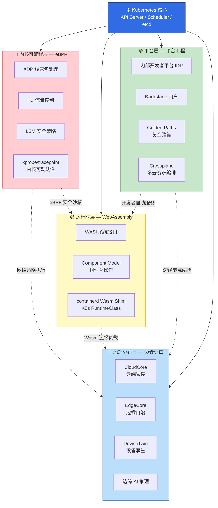
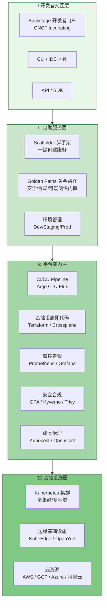
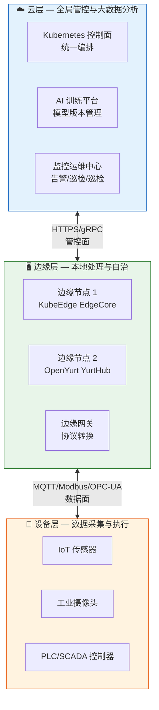
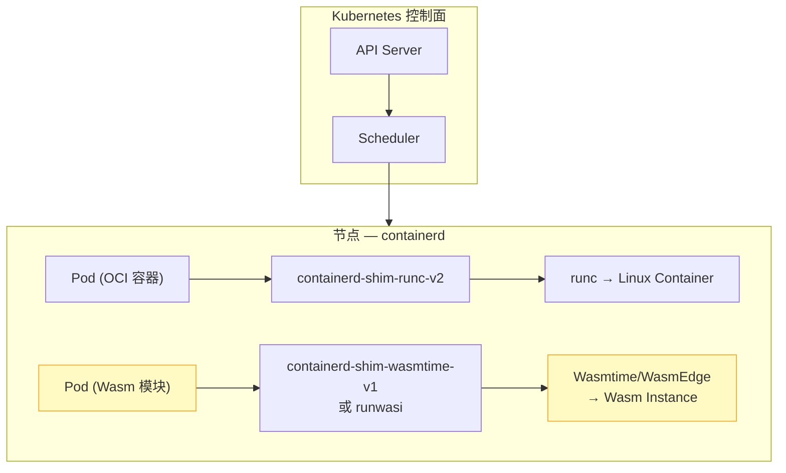
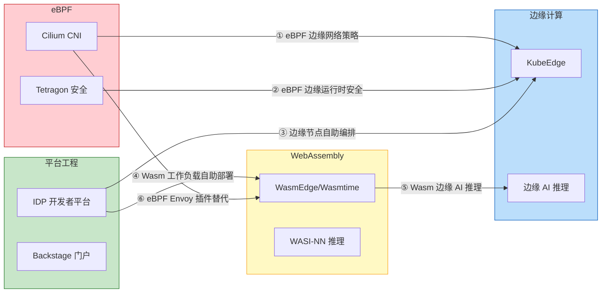

云原生技术正经历从"容器编排"到"全栈可编程基础设施"的范式跃迁。本页面对应知识库中四个前沿技术域——**eBPF 内核可编程**（Domain 35）、**平台工程**（Domain 36）、**边缘计算**（Domain 37）、**WebAssembly 云原生**（Domain 38），合计 **41 篇深度文档、92,000+ 行技术内容**。它们分别从**内核层、平台层、地理层、运行时层**四个维度重新定义云原生的能力边界，并且正在加速融合：eBPF 为边缘网络提供线速转发与安全策略执行；Wasm 以微秒级冷启动和 KB 级体积成为边缘与 Serverless 的理想运行时；平台工程将 eBPF 网络策略、边缘节点管理与 Wasm 工作负载统一抽象为开发者自助服务能力。本文将从**架构定位、技术全景、交叉融合、学习路径**四个视角，为你构建一张系统化的认知地图。

Sources: [README.md](domain-35-ebpf-technology/README.md#L1-L85), [README.md](domain-36-platform-engineering/README.md#L1-L100), [README.md](domain-37-edge-computing/README.md#L1-L90), [README.md](domain-38-webassembly-cloud-native/README.md#L1-L88)

---

## 四大技术域的架构定位

在云原生技术栈的分层视图中，这四个域各自占据独特的技术锚点。下图展示了它们在内核、运行时、平台、地理分布四个维度上的精确位置，以及它们与 Kubernetes 核心之间的依赖关系。

**eBPF** 在 Linux 内核中插入安全沙箱程序，无需修改内核源码即可实现网络加速（XDP）、安全策略（LSM BPF）、运行时监控（kprobe/tracepoint）。它将传统由 iptables/ipvs 实现的 O(n) 规则链遍历替换为 O(1) hash map 查找，使 Kubernetes 网络数据平面性能提升一个数量级。[01-ebpf-architecture-fundamentals.md](domain-35-ebpf-technology/01-ebpf-architecture-fundamentals.md#L39-L48)

**平台工程** 在 Kubernetes 之上构建内部开发者平台（IDP），通过 Golden Paths 将网络策略配置、边缘节点管理、Wasm 工作负载部署等复杂操作封装为一键式自助服务，使开发者认知负载降低 80%、新服务启动时间从 2-4 周缩短至 1-2 天。[01-platform-engineering-overview.md](domain-36-platform-engineering/01-platform-engineering-overview.md#L24-L54)

**边缘计算** 将 Kubernetes 编排能力延伸到地理分布的边缘节点，通过 KubeEdge（CNCF Incubating）、OpenYurt（CNCF Sandbox）等框架实现云边协同、边缘自治和离线运行，满足工业控制（< 10ms 延迟）、车联网（< 5ms 延迟）等严苛场景。[01-edge-computing-architecture.md](domain-37-edge-computing/01-edge-computing-architecture.md#L16-L38)

**WebAssembly** 以 W3C 标准的二进制指令格式和 WASI 系统接口，在边缘设备和云原生节点上提供微秒级冷启动（< 1ms）、KB 级体积（100KB-10MB）、硬件级沙箱隔离的运行时环境，成为 Serverless FaaS 和边缘 AI 推理的理想载体。[01-wasm-fundamentals-cloud-native.md](domain-38-webassembly-cloud-native/01-wasm-fundamentals-cloud-native.md#L16-L43)

Sources: [01-ebpf-architecture-fundamentals.md](domain-35-ebpf-technology/01-ebpf-architecture-fundamentals.md#L39-L48), [01-platform-engineering-overview.md](domain-36-platform-engineering/01-platform-engineering-overview.md#L24-L54), [01-edge-computing-architecture.md](domain-37-edge-computing/01-edge-computing-architecture.md#L16-L38), [01-wasm-fundamentals-cloud-native.md](domain-38-webassembly-cloud-native/01-wasm-fundamentals-cloud-native.md#L16-L43)

---

## eBPF 技术体系：内核可编程革命

eBPF（Extended Berkeley Packet Filter）自 2014 年由 Alexei Starovoitov 重新设计以来，已从 BSD 包过滤器演变为 Linux 内核的"可编程神经系统"。其核心机制是一个**验证器保证安全**的内核态虚拟机——eBPF 程序在加载前必须通过静态分析（确保无无限循环、内存访问边界安全），然后由 JIT 编译器翻译为本地机器码以接近原生速度执行。这使得 eBPF 成为在不修改内核源码、不加载内核模块的前提下扩展内核功能的唯一安全途径。[01-ebpf-architecture-fundamentals.md](domain-35-ebpf-technology/01-ebpf-architecture-fundamentals.md#L29-L48)

### 程序类型与数据路径

eBPF 程序按**挂载点**分类，每种类型对应内核中的一个特定处理阶段。在云原生场景中，最关键的三类程序形成了从网卡驱动到应用层的完整数据路径：

| 程序类型 | 挂载位置 | 核心用途 | 云原生场景 |
|---------|---------|---------|-----------|
| **XDP** (eXpress Data Path) | 网卡驱动层（最早拦截点） | DDoS 防御、负载均衡、包过滤 | Cilium kube-proxy 替代 |
| **TC** (Traffic Control) | 网络栈流量控制层 | 网络策略执行、流量整形 | L3/L4/L7 策略 |
| **cgroup/connect** | Socket 层 | 连接跟踪、Socket 转发 | 无 Sidecar 服务网格 |
| **LSM BPF** | Linux 安全模块钩子 | 进程/文件/网络强制访问控制 | Tetragon 运行时安全 |
| **kprobe/kretprobe** | 内核函数入口/返回 | 内核行为追踪 | 性能分析、故障诊断 |

[01-ebpf-architecture-fundamentals.md](domain-35-ebpf-technology/01-ebpf-architecture-fundamentals.md#L39-L48), [03-cilium-cni-architecture.md](domain-35-ebpf-technology/03-cilium-cni-architecture.md#L39-L64)

### Cilium：eBPF 在 Kubernetes 中的集大成者

Cilium 作为 CNCF Graduated 项目（2023 年 10 月毕业），是 eBPF 在云原生领域的旗舰实现。它通过 eBPF 程序在内核层透明地插入网络、安全、可观测性逻辑，实现了三大核心突破：

- **kube-proxy 完全替代**：通过 eBPF sock_REDIRECT 和 bpf_sock_hash 实现 Socket 级直连，Service 连接延迟降低 50%+，节点间转发吞吐提升 2-3 倍
- **L3/L4/L7 统一策略**：CiliumNetworkPolicy 支持 HTTP method/path、gRPC method、Kafka topic 等应用层语义的精细控制，远超 Kubernetes 原生 NetworkPolicy 的 L3/L4 能力
- **无 Sidecar 服务网格**：Cilium Service Mesh 利用 eBPF 在内核层实现 mTLS 加密（基于 SPIFFE/SPIRE 身份）、L7 流量管理和可观测性，彻底消除每个 Pod 50-100MB 的 Envoy Sidecar 开销

[03-cilium-cni-architecture.md](domain-35-ebpf-technology/03-cilium-cni-architecture.md#L16-L64), [05-cilium-service-mesh.md](domain-35-ebpf-technology/05-cilium-service-mesh.md#L39-L52)

### eBPF 文档全景（Domain 35，10 篇，~26,000 行）

| 编号 | 文档 | 核心内容 | 深度 |
|------|------|---------|------|
| 01 | [eBPF 架构基础](domain-35-ebpf-technology/01-ebpf-architecture-fundamentals.md) | 虚拟机架构、验证器、JIT、程序类型、BTF/CO-RE | ⭐⭐⭐⭐⭐ |
| 02 | [eBPF Map 类型](domain-35-ebpf-technology/02-ebpf-map-types-data-structures.md) | Hash/Array/LRU/RingBuffer/Per-CPU Map | ⭐⭐⭐⭐⭐ |
| 03 | [Cilium CNI 架构](domain-35-ebpf-technology/03-cilium-cni-architecture.md) | Agent/Operator/CNI Plugin、kube-proxy 替代、Cluster Mesh | ⭐⭐⭐⭐⭐ |
| 04 | [Cilium 网络策略](domain-35-ebpf-technology/04-cilium-network-policy.md) | L3/L4/L7 策略、HTTP/gRPC/Kafka 语义控制 | ⭐⭐⭐⭐⭐ |
| 05 | [Cilium Service Mesh](domain-35-ebpf-technology/05-cilium-service-mesh.md) | 无 Sidecar 架构、mTLS、L7 流量管理 | ⭐⭐⭐⭐ |
| 06 | [Tetragon 运行时安全](domain-35-ebpf-technology/06-tetragon-runtime-security.md) | TracingPolicy CRD、进程/文件/网络监控、主动阻断 | ⭐⭐⭐⭐⭐ |
| 07 | [Hubble 网络可观测性](domain-35-ebpf-technology/07-hubble-network-observability.md) | Hubble UI/CLI/Relay、L3-L7 流可视化 | ⭐⭐⭐⭐ |
| 08 | [bcc 与 bpftrace 工具](domain-35-ebpf-technology/08-bcc-bpftrace-tools.md) | Python/Lua eBPF 开发工具链 | ⭐⭐⭐⭐ |
| 09 | [eBPF 性能优化](domain-35-ebpf-technology/09-ebpf-performance-optimization.md) | XDP 加速、TC 优化、Map 调优 | ⭐⭐⭐⭐⭐ |
| 10 | [eBPF 安全应用](domain-35-ebpf-technology/10-ebpf-security-applications.md) | 入侵检测、DDoS 防护、容器逃逸检测 | ⭐⭐⭐⭐⭐ |

Sources: [README.md](domain-35-ebpf-technology/README.md#L18-L67), [01-ebpf-architecture-fundamentals.md](domain-35-ebpf-technology/01-ebpf-architecture-fundamentals.md#L29-L48), [03-cilium-cni-architecture.md](domain-35-ebpf-technology/03-cilium-cni-architecture.md#L16-L64), [05-cilium-service-mesh.md](domain-35-ebpf-technology/05-cilium-service-mesh.md#L39-L52), [06-tetragon-runtime-security.md](domain-35-ebpf-technology/06-tetragon-runtime-security.md#L24-L56)

---

## 平台工程：云原生时代的开发者体验革命

平台工程（Platform Engineering）在 2022 年被 Gartner 列为十大战略技术趋势，其核心驱动力源于一个量化事实：**典型 Kubernetes 开发者仅有 10% 的时间用于业务逻辑开发，其余 90% 被基础设施配置、安全合规、CI/CD 调试等认知负载吞噬**。平台工程通过构建内部开发者平台（IDP），将"每个团队都做 DevOps"的不可持续模式，转化为平台团队提供黄金路径、应用团队自助消费的可持续模式。[01-platform-engineering-overview.md](domain-36-platform-engineering/01-platform-engineering-overview.md#L33-L54)

### IDP 架构分层与核心技术栈

**平台工程的十大设计原则**（参见 IDP 设计原则文档）构成了 IDP 建设的价值基石。当设计原则发生冲突时，遵循 **安全 → 可靠 → 体验 → 功能 → 性能** 的优先级排序。其中"渐进式复杂度暴露"原则尤为关键——新手开发者通过黄金路径获得 80% 场景的一键式体验，高级用户可以在必要时"偏离路径"获取完整控制权。[02-idp-design-principles.md](domain-36-platform-engineering/02-idp-design-principles.md#L36-L63)

### Golden Paths：从 2 周到 2 天的价值量化

黄金路径（Golden Paths）是平台工程中最具可操作性的实践。Spotify 首先系统化提出这一概念，其核心思想是**让正确的选择成为最简单的选择**。知识库中的 Golden Paths 文档给出了精确的价值量化：

| 指标 | 无黄金路径 | 有黄金路径 | 改善幅度 |
|------|-----------|-----------|---------|
| 新服务启动时间 | 2-4 周 | 1-2 天 | **↓ 95%** |
| 安全配置错误率 | 30-40% | < 5% | **↓ 88%** |
| 首次部署成功率 | 60% | 95% | **↑ 35%** |
| 新工程师上手时间 | 2-4 周 | 3-5 天 | **↓ 80%** |
| 平台支持工单量 | 高 | 低 | **↓ 60-70%** |

[08-golden-paths-design.md](domain-36-platform-engineering/08-golden-paths-design.md#L44-L68)

### 平台工程文档全景（Domain 36，11 篇，~20,000 行）

| 编号 | 文档 | 核心内容 | 深度 |
|------|------|---------|------|
| 01 | [平台工程概述与成熟度模型](domain-36-platform-engineering/01-platform-engineering-overview.md) | 平台工程定义、L1-L4 成熟度、组织架构 | ⭐⭐⭐⭐ |
| 02 | [IDP 设计原则](domain-36-platform-engineering/02-idp-design-principles.md) | 十大设计原则、自助服务模式、平台契约 | ⭐⭐⭐⭐ |
| 03 | [Backstage 部署与配置](domain-36-platform-engineering/03-backstage-deployment.md) | Backstage 架构、K8s 部署、身份集成 | ⭐⭐⭐⭐⭐ |
| 04 | [Backstage 软件目录与 TechDocs](domain-36-platform-engineering/04-backstage-catalog-techdocs.md) | Software Catalog、TechDocs、API 文档 | ⭐⭐⭐⭐ |
| 05 | [Backstage 脚手架与模板](domain-36-platform-engineering/05-backstage-scaffolder-templates.md) | Scaffolder、模板开发、自动化工作流 | ⭐⭐⭐⭐⭐ |
| 06 | [Kratix 平台即代码](domain-36-platform-engineering/06-kratix-platform-as-code.md) | Kratix Promise、平台 API、多集群 | ⭐⭐⭐⭐⭐ |
| 07 | [Crossplane 平台组合](domain-36-platform-engineering/07-crossplane-platform-composition.md) | Composition、XRD、多云基础设施抽象 | ⭐⭐⭐⭐⭐ |
| 08 | [Golden Paths 黄金路径设计](domain-36-platform-engineering/08-golden-paths-design.md) | 铺路 vs 护栏、模板设计、成熟度模型 | ⭐⭐⭐⭐ |
| 09 | [开发者体验度量](domain-36-platform-engineering/09-developer-experience-metrics.md) | DORA 指标、SPACE 框架、平台 KPI | ⭐⭐⭐⭐ |
| 10 | [平台团队拓扑与运营](domain-36-platform-engineering/10-platform-team-topology.md) | Team Topologies、平台运营模式 | ⭐⭐⭐⭐ |
| 11 | [Vercel 前端部署平台](domain-36-platform-engineering/11-vercel-frontend-deployment-platform.md) | Vercel 零配置部署、Edge Functions | ⭐⭐⭐⭐ |

Sources: [README.md](domain-36-platform-engineering/README.md#L18-L77), [01-platform-engineering-overview.md](domain-36-platform-engineering/01-platform-engineering-overview.md#L33-L54), [02-idp-design-principles.md](domain-36-platform-engineering/02-idp-design-principles.md#L36-L63), [08-golden-paths-design.md](domain-36-platform-engineering/08-golden-paths-design.md#L44-L68)

---

## 边缘计算：Kubernetes 的地理延伸

边缘计算将计算能力从集中式数据中心下沉到靠近数据源头的网络拓扑"边缘"位置，解决四大核心问题：**低延迟**（工业控制 < 10ms）、**带宽节省**（只上传有价值数据）、**离线自治**（网络中断时继续运行）、**数据隐私**（敏感数据不出边界）。知识库中的边缘计算域涵盖三种主流 Kubernetes 边缘框架和完整的边缘 AI 推理体系。[01-edge-computing-architecture.md](domain-37-edge-computing/01-edge-computing-architecture.md#L16-L38)

### 三层架构模型

### 三大边缘框架对比

| 维度 | **KubeEdge** (华为/CNCF Incubating) | **OpenYurt** (阿里/CNCF Sandbox) | **SuperEdge** (腾讯) |
|------|--------------------------------------|-----------------------------------|---------------------|
| 核心架构 | CloudCore + EdgeCore | YurtHub + NodePool | EdgeTunnel + 分布式健康检查 |
| 边缘自治 | MetaManager + SQLite 本地存储 | YurtHub 本地代理 | Lite-Apiserver 本地缓存 |
| 通信方式 | WebSocket 反向代理 | 云原生 InCluster Proxy | Tunnel SSH/WSS |
| 设备管理 | DeviceModel/DeviceTwin CRD | 无原生支持 | 无原生支持 |
| 多架构 | x86/ARM32/ARM64/RISC-V | x86/ARM64 | x86/ARM64 |
| 资源占用 | EdgeCore ~70-128MB RAM | YurtHub ~50MB RAM | ~100MB RAM |
| K8s 兼容性 | v1.26-v1.28 (v1.15) | v1.22+ | v1.18+ |

[03-kubeedge-architecture-deployment.md](domain-37-edge-computing/03-kubeedge-architecture-deployment.md#L39-L70), [05-openyurt-architecture.md](domain-37-edge-computing/05-openyurt-architecture.md#L1-L5), [06-superedge-architecture.md](domain-37-edge-computing/06-superedge-architecture.md#L1-L5)

### 边缘 AI 推理：从云端训练到边缘推理

边缘 AI 推理是边缘计算中增长最快的场景。知识库中的边缘 AI 文档提供了完整的推理框架选型矩阵：

| 框架 | 硬件支持 | 量化支持 | 适用场景 |
|------|---------|---------|---------|
| **ONNX Runtime** | CPU/GPU/NPU | INT8/FP16 | 通用推理，跨平台 |
| **TensorFlow Lite** | CPU/GPU/DSP/NPU | INT8/FP16 | 移动端/嵌入式 |
| **OpenVINO** | Intel CPU/GPU/VPU/FPGA | INT8 | Intel 硬件加速 |
| **TensorRT** | NVIDIA GPU | INT8/FP16 | GPU 高性能推理 |

以 ResNet-50 推理延迟为参考：在树莓派 4（ARM Cortex-A72）上 ONNX Runtime CPU 约 180ms，而在 Jetson Nano GPU 上 TensorRT INT8 仅约 3ms——**60 倍的性能差距**，凸显了推理框架与硬件匹配的重要性。[07-edge-ai-inference-federated-learning.md](domain-37-edge-computing/07-edge-ai-inference-federated-learning.md#L32-L68)

### 边缘计算文档全景（Domain 37，10 篇，~21,000 行）

| 编号 | 文档 | 核心内容 | 深度 |
|------|------|---------|------|
| 01 | [边缘计算架构概述](domain-37-edge-computing/01-edge-computing-architecture.md) | 定义、拓扑、延迟需求、边缘 vs 云 | ⭐⭐⭐⭐ |
| 02 | [云边协同设计模式](domain-37-edge-computing/02-cloud-edge-collaboration.md) | 通信模式、数据同步、离线优先 | ⭐⭐⭐⭐ |
| 03 | [KubeEdge 架构与部署](domain-37-edge-computing/03-kubeedge-architecture-deployment.md) | CloudCore/EdgeCore、Helm/keadm 部署 | ⭐⭐⭐⭐⭐ |
| 04 | [KubeEdge 设备管理与边缘应用](domain-37-edge-computing/04-kubeedge-device-edge-apps.md) | DeviceModel、DeviceTwin、边缘应用部署 | ⭐⭐⭐⭐ |
| 05 | [OpenYurt 边缘方案](domain-37-edge-computing/05-openyurt-architecture.md) | YurtHub、YurtTunnel、NodePool | ⭐⭐⭐⭐⭐ |
| 06 | [SuperEdge 架构实践](domain-37-edge-computing/06-superedge-architecture.md) | 分布式健康检查、边缘自治 | ⭐⭐⭐⭐ |
| 07 | [边缘 AI 推理与联邦学习](domain-37-edge-computing/07-edge-ai-inference-federated-learning.md) | ONNX/TFLite/OpenVINO、联邦学习架构 | ⭐⭐⭐⭐⭐ |
| 08 | [边缘存储与网络](domain-37-edge-computing/08-edge-storage-network.md) | 边缘存储方案、弱网络优化 | ⭐⭐⭐⭐ |
| 09 | [边缘安全架构](domain-37-edge-computing/09-edge-security.md) | 边缘身份、通信安全、设备安全 | ⭐⭐⭐⭐⭐ |
| 10 | [边缘场景案例](domain-37-edge-computing/10-edge-use-cases.md) | 智慧工厂、智慧城市、车联网、零售 | ⭐⭐⭐⭐ |

Sources: [README.md](domain-37-edge-computing/README.md#L18-L72), [01-edge-computing-architecture.md](domain-37-edge-computing/01-edge-computing-architecture.md#L16-L38), [03-kubeedge-architecture-deployment.md](domain-37-edge-computing/03-kubeedge-architecture-deployment.md#L39-L70), [07-edge-ai-inference-federated-learning.md](domain-37-edge-computing/07-edge-ai-inference-federated-learning.md#L32-L68)

---

## WebAssembly 云原生：下一个运行时前沿

WebAssembly（Wasm）于 2019 年成为 W3C 官方标准后，正从浏览器向服务器端和边缘计算领域快速渗透。Docker 联合创始人 Solomon Hykes 的名言——"如果 Wasm+WASI 在 2008 年就存在，我们就不需要创建 Docker"——精准地概括了 Wasm 的颠覆潜力。2026 年，随着 WASI 0.3 标准、Component Model、SpinKube 和 wasmCloud 的生产就绪，Wasm 在 Kubernetes 上的部署已从实验走向主流。[22-kubernetes-webassembly-wasm-workloads.md](domain-19-papers/22-kubernetes-webassembly-wasm-workloads.md#L23-L38)

### Wasm vs 容器：运行时范式的代际对比

| 对比维度 | 传统容器 (OCI) | WebAssembly (Wasm) | 量级差异 |
|---------|--------------|-------------------|---------|
| **冷启动时间** | 100ms - 数秒 | < 1ms（微秒级） | **100-1000× 更快** |
| **镜像/模块大小** | 50MB - 数 GB | 100KB - 10MB | **10-100× 更小** |
| **内存占用** | 数十 MB 起步 | < 1MB | **10-50× 更省** |
| **多租户密度** | 节点 100-1000 容器 | 节点 10,000+ Wasm 实例 | **10-100× 更密** |
| **安全隔离** | Linux namespace + cgroup | 硬件级指令集沙箱 | 更细粒度 deny-all |
| **跨平台** | 需要多架构镜像 | 单一二进制，架构无关 | WORA |

[22-kubernetes-webassembly-wasm-workloads.md](domain-19-papers/22-kubernetes-webassembly-wasm-workloads.md#L40-L56)

### Kubernetes Wasm 集成架构

Wasm 通过 **containerd shim** 机制与 Kubernetes 深度集成。containerd 2.x 原生支持 Wasm shim，使 Wasm 模块可以通过标准的 `RuntimeClass` 声明在 Pod 中运行，无需修改 Kubernetes 源码。这意味着运维人员可以用 `kubectl` 像管理容器一样管理 Wasm 工作负载。

[02-containerd-wasm-shim.md](domain-38-webassembly-cloud-native/02-containerd-wasm-shim.md#L1-L5), [22-kubernetes-webassembly-wasm-workloads.md](domain-19-papers/22-kubernetes-webassembly-wasm-workloads.md#L40-L56)

### Wasm Serverless 与边缘 AI

Wasm 的微秒级冷启动和 KB 级体积使其天然适配两个场景：**Serverless FaaS**（Scale-to-Zero 后即时唤醒）和**边缘 AI 推理**（在资源受限设备上运行 ONNX/TFLite 模型）。知识库中的 Wasm Serverless 文档给出了详细的性能基准——Fermyon Spin 的冷启动 < 1ms，而 AWS Lambda 为 100ms+，**100 倍以上的差距**在需要频繁扩缩容的场景中形成显著的成本优势。[09-wasm-serverless.md](domain-38-webassembly-cloud-native/09-wasm-serverless.md#L44-L64)

WASI-NN（WebAssembly System Interface - Neural Network）标准接口为 Wasm 提供了统一的 AI 推理后端抽象，支持 ONNX Runtime、TensorFlow Lite、PyTorch、OpenVINO 等主流推理引擎。通过 WasmEdge 的 WASI-NN 实现，边缘设备可以用单一 Wasm 模块在不同硬件（ARM CPU、Intel VPU、NVIDIA GPU）上执行推理，实现真正的"编译一次，到处推理"。[08-wasm-ai-inference.md](domain-38-webassembly-cloud-native/08-wasm-ai-inference.md#L40-L62)

### WebAssembly 文档全景（Domain 38，10 篇，~25,000 行）

| 编号 | 文档 | 核心内容 | 深度 |
|------|------|---------|------|
| 01 | [Wasm 云原生基础](domain-38-webassembly-cloud-native/01-wasm-fundamentals-cloud-native.md) | 二进制格式、WASI、线性内存模型 | ⭐⭐⭐⭐ |
| 02 | [containerd Wasm 运行时](domain-38-webassembly-cloud-native/02-containerd-wasm-shim.md) | shim 集成、RuntimeClass、K8s 部署 | ⭐⭐⭐⭐⭐ |
| 03 | [SpinKube 框架](domain-38-webassembly-cloud-native/03-spinkube-framework.md) | Spin 应用、SpinKube Operator、KEDA | ⭐⭐⭐⭐⭐ |
| 04 | [wasmCloud 平台](domain-38-webassembly-cloud-native/04-wasmcloud-platform.md) | Actor 模型、Lattice 网络 | ⭐⭐⭐⭐⭐ |
| 05 | [WasmEdge 运行时](domain-38-webassembly-cloud-native/05-wasmedge-runtime.md) | AOT 编译、WASI-NN、边缘部署 | ⭐⭐⭐⭐ |
| 06 | [Wasm 组件模型](domain-38-webassembly-cloud-native/06-wasm-component-model.md) | Component Model、WIT、组件组合 | ⭐⭐⭐⭐⭐ |
| 07 | [Wasm 插件系统](domain-38-webassembly-cloud-native/07-wasm-plugin-system.md) | Envoy Wasm、Istio 插件 | ⭐⭐⭐⭐ |
| 08 | [Wasm AI 推理](domain-38-webassembly-cloud-native/08-wasm-ai-inference.md) | WASI-NN、ONNX/TFLite、边缘推理 | ⭐⭐⭐⭐⭐ |
| 09 | [Wasm Serverless](domain-38-webassembly-cloud-native/09-wasm-serverless.md) | 冷启动优化、Scale-to-Zero、事件驱动 | ⭐⭐⭐⭐ |
| 10 | [Wasm 安全沙箱](domain-38-webassembly-cloud-native/10-wasm-security-sandbox.md) | 能力模型、隔离边界、安全审计 | ⭐⭐⭐⭐⭐ |

Sources: [README.md](domain-38-webassembly-cloud-native/README.md#L18-L67), [22-kubernetes-webassembly-wasm-workloads.md](domain-19-papers/22-kubernetes-webassembly-wasm-workloads.md#L23-L56), [09-wasm-serverless.md](domain-38-webassembly-cloud-native/09-wasm-serverless.md#L44-L64), [08-wasm-ai-inference.md](domain-38-webassembly-cloud-native/08-wasm-ai-inference.md#L40-L62)

---

## 四大技术的交叉融合

这四个技术域并非孤立存在，它们正在云原生生态中形成深度交叉。下图展示了最关键的六条融合路径：

### 融合路径详解

**① eBPF → 边缘网络策略**：Cilium 的 L3/L4/L7 网络策略可以部署在边缘节点上，通过 eBPF TC 程序实现内核级的微分段（Micro-Segmentation），为地理分布的边缘集群提供统一的网络安全策略执行。边缘场景中的 XDP 加速还能在不增加硬件投入的情况下显著提升 DDoS 防御能力。[04-cilium-network-policy.md](domain-35-ebpf-technology/04-cilium-network-policy.md#L1-L5)

**② eBPF → 边缘运行时安全**：Tetragon 的 TracingPolicy CRD 可以部署在边缘节点上，利用 LSM BPF 实现内核级的进程执行监控、文件访问控制、网络连接审计。相比传统 Agent 方案（Falco + 内核模块），Tetragon 的纯 eBPF 方案性能开销极低且无需安装内核模块——这对于资源受限的边缘设备至关重要。[06-tetragon-runtime-security.md](domain-35-ebpf-technology/06-tetragon-runtime-security.md#L40-L56)

**③ 平台工程 → 边缘节点自助编排**：通过 Backstage 脚手架模板和 Crossplane 资源组合，应用开发者可以像部署云上服务一样一键部署边缘应用。IDP 将 KubeEdge 的 DeviceModel CRD、边缘 ConfigMap 同步策略等复杂配置封装为 Golden Path 模板，使边缘计算不再是基础设施专家的专属领域。[05-backstage-scaffolder-templates.md](domain-36-platform-engineering/05-backstage-scaffolder-templates.md#L1-L5)

**④ 平台工程 → Wasm 工作负载自助部署**：IDP 可以将 `RuntimeClass: wasm` 的 Pod 模板、containerd shim 配置、Spin/wasmCloud 应用模板封装为 Golden Path。开发者只需在 Backstage 中选择"Wasm 微服务"模板，即可自动生成包含 WASI 配置、KEDA 自动扩缩容、可观测性注解的完整 Kubernetes 清单。[02-containerd-wasm-shim.md](domain-38-webassembly-cloud-native/02-containerd-wasm-shim.md#L1-L5)

**⑤ Wasm → 边缘 AI 推理**：Wasm 的跨平台特性与边缘设备的硬件异构性天然互补。通过 WasmEdge + WASI-NN，同一个编译好的 Wasm AI 模块可以在 ARM 边缘网关、Intel NUC、Jetson Nano 上无需重新编译即可运行推理——解决了边缘 AI 部署中"编译矩阵爆炸"的痛点。[08-wasm-ai-inference.md](domain-38-webassembly-cloud-native/08-wasm-ai-inference.md#L40-L62)

**⑥ eBPF → Wasm 安全沙箱增强**：Cilium 的 eBPF 程序可以为 Wasm 运行时提供额外的网络层安全隔离（NetworkPolicy 执行），而 Tetragon 可以监控 Wasm 运行时的宿主进程行为，检测沙箱逃逸尝试。eBPF 与 Wasm 形成了"内核态 + 用户态"的双重安全防线。[10-wasm-security-sandbox.md](domain-38-webassembly-cloud-native/10-wasm-security-sandbox.md#L1-L5)

---

## 相关深度论文

知识库的 Domain 19（高级论文）中包含四篇与本文主题直接相关的深度实践论文，每篇均超过 1,000 行，提供生产级的架构设计参考：

| 论文 | 行数 | 核心内容 |
|------|------|---------|
| [Kubernetes eBPF 与 Cilium 深度实践](domain-19-papers/18-kubernetes-ebpf-cilium-deep-practice.md) | 1,012 | eBPF 内核架构、Cilium CNI、Tetragon 安全、Hubble 可观测性 |
| [平台工程与内部开发者平台](domain-19-papers/21-kubernetes-platform-engineering-internal-developer-platform.md) | 2,089 | IDP 架构设计、Backstage 实践、黄金路径、自助服务 |
| [Kubernetes 边缘计算与 KubeEdge 实践](domain-19-papers/16-kubernetes-edge-computing-kubeedge-practice.md) | 1,513 | 边缘架构、KubeEdge 深度实践、边缘 AI |
| [Kubernetes Wasm 工作负载实践](domain-19-papers/22-kubernetes-webassembly-wasm-workloads.md) | 1,465 | Wasm 运行时、SpinKube、AI 推理、冷启动优化 |

Sources: [18-kubernetes-ebpf-cilium-deep-practice.md](domain-19-papers/18-kubernetes-ebpf-cilium-deep-practice.md#L1-L22), [21-kubernetes-platform-engineering-internal-developer-platform.md](domain-19-papers/21-kubernetes-platform-engineering-internal-developer-platform.md#L1-L22), [16-kubernetes-edge-computing-kubeedge-practice.md](domain-19-papers/16-kubernetes-edge-computing-kubeedge-practice.md#L1-L22), [22-kubernetes-webassembly-wasm-workloads.md](domain-19-papers/22-kubernetes-webassembly-wasm-workloads.md#L1-L38)

---

## 学习路径与延伸阅读

根据你的技术背景和目标角色，建议按以下路径进入各领域深度学习。每个角色路径都遵循"概念 → 实现 → 生产"的递进节奏。

### 角色化学习路径

**网络/安全工程师** → eBPF 优先：

1. [eBPF 架构基础](domain-35-ebpf-technology/01-ebpf-architecture-fundamentals.md) → [Cilium CNI 架构](domain-35-ebpf-technology/03-cilium-cni-architecture.md) → [Tetragon 运行时安全](domain-35-ebpf-technology/06-tetragon-runtime-security.md) → [eBPF 性能优化](domain-35-ebpf-technology/09-ebpf-performance-optimization.md)

**平台/DevOps 工程师** → 平台工程优先：

1. [平台工程概述](domain-36-platform-engineering/01-platform-engineering-overview.md) → [Backstage 部署](domain-36-platform-engineering/03-backstage-deployment.md) → [Golden Paths 设计](domain-36-platform-engineering/08-golden-paths-design.md) → [Crossplane 平台组合](domain-36-platform-engineering/07-crossplane-platform-composition.md)

**边缘/IoT 工程师** → 边缘计算优先：

1. [边缘计算架构](domain-37-edge-computing/01-edge-computing-architecture.md) → [KubeEdge 架构与部署](domain-37-edge-computing/03-kubeedge-architecture-deployment.md) → [边缘 AI 推理](domain-37-edge-computing/07-edge-ai-inference-federated-learning.md) → [边缘安全](domain-37-edge-computing/09-edge-security.md)

**Serverless/运行时工程师** → WebAssembly 优先：

1. [Wasm 云原生基础](domain-38-webassembly-cloud-native/01-wasm-fundamentals-cloud-native.md) → [containerd Wasm shim](domain-38-webassembly-cloud-native/02-containerd-wasm-shim.md) → [Wasm Serverless](domain-38-webassembly-cloud-native/09-wasm-serverless.md) → [Wasm 安全沙箱](domain-38-webassembly-cloud-native/10-wasm-security-sandbox.md)

### 知识库内相关页面

这四大前沿技术与知识库中其他页面的关联：

- [CNCF 云原生全景图：218 个开源项目全量解析](26-cncf-yun-yuan-sheng-quan-jing-tu-218-ge-kai-yuan-xiang-mu-quan-liang-jie-xi) — Cilium (Graduated)、KubeEdge (Incubating)、wasmCloud (Incubating)、WasmEdge (Sandbox)、SpinKube (Sandbox) 等项目全景
- [供应链安全：SBOM、SLSA、Sigstore 与合规自动化](28-gong-ying-lian-an-quan-sbom-slsa-sigstore-yu-he-gui-zi-dong-hua) — eBPF 运行时安全与供应链安全的结合
- [AI 基础设施：GPU 调度、分布式训练、LLM 推理与成本优化](17-ai-ji-chu-she-shi-gpu-diao-du-fen-bu-shi-xun-lian-llm-tui-li-yu-cheng-ben-you-hua) — 边缘 AI 推理与 Wasm AI 推理的协同
- [生产运维：GitOps、FinOps、灾备恢复与变更管理](20-sheng-chan-yun-wei-gitops-finops-zai-bei-hui-fu-yu-bian-geng-guan-li) — 平台工程的生产运维基础