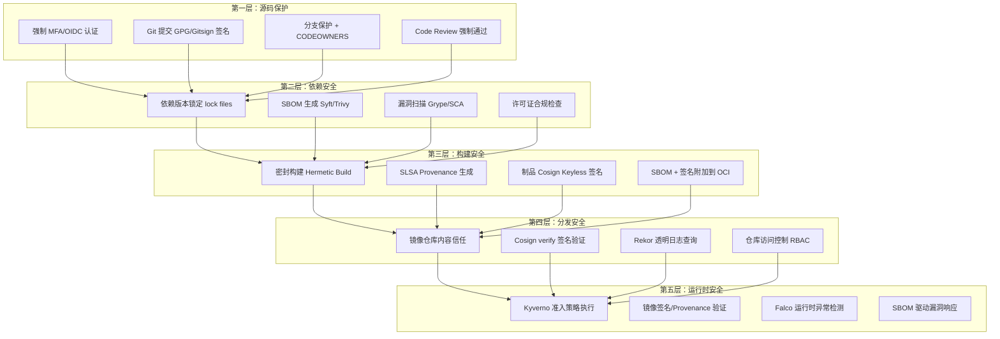
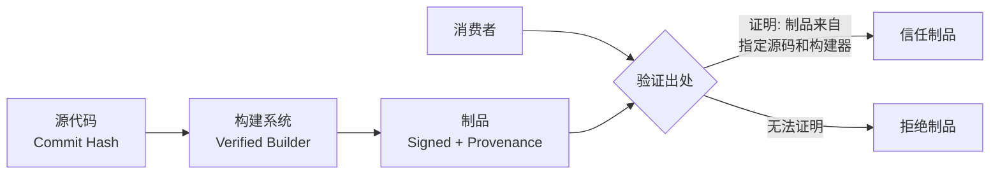
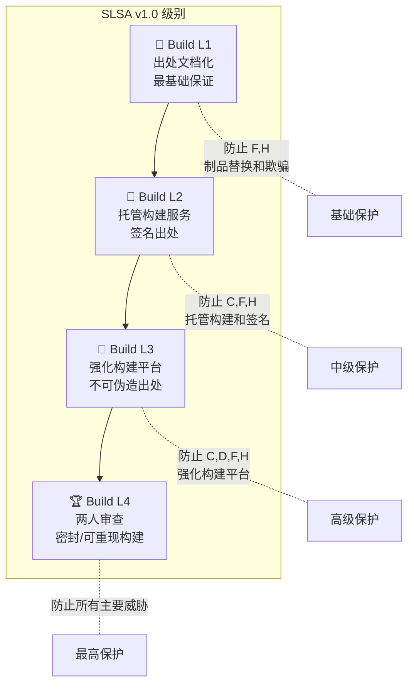
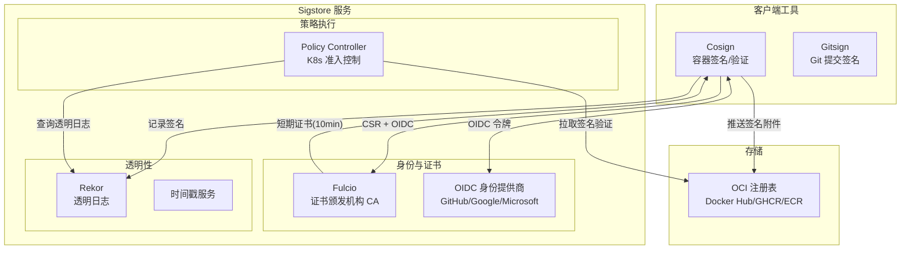
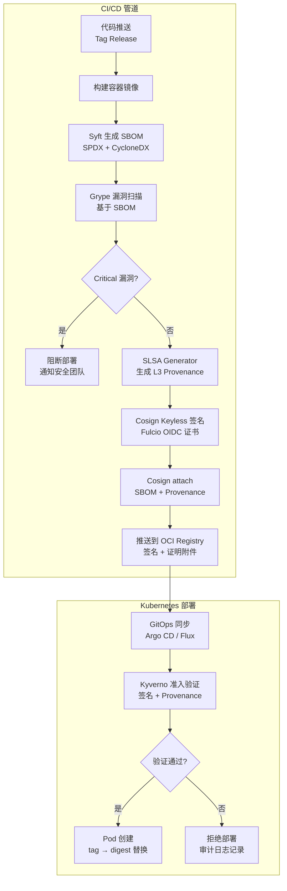

软件供应链安全是云原生时代安全体系中最关键的攻防前沿。SolarWinds 构建系统被植入 SUNBURST 后门（2020）、Log4Shell 漏洞席卷全球数亿 Java 应用（2021）、XZ Utils 通过社会工程学渗透开源维护者账户植入后门（2024）——这些事件揭示了一个共同的结构性缺陷：**从代码提交到生产部署的完整链条中，缺乏可验证的完整性证明与自动化的信任传递机制**。本文档系统梳理供应链安全的四大技术支柱——**SBOM（软件物料清单）**、**SLSA（供应链完整性级别）**、**Sigstore（无密钥签名基础设施）** 与 **合规自动化**——的架构原理、工具链实现与 Kubernetes 生产环境集成方案，帮助高级开发者构建从源码到运行时的端到端供应链安全体系。

Sources: [01-supply-chain-security-overview.md](domain-39-supply-chain-security/01-supply-chain-security-overview.md#L1-L53), [20-kubernetes-supply-chain-security-sbom-slsa-sigstore.md](domain-19-papers/20-kubernetes-supply-chain-security-sbom-slsa-sigstore.md#L1-L53)

## 供应链威胁全景与攻击模型

### 从 SolarWinds 到 XZ Utils：攻击模式的演进

供应链攻击的核心特征在于**利用信任链传播恶意载荷**——攻击者不必直接突破目标系统的防御，而是通过污染构建工具链、劫持依赖包或篡改分发渠道，将恶意代码以"合法"身份注入下游。下图展示了 Kubernetes 环境下供应链攻击的五个阶段及其关联的攻击向量：

```mermaid
graph LR
    subgraph "代码阶段 Code"
        A1[源代码仓库] -->|恶意提交/依赖投毒| A2[第三方依赖]
        A2 --> A3[开源组件漏洞]
    end

    subgraph "构建阶段 Build"
        B1[CI/CD系统] -->|构建系统入侵| B2[构建脚本篡改]
        B2 --> B3[编译器/工具链攻击]
        B3 --> B4[构建产物注入]
    end

    subgraph "镜像阶段 Image"
        C1[Dockerfile] -->|基础镜像篡改| C2[基础镜像漏洞]
        C2 --> C3[镜像层注入]
        C3 --> C4[未签名镜像]
    end

    subgraph "仓库阶段 Registry"
        D1[镜像仓库] -->|仓库凭据泄露| D2[镜像替换攻击]
        D2 --> D3[Tag劫持]
        D3 --> D4[中间人攻击]
    end

    subgraph "部署阶段 Deploy"
        E1[K8s集群] -->|准入控制绕过| E2[未验证镜像部署]
        E2 --> E3[运行时恶意行为]
        E3 --> E4[横向移动/数据泄露]
    end

    A3 -->|流入| B1
    B4 -->|推送| C1
    C4 -->|推送| D1
    D4 -->|拉取| E1
```



重大事件的教训形成了清晰的防御映射：SolarWinds 暴露了**构建来源证明（Provenance）缺失**的致命风险；Log4Shell 凸显了**缺乏 SBOM 导致漏洞影响面评估从数分钟膨胀到数周**的运营灾难；XZ Utils 则证明 SLSA Level 3+ 要求的**密封构建（Hermetic Build）** 是防御社会工程学攻击的关键控制手段。

Sources: [01-supply-chain-security-overview.md](domain-39-supply-chain-security/01-supply-chain-security-overview.md#L96-L268), [20-kubernetes-supply-chain-security-sbom-slsa-sigstore.md](domain-19-papers/20-kubernetes-supply-chain-security-sbom-slsa-sigstore.md#L10-L98)

### OWASP 十大供应链风险与 STRIDE 威胁建模

| 排名 | 风险类型 | 描述 | 严重程度 | 对应控制 |
|------|---------|------|---------|---------|
| 1 | 代码注入攻击 | 恶意代码植入开源组件 | 严重 | 代码审查 + SLSA |
| 2 | 依赖混淆 | 内部包与公共包命名冲突 | 高危 | 私有镜像 + scoped packages |
| 3 | 过时的开源依赖 | 使用含已知漏洞的版本 | 高危 | SBOM + Grype 扫描 |
| 4 | 未验证的传递依赖 | 间接依赖引入漏洞 | 高危 | SBOM 递归分析 |
| 5 | 缺乏完整性检查 | 下载包未进行哈希验证 | 中危 | Cosign 签名验证 |
| 6 | 许可证合规风险 | 使用许可证不兼容的组件 | 中危 | SPDX 许可证清单 |
| 7 | CI/CD 管道未保护 | 自动化系统缺乏安全控制 | 严重 | SLSA L3 + GitHub OIDC |
| 8 | 不安全的系统配置 | 构建环境配置错误 | 高危 | 密封构建 |
| 9 | 私有包外泄 | 内部组件意外发布到公共仓库 | 高危 | 仓库访问控制 |
| 10 | 软件物料清单缺失 | 无法追踪软件组件 | 高危 | Syft/Trivy SBOM 生成 |

对供应链环境应用 **STRIDE 威胁模型**可进一步明确防御方向：**欺骗**对应包命名抢注和 Git 提交伪造，防御手段是 Gitsign 提交签名；**篡改**对应 SolarWinds/Codecov 式的构建产物修改，防御手段是 SLSA Provenance + Cosign 签名；**抵赖**对应无审计日志的恶意变更，防御手段是 Rekor 透明日志的不可否认记录。这三种威胁恰好分别由 Sigstore 生态的三个核心组件（Gitsign、Cosign、Rekor）覆盖。

Sources: [01-supply-chain-security-overview.md](domain-39-supply-chain-security/01-supply-chain-security-overview.md#L402-L516)

## 端到端供应链安全架构

### 五层深度防御体系

供应链安全绝非单一工具可以解决，而是需要构建**从源码到运行时的五层纵深防御体系**。每一层解决不同阶段的特定威胁，层与层之间的安全信号通过标准化的机器可读格式（SBOM、Provenance、签名）传递，最终在 Kubernetes 准入控制层汇聚为统一的策略决策。



这五层防御通过 **NIST SSDF（Secure Software Development Framework）v1.1** 实现合规映射：**PO（组织准备）** 覆盖工具链选型和安全策略定义；**PS（软件保护）** 覆盖代码保护、构建环境隔离和发布管道签名；**PW（安全开发）** 覆盖安全组件重用和构建选项配置；**RV（漏洞响应）** 覆盖基于 SBOM 的漏洞识别和 VEX 声明。

Sources: [01-supply-chain-security-overview.md](domain-39-supply-chain-security/01-supply-chain-security-overview.md#L519-L563), [20-kubernetes-supply-chain-security-sbom-slsa-sigstore.md](domain-19-papers/20-kubernetes-supply-chain-security-sbom-slsa-sigstore.md#L100-L141)

### 技术栈全景与工具选型矩阵

| 能力域 | 核心工具 | 标准格式 | 在 Kubernetes 中的集成点 |
|--------|---------|---------|------------------------|
| SBOM 生成 | Syft (Anchore), Trivy | SPDX 2.3/3.0, CycloneDX 1.5/1.6 | CI/CD → OCI Artifact 附件 |
| 漏洞扫描 | Grype, Trivy, Snyk | CVE/CVSS, VEX | SBOM 驱动扫描 → 准入策略 |
| 构建完整性 | SLSA Framework, in-toto | SLSA Provenance v0.2/v1.0 | GitHub Actions / Tekton Chains |
| 制品签名 | Cosign (Sigstore) | ECDSA-P256 + X.509 | OCI Registry 签名附件 |
| 证书颁发 | Fulcio (Sigstore) | 短期 X.509（10分钟有效期） | OIDC → Fulcio → 签名 |
| 透明日志 | Rekor (Sigstore) | Merkle Tree + SET | 不可否认审计追踪 |
| 策略执行 | Kyverno, OPA Gatekeeper | ClusterPolicy / Constraint | Kubernetes 准入控制 |
| 合规自动化 | OpenSSF Scorecard, VEX | SOC 2 / PCI-DSS / FedRAMP | 持续合规证据收集 |

Sources: [README.md](domain-39-supply-chain-security/README.md#L63-L86), [09-policy-controller-verification.md](domain-39-supply-chain-security/09-policy-controller-verification.md#L1-L70)

## SBOM：软件物料清单——供应链透明度的基础

### SBOM 的本质与价值

**软件物料清单（Software Bill of Materials, SBOM）** 是供应链安全的基石，它回答了三个核心问题：**这是什么软件？谁开发/维护它？它与其他组件有什么关系？** 类比制造业中的 BOM（Bill of Materials），SBOM 将软件分解为可审计的原子组件，每个组件包含包名、版本、供应商、许可证和唯一标识符（PURL）等最小数据要素。NTIA（美国国家电信和信息管理局）定义了 SBOM 的七个最小数据字段：供应商名称、组件名称、版本、唯一标识符、依赖关系、SBOM 作者和时间戳。

SBOM 的核心价值在 Log4Shell 事件中得到了最直观的验证：**拥有完整 SBOM 的组织平均响应时间 < 2 小时，而没有 SBOM 的组织平均响应时间 > 5 天**。通过将 SBOM 与 NVD/OSV/GitHub Advisory 等漏洞数据库进行自动化匹配，组织可以在新漏洞披露后数分钟内精确定位受影响组件，而非耗费数周进行人工清查。

Sources: [03-sbom-generation-management.md](domain-39-supply-chain-security/03-sbom-generation-management.md#L24-L134)

### SPDX vs CycloneDX：两大标准的选型决策

SBOM 领域存在两大主流格式标准，各自的适用场景和优势领域有明确区分：

| 比较维度 | SPDX 2.3/3.0 | CycloneDX 1.5/1.6 |
|---------|-------------|-------------------|
| **主导组织** | Linux Foundation | OWASP |
| **国际标准** | ISO/IEC 5962:2021 | 非ISO（OWASP 规范） |
| **核心优势** | 开源许可证追踪（完整 LicenseConcluded/LicenseDeclared） | 安全漏洞管理（原生 VEX 支持） |
| **格式支持** | JSON, YAML, RDF, Tag-Value, XML | JSON, XML, Protocol Buffers |
| **VEX 集成** | 有限 | 强（漏洞可利用性交换原生支持） |
| **适用场景** | 政府/国防合规、许可证管理 | 安全运营、漏洞管理、运行时保护 |
| **AI/ML 支持** | SPDX 3.0 支持 AI/ML 模型 BOM | CBOM（密码学 BOM）支持 |

**选型建议**：面向政府/国防合规场景优选 SPDX（ISO 国际标准），面向安全运营和漏洞管理场景优选 CycloneDX（VEX 集成优势）。企业最佳实践是**双格式输出**——Syft 同时支持两种格式生成，在 CI/CD 中同时输出 SPDX 和 CycloneDX 格式以覆盖两类合规需求。

Sources: [03-sbom-generation-management.md](domain-39-supply-chain-security/03-sbom-generation-management.md#L139-L200), [20-kubernetes-supply-chain-security-sbom-slsa-sigstore.md](domain-19-papers/20-kubernetes-supply-chain-security-sbom-slsa-sigstore.md#L143-L195)

### Syft 与 Trivy：SBOM 生成实践

**Syft（Anchore）** 是当前最成熟的 SBOM 生成工具，支持从容器镜像、文件系统、OCI 布局等多种源提取依赖信息。其核心能力在于覆盖 30+ 语言生态系统的包解析器（Go modules、npm、pip、Maven、Cargo 等），以及同时输出 SPDX 和 CycloneDX 双格式。

```bash
# Syft: 从容器镜像生成 SBOM（CycloneDX 格式）
syft ghcr.io/your-org/your-app:v1.0.0 -o cyclonedx-json > sbom.cdx.json

# Syft: 从容器镜像生成 SBOM（SPDX 格式）
syft ghcr.io/your-org/your-app:v1.0.0 -o spdx-json > sbom.spdx.json

# Syft: 从文件系统目录生成 SBOM
syft dir:./my-project -o cyclonedx-json > sbom.json

# Trivy: 同时生成 SBOM 并进行漏洞扫描
trivy image --format spdx-json -o sbom.spdx.json ghcr.io/your-org/your-app:v1.0.0
trivy sbom --severity HIGH,CRITICAL sbom.spdx.json
```

**Trivy（Aqua Security）** 则提供 SBOM 生成与漏洞扫描的一体化能力，适合 CI/CD 管道中的单工具集成方案。两种工具的关键差异在于：Syft 专注于精确的依赖发现和包解析，SBOM 质量更高；Trivy 则在 SBOM 生成后直接集成了漏洞匹配引擎，提供了更流畅的扫描体验。

Sources: [03-sbom-generation-management.md](domain-39-supply-chain-security/03-sbom-generation-management.md#L96-L134), [20-kubernetes-supply-chain-security-sbom-slsa-sigstore.md](domain-19-papers/20-kubernetes-supply-chain-security-sbom-slsa-sigstore.md#L197-L234)

### SBOM 驱动的漏洞治理：Grype 与 VEX

SBOM 的价值在漏洞治理环节被完全释放。**Grype（Anchore）** 是专门针对 SBOM 进行漏洞匹配的扫描引擎，其工作流程为：读取 SBOM → 提取组件 PURL/CPE → 查询漏洞数据库（NVD/OSV/GHSA）→ 按匹配置信度分级（HIGH/MEDIUM/LOW）→ 输出漏洞报告。Grype 直接扫描 SBOM 文件的能力使得漏洞分析无需重新解构容器镜像，实现秒级响应。

```bash
# Grype: 基于 SBOM 进行漏洞扫描
grype sbom:./sbom.cdx.json --fail-on critical

# Grype: 仅显示有已知修复的漏洞
grype sbom:./sbom.spdx.json --only-fixed -o table

# Grype: 输出 SARIF 格式（集成 GitHub Security）
grype sbom:./sbom.cdx.json -o sarif > grype-results.sarif
```

**VEX（Vulnerability Exploitability eXchange）** 是漏洞治理的重要补充，允许组织声明某个漏洞在特定上下文中"不可利用"或"已缓解"，从而避免无意义的告警噪音。CycloneDX 原生支持 VEX 格式，企业可以在 SBOM 中直接关联 VEX 文档，实现漏洞影响声明的自动化传播。漏洞治理的四种响应路径为：**修复**（升级依赖）、**缓解**（WAF/配置变更）、**接受**（记录接受理由）、**误报标注**（VEX 标记）。

Sources: [04-sbom-vulnerability-analysis.md](domain-39-supply-chain-security/04-sbom-vulnerability-analysis.md#L24-L100)

## SLSA：供应链完整性级别——构建来源的可验证信任

### SLSA 框架核心：从出处到信任

**SLSA（Supply chain Levels for Software Artifacts，读作 "salsa"）** 是 Google 在 2021 年提出并开源给 OpenSSF 维护的供应链安全框架。SLSA 解决的核心问题是：**"我如何确信这个软件制品确实来自声明的源码，且构建过程未被篡改？"** 其答案是通过**可验证的、机器可读的出处（Provenance）证明**——一份记录了构建器身份、源码引用、构建参数和环境元数据的签名文档。



SLSA 防御矩阵清晰地定义了各级别对不同威胁的覆盖范围。核心防御能力从 L1 到 L4 递增：L1 防止制品替换和欺骗（威胁 F, H）；L2 在此基础上增加对构建注入的防御（威胁 C, D）；L3 通过强化构建平台实现防篡改出处（威胁 C, D, F, H）；L4 通过两人审查和密封/可重现构建防御所有主要威胁。

Sources: [05-slsa-levels-implementation.md](domain-39-supply-chain-security/05-slsa-levels-implementation.md#L24-L89)

### SLSA Build L1-L4：渐进式完整性保证



| SLSA 级别 | 核心要求 | 构建出处 | 签名 | 防篡改 | 典型实现 |
|-----------|---------|---------|------|--------|---------|
| **L1** | 构建过程脚本化，无手动步骤 | 机器可读出处 | ❌ 不要求 | ❌ 不要求 | 任意 CI/CD + Provenance 脚本 |
| **L2** | 使用托管构建服务 | 签名的来源证明 | ✅ 必须 | ❌ 不要求 | GitHub Actions + SLSA Generator |
| **L3** | 构建平台安全控制 | 不可伪造出处 | ✅ 必须 | ✅ 必须 | SLSA GitHub Generator 可复用工作流 |
| **L4** | 两人审查 + 密封构建 | 完整证明链 | ✅ 必须 | ✅ 密封 | 自建构建平台 + in-toto |

**SLSA L1** 是组织启动供应链安全旅程的起点——仅需在 CI/CD 中生成 JSON 格式的构建出处文档，记录构建器标识（`builder.id`）、源码引用（`configSource`）和构建时间戳。**SLSA L2** 要求使用受信任的托管构建服务（如 GitHub Actions）并通过 Sigstore 对 Provenance 进行签名。**SLSA L3** 是目前 GitHub 生态中可达到的最高级别，要求使用 SLSA GitHub Generator 的可复用工作流，该工作流在隔离的构建作业中运行，确保构建参数不可被外部注入篡改。

Sources: [05-slsa-levels-implementation.md](domain-39-supply-chain-security/05-slsa-levels-implementation.md#L93-L200), [06-github-actions-slsa-build.md](domain-39-supply-chain-security/06-github-actions-slsa-build.md#L11-L183)

### GitHub Actions SLSA 构建：从理论到实践

SLSA GitHub Generator 项目提供了预构建的可复用工作流，使开发者无需深入理解 SLSA 底层机制即可在 GitHub Actions 中实现 Level 3 构建。其架构核心是**隔离的构建作业**：调用方工作流（Caller Workflow）触发 Generator 的可复用工作流，后者在独立的运行环境中执行构建、生成 Provenance、通过 Fulcio 签名并记录到 Rekor 透明日志。

```yaml
# SLSA Level 3 容器镜像构建示例
name: Release with SLSA Level 3 Provenance

on:
  push:
    tags: ['v[0-9]+.[0-9]+.[0-9]+']

permissions:
  contents: read
  packages: write
  id-token: write    # OIDC 令牌（Fulcio 签名必需）

jobs:
  build:
    runs-on: ubuntu-latest
    outputs:
      digest: ${{ steps.build.outputs.digest }}
    steps:
      - uses: actions/checkout@v4
      - name: Build container image
        id: build
        run: |
          docker build -t ghcr.io/your-org/your-app:${{ github.ref_name }} .
          DIGEST=$(docker push ghcr.io/your-org/your-app:${{ github.ref_name }} 2>&1 | grep digest | awk '{print $2}')
          echo "digest=$DIGEST" >> "$GITHUB_OUTPUT"

  provenance:
    needs: [build]
    uses: slsa-framework/slsa-github-generator/.github/workflows/generator_container_slsa3.yml@v1.9.0
    with:
      image: ghcr.io/your-org/your-app
      digest: ${{ needs.build.outputs.digest }}
    permissions:
      contents: read
      packages: write
      id-token: write
```

| 可复用工作流 | 用途 | SLSA 级别 |
|-------------|------|-----------|
| `generator_generic_slsa3.yml` | 通用制品（二进制、归档文件） | Level 3 |
| `generator_container_slsa3.yml` | 容器镜像 | Level 3 |
| `builder_go_slsa3.yml` | Go 语言构建器 | Level 3 |
| `builder_nodejs_slsa3.yml` | Node.js 构建器 | Level 3 |

生成的 Provenance 遵循 **in-toto Attestation Framework** 格式（`_type: https://in-toto.io/Statement/v0.1`），包含构建器标识（`builder.id`）、构建类型（`buildType`）、配置源（`configSource` 包含仓库 URI 和 commit digest）以及构建元数据（调用 ID、时间戳、完整性标记）。这份 Provenance 通过 Sigstore 签名后，可被下游消费者通过 `slsa-verifier` 工具独立验证。

Sources: [06-github-actions-slsa-build.md](domain-39-supply-chain-security/06-github-actions-slsa-build.md#L136-L200), [05-slsa-levels-implementation.md](domain-39-supply-chain-security/05-slsa-levels-implementation.md#L145-L200)

## Sigstore：无密钥签名基础设施

### Sigstore 生态架构：Cosign、Fulcio 与 Rekor

**Sigstore** 是 Linux Foundation 旗下的开源项目，通过将代码签名与透明日志相结合，彻底解决了传统密钥管理的复杂性问题。Sigstore 生态由三个核心服务构成协同工作的信任链：**Cosign** 是客户端签名/验证工具；**Fulcio** 是证书颁发机构（CA），将 OIDC 身份转换为短期 X.509 代码签名证书；**Rekor** 是不可篡改的透明日志系统，记录所有签名事件。



Sigstore 的核心创新是 **Keyless（无密钥）签名模式**：开发者不需要生成、存储或管理任何密钥对。签名流程为：客户端生成临时 EC P-256 密钥对 → 通过 OIDC 认证获取身份令牌 → 向 Fulcio 提交 CSR（证书签名请求）+ OIDC 令牌 → Fulcio 颁发仅 10 分钟有效期的 X.509 证书 → 客户端使用私钥签名制品后立即销毁私钥 → 签名记录提交到 Rekor 透明日志。这种设计消除了密钥泄露、证书过期管理和私钥保管等传统痛點。

Sources: [07-sigstore-cosign-signing.md](domain-39-supply-chain-security/07-sigstore-cosign-signing.md#L1-L90), [08-fulcio-rekor-transparency.md](domain-39-supply-chain-security/08-fulcio-rekor-transparency.md#L1-L65)

### Cosign 容器镜像签名实践

Cosign 的签名产物以 **OCI Artifact** 形式存储在镜像仓库中，与被签名的镜像通过 tag 关联（签名 tag 格式为 `sha256-<digest>.sig`）。这种设计确保签名、SBOM、Provenance 等证明材料与镜像本身一同分发，无需额外的签名存储基础设施。

```bash
# Keyless 签名（CI/CD 环境中通过 OIDC 自动认证）
cosign sign --yes ghcr.io/your-org/your-app:v1.0.0

# 签名并附加注解（构建元数据）
cosign sign --yes \
  --annotations "builder=github-actions" \
  --annotations "commit=$GIT_SHA" \
  ghcr.io/your-org/your-app:v1.0.0

# 附加 SBOM 到镜像
cosign attach sbom --sbom ./sbom.cdx.json \
  ghcr.io/your-org/your-app:v1.0.0

# 附加 Provenance 到镜像
cosign attest --yes \
  --predicate ./provenance.json \
  --type slsaprovenance \
  ghcr.io/your-org/your-app:v1.0.0

# 验证镜像签名（Keyless 验证）
cosign verify \
  --certificate-oidc-issuer https://token.actions.githubusercontent.com \
  --certificate-identity-regexp "https://github.com/your-org/.*" \
  ghcr.io/your-org/your-app:v1.0.0

# 验证 Provenance 证明
cosign verify-attestation \
  --type slsaprovenance \
  --certificate-oidc-issuer https://token.actions.githubusercontent.com \
  ghcr.io/your-org/your-app:v1.0.0
```

Cosign 的 `attest` 命令支持附加任意类型的证明材料（SBOM、SLSA Provenance、自定义 Attestation），每种证明以独立的 OCI Artifact 存储，通过 `cosign verify-attestation --type` 指定要验证的证明类型。这使得单次签名操作可以同时提供**完整性签名 + SBOM + 构建出处**三重保证。

Sources: [07-sigstore-cosign-signing.md](domain-39-supply-chain-security/07-sigstore-cosign-signing.md#L174-L200)

### Fulcio 证书与 Rekor 透明日志：信任的不可篡改基础

**Fulcio** 颁发的证书是标准 X.509 v3 证书，包含特殊的 OID 扩展，将 OIDC 身份信息直接嵌入证书字段。以 GitHub Actions 为例，Fulcio 证书的 SAN（Subject Alternative Name）字段包含完整的工作流引用路径（如 `URI:https://github.com/your-org/your-repo/.github/workflows/release.yml@refs/tags/v1.0.0`），并通过自定义 OID 扩展（`1.3.6.1.4.1.57264.*`）记录 OIDC Issuer、GitHub Event、Repository、Run ID 等完整构建上下文。证书有效期仅 **10 分钟**，无需复杂的吊销机制。

**Rekor** 透明日志基于 Merkle Tree 数据结构，提供不可篡改的签名事件记录。每次签名操作都会在 Rekor 中记录一个条目（包含签名值、证书、制品哈希和时间戳），任何人都可以通过 Rekor API 查询特定制品的完整签名历史。这种透明性实现了**不可否认性**（Non-Repudiation）——签名者无法否认其签名行为，审计者可以验证签名的完整时间线。

Sources: [08-fulcio-rekor-transparency.md](domain-39-supply-chain-security/08-fulcio-rekor-transparency.md#L65-L177)

## 策略执行：Kubernetes 准入控制层的供应链守卫

### Kyverno 镜像验证策略

供应链安全的最后一道防线在 Kubernetes 准入控制层——即使攻击者成功污染了镜像仓库，没有通过签名验证的镜像也无法被部署到集群中。**Kyverno** 是当前最成熟的原生镜像验证方案，通过 `verifyImages` 规则在 Pod 创建时拦截并验证镜像签名。

```yaml
# Kyverno: 验证镜像必须由 GitHub Actions CI/CD 签名
apiVersion: kyverno.io/v1
kind: ClusterPolicy
metadata:
  name: verify-image-signatures
  annotations:
    policies.kyverno.io/category: Software Supply Chain Security
    policies.kyverno.io/severity: high
spec:
  validationFailureAction: Enforce    # 强制拒绝未签名镜像
  background: true                     # 扫描现有资源
  rules:
    - name: verify-production-images
      match:
        any:
          - resources:
              kinds: [Pod]
              namespaces: [production, staging]
      verifyImages:
        - imageReferences:
            - "ghcr.io/your-org/*"
          attestors:
            - count: 1
              entries:
                - keyless:
                    url: https://fulcio.sigstore.dev
                    issuer: https://token.actions.githubusercontent.com
                    subject: >-
                      https://github.com/your-org/*/github/workflows/release.yml@refs/tags/*
                    rekor:
                      url: https://rekor.sigstore.dev
          mutateDigest: true     # 将 tag 替换为 digest（防止 tag 变更）
          required: true         # 签名验证失败则拒绝
```

Kyverno 的 `verifyImages` 规则支持三种验证模式：**Keyless 验证**（推荐，通过 Fulcio 证书中的 OIDC Issuer 和 Subject 匹配身份）、**公钥验证**（使用预先分发的公钥）和 **Key 链验证**（多级签名链）。`mutateDigest: true` 选项会将 Pod 中的镜像引用从 tag（如 `v1.0.0`）自动替换为 digest（如 `sha256:abc123...`），防止 tag 被重新指向恶意镜像的"标签漂移"攻击。

Sources: [09-policy-controller-verification.md](domain-39-supply-chain-security/09-policy-controller-verification.md#L1-L200)

### 策略引擎对比：Kyverno vs Sigstore Policy Controller vs OPA Gatekeeper

| 评估维度 | Kyverno | Sigstore Policy Controller | OPA Gatekeeper |
|---------|---------|--------------------------|----------------|
| 镜像签名验证 | ✅ 原生支持 | ✅ 核心功能 | ⚠️ 需外部数据源 |
| SBOM 验证 | ✅ 支持 | ✅ 支持 | ⚠️ 需自定义 |
| SLSA Provenance 验证 | ✅ 支持 | ✅ 支持 | ⚠️ 需自定义 |
| 策略定义语言 | YAML | YAML | Rego（学习曲线高） |
| 策略异常管理 | PolicyException CRD | 命名空间选择器 | ConstraintExclusion |
| 多集群策略 | GitOps + KyvCLI | 支持 | 支持 |
| 审计模式 | Audit → Enforce 渐进 | Warn → Enforce | DryRun → Enforce |
| 学习曲线 | 中等 | 低 | 高 |

**推荐选型**：对于 Kubernetes 原生环境，Kyverno 是首选方案——YAML 定义策略降低学习成本，`verifyImages` 原生支持 Sigstore Keyless 验证，`mutateDigest` 自动将 tag 替换为 digest 提供额外安全保障。对于已有 OPA Gatekeeper 投资的组织，可通过外部数据提供者（如 Ratify）实现签名验证。

Sources: [09-policy-controller-verification.md](domain-39-supply-chain-security/09-policy-controller-verification.md#L58-L69)

## 合规自动化：从手动审计到持续合规

### 合规框架与供应链安全控制映射

现代合规框架（SOC 2 Type II、PCI-DSS v4.0、FedRAMP、ISO 27001）的核心要求与供应链安全技术栈之间存在精确的映射关系。关键映射点包括：**SOC 2 CC8.1（变更管理）** → 镜像签名验证 + SLSA Provenance；**SOC 2 CC7.1（漏洞管理）** → SBOM + Grype 扫描；**PCI-DSS 6.2.4（软件完整性）** → Cosign 签名 + Kyverno 准入策略；**FedRAMP CM-14（公开签名发布）** → Rekor 透明日志审计。

| 合规要求 | 框架章节 | 技术实现 | 自动化工具 |
|---------|---------|---------|----------|
| 软件组件清单 | SOC 2 CC7.1, PCI 12.3.4 | SBOM 生成 | Syft, SPDX |
| 已知漏洞管理 | SOC 2 CC7.1, PCI 6.3.3 | 漏洞扫描 | Trivy, Grype |
| 代码完整性验证 | SOC 2 CC8.1, PCI 6.2.4 | 镜像签名 | Cosign, SLSA |
| 变更控制记录 | SOC 2 CC8.1, FedRAMP CM-3 | 来源证明 | Rekor, GitHub Audit |
| 审计日志 | SOC 2 CC7.2, PCI 10 | 日志聚合 | Rekor, Falco, CloudTrail |
| 部署验证 | FedRAMP CM-14 | 策略执行 | Kyverno, OPA |

Sources: [10-compliance-automation-audit.md](domain-39-supply-chain-security/10-compliance-automation-audit.md#L11-L61)

### SOC 2 变更管理自动化工作流

合规自动化的核心思想是将合规要求转化为**可自动执行的代码**，通过 CI/CD 管道中的自动化作业持续收集审计证据。以 SOC 2 CC8.1（变更管理）为例，自动化工作流包括：**变更请求记录**（PR 创建时自动生成 Change ID 并存储到合规数据库）、**变更审批验证**（合并前验证 PR 已获批准且审核者非请求者）、**变更执行记录**（构建和部署时生成 SLSA Provenance 并签名）、**变更验证**（部署后通过 Kyverno 策略自动验证镜像签名和漏洞扫描状态）。

```yaml
# SOC 2 CC8.1a: 自动记录变更请求
- name: Capture change metadata
  run: |
    CHANGE_ID="CHG-$(date +%Y%m%d)-${{ github.event.pull_request.number }}"
    RISK_LEVEL="low"
    # 基于文件变更路径的风险评估
    if git diff --name-only HEAD~1 HEAD | grep -qE "(security|auth|crypto)"; then
      RISK_LEVEL="high"
    elif git diff --name-off HEAD~1 HEAD | grep -qE "(helm|k8s|deploy)"; then
      RISK_LEVEL="medium"
    fi
    # 存储到合规证据库
    aws s3 cp change-record.json "s3://compliance-evidence/soc2/cc8-1/changes/$CHANGE_ID.json"
```

企业级合规自动化的最终目标是实现**持续合规**——不再依赖周期性的人工审计，而是通过自动化管道在每次代码变更时即时收集合规证据，确保组织在任何时间点都处于合规状态。

Sources: [10-compliance-automation-audit.md](domain-39-supply-chain-security/10-compliance-automation-audit.md#L64-L200)

## 供应链安全成熟度模型：从 L1 到 L5 的进阶路径

**供应链安全成熟度模型（SCSM）** 参考了 CMMI 和 BSIMM 的设计思想，为组织提供从初始级（L1）到优化级（L5）的清晰进阶路径。每个级别有明确可量化的指标和可落地的实施清单，并与 SLSA 级别、OpenSSF Scorecard 分数和 NIST CSF 函数形成映射关系。

| 成熟度级别 | SLSA 对应 | OpenSSF Scorecard | 核心能力要求 | 关键指标 |
|-----------|----------|-------------------|-------------|---------|
| **L1 初始** | SLSA L0 | 0-3 分 | 基本漏洞意识，手动流程 | 无 SBOM，手动依赖管理 |
| **L2 已管理** | SLSA L1 | 3-5 分 | 依赖锁定文件，基础 SBOM，镜像扫描 | 95%+ 项目使用 lock files，SBOM 生成率 > 80% |
| **L3 已定义** | SLSA L2/L3 | 5-7 分 | SBOM 完整生命周期，SLSA 出处，镜像签名 | 已知高危漏洞 < 7 天修复，100% 镜像签名 |
| **L4 量化管理** | SLSA L3 | 7-9 分 | 全面度量，风险量化，预测分析 | 风险量化覆盖率 > 90%，MTTR < 24h |
| **L5 优化** | SLSA L4 | 9-10 分 | 持续改进，行业领先，自适应防御 | 零未处理高危漏洞，自动化合规 100% |

**推荐的实施顺序**：对于大多数组织，从 L2 开始是性价比最高的路径——先建立依赖锁定（Dependabot/Renovate）、基础 SBOM 生成（Syft）和容器镜像扫描（Trivy/Grype），这三个能力的实施成本相对较低但防御价值极高。达到 L2 后，再逐步推进 L3 的 SLSA 出处证明和 Cosign Keyless 签名，最后通过 Kyverno 准入策略将所有安全信号汇聚为部署前的强制验证。

Sources: [02-supply-chain-maturity-model.md](domain-39-supply-chain-security/02-supply-chain-maturity-model.md#L1-L154)

## 端到端工作流集成：从代码提交到安全部署

将上述四大技术支柱整合为一个完整的 CI/CD 工作流，是供应链安全从理论走向实践的关键一步。以下展示了在 GitHub Actions 中集成 SBOM 生成、SLSA Provenance、Cosign 签名和 Kyverno 策略验证的完整流程：



这个端到端工作流在 **预防** 层面通过 SLSA L3 保证构建不可被篡改，在 **检测** 层面通过 SBOM + Grype 实现漏洞的自动化发现和匹配，在 **响应** 层面通过 Rekor 透明日志提供完整的签名审计追踪，在 **恢复** 层面通过 SBOM 支持快速定位受影响组件并重建安全镜像。四个层面形成闭环，确保供应链安全能力的持续运营。

Sources: [01-supply-chain-security-overview.md](domain-39-supply-chain-security/01-supply-chain-security-overview.md#L1700-L1744), [09-software-bill-of-materials.md](domain-18-production-operations/09-software-bill-of-materials.md#L1-L10)

## 延伸阅读与关联知识域

供应链安全是一个跨领域的系统工程，以下关联页面提供了更深入的垂直方向参考：

- **[安全合规：RBAC、网络安全策略、运行时安全与零信任架构](11-an-quan-he-gui-rbac-wang-luo-an-quan-ce-lue-yun-xing-shi-an-quan-yu-ling-xin-ren-jia-gou)** — 零信任架构是供应链安全的理论基础，运行时安全（Falco）是部署后的第二道防线
- **[生产运维：GitOps、FinOps、灾备恢复与变更管理](20-sheng-chan-yun-wei-gitops-finops-zai-bei-hui-fu-yu-bian-geng-guan-li)** — GitOps 管道是供应链安全策略的部署载体
- **[平台运维与扩展生态：Helm、CI/CD、Operator 开发与服务网格](21-ping-tai-yun-wei-yu-kuo-zhan-sheng-tai-helm-ci-cd-operator-kai-fa-yu-fu-wu-wang-ge)** — CI/CD 管道安全是 SLSA 构建完整性的实施基础
- **[CNCF 云原生全景图：218 个开源项目全量解析](26-cncf-yun-yuan-sheng-quan-jing-tu-218-ge-kai-yuan-xiang-mu-quan-liang-jie-xi)** — Sigstore、in-toto、TUF、SPDX 等 CNCF 项目构成供应链安全工具链生态
- **[YAML 配置清单：Kubernetes 全资源字段参考手册](29-yaml-pei-zhi-qing-dan-kubernetes-quan-zi-yuan-zi-duan-can-kao-shou-ce)** — Kyverno ClusterPolicy 和 OPA ConstraintTemplate 的完整字段参考

本知识库中 `domain-39-supply-chain-security` 目录包含 10 个深度文件（总计超过 20,000 行），涵盖从威胁模型到合规自动化的完整技术体系。建议高级开发者按 **概述 → SBOM 生成 → 漏洞分析 → SLSA 实施 → Sigstore 签名 → 策略验证 → 合规自动化** 的顺序进行深度学习。