在 Kubernetes 的世界里，**YAML 清单文件是声明式配置的基石**——你用 YAML 告诉集群"我想要什么状态"，控制器负责将实际状态收敛到你的期望。本手册覆盖 Kubernetes v1.25 至 v1.32 全部 60+ 种原生 API 资源及常用生态工具的完整 YAML 配置规范，按 36 篇专题文档组织，从零基础的最小可用示例到专家级完整字段规格，每一行配置都附带中文注释与版本兼容标注。无论你是在写第一个 Deployment 还是在设计企业级 CRD Schema，都可以在这里找到即查即用的参考。

Sources: [README.md](domain-32-yaml-manifests/README.md#L1-L167)

## 为什么 YAML 清单如此重要？

Kubernetes 采用**声明式 API**设计范式：用户提交 YAML 描述期望状态，API Server 存储到 etcd，各控制器持续驱动实际状态向期望状态收敛。这意味着 YAML 不仅仅是一种配置格式，它是你与集群之间的**唯一契约**。掌握 YAML 清单等于掌握了 Kubernetes 的核心交互语言。这一设计理念带来了四个关键优势：纯文本格式天然适配 Git 版本控制与 GitOps 工作流；相比 JSON 更简洁直观且支持注释；Helm、Kustomize、ArgoCD 等工具链都以 YAML 作为输入；`kubectl apply -f` 的声明式操作天然幂等、可审计。

Sources: [01-yaml-syntax-resource-conventions.md](domain-32-yaml-manifests/01-yaml-syntax-resource-conventions.md#L46-L62)

## 手册全景结构：36 篇文档的领域地图

`domain-32-yaml-manifests` 共包含 **36 篇专题文档、超过 68,000 行内容**，按功能领域划分为 8 大模块。下方的架构图展示了这些模块之间的依赖关系与知识递进路径。

```mermaid
graph TD
    subgraph "基础层"
        A["01 YAML 语法与资源规范<br/>四大顶层字段 · 命名规则 · API版本生命周期"]
        B["02 Namespace / ResourceQuota / LimitRange<br/>命名空间隔离 · 资源配额 · 限制范围"]
    end

    subgraph "工作负载层"
        C["03 Pod 完整规格<br/>容器 · 卷 · 安全上下文 · 调度"]
        D["04 Deployment / ReplicaSet<br/>无状态部署 · 滚动更新 · 回滚"]
        E["05 StatefulSet<br/>有状态应用 · 稳定标识 · 有序部署"]
        F["06 DaemonSet<br/>节点守护进程 · 滚动更新"]
        G["07 Job / CronJob<br/>批处理 · 定时调度 · 失败策略"]
    end

    subgraph "服务发现与流量层"
        H["08 Service 全类型<br/>ClusterIP · NodePort · LoadBalancer · ExternalName"]
        I["09 Endpoints / EndpointSlice<br/>端点管理 · 分片机制"]
        J["10 Ingress / IngressClass<br/>HTTP路由 · TLS终结"]
        K["11-12 Gateway API<br/>GatewayClass · HTTPRoute · gRPC/TCP/TLS Route"]
    end

    subgraph "配置与存储层"
        L["13 ConfigMap<br/>配置管理 · 热更新"]
        M["14 Secret 全类型<br/>8种Secret类型 · 加密存储"]
        N["15 PersistentVolume<br/>持久卷 · 卷源类型"]
        O["16 PVC<br/>卷声明 · 动态供给 · 扩容"]
        P["17 StorageClass / VolumeSnapshot<br/>存储类 · 快照"]
        Q["18 CSI 驱动资源<br/>CSIDriver · CSINode"]
    end

    subgraph "安全与访问控制层"
        R["19 ServiceAccount / Token"]
        S["20-21 RBAC<br/>Role · ClusterRole · Binding"]
        T["22 NetworkPolicy<br/>网络策略 · 零信任"]
        U["23 Pod Security Standards"]
        V["24-25 Admission<br/>Webhook · ValidatingAdmissionPolicy"]
    end

    subgraph "调度与扩缩容层"
        W["26 PriorityClass / RuntimeClass"]
        X["27 HPA v2<br/>水平扩缩容 · 行为策略"]
        Y["28 PodDisruptionBudget"]
    end

    subgraph "扩展与集群管理层"
        Z["29 CRD<br/>自定义资源 · Schema验证"]
        AA["30 APIService<br/>API聚合"]
        AB["31 FlowSchema / PriorityLevel<br/>API优先级与公平性"]
        AC["32 Lease / Event / Node"]
        AD["33 kubeadm 集群引导"]
        AE["34 组件配置<br/>Kubelet · KubeProxy · Scheduler"]
    end

    subgraph "高级模式与生态工具层"
        AF["35 高级 Pod 模式<br/>Init/Sidecar · 亲和性 · 拓扑分布"]
        AG["36 Kustomize / Helm / ArgoCD<br/>生态工具 YAML 参考"]
    end

    A --> C & D & H & L & M
    B --> C & D
    C --> D & E & F & G & AF
    H --> J & K & T
    L --> M
    N --> O --> P --> Q
    R --> S --> T
    C --> W & X & Y
    D --> Z & AA
    A --> AD --> AE

    style A fill:#4A90D9,color:#fff,stroke:#2C5F8A
    style C fill:#50C878,color:#fff,stroke:#2E8B57
    style H fill:#FF8C42,color:#fff,stroke:#CC6B33
    style L fill:#9B59B6,color:#fff,stroke:#7D3C98
    style S fill:#E74C3C,color:#fff,stroke:#C0392B
    style X fill:#F1C40F,color:#333,stroke:#D4AC0D
    style Z fill:#1ABC9C,color:#fff,stroke:#16A085
    style AF fill:#E67E22,color:#fff,stroke:#BF6516
```



Sources: [README.md](domain-32-yaml-manifests/README.md#L19-L94)

## 快速入门：YAML 清单的四大顶层字段

每一份 Kubernetes YAML 清单都遵循统一的**四段式结构**——`apiVersion`、`kind`、`metadata`、`spec`——这套结构是整个声明式 API 的骨架。理解这四个字段，你就掌握了阅读和编写任何资源清单的钥匙。

```yaml
apiVersion: apps/v1          # ① API 组/版本 —— 告诉 API Server 这是哪种资源的哪个版本
kind: Deployment             # ② 资源类型 —— Pod、Service、ConfigMap 等 60+ 种
metadata:                    # ③ 元数据 —— 资源的身份标识和组织信息
  name: nginx-deployment     #    必填，DNS-1123 规范（小写字母、数字、连字符）
  namespace: production      #    命名空间（集群级资源如 PV 不可设置）
  labels:                    #    标签，用于选择器匹配和组织资源
    app: nginx
    version: "1.27"
  annotations:               #    注解，存储任意元数据（不参与选择器匹配）
    note: "生产环境 Nginx"
spec:                        # ④ 期望状态 —— 用户定义的资源具体配置
  replicas: 3
  selector:
    matchLabels:
      app: nginx
  template:
    spec:
      containers:
      - name: nginx
        image: nginx:1.27
```

| 顶层字段 | 作用 | 是否必填 | 用户可写 |
|:---------|:-----|:---------|:---------|
| `apiVersion` | 标识 API 组和版本号 | ✅ | ✅ |
| `kind` | 资源类型名称 | ✅ | ✅ |
| `metadata` | 名称、命名空间、标签、注解等标识信息 | ✅（至少 name） | ✅（部分字段只读） |
| `spec` | 用户定义的期望状态 | ✅（大多数资源） | ✅ |
| `status` | 系统维护的实际状态 | 自动生成 | ❌（只读） |

Sources: [01-yaml-syntax-resource-conventions.md](domain-32-yaml-manifests/01-yaml-syntax-resource-conventions.md#L539-L555), [01-yaml-syntax-resource-conventions.md](domain-32-yaml-manifests/01-yaml-syntax-resource-conventions.md#L711-L757)

## API 组与版本速查表：你该用哪个 apiVersion？

Kubernetes 将资源按功能域划分为多个 **API 组**，每组有独立的版本演进周期。初学者最常见的困惑是"为什么 Deployment 用 `apps/v1` 而 Pod 用 `v1`？"——答案是 Pod 属于**核心组**（无组名前缀），Deployment 属于**命名组** `apps`。下表列出了生产环境最常用的 API 组及其主要资源。

| apiVersion | 主要资源 Kind | 简写 | 用途 | GA 稳定版本 |
|:-----------|:-------------|:-----|:-----|:-----------|
| **v1**（核心组） | Pod, Service, ConfigMap, Secret, PV, PVC, Namespace, Node, ServiceAccount | po, svc, cm, secret, pv, pvc, ns, no, sa | 基础资源 | v1.0+ |
| **apps/v1** | Deployment, StatefulSet, DaemonSet, ReplicaSet | deploy, sts, ds, rs | 工作负载管理 | v1.9+ |
| **batch/v1** | Job, CronJob | job, cj | 批处理任务 | v1.21+ |
| **networking.k8s.io/v1** | Ingress, NetworkPolicy, IngressClass | ing, netpol | 网络策略与路由 | v1.19+ |
| **policy/v1** | PodDisruptionBudget | pdb | 中断预算 | v1.21+ |
| **rbac.authorization.k8s.io/v1** | Role, ClusterRole, RoleBinding, ClusterRoleBinding | — | RBAC 权限控制 | v1.8+ |
| **storage.k8s.io/v1** | StorageClass, CSIDriver, CSINode, VolumeAttachment | sc | 存储配置 | v1.6+ |
| **autoscaling/v2** | HorizontalPodAutoscaler | hpa | 弹性伸缩 | v1.23+ |
| **apiextensions.k8s.io/v1** | CustomResourceDefinition | crd | 自定义资源 | v1.16+ |
| **gateway.networking.k8s.io/v1** | Gateway, GatewayClass, HTTPRoute | — | Gateway API | v1.29+ |
| **flowcontrol.apiserver.k8s.io/v1** | FlowSchema, PriorityLevelConfiguration | — | API 流控 | v1.29+ |

**版本选择原则**：生产环境**必须使用 stable 版本**（不带 alpha/beta 标识），测试环境可尝试 beta 版本，**绝不在生产环境使用 alpha 版本**。当 Kubernetes 升级导致某个 API 版本被弃用时，可使用 `kubectl api-resources` 检查当前可用版本，或用 Pluto 等工具批量检测。

Sources: [01-yaml-syntax-resource-conventions.md](domain-32-yaml-manifests/01-yaml-syntax-resource-conventions.md#L575-L594), [01-yaml-syntax-resource-conventions.md](domain-32-yaml-manifests/01-yaml-syntax-resource-conventions.md#L2124-L2172)

## 初学者最常用的五种 YAML 清单

对于刚接触 Kubernetes 的开发者，以下五种资源覆盖了日常开发 80% 以上的场景。每种资源附上一个**最小可用示例**，你可以直接复制使用。

### 1. Pod — 最小调度单元

Pod 是 Kubernetes 中最小的可部署计算单元，包含一个或多个紧密耦合的容器。它们共享网络命名空间（同一 IP）、存储卷和 IPC 命名空间。以下是一个运行 Nginx 的最小 Pod：

```yaml
apiVersion: v1
kind: Pod
metadata:
  name: nginx-pod
  labels:
    app: nginx
spec:
  containers:
  - name: nginx
    image: nginx:1.27
    ports:
    - containerPort: 80
    resources:
      requests:
        cpu: "100m"
        memory: "128Mi"
      limits:
        cpu: "500m"
        memory: "512Mi"
```

Sources: [03-pod-specification-complete.md](domain-32-yaml-manifests/03-pod-specification-complete.md#L29-L83)

### 2. Deployment — 无状态应用部署

Deployment 是实际生产中最常用的工作负载资源，它通过管理 ReplicaSet 实现 Pod 副本控制和滚动更新。三层层级关系为：**Deployment** → 管理 **ReplicaSet** → 创建和监控 **Pod**。

```yaml
apiVersion: apps/v1
kind: Deployment
metadata:
  name: nginx-deployment
spec:
  replicas: 3
  selector:
    matchLabels:
      app: nginx
  template:
    metadata:
      labels:
        app: nginx
    spec:
      containers:
      - name: nginx
        image: nginx:1.27
        ports:
        - containerPort: 80
        resources:
          requests:
            cpu: "100m"
            memory: "128Mi"
```

Sources: [04-deployment-replicaset.md](domain-32-yaml-manifests/04-deployment-replicaset.md#L46-L80)

### 3. Service — 服务发现与负载均衡

Service 为一组 Pod 提供稳定的网络端点和负载均衡能力。最常用的 `ClusterIP` 类型在集群内部暴露服务，配合 DNS 实现自动服务发现。

```yaml
apiVersion: v1
kind: Service
metadata:
  name: nginx-service
spec:
  type: ClusterIP          # 默认类型，集群内部访问
  selector:
    app: nginx              # 匹配 Pod 标签
  ports:
  - port: 80               # Service 暴露的端口
    targetPort: 80          # Pod 容器端口
    protocol: TCP
```

| Service 类型 | 说明 | 典型场景 |
|:------------|:-----|:---------|
| **ClusterIP** | 集群内部 IP（默认） | 微服务间内部调用 |
| **NodePort** | 通过节点 IP + 静态端口（30000-32767）暴露 | 开发/测试环境临时访问 |
| **LoadBalancer** | 云环境自动分配外部负载均衡器 | 生产环境对外暴露服务 |
| **ExternalName** | 返回 CNAME 记录的 DNS 别名 | 集群内引用外部服务 |
| **Headless** (clusterIP: None) | 不分配 VIP，直接返回 Pod IP | StatefulSet 服务发现 |

Sources: [08-service-all-types.md](domain-32-yaml-manifests/08-service-all-types.md#L1-L80)

### 4. ConfigMap — 非敏感配置管理

ConfigMap 用于存储非敏感的配置数据，支持三种挂载方式：环境变量注入、Volume 文件挂载和命令行参数传递。与 Secret 的关键区别在于 ConfigMap **不加密**，适合日志级别、超时时间等非敏感配置。

```yaml
apiVersion: v1
kind: ConfigMap
metadata:
  name: app-config
data:
  # 键值对形式
  LOG_LEVEL: "info"
  MAX_CONNECTIONS: "100"
  # 完整配置文件形式（使用 | 保留换行）
  nginx.conf: |
    server {
      listen 80;
      location / {
        proxy_pass http://backend:8080;
      }
    }
```

| 对比维度 | ConfigMap | Secret |
|:---------|:----------|:-------|
| 存储内容 | 非敏感配置 | 密码、证书、Token |
| 数据编码 | 明文 | Base64 编码 |
| etcd 加密 | 否 | 可选（需 EncryptionConfiguration） |
| 大小限制 | 1 MiB | 1 MiB |
| 不可变标记 | v1.21+ 支持 | v1.21+ 支持 |

Sources: [13-configmap-reference.md](domain-32-yaml-manifests/13-configmap-reference.md#L23-L80)

### 5. Ingress — HTTP 路由与 TLS 终结

Ingress 是从集群外部访问 HTTP/HTTPS 服务的标准入口，提供基于域名和路径的路由规则、TLS 证书终结以及虚拟主机托管能力。

```yaml
apiVersion: networking.k8s.io/v1
kind: Ingress
metadata:
  name: web-ingress
  annotations:
    nginx.ingress.kubernetes.io/rewrite-target: /
spec:
  rules:
  - host: app.example.com
    http:
      paths:
      - path: /
        pathType: Prefix
        backend:
          service:
            name: nginx-service
            port:
              number: 80
```

Sources: [10-ingress-ingressclass.md](domain-32-yaml-manifests/10-ingress-ingressclass.md#L1-L80)

## 全资源分类索引：36 篇文档导航

下表按功能领域分类列出所有 36 篇文档，并用使用频率标注帮助你快速定位。

### 核心工作负载

| 编号 | 文档 | 关键内容 | 使用频率 |
|:----:|:-----|:---------|:---------|
| 03 | [Pod 完整规格](domain-32-yaml-manifests/03-pod-specification-complete.md) | 容器规格、卷挂载、安全上下文、调度、探针 | ⭐⭐⭐⭐⭐ |
| 04 | [Deployment / ReplicaSet](domain-32-yaml-manifests/04-deployment-replicaset.md) | 无状态部署、滚动更新策略、回滚操作 | ⭐⭐⭐⭐⭐ |
| 05 | [StatefulSet](domain-32-yaml-manifests/05-statefulset-reference.md) | 有状态应用、稳定网络标识、有序部署/终止 | ⭐⭐⭐⭐ |
| 06 | [DaemonSet](domain-32-yaml-manifests/06-daemonset-reference.md) | 节点守护进程、日志/监控 Agent 部署 | ⭐⭐⭐⭐ |
| 07 | [Job / CronJob](domain-32-yaml-manifests/07-job-cronjob-reference.md) | 批处理任务、定时调度、失败重试策略 | ⭐⭐⭐⭐ |

### 服务发现与流量管理

| 编号 | 文档 | 关键内容 | 使用频率 |
|:----:|:-----|:---------|:---------|
| 08 | [Service 全类型](domain-32-yaml-manifests/08-service-all-types.md) | ClusterIP/NodePort/LoadBalancer/ExternalName/Headless | ⭐⭐⭐⭐⭐ |
| 09 | [Endpoints / EndpointSlice](domain-32-yaml-manifests/09-endpoints-endpointslice.md) | 端点管理、分片机制、外部服务集成 | ⭐⭐⭐ |
| 10 | [Ingress / IngressClass](domain-32-yaml-manifests/10-ingress-ingressclass.md) | HTTP 路由、TLS 终结、控制器配置 | ⭐⭐⭐⭐⭐ |
| 11 | [Gateway API 核心](domain-32-yaml-manifests/11-gateway-api-core.md) | GatewayClass/Gateway/HTTPRoute | ⭐⭐⭐⭐ |
| 12 | [Gateway API 高级路由](domain-32-yaml-manifests/12-gateway-api-advanced-routes.md) | gRPC/TCP/TLS/UDP Route、ReferenceGrant | ⭐⭐⭐ |

### 配置与存储管理

| 编号 | 文档 | 关键内容 | 使用频率 |
|:----:|:-----|:---------|:---------|
| 13 | [ConfigMap](domain-32-yaml-manifests/13-configmap-reference.md) | 配置管理、环境变量注入、Volume 挂载、热更新 | ⭐⭐⭐⭐⭐ |
| 14 | [Secret 全类型](domain-32-yaml-manifests/14-secret-all-types.md) | 8 种 Secret 类型、加密存储、安全实践 | ⭐⭐⭐⭐⭐ |
| 15 | [PersistentVolume](domain-32-yaml-manifests/15-persistentvolume-reference.md) | 持久卷、所有卷源类型、生命周期管理 | ⭐⭐⭐⭐ |
| 16 | [PersistentVolumeClaim](domain-32-yaml-manifests/16-persistentvolumeclaim-reference.md) | 卷声明、动态供给、扩容、克隆 | ⭐⭐⭐⭐ |
| 17 | [StorageClass / VolumeSnapshot](domain-32-yaml-manifests/17-storageclass-volumesnapshot.md) | 存储类、卷快照、快照恢复 | ⭐⭐⭐⭐ |
| 18 | [CSI 驱动资源](domain-32-yaml-manifests/18-csi-driver-resources.md) | CSIDriver/CSINode/CSIStorageCapacity | ⭐⭐⭐ |

### 安全与访问控制

| 编号 | 文档 | 关键内容 | 使用频率 |
|:----:|:-----|:---------|:---------|
| 19 | [ServiceAccount / Token](domain-32-yaml-manifests/19-serviceaccount-token.md) | 服务账户、Token 管理、证书签发 | ⭐⭐⭐⭐ |
| 20 | [Role / RoleBinding](domain-32-yaml-manifests/20-rbac-role-rolebinding.md) | 命名空间级 RBAC 权限定义与绑定 | ⭐⭐⭐⭐⭐ |
| 21 | [ClusterRole / ClusterRoleBinding](domain-32-yaml-manifests/21-rbac-clusterrole-clusterrolebinding.md) | 集群级 RBAC、访问审查 | ⭐⭐⭐⭐ |
| 22 | [NetworkPolicy](domain-32-yaml-manifests/22-networkpolicy-reference.md) | 网络策略、微分段、零信任网络 | ⭐⭐⭐⭐⭐ |
| 23 | [Pod Security Standards](domain-32-yaml-manifests/23-pod-security-standards.md) | PSS 三级别（Privileged/Baseline/Restricted）、PSA 配置 | ⭐⭐⭐⭐ |
| 24 | [Admission Webhook](domain-32-yaml-manifests/24-admission-webhook-configuration.md) | Validating/Mutating Webhook 配置 | ⭐⭐⭐ |
| 25 | [ValidatingAdmissionPolicy](domain-32-yaml-manifests/25-validatingadmissionpolicy.md) | 原生准入策略、CEL 表达式 (v1.30+) | ⭐⭐⭐ |

### 调度、扩缩容与集群管理

| 编号 | 文档 | 关键内容 | 使用频率 |
|:----:|:-----|:---------|:---------|
| 26 | [PriorityClass / RuntimeClass](domain-32-yaml-manifests/26-priorityclass-runtimeclass.md) | 优先级抢占、运行时类、DRA | ⭐⭐⭐⭐ |
| 27 | [HPA v2](domain-32-yaml-manifests/27-hpa-autoscaling-v2.md) | 水平扩缩容、自定义指标、行为策略 | ⭐⭐⭐⭐⭐ |
| 28 | [PodDisruptionBudget](domain-32-yaml-manifests/28-poddisruptionbudget-reference.md) | Pod 中断预算、滚动更新保护 | ⭐⭐⭐⭐ |
| 29 | [CRD](domain-32-yaml-manifests/29-customresourcedefinition.md) | 自定义资源定义、Schema 验证、CEL 规则 | ⭐⭐⭐⭐ |
| 33 | [kubeadm 集群引导](domain-32-yaml-manifests/33-kubeadm-cluster-bootstrap.md) | ClusterConfiguration、init/join 配置 | ⭐⭐⭐⭐ |
| 34 | [组件配置](domain-32-yaml-manifests/34-component-configuration.md) | Kubelet/KubeProxy/Scheduler 配置文件 | ⭐⭐⭐⭐ |

### 高级模式与生态工具

| 编号 | 文档 | 关键内容 | 使用频率 |
|:----:|:-----|:---------|:---------|
| 35 | [高级 Pod 模式](domain-32-yaml-manifests/35-advanced-pod-patterns.md) | Init/Sidecar 容器、亲和性、拓扑分布、探针 | ⭐⭐⭐⭐⭐ |
| 36 | [Kustomize / Helm / ArgoCD](domain-32-yaml-manifests/36-ecosystem-kustomize-helm-argocd.md) | 生态工具 YAML 配置、模板引擎、GitOps | ⭐⭐⭐⭐ |

Sources: [README.md](domain-32-yaml-manifests/README.md#L19-L94)

## YAML 语法核心要点与常见陷阱

编写 Kubernetes YAML 时的错误通常源于 YAML 语法本身而非 Kubernetes API。以下列出初学者最容易踩的六个坑。

### 缩进：只用空格，绝对不要用 Tab

YAML 规范要求**使用空格缩进**，严禁 Tab 字符。推荐统一使用 **2 空格**（Kubernetes 社区标准）。同一层级的字段必须严格对齐，子级比父级多缩进 2 空格。使用 Tab 会导致 `yaml: found character that cannot start any token` 解析错误。

### 布尔值歧义：yes/no/on/off 都会变成 true/false

在 YAML 1.1 规范中，`yes`、`no`、`on`、`off`、`true`、`false` 都会被解析为布尔值。最经典的案例是"挪威问题"——国家代码 `NO` 被解析为 `false`。**解决方法：对可能产生歧义的值一律加引号**。

```yaml
data:
  country: "NO"           # ✅ 字符串 "NO"
  country: NO             # ❌ 布尔值 false
  enable: true            # ✅ 布尔值（明确意图）
  environment: "on"       # ✅ 字符串（如果确实需要字符串 "on"）
```

### 多行字符串：使用 | 和 > 管理配置文件内容

| 操作符 | 行为 | 典型场景 |
|:------|:-----|:---------|
| `|` | 保留所有换行符（字面量块） | 嵌入 Shell 脚本、Nginx 配置 |
| `>-` | 折叠为单行，去掉末尾换行 | 长描述文本 |
| `|-` | 保留换行，去掉末尾换行 | 精确控制输出格式 |
| `|+` | 保留换行，保留尾部空行 | 需要完整原始格式 |

### 锚点与别名：用 & 和 * 复用配置片段

当多个容器需要相同的资源限制或安全上下文时，YAML 锚点可以避免重复：

```yaml
# 定义可复用的配置片段
.container-defaults: &container-defaults
  imagePullPolicy: IfNotPresent
  resources:
    requests:
      cpu: "100m"
      memory: "128Mi"

spec:
  containers:
  - name: app
    <<: *container-defaults      # 引用锚点
    image: myapp:v1.0
  - name: sidecar
    <<: *container-defaults
    image: log-collector:v1.0
```

Sources: [01-yaml-syntax-resource-conventions.md](domain-32-yaml-manifests/01-yaml-syntax-resource-conventions.md#L65-L155), [01-yaml-syntax-resource-conventions.md](domain-32-yaml-manifests/01-yaml-syntax-resource-conventions.md#L389-L536), [01-yaml-syntax-resource-conventions.md](domain-32-yaml-manifests/01-yaml-syntax-resource-conventions.md#L157-L260), [01-yaml-syntax-resource-conventions.md](domain-32-yaml-manifests/01-yaml-syntax-resource-conventions.md#L262-L387)

## 标签与注解：组织资源的双引擎

Kubernetes 使用 **Labels（标签）** 和 **Annotations（注解）** 两种机制为资源附加元数据。标签参与选择器匹配，是 Service、Deployment 等资源关联 Pod 的核心机制；注解存储任意元数据，不参与选择器匹配，常用于工具配置和文档记录。

社区推荐的标签体系 `app.kubernetes.io/*` 是组织资源的一致性标准：

| 标签键 | 用途 | 示例值 |
|:------|:-----|:-------|
| `app.kubernetes.io/name` | 应用名称 | `nginx` |
| `app.kubernetes.io/instance` | 实例唯一标识 | `nginx-prod` |
| `app.kubernetes.io/version` | 应用版本 | `"1.27.0"` |
| `app.kubernetes.io/component` | 组件角色 | `frontend`、`backend`、`database` |
| `app.kubernetes.io/part-of` | 所属应用系统 | `ecommerce` |
| `app.kubernetes.io/managed-by` | 管理工具 | `helm`、`kustomize`、`argocd` |

Sources: [01-yaml-syntax-resource-conventions.md](domain-32-yaml-manifests/01-yaml-syntax-resource-conventions.md#L788-L799)

## kubectl apply vs create：声明式与命令式的本质区别

| 维度 | `kubectl apply` | `kubectl create` |
|:-----|:----------------|:-----------------|
| **语义** | 声明式——"我要这个状态" | 命令式——"创建这个资源" |
| **重复执行** | ✅ 幂等，安全重复执行 | ❌ 资源已存在时报错 |
| **字段管理** | Server-side Apply 支持字段级所有权 | 完全替换，无所有权概念 |
| **推荐场景** | 日常运维、CI/CD、GitOps | 一次性创建、脚本初始化 |
| **配合工具** | Kustomize、Helm、ArgoCD | 快速测试、手动操作 |

**最佳实践**：日常开发和运维始终使用 `kubectl apply`，仅在首次初始化或临时测试时使用 `kubectl create`。

Sources: [01-yaml-syntax-resource-conventions.md](domain-32-yaml-manifests/01-yaml-syntax-resource-conventions.md#L2173-L2191)

## 学习路径推荐

本手册的内容按功能领域组织，而非按难度排序。以下三条路径针对不同阶段的开发者，帮助你高效地从入门到精通。

```mermaid
graph LR
    subgraph "🥇 入门阶段"
        A["01 YAML 语法规范"] --> B["03 Pod 完整规格"]
        B --> C["04 Deployment"]
        C --> D["08 Service"]
        D --> E["13 ConfigMap"]
        E --> F["14 Secret"]
    end

    subgraph "🥈 进阶阶段"
        G["02 Namespace/配额"] --> H["05 StatefulSet"]
        H --> I["10 Ingress"]
        I --> J["15 PV"]
        J --> K["16 PVC"]
        K --> L["20 RBAC"]
        L --> M["22 NetworkPolicy"]
        M --> N["27 HPA"]
    end

    subgraph "🏆 专家阶段"
        O["11-12 Gateway API"] --> P["25 ValidatingAdmissionPolicy"]
        P --> Q["29 CRD"]
        Q --> R["31 API 流控"]
        R --> S["34 组件配置"]
        S --> T["35 高级 Pod 模式"]
        T --> U["36 Kustomize/Helm/ArgoCD"]
    end

    F -.->|掌握基础后| G
    N -.->|精通运维后| O

    style A fill:#4A90D9,color:#fff,stroke:#2C5F8A
    style G fill:#50C878,color:#fff,stroke:#2E8B57
    style O fill:#E74C3C,color:#fff,stroke:#C0392B
```



**入门路径**（`01 → 03 → 04 → 08 → 13 → 14`）：掌握 YAML 语法和五大核心资源，能独立编写应用部署清单。**进阶路径**（`02 → 05 → 10 → 15 → 16 → 20 → 22 → 27`）：深入有状态应用、外部访问、持久存储和安全策略，具备生产环境运维能力。**专家路径**（`11/12 → 25 → 29 → 31 → 34 → 35 → 36`）：精通 Gateway API、CRD 开发、组件调优和生态工具，能设计企业级 Kubernetes 平台。

Sources: [README.md](domain-32-yaml-manifests/README.md#L97-L109)

## 按使用频率的快速检索

| 频率等级 | 文档编号 | 说明 |
|:---------|:---------|:-----|
| **高频（日常使用）** | 03, 04, 08, 13, 14, 15, 16, 20, 22, 27 | 几乎每天都用到的资源配置 |
| **中频（生产运维）** | 02, 05, 06, 07, 10, 17, 19, 21, 23, 26, 28 | 生产环境部署和运维必备 |
| **低频（高级场景）** | 09, 11, 12, 18, 24, 25, 29, 30, 31, 32 | 特定架构需求或平台工程 |
| **专家（平台工程）** | 33, 34, 35, 36 | 集群管理、组件调优、生态工具集成 |

Sources: [README.md](domain-32-yaml-manifests/README.md#L127-L134)

## 与其他知识域的互补关系

本手册作为**配置字典和快速参考手册**，与知识库中其他域形成互补关系——其他域讲"为什么"和"怎么运维"，本手册讲"怎么配置"。当你需要深入理解某个资源的底层原理时，可以交叉参考以下域：

| 关联知识域 | 互补关系 |
|:----------|:---------|
| [工作负载管理：Pod 生命周期、调度策略与弹性伸缩](8-gong-zuo-fu-zai-guan-li-pod-sheng-ming-zhou-qi-diao-du-ce-lue-yu-dan-xing-shen-suo) | 那里讲工作负载的运维策略，这里讲对应的 YAML 字段规格 |
| [网络体系：CNI、Service、Ingress、Gateway API 与多集群网络](9-wang-luo-ti-xi-cni-service-ingress-gateway-api-yu-duo-ji-qun-wang-luo) | 那里讲网络原理与调优，这里讲 Service/Ingress/Gateway 的 YAML 规格 |
| [存储体系：PV/PVC、StorageClass、CSI 驱动与灾备恢复](10-cun-chu-ti-xi-pv-pvc-storageclass-csi-qu-dong-yu-zai-bei-hui-fu) | 那里讲存储运维实践，这里讲 PV/PVC/StorageClass 的 YAML 规格 |
| [安全合规：RBAC、网络安全策略、运行时安全与零信任架构](11-an-quan-he-gui-rbac-wang-luo-an-quan-ce-lue-yun-xing-shi-an-quan-yu-ling-xin-ren-jia-gou) | 那里讲安全体系设计，这里讲 RBAC/NetworkPolicy/PSS 的 YAML 规格 |
| [速查卡合集：K8s、Linux、Docker、PromQL、Git、SQL](30-su-cha-qia-he-ji-k8s-linux-docker-promql-git-sql) | 速查卡聚焦 kubectl 命令操作，本手册聚焦 YAML 字段配置 |

Sources: [README.md](domain-32-yaml-manifests/README.md#L152-L163)

## 延伸阅读与下一步

本手册为你提供了 Kubernetes 全资源 YAML 配置的完整参考框架。根据你的学习阶段和实际需求，建议继续探索以下方向：

- 如果你想通过**命令行操作**快速上手，前往 [速查卡合集：K8s、Linux、Docker、PromQL、Git、SQL](30-su-cha-qia-he-ji-k8s-linux-docker-promql-git-sql) 获取 kubectl 常用命令速查。
- 如果你需要理解某个资源背后的**设计原理和控制器机制**，前往 [架构基础与核心组件原理](5-jia-gou-ji-chu-yu-he-xin-zu-jian-yuan-li) 建立系统认知。
- 如果你在编写 YAML 时遇到问题需要**排查**，前往 [结构化故障排查：配置优先方法论与全组件排障指南](15-jie-gou-hua-gu-zhang-pai-cha-pei-zhi-you-xian-fang-fa-lun-yu-quan-zu-jian-pai-zhang-zhi-nan) 获取方法论支持。
- 如果你想了解各资源的**版本变更历史**，前往 [Release Notes 归档：Kubernetes 及生态组件版本说明](31-release-notes-gui-dang-kubernetes-ji-sheng-tai-zu-jian-ban-ben-shuo-ming) 查阅版本兼容性信息。