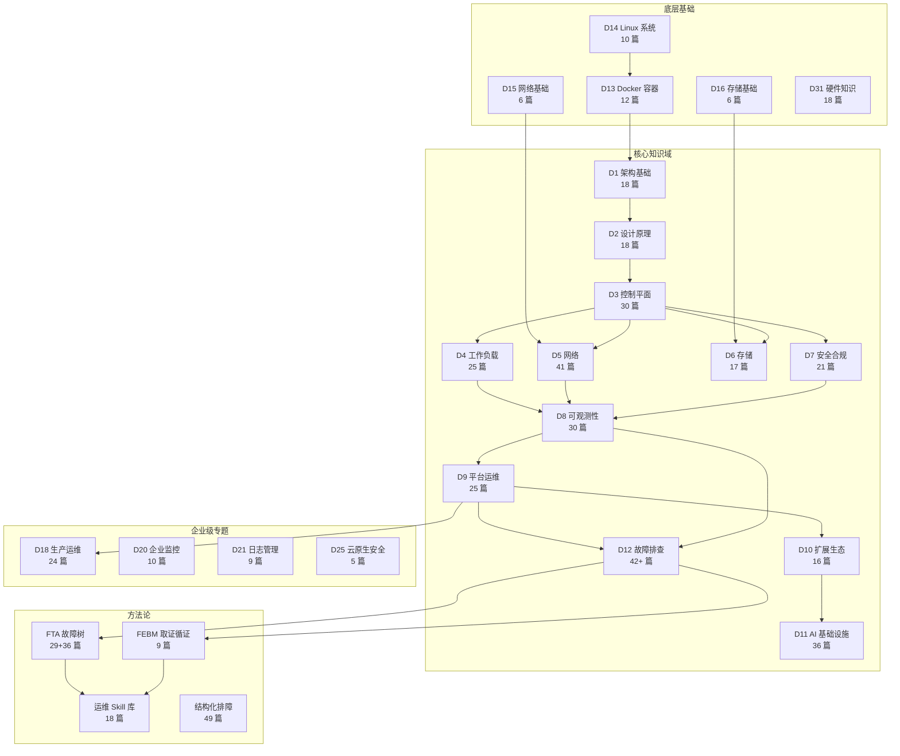
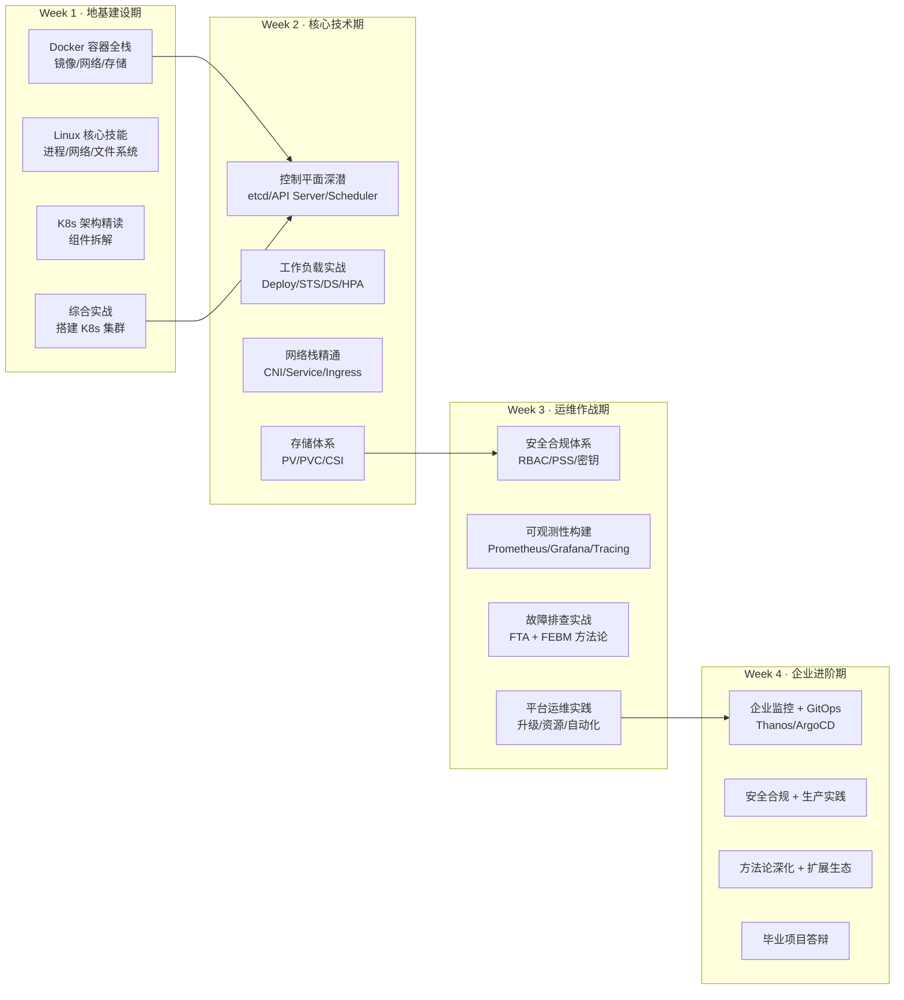

面对一个包含 **1,477 篇文档、41 个知识域、43,000,000+ 字**的全域知识库，初学者最常遇到的困境是"从哪开始"和"怎么不迷路"。本页正是为解决这个问题而生——它是一张全景导航图，帮助你理解 kudig-database 知识库的**整体结构、知识域之间的依赖关系、按难度递进的学习路径**，以及如何根据自身角色选择最优切入路线。读完本文后，你将拥有一条清晰的学习路径，而非在海量文档中盲目翻阅。

Sources: [STATS.md](reports/STATS.md#L1-L14), [INDEX.md](INDEX.md#L1-L10)

## 知识库全景：五大板块与 41 个知识域

kudig-database 并非一堆零散文档的堆砌，而是按照**"核心知识域 → 底层基础 → 企业级专题 → 前沿技术 → 方法论与参考"**五大板块严密组织的知识体系。每个板块解决不同层次的问题，板块之间存在明确的上下游依赖。

下面的架构图展示了五大板块及核心知识域之间的依赖关系——**箭头方向代表"前置知识 → 后续知识"**，建议沿箭头方向逐步学习：

**如何阅读这张图**：从图的左下角（Linux → Docker）开始，沿箭头向右上方推进。每一条箭头都意味着"理解源知识域将帮助你更好地理解目标知识域"。例如，不理解 Docker 容器原理就去学 K8s 架构，就像不会加法就去学乘法——不是不可能，但会事倍功半。

Sources: [knowledge-map.md](metadata/knowledge-map.md#L1-L35), [INDEX.md](INDEX.md#L1-L80)

## 知识域速览表：41 个域的核心定位

下表按五大板块分组，为每个知识域提供一句话定位和文档数量，帮助你快速判断"这个域和我有关吗"。

| 板块 | 知识域 | 文档数 | 一句话定位 | 难度 |
|:---|:---|:---:|:---|:---:|
| **核心** | D1 架构基础 | 18 | K8s 整体架构、核心组件、升级策略与性能调优 | ⭐⭐ |
| **核心** | D2 设计原理 | 18 | 声明式 API、控制器模式、etcd 共识、Operator 开发 | ⭐⭐⭐ |
| **核心** | D3 控制平面 | 30 | etcd、API Server、Scheduler、KCM 源码级深度剖析 | ⭐⭐⭐⭐ |
| **核心** | D4 工作负载 | 25 | Pod 生命周期、调度策略、HPA/VPA 弹性伸缩 | ⭐⭐⭐ |
| **核心** | D5 网络 | 41 | CNI、Service、DNS、Ingress、Gateway API 全链路 | ⭐⭐⭐ |
| **核心** | D6 存储 | 17 | PV/PVC、StorageClass、CSI 驱动与备份恢复 | ⭐⭐⭐ |
| **核心** | D7 安全合规 | 21 | RBAC、网络安全、运行时安全、审计与零信任 | ⭐⭐⭐ |
| **核心** | D8 可观测性 | 30 | 监控指标、日志审计、链路追踪、混沌工程 | ⭐⭐⭐ |
| **核心** | D9 平台运维 | 25 | 集群管理、GitOps、成本优化、灾备恢复 | ⭐⭐⭐ |
| **核心** | D10 扩展生态 | 16 | CRD/Operator、Helm、CI/CD、服务网格 | ⭐⭐⭐ |
| **核心** | D11 AI 基础设施 | 36 | GPU 调度、分布式训练、LLM 推理与成本优化 | ⭐⭐⭐⭐ |
| **核心** | D12 故障排查 | 42+ | 全组件结构化故障排查指南 | ⭐⭐⭐ |
| **底层** | D13 Docker | 12 | 容器架构、镜像、网络、存储与安全 | ⭐ |
| **底层** | D14 Linux | 10 | 系统架构、进程、文件系统、网络与容器基础 | ⭐ |
| **底层** | D15 网络基础 | 6 | OSI/TCP-IP、DNS、负载均衡、SDN | ⭐ |
| **底层** | D16 存储基础 | 6 | 存储架构、RAID、分布式存储系统 | ⭐ |
| **底层** | D31 硬件 | 18 | CPU、内存、存储与网络硬件及故障排查 | ⭐⭐ |
| **企业** | D18 生产运维 | 24 | 架构设计、零信任、GitOps、FinOps、灾备 | ⭐⭐⭐⭐ |
| **企业** | D19 白皮书 | 26 | 深度技术专题与最佳实践白皮书 | ⭐⭐⭐⭐⭐ |
| **企业** | D20 监控告警 | 10 | Prometheus、Grafana、Datadog 企业方案 | ⭐⭐⭐ |
| **企业** | D21 日志管理 | 9 | ELK、Fluentd、Loki 企业级方案 | ⭐⭐⭐ |
| **方法论** | FTA 故障树 | 29+36 | 演绎推理式故障分析方法论 + 36 个组件故障树 | ⭐⭐⭐⭐ |
| **方法论** | FEBM 取证循证 | 9 | 归纳式法医鉴定取证方法论 | ⭐⭐⭐⭐ |
| **方法论** | Skills 技能库 | 18 | 生产级诊断-修复闭环操作手册 | ⭐⭐⭐⭐ |
| **方法论** | 结构化排障 | 49 | 12 类组件 × 配置优先排查流程 | ⭐⭐⭐ |

> **提示**：⭐ 越多代表难度越高。初学者建议从 ⭐ ~ ⭐⭐ 的知识域开始，不要直接挑战 ⭐⭐⭐⭐ 以上的内容。

Sources: [difficulty-index.md](metadata/difficulty-index.md#L1-L84), [INDEX.md](INDEX.md#L1-L135)

## 难度分级体系：四级阶梯式成长模型

kudig-database 将所有文档按照认知负荷分为四个难度等级。理解这套分级体系，是避免"过早接触高难度内容导致挫败感"的关键。

| 级别 | 标识 | 含义 | 适合人群 | 推荐起步文档 |
|:---|:---:|:---|:---|:---|
| **入门** | ⭐ | 基础概念、入门操作、命令速查 | 零基础初学者、转岗人员 | 速查卡、Docker、Linux 基础 |
| **中级** | ⭐⭐ | 原理理解、日常运维、配置实践 | 1-2 年经验工程师 | D1 架构、D4 工作负载、D5/D6 网络/存储 |
| **高级** | ⭐⭐⭐ | 深度原理、生产实践、方法论体系 | 3-5 年经验工程师 | D2 设计原理、D8 可观测性、D12 故障排查 |
| **专家** | ⭐⭐⭐⭐⭐ | 源码级分析、架构设计、前沿技术 | 5+ 年资深工程师 | D3 控制平面源码、D19 白皮书、eBPF/Wasm |

**关键建议**：初学者应把 80% 的时间花在 ⭐ 和 ⭐⭐ 级别的内容上，建立扎实的操作直觉后再向更高级别推进。急于阅读专家级文档反而会因为缺乏上下文而事倍功半。

Sources: [difficulty-index.md](metadata/difficulty-index.md#L7-L14)

## 初学者学习路径：4 周从零到全栈运维

知识库提供了两套经过验证的 4 周学习路径，分别面向**通用场景**和**阿里云 ACK 场景**。两者的核心知识域相同，区别在于第一周是否深入云厂商特定服务。

### 路径一：通用 Kubernetes 全栈运维路径

| 周次 | 阶段名称 | 核心知识域 | 周产出 | 每日投入 |
|:---|:---|:---|:---|:---:|
| Week 1 | 地基建设期 | D13 Docker + D14 Linux + D1 架构 + 部署实操 | 拥有自己的 K8s 集群 + 架构认知图 | 4h |
| Week 2 | 核心技术期 | D3 控制平面 + D4 工作负载 + D5 网络 + D6 存储 | 生产级多层应用 YAML 编排方案 | 4h |
| Week 3 | 运维作战期 | D7 安全 + D8 可观测性 + D12 故障排查 + 方法论 | 监控告警大盘 + 故障排查手册 | 4h |
| Week 4 | 企业进阶期 | 企业监控 + GitOps + 方法论深化 + 扩展生态 | GitOps 全自动部署流水线 + Playbook | 4h |

Sources: [public-one-month-training.md](topic-learn/public-training/one-month/public-one-month-training.md#L86-L143), [README.md](topic-learn/public-training/one-month/README.md#L20-L50)

### 路径二：阿里云 ACK/ACR 专项路径

如果你所在团队使用阿里云容器服务，这条路径将在 Week 1 聚焦 ACK/ACR 管控层操作，Week 2-4 则回归通用 K8s 技术栈：

| 周次 | 阶段名称 | 核心内容 | 周产出 |
|:---|:---|:---|:---|
| Week 1 | ACK/ACR 基础与集群生命周期 | 管控 SR、SDK/API、控制台、集群创建/删除/升级/证书 | 独立完成集群全生命周期操作 |
| Week 2 | 安全认证与监控运维 | RBAC、RAM 集成、漏洞防范、审计、监控、配额 | 安全体系配置 + 基础监控搭建 |
| Week 3 | 节点与工作负载管理 | Node 管理、节点池、Pod 运维、K8s 组件运维 | 节点池运维 + Pod 问题排查能力 |
| Week 4 | 网络与存储 | Service、Ingress、Terway/Flannel CNI、存储卷 | 网络 + 存储实操能力 |

Sources: [inner-one-month-training.md](topic-learn/inner-training/inner-one-month-training.md#L11-L79), [README.md](topic-learn/inner-training/README.md#L7-L16)

## 学习方法论：五项核心原则

知识库不只是一堆文档，它配套了一套经过验证的学习方法论。这些方法论在两套培训计划中都被反复强调，是确保"学得会、记得住、用得上"的关键。

| 方法 | 频率 | 核心动作 | 为什么有效 |
|:---|:---|:---|:---|
| **费曼学习法** | 每日 | 学完后用大白话向"虚拟初学者"复述 | 检测理解漏洞——讲不清楚 = 没真懂 |
| **间隔重复** | 每周 | 周一回顾上周概念，周末复习 10 个核心术语 | 对抗艾宾浩斯遗忘曲线 |
| **主动回忆** | 每节 | 合上文档，自问"这个组件做什么？和谁交互？故障怎么查？" | 刻意训练思维链路，而非被动阅读 |
| **实践优先** | 每天 | 理论 ≤ 1.5h，实操 ≥ 2.5h | 肌肉记忆比文档记忆持久 10 倍 |
| **结构化记录** | 每个模块 | 产出思维导图或笔记摘要 | 形成个人知识图谱，构建长期记忆锚点 |

**每日时间分配建议**：如果你每天能投入 4 小时，建议按照 **"30 分钟阅读 → 2.5 小时实操 → 30 分钟费曼复述 → 30 分钟笔记整理"** 的节奏推进。纯阅读而不动手是最常见的学习陷阱。

Sources: [README.md](topic-learn/public-training/one-month/README.md#L54-L70), [README.md](topic-learn/inner-training/README.md#L58-L73)

## 实践项目：每周交付一个可量化的产出

学习路径中的每个周末都安排了一个**实践项目**，它们不仅是知识巩固的手段，更是你简历上可以展示的实际产出：

| 项目 | 周次 | 核心能力验证 | 完成标准 |
|:---|:---:|:---|:---|
| P1: 从零搭建 K8s 集群 | Week 1 | 集群部署与架构理解 | 集群 Running，所有组件健康 |
| P2: 生产级应用全栈编排 | Week 2 | 工作负载 + 网络 + 存储 | 多层应用完整部署，含 Service/Ingress/PVC |
| P3: 可观测性 + 故障演练 | Week 3 | 监控告警 + 排障能力 | 监控大盘可视化，30 分钟内定位故障 |
| P4: GitOps 自动化流水线 | Week 4 | CI/CD + 变更管理 | Git PR 触发自动部署，有文档化 SOP |
| P5: 毕业综合实践 | Week 4 | 全栈运维能力证明 | 完整生产级环境，从部署到监控到排障 |

Sources: [public-one-month-training.md](topic-learn/public-training/one-month/public-one-month-training.md#L150-L161), [README.md](topic-learn/inner-training/README.md#L88-L97)

## 关键依赖矩阵：学什么之前必须先学什么

下面的矩阵精确描述了知识域之间的**前置依赖关系**，帮助你在规划学习顺序时避免"跳步"：

| 想学这个 | 必须先掌握 | 推荐学完再看 |
|:---|:---|:---|
| D1 架构基础 | D13 Docker 基础概念 | D2 设计原理 |
| D2 设计原理 | D1 架构概览 | D3 控制平面 |
| D3 控制平面 | D2 声明式 API + 控制器模式 | D4/D5/D6/D7 |
| D5 K8s 网络 | D15 网络基础（TCP/IP/DNS） | D12 网络排障 |
| D6 K8s 存储 | D16 存储基础（RAID/分布式） | D12 存储排障 |
| D8 可观测性 | D3 控制平面 + D4 工作负载 + D5 网络 | D9 平台运维 |
| D11 AI 基础设施 | D4 工作负载 + GPU 基础概念 | topic-ai-agent |
| D12 故障排查 | D1~D8 任一知识域的基础理解 | FTA/FEBM/Skills |
| FTA 故障树 | D12 排障基础经验 | Skills 运维技能库 |
| Skills 技能库 | FTA 方法论 + D12 排障实践 | topic-ai-agent 自动化 |

Sources: [knowledge-map.md](metadata/knowledge-map.md#L70-L84)

## 初学者快速启动指南

如果你是第一次接触这个知识库，按照以下三步即可快速开始：

**第一步：建立环境（Day 1）**
使用 [topic-deployment](topic-deployment/README.md) 中的本地 Demo 方案（kind 或 minikube），在 30-60 分钟内搭建一个可操作的 K8s 集群。动手操作是理解抽象概念最快的方式。你可以参考 [快速开始：克隆、GitBook 浏览与 AI 语料库接入](2-kuai-su-kai-shi-ke-long-gitbook-liu-lan-yu-ai-yu-liao-ku-jie-ru)完成环境准备。

Sources: [README.md](topic-deployment/README.md#L43-L51)

**第二步：速查卡随身带（持续）**
将 [topic-cheat-sheet](topic-cheat-sheet/README.md) 中的 K8s、Linux、Docker 三张速查卡作为日常参考工具。遇到任何操作不确定时，先查速查卡，再查深度文档。速查卡覆盖了 kubectl 命令、Docker 操作和 Linux 系统管理等高频操作，是初学者最高频使用的参考资料。

Sources: [README.md](topic-cheat-sheet/README.md#L10-L22)

**第三步：按路径系统学习（Week 1-4）**
从上面的 4 周学习路径中选择一条（通用或 ACK 专项），按天推进。每天的理论阅读控制在 1.5 小时以内，剩余时间全部用于实操。每周完成一个实践项目，周末用 checkpoint 自测题检验成果。

Sources: [README.md](topic-learn/public-training/one-month/README.md#L119-L128)

## 按角色推荐的学习切入点

不同角色的工程师对知识库的需求侧重点不同。下表根据常见角色给出最优学习切入点：

| 角色 | 核心关注域 | 推荐起点 | 深度目标 |
|:---|:---|:---|:---|
| **后端开发** | D4 工作负载、D5 网络、D6 存储 | D1 架构 → D4 工作负载 → 速查卡 | 能独立编写生产级 YAML 编排 |
| **运维工程师** | D9 平台运维、D12 故障排查、D8 可观测性 | 4 周路径完整走一遍 | 30 分钟内定位任何常见故障 |
| **SRE** | D7 安全、D8 可观测性、D12 排障、方法论 | D1 → D8 → D12 → FTA/FEBM | 独立构建 SLO 体系和排障 SOP |
| **平台工程师** | D10 扩展生态、D3 控制平面、D2 设计原理 | D1 → D2 → D3 → D10 → Operator | 能开发自定义 CRD 和 Operator |
| **安全工程师** | D7 安全合规、D25 云原生安全、D39 供应链安全 | D1 → D7 安全全系列 | 零信任架构设计与合规审计 |
| **AI/ML 工程师** | D11 AI 基础设施、topic-ai-agent | D4 工作负载 → D11 → Agent 工程 | GPU 调度优化 + LLM 推理部署 |

Sources: [difficulty-index.md](metadata/difficulty-index.md#L18-L84), [tags-index.md](metadata/tags-index.md#L1-L137)

## 知识库导航工具

除了本文档，知识库还提供了多种导航工具帮助你高效定位内容：

| 工具 | 位置 | 用途 |
|:---|:---|:---|
| **全局索引** | [INDEX.md](INDEX.md) | 按板块分组的完整知识域目录 |
| **难度索引** | [difficulty-index.md](metadata/difficulty-index.md) | 按难度分级的文档导航 |
| **标签索引** | [tags-index.md](metadata/tags-index.md) | 按技术标签（etcd、CNI、RBAC 等）聚合检索 |
| **知识图谱** | [knowledge-map.md](metadata/knowledge-map.md) | 知识域间依赖关系和学习路径 |
| **运维词典** | [topic-dictionary](topic-dictionary/README.md) | 200+ 条 K8s 概念速查，13 个分类 |
| **可视化图谱** | [visualizations](visualizations/) | D3 交互式知识域浏览器 |

Sources: [INDEX.md](INDEX.md#L1-L135), [README.md](topic-dictionary/README.md#L1-L12)

## 下一步建议

现在你已经理解了知识库的全景结构和学习路径规划，以下是推荐的后续阅读顺序：

1. **如果你还没搭建环境** → [快速开始：克隆、GitBook 浏览与 AI 语料库接入](2-kuai-su-kai-shi-ke-long-gitbook-liu-lan-yu-ai-yu-liao-ku-jie-ru) 完成基础环境准备
2. **如果你准备开始系统学习** → [架构基础与核心组件原理](5-jia-gou-ji-chu-yu-he-xin-zu-jian-yuan-li) 从 K8s 架构全景图出发
3. **如果你想了解故障排查体系** → [FTA 故障树分析：从演绎推理到 AI Agent 知识骨架](13-fta-gu-zhang-shu-fen-xi-cong-yan-yi-tui-li-dao-ai-agent-zhi-shi-gu-jia) 了解知识库独创的方法论
4. **如果你关注文档贡献** → [贡献指南：文档规范、命名规则与提交流程](4-gong-xian-zhi-nan-wen-dang-gui-fan-ming-ming-gui-ze-yu-ti-jiao-liu-cheng) 参与知识库共建