本页是 **kudig-database 知识库中 9 张技术速查卡的总览与导航页**。这些速查卡覆盖了云原生运维工程师日常工作中最频繁接触的命令、语法和配置——从 `kubectl` 资源操作到 PromQL 监控查询、从 Docker 容器管理到 SQL 数据库运维，每张卡片均经过生产环境验证，包含真实场景示例与版本兼容性标注。无论你是刚入职的初级开发者还是需要快速刷新记忆的高级工程师，都可以把本页当作**一页直达的命令索引**。

Sources: [README.md](速查卡/README.md#L1-L63)

## 速查卡全景索引

以下表格展示了全部 9 张速查卡的核心信息，帮助你快速定位到所需的卡片文件。

| # | 速查卡 | 内容覆盖 | 适用版本 | 文件大小 | 深度知识来源 |
|:---:|:---|:---|:---|:---:|:---|
| 1 | **[Kubernetes 速查卡](速查卡/k8s.md)** | kubectl 命令、集群管理、Pod 操作、网络、存储、RBAC、etcd、故障排查 | v1.25–v1.32 | 37KB | domain-1 ~ domain-12 |
| 2 | **[Linux 速查卡](速查卡/linux.md)** | 系统管理、进程、网络、存储、安全、Shell 脚本、性能调优 | RHEL 7-9, Ubuntu 20-24 | 44KB | domain-14 |
| 3 | **[Go 语言速查卡](速查卡/go.md)** | 语法、并发、网络、数据库、测试、性能优化 | Go 1.20-1.22 | 49KB | domain-2（源码阅读） |
| 4 | **[Docker 速查卡](速查卡/docker.md)** | 容器生命周期、镜像管理、网络、存储、Compose、ctr | Docker 20.10+, containerd 1.6+ | 11KB | domain-13 |
| 5 | **[PromQL 速查卡](速查卡/promql.md)** | 指标查询、聚合函数、K8s 监控查询、告警规则模板 | Prometheus 2.40+ | 11KB | domain-8, domain-20 |
| 6 | **[网络诊断速查卡](速查卡/networking.md)** | DNS 诊断、TCP 调试、HTTP 测试、抓包分析、K8s 网络 | TCP/IP | 14KB | domain-5, domain-15 |
| 7 | **[Git 速查表](速查卡/git.md)** | 日常操作、分支管理、撤销操作、远程仓库、Stash、故障排查 | Git 2.30+ | 12KB | domain-23 |
| 8 | **[SQL 速查表](速查卡/sql.md)** | 查询语法、聚合分组、JOIN、子查询、索引优化、事务、备份恢复 | MySQL 8.0, PostgreSQL 14 | 20KB | domain-28 |
| 9 | **[TLS/PKI 速查卡](速查卡/tls-pki.md)** | 证书格式、OpenSSL 命令、证书链、K8s 证书管理 | x509, TLS 1.2/1.3 | 11KB | domain-7 |

Sources: [README.md](速查卡/README.md#L9-L54)

## 架构关系：速查卡在知识库中的定位

速查卡在整个 kudig-database 知识体系中扮演**快速检索层**的角色——当你需要深度理解某个领域的设计原理或排查复杂故障时，应前往对应的 domain 目录；当你只需要快速确认一条命令的语法或参数时，速查卡就是最高效的入口。

```mermaid
graph TD
    subgraph 速查卡层["<b>速查卡层（topic-cheat-sheet）</b><br/>命令/语法快速参考"]
        K8S["Kubernetes<br/>kubectl 命令"]
        LINUX["Linux<br/>系统运维命令"]
        DOCKER["Docker<br/>容器操作命令"]
        PROMQL["PromQL<br/>监控查询语法"]
        GIT["Git<br/>版本控制操作"]
        SQL["SQL<br/>数据库查询"]
        NET["网络诊断<br/>TCP/DNS/抓包"]
        TLS["TLS/PKI<br/>证书管理"]
        GO["Go 语言<br/>语法与并发"]
    end

    subgraph 深度知识层["<b>深度知识层（domain-*）</b><br/>架构原理与最佳实践"]
        D1["domain-1~3<br/>架构/设计/控制平面"]
        D4["domain-4<br/>工作负载"]
        D5["domain-5<br/>网络体系"]
        D6["domain-6<br/>存储体系"]
        D7["domain-7<br/>安全合规"]
        D8["domain-8<br/>可观测性"]
    end

    subgraph 故障排查层["<b>故障排查层</b><br/>FTA/结构化排障"]
        FTA["topic-fta<br/>故障树分析"]
        SKILL["topic-skills<br/>Skill 工单闭环"]
        TS["topic-structural-<br/>trouble-shooting"]
    end

    K8S --> D1
    K8S --> D4
    LINUX --> D14["domain-14<br/>Linux 基础"]
    DOCKER --> D13["domain-13<br/>Docker"]
    PROMQL --> D8
    SQL --> D28["domain-28<br/>数据库中间件"]
    NET --> D5
    TLS --> D7

    K8S -.-> FTA
    LINUX -.-> TS
    DOCKER -.-> TS
```



Sources: [README.md](速查卡/README.md#L43-L54)

---

## ① Kubernetes 速查卡

**定位**：覆盖生产环境 90% 以上 kubectl 常用命令，是全库中体量最大（1535 行）的速查卡。适用于 Kubernetes v1.25 至 v1.32 版本。

### 内容结构一览

| 章节 | 核心内容 | 典型场景 |
|:---|:---|:---|
| **kubectl 基础操作** | 版本查看、上下文切换、默认命名空间设置 | 多集群环境切换 |
| **集群信息与版本** | `cluster-info`、节点列表、API 资源查询、健康检查 | 集群状态巡检 |
| **资源查询与筛选** | 标签选择器、字段选择器、自定义列输出、排序 | 批量资源检索 |
| **Pod 操作** | 创建/删除、日志查看、exec 进入、debug 调试、端口转发 | 日常排障最高频操作 |
| **Deployment 管理** | 创建/扩缩容/镜像更新、滚动更新、回滚、暂停恢复金丝雀发布 | 应用发布与回滚 |
| **Service 与网络** | Service 类型、端口映射、Ingress、NetworkPolicy | 服务暴露与访问控制 |
| **ConfigMap & Secret** | 创建/更新/解码 Secret，三种 Secret 类型说明 | 配置与敏感信息管理 |
| **存储管理** | PV/PVC 操作、StorageClass、CSI、数据卷挂载 | 持久化存储运维 |
| **RBAC 权限管理** | Role/RoleBinding、ClusterRole、ServiceAccount 操作 | 权限分配与审计 |
| **故障排查** | Pod 状态诊断、节点 NotReady 排查、事件分析、资源不足诊断 | 生产故障应急响应 |
| **etcd 操作** | 健康检查、成员管理、备份恢复、压缩碎片整理 | 控制平面数据运维 |
| **API Server 管理** | API 资源发现、原始 API 请求、APF 流控 | API 层诊断与调优 |
| **集群维护** | kubeadm 证书续期、节点排空/恢复、集群升级 | 集群生命周期管理 |

### 高频命令速查（Top 20）

以下是 kubectl 日常操作中最高频使用的命令，按使用频率排列：

```bash
# 1-5: 资源查看（最高频）
kubectl get pods -A -o wide                                    # 全命名空间 Pod 状态
kubectl get nodes                                              # 节点列表
kubectl describe pod <pod-name> -n <ns>                        # Pod 详情与事件
kubectl logs <pod-name> -n <ns> --tail=100                     # 查看最近日志
kubectl top nodes                                              # 节点资源使用

# 6-10: 应用管理
kubectl apply -f manifest.yaml                                 # 声明式应用配置
kubectl rollout status deployment/<deploy>                     # 滚动更新状态
kubectl rollout undo deployment/<deploy>                       # 回滚到上一版本
kubectl scale deployment/<deploy> --replicas=3                 # 手动扩缩容
kubectl set image deployment/<deploy> <c>=:<tag>          # 更新镜像版本

# 11-15: 调试与排障
kubectl exec -it <pod> -n <ns> -- /bin/bash                   # 进入容器终端
kubectl port-forward svc/<svc> 8080:80                        # 本地端口转发
kubectl get events -n <ns> --sort-by='.lastTimestamp'          # 按时间排序事件
kubectl debug node/<node> -it --image=ubuntu:22.04             # 节点级调试
kubectl logs <pod> -n <ns> --previous                          # 上一个容器日志

# 16-20: 配置与网络
kubectl config use-context <ctx>                               # 切换集群上下文
kubectl label nodes <node> key=value                           # 节点打标签
kubectl taint nodes <node> key=value:NoSchedule                # 节点污点管理
kubectl get networkpolicy -A                                   # 查看网络策略
kubectl get ingress -A                                        # 查看所有 Ingress
```

**版本兼容性提醒**：`--short` 标志在 v1.28+ 已弃用，推荐使用 `--output=yaml|json`；`kubectl get componentstatuses` 在 v1.19+ 已弃用，改用 `/livez`、`/readyz` API。

Sources: [k8s.md](速查卡/k8s.md#L1-L100), [k8s.md](速查卡/k8s.md#L180-L316), [k8s.md](速查卡/k8s.md#L320-L398)

---

## ② Linux 速查卡

**定位**：覆盖 RHEL/CentOS 7-9 与 Ubuntu 20.04-24.04 全场景系统运维命令，2166 行，是体量第二大速查卡。

### 内容结构一览

| 章节 | 核心内容 | 典型场景 |
|:---|:---|:---|
| **系统信息查询** | 发行版、内核版本、硬件信息、系统负载 | 环境确认与巡检 |
| **文件与目录操作** | 基础操作、文件查找（find/locate）、权限管理 | 日常文件运维 |
| **文本处理** | grep、sed、awk、sort、uniq、jq（JSON 处理） | 日志分析与数据提取 |
| **进程管理** | ps、top、kill、nohup、systemctl、信号说明 | 进程监控与控制 |
| **网络管理** | IP 配置、路由、ss/netstat、防火墙、SSH、VPN | 网络诊断与配置 |
| **磁盘与存储** | df/du、fdisk/parted、LVM、mount、RAID、NFS | 存储管理 |
| **用户与权限** | useradd/usermod、chmod/chown、sudo、ACL | 权限管理 |
| **性能监控** | top/htop、vmstat、iostat、sar、perf、火焰图 | 性能瓶颈定位 |
| **日志分析** | journalctl、tail、日志轮转、ELK 快速查询 | 日志排查 |
| **安全与防火墙** | iptables、firewalld、SELinux、audit | 安全加固 |
| **包管理** | yum/dnf、apt、源码编译安装 | 软件安装 |
| **Shell 脚本** | 变量、条件、循环、函数、数组、陷阱信号 | 自动化脚本编写 |

### 性能排障三板斧

Linux 速查卡中**最值得优先掌握**的性能诊断命令组合——当接到"系统慢"这类模糊工单时，按以下顺序执行：

```bash
# 第一步：确认系统负载全局状态
uptime                          # 1/5/15 分钟负载平均值
free -h                         # 内存使用概况
df -h                           # 磁盘使用概况

# 第二步：定位瓶颈来源（CPU / 内存 / 磁盘 I/O）
top -c                          # 实时进程资源占用（按 CPU 排序）
vmstat 1 5                      # 虚拟内存统计（关注 r/b/si/so/bo 列）
iostat -x 1 5                   # 磁盘 I/O 详情（关注 %util、await）

# 第三步：深入分析（可选）
perf top                        # 内核级热点分析
iotop                           # 实时 I/O 监控（按进程）
ss -tnp                         # 网络连接统计（关注 ESTABLISHED/CLOSE_WAIT）
```

**工具包依赖提醒**：`mpstat`、`iostat`、`sar` 需要 sysstat v12.5+（Ubuntu 22.04+、RHEL 9+ 自带）；`htop` 需要 v3.2+；`iotop` 需要 root 权限。

Sources: [linux.md](速查卡/linux.md#L1-L126), [linux.md](速查卡/linux.md#L127-L200)

---

## ③ Docker 速查卡

**定位**：覆盖 Docker v20.10+ 与 containerd v1.6+ 双运行时的操作命令，542 行，精简但全面。

### 内容结构一览

| 章节 | 核心内容 | 典型场景 |
|:---|:---|:---|
| **容器生命周期** | `run` 参数速查表、启停、暂停/恢复、批量操作 | 容器日常管理 |
| **镜像管理** | 搜索/拉取/标签/保存加载/构建/仓库操作 | 镜像分发与构建 |
| **容器操作** | ps、inspect、exec 进入、文件复制 | 容器状态检查 |
| **网络管理** | 网络创建/连接、六种网络模式对比表 | 容器网络配置 |
| **存储卷** | Volume vs Bind Mount vs tmpfs 三种挂载方式 | 数据持久化 |
| **日志与监控** | logs 查看、资源限制（CPU/内存/IO） | 运行时监控 |
| **Docker Compose** | 多服务编排、Compose 文件完整示例 | 开发环境搭建 |
| **Containerd (ctr)** | 命名空间、镜像/容器/快照操作（K8s 默认运行时） | 生产级容器运行时运维 |

### Docker run 参数速查

`docker run` 是 Docker 速查卡中被查阅频率最高的命令，以下是其核心参数对照表：

| 参数 | 说明 | 示例 |
|:---|:---|:---|
| `-d` | 后台运行 (detached) | `docker run -d nginx` |
| `-it` | 交互式 TTY | `docker run -it ubuntu bash` |
| `--name` | 指定容器名 | `docker run --name web nginx` |
| `-p H:C` | 端口映射（主机:容器） | `docker run -p 8080:80 nginx` |
| `-v H:C` | 卷挂载（主机:容器） | `docker run -v /data:/app/data myapp` |
| `-e K=V` | 环境变量 | `docker run -e DB_HOST=mysql myapp` |
| `--restart` | 重启策略 | `--restart unless-stopped` |
| `--memory` | 内存限制 | `--memory=512m` |
| `--cpus` | CPU 限制 | `--cpus=1.0` |
| `--network` | 指定网络 | `--network mynet` |
| `--rm` | 停止后自动删除 | `docker run --rm busybox echo hi` |
| `--privileged` | 特权模式（**不安全，慎用**） | — |

Sources: [docker.md](速查卡/docker.md#L1-L200), [docker.md](速查卡/docker.md#L200-L399)

---

## ④ PromQL 速查卡

**定位**：Prometheus 查询语言的完整语法参考，覆盖从基础选择器到 Kubernetes 监控查询与告警规则模板，508 行。

### 内容结构一览

| 章节 | 核心内容 | 典型场景 |
|:---|:---|:---|
| **基础查询** | 瞬时向量 vs 范围向量、时间单位对照表 | 理解 PromQL 基本概念 |
| **时间序列选择器** | 标签匹配（=, !=, =~, !~）、范围向量修饰符 | 精确过滤指标 |
| **运算符** | 算术/比较/逻辑运算符、布尔修饰符 | 指标计算与比较 |
| **聚合操作** | sum/avg/max/count/histogram_quantile/topk | 按维度聚合 |
| **函数大全** | rate/irate/increase、predict_linear、histogram_quantile、标签操作 | 时序数据处理 |
| **常用查询模式** | CPU/内存/磁盘使用率、HTTP QPS/错误率/P99 延迟 | 日常监控面板 |
| **Kubernetes 监控** | Pod/Node/Deployment 资源指标、资源配额使用率 | K8s 集群监控 |
| **告警规则模板** | 高可用告警、资源告警、K8s 告警 YAML 示例 | 告警规则编写 |

### 最常用的 5 条 PromQL 查询

```promql
# 1. CPU 使用率（节点级）
100 - (avg(irate(node_cpu_seconds_total{mode="idle"}[5m])) by (instance) * 100)

# 2. 内存使用率
100 * (1 - node_memory_MemAvailable_bytes / node_memory_MemTotal_bytes)

# 3. HTTP 请求 QPS
sum(rate(http_requests_total[5m])) by (job)

# 4. P99 延迟
histogram_quantile(0.99, sum(rate(http_request_duration_seconds_bucket[5m])) by (le, job))

# 5. 预测磁盘 4 小时后是否写满
predict_linear(node_filesystem_avail_bytes[1h], 4*3600) < 0
```

**聚合函数速查**：`sum()` 求和、`avg()` 平均值、`min()`/`max()` 极值、`count()` 计数、`topk(n, ...)` 最大 n 个、`bottomk(n, ...)` 最小 n 个、`quantile(φ, ...)` 分位数、`stddev()` 标准差。

Sources: [promql.md](速查卡/promql.md#L1-L200), [promql.md](速查卡/promql.md#L280-L400)

---

## ⑤ Git 速查表

**定位**：Git 2.30+ 版本控制日常操作的快速参考，605 行，覆盖从配置到高级故障排查的完整工作流。

### 内容结构一览

| 章节 | 核心内容 | 典型场景 |
|:---|:---|:---|
| **配置** | 全局配置、别名设置（st/co/br/ci/lg） | 初始化开发环境 |
| **基础操作** | init/clone、日常提交流程、.gitignore 模板 | 每日代码提交 |
| **分支管理** | 创建/切换/删除/重命名分支、merge vs rebase、交互式变基 | 团队协作分支管理 |
| **查看与对比** | log（格式化输出）、diff（工作区/暂存区/提交间）、blame | 代码审查与追踪 |
| **撤销操作** | restore（撤销修改）、reset（soft/mixed/hard）、revert、reflog 恢复 | **最容易出错的命令，需要格外小心** |
| **远程仓库** | remote 管理、fetch/pull/push、Fork 工作流 | 多人协作同步 |
| **Stash** | 保存/恢复/删除临时修改 | 切换分支时暂存工作 |
| **标签管理** | 创建/推送/删除 tag（轻量标签 vs 注释标签） | 版本发布 |
| **高级操作** | cherry-pick、bisect（二分法定位 bug）、worktree | 特定场景操作 |
| **故障排查** | 恢复丢失提交、修复分离 HEAD、清理仓库 | 紧急恢复 |

### 撤销操作速查（最容易混淆的命令）

Git 撤销操作是初学者最容易出错的领域。下表按"修改阶段"分类，帮助你快速定位正确的命令：

| 修改阶段 | 命令 | 效果 | 安全性 |
|:---|:---|:---|:---|
| 未 `add`（工作区修改） | `git restore <file>` | 丢弃工作区修改 | ⚠️ 修改会丢失 |
| 已 `add` 未 `commit` | `git restore --staged <file>` | 退回工作区（修改保留） | ✅ 安全 |
| 已 `commit`（本地） | `git reset --soft HEAD~1` | 撤销提交，修改保留在暂存区 | ✅ 安全 |
| 已 `commit`（本地） | `git reset --mixed HEAD~1` | 撤销提交，修改保留在工作区 | ✅ 安全 |
| 已 `commit`（本地） | `git reset --hard HEAD~1` | 彻底丢弃提交和修改 | ❌ 危险 |
| 已 `push`（远程） | `git revert <commit>` | 生成反向提交，不修改历史 | ✅ 安全（推荐） |
| 任何阶段（紧急恢复） | `git reflog` → `git reset --hard HEAD@{n}` | 从操作日志恢复 | 救命稻草 |

**新式命令提示**：Git 2.23+ 推荐使用 `git switch` 替代 `git checkout` 切换分支，使用 `git restore` 替代 `git checkout -- <file>` 撤销修改。

Sources: [git.md](速查卡/git.md#L1-L200), [git.md](速查卡/git.md#L274-L334)

---

## ⑥ SQL 速查表

**定位**：覆盖 MySQL 8.0、PostgreSQL 14、SQLite 3 三种数据库的查询语法与运维操作，723 行，特别标注了不同数据库的语法差异。

### 内容结构一览

| 章节 | 核心内容 | 典型场景 |
|:---|:---|:---|
| **基础查询** | SELECT、DISTINCT、别名、LIMIT 分页、排序 | 数据查询入门 |
| **条件过滤** | WHERE 子句、比较/范围/列表/模糊查询、正则匹配 | 精确筛选数据 |
| **聚合与分组** | COUNT/SUM/AVG/MAX/MIN、GROUP BY、HAVING vs WHERE | 统计分析 |
| **表连接** | INNER/LEFT/RIGHT/FULL OUTER/CROSS JOIN、自连接 | 多表关联查询 |
| **子查询** | 标量子查询、CTE (WITH)、递归 CTE、关联子查询、窗口函数替代 | 复杂查询逻辑 |
| **数据修改** | INSERT 多行、UPSERT（ON DUPLICATE KEY）、UPDATE/DELETE | 数据写入 |
| **表结构操作** | CREATE TABLE、ALTER TABLE（增删改列）、约束、索引 | 表结构变更 |
| **索引与优化** | 索引管理、EXPLAIN 执行计划、五条优化原则 | 查询性能调优 |
| **数据库管理** | 用户权限、事务控制（BEGIN/COMMIT/ROLLBACK/SAVEPOINT）、备份恢复 | DBA 运维 |

### JOIN 类型速查图

SQL JOIN 是初学者最常需要快速确认的语法，以下是五种 JOIN 的直观对照：

| JOIN 类型 | 返回结果 | 语法关键词 |
|:---|:---|:---|
| **INNER JOIN** | 两个表的**交集**（匹配行） | `JOIN` / `INNER JOIN` |
| **LEFT JOIN** | 左表**全部** + 右表匹配行（无匹配填 NULL） | `LEFT JOIN` |
| **RIGHT JOIN** | 右表**全部** + 左表匹配行（无匹配填 NULL） | `RIGHT JOIN` |
| **FULL OUTER JOIN** | 两个表的**并集**（无匹配填 NULL） | `FULL OUTER JOIN` |
| **CROSS JOIN** | 笛卡尔积（所有行组合） | `CROSS JOIN` |

### 索引优化五原则

| 原则 | 说明 | 示例 |
|:---|:---|:---|
| **选择性** | 高选择性字段（如 email）适合建索引，低选择性（如性别）不适合 | `CREATE INDEX idx_email ON users(email)` |
| **最左前缀** | 复合索引 `(a,b,c)` 支持 `a`、`ab`、`abc` 查询，但不支持 `bc` | `(name, age)` → 可用 `name` 或 `name + age` |
| **覆盖索引** | 查询字段都在索引中，避免回表查询 | SELECT 的列正好在索引中 |
| **避免函数** | 索引字段上使用函数会导致索引失效 | ❌ `WHERE YEAR(date) = 2024` → ✅ `WHERE date >= '2024-01-01'` |
| **定期维护** | 定期 ANALYZE 更新统计信息，重建碎片索引 | `ANALYZE TABLE users` |

Sources: [sql.md](速查卡/sql.md#L1-L200), [sql.md](速查卡/sql.md#L400-L534)

---

## 扩展速查卡

除了标题中列出的 6 张核心卡片外，本库还包含以下 3 张高度实用的扩展速查卡：

### ⑦ 网络诊断速查卡

覆盖 DNS 诊断（dig/nslookup/host）、TCP/UDP 调试（nc/nmap/ss）、HTTP/HTTPS 诊断（curl/wget）、路由与防火墙、抓包分析（tcpdump）以及 **Kubernetes 网络诊断**专用命令。607 行。

Sources: [networking.md](速查卡/networking.md#L1-L200)

### ⑧ TLS/PKI 速查卡

覆盖证书格式对照表（.pem/.crt/.key/.csr/.p12）、OpenSSL 完整命令（查看/验证/生成/测试 TLS 连接）、证书链构建、**Kubernetes 集群证书管理**（kubeadm 证书续期）以及证书过期监控脚本。428 行。

Sources: [tls-pki.md](速查卡/tls-pki.md#L1-L200)

### ⑨ Go 语言速查卡

覆盖 Go 1.20-1.22 的语法基础、并发模式（goroutine/channel/select/context）、网络编程、数据库操作、测试框架与性能优化。2606 行，是全库体量最大的速查卡，主要服务于阅读 Kubernetes 源码的场景。

Sources: [go.md](速查卡/go.md#L1)

---

## 使用方式指南

速查卡支持三种典型使用模式，适应不同的工作场景：

### 模式一：本地快速查阅

直接在终端或编辑器中打开对应的 Markdown 文件，利用目录跳转到目标章节：

```bash
# 在终端中查看 Kubernetes 速查卡
cat topic-cheat-sheet/k8s.md | less

# 在 VS Code 中打开（支持目录跳转）
code topic-cheat-sheet/promql.md

# 用 grep 快速搜索特定命令
grep -n "port-forward" topic-cheat-sheet/k8s.md
```

### 模式二：导入 AI 知识库

每张速查卡设计为**可独立使用的完整参考文档**，适合作为 RAG 应用的快速检索层：

| AI 工具 | 推荐用法 |
|:---|:---|
| **NotebookLM** | 导入整个 `topic-cheat-sheet/` 目录作为速查参考源 |
| **ChatGPT / Claude** | 将单个文件作为附件上传，基于上下文提问 |
| **RAG 应用** | 作为浅层检索，配合 `domain-*` 深度内容分层召回 |

### 模式三：打印或离线使用

每张速查卡均为自包含的 Markdown 文档，可直接导出为 PDF 或打印，适合贴在工位旁随时参考。所有版本兼容性信息已内联在文档中，离线使用无需额外查证。

Sources: [README.md](速查卡/README.md#L23-L54)

---

## 推荐阅读路径

根据你的当前需求，建议按以下路径探索知识库：

| 当前需求 | 推荐路径 |
|:---|:---|
| **刚入门 Kubernetes** | 本页 → [架构基础与核心组件原理](5-jia-gou-ji-chu-yu-he-xin-zu-jian-yuan-li) → [YAML 配置清单](29-yaml-pei-zhi-qing-dan-kubernetes-quan-zi-yuan-zi-duan-can-kao-shou-ce) |
| **遇到生产故障需要排查** | 本页（k8s 故障排查章节） → [结构化故障排查](15-jie-gou-hua-gu-zhang-pai-cha-pei-zhi-you-xian-fang-fa-lun-yu-quan-zu-jian-pai-zhang-zhi-nan) → [运维 Skill 库](16-yun-wei-skill-ku-ai-agent-ke-zhi-xing-de-gong-dan-zhen-duan-xiu-fu-bi-huan) |
| **需要理解监控告警体系** | 本页（PromQL 速查卡） → [可观测性：监控指标、日志审计、链路追踪与混沌工程](12-ke-guan-ce-xing-jian-kong-zhi-biao-ri-zhi-shen-ji-lian-lu-zhui-zong-yu-hun-dun-gong-cheng) |
| **容器基础不够扎实** | 本页（Docker 速查卡） → [Docker 容器技术：架构、网络、存储与排障](23-docker-rong-qi-ji-zhu-jia-gou-wang-luo-cun-chu-yu-pai-zhang) → [Linux 系统与网络/存储基础](24-linux-xi-tong-yu-wang-luo-cun-chu-ji-chu-cong-nei-he-dao-rong-qi-yun-xing-shi) |
| **SQL 优化需要深入** | 本页（SQL 速查表） → 企业级数据库（domain-28）深度内容 |