本页面是 KUDIG 知识库中 **Kubernetes 及其云原生生态组件 Release Notes 的全量归档入口**。归档涵盖 **33 个核心项目、1,322 份版本说明文档**，总计约 14.3 MB 的原始版本信息，按功能领域分为 **8 大分类、30+ 子项目**，时间跨度从 Kubernetes v0.4（2014 年）到 v1.36（2026 年开发中）乃至各生态组件的最新稳定版。这些文档通过自动化脚本从各项目 GitHub Release 页面和官方 Changelog 仓库同步获取，保留了原始的下载链接、变更分类、升级注意事项和依赖变更信息。

Sources: [README.md](领域索引/README.md#L1-L79), [download-release-notes.py](scripts/download-release-notes.py#L1-L241)

## 归档架构总览

归档体系遵循一个清晰的分层逻辑：**Kubernetes 核心 → 核心依赖 → CLI 工具 → 网络/服务网格 → 可观测性 → CI/CD & GitOps → 安全策略 → 存储**。每个子目录对应一个独立的开源项目，目录中的每个 Markdown 文件代表该项目的一个 `Major.Minor` 版本线（取该版本线最新 patch 版本的 Release Notes）。

```mermaid
graph TD
    A["topic-release-notes/<br/>Release Notes 归档根目录"] --> B["kubernetes/<br/>Kubernetes 核心<br/>55 个版本"]
    A --> C["core-deps/<br/>核心依赖<br/>83 个版本"]
    A --> D["cli-tools/<br/>CLI 工具<br/>187 个版本"]
    A --> E["networking/<br/>网络 & 服务网格<br/>157 个版本"]
    A --> F["observability/<br/>可观测性<br/>374 个版本"]
    A --> G["cicd-gitops/<br/>CI/CD & GitOps<br/>171 个版本"]
    A --> H["security/<br/>安全策略<br/>218 个版本"]
    A --> I["storage/<br/>存储 & CSI<br/>76 个版本"]

    C --> C1["containerd (13)"]
    C --> C2["CoreDNS (16)"]
    C --> C3["CRI-O (32)"]
    C --> C4["etcd (15)"]
    C --> C5["runc (7)"]

    D --> D1["Helm (42)"]
    D --> D2["kind (32)"]
    D --> D3["kops (32)"]
    D --> D4["kustomize (7)"]
    D --> D5["minikube (74)"]

    E --> E1["Calico (35)"]
    E --> E2["Cilium (24)"]
    E --> E3["CNI Plugins (14)"]
    E --> E4["Envoy (38)"]
    E --> E5["Istio (38)"]
    E --> E6["Linkerd (8)"]

    F --> F1["Grafana (71)"]
    F --> F2["Loki (29)"]
    F --> F3["OTel Collector (146)"]
    F --> F4["Prometheus (87)"]
    F --> F5["Thanos (41)"]

    G --> G1["Argo CD (40)"]
    G --> G2["Flux (51)"]
    G --> G3["Tekton (80)"]

    H --> H1["cert-manager (37)"]
    H --> H2["Falco (43)"]
    H --> H3["Gatekeeper (24)"]
    H --> H4["OPA (86)"]
    H --> H5["Trivy (28)"]

    I --> I1["Longhorn (19)"]
    I --> I2["Rook (29)"]
    I --> I3["Velero (28)"]
```

> **图注**：上图展示了归档的 8 大分类及其 33 个子项目的层次结构，括号内数字为各项目归档的版本数量。分类逻辑遵循 CNCF 云原生全景图的功能域划分，确保使用者能按技术领域快速定位目标组件的版本信息。

Sources: [README.md](领域索引/README.md#L1-L79)

## 数据采集机制

归档通过 [`download-release-notes.py`](scripts/download-release-notes.py) 脚本实现自动化采集。该脚本的核心逻辑包含两个数据通道：**Kubernetes 官方 Changelog** 直接从 `kubernetes/kubernetes` 仓库的 `CHANGELOG/` 目录拉取原始 Markdown 文件（v1.2 至 v1.36），而 **早期版本**（v0.4–v1.1）和**所有生态组件**则通过 GitHub Releases API 获取。脚本内置速率限制处理、alpha/beta/rc 版本过滤以及 `Major.Minor` 分组聚合逻辑——同一版本线只保留最新 patch 版本的 Release Notes。

Sources: [download-release-notes.py](scripts/download-release-notes.py#L1-L116)

## Kubernetes 核心版本归档

Kubernetes 归档是整个版本库的核心，共 **55 个版本文件**，覆盖从 v0.4（2014 年 Borg 论文后的初始开源版本）到 v1.36（2026 年开发中的最新迭代）。其中 v1.2–v1.36 使用官方 `CHANGELOG-{version}.md` 格式，包含完整的下载二进制（Source Code / Client / Server / Node / Container Images）及 SHA512 校验和；v0.4–v1.1 则来自 GitHub Releases，采用更简洁的 `RELEASE-NOTES-{version}.md` 格式。

| 版本范围 | 文件数 | 文件格式 | 内容特点 |
|----------|--------|----------|----------|
| v0.4 – v0.21 | 18 | `RELEASE-NOTES-*.md` | 早期预览版，变更记录较简洁 |
| v1.0 – v1.1 | 2 | `RELEASE-NOTES-*.md` | 首个 GA 版本，基础功能确立 |
| v1.2 – v1.36 | 35 | `CHANGELOG-*.md` | 完整结构化文档，含下载、API 变更、特性、Bug 修复 |

**典型 Changelog 文档结构**（以 v1.36 为例）包含以下标准段落：Downloads（含 SHA512 校验和）、Urgent Upgrade Notes（升级前必读）、Changes by Kind（按 Deprecation / API Change / Feature / Bug or Regression / Other 分类）以及 Dependencies（新增/变更/移除的 Go 依赖）。最新 v1.36.0-beta.0 已引入多项重量级特性，包括 DRA（Dynamic Resource Allocation）多项特性晋升 Beta/GA、Workload 和 PodGroup API 集成、PodGroup 调度逻辑、以及 `ImageVolume` 特性达到 Stable。

Sources: [CHANGELOG-1.36.md](领域索引/kubernetes/CHANGELOG-1.36.md#L1-L200), [CHANGELOG-1.35.md](领域索引/kubernetes/CHANGELOG-1.35.md#L1-L172), [RELEASE-NOTES-1.1.md](领域索引/kubernetes/RELEASE-NOTES-1.1.md#L1-L16)

## 核心依赖（Core Dependencies）

核心依赖分类归档了 Kubernetes 运行所需的 5 个关键底层组件，共 **83 个版本**。这些组件直接影响集群的容器运行时能力、服务发现和数据一致性保障。

| 项目 | 版本数 | 目录 | 最新归档版本 | 在 Kubernetes 中的角色 |
|------|--------|------|-------------|----------------------|
| **containerd** | 13 | `core-deps/containerd/` | v2.2 | 高级容器运行时，CRI 标准实现 |
| **CoreDNS** | 16 | `core-deps/coredns/` | v1.14 | 集群内 DNS 服务发现 |
| **CRI-O** | 32 | `core-deps/cri-o/` | v1.35 | 轻量级 OCI 兼容容器运行时 |
| **etcd** | 15 | `core-deps/etcd/` | v3.6 | 分布式键值存储，Kubernetes 状态后端 |
| **runc** | 7 | `core-deps/runc/` | v1.4 | OCI 容器运行时规范参考实现 |

以 **etcd v3.6** 为例，Release Notes 包含完整的安装指南（Linux / macOS / Docker），并明确提醒用户在升级前阅读 upgrade guide（可能存在 breaking changes）。**CRI-O** 的归档版本最为丰富（32 个），其版本号与 Kubernetes minor 版本保持对齐，便于用户确认兼容性。

Sources: [README.md](领域索引/README.md#L13-L21), [etcd RELEASE-NOTES-3.6.md](领域索引/core-deps/etcd/RELEASE-NOTES-3.6.md#L1-L96)

## CLI 工具（CLI & Tools）

CLI 工具分类归档了 **5 个项目、187 个版本**，覆盖集群创建、部署管理和配置编排等日常运维场景。

| 项目 | 版本数 | 最新归档版本 | 核心用途 |
|------|--------|-------------|---------|
| **Helm** | 42 | v4.1 | Kubernetes 包管理器，Chart 模板化部署 |
| **kind** | 32 | v0.31 | Docker 容器化本地 Kubernetes 集群 |
| **kops** | 32 | v1.35 | AWS/GCE 等云平台生产级集群运维 |
| **kustomize** | 7 | v3.3 | 原生 Kubernetes 清单定制与覆盖 |
| **minikube** | 74 | v1.38 | 本地单节点 Kubernetes 环境快速启动 |

**minikube** 以 74 个归档版本位居本分类之首，反映了其高频迭代节奏。**Helm** 从 v1.2 演进至 v4.1，经历了从 Tiller 架构到 Helm 3 无 Tiller 设计的重大范式转变，其 Release Notes 对理解 Helm 生态的迁移路径至关重要。

Sources: [README.md](领域索引/README.md#L23-L31)

## 网络与服务网格（Networking & Service Mesh）

网络分类归档了 **6 个项目、157 个版本**，是理解 Kubernetes 网络策略、CNI 选型和东西/南北向流量管理的关键参考资料。

| 项目 | 版本数 | 最新归档版本 | 核心能力 |
|------|--------|-------------|---------|
| **Calico** | 35 | v3.31 | BGP 网络策略、eBPF 数据平面 |
| **Cilium** | 24 | v1.17 | eBPF 内核级网络、可观测性与安全 |
| **CNI Plugins** | 14 | v1.9 | 标准 CNI 接口插件集（bridge/ptp/host-local 等） |
| **Envoy** | 38 | v1.37 | L4/L7 代理与 API Gateway 数据面 |
| **Istio** | 38 | v1.29 | 全功能服务网格（mTLS/流量管理/可观测性） |
| **Linkerd** | 8 | v18.9 | 轻量级 Rust 实现服务网格 |

以 **Cilium v1.17** 为例，其 Release Notes 按类别组织变更（Bugfixes / CI Changes / Misc Changes / Other Changes），并提供完整的 Docker Manifest 清单，包含 `cilium`、`clustermesh-apiserver`、`hubble-relay`、`operator-*` 等多架构镜像的 SHA256 摘要，便于供应链安全验证。**Envoy** 和 **Istio** 各 38 个版本，跨越了从早期 alpha 到成熟生产级的完整演进。

Sources: [README.md](领域索引/README.md#L33-L42), [cilium RELEASE-NOTES-1.17.md](领域索引/networking/cilium/RELEASE-NOTES-1.17.md#L1-L92)

## 可观测性（Observability）

可观测性分类是全库中**版本数量最多的领域**（374 个版本），反映了监控、日志和链路追踪领域的高频发布节奏。

| 项目 | 版本数 | 最新归档版本 | 核心定位 |
|------|--------|-------------|---------|
| **Grafana** | 71 | v12.4 | 可视化仪表板与告警平台 |
| **Loki** | 29 | v3.7 | 日志聚合系统（类 Prometheus 日志版） |
| **OpenTelemetry Collector** | 146 | v0.148 | 统一遥测数据采集与导出 |
| **Prometheus** | 87 | v3.11 | 指标采集、存储与告警的事实标准 |
| **Thanos** | 41 | v0.41 | Prometheus 高可用与长期存储扩展 |

**OpenTelemetry Collector** 以 146 个版本遥遥领先，这源于其 `0.x` 阶段的快速迭代（几乎每 1–2 周发布一个 minor 版本）。**Prometheus** 的归档从 v0.11 到 v3.11 跨越了将近 10 年的演进，其中 v2.0 到 v3.0 的升级路径（远程写入、TSDB、原生 Histogram）是每个 SRE 必须了解的关键知识。**Grafana** 的 71 个版本完整记录了从 v1.0 简单可视化工具到 v12.x 统一可观测性平台的转型历程。

Sources: [README.md](领域索引/README.md#L44-L52)

## CI/CD 与 GitOps（CI/CD & GitOps）

该分类归档了 **3 个项目、171 个版本**，覆盖声明式持续交付和云原生流水线的核心工具链。

| 项目 | 版本数 | 最新归档版本 | 方法论 |
|------|--------|-------------|--------|
| **Argo CD** | 40 | v3.3 | 声明式 GitOps，Kubernetes 原生 |
| **Flux** | 51 | v2.8 | GitOps Toolkit，CNCF 毕业项目 |
| **Tekton Pipelines** | 80 | v1.9 | Kubernetes 原生 CI/CD 流水线框架 |

**Tekton Pipelines** 以 80 个版本居首，其 `0.x` 阶段包含 69 个迭代版本，反映了 CI/CD 领域 API 从频繁变更到 v1.0 稳定化的过程。**Flux** 从 v0.0 到 v2.8 的归档展示了从 Flux v1（单仓库模型）到 Flux v2（GitOps Toolkit 多组件解耦）的架构重塑。

Sources: [README.md](领域索引/README.md#L54-L60)

## 安全与策略（Security & Policy）

安全分类归档了 **5 个项目、218 个版本**，聚焦运行时安全检测、策略引擎、镜像扫描和证书管理。

| 项目 | 版本数 | 最新归档版本 | 核心能力 |
|------|--------|-------------|---------|
| **cert-manager** | 37 | v1.20 | TLS 证书自动化签发与轮换 |
| **Falco** | 43 | v0.43 | 运行时安全检测与告警 |
| **Gatekeeper** | 24 | v3.22 | OPA 策略执行的 Kubernetes Admission Controller |
| **OPA** | 86 | v1.15 | 通用策略引擎（Rego 语言） |
| **Trivy** | 28 | v0.69 | 镜像/IaC/依赖漏洞扫描 |

**OPA** 以 86 个版本位居安全分类之首，其 Release Notes 从 v0.1 到 v1.15 完整记录了从学术项目到企业级策略引擎的蜕变。**Falco v0.43** 的 Release Notes 展示了典型结构：Breaking Changes、Minor Changes、Bug Fixes、Non user-facing changes，并附有 PR 统计和发布经理签名——这对安全审计合规场景尤为重要。

Sources: [README.md](领域索引/README.md#L62-L70), [falco RELEASE-NOTES-0.43.md](领域索引/security/falco/RELEASE-NOTES-0.43.md#L1-L87)

## 存储与灾备（Storage & CSI）

存储分类归档了 **3 个项目、76 个版本**，覆盖分布式存储编排和集群灾备恢复两大关键能力。

| 项目 | 版本数 | 最新归档版本 | 核心能力 |
|------|--------|-------------|---------|
| **Longhorn** | 19 | v1.11 | 轻量级分布式块存储，Kubernetes 原生 |
| **Rook** | 29 | v1.19 | Ceph/MinIO 等存储编排器 |
| **Velero** | 28 | v1.18 | 集群备份、恢复与迁移 |

**Velero v1.18** 引入了多项重量级特性：并发备份处理、Data Mover 缓存卷支持、增量大小追踪、命名空间通配符过滤、以及 VolumePolicy 对 PVC Phase 的支持。这些特性直接解决了大规模多租户场景下的备份性能和灵活性瓶颈。Release Notes 同时记录了 Go 运行时版本（1.25.7）和 kopia 依赖版本（0.22.3），为依赖链安全审计提供依据。

Sources: [README.md](领域索引/README.md#L72-L78), [velero RELEASE-NOTES-1.18.md](领域索引/storage/velero/RELEASE-NOTES-1.18.md#L1-L114)

## 归档统计总览

| 分类 | 项目数 | 版本总数 | 占比 |
|------|--------|---------|------|
| Kubernetes 核心 | 1 | 55 | 4.2% |
| 核心依赖 | 5 | 83 | 6.3% |
| CLI 工具 | 5 | 187 | 14.1% |
| 网络与服务网格 | 6 | 157 | 11.9% |
| **可观测性** | **5** | **374** | **28.3%** |
| CI/CD & GitOps | 3 | 171 | 12.9% |
| 安全与策略 | 5 | 218 | 16.5% |
| 存储与灾备 | 3 | 76 | 5.7% |
| **合计** | **33** | **1,321** | **100%** |

Sources: [README.md](领域索引/README.md#L4-L4)

## 典型使用场景

**版本兼容性矩阵构建**：当规划集群升级时（如从 v1.28 升至 v1.32），需要交叉比对 Kubernetes 核心变更日志与 etcd、CoreDNS、CRI-O 等依赖的版本兼容性要求。通过查阅 `topic-release-notes/kubernetes/CHANGELOG-1.32.md` 中的 Urgent Upgrade Notes 段落，再对照 `topic-release-notes/core-deps/etcd/RELEASE-NOTES-3.5.md` 中的升级指南，可以构建完整的升级影响评估。

**安全漏洞影响评估**：当 CVE 披露时，通过查阅 Falco、Trivy 的 Release Notes 确认检测规则或扫描引擎的更新状态。例如 Falco v0.43 的 Release Notes 记录了 GPG 密钥轮换和 legacy eBPF probe 废弃告警，这些信息直接影响安全基线的制定。

**供应链 SBOM 构成分析**：Cilium、Envoy 等项目的 Release Notes 中包含 Docker Manifest SHA256 摘要，可用于验证部署镜像的完整性，满足 [供应链安全](28-gong-ying-lian-an-quan-sbom-slsa-sigstore-yu-he-gui-zi-dong-hua) 文档中描述的 SLSA Level 要求。

Sources: [CHANGELOG-1.36.md](领域索引/kubernetes/CHANGELOG-1.36.md#L137-L200), [CHANGELOG-1.35.md](领域索引/kubernetes/CHANGELOG-1.35.md#L175-L200)

## 版本文件命名与内容约定

归档遵循统一的命名规范和内容结构，确保跨项目的可检索性和一致性：

| 维度 | 约定 |
|------|------|
| **文件命名** | `CHANGELOG-{Major}.{Minor}.md`（Kubernetes）或 `RELEASE-NOTES-{Major}.{Minor}.md`（生态组件） |
| **版本选取** | 同一 `Major.Minor` 版本线仅保留最新 patch 版本的 Release Notes |
| **预发布过滤** | 自动跳过 alpha / beta / rc / pre / dev / nightly / canary / snapshot 版本 |
| **数据来源** | Kubernetes 来自官方 `CHANGELOG/` 仓库目录；其余来自各项目 GitHub Releases API |
| **原始格式保留** | 保留 GitHub Flavored Markdown 原始内容，包括 PR 链接、贡献者信息和下载校验和 |

Sources: [download-release-notes.py](scripts/download-release-notes.py#L55-L115)

## 相关阅读

归档中的版本信息与知识库其他深度内容形成多维交叉引用网络。以下页面提供了理解版本变更背后设计原理和升级策略的知识支撑：

- [架构基础与核心组件原理](5-jia-gou-ji-chu-yu-he-xin-zu-jian-yuan-li) — 理解 Kubernetes 核心组件的架构定位
- [升级路径与策略](7-upgrade-paths-strategy) — 生产环境集群升级的最佳实践
- [YAML 配置清单](29-yaml-pei-zhi-qing-dan-kubernetes-quan-zi-yuan-zi-duan-can-kao-shou-ce) — 各 API 版本的 YAML 字段参考
- [供应链安全](28-gong-ying-lian-an-quan-sbom-slsa-sigstore-yu-he-gui-zi-dong-hua) — Release Notes 中的校验和信息在 SBOM/SLSA 流程中的应用
- [网络体系](9-wang-luo-ti-xi-cni-service-ingress-gateway-api-yu-duo-ji-qun-wang-luo) — CNI/服务网格版本选型的架构决策依据
- [可观测性](12-ke-guan-ce-xing-jian-kong-zhi-biao-ri-zhi-shen-ji-lian-lu-zhui-zong-yu-hun-dun-gong-cheng) — Prometheus/Grafana/OTel 版本升级与监控架构演进的关系