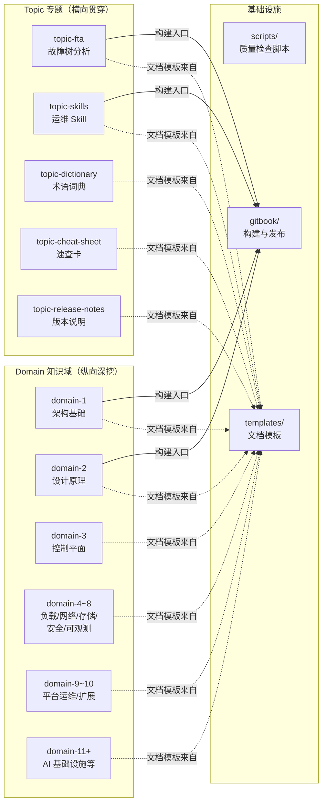
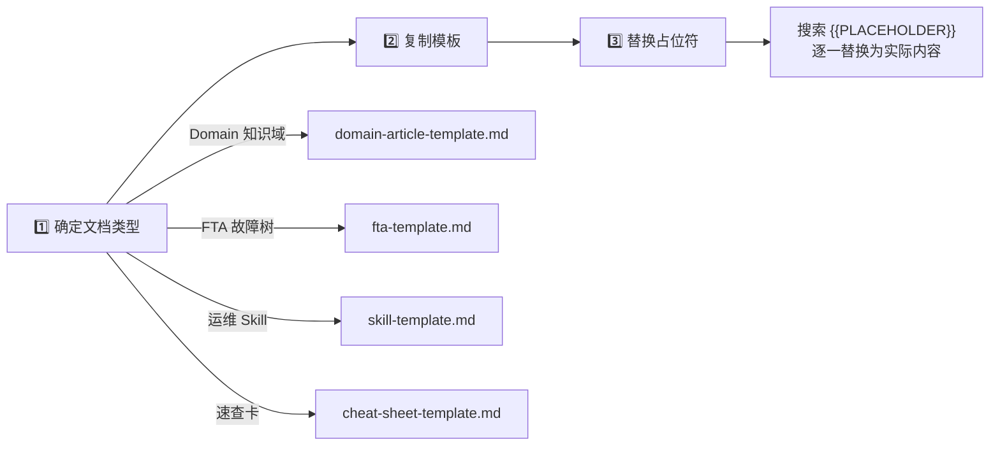
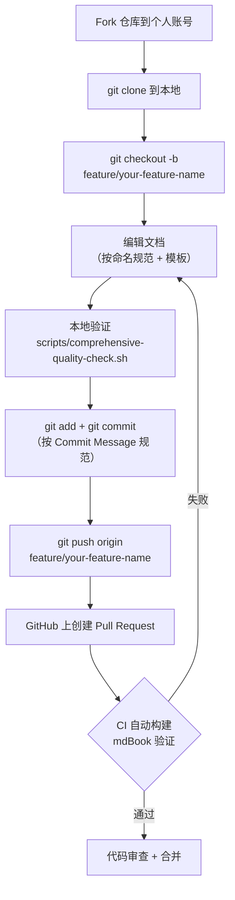

> 本页系统梳理 KUDIG-DATABASE 知识库的完整贡献流程——从目录命名、模板选择到 Git 提交规范与 CI/CD 验证。无论是修正一个拼写错误还是新增一整个知识域，你都能在此找到精确的操作指引。

---

## 仓库架构：贡献者的心智模型

在动手之前，理解仓库的**三层分类体系**是高效贡献的前提。整个知识库围绕"知识域纵向深挖 + 专题横向贯穿"的双轴结构组织。



Sources: [CONTRIBUTING.md](CONTRIBUTING.md#L27-L35), [templates/README.md](templates/README.md#L1-L30)

### 顶层目录分类速查

| 前缀模式 | 用途 | 典型目录 | 贡献门槛 |
|:---|:---|:---|:---:|
| `domain-{N}-` | 知识域，按序号递增 | `domain-01-cluster-fundamentals/` | ⭐⭐⭐ |
| `topic-` | 专题，横切多个知识域 | `topic-fta/`、`topic-skills/` | ⭐⭐ |
| `corpus-config/` | AI 语料库配置与 RAG 分块策略 | `corpus-config/profiles/` | ⭐⭐⭐ |
| `scripts/` | 自动化脚本（质量检查、构建等） | `scripts/comprehensive-quality-check.sh` | ⭐⭐ |
| `templates/` | 标准化文档模板 | `templates/domain-article-template.md` | ⭐ |
| `gitbook/` | mdBook 构建配置与导出 | `gitbook/book.toml` | ⭐⭐ |

Sources: [CONTRIBUTING.md](CONTRIBUTING.md#L27-L35)

---

## 命名规则：精确到每一个字符

命名规范是知识库可导航性的基石。仓库中 600+ 篇文档的一致性，完全依赖以下规则的严格执行。

### 目录命名

| 规则 | 格式 | 示例 |
|:---|:---|:---|
| 知识域目录 | `domain-{两位数字}-{英文短名}` | `domain-5-networking` |
| 专题目录 | `topic-{英文短名}` | `topic-fta`、`topic-skills` |
| 特殊用途目录 | 无前缀，语义化小写英文 | `scripts/`、`reports/`、`man/` |

### 文件命名

| 规则 | 正确 ✅ | 错误 ❌ |
|:---|:---|:---|
| **编号**：统一两位数（`01-` ~ `99-`），超过 99 篇用三位数 | `01-kubernetes-architecture-overview.md` | `1_overview.md` |
| **分隔符**：仅用连字符 `-` | `cni-troubleshooting.md` | `cni_troubleshooting.md` |
| **大小写**：文件名全小写 | `etcd-deep-dive.md` | `ETCD-Deep-Dive.md` |
| **特殊文件**：约定大写名称 | `README.md`、`CHANGELOG.md` | `readme.md`、`Changelog.md` |
| **禁用空格** | `api-priority-fairness.md` | `api priority fairness.md` |

Sources: [CONTRIBUTING.md](CONTRIBUTING.md#L37-L56)

### 新建文件时的实操口诀

1. **确定目标目录** → 在对应 `domain-` 或 `topic-` 下操作
2. **查看已有编号** → 使用 `ls domain-X-xxx/*.md | sort` 找到最大编号
3. **生成文件名** → `{下一位编号}-{英文短名}.md`
4. **复制模板** → `cp templates/domain-article-template.md domain-X-xxx/NN-new-topic.md`

```bash
# 示例：在 domain-5-networking 中新增一篇关于 eBPF 的文档
ls domain-03-networking-traffic/*.md | sort | tail -1
# 输出: domain-03-networking-traffic/38-terway-gc-mechanism.md
# → 新文件编号为 39
cp templates/domain-article-template.md domain-03-networking-traffic/39-ebpf-cilium-deep-dive.md
```

Sources: [templates/README.md](templates/README.md#L16-L22), [CONTRIBUTING.md](CONTRIBUTING.md#L37-L49)

---

## 文档模板：四种武器对应四种场景

仓库在 `templates/` 目录下维护了四套标准化模板，每种模板针对特定的文档类型做了结构预设。**贡献新文档时，必须从对应模板复制并填写**。

### 模板选择矩阵

| 模板 | 适用目录 | 文档定位 | 核心结构 |
|:---|:---|:---|:---|
| [domain-article-template.md](templates/domain-article-template.md) | `domain-*/` | 知识域深度文章 | 概述 → 架构原理 → 核心概念 → 配置部署 → 最佳实践 → 监控告警 → 故障排查 → 参考资料 → 相关文档 |
| [fta-template.md](templates/fta-template.md) | `topic-fta/list/` | 故障树分析文档 | 顶事件 → 故障树结构（Mermaid） → 底事件分析（现象/根因/诊断/修复/预防/告警规则） → 故障统计 |
| [skill-template.md](templates/skill-template.md) | `topic-skills/` | 运维 Skill 文档 | 故障概述 → 快速诊断 → 根因分析 → 修复方案 → 预防措施（完整版含 12 个 Section） |
| [cheat-sheet-template.md](templates/cheat-sheet-template.md) | `topic-cheat-sheet/` | 速查卡 | 分类命令表 → 场景化命令块 → 常见问题速查 |

Sources: [templates/README.md](templates/README.md#L7-L13)

### 模板使用三步法



```bash
# Step 1-2: 复制模板到目标目录
cp templates/domain-article-template.md domain-03-networking-traffic/39-ebpf-cilium-deep-dive.md

# Step 3: 搜索所有占位符并替换
# 在编辑器中全局搜索 {{ ，逐个替换为实际内容
```

Sources: [templates/README.md](templates/README.md#L16-L22)

---

## 文档结构规范：每篇文章的骨架

### 单篇文章必须包含

```markdown
# 标题（一级标题，全文唯一）

> 一句话摘要说明

## 目录（文档超过 200 行时必须）

## 正文章节
...

## 参考资料（如有外部引用）
- [链接文本](URL)

## 相关文档（推荐）
- 前置阅读：[文档名](相对路径)
- 深入阅读：[文档名](相对路径)
- 实践指南：[文档名](相对路径)
```

**关键约束**：

- **一级标题唯一**：全文仅一个 `#`，位于首行
- **标题层级**：不超过 4 级（即最多到 `####`）
- **摘要必须**：一级标题下紧跟 `>` 引用块的一句话摘要
- **版本标注**：摘要行或正文中明确标注适用版本范围

以下是一个实际生产级文章的头部示例：

```markdown
# Kubernetes 架构全景图 (Architecture Overview)

> **适用版本**: v1.25 - v1.32 | **最后更新**: 2026-01 | **参考**: Kubernetes Concepts

## 目录
1. [架构总览](#1-架构总览)
2. [控制平面详解](#2-控制平面详解)
3. [节点组件详解](#3-节点组件详解)
...
```

Sources: [CONTRIBUTING.md](CONTRIBUTING.md#L60-L81), [domain-01-cluster-fundamentals/01-kubernetes-architecture-overview.md](domain-01-cluster-fundamentals/01-kubernetes-architecture-overview.md#L1-L16)

### 目录索引文件 README.md

每个 `domain-` 或 `topic-` 目录**必须**包含 `README.md`，其结构应遵循以下模式：

| 必要元素 | 说明 | 示例 |
|:---|:---|:---|
| 目录标题 | 一级标题 + 文档数量/更新时间 | `# Domain-1: Kubernetes架构基础` |
| 概述段落 | 主题说明 + 核心价值 | 以 emoji + 粗体标记核心卖点 |
| 文档目录表格 | 序号、标题、关键内容、重要程度 | 四列表格，使用 `⭐` 标注重要性 |
| 学习路径建议 | 新手/进阶/专家三条路径 | 用 `→` 串联编号路径 |
| 相关领域链接 | 跨 domain/topic 的关联引用 | 使用相对路径链接 |

Sources: [CONTRIBUTING.md](CONTRIBUTING.md#L83-L89), [domain-01-cluster-fundamentals/README.md](domain-01-cluster-fundamentals/README.md#L1-L82)

---

## 内容质量标准：生产级而非入门级

### 四维质量基准

| 维度 | 要求 | 检查方法 |
|:---|:---|:---|
| **专业深度** | 面向生产环境，非入门级 toy 示例 | 内容是否包含架构原理 + 生产级配置 |
| **准确性** | 所有命令/配置经过验证，标注适用 K8s 版本 | 执行 `scripts/code-example-validation.sh` |
| **完整性** | 原理说明 + 配置示例 + 故障排查 三位一体 | 参照模板 Section 是否全部填写 |
| **时效性** | 标注适用版本范围，过时内容标注弃用提示 | README 中注明最后更新日期 |

### YAML / 代码示例的写法对比

**✅ 合格示例**（有注释、有版本标注、有中文说明）：

```yaml
apiVersion: apps/v1    # K8s v1.9+ GA
kind: Deployment
metadata:
  name: nginx-deployment
  labels:
    app: nginx          # 标签用于 Service 选择器匹配
spec:
  replicas: 3           # 生产环境建议 ≥3 副本
```

**❌ 不合格示例**（无注释、无上下文）：

```yaml
apiVersion: apps/v1
kind: Deployment
metadata:
  name: nginx
```

### 格式细则

| 规则 | 说明 |
|:---|:---|
| 代码块标注语言 | 必须标记类型：````yaml`、````bash`、````go` 等 |
| 表格对齐 | 左对齐用 `:---`，居中用 `:---:` |
| 中英文间距 | 中文与英文/数字之间加空格：`Kubernetes 集群` 而非 `Kubernetes集群` |
| 尾部空白 | Markdown 文件保留尾部空白（`.editorconfig` 配置 `trim_trailing_whitespace = false`） |
| 文件末尾换行 | 所有文件以换行符结尾（`insert_final_newline = true`） |

Sources: [CONTRIBUTING.md](CONTRIBUTING.md#L96-L131), [.editorconfig](.editorconfig#L1-L39)

---

## 交叉引用规范：构建知识网络

### 链接格式三原则

```markdown
# ✅ 原则一：同目录引用用 ./ 前缀
[核心组件深挖](./02-core-components-deep-dive.md)

# ✅ 原则二：跨目录引用用 ../ 回溯
[Service 概念与类型](../domain-03-networking-traffic/06-service-concepts-types.md)

# ❌ 原则三：禁止绝对路径
[文档名](/Users/xxx/kudig-database/domain-5/xxx.md)   ← 禁止
```

### 推荐的文档末尾关联表

每篇文档末尾建议添加以下格式的关联表，帮助读者形成知识闭环：

```markdown
## 相关文档

| 类型 | 文档 | 说明 |
|:---|:---|:---|
| 前置阅读 | [xxx](路径) | 建议先阅读此文档 |
| 深入阅读 | [xxx](路径) | 更深入的专题内容 |
| 速查参考 | [xxx](路径) | 相关速查卡 |
| 故障排查 | [xxx](路径) | 相关故障排查指南 |
```

Sources: [CONTRIBUTING.md](CONTRIBUTING.md#L139-L165)

---

## Git 提交规范：从分支到合并的完整流程

### 分支策略与提交流程



Sources: [CONTRIBUTING.md](CONTRIBUTING.md#L7-L23), [.github/workflows/deploy-pages.yml](.github/workflows/deploy-pages.yml#L1-L74)

### Commit Message 格式

所有提交信息必须遵循 `<type>: <description>` 格式：

| Type | 含义 | 使用场景 |
|:---|:---|:---|
| `docs:` | 文档内容新增或修改 | 新增一篇知识域文章 |
| `fix:` | 修复文档错误 | 修正链接、拼写、格式问题 |
| `refactor:` | 目录结构调整 | 文件重命名、目录拆分 |
| `feat:` | 新增知识域或专题 | 创建新的 `domain-N-xxx` 或 `topic-xxx` |
| `chore:` | 非文档改动 | 脚本更新、配置修改 |

**示例**：
```bash
git commit -m "docs: 新增 domain-5 eBPF 与 Cilium 深度实践"
git commit -m "fix: 修复 domain-3/11-etcd-deep-dive.md 中的失效链接"
git commit -m "refactor: 将 topic-skills 中的 Skill 文件按分类前缀重命名"
```

### Pull Request 检查清单

提交 PR 前请逐项确认：

- [ ] PR 标题清晰描述改动范围（如 `docs: 新增 domain-5 eBPF 深度实践`）
- [ ] 正文中说明涉及的知识域/专题及改动动机
- [ ] 新增文件使用了正确的模板和命名规范
- [ ] 所有内部链接有效（可运行质量检查脚本验证）
- [ ] 如有文件重命名，在 PR 描述中列出旧 → 新映射
- [ ] 代码示例标注了适用版本，并附有中文注释

Sources: [CONTRIBUTING.md](CONTRIBUTING.md#L167-L189)

---

## 质量验证：自动化工具链

仓库内置了两个关键验证脚本，**提交前务必执行**以确保贡献质量。

### 脚本一：综合质量检查

```bash
bash scripts/comprehensive-quality-check.sh
```

该脚本执行六项检查：

| 检查项 | 内容 | 通过标准 |
|:---|:---|:---|
| 目录结构完整性 | 所有 `domain-1` ~ `domain-17` 核心目录是否存在 | 零缺失 |
| Topic 目录完整性 | 核心专题目录及文件数量统计 | 全部存在 |
| README 链接有效性 | 根 README 中引用的所有相对路径文件是否存在 | 零 404 |
| 文档长度检查 | 标记过短（<50 行）的非 README 文件 | 作为警告提示 |
| 文档头部信息 | 检查版本信息字段 | 作为警告提示 |
| 统计汇总 | 全库文档数量、Domain/Topic 文档数 | 供参考 |

Sources: [scripts/comprehensive-quality-check.sh](脚本/comprehensive-quality-check.sh#L1-L116)

### 脚本二：代码示例语法验证

```bash
bash scripts/code-example-validation.sh
```

该脚本自动提取所有 `.md` 文件中的 YAML 和 Bash 代码块，逐一进行语法校验：

- **YAML 块**：通过 `python3 yaml.safe_load()` 验证语法正确性
- **Bash 块**：通过 `bash -n` 进行语法检查
- 最终输出通过/错误计数，发现错误时以非零退出码阻止提交

Sources: [scripts/code-example-validation.sh](脚本/code-example-validation.sh#L1-L95)

### CI/CD 自动验证

每次向 `main` 分支推送后，GitHub Actions 会自动执行以下流水线：


这意味着你的文档一旦合并，将**自动构建并发布**为可浏览的 GitBook 站点。如果构建失败（通常是 SUMMARY.md 生成错误或 Markdown 语法问题），PR 将无法通过检查。

Sources: [.github/workflows/deploy-pages.yml](.github/workflows/deploy-pages.yml#L1-L74), [gitbook/build-scripts/generate-summary.sh](gitbook/build-scripts/generate-summary.sh#L1-L44)

---

## 贡献类型与难度矩阵

| 类型 | 说明 | 难度 | 起始步骤 |
|:---|:---|:---:|:---|
| 🐛 报告问题 | 通过 Issue 报告内容问题 | ⭐ | 直接在 GitHub Issues 中提交 |
| 🔧 修正错误 | 修复拼写、链接、格式问题 | ⭐ | Fork → 修改 → PR |
| 🌍 翻译 | 提供英文版本 | ⭐⭐ | 参照原文结构，保持格式一致 |
| 🛠️ 工具改进 | 改进脚本和自动化工具 | ⭐⭐ | 修改 `scripts/` 或 `gitbook/` 下的文件 |
| 📚 新增文档 | 补充新的知识点/专题 | ⭐⭐⭐ | 选择模板 → 按命名规范创建 → 填写内容 |
| 📊 质量提升 | 增强现有文档深度和示例 | ⭐⭐⭐ | 定位目标文件 → 补充生产级示例和注释 |

Sources: [CONTRIBUTING.md](CONTRIBUTING.md#L192-L200)

---

## EditorConfig：跨编辑器的一致性保障

仓库根目录的 `.editorconfig` 确保无论你使用什么编辑器，格式都保持一致。关键配置摘要：

| 文件类型 | 编码 | 换行符 | 缩进 | 特殊设置 |
|:---|:---|:---|:---|:---|
| 全局默认 | UTF-8 | LF | Space 2 | 末尾换行、去除尾部空白 |
| `*.md` | UTF-8 | LF | Space 2 | **保留**尾部空白（Markdown 语法需要） |
| `*.{yml,yaml}` | UTF-8 | LF | Space 2 | — |
| `*.sh` | UTF-8 | LF | Space 4 | — |
| `*.py` | UTF-8 | LF | Space 4 | — |

大多数现代编辑器（VS Code、JetBrains 系列、Vim）原生支持 EditorConfig，无需额外配置。

Sources: [.editorconfig](.editorconfig#L1-L39)

---

## 下一步建议

完成本页阅读后，建议按以下路径继续探索：

- **了解知识库全景** → [项目总览：KUDIG-DATABASE 全域知识库](1-xiang-mu-zong-lan-kudig-database-quan-yu-zhi-shi-ku)
- **选择学习方向** → [知识地图与学习路径规划](3-zhi-shi-di-tu-yu-xue-xi-lu-jing-gui-hua)
- **深入 Domain 文档写法** → 参考 [domain-01-cluster-fundamentals/README.md](domain-01-cluster-fundamentals/README.md) 作为目录索引的标杆范例
- **了解 Skill 文档规范** → 参考 [topic-skills/skill-schema.md](技能体系/skill-schema.md) 中定义的 12 Section 完整规范
- **理解 AI 语料库接入** → [快速开始：克隆、GitBook 浏览与 AI 语料库接入](2-kuai-su-kai-shi-ke-long-gitbook-liu-lan-yu-ai-yu-liao-ku-jie-ru)