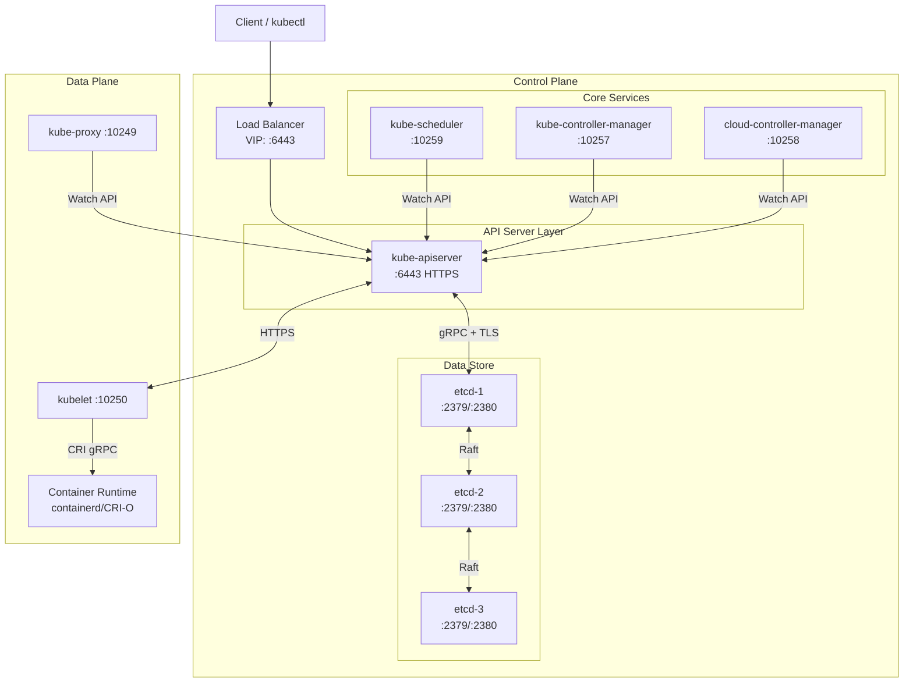
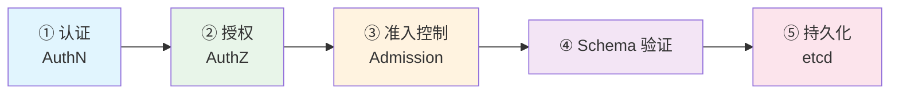
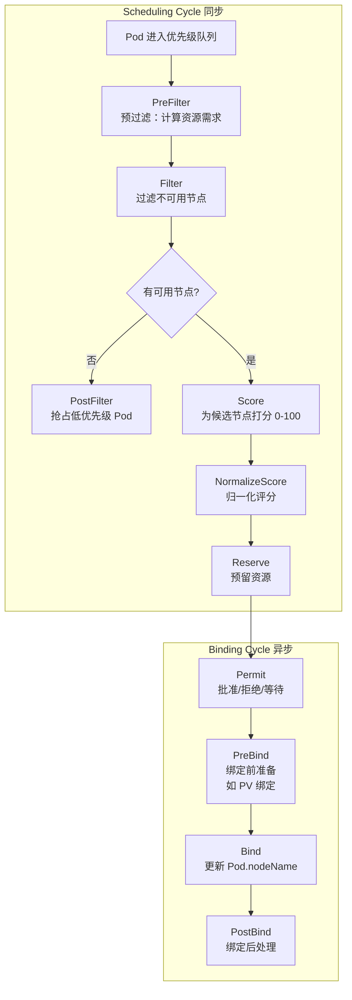
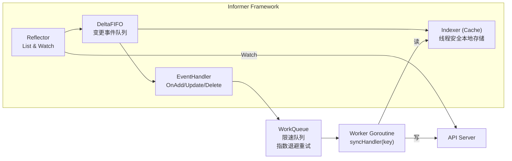
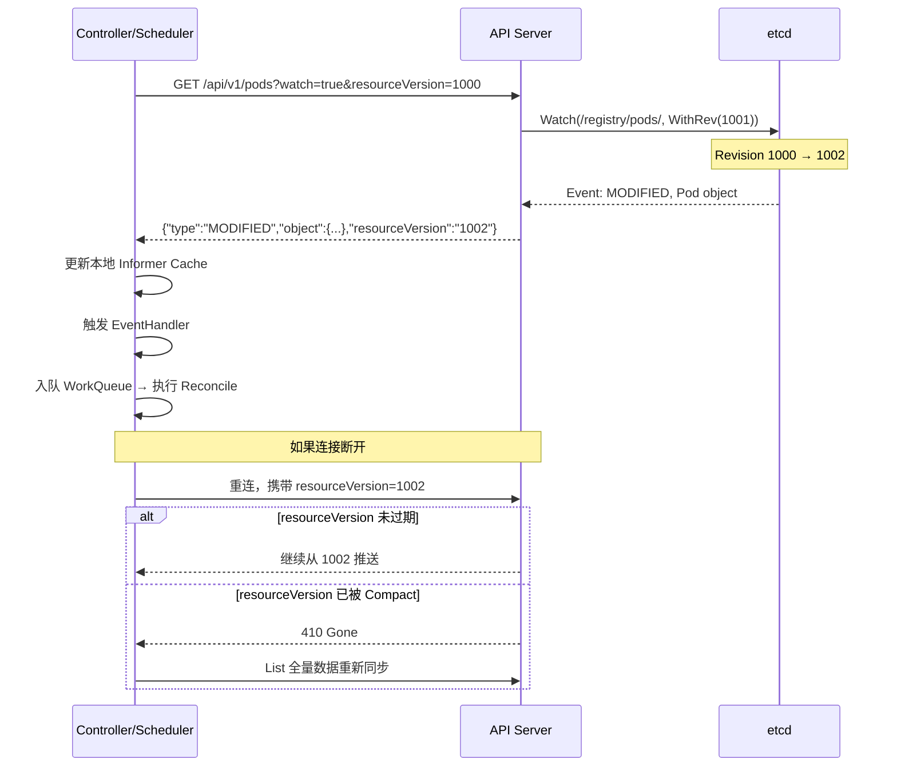

Kubernetes 的架构并非"一堆组件拼凑在一起"——它是一个基于**声明式 API 驱动的闭环控制系统**，以 API Server 为唯一状态入口、以 etcd 为唯一持久化后端、以控制器模式为核心调谐逻辑，将控制平面与数据平面严格分离。本文将从宏观架构到组件内部机制，系统性地拆解 Kubernetes 的核心设计，帮助中级开发者建立准确的架构心智模型，避免在排障和二次开发时"只见树木不见森林"。

Sources: [01-kubernetes-architecture-overview.md](domain-1-architecture-fundamentals/01-kubernetes-architecture-overview.md#L1-L17), [02-core-components-deep-dive.md](domain-1-architecture-fundamentals/02-core-components-deep-dive.md#L1-L22)

---

## 分层架构模型：从编排层到扩展层

理解 Kubernetes 架构的第一步是建立分层认知。Kubernetes 将系统职责拆解为 7 个正交层次，每层独立演进、通过接口交互：

| 层次 | 名称 | 职责 | 关键组件 |
|------|------|------|----------|
| **Layer 1** | 编排层 | 调度、编排、自动化 | Scheduler, Controllers |
| **Layer 2** | API 层 | 统一入口、认证授权、准入控制 | API Server, Admission Controllers |
| **Layer 3** | 数据层 | 持久化存储 | etcd |
| **Layer 4** | 运行时层 | 容器运行环境 | kubelet, Container Runtime |
| **Layer 5** | 网络层 | Pod 网络、Service 负载均衡 | CNI, kube-proxy |
| **Layer 6** | 存储层 | 持久化卷管理 | CSI, Volume Plugin |
| **Layer 7** | 扩展层 | 自定义功能扩展 | CRD, Operator, Webhook |

这个分层模型的一个重要推论是：**任何请求都必须从 Layer 2 进入**。无论是 kubectl 命令、控制器调谐、还是 kubelet 状态上报，所有组件间的交互都以 API Server 为中枢——Scheduler 不直接与 kubelet 通信，Controller Manager 也不直接读写 etcd。这种"星型拓扑"让每个组件只依赖 API Server 一个接口，实现了真正的松耦合。

Sources: [01-kubernetes-architecture-overview.md](domain-1-architecture-fundamentals/01-kubernetes-architecture-overview.md#L162-L173)

---

## 控制平面全景：五大脑的核心分工

下面的 Mermaid 图展示了控制平面的核心组件及其关系。**阅读前请注意**：图中标注了每个组件的默认端口号和通信协议——这些是排障时"第一步要看的东西"。



### 组件启动顺序与依赖链

理解启动顺序对排障至关重要——如果 etcd 没起来，后续所有组件都会级联失败：

| 启动顺序 | 组件 | 依赖条件 | 故障影响 |
|---------|------|---------|---------|
| 1 | **etcd** | 网络、存储就绪 | 整个集群不可用 |
| 2 | **kube-apiserver** | etcd 健康 | 所有 API 调用失败 |
| 3 | **kube-controller-manager** | apiserver 可用 | 控制器停止协调 |
| 4 | **kube-scheduler** | apiserver 可用 | 新 Pod 无法调度 |
| 5 | **kubelet** | apiserver 可用 | 节点 NotReady |
| 6 | **kube-proxy** | apiserver、kubelet 就绪 | Service 网络故障 |
| 7 | **CoreDNS** | kube-proxy、CNI 就绪 | 服务发现失败 |

一个关键的生产实践是：当集群整体不可用时，**首先检查 etcd 健康**（`etcdctl endpoint health`），然后检查 API Server（`curl -k https://localhost:6443/healthz`），沿着依赖链逐级排查。

Sources: [02-core-components-deep-dive.md](domain-1-architecture-fundamentals/02-core-components-deep-dive.md#L76-L88), [01-kubernetes-architecture-overview.md](domain-1-architecture-fundamentals/01-kubernetes-architecture-overview.md#L20-L80)

---

## kube-apiserver：请求处理的五阶段流水线

API Server 是 Kubernetes 的"大脑皮层"——所有状态变更的唯一入口。每个 API 请求都要经过五阶段流水线：



### 认证（AuthN）：你是谁？

API Server 支持多种认证方式，生产环境通常组合使用：

| 认证方式 | 配置参数 | 适用场景 | 安全级别 |
|---------|---------|---------|---------|
| **X509 客户端证书** | `--client-ca-file` | 组件间通信、管理员 | 高 |
| **ServiceAccount Token** | 自动管理 | Pod 内访问 API | 中 |
| **OIDC** | `--oidc-issuer-url` | 企业 SSO 集成 | 高 |
| **Bootstrap Token** | `--enable-bootstrap-token-auth` | 节点加入集群 | 中 |
| **Webhook Token** | `--authentication-token-webhook-config-file` | 自定义认证 | 高 |

生产环境**必须避免**使用静态 Token 文件（`--token-auth-file`），因其凭据明文存储且无法轮转。

Sources: [02-core-components-deep-dive.md](domain-1-architecture-fundamentals/02-core-components-deep-dive.md#L153-L163)

### 授权（AuthZ）：你能做什么？

| 授权模式 | 说明 | 推荐场景 |
|---------|------|---------|
| **RBAC** | 基于角色的访问控制 | 生产环境标准 |
| **Node** | kubelet 专用授权 | **必须启用** |
| **Webhook** | 外部授权服务 | 复杂授权需求 |
| **ABAC** | 基于属性（已弃用） | 不推荐 |

生产环境推荐配置 `--authorization-mode=Node,RBAC`。Node 授权器确保 kubelet 只能访问绑定到自己节点的资源，是安全纵深防御的关键一环。

Sources: [02-core-components-deep-dive.md](domain-1-architecture-fundamentals/02-core-components-deep-dive.md#L188-L196)

### 准入控制（Admission）：请求的最后一道关卡

准入控制分为两个阶段——**Mutating**（变更，可以修改对象）和 **Validating**（验证，只能拒绝）。这个设计极为重要：Mutating 阶段先执行，让 Webhook 有机会注入默认值（如 Sidecar 容器、资源限制）；Validating 阶段后执行，确保最终状态合法。

| 准入控制器 | 类型 | 作用 | 版本 |
|-----------|------|------|------|
| **NamespaceLifecycle** | Validating | 防止在终止中的 NS 创建对象 | 全版本 |
| **PodSecurity** | Validating | Pod 安全标准（替代已移除的 PSP） | v1.25+ |
| **MutatingAdmissionWebhook** | Mutating | 动态修改请求（如注入 Sidecar） | v1.16+ |
| **ValidatingAdmissionWebhook** | Validating | 动态验证请求 | v1.16+ |
| **ValidatingAdmissionPolicy** | Validating | CEL 表达式验证（无需 Webhook 服务） | v1.30 GA |

`ValidatingAdmissionPolicy` 是一个值得关注的演进方向：它用 CEL（Common Expression Language）表达式在 API Server 内部执行验证，**无需部署外部 Webhook 服务**，大幅降低了策略执行的延迟和运维复杂度。

Sources: [02-core-components-deep-dive.md](domain-1-architecture-fundamentals/02-core-components-deep-dive.md#L227-L238)

### API 优先级与公平性（APF）

当集群规模增长，API Server 可能面临过载。APF（API Priority and Fairness）通过 FlowSchema 和 PriorityLevelConfiguration 实现请求分级：

- **FlowSchema**：定义请求分类规则（如 `system-critical` 匹配 `system:masters` 组）
- **PriorityLevelConfiguration**：定义每个优先级的并发份额和排队策略

关键配置 `--enable-priority-and-fairness=true`（默认开启）在高并发场景下至关重要，确保系统组件的请求不会被业务流量"饿死"。

Sources: [02-core-components-deep-dive.md](domain-1-architecture-fundamentals/02-core-components-deep-dive.md#L272-L312)

### 关键监控指标

排障时，以下指标是 API Server 健康的"体温计"：

| 指标名称 | 含义 | 告警阈值 |
|---------|------|---------|
| `apiserver_request_duration_seconds` | 请求延迟 | P99 > 5s |
| `apiserver_current_inflight_requests` | 当前并发请求 | > max×0.9 |
| `apiserver_request_total` | 请求总数（按 code） | 5xx > 1% |
| `etcd_request_duration_seconds` | etcd 请求延迟 | P99 > 500ms |

Sources: [02-core-components-deep-dive.md](domain-1-architecture-fundamentals/02-core-components-deep-dive.md#L373-L382)

---

## etcd：Kubernetes 的"心脏"

etcd 是 Kubernetes 的唯一状态存储。如果 API Server 是大脑，etcd 就是心脏——所有集群状态（Pod、Service、ConfigMap、Secret 等）都持久化在这里。

### Raft 共识：为什么需要奇数节点

etcd 使用 Raft 协议保证分布式一致性。Raft 的核心规则是：**任何写入必须获得多数节点（quorum = ⌊N/2⌋ + 1）确认后才算提交**。

| 节点数 | 容错能力 | 推荐场景 |
|--------|----------|----------|
| 1 | 0 | 开发/测试 |
| 3 | 1 | 小型生产 |
| 5 | 2 | 大型生产 |
| 7 | 3 | 关键业务（罕见） |

**生产实践中最常见的错误**：将 etcd 部署为 2 节点或 4 节点（偶数）。偶数节点并不增加容错能力（3 节点和 4 节点都只能容忍 1 节点故障），反而增加了写延迟（需要更多节点确认）。

Sources: [01-kubernetes-architecture-overview.md](domain-1-architecture-fundamentals/01-kubernetes-architecture-overview.md#L268-L320), [02-core-components-deep-dive.md](domain-1-architecture-fundamentals/02-core-components-deep-dive.md#L385-L428)

### MVCC 与 Watch：资源版本控制的基石

etcd 的 MVCC（Multi-Version Concurrency Control）机制是 Kubernetes 实时性的底层支撑：

- **每个 key 的每次修改都会产生一个新的 Revision**（全局递增版本号）
- **Watch 机制基于 Revision 推送变化**，而非轮询
- **Compaction 机制清理历史版本**，释放空间

这就是为什么 Kubernetes 对象有 `resourceVersion` 字段——它本质上就是 etcd 的 Revision，用于乐观并发控制（OCC）：当两个请求同时修改同一对象时，`resourceVersion` 不匹配的那个会被拒绝。

Sources: [01-kubernetes-architecture-overview.md](domain-1-architecture-fundamentals/01-kubernetes-architecture-overview.md#L293-L319), [02-core-components-deep-dive.md](domain-1-architecture-fundamentals/02-core-components-deep-dive.md#L430-L439)

### etcd 生产运维关键参数

| 参数 | 推荐值 | 说明 |
|------|--------|------|
| `--quota-backend-bytes` | 8589934592（8GB） | 数据库大小配额 |
| `--snapshot-count` | 10000 | 每 N 次事务触发快照 |
| `--auto-compaction-mode` | periodic | 自动压缩模式 |
| `--auto-compaction-retention` | 1h | 每小时压缩一次 |
| `--max-request-bytes` | 10485760（10MB） | 单请求最大大小 |

etcd 的**磁盘性能是集群稳定性的决定性因素**。WAL（预写日志）的 fsync 延迟直接决定写请求延迟——必须使用 SSD，且 P99 fsync 延迟应 < 10ms。

Sources: [02-core-components-deep-dive.md](domain-1-architecture-fundamentals/02-core-components-deep-dive.md#L452-L529)

### etcd 关键监控指标

| 指标名称 | 含义 | 健康基准 | 告警阈值 |
|---------|------|---------|---------|
| `etcd_server_has_leader` | 是否有 Leader | 1 | 0 |
| `etcd_server_leader_changes_seen_total` | Leader 切换次数 | 增长缓慢 | 快速增长 |
| `etcd_mvcc_db_total_size_in_bytes` | 数据库大小 | < quota×0.8 | > quota×0.9 |
| `etcd_disk_wal_fsync_duration_seconds` | WAL 同步延迟 | P99 < 10ms | P99 > 25ms |

Sources: [02-core-components-deep-dive.md](domain-1-architecture-fundamentals/02-core-components-deep-dive.md#L596-L605)

---

## kube-scheduler：Pod 到节点的智能匹配

Scheduler 是 Kubernetes 的"调度大脑"，负责将待调度的 Pod 分配到最合适的节点。其核心工作分为两个周期：

### 调度框架（Scheduling Framework）



### 内置调度插件与权重

不同的调度插件在不同阶段生效，它们的权重决定了最终节点选择：

| 插件名称 | 生效阶段 | 作用 | 默认权重 |
|---------|---------|------|---------|
| **NodeResourcesFit** | Filter/Score | 资源匹配度 | 1 |
| **NodeResourcesBalancedAllocation** | Score | CPU/内存均衡分配 | 1 |
| **TaintToleration** | Filter/Score | 污点容忍 | 3 |
| **NodeAffinity** | Filter/Score | 节点亲和性 | 2 |
| **PodTopologySpread** | Filter/Score | 跨拓扑域均匀分布 | 2 |
| **ImageLocality** | Score | 优先选择已有镜像的节点 | 1 |
| **InterPodAffinity** | Filter/Score | Pod 间亲和/反亲和 | 2 |
| **VolumeBinding** | Filter/PreBind | 存储卷绑定检查 | - |

**权重设计的原则**：TaintToleration 权重最高（3），因为污点通常表示节点有特殊属性（如 GPU 节点、专用节点），应该优先尊重。

Sources: [02-core-components-deep-dive.md](domain-1-architecture-fundamentals/02-core-components-deep-dive.md#L608-L688), [01-kubernetes-architecture-overview.md](domain-1-architecture-fundamentals/01-kubernetes-architecture-overview.md#L355-L439)

### 抢占调度：优先级驱动的 Pod 驱逐

当集群资源不足时，高优先级 Pod 可以抢占低优先级 Pod：

| PriorityClass | 值 | 使用场景 |
|--------------|-----|---------|
| system-node-critical | 2000001000 | 系统关键 Pod |
| system-cluster-critical | 2000000000 | 集群关键 Pod（如 CoreDNS） |
| high-priority | 1000000 | 业务关键服务 |
| default | 0 | 默认 |
| batch-low | -100 | 批处理任务（可被抢占） |

Sources: [02-core-components-deep-dive.md](domain-1-architecture-fundamentals/02-core-components-deep-dive.md#L810-L841)

---

## kube-controller-manager：40+ 控制器的协调中枢

Controller Manager 是 Kubernetes"声明式语义"的核心执行者。它内含 40+ 控制器，每个控制器遵循统一的**调谐循环（Reconcile Loop）**模式：

```
期望状态 = 用户在 YAML 中定义的
当前状态 = 集群中实际运行的
动作 = 让当前状态趋近期望状态
```

### 控制器分类

| 类别 | 控制器 | 职责 |
|------|-------|------|
| **工作负载** | Deployment, ReplicaSet, StatefulSet, DaemonSet, Job, CronJob | 管理应用生命周期 |
| **服务发现** | Endpoints, EndpointSlice, Service | 维护网络端点 |
| **节点管理** | Node, NodeLifecycle, TaintManager | 节点健康与驱逐 |
| **存储** | PersistentVolume, AttachDetach, VolumeExpand | 卷绑定与扩展 |
| **安全** | ServiceAccount, Token, CSR | 凭据与证书 |
| **资源管理** | ResourceQuota, Namespace, GarbageCollector, HPA | 配额与自动伸缩 |

### Informer + WorkQueue：控制器的运行引擎

所有控制器共享同一套 Informer 框架，这是理解控制器性能和行为的关键：



**Informer 机制的核心优势**：

1. **本地缓存**：控制器不需要每次都请求 API Server，从内存中的 Indexer 即可读取当前状态
2. **增量事件**：通过 Watch 机制只接收变化事件，而非全量拉取
3. **限速重试**：WorkQueue 的指数退避机制（5ms → 10ms → 20ms → ... → 1000s）避免错误状态下的雪崩
4. **去重**：同一对象的多次事件合并为一次处理

Sources: [02-core-components-deep-dive.md](domain-1-architecture-fundamentals/02-core-components-deep-dive.md#L855-L948), [01-kubernetes-architecture-overview.md](domain-1-architecture-fundamentals/01-kubernetes-architecture-overview.md#L440-L459)

### Leader 选举：多副本只运行一个活跃实例

Scheduler 和 Controller Manager 都通过 Leader 选举机制实现 HA：多个实例同时运行，但只有一个持有 Lease 执行工作，其余实例处于待命状态。

| 参数 | 描述 | 默认值 |
|------|------|--------|
| `--leader-elect` | 启用 Leader 选举 | true |
| `--leader-elect-lease-duration` | Lease 持续时间 | 15s |
| `--leader-elect-renew-deadline` | 续约截止时间 | 10s |
| `--leader-elect-retry-period` | 重试周期 | 2s |

如果活跃实例在 `lease-duration` 内未续约，其他实例将发起新一轮选举。

Sources: [01-kubernetes-architecture-overview.md](domain-1-architecture-fundamentals/01-kubernetes-architecture-overview.md#L461-L488)

---

## 节点组件：数据平面的三大支柱

### kubelet：节点上的"全能管家"

kubelet 是每个节点上运行的核心代理，负责 Pod 的完整生命周期管理。其内部架构由多个模块协同工作：

| 模块 | 职责 |
|------|------|
| **Pod Lifecycle Manager** | 核心调谐循环 `syncPod()`：创建/更新/删除 Pod |
| **PLEG** (Pod Lifecycle Event Generator) | 监听容器运行时事件，触发 syncPod |
| **Probe Manager** | 执行三类探测：Liveness、Readiness、Startup |
| **Volume Manager** | 卷挂载/卸载、CSI 插件交互 |
| **Eviction Manager** | 监控资源压力，驱逐 Pod（内存/磁盘/inode） |
| **cAdvisor** | 容器资源监控（CPU/内存/网络/磁盘 I/O） |

kubelet 的关键配置参数直接影响节点稳定性：

| 参数 | 描述 | 推荐值 |
|------|------|--------|
| `--container-runtime-endpoint` | CRI Socket | `unix:///run/containerd/containerd.sock` |
| `--cgroup-driver` | cgroup 驱动 | `systemd`（须与运行时一致） |
| `--eviction-hard` | 硬驱逐阈值 | `memory.available<100Mi,nodefs.available<10%` |
| `--max-pods` | 单节点最大 Pod 数 | 110 |
| `--cluster-dns` | CoreDNS IP | 10.96.0.10 |

Sources: [01-kubernetes-architecture-overview.md](domain-1-architecture-fundamentals/01-kubernetes-architecture-overview.md#L513-L624)

### kube-proxy：Service 负载均衡的三种模式

kube-proxy 负责 Service VIP 到后端 Pod 的流量转发。三种模式的性能差异显著：

| 模式 | 延迟 | 吞吐量 | Service 规模 | 推荐场景 |
|------|------|--------|-------------|----------|
| **iptables** | 高 | 低 | <1000 | 小规模/兼容性 |
| **IPVS** | 中 | 高 | >1000 | 大规模生产 |
| **eBPF** (Cilium) | 最低 | 最高 | 无限制 | 高性能/新内核 |

**IPVS 模式**使用内核哈希表实现 O(1) 规则匹配，是大规模生产环境的标准选择。生产环境配置示例：

```yaml
apiVersion: kubeproxy.config.k8s.io/v1alpha1
kind: KubeProxyConfiguration
mode: ipvs
ipvs:
  scheduler: rr  # 轮询
  strictARP: true  # 配合 MetalLB
  syncPeriod: 30s
```

Sources: [01-kubernetes-architecture-overview.md](domain-1-architecture-fundamentals/01-kubernetes-architecture-overview.md#L625-L694)

### 容器运行时：从 Docker 到 containerd 的演进

Kubernetes 1.24 正式移除了 dockershim，当前推荐的运行时是 **containerd**（通用）或 **CRI-O**（Kubernetes 专用）。两者都通过 CRI（Container Runtime Interface）与 kubelet 交互：

```
kubelet ──CRI gRPC──► containerd/CRI-O ──OCI──► runc/crun/gVisor
```

| 运行时 | 优点 | 适用场景 |
|--------|------|----------|
| **containerd** | 轻量、性能好、生态丰富 | 通用生产 |
| **CRI-O** | 极简、Kubernetes 原生 | Kubernetes 专用 |
| **Docker + cri-dockerd** | 生态最好、调试方便 | 开发环境 |

Sources: [01-kubernetes-architecture-overview.md](domain-1-architecture-fundamentals/01-kubernetes-architecture-overview.md#L696-L717)

---

## 核心设计原则：理解 Kubernetes 的"为什么"

Kubernetes 的架构决策并非随意选择，而是基于一组明确的设计原则：

| 设计原则 | 描述 | 体现 |
|----------|------|------|
| **声明式 API** | 描述期望状态，由系统驱动到达 | 所有资源都是声明式配置 |
| **控制器模式** | 持续调谐当前状态到期望状态 | Controller Manager 包含 40+ 控制器 |
| **松耦合设计** | 组件通过 API Server 交互 | 组件可独立升级和扩展 |
| **可扩展性** | 插件化架构 | CRI/CNI/CSI/Device Plugin/Admission |
| **自愈能力** | 自动故障检测与恢复 | ReplicaSet/DaemonSet 自动重启 |
| **水平扩展** | 通过副本实现扩展 | HPA/VPA/Cluster Autoscaler |
| **不可变基础设施** | 容器镜像不可变 | 配置变更通过滚动更新 |
| **最终一致性** | 分布式系统一致性模型 | 基于 etcd 的最终一致性 |

其中最核心的是**声明式 API + 控制器模式**的组合。这个模式意味着：你永远不需要告诉 Kubernetes"怎么做"，只需要告诉它"我要什么"。Controller 会持续观察、比较、调谐，直到当前状态与期望状态一致。

Sources: [01-kubernetes-architecture-overview.md](domain-1-architecture-fundamentals/01-kubernetes-architecture-overview.md#L149-L161), [01-design-principles-foundations.md](domain-2-design-principles/01-design-principles-foundations.md#L1-L11)

---

## 组件通信机制：Watch 驱动的实时响应

Kubernetes 的组件通信完全基于 **Watch 机制**（而非轮询）。这个机制建立在 etcd 的 MVCC Revision 之上：



Watch 机制的四个关键参数：

| 参数 | 描述 | 示例 |
|------|------|------|
| `watch=true` | 启用 Watch | `?watch=true` |
| `resourceVersion` | 起始版本 | `?resourceVersion=1000` |
| `timeoutSeconds` | 超时时间 | `?timeoutSeconds=600` |
| `allowWatchBookmarks` | 允许 Bookmark（保持连接活跃） | `?allowWatchBookmarks=true` |

Sources: [01-kubernetes-architecture-overview.md](domain-1-architecture-fundamentals/01-kubernetes-architecture-overview.md#L911-L1018)

---

## 高可用架构：生产环境的必修课

### 控制平面 HA 策略

| 组件 | HA 方式 | 最小副本数 | 推荐副本数 |
|------|---------|-----------|-----------|
| **API Server** | 多副本 + 外部 LB（Active-Active） | 2 | 3 |
| **etcd** | Raft 集群（奇数节点） | 3 | 5 |
| **Scheduler** | Leader 选举（Active-Standby） | 2 | 3 |
| **Controller Manager** | Leader 选举（Active-Standby） | 2 | 3 |

注意 API Server 和 etcd 的 HA 模式差异：**API Server 是无状态的**，可以 Active-Active 部署（多个实例同时处理请求）；**Scheduler 和 Controller Manager 是有状态的**，通过 Leader 选举保证同一时刻只有一个实例在执行调度/控制逻辑。

### etcd 备份：最后的防线

etcd 备份是集群灾难恢复的最后一道防线。生产环境应建立自动备份策略：

```bash
# 创建快照
ETCDCTL_API=3 etcdctl snapshot save /backup/etcd-$(date +%Y%m%d-%H%M%S).db \
  --endpoints=https://127.0.0.1:2379 \
  --cacert=/etc/kubernetes/pki/etcd/ca.crt \
  --cert=/etc/kubernetes/pki/etcd/server.crt \
  --key=/etc/kubernetes/pki/etcd/server.key

# 验证快照完整性
ETCDCTL_API=3 etcdctl snapshot status /backup/etcd-20260120.db --write-out=table
```

Sources: [01-kubernetes-architecture-overview.md](domain-1-architecture-fundamentals/01-kubernetes-architecture-overview.md#L1021-L1135), [02-core-components-deep-dive.md](domain-1-architecture-fundamentals/02-core-components-deep-dive.md#L531-L579)

---

## 扩展机制：Kubernetes 的可插拔接口

Kubernetes 的可扩展性是其成为"平台之平台"的根本原因。四大标准接口让 Kubernetes 可以适配任何基础设施：

| 接口 | 用途 | 典型实现 |
|------|------|----------|
| **CRI** (Container Runtime Interface) | 容器运行时 | containerd, CRI-O |
| **CNI** (Container Network Interface) | Pod 网络 | Calico, Cilium, Flannel |
| **CSI** (Container Storage Interface) | 持久化存储 | 各云厂商 CSI Driver |
| **Device Plugin** | 硬件设备（GPU/RDMA/TPU） | NVIDIA Device Plugin |

在 API 层面，Kubernetes 提供三种扩展方式：

| 扩展方式 | 用途 | 复杂度 |
|---------|------|--------|
| **CRD** (CustomResourceDefinition) | 定义新的 API 资源类型 | 中 |
| **Operator** | CRD + 自定义控制器 | 高 |
| **Admission Webhook** | 拦截和修改 API 请求 | 中 |

Sources: [01-kubernetes-architecture-overview.md](domain-1-architecture-fundamentals/01-kubernetes-architecture-overview.md#L1139-L1170)

---

## 版本演进与 API 成熟度

Kubernetes 严格遵循 API 版本演进规则：`Alpha → Beta → GA → Stable`，每个阶段都有明确的稳定性承诺。以下是近年来最重要的 API 变更：

| 版本 | 关键变更 | 迁移操作 |
|------|---------|---------|
| v1.22 | 移除多个 beta API（Ingress、CRD 等） | 必须使用 v1 API |
| v1.24 | 移除 dockershim | 迁移到 containerd/CRI-O |
| v1.25 | 移除 PodSecurityPolicy | 迁移到 Pod Security Admission |
| v1.30 | ValidatingAdmissionPolicy GA | 可替代 Webhook 验证 |
| v1.32 | In-Place Pod Vertical Scaling GA | 就地调整容器资源 |

**Feature Gate 状态**（v1.32 值得关注）：

| 功能 | 状态 | 说明 |
|------|------|------|
| Sidecar Containers | GA | Sidecar 独立生命周期管理 |
| ValidatingAdmissionPolicy | GA | CEL 表达式验证（无需 Webhook） |
| In-Place Pod Vertical Scaling | GA | 就地调整 Pod 资源（不需重启） |
| User Namespaces | GA | 容器内用户空间隔离 |
| Dynamic Resource Allocation | Beta | GPU 等设备动态分配 |

Sources: [03-api-versions-features.md](domain-1-architecture-fundamentals/03-api-versions-features.md#L1-L100)

---

## 源码结构：从目录理解架构

如果你需要深入源码排障或二次开发，理解 Kubernetes 的代码组织至关重要：

| 顶层目录 | 用途 | 生产排障价值 |
|---------|------|-------------|
| `cmd/` | 所有组件的 main 入口 | 启动参数解析、组件初始化流程 |
| `pkg/` | 核心业务逻辑 | 控制器实现、调度算法、kubelet 逻辑 |
| `staging/` | 独立发布的 Go 模块（如 client-go） | 客户端开发、CRD 开发 |
| `api/` | OpenAPI 规范 | API 字段验证规则 |
| `hack/` | 开发工具脚本 | 代码生成、本地测试 |

**核心入口文件速查**：

| 组件 | 入口路径 | 关键文件 |
|------|---------|---------|
| API Server | `cmd/kube-apiserver/` | `app/server.go` |
| Controller Manager | `cmd/kube-controller-manager/` | `app/controllermanager.go` |
| Scheduler | `cmd/kube-scheduler/` | `app/server.go` |
| Kubelet | `cmd/kubelet/` | `app/server.go` |

Sources: [04-source-code-structure.md](domain-1-architecture-fundamentals/04-source-code-structure.md#L1-L82)

---

## 组件版本兼容性矩阵

升级集群时，必须确保所有组件版本兼容：

| 组件 | v1.29 | v1.30 | v1.31 | v1.32 |
|------|-------|-------|-------|-------|
| **etcd** | 3.5.x | 3.5.x | 3.5.x | 3.5.x |
| **containerd** | 1.7+ | 1.7+/2.0 | 1.7+/2.0 | 2.0+ |
| **CoreDNS** | 1.11+ | 1.11+ | 1.11+ | 1.11+ |
| **Cilium** | 1.15+ | 1.15+ | 1.16+ | 1.16+ |

Sources: [02-core-components-deep-dive.md](domain-1-architecture-fundamentals/02-core-components-deep-dive.md#L89-L99)

---

## 延伸阅读

本文覆盖了 Kubernetes 架构基础与核心组件原理的全景。以下页面将带你进入更深入的领域：

- **设计原理深入**：[设计原理：声明式 API、控制器模式与 etcd 共识](6-she-ji-yuan-li-sheng-ming-shi-api-kong-zhi-qi-mo-shi-yu-etcd-gong-shi) — 深入 Informer/WorkQueue 机制、etcd Raft 共识的数学基础
- **控制平面实战**：[控制平面深度剖析：API Server、Scheduler、KCM 与 CRI/CSI/CNI](7-kong-zhi-ping-mian-shen-du-pou-xi-api-server-scheduler-kcm-yu-cri-csi-cni) — 每个组件的详细配置参数与调优指南
- **工作负载管理**：[工作负载管理：Pod 生命周期、调度策略与弹性伸缩](8-gong-zuo-fu-zai-guan-li-pod-sheng-ming-zhou-qi-diao-du-ce-lue-yu-dan-xing-shen-suo) — 从架构层面深入理解 Pod 创建到销毁的完整流程
- **故障排查方法论**：[结构化故障排查：配置优先方法论与全组件排障指南](15-jie-gou-hua-gu-zhang-pai-cha-pei-zhi-you-xian-fang-fa-lun-yu-quan-zu-jian-pai-zhang-zhi-nan) — 基于本文的架构知识进行系统化排障