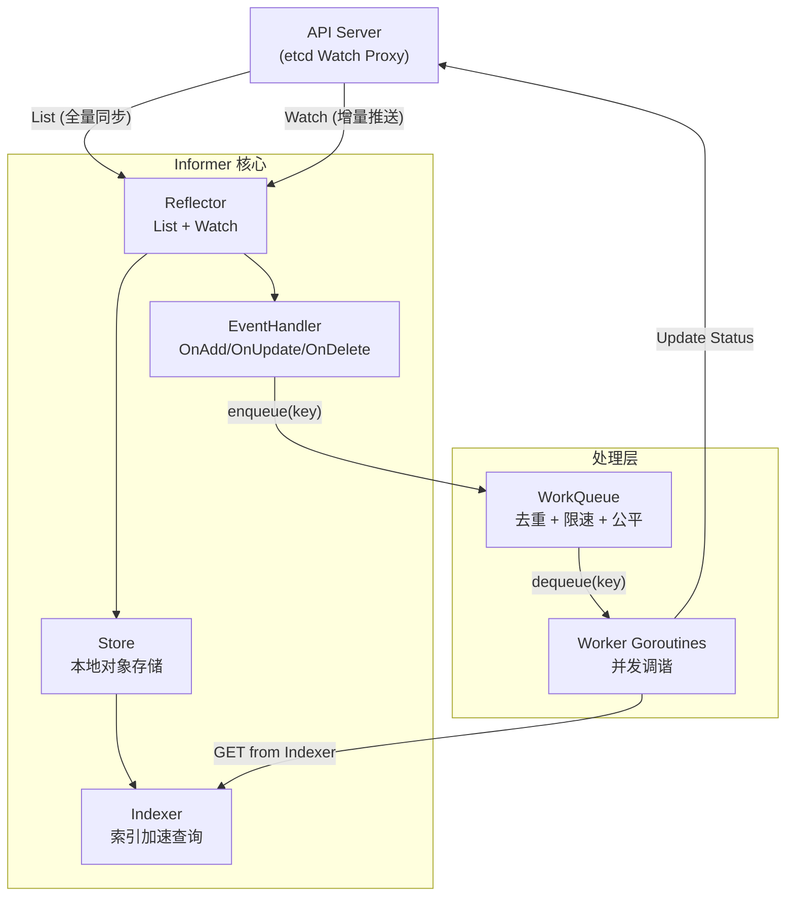
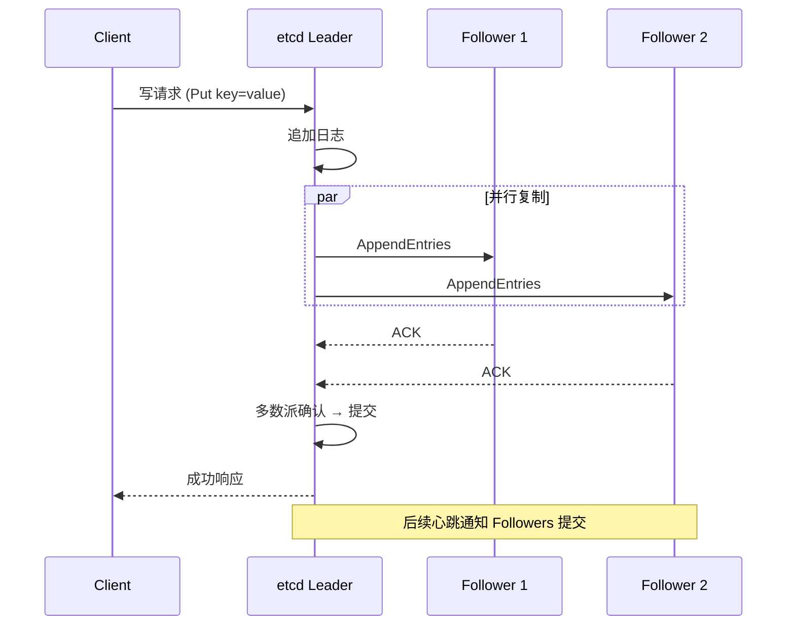
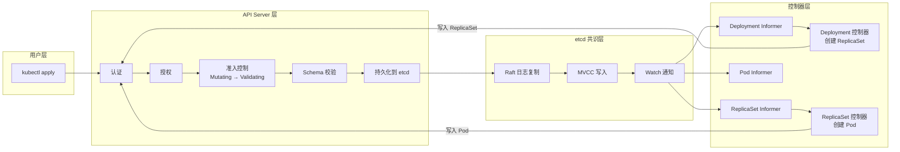

Kubernetes 的设计哲学并非"容器编排"四个字可以概括。它真正的工程核心是一个 **声明式面向终态的闭环控制系统**——用户提交意图（Spec），系统持续调谐（Reconcile）直至实际状态（Status）收敛于期望值，而这一过程的所有持久化数据都锚定在基于 Raft 共识的 etcd 集群之上。本文将深入解析这三大支柱——声明式 API、控制器模式与 etcd 分布式共识——的设计原理、交互机制与生产级实践要点，揭示它们如何协同构成 Kubernetes 的自愈引擎。

Sources: [01-design-principles-foundations.md](domain-01-cluster-fundamentals/01-design-principles-foundations.md#L1-L11)

---

## 第一支柱：声明式 API 与面向终态设计

### 核心心智模型：Spec / Status 双轨制

Kubernetes 的每一个资源对象都严格遵循 **Spec / Status 双轨模式**：Spec 由用户（或自动化系统）写入期望状态，Status 由控制器写入实际观测状态。这种分离不是简单的数据结构设计，而是一种**关注点分离的架构契约**——写入者各司其职，读取消费者各取所需，etcd 作为唯一真相源（Single Source of Truth）保证一致性。

| 维度 | Spec（期望状态） | Status（实际状态） |
|------|------------------|-------------------|
| 写入者 | 用户、GitOps 自动化 | 控制器（系统自治） |
| 读取者 | 控制器（作为调谐输入） | 用户、监控系统 |
| 更新频率 | 低（用户操作驱动） | 高（每次调谐循环） |
| 验证策略 | 严格 Schema 校验 | 宽松校验（控制器自治） |
| 典型字段 | `replicas: 3` | `readyReplicas: 3` |

Sources: [02-declarative-api-pattern.md](domain-01-cluster-fundamentals/02-declarative-api-pattern.md#L14-L106)

### API Group 与版本演进：可扩展性的基石

Kubernetes 的 API 并非一个单一平面，而是按 **API Group** 组织的模块化层次结构。Core Group（空字符串）承载 Pod、Service 等原始资源，`apps`、`batch`、`networking.k8s.io` 等扩展组承载演进速度各异的功能模块。这种分层使得系统可以在不破坏向后兼容性的前提下持续演进。

| API Group | 核心资源 | 语义域 |
|-----------|---------|--------|
| core (空) | Pod, Service, ConfigMap, Secret, PV | 基础原语 |
| apps | Deployment, StatefulSet, DaemonSet | 应用负载管理 |
| batch | Job, CronJob | 批处理任务 |
| networking.k8s.io | Ingress, NetworkPolicy | 网络策略与路由 |
| rbac.authorization.k8s.io | Role, ClusterRole, RoleBinding | 访问控制 |
| storage.k8s.io | StorageClass, VolumeAttachment | 存储抽象 |
| autoscaling | HPA | 弹性伸缩 |

每个 API 资源遵循 **Alpha → Beta → Stable** 的三级成熟度阶梯：Alpha 版本无任何兼容性承诺，功能可能被随时删除；Beta 版本向後兼容但语义可能微调；Stable 版本则提供长期支持保证，适用于生产环境。

Sources: [02-declarative-api-pattern.md](domain-01-cluster-fundamentals/02-declarative-api-pattern.md#L24-L52)

### 乐观并发控制：无锁世界中的冲突仲裁

在高度并发的控制器生态中，多个控制器可能同时修改同一个资源。Kubernetes 采用 **乐观并发控制** 而非悲观锁——每个资源携带全局唯一的 `resourceVersion`（源自 etcd 的 revision），更新时 API Server 校验版本号是否匹配。匹配则成功并分配新版本号，不匹配则返回 `409 Conflict`，要求客户端重新获取最新版本后重试。

这一机制的关键认知在于区分两个概念：**Generation** 与 **ResourceVersion**。Generation 作用域为单个对象，仅在 Spec 变更时递增，控制器通过比较 `observedGeneration < generation` 判断是否需要调谐；ResourceVersion 作用域为全局，任何变更都触发递增，用于乐观锁与 Watch 断点续传。

```go
// 控制器中判断是否需要调谐
func needsReconcile(deploy *appsv1.Deployment) bool {
    return deploy.Status.ObservedGeneration < deploy.Generation
}
```

Sources: [06-resource-version-control.md](domain-01-cluster-fundamentals/06-resource-version-control.md#L115-L132)

### Server-Side Apply (SSA)：多管理器协同的未来

传统 Client-Side Apply 依赖客户端计算三方合并（3-way merge），在多管理器场景（如 HPA 修改副本数的同时用户修改镜像标签）下容易导致字段丢失或冲突。**SSA** 将合并逻辑移至 API Server 端，通过 **Managed Fields** 机制显式记录每个字段的所有权——每个管理器声明它所拥有的字段路径，当不同管理器尝试修改同一字段时自动触发冲突检测。

这一演进对 Operator 开发者至关重要：在编写现代 Operator 时，应优先使用 SSA 接口进行资源更新，避免因隐式覆盖导致的状态漂移。

Sources: [02-declarative-api-pattern.md](domain-01-cluster-fundamentals/02-declarative-api-pattern.md#L1-L12), [06-resource-version-control.md](domain-01-cluster-fundamentals/06-resource-version-control.md#L134-L159)

---

## 第二支柱：控制器模式与调谐循环

### 水平触发 vs. 边缘触发：鲁棒性的数学基础

Kubernetes 控制器采用 **水平触发** 语义而非边缘触发。二者的区别关乎系统在故障场景下的行为本质：边缘触发系统仅响应状态变化事件，一旦事件丢失（网络抖动、控制器重启），就永久丢失该信号；水平触发系统在每次调谐循环中全量比较 Spec 与 Status，不依赖"发生了什么"，而只关注"现状是什么"。

这意味着：即使控制器崩溃重启、网络分区恢复、或事件管道中丢失了关键通知，下一次调谐循环仍然会发现 Spec ≠ Status 的不一致，并自动触发修正。**最终一致性** 是通过水平触发的幂等调谐实现的——这是 Kubernetes 自愈能力的数学基石。

> **工程铁律**：在实现 `Reconcile` 函数时，务必保持其**幂等性**。不要假设上一次操作成功，每一次循环都应该是一个完整且独立的检查过程。

Sources: [03-controller-pattern.md](domain-01-cluster-fundamentals/03-controller-pattern.md#L1-L11)

### Informer / WorkQueue 架构：事件驱动的精密齿轮

控制器不是直接轮询 API Server，而是通过 **Informer** 机制实现高效的事件驱动架构。Informer 由四个精密组件构成，形成一条从 API Server 到调谐逻辑的数据管道：



**Reflector** 启动时执行一次全量 List 获取所有对象，随后通过长连接 Watch 持续接收增量事件。数据流入 **Store** 维护的本地缓存，经由 **Indexer** 建立索引加速查询。EventHandler 将变化对象的 key（`namespace/name` 格式）投入 **WorkQueue**，Worker 协程从队列取出 key 执行调谐逻辑。

Sources: [03-controller-pattern.md](domain-01-cluster-fundamentals/03-controller-pattern.md#L312-L356)

### WorkQueue 的四大工程特性

WorkQueue 并非简单的 FIFO 队列，它是 Kubernetes 控制器可靠性工程的关键保障，具备四个核心特性：

| 特性 | 英文 | 工程意义 |
|------|------|---------|
| **去重** | De-duplication | 相同 key 在被处理前只保留一份，防止突发事件风暴导致重复调谐 |
| **限速重试** | Rate Limiting | 失败项以指数退避（Exponential Backoff）重新入队，避免错误风暴压垮系统 |
| **公平调度** | Fair Scheduling | 不同 key 轮询调度，防止单个热点资源饿死其他调谐 |
| **优雅关闭** | Graceful Shutdown | 关闭信号后等待所有进行中的调谐完成，保证不丢数据 |

Kubernetes 提供三种队列类型递进抽象：基础 FIFO Queue、支持延迟入队的 Delaying Queue、以及集成了指数退避限速器的 Rate Limiting Queue。生产环境控制器应始终使用 Rate Limiting Queue。

Sources: [03-controller-pattern.md](domain-01-cluster-fundamentals/03-controller-pattern.md#L357-L373)

### 调谐循环的生产级实现模式

一个生产级控制器的 Reconcile 函数需要处理三条核心路径：**资源不存在**时静默退出（资源已被删除，无需处理）；**资源正在删除**时执行 Finalizer 清理逻辑；**资源正常**时执行主调谐逻辑。以下模式展示了完整的错误分类与重试策略：

```go
func (r *Reconciler) Reconcile(ctx context.Context, req ctrl.Request) (ctrl.Result, error) {
    obj := &MyCustomResource{}
    if err := r.Get(ctx, req.NamespacedName, obj); err != nil {
        return ctrl.Result{}, client.IgnoreNotFound(err)  // 资源不存在，静默退出
    }
    
    if obj.DeletionTimestamp != nil {
        return r.handleFinalizer(ctx, obj)  // 删除中，执行清理
    }
    
    // 添加 Finalizer（如未添加）
    if !controllerutil.ContainsFinalizer(obj, myFinalizerName) {
        controllerutil.AddFinalizer(obj, myFinalizerName)
        return ctrl.Result{Requeue: true}, r.Update(ctx, obj)
    }
    
    result, err := r.reconcileLogic(ctx, obj)
    if err != nil {
        switch {
        case isTransientError(err):
            return ctrl.Result{RequeueAfter: calculateBackoff(retryCount)}, nil  // 临时错误，退避重试
        case isPermanentError(err):
            return ctrl.Result{}, nil  // 永久错误，停止重试，记录日志
        default:
            return ctrl.Result{}, err  // 未知错误，交给框架重试
        }
    }
    return result, nil
}
```

Sources: [03-controller-pattern.md](domain-01-cluster-fundamentals/03-controller-pattern.md#L182-L228)

### 内置控制器的层次化协作

Kubernetes 的内置控制器并非平铺直叙的独立实体，而是通过 **Owner References** 机制形成层次化的资源管理树。Deployment 控制器管理 ReplicaSet，ReplicaSet 控制器管理 Pod——每一层控制器只关注自己直接管理的子资源，实现了关注点的完美分离。

| 控制器 | 监听资源 | 创建/管理子资源 | 核心职责 |
|--------|---------|---------------|---------|
| Deployment | Deployment | ReplicaSet | 滚动更新、版本回退 |
| ReplicaSet | ReplicaSet + Pod | Pod | 维护副本数 |
| StatefulSet | StatefulSet + Pod | Pod + PVC | 有序部署、持久身份 |
| DaemonSet | DaemonSet + Node | Pod | 每节点一个 Pod |
| Job | Job + Pod | Pod | 任务完成后清理 |
| Endpoints | Service + Pod | Endpoints | 维护后端端点列表 |
| GC | 所有资源 | — | 孤儿资源回收 |

Sources: [03-controller-pattern.md](domain-01-cluster-fundamentals/03-controller-pattern.md#L470-L484)

---

## 第三支柱：etcd 分布式共识与持久化

### Raft 共识协议：强一致性的工程实现

etcd 基于 **Raft 共识协议** 实现强一致性。Raft 将分布式共识问题分解为三个子问题：**Leader 选举**、**日志复制** 和 **安全性保证**。在一个 N 节点的 etcd 集群中，任何写请求都必须经过 Leader，Leader 将日志条目并行发送给所有 Follower，当收到多数派确认后提交日志并响应客户端。



集群规模与容错能力遵循公式 **容忍故障节点数 = (N-1)/2**：3 节点集群容忍 1 个故障，5 节点容忍 2 个，7 节点容忍 3 个。生产环境推荐 3 节点起步，关键场景使用 5 节点。

Sources: [07-distributed-consensus-etcd.md](domain-01-cluster-fundamentals/07-distributed-consensus-etcd.md#L516-L568)

### MVCC 存储模型与版本化查询

etcd 采用 **MVCC（多版本并发控制）** 存储引擎，每次修改都创建新版本而非覆盖旧值。这一设计为 Kubernetes 的 Watch 机制提供了基础——客户端可以从任意历史版本开始监听变化。MVCC 的核心版本概念如下：

| 概念 | 作用域 | 说明 |
|------|--------|------|
| **Revision** | 全局 | etcd 集群全局递增的事务版本号，每次事务提交 +1 |
| **ModRevision** | Key 级 | 特定键最后一次修改的全局 Revision |
| **CreateRevision** | Key 级 | 特定键创建时的全局 Revision |
| **Version** | Key 级 | 特定键的修改次数计数器 |

Kubernetes 中的 `resourceVersion` 字段直接映射到 etcd 的 ModRevision，这解释了为什么 Watch 断线重连时能通过携带上次已知的 resourceVersion 实现断点续传。

Sources: [07-distributed-consensus-etcd.md](domain-01-cluster-fundamentals/07-distributed-consensus-etcd.md#L526-L535)

### etcd 在 Kubernetes 中的存储拓扑

Kubernetes 的所有 API 对象在 etcd 中以 **扁平化前缀树** 结构存储，路径遵循 `/registry/<resource_type>/<namespace>/<name>` 的规约。这种设计使得 etcd 的 Watch prefix 机制能够高效地为每种资源类型提供独立的变更通知通道：

```
/registry/
├── pods/default/nginx-abc123         # Pod 对象
├── pods/default/nginx-def456
├── pods/kube-system/coredns-xyz789
├── deployments/default/nginx         # Deployment 对象
├── services/default/kubernetes       # Service 对象
├── secrets/default/default-token-xxx # Secret 对象
└── ...
```

API Server 与 etcd 的操作映射关系：创建资源对应 `Put key`，读取对应 `Get key`，更新使用 `Txn (compare+put)` 事务保证原子性，删除对应 `Delete key`，Watch 则映射为 `Watch prefix`。

Sources: [07-distributed-consensus-etcd.md](domain-01-cluster-fundamentals/07-distributed-consensus-etcd.md#L536-L611)

### Compaction 与 Defrag：etcd 运维的必修课

MVCC 的多版本机制意味着如果不做清理，etcd 的数据库会无限增长。生产运维中必须掌握两项关键维护操作：**Compaction（压缩）** 清理指定 Revision 之前的历史版本数据；**Defragmentation（碎片整理）** 释放压缩后产生的存储空洞。

这两项操作的生产级风险不容忽视：Defrag 是 **Stop-the-World** 操作——对 Leader 执行 Defrag 可能导致其长时间无法响应心跳，触发集群重新选举。正确的操作顺序是：先对 Follower 逐个执行 Defrag，然后手动切换 Leader（`etcdctl move-leader`），最后对原 Leader 执行 Defrag。

| etcd 调优参数 | 默认值 | 生产建议值 | 说明 |
|--------------|--------|-----------|------|
| `quota-backend-bytes` | 2GB | 8GB | 存储配额上限 |
| `snapshot-count` | 100000 | 10000 | 快照触发条数 |
| `heartbeat-interval` | 100ms | 100ms | Leader 心跳间隔 |
| `election-timeout` | 1000ms | 1000ms | Follower 选举超时 |
| `auto-compaction-retention` | 0 (禁用) | 1h | 自动压缩保留窗口 |

Sources: [07-distributed-consensus-etcd.md](domain-01-cluster-fundamentals/07-distributed-consensus-etcd.md#L1-L10), [07-distributed-consensus-etcd.md](domain-01-cluster-fundamentals/07-distributed-consensus-etcd.md#L612-L621)

---

## 三大支柱的协同：一个完整请求的生命周期

将声明式 API、控制器模式与 etcd 共识三者串联，我们可以追踪一个 `kubectl apply -f deployment.yaml` 请求从发起到最终 Pod 运行的完整生命周期：



这一流程揭示了 Kubernetes 架构的精髓：**没有任何组件直接操作其他组件的内存或调用其他组件的 API**。所有组件之间的通信都通过 API Server 间接完成，API Server 通过 etcd Watch 机制将变更事件推送给下游。这种 **松耦合** 设计使得每个组件可以独立开发、部署、升级和扩展。

Sources: [01-design-principles-foundations.md](domain-01-cluster-fundamentals/01-design-principles-foundations.md#L1-L11), [09-source-code-walkthrough.md](domain-01-cluster-fundamentals/09-source-code-walkthrough.md#L63-L79)

---

## 410 Gone：三大支柱交汇处的典型故障

`410 Gone (Too old resource version)` 是生产环境中三大设计原理交汇点上的典型故障表象，理解它需要对声明式 API、控制器模式和 etcd 共识三者都有深入认知。

**故障链条**：etcd 执行 Compaction 清理历史 MVCC 版本 → Informer 的 Watch 连接因网络波动断开 → Informer 尝试以持有的旧 ResourceVersion 断点续传 → API Server 查询 etcd 发现该版本已被压缩 → 返回 `410 Gone`。

**治理方案**需要从三个层面入手：在 etcd 层，合理设置 `auto-compaction-retention` 为业务可接受的窗口（如 1 小时）；在 Informer 层，启用 **Bookmarks** 机制（`AllowWatchBookmarks`），即使在无事件发生时也能保持 ResourceVersion 新鲜；在 WorkQueue 层，优化 Handler 吞吐，使用并发 Worker 避免处理延迟导致 ResourceVersion 老化。

Sources: [06-resource-version-control.md](domain-01-cluster-fundamentals/06-resource-version-control.md#L1-L15)

---

## 生产级设计要点速查

| 设计维度 | 关键实践 | 反模式/避坑 |
|---------|---------|-----------|
| 声明式 API | 使用 SSA 管理字段所有权；用 `Generation` 判断是否需调谐 | 在控制器中直接修改 Spec（违反写入者契约） |
| 并发控制 | 使用 `retry.RetryOnConflict` 处理 409；启用 Bookmarks 防止 410 | 忽略 resourceVersion 导致静默覆盖 |
| 控制器开发 | Reconcile 函数保持幂等；使用 RateLimitingQueue；始终 DeepCopy | Handler 中执行耗时操作阻塞 SharedInformer |
| Finalizer | 删除前清理外部资源；确认清理完成后才移除 Finalizer | 忘记移除 Finalizer 导致资源永远处于 Terminating |
| etcd 运维 | 定期自动备份；SSD 存储；逐个 Follower Defrag | 对 Leader 直接执行 Defrag |
| 高可用 | 控制平面 3 节点起步；Scheduler/KCM 使用 Lease 选举 | 2 节点 etcd（无法容忍任何故障） |

Sources: [03-controller-pattern.md](domain-01-cluster-fundamentals/03-controller-pattern.md#L509-L518), [07-distributed-consensus-etcd.md](domain-01-cluster-fundamentals/07-distributed-consensus-etcd.md#L481-L497), [08-high-availability-patterns.md](domain-01-cluster-fundamentals/08-high-availability-patterns.md#L31-L39)

---

## 延伸阅读

本文聚焦于三大设计支柱的核心原理。若要进一步深入：

- **控制器内部机制的完整实现细节**，包括 Informer 缓存同步、WorkQueue 限速算法与 SharedInformerFactory 的并发陷阱，参见 [控制平面深度剖析：API Server、Scheduler、KCM 与 CRI/CSI/CNI](7-kong-zhi-ping-mian-shen-du-pou-xi-api-server-scheduler-kcm-yu-cri-csi-cni)。
- **List-Watch 机制的演进与 Streaming Watch 优化**，参见 `domain-01-cluster-fundamentals/04-watch-list-mechanism.md` 中的 Streaming List-Watch（K8s 1.27+）解析。
- **高可用架构中的 Leader 选举与 Lease API 演进**，参见 `domain-01-cluster-fundamentals/08-high-availability-patterns.md`。
- **Operator 开发的端到端实践**，参见 [平台运维与扩展生态：Helm、CI/CD、Operator 开发与服务网格](21-ping-tai-yun-wei-yu-kuo-zhan-sheng-tai-helm-ci-cd-operator-kai-fa-yu-fu-wu-wang-ge)。