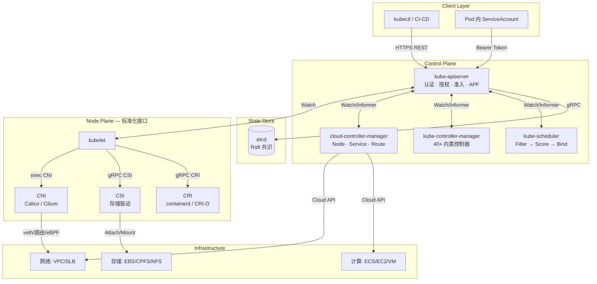
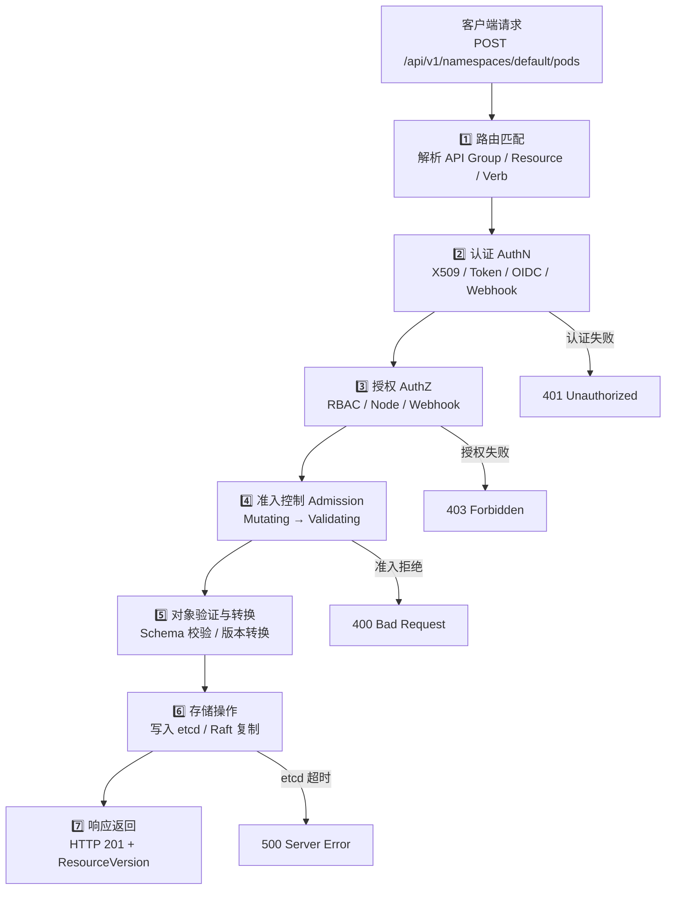
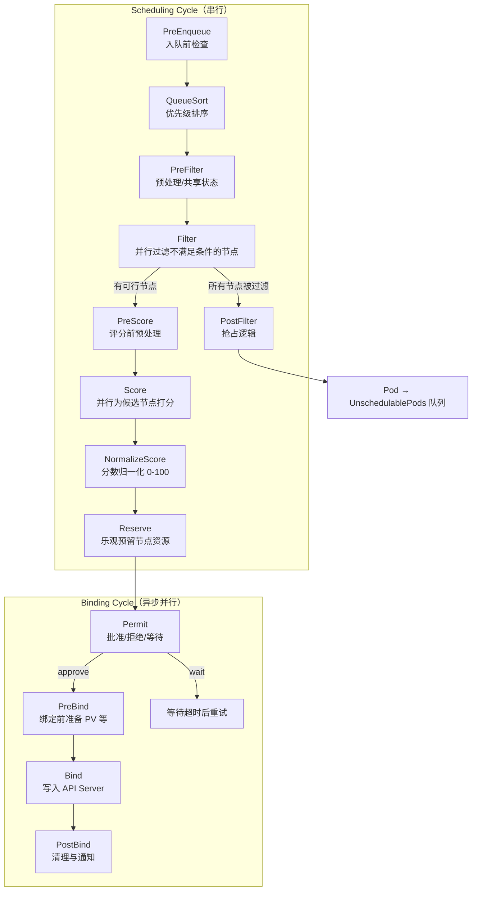
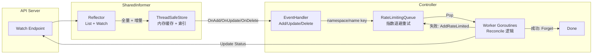
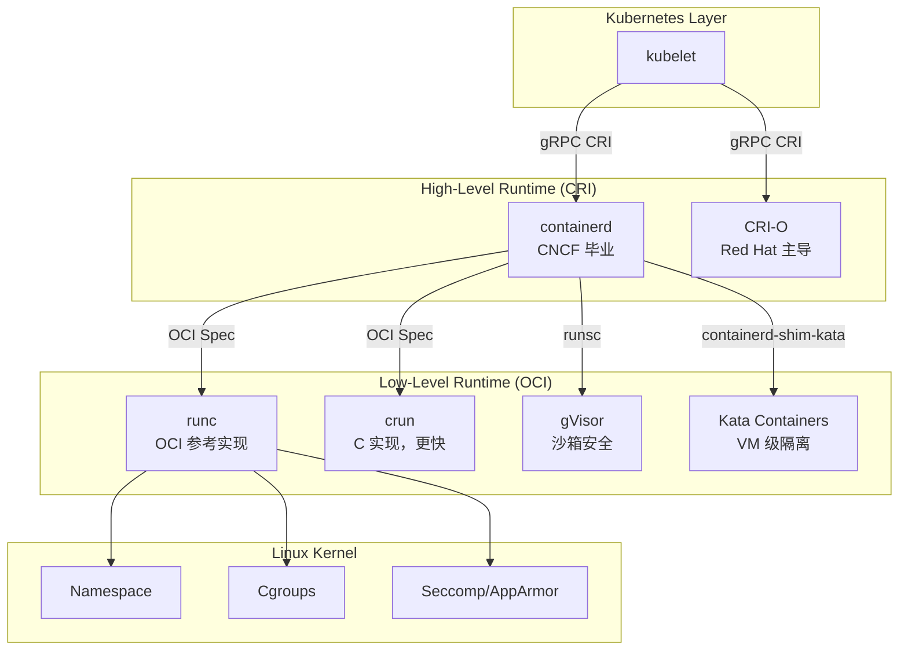
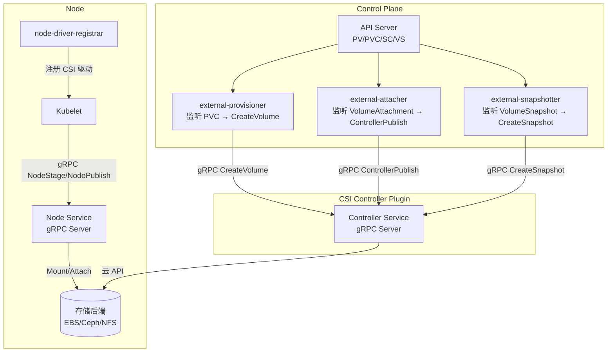
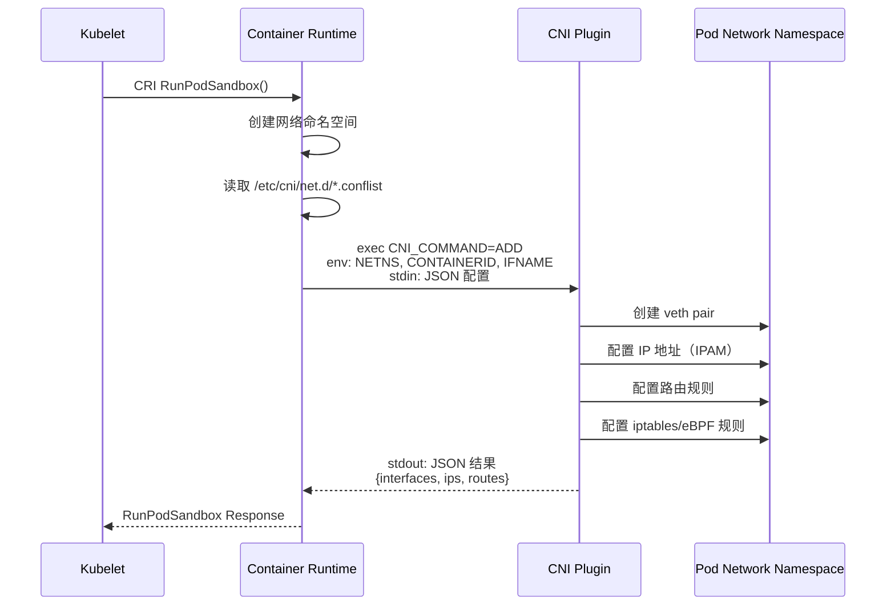

Kubernetes 控制平面是整个集群的"大脑"——它不仅承载着所有状态决策、资源编排与策略执行的逻辑，还通过标准化的接口（CRI/CSI/CNI）将容器运行时、存储后端与网络插件优雅地解耦。本文将从**架构第一性原理**出发，逐层拆解控制平面四大核心组件（kube-apiserver、kube-scheduler、kube-controller-manager、cloud-controller-manager）以及三大扩展接口（CRI、CSI、CNI）的内部工作机制、请求处理流水线、性能调优参数与生产级故障排查策略。无论你是在优化大规模集群的调度延迟，还是在开发自定义 CSI 驱动或 Admission Webhook，这篇文章都为你提供可直接落地的技术参照。

Sources: [02-plane-components-interaction.md](domain-3-control-plane/02-plane-components-interaction.md#L1-L16), [12-apiserver-deep-dive.md](domain-3-control-plane/12-apiserver-deep-dive.md#L1-L20), [20-kube-scheduler-deep-dive.md](domain-3-control-plane/20-kube-scheduler-deep-dive.md#L1-L16)

## 架构总览：控制平面的分层协作模型

在深入每个组件之前，先建立控制平面的整体认知框架。Kubernetes 控制平面采用**分层解耦、事件驱动**的架构风格：所有组件通过 API Server 的 REST/gRPC 接口进行间接通信，没有人直接调用另一个组件——etcd 是唯一的共享状态存储，Watch 机制是组件间协同的核心信令通道。



**关键设计原则**：控制平面组件遵循**水平触发（Level-Triggered）**而非边缘触发——即基于当前状态与期望状态的差异持续协调，而非依赖单次事件。这意味着即使 Watch 事件丢失，Informer 的 Resync 机制也能确保控制器最终观察到正确的状态。

Sources: [02-plane-components-interaction.md](domain-3-control-plane/02-plane-components-interaction.md#L20-L73), [01-plane-architecture-overview.md](domain-3-control-plane/01-plane-architecture-overview.md#L1-L5)

### 组件间通信协议栈

| 通信路径 | 协议 | 用途 | 关键特性 |
|----------|------|------|----------|
| Client → API Server | HTTPS REST | 所有 CRUD 操作 | TLS 1.2/1.3，Bearer Token/mTLS |
| API Server → etcd | gRPC | 状态读写 + Watch | Raft 共识，线性一致性读 |
| Controller/Scheduler → API Server | HTTP 长连接 | Watch + Informer | Keep-Alive，Chunked Transfer |
| Kubelet → containerd/CRI-O | gRPC (Unix Socket) | 容器生命周期 | CRI 标准接口 |
| Kubelet → CSI Driver | gRPC (Unix Socket) | 存储卷操作 | CSI 规范 |
| Container Runtime → CNI | 可执行文件调用 | 网络配置 | 环境变量 + stdin JSON |

Sources: [02-plane-components-interaction.md](domain-3-control-plane/02-plane-components-interaction.md#L64-L73)

## kube-apiserver：集群的 API 网关与状态仲裁者

kube-apiserver 是 Kubernetes 控制平面中唯一直接与 etcd 通信的组件，所有其他组件（Scheduler、KCM、CCM、Kubelet）都通过它间接读写集群状态。这种"单入口"设计使得 API Server 成为**认证、授权、准入控制、限流、审计**等横切关注点的统一拦截点。

### 请求处理七层流水线

每一个到达 API Server 的请求都会经过严格的七层处理流水线。理解这个流水线对于排查权限问题、准入 Webhook 超时、APF 限流等生产故障至关重要：



**第一层（路由匹配）**将 URL 路径映射到具体的 API Group 和 Resource Handler。例如 `/apis/apps/v1/deployments` 映射到 `apps` API 组的 Deployment 资源。

**第二层（认证）**从请求中提取身份信息。API Server 支持多种认证方式的**链式组合**——第一个成功识别身份的模块即终止链。生产环境推荐组合：X509 客户端证书（组件间通信）+ OIDC（人类用户 SSO）+ ServiceAccount Token（Pod 内访问）。

**第三层（授权）**在认证通过后，根据 `--authorization-mode=Node,RBAC` 的配置依次检查授权策略。Node 授权器专门为 kubelet 设计，限制其只能操作绑定到自身的 Node 和 Pod 资源。

**第四层（准入控制）**是请求修改和验证的最后一道关卡，分为 Mutating（先执行，可修改对象）和 Validating（后执行，只能接受或拒绝）两个阶段。`MutatingAdmissionWebhook` 和 `ValidatingAdmissionWebhook` 允许你通过外部 HTTP 服务扩展准入逻辑。

Sources: [12-apiserver-deep-dive.md](domain-3-control-plane/12-apiserver-deep-dive.md#L21-L53), [02-plane-components-interaction.md](domain-3-control-plane/02-plane-components-interaction.md#L98-L248)

### 认证方式对比与选型

| 认证方式 | 适用场景 | 安全性 | 管理复杂度 | 典型配置 |
|----------|----------|--------|------------|----------|
| **X509 客户端证书** | 组件间通信、管理员 | 高 | 中（需证书轮换） | `--client-ca-file` |
| **Bootstrap Token** | 节点加入集群 | 中 | 低（临时性） | `kubeadm token create` |
| **ServiceAccount Token** | Pod 内访问 API | 中 | 低（自动管理） | Bound Token，48h 过期 |
| **OIDC** | 企业 SSO 集成 | 高 | 中（需 IdP） | `--oidc-issuer-url` |
| **Webhook Token** | 自定义认证系统 | 取决于实现 | 高（需维护服务） | `--authentication-token-webhook-config-file` |

生产环境的认证选型建议：**人类用户统一走 OIDC**（如 Okta、Azure AD、阿里云 RAM），**组件间通信使用 X509 证书**，**Pod 内应用使用 ServiceAccount Token**。避免使用 Static Bearer Token，因为它无法动态轮换。

Sources: [12-apiserver-deep-dive.md](domain-3-control-plane/12-apiserver-deep-dive.md#L72-L168)

### API Priority and Fairness（APF）：请求限流的精细控制

APF 是 Kubernetes v1.20+ 正式引入的流量控制机制，替代了早期粗糙的 `--max-requests-inflight` 全局限流。APF 的核心思想是：**将 API 请求按优先级分类，为每个优先级分配独立的并发配额，确保高优先级请求（如节点心跳、Leader 选举）永远不会被低优先级请求（如批量 List 操作）饿死**。

APF 由两个核心资源组成：**FlowSchema**（将请求分类到优先级）和 **PriorityLevelConfiguration**（定义每个优先级的队列行为和并发限制）。

| 内置 PriorityLevel | 类型 | 并发份额 | 典型流量 |
|--------------------|------|----------|----------|
| `system` | Exempt（免排队） | - | etcd 读写、 Lease 续约 |
| `leader-election` | Limited | 10 | Controller Leader 竞选 |
| `node-high` | Limited | 40 | kubelet 心跳、节点状态上报 |
| `workload-high` | Limited | 40 | Deployment 创建/更新 |
| `workload-low` | Limited | 100 | CronJob 批量创建 Pod |
| `global-default` | Limited | 20 | 普通用户的 kubectl 操作 |

当 APF 判定请求超限时，请求不会被直接丢弃，而是进入**排队等待**（Queue 模式）或被**立即拒绝**（Reject 模式）。你可以通过 `kubectl get --raw /apis/flowcontrol.apiserver.k8s.io/v1beta3/prioritylevelconfigurations` 查看当前配置。

Sources: [12-apiserver-deep-dive.md](domain-3-control-plane/12-apiserver-deep-dive.md#L361-L427), [18-api-priority-fairness.md](domain-3-control-plane/18-api-priority-fairness.md#L1-L5)

### API Server 关键配置参数

| 参数 | 默认值 | 生产推荐值 | 说明 |
|------|--------|------------|------|
| `--max-requests-inflight` | 400 | 800-1600 | 非变更请求最大并发 |
| `--max-mutating-requests-inflight` | 200 | 400-800 | 变更请求最大并发 |
| `--watch-cache-sizes` | 自动 | 按资源调整 | Watch 缓存大小 |
| `--request-timeout` | 60s | 60s | 非 Watch 请求超时 |
| `--audit-log-maxage` | - | 30 | 审计日志保留天数 |
| `--anonymous-auth` | true | **false** | 禁止匿名访问 |
| `--enable-admission-plugins` | - | NodeRestriction,PodSecurity | 推荐启用的准入控制器 |

**生产环境必做**：禁用匿名访问（`--anonymous-auth=false`）、启用审计日志、配置 `NodeRestriction` 准入控制器限制 kubelet 权限范围。

Sources: [12-apiserver-deep-dive.md](domain-3-control-plane/12-apiserver-deep-dive.md#L431-L473)

## kube-scheduler：Pod 的智能调度决策引擎

kube-scheduler 的核心职责是为每个处于 `Pending` 状态的 Pod 选择最优节点。这个看似简单的问题在规模化场景下变得极为复杂——调度器需要同时考虑资源匹配、亲和性约束、拓扑分布、存储可用性、污点容忍等数十个维度，并在毫秒级延迟内完成决策。

### 调度框架：两阶段循环与可插拔扩展点

Kubernetes 调度框架（Scheduling Framework）将调度过程拆分为**调度周期**（Scheduling Cycle，串行）和**绑定周期**（Binding Cycle，可并行）两个阶段，每个阶段暴露出细粒度的扩展点供插件注册：



**三队列模型**是调度器管理待调度 Pod 的核心机制：**ActiveQ**（优先级堆，待调度的活跃 Pod）、**BackoffQ**（退避队列，调度失败后指数退避重试）、**UnschedulablePods**（不可调度 Pod 映射，当集群状态变化时重新入队 ActiveQ）。

Sources: [20-kube-scheduler-deep-dive.md](domain-3-control-plane/20-kube-scheduler-deep-dive.md#L31-L103), [20-kube-scheduler-deep-dive.md](domain-3-control-plane/20-kube-scheduler-deep-dive.md#L107-L225)

### Filter 与 Score 插件矩阵

| 插件 | 阶段 | 核心逻辑 | 生产注意事项 |
|------|------|----------|-------------|
| **NodeResourcesFit** | Filter + Score | 检查 CPU/Memory/GPU 是否满足 requests | 评分策略选 LeastAllocated/ MostAllocated |
| **NodeAffinity** | Filter + Score | 节点标签匹配 `required/preferred` | 注意 `preferred` 只是软约束 |
| **TaintToleration** | Filter + Score | Pod toleration 匹配 Node taint | `NoSchedule` vs `NoExecute` 行为不同 |
| **PodTopologySpread** | Filter + Score | 跨 zone/hostname 均匀分布 | `maxSkew` 控制不均衡容忍度 |
| **VolumeBinding** | Filter | PVC 能在节点上绑定（拓扑感知） | 延迟绑定场景关键插件 |
| **ImageLocality** | Score | 节点已有镜像 → 得分更高 | 减少镜像拉取时间 |
| **InterPodAffinity** | Filter + Score | Pod 间亲和/反亲和 | 复杂度 O(N×M)，大规模集群需关注 |

Sources: [20-kube-scheduler-deep-dive.md](domain-3-control-plane/20-kube-scheduler-deep-dive.md#L342-L421)

### 资源分配评分策略对比

调度器的 Score 阶段决定了 Pod 最终落在哪个节点。四种内置评分策略代表了不同的资源分配哲学：

| 策略 | 公式 | 资源利用率 | 容错性 | 典型场景 |
|------|------|------------|--------|----------|
| **LeastAllocated** | `(capacity - allocated) / capacity × 100` | 低（均衡分布） | 高 | 默认策略，通用场景 |
| **MostAllocated** | `allocated / capacity × 100` | 高（紧凑装箱） | 低 | 云环境节省成本 |
| **RequestedToCapacityRatio** | 自定义曲线函数 | 可控 | 可控 | GPU 等昂贵资源精细化调度 |
| **BalancedAllocation** | `1 - |cpu% - mem%|` | 中 | 中 | 混合 CPU/Memory 负载 |

实际生产中，**LeastAllocated 是最安全的默认选择**。如果你在公有云上追求极致成本优化，可以切换到 MostAllocated，但需要配合 Cluster Autoscaler 来缩容空闲节点。

Sources: [20-kube-scheduler-deep-dive.md](domain-3-control-plane/20-kube-scheduler-deep-dive.md#L532-L591)

### 优先级与抢占机制

当高优先级 Pod 无法调度时，调度器的 PostFilter 阶段会触发**抢占（Preemption）**——驱逐节点上的低优先级 Pod 以腾出资源。抢占决策考虑多个因素：被驱逐 Pod 的优先级之和最小化、被驱逐 Pod 数量最少化、优先选择已有 Terminating Pod 的节点。

```yaml
# PriorityClass 定义
apiVersion: scheduling.k8s.io/v1
kind: PriorityClass
metadata:
  name: critical-service
value: 1000000
preemptionPolicy: PreemptLowerPriority
description: "关键在线服务，可抢占批处理任务"
```

**PDB（PodDisruptionBudget）与抢占的交互**是生产环境必须理解的关键点：抢占会尊重 PDB 约束——如果驱逐某个 Pod 会违反 PDB，调度器会尝试其他候选。只有当所有候选方案都违反 PDB 时，抢占才会失败。

Sources: [20-kube-scheduler-deep-dive.md](domain-3-control-plane/20-kube-scheduler-deep-dive.md#L628-L752)

## kube-controller-manager（KCM）：声明式协调的执行引擎

KCM 是 40+ 内置控制器的集合体，每个控制器遵循统一的**控制循环（Control Loop）**模式：通过 Informer Watch 资源变化 → 事件入队 WorkQueue → Worker 执行 Reconcile 逻辑 → 更新状态直至收敛。这种模式的核心特征是**水平触发 + 最终一致性**——即使错过事件，Resync 也会保证控制器最终看到正确的状态。

### 控制器分类与职责矩阵

| 类别 | 控制器 | 监控资源 | 核心职责 |
|------|--------|----------|----------|
| **工作负载** | DeploymentController | Deployment → ReplicaSet | 滚动更新、回滚、版本管理 |
| | ReplicaSetController | ReplicaSet → Pod | 维护 Pod 副本数 |
| | StatefulSetController | StatefulSet → Pod+PVC | 有状态应用有序部署 |
| | DaemonSetController | DaemonSet → Pod | 每节点一个 Pod |
| | JobController / CronJobController | Job/CronJob → Pod | 批处理任务生命周期 |
| **服务网络** | EndpointsController | Service+Pod → Endpoints | 维护 Service 端点 |
| | EndpointSliceController | Service+Pod → EndpointSlice | 大规模集群端点分片 |
| **存储** | PVController | PV+PVC | 自动绑定 |
| | AttachDetachController | Pod+Node → VolumeAttachment | 卷挂载/卸载调度 |
| | VolumeExpansionController | PVC | 卷扩容 |
| **节点生命周期** | NodeController / NodeLifecycleController | Node | 心跳检测、Taint 管理、Pod 驱逐 |
| | PodGCController | Pod | 清理已完成/孤儿 Pod |
| **安全配置** | ServiceAccountController | Namespace → SA | 创建默认 SA |
| | ResourceQuotaController | ResourceQuota | 配额使用量统计 |
| | GarbageCollectorController | 所有资源 | 级联删除（Owner References） |

Sources: [13-kube-controller-manager-deep-dive.md](domain-3-control-plane/13-kube-controller-manager-deep-dive.md#L91-L151)

### Informer + WorkQueue：控制器的核心运行时

所有控制器共享同一套 **SharedInformerFactory + RateLimitingQueue** 运行时基础设施：

1. **Reflector** 通过 `ListAndWatch` 从 API Server 获取全量数据并持续监听增量事件
2. **Informer Store** 将资源缓存在本地内存中的 ThreadSafeStore（带索引），避免每次 Reconcile 都访问 API Server
3. **EventHandler** 将变更事件（Add/Update/Delete）转换为 key（如 `namespace/name`）放入 **RateLimitingQueue**
4. **Worker Goroutines** 从队列 Pop 出 key，执行具体的 Reconcile 逻辑
5. 处理失败时 key 被以**指数退避**策略重新入队，直到成功或达到最大重试次数



Sources: [02-plane-components-interaction.md](domain-3-control-plane/02-plane-components-interaction.md#L313-L398), [13-kube-controller-manager-deep-dive.md](domain-3-control-plane/13-kube-controller-manager-deep-dive.md#L60-L87)

### Leader Election：多实例高可用的协同机制

KCM 的多实例部署依赖 **Lease API** 实现 Leader 选举。同一时刻只有一个实例运行业务逻辑，其他实例处于待命状态：

| 参数 | 默认值 | 说明 |
|------|--------|------|
| `--leader-elect` | true | 启用 Leader 选举 |
| `--leader-elect-lease-duration` | 15s | Lease 持续时间 |
| `--leader-elect-renew-deadline` | 10s | 续约截止时间 |
| `--leader-elect-retry-period` | 2s | 重试周期 |

Leader 在 `renew-deadline` 内周期性续约 Lease。如果续约失败（如网络分区），Lease 在 `lease-duration` 后过期，其他实例开始竞选。这个时间窗口意味着在最坏情况下，控制平面可能有长达 15 秒的不可用窗口——对于 Node 心跳超时（40s）来说在可接受范围内。

Sources: [13-kube-controller-manager-deep-dive.md](domain-3-control-plane/13-kube-controller-manager-deep-dive.md#L363-L421)

### KCM 性能调优参数

| 集群规模 | CPU | 内存 | `--kube-api-qps` | `--kube-api-burst` | 关键并发参数 |
|----------|-----|------|--------------------|---------------------|-------------|
| <100 节点 | 0.5-1 核 | 512MB-1GB | 20（默认） | 30（默认） | 默认值 |
| 100-500 节点 | 1-2 核 | 1-2GB | 50-100 | 100-200 | `concurrent-deployment-syncs=10` |
| 500-1000 节点 | 2-4 核 | 2-4GB | 100-200 | 200-400 | `concurrent-gc-syncs=30` |
| >1000 节点 | 4-8 核 | 4-8GB | 200-500 | 400-1000 | 全面调高并发参数 |

Sources: [13-kube-controller-manager-deep-dive.md](domain-3-control-plane/13-kube-controller-manager-deep-dive.md#L289-L359)

## cloud-controller-manager（CCM）：Kubernetes 与云平台的桥梁

CCM 将原本耦合在 KCM 中的云特定逻辑抽取为独立组件，实现了 Kubernetes 核心与云提供商的**解耦**。从 v1.26 起，in-tree cloud provider 代码已完全移除，所有云集成必须通过 CCM + CSI 的 out-of-tree 模式实现。

### CCM 管理的三大核心控制器

| 控制器 | 接管功能 | 与 KCM 的分工 | 典型云 API 调用 |
|--------|----------|---------------|----------------|
| **Node Controller** | 节点初始化、地址同步、标签注入 | KCM 保留心跳检测和 Taint 管理 | `GetInstance`, `GetZone` |
| **Service Controller** | LoadBalancer 类型 Service 管理 | KCM 只处理 ClusterIP/NodePort | `CreateLoadBalancer`, `UpdateBackend` |
| **Route Controller** | VPC 路由表管理 | 完全由 CCM 接管 | `CreateRoute`, `ListRoutes` |

CCM 的 Node Controller 在新节点注册时会自动添加 `node.cloudprovider.kubernetes.io/uninitialized=true:NoSchedule` 污点，阻止 Pod 调度到尚未完成云初始化的节点上。初始化完成后移除该污点，并注入 `topology.kubernetes.io/zone`、`topology.kubernetes.io/region` 等拓扑标签。

Sources: [14-cloud-controller-manager-deep-dive.md](domain-3-control-plane/14-cloud-controller-manager-deep-dive.md#L26-L150)

## CRI：容器运行时接口——从 kubelet 到 OCI 的标准化桥梁

CRI（Container Runtime Interface）定义了 kubelet 与容器运行时之间的 gRPC 接口规范。它的引入终结了 Kubernetes 对 Docker 的硬依赖，使得 containerd、CRI-O 等轻量级运行时成为生产环境的标准选择。

### 运行时层次架构



### CRI 核心接口

CRI 定义了两大 gRPC 服务：**RuntimeService**（Sandbox + 容器生命周期管理）和 **ImageService**（镜像拉取与管理）：

| 接口类别 | 方法 | 功能 | 调用时机 |
|----------|------|------|----------|
| Sandbox 管理 | `RunPodSandbox` | 创建 pause 容器 + 网络命名空间 | Pod 创建 |
| | `StopPodSandbox` | 停止 Pod 内所有容器 | Pod 终止 |
| 容器管理 | `CreateContainer` | 创建容器（准备 rootfs + OCI spec） | Sandbox 就绪后 |
| | `StartContainer` | 启动容器进程 | Create 完成后 |
| 镜像管理 | `PullImage` | 拉取镜像到本地 | 镜像不存在时 |
| | `ImageStatus` | 查询镜像状态 | 镜像检查 |

**Pod 创建的完整调用链**：kubelet Watch 到 Pod → `RunPodSandbox()`（创建 pause 容器 + 调用 CNI 配置网络） → `PullImage()`（如需拉取） → `CreateContainer()`（生成 OCI spec） → `StartContainer()`（调用 runc 创建进程）。

Sources: [21-container-runtime-deep-dive.md](domain-3-control-plane/21-container-runtime-deep-dive.md#L19-L300)

### containerd vs CRI-O：运行时选型

| 维度 | containerd | CRI-O |
|------|------------|-------|
| **定位** | 通用容器运行时 | Kubernetes 专用运行时 |
| **CNCF 状态** | 毕业项目 | 毕业项目 |
| **资源占用** | 中等 | 更低 |
| **生态兼容** | Docker 兼容 | Kubernetes 专注 |
| **镜像格式** | OCI + Docker | OCI |
| **生产推荐** | 通用首选 | Red Hat 生态首选 |

**dockershim 废弃**是 Kubernetes 运行时演进的重要里程碑：v1.20（2020.12）发布废弃警告 → v1.24（2022.05）完全移除 → v1.27+ 仅支持 CRI 兼容运行时。**Docker 构建的镜像仍然完全兼容**，因为 OCI 镜像格式是通用的——变化的是运行时（不再经过 dockerd），而不是镜像格式。

Sources: [21-container-runtime-deep-dive.md](domain-3-control-plane/21-container-runtime-deep-dive.md#L179-L191)

## CSI：容器存储接口——解耦存储后端的 gRPC 规范

CSI（Container Storage Interface）将存储供应商的代码从 Kubernetes 核心中彻底解耦，使存储驱动可以独立于 K8s 版本发布和升级。从 v1.13（GA）开始，CSI 已成为 Kubernetes 存储扩展的**唯一推荐方式**。

### CSI 双端架构

CSI 驱动分为**Controller Plugin**（运行在控制平面，管理卷的创建/删除/Attach/Detach）和**Node Plugin**（以 DaemonSet 运行在每个节点，管理卷的 Stage/Publish/扩容）两部分。Kubernetes 通过 Sidecar 容器（external-provisioner、external-attacher、external-snapshotter 等）桥接 API Server 与 CSI 驱动之间的 gRPC 调用：



### CSI 三大服务与核心 gRPC 方法

| 服务 | 方法 | 执行位置 | 触发条件 |
|------|------|----------|----------|
| **Identity** | `GetPluginInfo`, `Probe` | 两端 | 插件启动、健康检查 |
| **Controller** | `CreateVolume` / `DeleteVolume` | 控制平面 | PVC 创建/删除 |
| | `ControllerPublishVolume` / `Unpublish` | 控制平面 | VolumeAttach 创建 |
| | `CreateSnapshot` / `DeleteSnapshot` | 控制平面 | VolumeSnapshot 创建 |
| | `ControllerExpandVolume` | 控制平面 | PVC 扩容请求 |
| **Node** | `NodeStageVolume` / `Unstage` | 节点 | 卷挂载到全局路径 |
| | `NodePublishVolume` / `Unpublish` | 节点 | 卷绑定到 Pod 目录 |
| | `NodeExpandVolume` | 节点 | 文件系统扩容 |
| | `NodeGetVolumeStats` | 节点 | 卷使用率监控 |

**卷挂载的两阶段设计**（Stage + Publish）是为了支持**多 Pod 共享同一个卷**的场景：Stage 将卷挂载到节点的全局路径（只执行一次），Publish 将全局路径 bind-mount 到 Pod 的目录（每个 Pod 各一次）。

Sources: [22-container-storage-deep-dive.md](domain-3-control-plane/22-container-storage-deep-dive.md#L18-L237)

### CSI 访问模式与卷模式

| 访问模式 | 缩写 | 典型存储 | 说明 |
|----------|------|----------|------|
| ReadWriteOnce | RWO | AWS EBS、阿里云 ESSD | 单节点读写，最常用 |
| ReadOnlyMany | ROX | NFS、CephFS | 多节点只读 |
| ReadWriteMany | RWX | NFS、CephFS | 多节点读写 |
| ReadWriteOncePod | RWOP | 块存储（v1.22+） | 单 Pod 独占读写 |

卷模式（`volumeMode`）决定存储以**文件系统**（Filesystem，默认）还是**原始块设备**（Block）方式暴露给 Pod。数据库等高性能场景常使用 Block 模式，跳过文件系统层直接操作块设备。

Sources: [22-container-storage-deep-dive.md](domain-3-control-plane/22-container-storage-deep-dive.md#L239-L300)

## CNI：容器网络接口——Pod 网络的标准化配置

CNI（Container Network Interface）定义了容器运行时配置 Pod 网络的规范：运行时以**可执行文件调用**的方式（而非 gRPC）触发 CNI 插件，通过环境变量传递上下文、通过 stdin 传递 JSON 配置。这种简洁的设计使得 CNI 插件可以是一个简单的 Shell 脚本，也可以是像 Cilium 这样复杂的 eBPF 网络方案。

### CNI 调用流程



### 主流 CNI 插件对比

| 特性 | Calico | Cilium | Flannel |
|------|--------|--------|---------|
| **数据平面** | eBPF / iptables / IPIP | eBPF 原生 | VXLAN overlay |
| **NetworkPolicy** | ✅ 完整支持 | ✅ 完整支持 | ❌ 不支持 |
| **性能** | 高 | **最高** | 中 |
| **Service Mesh** | ❌ | ✅ 内核级 mTLS | ❌ |
| **可观测性** | 中（Hubble） | **最强**（Hubble） | 弱 |
| **加密** | WireGuard | WireGuard / IPsec | ❌ |
| **kube-proxy 替代** | eBPF 模式可选 | ✅ 完全替代 | ❌ |
| **生产推荐** | 传统网络团队首选 | **云原生新项目首选** | 仅测试环境 |

**Cilium 已成为 CNCF 毕业项目**，其 eBPF 数据平面在性能、可观测性和安全性方面全面超越 iptables 方案。新项目建议直接选择 Cilium。

Sources: [23-container-network-deep-dive.md](domain-3-control-plane/23-container-network-deep-dive.md#L1-L110), [23-container-network-deep-dive.md](domain-3-control-plane/23-container-network-deep-dive.md#L284-L333)

## 生产级监控与故障排查

### 关键指标告警矩阵

| 组件 | 关键指标 | 告警阈值 | 说明 |
|------|----------|----------|------|
| **API Server** | `apiserver_request_duration_seconds` | p99 > 1s | 请求延迟 |
| | `apiserver_current_inflight_requests` | > max × 0.8 | 并发饱和度 |
| | `apiserver_admission_webhook_admission_duration_seconds` | p99 > 500ms | Webhook 拖慢请求 |
| | `etcd_request_duration_seconds` | p99 > 200ms | etcd 性能瓶颈 |
| **KCM** | `workqueue_depth` | > 100 | 队列积压 |
| | `workqueue_retries_total` | 1h 增量 > 1000 | 控制器处理异常 |
| | `leader_election_master_status` | == 0 持续 5m | 无 Leader |
| **Scheduler** | `scheduler_scheduling_algorithm_duration_seconds` | p99 > 1s | 调度延迟 |
| | `scheduler_pending_pods` | 异常增长 | 调度瓶颈 |

### 诊断命令速查

```bash
# === API Server ===
# 检查 APF 限流状态
kubectl get --raw /debug/api_priority_and_fairness/dump_priority_levels

# === KCM ===
# 检查 Leader 选举
kubectl get lease -n kube-system kube-controller-manager -o yaml
# 检查工作队列深度
curl -k https://localhost:10257/metrics 2>/dev/null | grep workqueue_depth

# === Scheduler ===
# 检查调度延迟
curl -k https://localhost:10259/metrics 2>/dev/null | grep scheduler_scheduling_algorithm_duration

# === CRI (containerd) ===
crictl pods                    # 列出 Pod Sandbox
crictl ps -a                   # 列出容器
crictl logs <container-id>     # 查看容器日志
crictl inspect <container-id>  # 检查容器状态

# === CSI ===
kubectl get csinode <node-name> -o yaml      # CSI 节点注册状态
kubectl get volumeattachment -o wide          # 卷 Attach 状态

# === CNI ===
# 检查 CNI 配置
cat /etc/cni/net.d/*.conflist
# 检查 Pod 网络
kubectl exec <pod> -- ip addr show eth0
kubectl exec <pod> -- ip route
```

Sources: [12-apiserver-deep-dive.md](domain-3-control-plane/12-apiserver-deep-dive.md#L574-L647), [13-kube-controller-manager-deep-dive.md](domain-3-control-plane/13-kube-controller-manager-deep-dive.md#L425-L497), [13-kube-controller-manager-deep-dive.md](domain-3-control-plane/13-kube-controller-manager-deep-dive.md#L501-L564)

## 延伸阅读

本文聚焦于控制平面组件的内部架构与接口规范。以下相关主题提供了更深入的实践指导：

- **[设计原理：声明式 API、控制器模式与 etcd 共识](6-she-ji-yuan-li-sheng-ming-shi-api-kong-zhi-qi-mo-shi-yu-etcd-gong-shi)** — Informer/WorkQueue 的源码级分析、etcd Raft 共识算法的工程实践
- **[工作负载管理：Pod 生命周期、调度策略与弹性伸缩](8-gong-zuo-fu-zai-guan-li-pod-sheng-ming-zhou-qi-diao-du-ce-lue-yu-dan-xing-shen-suo)** — HPA/VPA 自动伸缩、高级 Pod 调度模式
- **[网络体系：CNI、Service、Ingress、Gateway API 与多集群网络](9-wang-luo-ti-xi-cni-service-ingress-gateway-api-yu-duo-ji-qun-wang-luo)** — Calico/Cilium 生产部署、Service 实现原理
- **[存储体系：PV/PVC、StorageClass、CSI 驱动与灾备恢复](10-cun-chu-ti-xi-pv-pvc-storageclass-csi-qu-dong-yu-zai-bei-hui-fu)** — CSI 驱动开发、存储卷操作全流程
- **[结构化故障排查：配置优先方法论与全组件排障指南](15-jie-gou-hua-gu-zhang-pai-cha-pei-zhi-you-xian-fang-fa-lun-yu-quan-zu-jian-pai-zhang-zhi-nan)** — 控制平面组件故障的系统性诊断方法