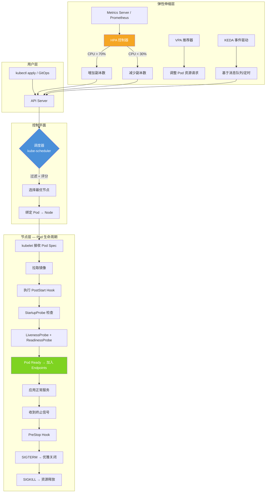
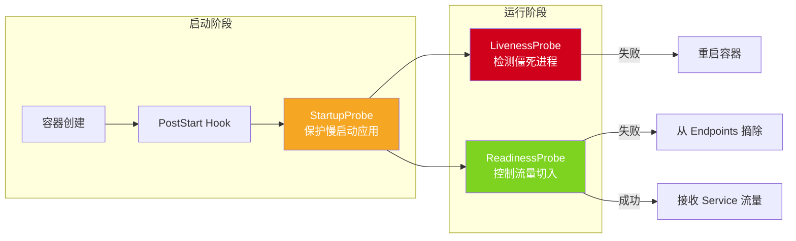
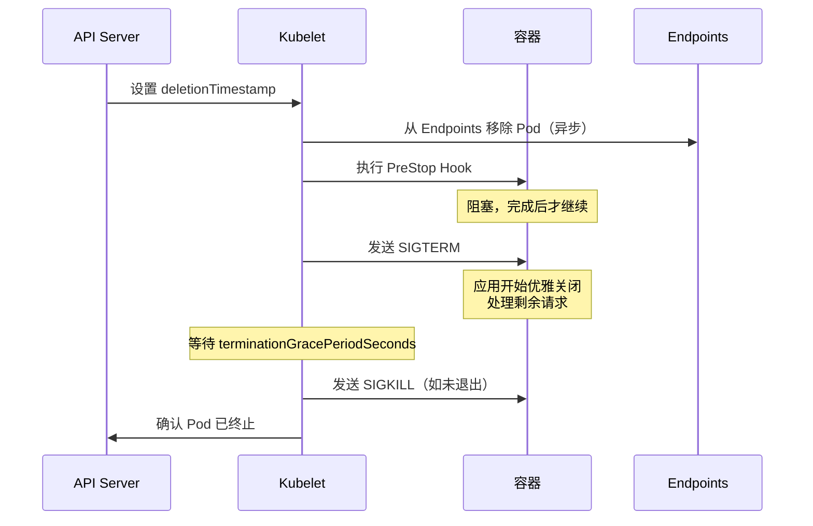
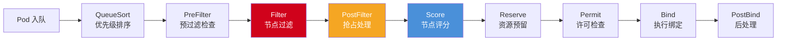
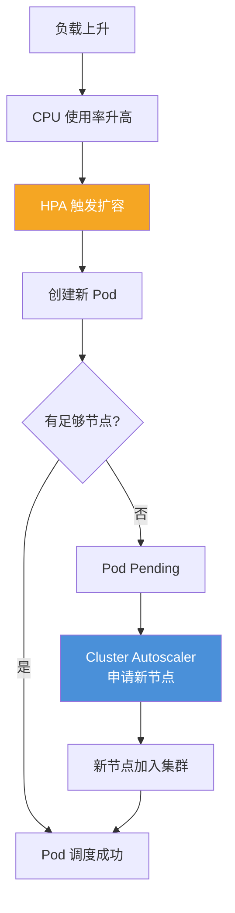

工作负载管理是 Kubernetes 运维实践中最核心的技术领域之一，它回答了三个关键的生产问题：**容器如何从创建到销毁？**（Pod 生命周期）、**容器应该运行在哪个节点上？**（调度策略）、**如何根据负载自动增减副本数？**（弹性伸缩）。本文档将这三个维度整合为一个连贯的技术体系——生命周期定义了 Pod 的存在形式，调度决定了 Pod 的物理位置，而弹性伸缩则在工作负载层面实现了资源供给与业务需求的动态平衡。对于中级开发者而言，理解这三者之间的耦合关系，是从"能用 Kubernetes"迈向"用好 Kubernetes"的关键跨越。

Sources: [01-workload-overview-architecture.md](domain-02-workloads-applications/01-workload-overview-architecture.md#L1-L28), [README.md](domain-02-workloads-applications/README.md#L1-L16)

## 整体架构：三大子系统的协作关系

在深入各子系统之前，先建立全局视角。下面的架构图展示了从用户提交 YAML 到 Pod 运行、再到根据负载自动伸缩的完整数据流：



这个架构揭示了一个重要的设计原则：**生命周期是纵向的**（单 Pod 从生到灭），**调度是横向的**（Pod 在集群节点间的分布），**弹性伸缩是闭环的**（基于指标反馈自动调节副本数）。三者通过 API Server 这一中心枢纽松耦合协作。

Sources: [01-workload-overview-architecture.md](domain-02-workloads-applications/01-workload-overview-architecture.md#L42-L62), [19-scheduler-configuration.md](domain-02-workloads-applications/19-scheduler-configuration.md#L5-L11)

---

## 第一部分：Pod 生命周期 —— 从 Pending 到 Terminated

### Pod Phase 与容器状态

Pod 的生命周期由五个 **Phase** 组成，它们描述了 Pod 在宏观层面的存在状态。在微观层面，每个容器还有三种状态（`Waiting`、`Running`、`Terminated`），它们共同构成了 Pod 健康诊断的基础坐标系。

| Phase | 触发条件 | 正常/异常 | 后续转换 |
|-------|---------|----------|---------|
| **Pending** | Pod 已创建，等待调度或镜像拉取 | 正常（短暂停留） | → Running / Failed |
| **Running** | 至少一个容器运行中 | 正常（稳态） | → Succeeded / Failed |
| **Succeeded** | 所有容器成功终止（Job 完成） | 正常（终态） | 终态 |
| **Failed** | 所有容器终止，至少一个非零退出 | 异常（终态） | 终态 |
| **Unknown** | 无法获取 Pod 状态（节点通信中断） | 异常 | 取决于恢复 |

容器的 `Waiting` 状态尤其值得关注——它包含 `ContainerCreating`（正常）、`ImagePullBackOff`（镜像问题）、`CrashLoopBackOff`（应用反复崩溃）等子状态。其中 **CrashLoopBackOff** 是生产环境最常见的问题之一，kubelet 对此采用指数退避策略（10s → 20s → 40s → … → 300s 上限），防止无效重启消耗节点资源。

Sources: [11-pod-lifecycle-events.md](domain-02-workloads-applications/11-pod-lifecycle-events.md#L5-L29), [pod-lifecycle.md](topic-dictionary/workloads/pod-lifecycle.md#L6-L18)

### Pod Conditions：就绪状态的精细化判定

Phase 仅提供粗粒度状态，而 **Pod Conditions** 提供了细粒度的健康判定维度。一个 Running 状态的 Pod 不一定就能接收流量——只有当 `ContainersReady` 和 `Ready` 都为 `True` 时，Pod 才会被加入 Service Endpoints。

| Condition | True 含义 | False 含义 |
|-----------|----------|----------|
| **PodScheduled** | 已调度到节点 | 调度中或失败 |
| **Initialized** | Init 容器全部完成 | Init 容器未完成 |
| **ContainersReady** | 所有容器通过就绪探针 | 有容器未就绪 |
| **Ready** | Pod 可接收流量 | Pod 未就绪 |
| **DisruptionTarget** | — | Pod 即将被驱逐（v1.25+） |

此外，**Readiness Gates**（v1.14+）允许应用向 Pod Status 注入自定义就绪条件（如"配置已加载完毕"），Pod 只有在所有自定义条件均为 `True` 时才被视为 Ready。这对于需要等待外部依赖就绪的应用（如数据库连接池预热完成）非常有价值。

Sources: [11-pod-lifecycle-events.md](domain-02-workloads-applications/11-pod-lifecycle-events.md#L30-L38), [pod-lifecycle.md](topic-dictionary/workloads/pod-lifecycle.md#L20-L23)

### 三种探针的协作模型

探针是 Kubernetes 实现 Pod **自愈能力** 的核心机制。三种探针各司其职，形成了一个分层防御体系：



| 探针类型 | 核心职责 | 失败后果 | 生产注意 |
|---------|---------|---------|---------|
| **StartupProbe** | 保护慢启动应用，在启动完成前屏蔽 Liveness | 超过 `failureThreshold × periodSeconds` 后重启容器 | **必须配置**，防止慢启动应用被 Liveness 误杀 |
| **LivenessProbe** | 检测进程僵死，触发容器重启 | 容器被 kill 并重建 | **不要**检测外部依赖，仅检测进程自身健康 |
| **ReadinessProbe** | 控制流量是否切入 | Pod 从 Service Endpoints 移除 | 配合 preStop Hook，确保先摘流量再终止 |

一个常见的生产级配置模式是：`startupProbe` 给予 150s 启动窗口（`failureThreshold: 30, periodSeconds: 5`），`livenessProbe` 以 10s 间隔检测核心健康端点，`readinessProbe` 以 5s 间隔检测业务就绪状态。这种"宽松启动 + 严格运行"的策略，既保护了启动期，又保证了运行时的快速故障检测。

Sources: [11-pod-lifecycle-events.md](domain-02-workloads-applications/11-pod-lifecycle-events.md#L90-L128), [12-advanced-pod-patterns.md](domain-02-workloads-applications/12-advanced-pod-patterns.md#L5-L11), [pod-lifecycle.md](topic-dictionary/workloads/pod-lifecycle.md#L86-L135)

### 优雅终止：从 SIGTERM 到 SIGKILL 的时间窗口

Pod 的终止流程是生产环境零停机更新的基础。当 Pod 被删除或被驱逐时，kubelet 执行的是一个精心编排的多步流程：



这里的关键时序设计值得深入理解：**PreStop Hook 与 SIGTERM 共享 `terminationGracePeriodSeconds` 的总时间预算**。例如，设置 `terminationGracePeriodSeconds: 60`，PreStop 执行了 15s，那么应用收到 SIGTERM 后还有 45s 完成优雅关闭。如果总时间耗尽，kubelet 会发送 SIGKILL 强制终止。

生产环境的最佳实践是 `terminationGracePeriodSeconds: 60`，PreStop 中配置 15s 的连接排空等待（`sleep 15`），然后应用在收到 SIGTERM 后有 45s 完成正在处理的请求。这与 ReadinessProbe 形成了完美的配合：Pod 先从 Endpoints 摘除（停止接收新请求），PreStop 等待现有请求处理完毕，然后应用才真正关闭。

v1.29+ 引入了原生的 `sleep` 钩子类型，简化了 PreStop 的配置：

```yaml
lifecycle:
  preStop:
    sleep:
      seconds: 10  # v1.29+ GA，替代 exec + sleep 的方式
```

Sources: [11-pod-lifecycle-events.md](domain-02-workloads-applications/11-pod-lifecycle-events.md#L130-L151), [13-container-lifecycle-hooks.md](domain-02-workloads-applications/13-container-lifecycle-hooks.md#L296-L345), [pod-lifecycle.md](topic-dictionary/workloads/pod-lifecycle.md#L23-L31)

### 生命周期 Hook 的执行方式

Kubernetes 提供了两种生命周期钩子（PostStart 和 PreStop）和四种执行方式：

| 钩子 | 触发时机 | 阻塞行为 | 失败影响 |
|------|---------|---------|---------|
| **PostStart** | 容器创建后立即执行 | 阻塞——完成前容器不标记为 Running | 容器重启 |
| **PreStop** | 容器终止前执行 | 阻塞——与宽限期并行计时 | 不影响终止流程 |

| 执行方式 | 适用场景 | 版本要求 |
|---------|---------|---------|
| `exec` | 在容器内执行命令（脚本、内部 API） | 全版本 |
| `httpGet` | 通知外部服务、触发 Webhook | 全版本 |
| `tcpSocket` | 端口可用性检查 | v1.25+ |
| `sleep` | 简单延迟等待（连接排空） | v1.29+ GA |

PostStart 常用于服务注册（如注册到 Consul/Nacos），PreStop 用于服务注销和连接排空。需要特别注意：PostStart 的执行时机是容器创建后、ENTRYPOINT 启动后，但它**不保证在 ENTRYPOINT 之前执行**——如果需要严格的初始化顺序，应使用 Init 容器。

Sources: [13-container-lifecycle-hooks.md](domain-02-workloads-applications/13-container-lifecycle-hooks.md#L76-L91), [12-advanced-pod-patterns.md](domain-02-workloads-applications/12-advanced-pod-patterns.md#L39-L44)

---

## 第二部分：调度策略 —— 决定 Pod 的物理位置

### 调度框架：从过滤到绑定的流水线

kube-scheduler 采用了一个可扩展的 **调度框架（Scheduling Framework）**，将调度过程拆分为多个扩展点。理解这个流水线，是掌握调度策略优化的前提：



| 阶段 | 核心功能 | 默认插件 |
|------|---------|---------|
| **Filter** | 排除不满足条件的节点 | NodeResourcesFit, NodeAffinity, PodTopologySpread, TaintToleration |
| **PostFilter** | 无节点可用时触发抢占 | DefaultPreemption |
| **Score** | 对候选节点排名 | NodeResourcesBalancedAllocation, ImageLocality, InterPodAffinity |

调度器的两阶段决策模型是：先通过 **Filter** 找到所有可行节点，再通过 **Score** 对可行节点打分选最优。如果 Filter 结果为空，则进入 PostFilter 触发抢占（Preemption）——驱逐低优先级 Pod 为高优先级 Pod 腾出空间。

Sources: [19-scheduler-configuration.md](domain-02-workloads-applications/19-scheduler-configuration.md#L5-L11), [kubernetes-scheduler.md](topic-dictionary/scheduling/kubernetes-scheduler.md#L8-L14)

### 调度策略全景：从节点选择到拓扑分布

Kubernetes 提供了从粗粒度到细粒度的多层调度控制手段：

| 策略层级 | 机制 | 粒度 | 使用场景 |
|---------|------|------|---------|
| **硬性约束** | `nodeSelector` | 精确匹配标签 | 简单的节点池划分 |
| **硬性约束** | `nodeAffinity` (required) | 表达式匹配 | 强制调度到特定硬件/区域 |
| **软性偏好** | `nodeAffinity` (preferred) | 权重化偏好 | 尽量调度到本地镜像节点 |
| **硬性约束** | `taints & tolerations` | 污点-容忍对 | 专用节点池（GPU/系统组件） |
| **软性偏好** | `podAffinity/AntiAffinity` (preferred) | 拓扑域级 | 同 Pod 尽量分散到不同节点 |
| **硬性约束** | `podAntiAffinity` (required) | 拓扑域级 | 强制同一 Deployment 副本不在同节点 |
| **精细化** | `topologySpreadConstraints` | 可控倾斜度 | 跨可用区均匀分布 |

**nodeAffinity 与 podAntiAffinity 的组合**是生产环境最常见的调度模式。下面的配置实现了"强制调度到计算优化型节点 + 同一 Deployment 的副本强制分散到不同物理机"的双重保障：

```yaml
spec:
  affinity:
    nodeAffinity:
      requiredDuringSchedulingIgnoredDuringExecution:
        nodeSelectorTerms:
        - matchExpressions:
          - key: node.kubernetes.io/instance-type
            operator: In
            values: ["ecs.g7.xlarge"]
    podAntiAffinity:
      requiredDuringSchedulingIgnoredDuringExecution:
      - labelSelector:
          matchLabels:
            app: high-availability-svc
        topologyKey: "kubernetes.io/hostname"
```

Sources: [12-advanced-pod-patterns.md](domain-02-workloads-applications/12-advanced-pod-patterns.md#L13-L31), [19-scheduler-configuration.md](domain-02-workloads-applications/19-scheduler-configuration.md#L165-L171)

### PodTopologySpread：跨域均匀分布的生产实践

`topologySpreadConstraints` 是 v1.19+ 引入的调度策略，它通过 `maxSkew`（最大倾斜度）参数精确控制 Pod 在不同拓扑域之间的分布均匀程度。这是实现**跨可用区高可用**的标准手段：

| 参数 | 类型 | 默认值 | 说明 |
|------|------|-------|------|
| `maxSkew` | int | 1 | 最大倾斜度——不同域之间 Pod 数量的最大差值 |
| `topologyKey` | string | — | 拓扑域键（如 `topology.kubernetes.io/zone`） |
| `whenUnsatisfiable` | string | DoNotSchedule | `DoNotSchedule`（硬约束）或 `ScheduleAnyway`（软偏好） |
| `minDomains` | int | — | 最小域数（v1.25+） |
| `matchLabelKeys` | []string | — | 按版本标签滚动分布（v1.27+） |

一个典型的生产配置会同时使用两个拓扑约束——跨可用区均匀分布（硬约束，`maxSkew: 1`）和跨节点均匀分布（软偏好，`maxSkew: 2`）：

```yaml
topologySpreadConstraints:
- maxSkew: 1
  topologyKey: topology.kubernetes.io/zone
  whenUnsatisfiable: DoNotSchedule  # 硬约束：强制跨 AZ
  labelSelector:
    matchLabels:
      app: web
  minDomains: 2
- maxSkew: 2
  topologyKey: kubernetes.io/hostname
  whenUnsatisfiable: ScheduleAnyway  # 软偏好：尽量跨节点
  labelSelector:
    matchLabels:
      app: web
```

Sources: [19-scheduler-configuration.md](domain-02-workloads-applications/19-scheduler-configuration.md#L173-L227)

### 优先级与抢占：当资源不足时谁优先

当集群资源无法满足所有 Pod 的需求时，**PriorityClass** 决定了哪些 Pod 被优先保护，哪些 Pod 可以被牺牲：

| 优先级类别 | 优先级值 | 用途 | 抢占策略 |
|-----------|---------|------|---------|
| `system-node-critical` | 2000001000 | 关键系统组件（DaemonSet） | PreemptLowerPriority |
| `system-cluster-critical` | 2000000000 | 集群关键组件（kube-dns） | PreemptLowerPriority |
| 自定义高优先级 | 1000000 | 生产核心业务 | PreemptLowerPriority |
| 自定义低优先级 | -1000 | 批处理任务（可被抢占） | Never（不抢占他人） |

生产建议为核心业务分配高优先级（`value: 1000000`），为批处理任务分配低优先级（`value: -1000, preemptionPolicy: Never`），这样在资源紧张时，批处理任务会被自动让位给核心业务，而不会反过来抢占。

Sources: [19-scheduler-configuration.md](domain-02-workloads-applications/19-scheduler-configuration.md#L229-L277)

### 调度门控：延迟调度的精确控制

v1.27+ GA 的 **Scheduling Gates** 提供了一种"创建但不调度"的机制——Pod 已在 API Server 中存在，但调度器会跳过它，直到所有门控被移除。这适用于需要等待外部条件就绪（如 GPU 驱动安装完成、配额审批通过）的场景：

```yaml
spec:
  schedulingGates:
  - name: "example.com/resource-ready"
  - name: "example.com/quota-check"
  containers:
  - name: app
    image: app:v1
```

通过 `kubectl patch` 移除门控即可触发调度：

```bash
kubectl patch pod gated-pod --type=json \
  -p='[{"op": "remove", "path": "/spec/schedulingGates/0"}]'
```

Sources: [19-scheduler-configuration.md](domain-02-workloads-applications/19-scheduler-configuration.md#L279-L300)

### 调度器性能调优

在大规模集群（>1000 节点）中，调度器的性能可能成为瓶颈。关键调优参数如下：

| 场景 | 参数 | 建议值 | 说明 |
|------|------|-------|------|
| 大集群 | `percentageOfNodesToScore` | 10-30 | 只对部分节点评分，牺牲少量最优性换取速度 |
| 高并发调度 | `parallelism` | 32-64 | 增加并行调度 goroutine 数 |
| API 压力大 | `clientConnection.qps` | 100-200 | 提高调度器与 API Server 的通信速率 |
| 调度延迟高 | `podInitialBackoffSeconds` | 0.5 | 减少调度失败后的退避等待 |

Sources: [19-scheduler-configuration.md](domain-02-workloads-applications/19-scheduler-configuration.md#L369-L377)

---

## 第三部分：弹性伸缩 —— 从指标到行动的闭环

### HPA 工作原理与指标体系

**HorizontalPodAutoscaler（HPA）** 是 Kubernetes 内置的水平扩缩容控制器，它的核心是一个基于指标的**控制循环**——每 15 秒查询一次指标，计算期望副本数，并与当前副本数比较决定是否需要伸缩。期望副本数的计算公式为：

```
desiredReplicas = ceil(currentReplicas × currentMetricValue / desiredMetricValue)
```

当比值接近 1.0（默认容差 ±10%）时，HPA 不执行伸缩动作，避免不必要的抖动。

| 指标类型 | 数据来源 | 适用场景 | API 版本要求 |
|---------|---------|---------|-------------|
| **Resource** | Metrics Server | CPU/Memory 利用率 | autoscaling/v2 GA |
| **Pods** | Custom Metrics API | HTTP QPS、业务指标 | autoscaling/v2 GA |
| **Object** | Custom Metrics API | Ingress QPS | autoscaling/v2 GA |
| **External** | External Metrics API | 消息队列长度、云监控 | autoscaling/v2 GA |
| **ContainerResource** | Metrics Server | 多容器 Pod 中单个容器的资源 | v1.27+ GA |

Sources: [21-hpa-vpa-autoscaling.md](domain-02-workloads-applications/21-hpa-vpa-autoscaling.md#L5-L21), [horizontal-pod-autoscaling.md](topic-dictionary/workloads/horizontal-pod-autoscaling.md#L6-L12)

### HPA 行为策略：控制伸缩的速率与节奏

**行为策略（Behavior）** 是 autoscaling/v2 的核心特性之一，它让运维人员能精确控制扩缩容的速度和稳定性。没有行为策略的 HPA 就像一个没有减震器的弹簧——稍有指标波动就会剧烈伸缩。

| 参数 | 扩容推荐 | 缩容推荐 | 说明 |
|------|---------|---------|------|
| `stabilizationWindowSeconds` | 0（立即响应） | 300（5 分钟窗口） | 稳定窗口期，防止短期波动触发动作 |
| `selectPolicy` | Max（取最大变化） | Min（取最小变化） | 多策略并存时的选择逻辑 |
| `policies.type` | Percent / Pods | Percent / Pods | 按百分比或绝对数量控制 |
| `policies.periodSeconds` | 15s | 60s | 策略执行周期 |

下面的配置实现了"快速扩容、缓慢缩容"的经典生产策略：

```yaml
behavior:
  scaleUp:
    stabilizationWindowSeconds: 0        # 无等待，立即扩容
    policies:
    - type: Percent
      value: 100                          # 每次最多翻倍
      periodSeconds: 15
    selectPolicy: Max                     # 选最激进的策略
  scaleDown:
    stabilizationWindowSeconds: 300       # 5 分钟内不重复缩容
    policies:
    - type: Percent
      value: 10                           # 每次最多缩 10%
      periodSeconds: 60
    - type: Pods
      value: 5                            # 每次最多缩 5 个
      periodSeconds: 60
    selectPolicy: Min                     # 选最保守的策略
```

Sources: [21-hpa-vpa-autoscaling.md](domain-02-workloads-applications/21-hpa-vpa-autoscaling.md#L96-L104)

### VPA：垂直维度的资源优化

**VerticalPodAutoscaler（VPA）** 解决的是 HPA 无法解决的问题——调整单个 Pod 的 CPU/Memory 请求值。VPA 的核心价值是自动学习应用的资源需求模式，并推荐或自动调整资源配额。

| 模式 | 是否调整运行中 Pod | 适用场景 |
|------|------------------|---------|
| **Off** | 否（仅推荐） | 观察学习阶段，验证推荐值合理性 |
| **Initial** | 否（仅新 Pod 生效） | 保守场景，避免中断运行中服务 |
| **Auto** | 是（会重建 Pod） | 完全自动化，需确保有足够副本数 |
| **Recreate** | 是（同 Auto） | 同 Auto，显式声明重建行为 |

VPA 的一个重要限制是：**它不支持与 HPA 同时调整同一维度的指标**。例如，如果 HPA 基于 CPU 扩缩容，则 VPA 不能同时调整 CPU 请求。推荐的协同策略是 **HPA 管 CPU（水平扩缩）+ VPA 管 Memory（垂直调整）**：

```yaml
# HPA 仅调整 CPU
apiVersion: autoscaling/v2
kind: HorizontalPodAutoscaler
metadata:
  name: app-hpa
spec:
  metrics:
  - type: Resource
    resource:
      name: cpu
      target:
        type: Utilization
        averageUtilization: 70
---
# VPA 仅调整 Memory
apiVersion: autoscaling.k8s.io/v1
kind: VerticalPodAutoscaler
metadata:
  name: app-vpa
spec:
  resourcePolicy:
    containerPolicies:
    - containerName: "*"
      controlledResources: ["memory"]  # 仅调整 memory
```

Sources: [21-hpa-vpa-autoscaling.md](domain-02-workloads-applications/21-hpa-vpa-autoscaling.md#L106-L225)

### KEDA：事件驱动的进阶伸缩

**KEDA**（Kubernetes Event-Driven Autoscaling）是 HPA 的增强方案，它将伸缩触发源从"资源指标"扩展到"业务事件"——消息队列积压、Cron 定时触发、Prometheus 查询结果等都可作为伸缩依据。KEDA 本质上是 HPA 的外部指标适配器，底层仍然复用 HPA 控制器。

```yaml
apiVersion: keda.sh/v1alpha1
kind: ScaledObject
metadata:
  name: order-processor
spec:
  scaleTargetRef:
    name: order-processor
  minReplicaCount: 1
  maxReplicaCount: 100
  triggers:
  - type: kafka                          # Kafka 消息积压触发
    metadata:
      bootstrapServers: kafka:9092
      consumerGroup: order-group
      topic: orders
      lagThreshold: "100"                # 每积压 100 条消息扩 1 副本
  - type: cron                           # 定时预测性伸缩
    metadata:
      timezone: Asia/Shanghai
      start: "0 8 * * *"
      end: "0 20 * * *"
      desiredReplicas: "10"              # 工作时间保持 10 副本
```

KEDA 的 **Fallback** 机制也值得关注：当指标源不可达时，Fallback 策略会将副本数设为预设的安全值（如 6），避免因监控系统故障导致的伸缩失效。

Sources: [21-hpa-vpa-autoscaling.md](domain-02-workloads-applications/21-hpa-vpa-autoscaling.md#L146-L186)

### Cluster Autoscaler 与节点级弹性

HPA/VPA/KEDA 都在 Pod 层面工作，但 Pod 需要节点来运行。**Cluster Autoscaler** 在节点层面实现弹性——当 Pod 因为资源不足而 Pending 时，自动向云厂商申请新节点；当节点利用率持续低于阈值时，自动缩容节点。

Cluster Autoscaler 与 HPA 形成了一个完整的弹性链路：



节点管理的核心最佳实践是：为不同业务建立**独立的节点池**，Spot（抢占式）实例与按量付费实例混用，并通过 `expander: least-waste` 策略优化成本。

Sources: [18-node-management-operations.md](domain-02-workloads-applications/18-node-management-operations.md#L5-L15), [21-hpa-vpa-autoscaling.md](domain-02-workloads-applications/21-hpa-vpa-autoscaling.md#L283-L291)

---

## 第四部分：三者的生产协作模式

### 滚动更新中的生命周期-调度-伸缩协同

一次零停机的滚动更新，是三大子系统协同工作的典型场景。以下面的 Deployment 配置为例：

```yaml
apiVersion: apps/v1
kind: Deployment
metadata:
  name: web-app
spec:
  replicas: 6
  strategy:
    type: RollingUpdate
    rollingUpdate:
      maxSurge: 1              # 允许超出 1 个副本
      maxUnavailable: 0        # 保证 100% 可用
  template:
    spec:
      terminationGracePeriodSeconds: 60
      topologySpreadConstraints:
      - maxSkew: 1
        topologyKey: topology.kubernetes.io/zone
        whenUnsatisfiable: DoNotSchedule
      containers:
      - name: app
        lifecycle:
          preStop:
            exec:
              command: ["/bin/sh", "-c", "sleep 15"]
        readinessProbe:
          httpGet:
            path: /ready
            port: 8080
          periodSeconds: 5
```

当执行 `kubectl set image deployment/web-app app=web-app:v2` 时，发生的协同流程是：

1. **Deployment 控制器**创建 1 个新 Pod（maxSurge=1），新 Pod 的镜像为 v2
2. **调度器**将新 Pod 调度到拓扑约束允许的节点
3. **新 Pod 生命周期**：StartupProbe → ReadinessProbe 通过 → 加入 Endpoints
4. **Deployment 控制器**确认新 Pod Ready 后，选择一个旧 Pod 标记为终止
5. **旧 Pod 生命周期**：从 Endpoints 移除 → PreStop sleep 15s → SIGTERM → 优雅关闭
6. 重复步骤 1-5，直到所有旧 Pod 被替换

如果在此期间负载上升，**HPA** 可能同时触发扩容，将 replicas 从 6 提升到 8。Deployment 控制器会正确协调滚动更新和扩容两个并行操作。

Sources: [01-workload-overview-architecture.md](domain-02-workloads-applications/01-workload-overview-architecture.md#L42-L162), [10-workload-controllers-overview.md](domain-02-workloads-applications/10-workload-controllers-overview.md#L15-L83)

### QoS 等级与资源管理的全局视角

Pod 的资源配额设置直接影响调度决策和驱逐优先级。Kubernetes 根据资源请求和限制的配置，将 Pod 划分为三个 **QoS（Quality of Service）等级**：

| QoS 等级 | 条件 | 驱逐优先级 | 适用场景 |
|---------|------|----------|---------|
| **Guaranteed** | requests == limits（CPU 和 Memory 都设置且相等） | 最低（最后被驱逐） | 数据库、核心中间件 |
| **Burstable** | 设置了 requests 但 limits 不等于 requests | 中等 | Web API、缓存 |
| **BestEffort** | 未设置 requests 和 limits | 最高（最先被驱逐） | 批处理、测试任务 |

生产建议：关键服务（Guaranteed）确保资源独占和最低驱逐优先级，弹性服务（Burstable）在资源充足时能超额使用，批处理任务（BestEffort）在集群空闲时利用闲置资源。这种分层策略与 **PriorityClass** 结合，形成了完整的资源保障体系。

Sources: [01-workload-overview-architecture.md](domain-02-workloads-applications/01-workload-overview-architecture.md#L346-L355), [23-resource-management.md](domain-02-workloads-applications/23-resource-management.md#L1-L15)

### PodDisruptionBudget：保护服务的最后一道防线

**PDB（PodDisruptionBudget）** 确保在进行节点维护、集群升级等**自愿中断（Voluntary Disruption）**时，服务的可用副本数不会低于安全阈值。PDB 不影响 Pod 自身的故障（如 OOM、Crash），只影响人为发起的驱逐操作：

```yaml
apiVersion: policy/v1
kind: PodDisruptionBudget
metadata:
  name: web-app-pdb
spec:
  minAvailable: 2  # 或 "50%"
  selector:
    matchLabels:
      app: web-app
```

PDB 与 HPA 的协同需要注意：`minAvailable` 的值应考虑 HPA 的 `minReplicas`，确保 PDB 不会阻止 HPA 缩容到合理水平。

Sources: [11-pod-lifecycle-events.md](domain-02-workloads-applications/11-pod-lifecycle-events.md#L162-L187)

---

## 生产环境快速参考

### 常见故障排查速查

| 故障现象 | 诊断命令 | 根因方向 | 对应章节 |
|---------|---------|---------|---------|
| Pod 卡在 Pending | `kubectl describe pod <name>` | 资源不足 / 污点不匹配 / 亲和性冲突 | 调度策略 |
| CrashLoopBackOff | `kubectl logs <name> --previous` | 应用崩溃 / 配置错误 / OOM | 生命周期 |
| Pod 卡在 Terminating | `kubectl get pod -o jsonpath='{.metadata.finalizers}'` | PreStop 阻塞 / Finalizer 未清 | 生命周期 |
| HPA 不生效 | `kubectl get --raw /apis/metrics.k8s.io` | Metrics Server 未部署 | 弹性伸缩 |
| HPA 频繁伸缩 | `kubectl describe hpa <name>` | 稳定窗口过短 | 弹性伸缩 |
| Pod 被抢占 | `kubectl get events --field-selector=reason=Preempted` | 优先级设置不合理 | 调度策略 |
| 节点 NotReady 导致 Pod Unknown | `kubectl get nodes` | 节点网络 / kubelet 故障 | 生命周期 |

Sources: [11-pod-lifecycle-events.md](domain-02-workloads-applications/11-pod-lifecycle-events.md#L58-L78), [21-hpa-vpa-autoscaling.md](domain-02-workloads-applications/21-hpa-vpa-autoscaling.md#L258-L291), [pod-lifecycle.md](topic-dictionary/workloads/pod-lifecycle.md#L137-L210)

### 关键监控指标

```promql
# Pod 重启频繁
rate(kube_pod_container_status_restarts_total[5m]) > 0.1

# HPA 已达最大副本数（需扩容上限或优化资源）
kube_horizontalpodautoscaler_status_current_replicas == kube_horizontalpodautoscaler_spec_max_replicas

# 调度器排队中的 Pod 数量
scheduler_pending_pods > 100

# 节点资源压力（内存驱逐风险）
kube_node_status_condition{condition="MemoryPressure",status="true"} == 1
```

Sources: [19-scheduler-configuration.md](domain-02-workloads-applications/19-scheduler-configuration.md#L380-L400), [01-workload-overview-architecture.md](domain-02-workloads-applications/01-workload-overview-architecture.md#L403-L458), [21-hpa-vpa-autoscaling.md](domain-02-workloads-applications/21-hpa-vpa-autoscaling.md#L293-L327)

### 生产就绪检查清单

**生命周期（Must Have）**
- [ ] 三种探针全部配置（startupProbe + livenessProbe + readinessProbe）
- [ ] `terminationGracePeriodSeconds` 根据应用关闭时间合理设置（推荐 60s）
- [ ] PreStop Hook 配置连接排空（sleep 10-15s）
- [ ] 应用正确处理 SIGTERM 信号，实现优雅关闭

**调度策略（Must Have）**
- [ ] 配置合理的资源 requests 和 limits
- [ ] 关键服务使用 podAntiAffinity 分散到不同节点
- [ ] 跨可用区部署使用 topologySpreadConstraints
- [ ] 核心服务配置高 PriorityClass

**弹性伸缩（Recommended）**
- [ ] HPA 配置行为策略（快速扩容 + 缓慢缩容）
- [ ] 多指标触发（CPU + 自定义业务指标）
- [ ] VPA 处于 Off 模式观察 24h+ 后再开启 Auto
- [ ] 配置 PodDisruptionBudget 保护最小可用副本数

Sources: [01-workload-overview-architecture.md](domain-02-workloads-applications/01-workload-overview-architecture.md#L461-L483), [pod-lifecycle.md](topic-dictionary/workloads/pod-lifecycle.md#L183-L190)

---

## 延伸阅读

本文档聚焦于工作负载管理的三大核心维度。如需深入特定主题，推荐以下阅读路径：

- **控制平面组件原理**：理解调度器和控制器管理器的内部实现 → [控制平面深度剖析：API Server、Scheduler、KCM 与 CRI/CSI/CNI](7-kong-zhi-ping-mian-shen-du-pou-xi-api-server-scheduler-kcm-yu-cri-csi-cni)
- **网络与服务暴露**：Pod Ready 后如何通过 Service/Ingress 对外服务 → [网络体系：CNI、Service、Ingress、Gateway API 与多集群网络](9-wang-luo-ti-xi-cni-service-ingress-gateway-api-yu-duo-ji-qun-wang-luo)
- **故障排查方法论**：Pod Crash/Pending 等问题的系统性诊断 → [结构化故障排查：配置优先方法论与全组件排障指南](15-jie-gou-hua-gu-zhang-pai-cha-pei-zhi-you-xian-fang-fa-lun-yu-quan-zu-jian-pai-zhang-zhi-nan)
- **AI 基础设施中的特殊调度**：GPU 拓扑调度、Gang 调度等高级模式 → [AI 基础设施：GPU 调度、分布式训练、LLM 推理与成本优化](17-ai-ji-chu-she-shi-gpu-diao-du-fen-bu-shi-xun-lian-llm-tui-li-yu-cheng-ben-you-hua)
- **生产运维实践**：GitOps 部署流程与变更管理 → [生产运维：GitOps、FinOps、灾备恢复与变更管理](20-sheng-chan-yun-wei-gitops-finops-zai-bei-hui-fu-yu-bian-geng-guan-li)