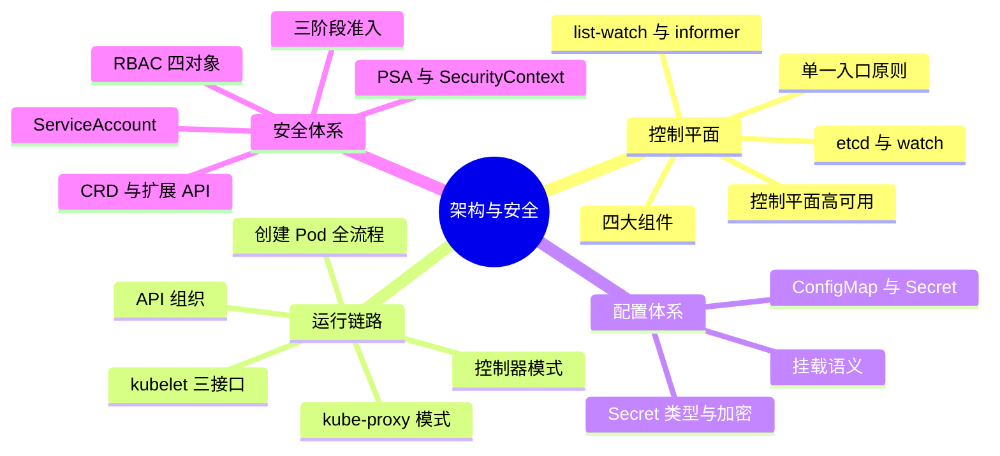
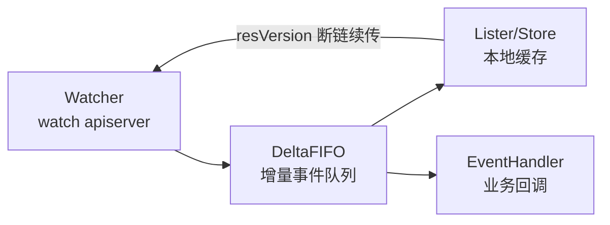
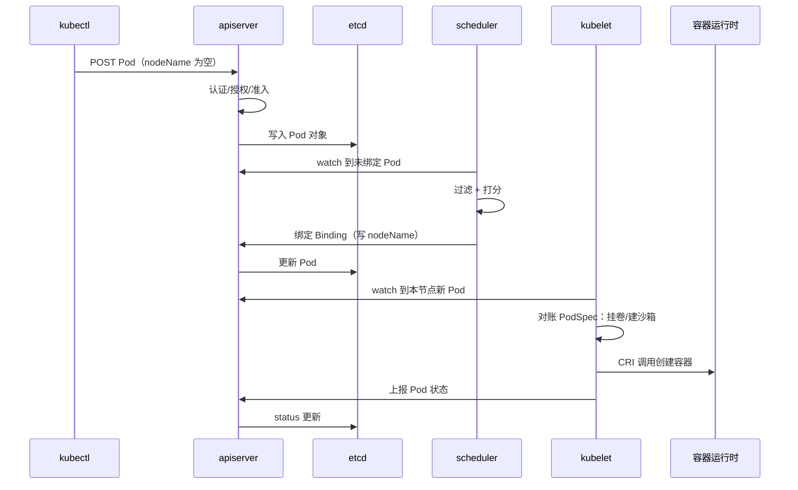
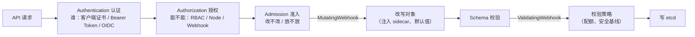

# K8s 集群架构与配置安全快问快答（21 题）

架构底座见 [[01-集群基础/01-架构总览/01-kubernetes-architecture-overview.md|集群架构总览]] 与 [[01-集群基础/01-架构总览/02-core-components-deep-dive.md|核心组件深度解析]]。本文体例同网络/存储/Deployment 快问快答：先遮住答案口述，再对照关键词补全，最后沿"深挖"链接回语料源文件精读。

---

## 话题覆盖清单

| 题号 | 话题域 | 核心考点 |
|------|--------|---------|
| 1 | 控制平面组件 | apiserver/etcd/scheduler/controller-manager 分工 |
| 2 | 单一通信入口 | 组件互不直连、etcd 仅 apiserver 可达 |
| 3 | etcd 角色 | 唯一状态存储、raft、备份 |
| 4 | list-watch | informer、本地缓存、增量事件 |
| 5 | 创建 Pod 全流程 | 从 kubectl 到容器运行的主链路 |
| 6 | kubelet 职责 | PodSpec 消费、CRI/CNI/CSI 三接口 |
| 7 | kube-proxy 模式 | iptables vs IPVS vs eBPF |
| 8 | 控制器模式 | 声明式 + 调谐循环 |
| 9 | API 组织 | API 组、GVR、版本成熟度 |
| 10 | 控制平面高可用 | 无状态横向、quorum、leader election |
| 11 | ConfigMap/Secret 语义 | 同存 etcd、编码差异、使用方式 |
| 12 | Secret 类型与挂载 | 四类型、env vs volume |
| 13 | Secret 静态加密 | EncryptionConfiguration、etcd 防护 |
| 14 | RBAC 四对象 | Role/ClusterRole/Binding 与动词 |
| 15 | RBAC 最佳实践 | 最小权限、聚合、通配符风险 |
| 16 | ServiceAccount 与 Token | projected token、audience、轮换 |
| 17 | 请求三阶段 | 认证 → 授权 → 准入 |
| 18 | Pod Security Admission | privileged/baseline/restricted |
| 19 | SecurityContext | runAsNonRoot/ro rootfs/权限提升 |
| 20 | 默认开放语义 | NetworkPolicy default-deny 底座 |
| 21 | CRD 与扩展 API | CRD vs 聚合 API、Operator 底座 |

**知识地图**：21 题归并为四大板块——答题先定位板块，再展开考点。



---

### 1. 控制平面四大组件各管什么？一句话概括分工？

> **一句话**：apiserver 是唯一读写入口，etcd 是唯一存储，scheduler 决定"放哪"，controller-manager 决定"补齐什么"——所有组件通过 apiserver 读写期望状态并相互协作。

| 组件 | 职责 | 特征 |
|------|------|------|
| kube-apiserver | REST API、认证授权准入、读写 etcd、组件间消息枢纽 | 无状态可横向 |
| etcd | 集群全部状态（对象）的强一致存储 | raft 多数派，只有 apiserver 访问 |
| kube-scheduler | 为未绑定 Pod 选节点（过滤+打分） | 只写 `spec.nodeName` |
| kube-controller-manager | 跑几十个控制器（Deployment/Node/Job…）把实际状态调谐到期望状态 | 各控制器 leader election |

**面试落点**：K8s 的核心设计是"组件解耦为控制循环 + 共享存储协调"——组件之间从不直接调用，全部经由 API 对象通信。

深挖：[[01-集群基础/01-架构总览/02-core-components-deep-dive.md|核心组件深度解析]]

### 2. 为什么所有组件都只跟 apiserver 通信？etcd 为什么只让 apiserver 访问？

> **一句话**：单一入口让认证授权准入有且只有一个执行点、让状态变更可审计可回放；etcd 单点访问消除了绕过 API 语义写坏数据的通道，同时把 etcd 的证书与网络暴露面收敛到最小。

**三个推论**：① 任何组件挂了都不影响其他组件继续从 apiserver 读状态自愈；② 所有写都经过准入控制（webhook 全局生效）；③ etcd 性能问题 = 整个集群性能问题——所以有大对象进 etcd（1.5MB 限制）、高频全量 LIST 等经典反面教材。深挖：[[01-集群基础/01-架构总览/01-kubernetes-architecture-overview.md|集群架构总览]]

### 3. etcd 在集群里扮演什么角色？挂了会怎样？怎么备份？

> **一句话**：etcd 存所有 API 对象（期望状态的唯一真源）；quorum 丢失则只读不可写但存量 Pod 照常运行；备份用 `etcdctl snapshot save` 定期做并演练恢复。

**三个层次**：① **功能**：强一致（raft）键值存储，watch 机制支撑所有控制器的增量感知；② **故障表现**：quorum 存活可正常读写；丢多数派则 apiserver 拒写（存量工作负载不受影响——kubelet 本地缓存继续管容器，但没有任何新变更能落地）；③ **备份与维护**：快照 + 定时（数据丢失窗口 = 快照间隔），恢复是整集群级操作，必须演练；日常维护注意 apiserver 默认每 5 分钟做一次 compaction（修剪历史版本），db size 持续增长时需对 etcd 做 defrag 碎片整理（需逐节点下线操作）。深挖：[[01-集群基础/03-控制平面/01-plane-architecture-overview.md|控制平面架构]]

### 4. list-watch 是什么？informer 为什么要把数据缓存到本地？

> **一句话**：LIST 拉全量 + WATCH 靠 resourceVersion 增量收事件，informer 把数据缓存在本地内存（store）并回调业务——组件不查数据库也能秒级感知状态，apiserver 也不用被高频轮询打爆。

**机制四件套**：



**要点**：① `resourceVersion` 是断点续传书签——watch 断链后从上次版本继续，不丢事件；② 缓存读（Lister）让控制器逻辑高频查询不碰 apiserver；③ 控制器都有 `resync` 周期兜底错过的变更；④ 面试常问"为什么不用轮询"——轮询的延迟与压力都不收敛，watch 是常连接 + 增量。

### 5. `kubectl run nginx` 到容器跑起来，中间发生了什么？

> **一句话**：kubectl 提交 Pod → apiserver 校验入 etcd → scheduler 看到未绑定 Pod 写 nodeName → kubelet watch 到自己的新 Pod → 经 CRI/CNI/CSI 建容器挂网络 → 上报状态。



**可追问点**：① scheduler 只做决策不做执行——绑定就是把 `spec.nodeName` 写进对象；② kubelet 的三接口分工：CRI 建容器、CNI 配网络、CSI 挂卷（第 6 题）；③ readiness 通过后 endpoints 才收编该 Pod（接流量是另一条控制循环）。

深挖：[[01-集群基础/01-架构总览/05-pod-creation-end-to-end-flow.md|Pod 创建全流程]]

### 6. kubelet 具体做什么？它和容器运行时、CNI、CSI 怎么协作？

> **一句话**：kubelet 是节点代理——watch 分配到本节点的 PodSpec，驱动 CRI 建容器、CNI 配网络、CSI 挂卷，并持续对账与上报节点/Pod 状态。

| 接口 | 对接方 | 职责 |
|------|--------|------|
| CRI | containerd/CRI-O | 沙箱与容器生命周期、镜像拉取 |
| CNI | 网络插件（Calico/Cilium…） | Pod 网络命名空间、IP 分配、路由 |
| CSI | 存储驱动 | 卷挂载（NodeStage/Publish） |

**持续对账**：kubelet 按 sync loop 周期 + 事件触发双通道工作，容器死了重启（restartPolicy）、探针失败执行动作、节点状态定期心跳（`nodeStatusUpdateFrequency`）——心跳丢失 40s 标记 NotReady（配污点驱逐）。

### 7. kube-proxy 的 iptables、IPVS、eBPF 三种模式怎么选？

> **一句话**：iptables 规则线性匹配在服务多时退化，IPVS 哈希表 + 多种负载均衡算法扛大规模，eBPF 数据面（Cilium 等）性能最优且能绕开 conntrack 部分坑。

| 模式 | 数据结构 | 规模表现 | 特点 |
|------|---------|---------|------|
| iptables（默认） | 线性规则链 | 服务数上千后更新慢、匹配 O(n) | 兼容性最好 |
| IPVS | 内核哈希表 | 万级服务仍稳 | 支持rr/lc/sh 等算法，需加载内核模块 |
| eBPF | 挂钩子的字节码 | 性能最优 | 由 CNI（如 Cilium）接管，替代 kube-proxy |

**面试落点**：模式只影响"VIP → Pod"转发，不影响 Service 语义；大规模集群首选 IPVS，追求极致性能与可观测性选 eBPF 数据面。深挖：[[05-网络/01-K8s网络核心/58-kubernetes-network-quick-qa.md|K8s 网络快问快答]]

### 8. 什么是控制器模式（control loop）？声明式 API 好在哪？

> **一句话**：每个控制器跑同一个循环——观察实际状态、对比期望状态、执行调谐动作收敛差异；声明式让用户只描述"要什么"，系统持续保证"是什么"，天然具备自愈与幂等。

```text
for {
    desired := read from apiserver      # 期望状态（spec）
    actual := observe the world         # 实际状态（status/真实资源）
    if actual != desired {
        act to converge                 # 调谐（创建/删除/更新）
    }
}
```

**三个推论**：① 重复 apply 无副作用（幂等）；② 控制器崩溃重启后从对象状态继续调谐（无内存态依赖）；③ `kubectl edit` 改 status 没用——status 是系统写的，spec 才是用户期望。

### 9. API 对象怎么组织？`apps/v1`、`v1` 这些版本号代表什么？

> **一句话**：资源按 `API 组/版本/资源`（GVR）组织，`v1` 是核心组，`apps/v1` 是应用组；版本后缀 alpha（默认关闭、随时删）→ beta（默认开启、接口趋稳）→ stable（vN，长期承诺）。

**要点**：① `kubectl api-resources` 列 GVR，短名（deploy/pvc）是别名；② 同一对象可有多个并存版本（v1beta1/v1），apiserver 做转换与存储版本收敛；③ 弃用策略：API 从 beta 删除前有公告窗口——升级集群前必须跑弃用扫描。深挖：[[01-集群基础/01-架构总览/02-core-components-deep-dive.md|核心组件深度解析]]

### 10. 控制平面怎么做到高可用？apiserver 横向扩容和 etcd 有什么区别？

> **一句话**：apiserver 无状态可任意加副本（前面挂 LB）；etcd 是强一致多数派——3/5 节点容忍 1/2 台故障，副本数必须是奇数；controller-manager 与 scheduler 内部 leader election 保证单活跃实例。

| 组件 | 扩展方式 | 故障语义 |
|------|---------|---------|
| apiserver | 无状态横向 + LB | 副本互备 |
| etcd | 奇数节点 raft quorum | 丢多数派只读 |
| controller-manager / scheduler | leader election（lease 锁） | 单活跃，备胎待命 |

**经典追问**：为什么 etcd 不建议 4 节点？——quorum=3，容忍 1 台，与 3 节点相同却多一台成本与一致性开销；5 节点容忍 2 台才是跨机房容灾的合理档位。

### 11. ConfigMap 和 Secret 本质区别是什么？Secret 真的"加密"了吗？

> **一句话**：两者都是"配置与代码分离"的键值对象、都明文（base64）存 etcd——Secret 只是语义上标记敏感 + 更严格的挂载与传输处理，真正的防泄露要开静态加密 + RBAC 收口。

| 维度 | ConfigMap | Secret |
|------|-----------|--------|
| 存储编码 | 明文 | base64（编码不是加密！） |
| 大小限制 | ~1MB | ~1MB |
| etcd 静态加密 | 少用 | **必须**（EncryptionConfiguration） |
| 传输 | 普通 API 请求 | API 返回时可标记不可缓存 |
| 挂载方式 | env/volume | env/volume/拉取凭证（imagePullSecrets） |

**面试高频坑**：`kubectl get secret -o yaml` 里能看到 base64 解码即明文——"Secret 加密"只对开了 encryption provider 的 etcd 层成立；RBAC 对 secrets 的 list 权限等于明文泄露。深挖：[[22-概念/05-安全/secrets.md|Secret 机制]]

### 12. Secret 有哪些常用类型？env 和 volume 挂载的行为差异？

> **一句话**：Opaque 通用、kubernetes.io/dockerconfigjson 拉镜像、tls 证书对、service-account-token 服务账户凭证；volume 挂载支持自动更新（kubelet 同步），env 注入后永不更新。

| 类型 | 用途 |
|------|------|
| Opaque（默认） | 自定义键值（数据库密码等） |
| dockerconfigjson | 私有仓库凭证（imagePullSecrets） |
| tls | cert/key 对（Ingress TLS） |
| bootstrap/service-account-token | SA 令牌（系统管理） |

**行为差异与 Deployment 联动**：volume 挂载的 Secret 文件变更由 kubelet 周期同步（与 ConfigMap 相同），但应用要么热加载要么靠 `rollout restart` 重建（见 Deployment 快问快答第 9 题）；env 方式只在容器启动时注入一次。深挖：[[22-概念/11-交叉分析/Pod 生命周期 × Secret 管理.md|Pod 生命周期 × Secret 管理]]

### 13. Secret 的静态加密怎么做？密钥放哪？

> **一句话**：apiserver 配 EncryptionConfiguration 启用 aescbc/kms 等 provider，落 etcd 的数据即密文；生产首选 KMS 插件（云 KMS 托管密钥），本地密钥要放文件系统且轮换困难。

```yaml
apiVersion: apiserver.config.k8s.io/v1
kind: EncryptionConfiguration
resources:
  - resources: [secrets]
    providers:
    - kms: {name: aliyun-kms, endpoint: unix:///var/run/kmsplugin/socket.sock, cachesize: 1000}
    - aescbc: {keys: [{name: key1, secret: <base64>}]}   # 兜底解密用
    - identity: {}                                        # 兜底（新写不加密）
```

**三个要点**：① 开启后**存量数据仍是明文**——要重写所有 Secret（`kubectl get secrets -A -o yaml | kubectl replace -f -`）才落密文；② provider 顺序 = 加密优先级、解密逐个尝试；③ 托管 KMS 的核心收益是密钥轮换、审计与权限在云侧。深挖：[[08-安全/01-身份与访问/07-secret-management-tools.md|Secret 管理工具]]、[[22-概念/05-安全/secrets-management.md|Secret 管理体系]]

### 14. RBAC 四个对象分别是什么？动词和资源怎么组合？

> **一句话**：Role/ClusterRole 定义"动词+资源"规则集，RoleBinding/ClusterRoleBinding 把规则授予 Subject（User/Group/ServiceAccount）；命名空间内用 Role，跨命名空间用 ClusterRole。

| 对象 | 作用域 | 作用 |
|------|--------|------|
| Role | namespace | 定义 NS 内资源权限 |
| ClusterRole | cluster | 集群级资源（node/pv）或全 NS 复用的规则模板 |
| RoleBinding | namespace | 授予 Subject，可引用 ClusterRole（复用规则模板） |
| ClusterRoleBinding | cluster | 全局授予 |

```yaml
rules:
- apiGroups: [""]
  resources: ["pods", "pods/log"]
  verbs: ["get", "list", "watch"]
- apiGroups: [""]
  resources: ["pods/exec"]
  verbs: ["create"]        # 子资源写法：pods/exec、pods/status
```

**要点**：RBAC 是**加法**（无拒绝规则）——判断权限就是"是否存在一条匹配的规则"；`RoleBinding 引用 ClusterRole` 是权限复用的标准姿势（同一套只读模板授予多个 NS）。

深挖：[[08-安全/01-身份与访问/06-rbac-matrix-configuration.md|RBAC 权限矩阵配置]]、[[22-概念/05-安全/rbac-authorization.md|RBAC 授权机制]]

### 15. RBAC 的最小权限怎么落地？有哪些常见踩坑？

> **一句话**：按角色切分动词（能 watch 就别给 list+watch 全量、能用 get 就别给 list）、拒绝 `*` 通配、定期审计实际调用——`kubectl auth can-i` 与审计日志是两大工具。

**踩坑清单**：① `cluster-admin` 滥发——CI/CD 的 SA 也给超管；② `verbs: ["*"]` + `resources: ["*"]` 一步登天；③ `list secrets` 授权 = 全 NS 明文密码可见；④ `pods/exec` 等于进了容器 shell——与 `update` 同级敏感；⑤ 忘记 Controller 的权限需求（Deployment 控制器需要读 RS、写 RS）——排查用 `kubectl auth can-i --as=system:serviceaccount:ns:sa` 模拟。

### 16. ServiceAccount 的 Token 现在怎么管理？和以前有什么区别？

> **一句话**：v1.24 起 SA 不再自动生成永久 Secret Token，改为 Pod 启动时注入**有时间边界与 audience 的 projected token**（TokenRequest API），到期自动轮换、Pod 删除即失效——大幅缩小泄露半径。

**演进对比**：

| 时代 | Token 形态 | 风险 |
|------|-----------|------|
| 旧（≤v1.23） | SA 关联的永久 Secret，自动挂载 | 泄露即永久有效 |
| 新（v1.24+） | projected volume（`kubernetes.io/token`），1 小时级有效期 + audience 绑定 | 自动轮换、可撤销、作用域可控 |

**要点**：① Pod 内路径 `/var/run/secrets/kubernetes.io/serviceaccount/token`；② `automountServiceAccountToken: false` 关闭不需要的自动挂载（Pod 或 SA 级）；③ 跨集群/系统间调用用 `kubectl create token --audience=...` 按需签发。深挖：[[08-安全/01-身份与访问/03-service-account-token-management.md|ServiceAccount Token 管理]]

### 17. 一个请求到达 apiserver，认证、授权、准入三阶段各做什么？

> **一句话**：认证回答"你是谁"（证书/Token/OIDC），授权回答"你能干什么"（RBAC/Node/Webhook），准入回答"这个请求要不要改一改或拦下来"（Mutating→Schema 校验→Validating）。



**三者的差异**：认证授权失败返回 401/403；准入是"对合法请求的对象级治理"——配额（ResourceQuota）、LimitRanger、PodSecurity、OPA/Kyverno 都在这一层。深挖：[[08-安全/01-身份与访问/01-authentication-authorization-system.md|认证授权体系]]

### 18. Pod Security Admission 的三级标准各挡什么？

> **一句话**：privileged 不限制、baseline 挡住明确危险项（hostNetwork、特权提升、敏感宿主目录）、restricted 强制收敛到最小权限（非 root、全能力移除、seccomp）——按 namespace 级标签生效。

| 级别 | 典型拒绝 |
|------|---------|
| privileged | 无（仅审计） |
| baseline | hostNetwork/hostPID、hostPath 敏感路径、添加 CAP_SYS_ADMIN、特权提升 |
| restricted | baseline 全部 + 必须 runAsNonRoot、必须去掉 ALL capabilities、必须 seccompProfile、禁止 privilege escalation |

**与 PSP 的关系**：PSP（PodSecurityPolicy）v1.25 已删除，PSA 是内置替代——轻量（namespace 标签三挡 enforce/audit/warn 模式组合），复杂策略仍交给 OPA/Kyverno。深挖：[[08-安全/01-身份与访问/02-pod-security-admission-deep-dive.md|Pod Security Admission 深度解析]]

### 19. SecurityContext 常用字段有哪些？容器逃逸的主要防线是哪几个？

> **一句话**：Pod 级与容器级两档配置；防逃逸的核心四件套——`runAsNonRoot`、`allowPrivilegeEscalation: false`、`capabilities.drop: [ALL]`、`readOnlyRootFilesystem`。

```yaml
securityContext:
  runAsNonRoot: true
  runAsUser: 10001
  fsGroup: 20001            # 卷属组（存储域第 13 题的权限坑）
  seccompProfile: {type: RuntimeDefault}
containers:
- securityContext:
    allowPrivilegeEscalation: false
    capabilities: {drop: [ALL]}
    readOnlyRootFilesystem: true
```

**要点**：① `privileged: true` 等于把宿主机交给容器——等于放弃隔离，仅限系统组件；② readOnlyRootFilesystem 需要 /tmp 等可写路径时挂 emptyDir 补；③ PSA restricted 级就是这套字段的强制化。

### 20. 没配 NetworkPolicy 时 Pod 之间能随便互访吗？默认语义怎么补齐？

> **一句话**：能——K8s 网络默认全通（Pod 网络扁平无隔离）；NetworkPolicy 是"选中即转为白名单模式"的加法模型，安全基线从 default-deny（全拒）起步再逐项放行。

**模型**：Pod 被某条 NetworkPolicy 的 `podSelector` 选中后，其入站/出站对未明确放行的流量一律拒绝——所以第一张 policy 永远是 `default-deny`（空规则的 policy），然后按需放行 DNS（53 端口到 kube-dns，最常被漏配的例外）与业务端口。细节与排障见网络域第 50 题。深挖：[[05-网络/01-K8s网络核心/58-kubernetes-network-quick-qa.md|K8s 网络快问快答第 50 题]]、[[01-集群基础/01-架构总览/12-security-architecture.md|安全架构]]

### 21. CRD 和聚合 API（Aggregated API）都能扩展 API，怎么选？

> **一句话**：CRD 一切皆是数据（etcd 存 YAML，apiserver 通义处理），聚合 API 一切皆是代码（自己写 apiserver 进程接入）；简单自定义对象选 CRD，需要自定义协议/存储/子资源才上聚合 API——Operator 生态几乎全建在 CRD 之上。

| 维度 | CRD | 聚合 API（APIService） |
|------|-----|----------------------|
| 实现 | 纯声明，无代码 | 独立 apiserver 服务 + AA 注册 |
| 存储/处理逻辑 | etcd 通用存储，无自定义逻辑 | 完全自定义（存储、协议如 protobuf、校验） |
| 运维成本 | 低（随集群高可用） | 高（需自管可用性、版本、证书） |
| 适用 | Operator/配置对象/CR（数据库 CR、Argo CD Application） | metrics.k8s.io 等系统级扩展 |

**要点**：① CRD + 控制器 = Operator 模式——控制器 list-watch CR，把领域知识编码进调谐循环；② CRD 也能配 admission webhook、subresource（status/scale）、多版本转换（webhook conversion）；③ 面试高频："为什么 Operator 不用聚合 API"——运维成本与生态复用（controller-runtime 直接消费 CRD）。

深挖：[[03-清单模式/04-Operator模式/01-operator-cr-design-patterns.md|Operator 与 CR 设计模式]]、[[22-概念/01-核心架构/operator-pattern.md|Operator 模式]]

---

## 面试官追问模拟（追问链）

**场景**：告警"etcd db size 超过 8GB，apiserver P99 延迟上升"。

- **追问 1：先查什么在写 etcd？**——审计日志/etcd 指标按 key 前缀聚合：大对象（ConfigMap 塞日志）、高频 status 更新（控制器每秒写 status）、未加 labels 限制的全量 LIST。
- **追问 2：compaction 和 defrag 区别？**——compaction 修剪指定 revision 之前的历史版本（apiserver 每 5 分钟自动做），释放的是"逻辑空间"；defrag 重建 btree 释放物理磁盘空间——不 compact 就 defrag 基本无效（第 3 题）。
- **追问 3：为什么高频全量 LIST 有害？**——大 LIST 会打爆 apiserver 内存并挤占 etcd 读带宽；治理方向是分页 + label selector 收窄 + 客户端走 informer 缓存而非反复 LIST。
- **追问 4：quota/limit 机制在这里的关联？**——ResourceQuota 能限制对象数量与总大小类滥用；平台侧对 ConfigMap/CR 的大小做准入校验（validating webhook）防大对象入库。
- **追问 5：长期怎么防？**——etcd 指标告警（db size、慢查询、compaction 失败）+ 对象生命周期治理（定期清理完成的 Job/事件）+ 大配置外移（对象存储 + 引用）。

---

## 速答速记表（21 题一句话版）

复习用：遮住答案，只看"一句话答案"列口述展开，再对照"记忆钩子"自检。

| 题号 | 一句话答案 | 记忆钩子 |
|------|-----------|---------|
| 1 | apiserver 唯一入口、etcd 唯一存储、scheduler 定位置、controller 定收敛 | 一口一库一定一收敛 |
| 2 | 单一入口收敛认证授权与审计；etcd 暴露面最小化 | 入口唯一 |
| 3 | etcd 是状态唯一真源；丢 quorum 只读；快照备份必演练 | 真源与快照 |
| 4 | LIST 全量 + WATCH 增量，informer 本地缓存 + 回调，断链按 resourceVersion 续传 | 全量一次增量永远 |
| 5 | 提交→etcd→scheduler 绑定→kubelet watch→CRI/CNI/CSI→上报 | 五站六步 |
| 6 | kubelet 驱动 CRI 建容器、CNI 配网、CSI 挂卷并持续对账心跳 | 三接口一对账 |
| 7 | iptables 线性退化、IPVS 哈希扛规模、eBPF 性能最优 | 三代数据面 |
| 8 | 控制循环：观察→对比→收敛；声明式天然幂等自愈 | 观比对调 |
| 9 | GVR 组织；alpha 可删、beta 趋稳、stable 长期承诺 | 三级成熟度 |
| 10 | apiserver 无状态横向、etcd 奇数 quorum、CM/Scheduler 选主单活跃 | 无状态与多数派 |
| 11 | 同为配置对象；Secret 只是语义敏感 + base64，加密要开 etcd 静态加密 | 编码不等于加密 |
| 12 | Opaque/dockerconfigjson/tls/SA 四类型；volume 可同步、env 不更新 | 四类型两挂载 |
| 13 | EncryptionConfiguration + KMS 托管密钥；开启后存量要重写 | 开了才密 |
| 14 | Role/ClusterRole 定义动词资源，Binding 授人；NS 内外两级 | 规则与授予 |
| 15 | 最小权限、拒绝通配、can-i 与审计验证；list secrets 即明文泄露 | 加法无拒绝 |
| 16 | v1.24 起 projected 短期 Token 自动轮换，替代永久 Secret Token | 短令牌 |
| 17 | 认证你是谁、授权能不能、准入改不改/放不放 | 三问三关 |
| 18 | privileged 不限、baseline 挡危险、restricted 收最小权限 | 三级基线 |
| 19 | 非 root + 禁提权 + 去能力 + 只读根文件系统四件套 | 防逃逸四件套 |
| 20 | 网络默认全通；NetworkPolicy 选中即白名单，先 default-deny 再放行 DNS | 选中即白名单 |
| 21 | CRD 是数据扩展、聚合 API 是代码扩展；Operator 建在 CRD 上，自定义协议/存储才上聚合 API | 数据与代码 |

---

## 自练检查清单

- 能否 90 秒画出"创建 Pod 全流程"时序（第 5 题），并指出 scheduler 与 kubelet 各自只做哪一段？
- list-watch 四件套（Watcher/DeltaFIFO/Store/EventHandler）与断链续传能否讲清（第 4 题）？
- "Secret 加密了吗"这个陷阱题能否从 base64、etcd 静态加密、RBAC 三层回答（第 11、13 题）？
- compaction 与 defrag 的区别、etcd 膨胀的治理思路能否展开（第 3 题 + 追问链）？
- RBAC 四对象与"加法模型"能否现场推演一个 can-i 判断（第 14、15 题）？
- CRD 与聚合 API 的选型边界、Operator 为什么选 CRD 能否说清（第 21 题）？
- 三阶段准入各拦截什么、Kyverno/配额在哪层能否对号入座（第 17、18 题）？
- SA Token 新旧机制的差异与收敛点能否说明（第 16 题）？

---

## 相关链接

- [[01-集群基础/01-架构总览/01-kubernetes-architecture-overview.md|集群架构总览]]
- [[01-集群基础/01-架构总览/02-core-components-deep-dive.md|核心组件深度解析]]
- [[01-集群基础/01-架构总览/05-pod-creation-end-to-end-flow.md|Pod 创建全流程]]
- [[01-集群基础/01-架构总览/12-security-architecture.md|安全架构]]
- [[01-集群基础/03-控制平面/01-plane-architecture-overview.md|控制平面架构]]
- [[08-安全/01-身份与访问/01-authentication-authorization-system.md|认证授权体系]]
- [[08-安全/01-身份与访问/02-pod-security-admission-deep-dive.md|Pod Security Admission 深度解析]]
- [[08-安全/01-身份与访问/03-service-account-token-management.md|ServiceAccount Token 管理]]
- [[08-安全/01-身份与访问/06-rbac-matrix-configuration.md|RBAC 权限矩阵配置]]
- [[08-安全/01-身份与访问/07-secret-management-tools.md|Secret 管理工具]]
- [[22-概念/05-安全/rbac-authorization.md|RBAC 授权机制]]
- [[22-概念/05-安全/secrets.md|Secret 机制]]
- [[22-概念/05-安全/secrets-management.md|Secret 管理体系]]
- [[22-概念/11-交叉分析/Pod 生命周期 × Secret 管理.md|Pod 生命周期 × Secret 管理]]
- [[02-工作负载/01-核心工作负载/26-kubernetes-deployment-quick-qa.md|K8s Deployment 快问快答]]
- [[05-网络/01-K8s网络核心/58-kubernetes-network-quick-qa.md|K8s 网络快问快答]]
