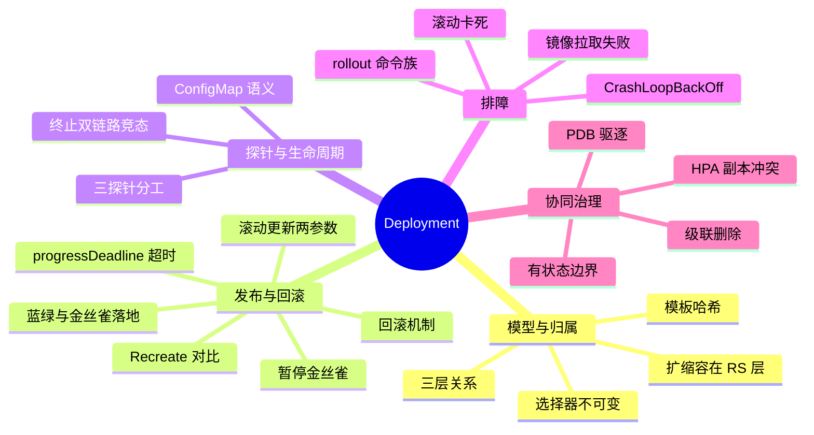
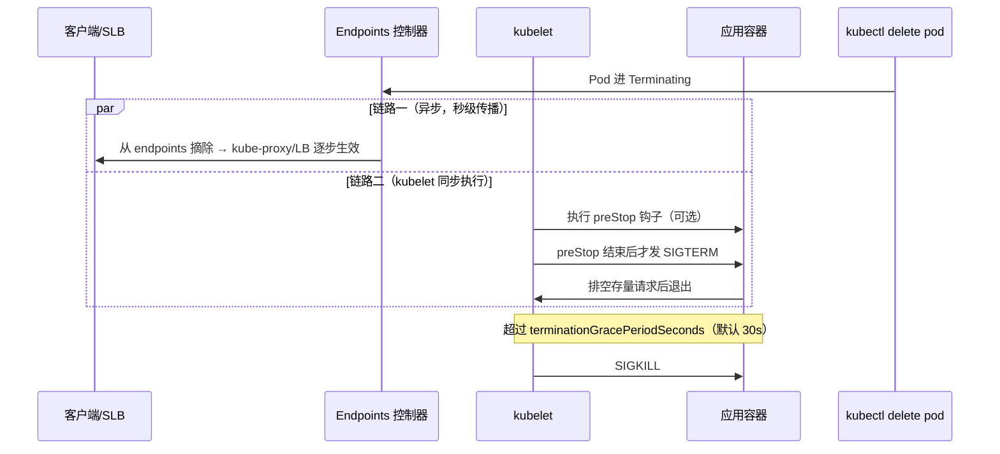

# K8s Deployment 快问快答（21 题）

控制器全景见 [[02-工作负载/01-核心工作负载/10-workload-controllers-overview.md|工作负载控制器总览]]，生产实践见 [[02-工作负载/01-核心工作负载/02-deployment-production-patterns.md|Deployment 生产模式]]。本文体例同网络/存储快问快答：先遮住答案口述，再对照关键词补全，最后沿"深挖"链接回语料源文件精读。

---

## 话题覆盖清单

| 题号 | 话题域 | 核心考点 |
|------|--------|---------|
| 1 | 三层模型 | Deployment→ReplicaSet→Pod 归属与分工 |
| 2 | 扩缩容 | replicas 字段、扩缩发生在 RS 层 |
| 3 | 滚动更新 | 新旧 RS 切换、maxSurge/maxUnavailable 计算 |
| 4 | 回滚 | revision 机制、rollout undo、历史保留 |
| 5 | 发布策略 | Recreate vs RollingUpdate 选型 |
| 6 | 暂停发布 | rollout pause/resume 手工金丝雀 |
| 7 | 三探针 | liveness/readiness/startup 分工 |
| 8 | 终止流程 | SIGTERM→preStop→grace period→SIGKILL |
| 9 | 不触发滚动的变更 | ConfigMap/Secret 变更语义 |
| 10 | 选择器不可变 | selector 与归属关系 |
| 11 | 滚动卡死 | readiness 不过、maxUnavailable=0 死锁 |
| 12 | CrashLoopBackOff | 排障链路与退避机制 |
| 13 | 镜像拉取失败 | ImagePullBackOff、imagePullSecrets |
| 14 | rollout 命令族 | status/history/undo/restart |
| 15 | HPA 冲突 | 副本字段所有权 |
| 16 | 删除语义 | cascade/orphan、RS 误删自愈 |
| 17 | 高级发布 | 蓝绿、金丝雀在原生 Deployment 上落地 |
| 18 | 有状态边界 | 为什么有状态应用不能只靠 Deployment |
| 19 | PDB 协同 | 节点维护与自愿驱逐 |
| 20 | 变更检测 | pod-template-hash 与控制器对比逻辑 |
| 21 | 发布超时 | progressDeadlineSeconds 与 status 条件 |

**知识地图**：21 题归并为五大板块——答题先定位板块，再展开考点。



---

### 1. Deployment、ReplicaSet、Pod 三层各管什么？为什么中间要夹一层 RS？

> **一句话**：Deployment 管发布版本（每次模板变更生成新 RS），RS 管副本数量与存活，Pod 是工作单元——夹 RS 是为了支持回滚与渐进发布。

| 层 | 职责 | 关键字段 |
|----|------|---------|
| Deployment | 声明期望状态、编排 RS 的新建/缩容/保留 | `spec.template`、`strategy` |
| ReplicaSet | 把 Pod 副本数维持到期望值 | `replicas`、`selector` |
| Pod | 真正运行的容器 | 模板实例化产物 |

**为什么夹 RS**：直接让 Deployment 管 Pod，回滚就没有"旧版本"实体可用。每次模板变更 Deployment 创建一个新 RS（以 pod-template-hash 区分），旧 RS 缩到 0 但保留——`rollout undo` 只是把旧 RS 的副本数加回来。

深挖：[[22-概念/02-工作负载/deployment-controller-architecture.md|Deployment 控制器架构]]

### 2. 扩缩容发生在哪一层？改 Deployment 的 replicas 和改 RS 的 replicas 有什么区别？

> **一句话**：扩缩本质由 RS 执行；改 Deployment 的 replicas 是正规入口，直接改 RS 下次发布会被打回。

`kubectl scale deployment` 改的是 Deployment `.spec.replicas`，控制器把值同步给当前活跃 RS。若直接 `kubectl scale rs`，RS 会临时生效，但 Deployment 控制器在下次同步（或任何模板变更）时把 RS 拉回 Deployment 声明的值——**副本字段的所有权在 Deployment**。例外：HPA 接管后（第 15 题），连 Deployment 的 replicas 也由 HPA 写。

深挖：[[02-工作负载/01-核心工作负载/10-workload-controllers-overview.md|工作负载控制器总览]]

### 3. 滚动更新的原理是什么？maxSurge 和 maxUnavailable 怎么计算？

> **一句话**：控制器在"新 RS 逐步加、旧 RS 逐步减"之间反复同步，任意时刻满足 `可用数 ≥ desired - maxUnavailable` 且 `总数 ≤ desired + maxSurge`；参数可为绝对值或百分比（向上/向下取整）。

**滚动一轮的伪代码**：

```text
loop:
  newRS.scaleUp(min(maxSurge, 还能加多少))       # 受总数上限约束
  等新 Pod Ready
  oldRS.scaleDown(min(maxUnavailable, 可牺牲量)) # 受可用数下限约束
  直到 newRS.replicas == desired
```

| 参数 | 含义 | 取整规则 | 典型值 |
|------|------|---------|--------|
| `maxSurge` | 期望副本数之上允许多出多少 | 百分比**向上**取整 | 25% |
| `maxUnavailable` | 期望副本数之下允许少多少可用 | 百分比**向下**取整 | 25% |

**经典追问**：`replicas=4, maxSurge=25%, maxUnavailable=25%` → surge=1（4×0.25 向上取整），unavailable=1（向下取整）→ 滚动期间最多 5 个 Pod、可用至少 3 个。**两个参数为 0 的组合非法**（既不超发也不可少，永远无法推进）。

深挖：[[22-概念/02-工作负载/deployments.md|Deployment 概念详解]]

### 4. 回滚的机制是什么？revisionHistoryLimit 管什么？回滚会创建新版本吗？

> **一句话**：每个 RS 是一个 revision，`rollout undo` 把目标 RS 扩到全量、当前 RS 缩到 0；`revisionHistoryLimit` 只控制留多少个旧 RS；回滚本身作为一次模板变更产生新 revision。

**三步闭环**：`rollout history` 看 RS 列表 → `rollout undo deployment/app --to-revision=2` → Deployment 控制器把 revision 2 的模板作为最新声明，正常走滚动更新逻辑。**要点**：① 回滚不是"切指针"而是重新发布——所以回滚也会滚动、也会创建新 RS（其模板哈希与旧 RS 相同则复用）；② `revisionHistoryLimit: 10` 是保留旧 RS 的上限，超出的按时间淘汰（被淘汰的 revision 无法再回）；③ `--record` 已废弃，annotation `kubernetes.io/change-cause` 是写变更原因的正道。

### 5. Recreate 和 RollingUpdate 怎么选？

> **一句话**：默认 RollingUpdate 保可用性；Recreate 先全杀再全起——只适合接受停机窗口、且双版本不能共存的场景（如存量数据 schema 不兼容、本地缓存独占端口/文件）。

| 策略 | 行为 | 代价 | 适用 |
|------|------|------|------|
| RollingUpdate（默认） | 新旧并存渐进切换 | 过渡期两版本共存 | 绝大多数无状态服务 |
| Recreate | 旧 RS 缩 0 → 新 RS 建 | 明显停机窗口 | 单实例应用、禁止双写、开发环境 |

**面试加分**：Recreate 常被用来绕过"新旧版本短暂双活导致的数据冲突"——但这本质是应用层问题，正确解法是让应用兼容滚动（灰度写、schema 向后兼容），而不是让集群停机。

### 6. rollout pause/resume 能做什么？手工金丝雀怎么落？

> **一句话**：pause 冻结滚动（可继续改模板但不下发），配合多容器镜像分次更新实现"先切 10% 流量观察"的手工金丝雀，resume 一次性放行。

**典型手工金丝雀流程**：

```bash
kubectl rollout pause deployment/app
kubectl set image deployment/app app=app:v2        # 不触发滚动
kubectl set resources deployment/app -c app --limits=cpu=2   # 同批修改
kubectl rollout resume deployment/app               # 一次性生效
```

**升级版**：直接建两个 Deployment（`app-stable` 与 `app-canary`）+ 同一 Service 选择器同时命中两者，用副本比例控制流量占比——这是不引入 Argo Rollouts/Flagger 的原生做法（第 17 题展开）。

### 7. liveness、readiness、startup 三探针各管什么？配置错了分别是什么症状？

> **一句话**：liveness 失败重启容器、readiness 失败摘出 Service、startup 失败先挡住前两者——配反了就是"反复重启"或"流量打到没就绪的实例"。

| 探针 | 失败动作 | 症状（配错时） |
|------|---------|--------------|
| liveness | kubelet 杀容器重建 | 应用慢启动被误杀，无限重启 |
| readiness | 从 Service endpoints 摘除 | 502/超时（流量打向未就绪实例）或摘不掉（流量打到挂的实例） |
| startup | 未通过前禁用 liveness/readiness | 无——它是给慢启动应用的保护伞 |

**关键细节**：① 依赖项故障（数据库挂了）不该配进 liveness——重启解决不了依赖问题，反而引发全量重启风暴，放 readiness 更合理；② `initialDelaySeconds` 之外，优先用 startup probe 替代大 delay；③ 探针端口/路径要独立于鉴权。

深挖：[[02-工作负载/01-核心工作负载/11-pod-lifecycle-events.md|Pod 生命周期事件]]

### 8. 删除 Pod 到进程退出，中间发生了什么？优雅终止为什么常配 preStop sleep？

> **一句话**：摘 endpoints（异步）与发 SIGTERM（同步）并行，容器要在 grace period（默认 30s）内自己退出，否则 SIGKILL——preStop sleep 是为了等"摘除 endpoints"这个异步动作先传播到负载均衡器。

**终止时序**：摘除 endpoints 与容器优雅关闭是**两条并行链路**——这正是竞态的来源：



**经典竞态**：SIGTERM 已到、应用停止接新请求，但"摘除 endpoints"还没传播到所有 LB/kube-proxy——在途或新到请求仍被路由到正在关闭的实例 → 502。**标准解法**：`preStop: sleep 5`（给摘除传播留窗口，sleep 在 SIGTERM 之前执行）+ 应用收到 SIGTERM 后停止接新连接、排空存量；`terminationGracePeriodSeconds` 按"preStop 时长 + 最长请求处理时间"配置。

深挖：[[02-工作负载/01-核心工作负载/13-container-lifecycle-hooks.md|容器生命周期钩子]]

### 9. 改了 ConfigMap，Pod 会自动滚动更新吗？两种挂载方式行为差在哪？

> **一句话**：不会——Deployment 只看 Pod 模板，ConfigMap/Secret 内容变更不属于模板变更；env 方式永不更新，volume 方式最终一致（kubelet 同步，约 1 分钟内），要强制生效用 `kubectl rollout restart`。

| 方式 | 内容变更后 | 症状 |
|------|-----------|------|
| env / envFrom | 永不更新（环境变量只在容器启动时注入） | 改了配置"不生效"，重启才好 |
| volume 挂载 | kubelet 周期同步文件（秒到分钟级） | 文件变了但应用不重读——应用要支持热加载或 SIGHUP |

**生产正解**：配置变更走"改名（带版本后缀）+ 模板引用变更"触发真滚动，或显式 `rollout restart`（第 14 题）。深挖：[[22-概念/14-案例研究/2026-05-15-configmap-no-rolling-update.md|案例：ConfigMap 不触发滚动更新]]

### 10. Deployment 的 selector 为什么不可变？改了会怎样？

> **一句话**：selector 是 Deployment 与 RS/Pod 的归属契约，API 直接禁止修改——因为改选择器等于把"谁是我的副本"重新定义，存量 RS/Pod 的收养与孤儿关系无法一致迁移。

**连带规则**：`spec.selector` 决定 Deployment 认领哪些 RS（按 `pod-template-hash` 之外的匹配）。**避坑**：selector 尽量用专属标签（如 `app.kubernetes.io/name` + 实例 ID），不要用会被其他工作负载共享的宽泛标签——否则 Service、HPA、Deployment 多个组件的 selector 互相踩踏。

### 11. 滚动更新卡在中间不动，按什么链路排查？maxUnavailable=0 时的死锁怎么触发？

> **一句话**：先看 `rollout status` 报的进度（新旧 RS 各几个、哪个 Pod 不 Ready），常见四因——新 Pod readiness 不过、资源配额不足、PDB 挡驱逐、maxUnavailable=0 + 节点容量不足导致新 Pod 调度不出去而旧 Pod 又不许减。

```text
kubectl rollout status deployment/app -w
  → "2 of 4 updated replicas are available"（看停在哪）
kubectl get rs -l app=app        # 新旧 RS 副本数对比
kubectl describe pod <新 Pod>    # Events 定位：
  → 探针失败（readiness 永不过）
  → FailedScheduling（quota/CPU 不足，maxSurge 起不来）
  → ImagePullBackOff（第 13 题）
```

**死锁场景**：`maxSurge: 0, maxUnavailable: 0` 非法；但 `maxSurge: 0, maxUnavailable: 25%` 在**单副本**时会先杀旧 Pod 再建新的（短暂不可用）；而 `maxUnavailable: 0` 要求新 Pod 完全 Ready 后才允许减旧——若新版本资源请求更大、集群放不下 surge Pod，滚动永久卡死。**口诀**：先看新 Pod 为什么不 Ready，再看为什么调不进来。

### 12. CrashLoopBackOff 的退避机制是什么？按什么链路排查？

> **一句话**：容器反复退出时 kubelet 按 10s→20s→40s…（上限 5 分钟）指数退避重启；排查先看 `logs --previous` 拿崩溃现场，再分应用退出/OOMKilled/探针误杀三类定位。

**排障链路**：

```text
kubectl describe pod → 看 Restart Count 与 Last State
  ├─ Exit Code 1/业务报错 → kubectl logs --previous 看崩溃前日志（配置/依赖/启动报错）
  ├─ OOMKilled (137) → 内存 limit 不足或泄漏，调 limits（见 23 号资源管理）
  └─ 探针杀的 → liveness 配置过激（第 7 题）
```

**要点**：CrashLoopBackOff 是 kubelet 的**重启退避状态**，不是错误码；只要容器稳定运行一段时间，退避计时重置。`restartPolicy: Always`（默认）下 JVM 应用首次冷启动慢 + liveness 过早启用是最高频组合——用 startup probe 解。

深挖：[[02-工作负载/01-核心工作负载/07-workload-troubleshooting-handbook.md|工作负载排障手册]]

### 13. ImagePullBackOff 和 ErrImagePull 差在哪？怎么排查？

> **一句话**：ErrImagePull 是首次拉取报错，ImagePullBackOff 是进入退避重试；按"镜像名/网络/凭证"三因定位。

| 根因 | describe 事件特征 | 修法 |
|------|------------------|------|
| 名字/tag 错 | `manifest unknown` / `not found` | 核对 image 与 tag（latest 被覆盖也会坑） |
| 私仓无凭证 | `401 unauthorized` | `imagePullSecrets`（docker-registry secret） |
| 限流 | `429 toomanyrequests`（Docker Hub） | 镜像仓库镜像/加速器/预拉取 |
| 网络不通 | `dial tcp timeout` | 节点出网、代理、私有 CA（`certificate-authority`） |

**加分点**：imagePullSecrets 可挂在 ServiceAccount 上全命名空间生效；节点级预拉取（DaemonSet 或镜像预热）是大规模集群削启动延迟的常规手段。

### 14. kubectl rollout 命令族各做什么？restart 的原理是什么？

> **一句话**：status 看进度、history 看版本、undo 回滚、pause/resume 冻结放行、restart 滚动重启——restart 的本质是给模板加一个 `kubectl.kubernetes.io/restartedAt` 注解触发真滚动。

```bash
kubectl rollout status deployment/app       # 阻塞直到完成/超时
kubectl rollout history deployment/app      # revision 列表 + change-cause
kubectl rollout undo deployment/app --to-revision=2
kubectl rollout restart deployment/app      # 全量滚动重启（改注解实现）
```

**restart 用途**：证书/ConfigMap 更新后强制重建、内存泄漏的定时自愈（配合 CronJob 定期 restart）——它走的是标准滚动更新，不是杀 Pod，可用性无损。

### 15. HPA 和手动扩缩容为什么会"打架"？正确的姿势是什么？

> **一句话**：HPA 是副本字段的写者，接管后手动 scale 会被下一个同步周期改回——想手动管就先摘 HPA，想共存就只调 HPA 的 min/max 与指标。

**机制**：HPA 控制器按指标计算期望副本并写回 Deployment `.spec.replicas`；任何手动修改都会在 HPA 下个周期（默认 15s）被覆盖。**三个高频追问**：① HPA 与固定 replicas 冲突的报错场景（部署回滚时 HPA 把副本拉回，导致旧版本占资源）；② 缩容稳定窗口（`--horizontal-pod-autoscaler-downscale-stabilization`，默认 5 分钟）防抖动；③ HPA 管 Deployment 而不是直接管 RS——层级与第 1 题一致。

深挖：[[02-工作负载/01-核心工作负载/21-hpa-vpa-autoscaling.md|HPA/VPA 自动扩缩]]

### 16. 删除 Deployment 时 Pod 怎么处理？误删 RS 会发生什么？

> **一句话**：默认级联删除（Deployment→RS→Pod 逐层走优雅终止）；`--cascade=orphan` 可留 RS/Pod 孤儿化；误删 RS 后 Deployment 会重建一个同名 hash 的 RS 收养仍存活的 Pod，但新建的副本不再受原 RS 管。

**三个层次**：

| 操作 | 结果 |
|------|------|
| `kubectl delete deployment` | 级联删 RS 与 Pod，Pod 走 SIGTERM 优雅终止 |
| `kubectl delete deployment --cascade=orphan` | RS/Pod 保留，ownerReference 清空成孤儿 |
| `kubectl delete rs`（Deployment 还在） | Deployment 控制器按模板重建 RS；存活 Pod 因标签匹配被新 RS 收养，计数不变 |

**面试落点**：ownerReference（`ownerReferences` 字段）是 GC 的依据——级联删除本质是 GC 按 owner 链回收，这也是"删 Namespace 卡 Terminating"排查的底层知识。

### 17. 蓝绿发布和金丝雀发布在原生 Deployment 上怎么落地？什么时候该上 Argo Rollouts？

> **一句话**：原生方案——蓝绿用"双 Deployment + Service 切 selector"，金丝雀用"双 Deployment 共 selector + 副本比例控流"；需要按百分比/_HEADER 精确控流与自动分析时，才升级 Argo Rollouts/Flagger。

| 模式 | 原生实现 | 局限 |
|------|---------|------|
| 蓝绿 | `app-blue`、`app-green` 两个 Deployment，Service selector 从 blue 切到 green | 流量 0/100 切换，需要双倍资源 |
| 金丝雀（副本比例） | stable 与 canary 共用 Service selector，`replicas 9:1` 控流量 | 精度受副本数限制（无法 1%） |
| 金丝雀（网关层） | Ingress/Gateway API 注解按权重/header 分流 | 依赖具体网关实现 |
| Argo Rollouts | 自定义 CRD + 渐进 steps + 指标自动分析回滚 | 引入新组件与学习成本 |

深挖：[[02-工作负载/01-核心工作负载/02-deployment-production-patterns.md|Deployment 生产模式]]

### 18. 为什么有状态应用不能只用 Deployment？边界在哪？

> **一句话**：Deployment 的 Pod 是"可替换的匿名副本"——随机名、共享存储语义弱、无启动/终止顺序；要稳定身份、每副本专属存储、有序滚动就得 StatefulSet。

| 需求 | Deployment | StatefulSet |
|------|-----------|-------------|
| Pod 身份 | 随机后缀，重建即变 | `web-0/1/2` 稳定域名 |
| 存储 | 共享 PVC 或各自独立盘，无身份绑定 | volumeClaimTemplates 每副本专属 PVC（见存储域 23 号第 8 题） |
| 发布顺序 | 并行任意序 | 按序号有序滚动（`podManagementPolicy`） |
| 缩容 | 任意杀 | 从最大序号开始，且不删 PVC |

**边界判断**：只有"数据在应用层复制（如 Cassandra/Kafka 自带副本）"时才可能用 Deployment + 多副本独立 PVC 的变通——主从复制、需要 identity 的组件一律 StatefulSet。

深挖：[[02-工作负载/01-核心工作负载/03-statefulset-advanced-operations.md|StatefulSet 高级运维]]

### 19. 节点维护（drain）时 Deployment 和 PDB 怎么协同？被 PDB 挡住的 drain 卡住怎么办？

> **一句话**：drain 是自愿驱逐，逐 Pod 请 API 按 eviction API 删除，PDB 限制"同时不可用的副本下限"——挡住就等应用扩容/恢复，不能强拆，先修 PDB 或临时放宽。

**协同链路**：`kubectl drain node` → 每个 Pod 走 Eviction API → 评估 PDB（`minAvailable`/`maxUnavailable`）→ 允许则按优雅终止流程走（第 8 题），不允许则该 Pod 驱逐失败、drain 卡住重试。**处置顺序**：① 确认 PDB 数值与副本数自洽（`minAvailable: 100%` + 单副本 = 永远不可驱逐的经典死锁）；② 临时调整 PDB 或接受 `--disable-eviction`/`--force`（明确知道后果才用）；③ Deployment 场景下 PDB 通常与 `maxUnavailable` 对齐。

深挖：[[01-集群基础/03-控制平面/40-node-maintenance-cordon-drain-shutdown.md|节点维护 cordon/drain]]

### 20. 控制器怎么判断"模板变了"？pod-template-hash 在哪一环起作用？

> **一句话**：Deployment 控制器对 `spec.template` 做规范化后哈希，写入 RS 的 `pod-template-hash` 标签与 selector——哈希不同即新版本 RS，相同则复用，这就是回滚能"复用旧 RS"的原因。

**机制要点**：① 哈希覆盖模板全部字段（含镜像、env、探针、资源），所以改任何一个字段都是一次新发布；② RS 的 selector 被强制加进 `pod-template-hash`，隔离新旧版本 Pod——Service 若 selector 不含该标签（正常如此），新旧版本能同时接流量；③ 哈希在**类型化对象**上计算（YAML 先转为内部结构再序列化），字段书写顺序、注释等语法差异不影响结果——只有语义变化才触发新版本；④ 回滚能"复用旧 RS"正是因为目标模板哈希与现存 RS 相同。

### 21. `rollout status` 卡很久后报错，progressDeadlineSeconds 与 Deployment 的 status 条件是什么关系？

> **一句话**：默认 600s 内没有"新版本副本变 Ready"的进展，控制器把 `Progressing=False, reason=ProgressDeadlineExceeded` 写进 status——这是唯一的"发布失败"信号，且不会自动回滚，replicaSet 继续重试。

**三个 status 条件**：

| 条件 | 含义 | 面试要点 |
|------|------|---------|
| `Available=True` | 满足 `minReadySeconds` 的可用副本达到期望 | 部署"可用"判据，滚动期间可短暂 True（旧版本够数） |
| `Progressing=True` | 滚动正在进行或已完成（reason=NewReplicaSetAvailable） | 正在推进 |
| `Progressing=False, reason=ProgressDeadlineExceeded` | progressDeadlineSeconds（默认 600s）内无进展 | **发布失败的唯一信号**，CI 应据此中断 |

**关键认知**：① 超时只置条件不回滚——卡住的新 RS 继续存在并重试，需要 CI/CD 监听条件后手动/自动 undo；② `minReadySeconds` 让 Pod Ready 后再观察 N 秒才算"可用"，防止把刚起来就挂的实例算作成功——与探针配合是发布质量的两道闸；③ `rollout status -w` 的非零退出正是基于这个条件。

深挖：[[02-工作负载/01-核心工作负载/02-deployment-production-patterns.md|Deployment 生产模式]]、[[02-工作负载/01-核心工作负载/07-workload-troubleshooting-handbook.md|工作负载排障手册]]

---

## 面试官追问模拟（追问链）

**场景**：某服务发版后 10 秒内集中爆发 502，随后自愈。

- **追问 1：先查什么？**——时间线对齐：502 窗口 vs 滚动起止 vs Pod 终止事件；确认流量打到的是"正在终止的旧 Pod"（看访问日志的目标实例）。
- **追问 2：根因假设是什么？**——摘除 endpoints 的传播（kube-proxy/LB 生效有延迟）落后于容器关闭速度：SIGTERM 到达、应用停止接新连接，但 SLB 仍把新请求路由到该实例。
- **追问 3：preStop sleep 为什么有效？放多久？**——sleep 在 SIGTERM 之前执行，给摘除传播留窗口；时长 = LB 摘除生效的最大延迟（实测，常见 3-10s），并与 terminationGracePeriodSeconds 联动（第 8 题）。
- **追问 4：readiness 在这里的角色？**——readiness 失败也会摘 endpoints，但终止路径不等 readiness——所以"让应用在 SIGTERM 处理器里先返回失败探针"是另一种摘流方式，与 preStop sleep 互补。
- **追问 5：怎么形成长效机制？**——终止优雅度纳入发布验收（发布窗口 5xx 率 SLO）；connection draining 由应用层实现（不再接新连接、等存量完成）；配合 maxUnavailable 收紧平滑窗口。

---

## 速答速记表（21 题一句话版）

复习用：遮住答案，只看"一句话答案"列口述展开，再对照"记忆钩子"自检。

| 题号 | 一句话答案 | 记忆钩子 |
|------|-----------|---------|
| 1 | Deployment 管版本（每次变更新建 RS），RS 管副本，Pod 是工作单元 | 版本/副本/工作单元 |
| 2 | 扩缩由 RS 执行但所有权在 Deployment；直改 RS 下次同步被打回 | 所有权在上层 |
| 3 | 滚动 = 新 RS 加旧 RS 减；surge 向上取整、unavailable 向下取整；两者不可同时 0 | 加减受双界 |
| 4 | undo 把旧 RS 扩回全量；history 受 revisionHistoryLimit 限制；回滚也是发布 | 旧 RS 是版本 |
| 5 | 默认 RollingUpdate 保可用；Recreate 只给可停机/禁双活场景 | 先杀再起 |
| 6 | pause 冻结滚动可攒批修改，resume 放行——手工金丝雀的基础 | 冻结攒批 |
| 7 | liveness 重启容器、readiness 摘流量、startup 保护慢启动 | 重启/摘除/保护 |
| 8 | 摘 endpoints（异步）与 SIGTERM（同步）并行，30s 后 SIGKILL；preStop sleep 等摘除传播 | 异步摘除竞态 |
| 9 | ConfigMap 变更不滚动：env 永不更新、volume 最终一致；强制走 restart 或改名 | 模板外不滚动 |
| 10 | selector 是归属契约，API 禁改；用专属标签避免踩踏 | 契约不可变 |
| 11 | 卡滚动先看新 Pod 为何不 Ready，再看为何调不进来；unavailable=0 遇容量不足即死锁 | 先 Ready 再容量 |
| 12 | 退避 10s→5min 指数；`logs --previous` 拿现场；分业务退出/OOM/探针误杀三类 | 指数退避三分类 |
| 13 | ErrImagePull 首错、BackOff 重试中；按名字/凭证/限流/网络四因查 | 拉取四因 |
| 14 | restart = 改 restartedAt 注解触发真滚动；status/history/undo/pause 组合用 | 改注解即滚动 |
| 15 | HPA 是 replicas 的写者；手动管先摘 HPA；缩容有 5 分钟稳定窗 | 写者唯一 |
| 16 | 默认级联删；orphan 留孤儿；误删 RS 会重建并收养存活 Pod | owner 链回收 |
| 17 | 蓝绿 = 双 Deployment 切 selector；金丝雀 = 共 selector 比例控流；精确控流上 Rollouts | 双_dep 切流 |
| 18 | 稳定身份、专属存储、有序发布 → StatefulSet；匿名可替换副本才归 Deployment | 身份/存储/顺序 |
| 19 | drain 走 Eviction API，PDB 挡住就等；先修 PDB 与副本自洽，强拆是最后手段 | 驱逐有闸 |
| 20 | 模板规范化后哈希进 pod-template-hash；哈希不同即新版本，相同即复用 | 哈希即版本 |
| 21 | 600s 无进展 → Progressing=False(ProgressDeadlineExceeded)；只置条件不回滚，CI 监听后 undo | 超时置条件 |

---

## 自练检查清单

- 能否 90 秒讲清一次滚动更新的完整时序（新旧 RS 副本数变化 + 两个参数的约束）？
- `replicas=4, maxSurge=1, maxUnavailable=0` 的滚动行为能否口述推演？
- 终止双链路（异步摘流 vs 同步关闭）与"preStop sleep 防竞态"能否画出时序图？
- CrashLoopBackOff、ImagePullBackOff、滚动卡死三类故障的排查链路能否不看稿默写？
- "ConfigMap 改了不生效"的两种挂载语义差异能否讲清并给出生产正解？
- progressDeadline 与 minReadySeconds 这两道发布质量闸的语义能否区分（第 21 题）？
- HPA 与手动扩缩容的冲突机制、PDB 死锁场景能否各举一例？追问链"发版 502"能否完整走一遍？

---

## 相关链接

- [[02-工作负载/01-核心工作负载/10-workload-controllers-overview.md|工作负载控制器总览]]
- [[02-工作负载/01-核心工作负载/02-deployment-production-patterns.md|Deployment 生产模式]]
- [[02-工作负载/01-核心工作负载/11-pod-lifecycle-events.md|Pod 生命周期事件]]
- [[02-工作负载/01-核心工作负载/13-container-lifecycle-hooks.md|容器生命周期钩子]]
- [[02-工作负载/01-核心工作负载/07-workload-troubleshooting-handbook.md|工作负载排障手册]]
- [[02-工作负载/01-核心工作负载/21-hpa-vpa-autoscaling.md|HPA/VPA 自动扩缩]]
- [[02-工作负载/01-核心工作负载/23-resource-management.md|资源管理]]
- [[02-工作负载/01-核心工作负载/03-statefulset-advanced-operations.md|StatefulSet 高级运维]]
- [[22-概念/02-工作负载/deployment-controller-architecture.md|Deployment 控制器架构]]
- [[22-概念/02-工作负载/deployments.md|Deployment 概念详解]]
- [[22-概念/02-工作负载/pod-lifecycle.md|Pod 生命周期]]
- [[22-概念/14-案例研究/2026-05-15-configmap-no-rolling-update.md|案例：ConfigMap 不触发滚动更新]]
- [[01-集群基础/03-控制平面/40-node-maintenance-cordon-drain-shutdown.md|节点维护 cordon/drain]]
- [[01-集群基础/01-架构总览/05-pod-creation-end-to-end-flow.md|Pod 创建全流程]]
