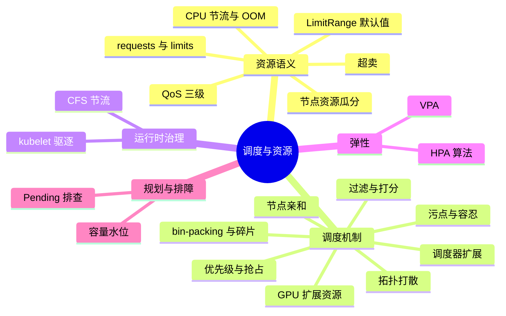
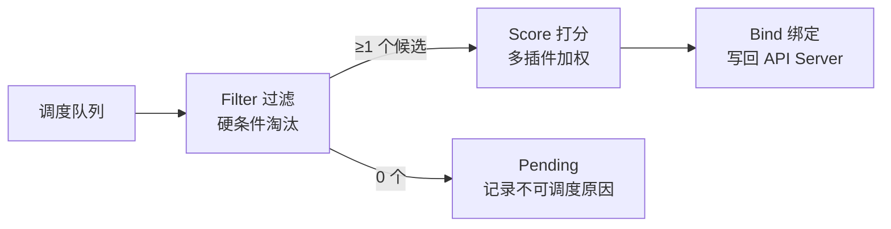
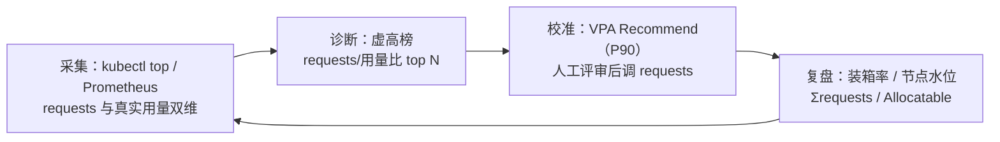

# K8s 调度与资源管理快问快答（21 题）

理论底座见 [[02-工作负载/01-核心工作负载/23-resource-management.md|资源管理详解]]，调度器专题见 [[02-工作负载/01-核心工作负载/19-scheduler-configuration.md|调度器配置与扩展]]。本文体例同网络/存储/Deployment 快问快答：先遮住答案口述，再对照关键词补全，最后沿"深挖"链接回语料源文件精读。

---

## 话题覆盖清单

| 题号 | 话题域 | 核心考点 |
|------|--------|---------|
| 1 | requests/limits 语义 | 调度用 requests，运行时限流/杀进程按 limits |
| 2 | CPU vs 内存 limits | 可压缩节流 vs 不可压缩 OOM |
| 3 | QoS 三级 | Guaranteed/Burstable/BestEffort 判定 |
| 4 | OOMKill 顺序 | oom_score_adj 按 QoS 分层 |
| 5 | 节点资源瓜分 | Allocatable = Capacity - 预留 |
| 6 | 超卖 | CPU 可超卖、内存谨慎超卖 |
| 7 | 调度两阶段 | 过滤 + 打分（scheduler framework） |
| 8 | 节点亲和 | nodeSelector、required/preferred affinity |
| 9 | 污点容忍 | 三种 effect 与驱逐语义 |
| 10 | 拓扑打散 | pod 反亲和 vs topologySpreadConstraints |
| 11 | Pending 排查 | Insufficient/Taint/Affinity 三类 |
| 12 | 优先级与抢占 | PriorityClass、抢占牺牲者选择 |
| 13 | kubelet 驱逐 | 软/硬阈值、驱逐排序 |
| 14 | CFS 节流 | limit 配小引发的延迟毛刺 |
| 15 | HPA 算法 | 目标值公式、指标来源、稳定窗 |
| 16 | VPA | 请求推荐模式、与 HPA 的正交关系 |
| 17 | 资源碎片 | bin-packing 打分策略 |
| 18 | GPU 扩展资源 | device plugin、整卡分配 |
| 19 | 调度器扩展 | framework 插件点、多调度器 |
| 20 | 容量规划 | 水位线、requests 与真实用量差治理 |
| 21 | LimitRange | 命名空间级资源默认值与上下限 |

**知识地图**：21 题归并为五大板块——答题先定位板块，再展开考点。



---

### 1. requests 和 limits 分别是什么？调度器、kubelet 各用哪个？

> **一句话**：requests 是"调度承诺"（scheduler 按它选节点、kubelet 按它算 cgroup 权重），limits 是"运行上限"（CPU 用 CFS 节流、内存超了被 OOMKill）。

| 字段 | 谁消费 | 效果 |
|------|--------|------|
| requests.cpu | 调度器（节点剩余可分配 = Allocatable - Σrequests） | 决定 Pod 能放哪 |
| requests.cpu | kubelet | cgroup cpu.shares 权重（CPU 争抢时的相对份额） |
| limits.cpu | CFS 带宽控制 | 硬上限，超了被节流（throttle），不杀进程 |
| requests.memory | 调度器 + kubelet | 内存权重（不做预留语义的隔离） |
| limits.memory | 内核 OOM killer / cgroup | 硬上限，超了进程被杀（OOMKilled, exit 137） |

**口诀**：requests 管调度与争抢权重，limits 管上限与生死。只设 limits 不设 requests 时 requests 自动等于 limits（Guaranteed 效果）。

深挖：[[02-工作负载/01-核心工作负载/23-resource-management.md|资源管理详解]]

### 2. CPU limit 超了和内存 limit 超了分别发生什么？为什么行为完全不同？

> **一句话**：CPU 是可压缩资源——超限被 CFS 节流（变慢不死）；内存不可压缩——超限直接 OOMKill，两者行为差异来自内核能否回收该资源。

**CPU 节流**：CFS 带宽控制按周期（默认 100ms）分配配额，用完即强制休眠到下个周期——进程活着但延迟抖动。**内存 OOM**：cgroup 内存（含 page cache 计入）超 limit 触发内核 OOM killer 杀该 cgroup 内 oom_score_adj 最高的进程——容器退出码 137。**面试落点**：这解释了两个生产现象——① CPU 密集应用设小 limit 后 P99 毛刺（第 14 题 CFS）；② 内存 limit 是"死刑线"，预留 buffer 必须按 OOM 风险算，不是按 CPU 抖动算。

### 3. QoS 三个等级怎么划分？分别决定什么？

> **一句话**：Guaranteed（全容器每资源 requests==limits）、Burstable（至少一项设置但未全等）、BestEffort（什么都不设）；QoS 决定 OOM 顺序与驱逐顺序的优先级。

| QoS | 判定条件 | oom_score_adj | 驱逐顺序 |
|-----|---------|---------------|---------|
| Guaranteed | 所有容器 cpu+memory 的 requests==limits | -997（最保命） | 最后 |
| Burstable | 设了 requests 或 limits，但未全等 | 按 requests 与节点容量比例（介于两者） | 中间 |
| BestEffort | requests/limits 全不设 | 1000（最先被杀） | 最先 |

**经典追问**：为什么生产建议关键服务设满 requests+limits？——不只是防超卖，更是 QoS 分层：节点内存紧张时 BestEffort 和低 requests 的 Burstable 先被 OOM/驱逐，Guaranteed 的核心服务活得最久。

### 4. 节点内存紧张时谁先被杀？OOM killer 的选择逻辑是什么？

> **一句话**：内核在超限的 cgroup 内、或节点级 OOM 时按 oom_score_adj 全局排序杀——BestEffort（adj=1000）最先，Guaranteed（adj=-997）几乎最后，同等级内谁用超 requests 最多谁先死。

**两层机制**：① 容器超自身 limit → 该 cgroup 内 OOM，杀的只是该 Pod 内的进程；② 节点整机内存耗尽 → kubelet 先行驱逐（软阈值）或内核节点级 OOM killer 按 `oom_score_adj` 选牺牲者。**Burstable 的细节**：kubelet 按 `max(100, min(999, 1000 − 1000 × memoryRequest / 节点内存容量))` 计算 adj——requests 占节点容量比例越大越保命，区间锁定在 [100, 999]；使用量超过 requests 的进程被内核额外加分（更先杀）。这就是"不设 requests 的 Pod 在节点紧张时最先陪葬"的原理。

### 5. 节点的 64G 内存，Pod 实际能分到多少？Allocatable 怎么算？

> **一句话**：Allocatable = Capacity − kube-reserved − system-reserved − eviction-threshold（≈硬驱逐阈值），剩下的才是调度器眼里的可分配量。

```text
Capacity        64Gi                          # 节点物理总量
- kube-reserved  1Gi                           # kubelet/容器运行时自身
- system-reserved 1Gi                          # sshd/内核等系统进程
- 硬驱逐阈值      1Gi（默认约 100Mi~数Gi）        # nodefs/memory.available
= Allocatable   61Gi                           # ΣPod requests 的上限
```

**为什么关心**：① 不做预留时，系统进程与 Pod 争内存，节点紧张时 sshd 都可能被 OOM——生产节点必须配预留；② `kubectl describe node` 的 Allocated resources 就是 Σrequests 视角的占用，与真实用量（kubectl top）是两个维度（第 20 题）。

深挖：[[01-集群基础/03-控制平面/37-kubelet-eviction-thresholds.md|kubelet 驱逐阈值]]

### 6. 什么是超卖（overcommit）？为什么 CPU 可以大胆超卖、内存要小心？

> **一句话**：Σlimits（甚至 Σrequests 相对真实用量）大于节点物理量即超卖；CPU 可压缩超了只是变慢，内存不可压缩超了就是 OOM 连环杀——内存超卖率必须受控。

**实践口径**：CPU 常按"requests ≈ 真实用量 P50，limits 放开或 2-4 倍"提升装箱率；内存要么 requests==limits（核心服务），要么超卖率控制在 1.2 倍以内并保留驱逐缓冲。**面试落点**：超卖是把双刃剑——不超卖则装箱率低成本高，乱超卖则节点 OOM 风暴；QoS 分层（第 3 题）+ 驱逐阈值（第 13 题）就是官方给的安全阀。

### 7. 调度器把 Pod 放到节点，中间经历哪两步？打分都看什么？

> **一句话**：过滤（Filter）淘汰不满足硬条件的节点，打分（Score）在幸存者里按权重选最优，最终绑定（Bind）写回 API。

**过滤维度**：资源够不够（requests）、端口冲突、nodeSelector/亲和硬条件、污点容忍、拓扑约束、卷拓扑/容量、PVC 绑定状态。**打分维度**（各插件 0-100 分加权）：资源均衡（BalancedAllocation）、装箱率（NodeResourcesFit 的 Least/Most 两种策略）、亲和软条件（preferred）、Pod 反亲和/打散、镜像本地性（ImageLocality）、污点容忍度（TaintToleration）。**v1.18+ 的统一框架**：老的 predicates/priorities 已演进为 Scheduler Framework 的扩展点（第 19 题）。



深挖：[[02-工作负载/01-核心工作负载/19-scheduler-configuration.md|调度器配置与扩展]]

### 8. nodeSelector、nodeAffinity 的 required 与 preferred 差在哪？怎么组合用？

> **一句话**：nodeSelector 是简单的标签等值匹配；nodeAffinity 提供 required（硬，过滤阶段）与 preferred（软，打分阶段，带权重）两级——硬条件定"能不能去"，软条件定"更想去"。

```yaml
affinity:
  nodeAffinity:
    requiredDuringSchedulingIgnoredDuringExecution:   # 硬：不满足永不调度
      nodeSelectorTerms:
      - matchExpressions:
        - {key: node-type, operator: In, values: [compute]}
    preferredDuringSchedulingIgnoredDuringExecution:  # 软：加分项，带权重 1-100
      - weight: 80
        preference:
          matchExpressions:
          - {key: zone, operator: In, values: [cn-hangzhou-a]}
```

**IgnoredDuringExecution 的含义**：调度后节点标签变了不迁移——"已运行不追溯"。要重新评估得靠重新调度（descheduler）。

### 9. 污点与容忍的三种 effect 各是什么？NoExecute 会驱逐存量 Pod 吗？

> **一句话**：NoSchedule 只挡新调度、PreferNoSchedule 尽量挡、NoExecute 挡新且驱逐不容忍的存量 Pod——节点维护常用 NoExecute + tolerationSeconds 宽限。

| effect | 对新 Pod | 对存量 Pod |
|--------|---------|-----------|
| NoSchedule | 拒绝 | 不影响 |
| PreferNoSchedule | 尽量避开（打分惩罚） | 不影响 |
| NoExecute | 拒绝 | **驱逐**无容忍的 Pod |

**三个内置污点**：`node.kubernetes.io/not-ready`、`unreachable`（节点失联，NoExecute，默认容忍 300s——这就是"节点失联 5 分钟后 Pod 才被驱逐重排"的来源）、`unschedulable`（cordon，NoSchedule）。**tolerationSeconds**：`tolerations: [{key: x, effect: NoExecute, tolerationSeconds: 60}]` 表示打污点后最多再留 60 秒——优雅撤离的节流阀。

### 10. Pod 反亲和和 topologySpreadConstraints 都能"打散"，差别在哪？

> **一句话**：反亲和是"同一个拓扑域内不能共存的硬/软约束"（成对关系），拓扑打散是"各拓扑域副本数偏差不超过 maxSkew"（分布均匀性）——表达力与语义不同，打散更接近均匀分布的目标。

```yaml
topologySpreadConstraints:
- maxSkew: 1
  topologyKey: topology.kubernetes.io/zone
  whenUnsatisfiable: DoNotSchedule   # 或 ScheduleAnyway
  labelSelector: {matchLabels: {app: web}}
```

**对比**：`podAntiAffinity` 说"A 和 B 别在一个 zone"，副本多时表达繁琐（每对都要算）；`maxSkew: 1` 说"zone 之间副本数最多差 1"——一条约束覆盖任意副本数。**坑**：`whenUnsatisfiable: DoNotSchedule` + 某域故障时可能无域可放；`minDomains`（v1.24+）用来在域减少时保持均匀语义。

### 11. Pod 一直 Pending，按什么思路排查？

> **一句话**：`describe pod` 看 FailedScheduling 消息，按"资源不足 / 污点不匹配 / 亲和性矛盾 / 拓扑约束无解"四类对号入座。

```text
kubectl describe pod → Events: FailedScheduling
  ├─ "Insufficient cpu"        → 节点 Σrequests 已满：调小 requests / 加节点 / 找大节点
  ├─ "node(s) had taint"       → 污点未容忍：加 tolerations 或去掉污点
  ├─ "node(s) didn't match"    → 亲和/选择器无解：核对标签拼写与取值
  ├─ "node(s) exceed max volume count" / 卷拓扑 → 存储约束（见存储域）
  └─ "unsatisfiable spread"    → 拓扑打散无解：放宽 maxSkew / whenUnsatisfiable
```

**进阶**：`kubectl get pod -o yaml | grep -A5 schedulerName` 确认走对了调度器；自定义调度器故障时 Pod 永远 Pending；`scheduler` 的 `kubectl get events --field-selector reason=FailedScheduling -A` 全局扫描。

### 12. Pod 优先级和抢占怎么工作？抢占会牺牲谁？

> **一句话**：PriorityClass 给 Pod 排座次；高优 Pod 放不进集群时调度器触发抢占——删除低优 Pod 腾出资源，牺牲者按"优先级最低、尽量少干扰"原则挑选。

**机制要点**：① `priorityClassName` 引用 PriorityClass（`value` 越大越优先，`globalDefault` 兜底）；② 抢占是**调度器的模拟决策**：先虚拟删除候选受害者 → 验证高优 Pod 能放下 → 真删除再调度；③ 受害者约束：只抢**优先级更低**的 Pod；④ 驱逐走优雅终止（grace period），不是秒杀——高优 Pod 上线有延迟；⑤ 关键组件（如 kube-system 核心）用高 PriorityClass 防被业务挤死。

### 13. kubelet 的驱逐有哪些阈值？节点紧张时按什么顺序驱逐？

> **一句话**：硬阈值（memory.available<100Mi 等不可违反）立即驱逐，软阈值（memory.available<1.5Gi）宽限期后驱逐；排序按"资源真实使用量超 requests 的程度 + 优先级 + QoS"综合。

**触发条件**：memory.available、nodefs/imagefs available、pid.available 等；软阈值配 `eviction-soft-grace-period` + `eviction-max-pod-grace-period`。**驱逐排序**：先看资源是否超 requests（超得越多越先）、再比 PriorityClass、最后 QoS（BestEffort 先走）。**与第 4 题的分工**：Pod 超自身 limit → cgroup OOM；节点资源枯竭 → kubelet 驱逐（优雅）→ 兜不住才内核 OOM（粗暴）。

深挖：[[01-集群基础/03-控制平面/37-kubelet-eviction-thresholds.md|kubelet 驱逐阈值]]

### 14. CPU limit 配小了为什么会有延迟毛刺？CFS 节流的原理是什么？

> **一句话**：CFS 按 100ms 周期给配额，多线程应用一瞬把配额用光，整周期内所有线程被暂停——单核 limit 的 Java/Go 应用常出现"平均利用率不高但 P99 很差"。

**机制**：`limits.cpu: 1` = 每 100ms 最多用 100ms CPU 时间；8 个工作线程并发时配额瞬间耗尽，`nr_throttled` 上升、剩余 ~70ms 全员冻结。**实践口径**：① CPU 密集 + 延迟敏感服务放宽或去掉 limit（依赖 requests 做公平调度）；② 保留 limit 时按"峰值并发线程数"估算，别按均值；③ 观察 `container_cpu_cfs_throttled_periods_total` 指标定位节流。**权衡**：去 limit 的风险是失控进程吃满节点——靠 requests + 节点隔离/独立节点池兜底。

### 15. HPA 的扩缩容算法是什么？指标从哪来？

> **一句话**：`期望副本 = ceil(当前副本 × 当前指标 / 目标指标)`；指标来自 metrics-server 聚合的资源利用率或自定义/外部指标 API，且有稳定窗与容忍度防抖。

**例子**：当前 4 副本、CPU 利用率 80%、目标 50% → `ceil(4 × 80/50) = 7` 副本。**防抖细节**：① 容忍度（默认 10%，比例变化小于 10% 不动）；② 扩容即时、缩容有稳定窗（默认 5 分钟）；③ 指标缺失时保守处理（扩容跳过、缩容跳过）；④ 多指标取"各指标算出的最大副本数"。**指标链路**：kubelet cAdvisor → metrics-server（资源指标）→ HPA；自定义指标走 adapter（Prometheus Adapter/KEDA）。

深挖：[[02-工作负载/01-核心工作负载/21-hpa-vpa-autoscaling.md|HPA/VPA 自动扩缩]]

### 16. VPA 和 HPA 有什么区别？为什么同一维度不能同时开？

> **一句话**：HPA 调副本数（横向）、VPA 调 requests/limits（纵向）；两者同管一个资源维度会互相打架（VPA 改 requests → HPA 算出的副本数失真）——正交组合才是正解（如 VPA 管内存、HPA 管 CPU）。

| 维度 | HPA | VPA |
|------|-----|-----|
| 调整对象 | replicas | Pod 资源 requests/limits |
| 生效方式 | 平滑扩缩 | 重建 Pod（推荐模式 Off/Auto 演进） |
| 指标 | 利用率/自定义指标 | 历史用量分布推荐（P90 等） |
| 典型用法 | 流量型负载 | 基线校准（Recommend 模式先观察再落地） |

**面试落点**：VPA 的 `updateMode: "Off"` 只出建议不动作——生产常用它校准 requests，治"资源申请虚高"（第 20 题），比直接在线改更稳。

### 17. 资源碎片是什么？bin-packing 打分怎么影响装箱率？

> **一句话**：碎片 = 各节点剩余零散资源放不下任何 Pod；打分策略选 Most（装箱优先，节点用到接近满再开新节点）还是 Least（均衡优先，负载摊开）直接决定碎片率与故障域。

| 策略 | 行为 | 后果 |
|------|------|------|
| LeastAllocated（默认） | 优先放剩余多的节点 | 负载均衡，但处处半满、碎片多 |
| MostAllocated | 优先放剩余少的节点 | 装箱率高、成本低，但故障域大、弹性余量小 |

**取舍**：成本敏感的批处理集群用 Most + 节点自动伸缩；延迟敏感的在线服务用默认均衡；混合场景用节点池分而治之。深挖：[[02-工作负载/01-核心工作负载/22-cluster-capacity-planning.md|集群容量规划]]

### 18. GPU 怎么调度？为什么默认一个 Pod 独占整卡？

> **一句话**：GPU 经 device plugin 上报为扩展资源（`nvidia.com/gpu`），requests 必须等于 limits 且只支持整卡——扩展资源不做超卖、不做分片；分卡/分片要 MIG 或第三方虚拟化方案。

**链路**：节点装 NVIDIA 驱动 + nvidia device plugin（DaemonSet）→ 上报 `nvidia.com/gpu: 8` → Pod `resources.limits: {nvidia.com/gpu: 1}` 调度器按扩展资源过滤 → kubelet 把设备文件/驱动目录注入容器。**要点**：① 扩展资源只有 limits 概念，requests 自动等于 limits；② 调度不感知卡间拓扑（NVLink）——Topology-aware 分配要 Volcano/Kueue 等批调度器；③ AI 训练场景"卡等调度"常见坑：单 Pod 要 4 卡而所有节点只剩 2 卡，永远 Pending（第 11 题的 GPU 变体）。

### 19. 调度器框架有哪些扩展点？什么时候需要自定义调度器？

> **一句话**：Scheduler Framework 在调度生命周期预埋扩展点（QueueSort/Filter/Score/Reserve/Permit/Bind 等），用插件注入自定义逻辑；单一逻辑差异用插件，整体行为不同才 clone 出第二调度器（`schedulerName` 隔离）。

**常见扩展动机**：批处理场景gang 调度（成组调度，Volcano 基于框架实现）、GPU 拓扑感知打分、NUMA 亲和、跨集群配额。**多调度器**：Pod `spec.schedulerName: my-scheduler` 指定，默认 `default-scheduler`——两个调度器并存时注意互不认领对方 Pending 的 Pod。深挖：[[02-工作负载/01-核心工作负载/19-scheduler-configuration.md|调度器配置与扩展]]

### 20. 资源利用率低（requests 虚高）怎么治理？容量水位怎么定？

> **一句话**：用"requests vs 真实用量"的差值定位虚高（VPA Recommend 出校准值、按 P50/P95 重算 requests），容量水位按"Σrequests/Allocatable"与"真实用量/容量"双线管理，在线服务留 30-40% 弹性余量。

**治理闭环**：



**两条水位线**：① 请求水位（Σrequests/Allocatable）反映装箱上限，85% 是扩容警戒线；② 用量水位（真实负载/容量）反映真实风险，决定 HPA 与节点弹性。两个数字背离越大 = 资源浪费越大。深挖：[[02-工作负载/01-核心工作负载/22-cluster-capacity-planning.md|集群容量规划]]

### 21. LimitRange 解决什么问题？和 ResourceQuota 怎么分工？

> **一句话**：LimitRange 管单个容器/Pod 的资源默认值与上下限（准入时注入与校验），ResourceQuota 管命名空间总量配额——一个管个体规格，一个管集体总额。

| 对象 | 管什么 | 生效层 |
|------|--------|--------|
| LimitRange | 容器/Pod 级：default（未声明时注入）、min/max（超限拒绝）、maxLimitRequestRatio | 准入（LimitRanger 插件） |
| ResourceQuota | 命名空间级：Σrequests/Σlimits 总额、对象数量（Pod 数/Service 数） | 准入（校验后拒绝） |

**要点**：① 未设 requests/limits 的 Pod 若所在 NS 有带 `default` 的 LimitRange，会被自动注入——这直接改变 QoS 分级（注入后不再是 BestEffort）；② 有 LimitRange 但 Pod 显式声明超限 → 创建被拒（`Forbidden: maximum cpu usage per Container is ...`）；③ 两者组合是"多租户资源治理"的标准配置：Quota 防总量失控、LimitRange 防单个 Pod 失控。

深挖：[[02-工作负载/01-核心工作负载/23-resource-management.md|资源管理详解]]

---

## 面试官追问模拟（追问链）

**场景**：值班发现"节点利用率不到 30%，但业务 Pod 一直 Pending"。

- **追问 1：第一步看什么？**——`kubectl describe pod` 读 FailedScheduling 原话；是 `Insufficient cpu/memory` 还是污点/亲和问题，方向完全不同。
- **追问 2：利用率 30% 怎么还会 Insufficient cpu？**——调度看 **requests** 不看真实用量：`Σrequests` 已把节点 Allocatable 占满（describe node 的 Allocated resources）；30% 是用量视角，两个维度（第 1、5 题）。
- **追问 3：为什么 requests 会虚高到这个程度？**——历史上按峰值拍脑袋申请、无 LimitRange 注入兜底、无人治理；用 VPA Recommend（P90）算出真实基线（第 16、20 题）。
- **追问 4：除了调 requests 还有什么解？**——按 MostAllocated 打分提升装箱（第 17 题）、为该业务单独节点池、临时加节点；但先修 requests 再谈加资源，否则浪费固化为常态。
- **追问 5：怎么防复发？**——LimitRange 设 default/min/max（第 21 题）+ 双水位监控告警（请求水位 85% 警戒）+ 定期虚高榜复盘进容量治理闭环。

---

## 速答速记表（21 题一句话版）

复习用：遮住答案，只看"一句话答案"列口述展开，再对照"记忆钩子"自检。

| 题号 | 一句话答案 | 记忆钩子 |
|------|-----------|---------|
| 1 | requests 管调度与权重，limits 管上限与生死 | 承诺与红线 |
| 2 | CPU 可压缩节流变慢，内存不可压缩直接 OOMKill | 压不压缩 |
| 3 | 全等 Guaranteed / 部分设置 Burstable / 全不设 BestEffort | 三档分层 |
| 4 | oom_score_adj 按 QoS 分层：BestEffort 先死，同等级用量超 requests 者先死 | adj 定生死 |
| 5 | Allocatable = Capacity − kube/system 预留 − 驱逐阈值 | 先扣再分 |
| 6 | Σlimits > 物理量即超卖；CPU 敢超、内存控制超卖率 | 双刃剑 |
| 7 | 过滤淘汰 + 打分加权 + 绑定；打分看均衡/装箱/亲和/镜像 | 两步一场 |
| 8 | required 定能不能去，preferred 定更想去；Ignored 不追溯 | 硬软两级 |
| 9 | NoSchedule 挡新、Prefer 尽量挡、NoExecute 连存量一起驱逐 | 三档 effect |
| 10 | 反亲和管"不能共存"，打散管"分布均匀"（maxSkew） | 成对 vs 均匀 |
| 11 | Pending 四因：资源/污点/亲和/拓扑；describe 看 FailedScheduling 原话 | 四类对号 |
| 12 | 高优放不下触发抢占，只杀更低优先级，走优雅终止 | 座次决定牺牲 |
| 13 | 硬阈值立即驱逐、软阈值宽限后；按超 requests 程度 + 优先级 + QoS 排序 | 硬软两闸 |
| 14 | CFS 100ms 周期配额用光全员冻结；盯 throttled 指标，按峰值配 | 毛刺元凶 |
| 15 | 期望副本 = ceil(副本 × 当前/目标)；容忍度 + 缩容稳定窗防抖 | 比例公式 |
| 16 | HPA 横向调副本、VPA 纵向调 requests；同维度互斥，正交才共存 | 横纵正交 |
| 17 | Most 装箱省成本、Least 均衡保弹性；碎片率是代价 | Most 省钱 Least 稳 |
| 18 | GPU 是扩展资源整卡独占、不超卖；分卡要 MIG/批调度器 | 扩展资源整卡 |
| 19 | Framework 扩展点注插件；单点差异用插件、整体不同开第二调度器 | 插件优先 |
| 20 | requests 虚高用 VPA 校准；请求水位与用量水位双线管理 | 双水位治虚高 |
| 21 | LimitRange 管个体默认值与上下限，ResourceQuota 管 NS 总额；default 注入会改变 QoS | 个体与总额 |

---

## 自练检查清单

- 能否 60 秒讲清 requests/limits 在"调度、争抢、限流、OOM"四个环节各扮演什么（第 1-4 题）？
- "P99 毛刺 + CPU 利用率不高"能否条件反射想到 CFS 节流（第 14 题）？
- 节点失联 5 分钟驱逐、OOM 排序、驱逐阈值三件事能否串成一条线（第 4、9、13 题）？
- 滚动更新时 maxUnavailable 与 QoS/驱逐顺序的联动能说明白吗？
- HPA 公式能否现场推导一个例子，并说出防抖三件套？
- LimitRange 与 ResourceQuota 的分工、default 注入对 QoS 的影响能否讲清（第 21 题）？
- "集群利用率 20% 但 Pod 调不进去"这种矛盾现象能否用双水位 + 碎片解释（第 17、20 题）？追问链"低利用率 Pending"能否完整走一遍？

---

## 相关链接

- [[02-工作负载/01-核心工作负载/23-resource-management.md|资源管理详解]]
- [[02-工作负载/01-核心工作负载/19-scheduler-configuration.md|调度器配置与扩展]]
- [[02-工作负载/01-核心工作负载/21-hpa-vpa-autoscaling.md|HPA/VPA 自动扩缩]]
- [[02-工作负载/01-核心工作负载/22-cluster-capacity-planning.md|集群容量规划]]
- [[02-工作负载/01-核心工作负载/07-workload-troubleshooting-handbook.md|工作负载排障手册]]
- [[01-集群基础/03-控制平面/37-kubelet-eviction-thresholds.md|kubelet 驱逐阈值]]
- [[01-集群基础/03-控制平面/40-node-maintenance-cordon-drain-shutdown.md|节点维护 cordon/drain]]
- [[02-工作负载/01-核心工作负载/26-kubernetes-deployment-quick-qa.md|K8s Deployment 快问快答]]
- [[02-工作负载/01-核心工作负载/11-pod-lifecycle-events.md|Pod 生命周期事件]]
