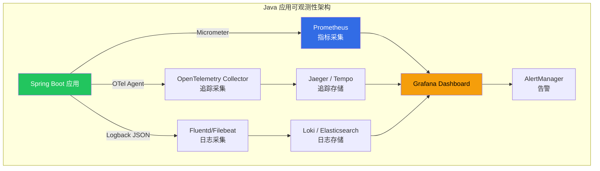

> **生产环境安全提示**
>
> 本文档包含可直接执行的运维命令。执行前请确认：当前目标集群与 Namespace 是否正确；是否具备足够的 RBAC 权限；是否已在非生产环境验证。命令风险等级标注：🔴 高风险（可能造成数据丢失或服务中断）、🟡 中风险（会修改集群状态，但通常可回滚）、🟢 低风险/只读（信息收集，无副作用）。


# Java 可观测性 on [[kubernetes|Kubernetes]] 实践指南

> **适用版本**: JDK 17+ / Spring Boot 3.x / [[opentelemetry|OpenTelemetry]] 2.x / [[prometheus|Prometheus]] 2.x / Grafana 10.x / Kubernetes v1.28+
> **最后更新**: 2026-04-30

---

## 一、概述

可观测性（Observability）是生产环境 Java 应用的生命线。在 Kubernetes 中，一个 Java 应用的可观测性由三大支柱构成：**Metrics（指标）**、**Traces（追踪）** 和 **Logs（日志）**。本指南提供在 Kubernetes 上为 Java 应用构建完整可观测性体系的实战方案，覆盖 OpenTelemetry Java Agent 自动注入、Micrometer + Prometheus 指标采集、结构化 JSON 日志、分布式追踪（W3C Trace Context）、JVM 运行时监控以及慢查询检测。

### 1.1 为什么 Java 应用需要专门的可观测性方案

| 维度 | Java 特殊性 | 影响 |
|------|-----------|------|
| JVM 运行时 | 堆/非堆/Metaspace/CodeCache/线程栈 | 需要专门的 JVM 指标 |
| GC 行为 | G1/ZGC/Shenandoah 各有不同的暂停模型 | 需要专门的 GC 指标和告警 |
| 线程模型 | 线程池/连接池/ForkJoinPool | 需要监控线程和连接池指标 |
| 启动时间 | 慢启动（2-5s）需要 startupProbe | 需要启动时间指标 |
| 内存模型 | 对象分配速率直接影响 GC 压力 | 需要分配速率指标 |



---

## 二、架构设计

### 2.1 三大支柱集成架构

```mermaid
graph LR
    subgraph "Pod 内部"
        INIT[OTel Init Container<br/>注入 Java Agent] --> |volume| MAIN[应用容器<br/>Spring Boot]
        MAIN --> |:8081/metrics| PROM_SCRAPE[Prometheus Scrape]
        MAIN --> |:8080 业务日志| STDOUT[stdout JSON]
        MAIN --> |:4317 OTLP gRPC| OTEL_SIDE[OTel Collector]
    end

    subgraph "集群服务"
        PROM_SCRAPE --> PROM_SERVER[Prometheus Server]
        STDOUT --> [[fluentd|FLUENTD]][Fluentd DaemonSet]
        OTEL_SIDE --> OTEL_COLLECTOR[OTel Collector Deployment]
    end

    subgraph "存储与可视化"
        PROM_SERVER --> MIMIR[Mimir / Thanos]
        FLUENTD --> LOKI[Loki]
        OTEL_COLLECTOR --> TEMPO[Tempo]
        MIMIR --> GRAFANA[Grafana]
        LOKI --> GRAFANA
        TEMPO --> GRAFANA
    end

    style INIT fill:#a855f7,color:#fff
    style MAIN fill:#22c55e,color:#fff
    style GRAFANA fill:#f59e0b,color:#000
```

### 2.2 信号关联模型

三大支柱通过 **Trace ID** 互相关联，实现从指标到日志到追踪的完整排查链路：

```
告警触发: JVM 堆使用率 > 90%
  → Grafana Dashboard 查看 GC 指标趋势
  → Logs (Grafana Loki) 按 trace_id 过滤相关日志
  → Traces (Tempo/Jaeger) 查看完整调用链
  → 定位到慢 SQL 查询
  → Metrics (Prometheus) 查看 DB 连接池指标
```

### 2.3 JVM 指标分类

| 类别 | 指标前缀 | 关键指标 | 采集方式 |
|------|---------|---------|---------|
| 堆内存 | `jvm_memory_` | used_bytes, max_bytes, committed_bytes | Micrometer |
| GC | `jvm_gc_` | pause_seconds, memory_promoted, live_data_size | Micrometer |
| 线程 | `jvm_threads_` | live, daemon, states, deadlock | Micrometer |
| 类加载 | `jvm_classes_` | loaded, unloaded | Micrometer |
| CPU | `process_cpu_` | usage, system_load_average | Micrometer |
| HTTP | `http_server_requests_` | seconds_count, seconds_sum, seconds_bucket | Micrometer |
| 数据库 | `hikaricp_` | connections_active, connections_idle, connections_pending | Micrometer |
| 自定义业务 | `orders_`, `products_` | 业务计数器/计时器/仪表 | Micrometer |
| JMX | `kafka_`, `tomcat_` | 第三方库 JMX 指标 | JMX Exporter |

---

## 三、核心配置

### 3.1 Spring Boot 可观测性依赖配置

```xml
<dependencies>
    <dependency>
        <groupId>org.springframework.boot</groupId>
        <artifactId>spring-boot-starter-web</artifactId>
    </dependency>
    <dependency>
        <groupId>org.springframework.boot</groupId>
        <artifactId>spring-boot-starter-actuator</artifactId>
    </dependency>
    <dependency>
        <groupId>org.springframework.boot</groupId>
        <artifactId>spring-boot-starter-data-jpa</artifactId>
    </dependency>
    <dependency>
        <groupId>io.micrometer</groupId>
        <artifactId>micrometer-registry-prometheus</artifactId>
    </dependency>
    <dependency>
        <groupId>io.micrometer</groupId>
        <artifactId>micrometer-tracing-bridge-otel</artifactId>
    </dependency>
    <dependency>
        <groupId>io.opentelemetry</groupId>
        <artifactId>opentelemetry-exporter-otlp</artifactId>
    </dependency>
    <dependency>
        <groupId>net.logstash.logback</groupId>
        <artifactId>logstash-logback-encoder</artifactId>
        <version>8.0</version>
    </dependency>
    <dependency>
        <groupId>io.micrometer</groupId>
        <artifactId>micrometer-registry-jmx</artifactId>
    </dependency>
</dependencies>
```

### 3.2 OpenTelemetry Java Agent 注入

#### 方式一：Init Container 自动注入（推荐，无需修改应用代码）

```yaml
apiVersion: apps/v1
kind: Deployment
metadata:
  name: myapp
  namespace: production
spec:
  replicas: 3
  selector:
    matchLabels:
      app: myapp
  template:
    metadata:
      labels:
        app: myapp
      annotations:
        instrumentation.opentelemetry.io/inject-java: "true"
    spec:
      initContainers:
        - name: copy-otel-agent
          image: ghcr.io/open-telemetry/opentelemetry/java-instrumentation:2.12.0
          command: ["cp", "/javaagent.jar", "/shared/javaagent.jar"]
          volumeMounts:
            - name: otel-agent
              mountPath: /shared
      containers:
        - name: myapp
          image: registry.example.com/myapp:1.0.0
          env:
            - name: JAVA_OPTS
              value: >-
                -XX:+UseContainerSupport
                -XX:MaxRAMPercentage=75.0
                -XX:+UseG1GC
                -javaagent:/otel/javaagent.jar
            - name: OTEL_SERVICE_NAME
              value: "myapp"
            - name: OTEL_EXPORTER_OTLP_ENDPOINT
              value: "http://otel-collector.observability:4317"
            - name: OTEL_EXPORTER_OTLP_PROTOCOL
              value: "grpc"
            - name: OTEL_RESOURCE_ATTRIBUTES
              value: >-
                service.name=myapp,
                service.namespace=production,
                deployment.environment=production,
                k8s.pod.name=$(POD_NAME),
                k8s.namespace.name=$(POD_NAMESPACE),
                k8s.node.name=$(NODE_NAME)
            - name: OTEL_TRACES_SAMPLER
              value: "parentbased_traceidratio"
            - name: OTEL_TRACES_SAMPLER_ARG
              value: "0.1"
            - name: OTEL_METRICS_EXPORTER
              value: "otlp"
            - name: OTEL_LOGS_EXPORTER
              value: "otlp"
            - name: OTEL_PROPAGATORS
              value: "tracecontext,baggage"
            - name: OTEL_INSTRUMENTATION_SPRING-MVC_ENABLED
              value: "true"
            - name: OTEL_INSTRUMENTATION_JDBC_ENABLED
              value: "true"
            - name: OTEL_INSTRUMENTATION_HIBERNATE_ENABLED
              value: "true"
            - name: OTEL_INSTRUMENTATION_REDIS_ENABLED
              value: "true"
            - name: OTEL_INSTRUMENTATION_KAFKA_ENABLED
              value: "true"
            - name: POD_NAME
              valueFrom:
                fieldRef:
                  fieldPath: metadata.name
            - name: POD_NAMESPACE
              valueFrom:
                fieldRef:
                  fieldPath: metadata.namespace
            - name: NODE_NAME
              valueFrom:
                fieldRef:
                  fieldPath: spec.nodeName
          volumeMounts:
            - name: otel-agent
              mountPath: /otel
      volumes:
        - name: otel-agent
          emptyDir: {}
```

#### 方式二：OpenTelemetry Operator 自动注入（最推荐）

```yaml
apiVersion: opentelemetry.io/v1alpha1
kind: Instrumentation
metadata:
  name: java-instrumentation
  namespace: observability
spec:
  exporter:
    endpoint: http://otel-collector.observability:4317
  propagators:
    - tracecontext
    - baggage
  sampler:
    type: parentbased_traceidratio
    argument: "0.1"
  resource:
    addK8sUIDAttributes: true
  java:
    image: ghcr.io/open-telemetry/opentelemetry/java-instrumentation:2.12.0
    env:
      - name: OTEL_EXPORTER_OTLP_PROTOCOL
        value: grpc
      - name: OTEL_METRICS_EXPORTER
        value: otlp
      - name: OTEL_LOGS_EXPORTER
        value: otlp
```

只需在 Deployment 上添加 annotation:

```yaml
metadata:
  annotations:
    instrumentation.opentelemetry.io/inject-java: "observability/java-instrumentation"
```

### 3.3 application.yml 完整可观测性配置

```yaml
spring:
  application:
    name: myapp
  main:
    banner-mode: off
  lifecycle:
    timeout-per-shutdown-phase: 30s

management:
  server:
    port: 8081
  endpoint:
    health:
      show-details: when-authorized
      probes:
        enabled: true
      group:
        readiness:
          include: readinessState, db, diskSpace, ping
        liveness:
          include: livenessState, ping
    metrics:
      enabled: true
    prometheus:
      enabled: true
    info:
      enabled: true
    env:
      show-values: never
    loggers:
      enabled: true
    threaddump:
      enabled: true
    headdump:
      enabled: false
  endpoints:
    web:
      exposure:
        include: health,info,prometheus,metrics,loggers
      base-path: /actuator
  metrics:
    tags:
      application: ${spring.application.name}
      namespace: ${KUBERNETES_NAMESPACE:default}
      pod: ${POD_NAME:unknown}
    distribution:
      percentiles-histogram:
        http.server.requests: true
        jdbc.execute: true
        hikaricp.connections.acquire: true
        spring.data.repository.invocations: true
      slo:
        http.server.requests: 50ms,100ms,200ms,500ms,1000ms,2000ms
      percentiles:
        http.server.requests: 0.5,0.9,0.95,0.99
    export:
      prometheus:
        enabled: true
        step: 30s
    enable:
      jvm: true
      process: true
      system: true
      tomcat: true
      hikaricp: true
      jdbc: true
      logback: true
      http: true
  tracing:
    sampling:
      probability: 1.0
    propagation:
      type: w3c
    baggage:
      remote-fields:
        - x-request-id
        - x-tenant-id
      correlation:
        enabled: true
  observations:
    key-values:
      application: ${spring.application.name}

logging:
  level:
    root: INFO
    com.example: DEBUG
    org.springframework.web: DEBUG
    org.hibernate.SQL: WARN
    org.hibernate.type.descriptor.sql.BasicBinder: TRACE
```

### 3.4 自定义业务指标配置类

```java
package com.example.config;

import io.micrometer.core.instrument.MeterRegistry;
import io.micrometer.core.instrument.binder.jvm.JvmGcMetrics;
import io.micrometer.core.instrument.binder.jvm.JvmHeapPressureMetrics;
import io.micrometer.core.instrument.binder.jvm.JvmMemoryMetrics;
import io.micrometer.core.instrument.binder.system.ProcessorMetrics;
import io.micrometer.core.instrument.config.MeterFilter;
import org.springframework.boot.actuate.autoconfigure.metrics.MeterRegistryCustomizer;
import org.springframework.context.annotation.Bean;
import org.springframework.context.annotation.Configuration;

@Configuration
public class ObservabilityConfig {

    @Bean
    public MeterRegistryCustomizer<MeterRegistry> commonTags() {
        return registry -> registry.config()
            .commonTags(
                "application", "myapp",
                "namespace", System.getenv().getOrDefault("POD_NAMESPACE", "default"),
                "pod", System.getenv().getOrDefault("POD_NAME", "unknown"),
                "node", System.getenv().getOrDefault("NODE_NAME", "unknown")
            )
            .meterFilter(MeterFilter.deny(id ->
                id.getName().startsWith("jvm.gc") &&
                id.getTag("cause") != null &&
                "No GC".equals(id.getTag("cause"))
            ))
            .meterFilter(MeterFilter.deny(id ->
                id.getName().startsWith("tomcat.") &&
                id.getName().contains("request")
            ));
    }

    @Bean
    public JvmMemoryMetrics jvmMemoryMetrics() {
        return new JvmMemoryMetrics();
    }

    @Bean
    public JvmGcMetrics jvmGcMetrics() {
        return new JvmGcMetrics();
    }

    @Bean
    public JvmHeapPressureMetrics jvmHeapPressureMetrics() {
        return new JvmHeapPressureMetrics();
    }

    @Bean
    public ProcessorMetrics processorMetrics() {
        return new ProcessorMetrics();
    }
}
```

### 3.5 完整业务指标服务类

```java
package com.example.service;

import io.micrometer.core.instrument.*;
import io.micrometer.tracing.Span;
import io.micrometer.tracing.Tracer;
import org.slf4j.Logger;
import org.slf4j.LoggerFactory;
import org.springframework.stereotype.Service;

import java.util.concurrent.TimeUnit;
import java.util.concurrent.atomic.AtomicInteger;

@Service
public class OrderService {

    private static final Logger log = LoggerFactory.getLogger(OrderService.class);

    private final Counter orderCreatedCounter;
    private final Counter orderFailedCounter;
    private final Timer orderProcessingTimer;
    private final Timer orderDbTimer;
    private final Gauge activeOrdersGauge;
    private final DistributionSummary orderValueSummary;
    private final AtomicInteger activeOrders;
    private final Tracer tracer;

    public OrderService(MeterRegistry registry, Tracer tracer) {
        this.tracer = tracer;
        this.activeOrders = new AtomicInteger(0);

        this.orderCreatedCounter = Counter.builder("orders.created.total")
            .description("Total number of orders created")
            .tag("type", "standard")
            .register(registry);

        this.orderFailedCounter = Counter.builder("orders.failed.total")
            .description("Total number of failed orders")
            .tag("type", "standard")
            .register(registry);

        this.orderProcessingTimer = Timer.builder("orders.processing.duration")
            .description("Order processing duration")
            .publishPercentiles(0.5, 0.9, 0.95, 0.99)
            .publishPercentileHistogram()
            .serviceLevelObjectives(
                java.time.Duration.ofMillis(100),
                java.time.Duration.ofMillis(250),
                java.time.Duration.ofMillis(500),
                java.time.Duration.ofSeconds(1)
            )
            .register(registry);

        this.orderDbTimer = Timer.builder("orders.db.duration")
            .description("Database operation duration for orders")
            .tag("operation", "save")
            .publishPercentiles(0.5, 0.9, 0.95, 0.99)
            .register(registry);

        this.activeOrdersGauge = Gauge.builder("orders.active", activeOrders, AtomicInteger::get)
            .description("Number of currently active orders being processed")
            .register(registry);

        this.orderValueSummary = DistributionSummary.builder("orders.value")
            .description("Distribution of order values")
            .baseUnit("dollars")
            .publishPercentiles(0.5, 0.9, 0.95, 0.99)
            .serviceLevelObjectives(50, 100, 500, 1000)
            .register(registry);
    }

    @io.micrometer.core.annotation.Timed(value = "orders.create", description = "Create order time")
    @io.micrometer.core.annotation.Counted(value = "orders.create.count", description = "Create order count")
    public Order createOrder(OrderRequest request) {
        Span span = tracer.nextSpan().name("create-order").start();
        try (Tracer.SpanInScope scope = tracer.withSpan(span)) {
            span.event("order-received");
            span.tag("customer.id", request.getCustomerId());
            span.tag("item.count", String.valueOf(request.getItems().size()));

            activeOrders.incrementAndGet();
            orderCreatedCounter.increment();
            orderValueSummary.record(request.getTotalAmount());

            log.info("Creating order for customer: {}, items: {}, total: {}",
                request.getCustomerId(), request.getItems().size(), request.getTotalAmount());

            Order order = orderProcessingTimer.record(() -> processOrder(request, span));

            span.event("order-completed");
            log.info("Order created: id={}, customer={}", order.getId(), order.getCustomerId());
            return order;
        } catch (Exception e) {
            orderFailedCounter.increment();
            span.recordException(e);
            log.error("Failed to create order for customer: {}", request.getCustomerId(), e);
            throw e;
        } finally {
            activeOrders.decrementAndGet();
            span.end();
        }
    }

    private Order processOrder(OrderRequest request, Span parentSpan) {
        Span dbSpan = tracer.nextSpan().name("save-order-db").parent(parentSpan).start();
        try (Tracer.SpanInScope scope = tracer.withSpan(dbSpan)) {
            dbSpan.tag("db.operation", "INSERT");
            dbSpan.tag("db.table", "orders");

            return orderDbTimer.record(() -> {
                Order order = new Order();
                order.setCustomerId(request.getCustomerId());
                order.setItems(request.getItems());
                order.setTotalAmount(request.getTotalAmount());
                order.setStatus("CREATED");
                return order;
            });
        } finally {
            dbSpan.end();
        }
    }
}
```

### 3.6 Prometheus ServiceMonitor

```yaml
apiVersion: monitoring.coreos.com/v1
kind: ServiceMonitor
metadata:
  name: myapp-metrics
  namespace: observability
  labels:
    app: myapp
    release: prometheus
spec:
  selector:
    matchLabels:
      app: myapp
  namespaceSelector:
    matchNames:
      - production
  endpoints:
    - port: management
      path: /actuator/prometheus
      interval: 30s
      scrapeTimeout: 10s
      honorLabels: true
      metricRelabelings:
        - sourceLabels: [__name__]
          regex: "jvm_.*|http_server_.*|hikaricp_.*|system_.*|process_.*|orders_.*|spring_data_.*|tomcat_.*|logback_.*"
          action: keep
      sampleLimit: 5000
      targetLimit: 100
```

### 3.7 结构化日志（Logback JSON）

```xml
<?xml version="1.0" encoding="UTF-8"?>
<configuration>
    <springProperty scope="context" name="APP_NAME" source="spring.application.name" defaultValue="myapp"/>
    <springProperty scope="context" name="NAMESPACE" source="kubernetes.namespace" defaultValue="default"/>
    <springProperty scope="context" name="POD_NAME" source="POD_NAME" defaultValue="unknown"/>

    <conversionRule conversionWord="traceId" converterClass="io.micrometer.tracing.logback.SpanIdConverter"/>
    <conversionRule conversionWord="spanId" converterClass="io.micrometer.tracing.logback.SpanIdConverter"/>

    <appender name="JSON" class="ch.qos.logback.core.ConsoleAppender">
        <encoder class="net.logstash.logback.encoder.LogstashEncoder">
            <customFields>{
                "app_name": "${APP_NAME}",
                "namespace": "${NAMESPACE}",
                "pod": "${POD_NAME}",
                "host": "${HOSTNAME}"
            }</customFields>
            <includeMdc>true</includeMdc>
            <includeContext>true</includeContext>
            <includeStructuredArguments>true</includeStructuredArguments>
            <includeNonStructuredArguments>false</includeNonStructuredArguments>
            <includeTags>true</includeTags>
            <includeCallerData>true</includeCallerData>
            <throwableConverter class="net.logstash.logback.stacktrace.ShortenedThrowableConverter">
                <maxDepthPerThrowable>20</maxDepthPerThrowable>
                <maxLength>2048</maxLength>
                <shortenedClassNameLength>30</shortenedClassNameLength>
                <exclude>sun.reflect</exclude>
                <exclude>java.lang.reflect</exclude>
                <exclude>org.springframework.cglib</exclude>
                <rootCauseFirst>true</rootCauseFirst>
                <inlineHash>true</inlineHash>
            </throwableConverter>
            <fieldNames>
                <timestamp>timestamp</timestamp>
                <version>[ignore]</version>
                <levelValue>[ignore]</levelValue>
                <logger>logger</logger>
                <thread>thread</thread>
                <message>message</message>
                <stackTrace>stack_trace</stackTrace>
                <callerClass>caller_class</callerClass>
                <callerMethod>caller_method</callerMethod>
                <callerFile>caller_file</callerFile>
                <callerLine>caller_line</callerLine>
            </fieldNames>
        </encoder>
    </appender>

    <appender name="STDOUT" class="ch.qos.logback.core.ConsoleAppender">
        <encoder>
            <pattern>%d{yyyy-MM-dd HH:mm:ss.SSS} [%thread] [%traceId,%spanId] %-5level %logger{36} - %msg%n</pattern>
        </encoder>
    </appender>

    <springProfile name="production">
        <root level="INFO">
            <appender-ref ref="JSON"/>
        </root>
        <logger name="com.example" level="DEBUG"/>
        <logger name="org.springframework.web" level="INFO"/>
        <logger name="org.hibernate.SQL" level="WARN"/>
    </springProfile>

    <springProfile name="!production">
        <root level="INFO">
            <appender-ref ref="STDOUT"/>
        </root>
        <logger name="com.example" level="DEBUG"/>
    </springProfile>
</configuration>
```

#### 日志注入 Trace ID 的 Controller

```java
package com.example.controller;

import io.micrometer.tracing.Span;
import io.micrometer.tracing.Tracer;
import org.slf4j.Logger;
import org.slf4j.LoggerFactory;
import org.springframework.http.HttpStatus;
import org.springframework.http.ResponseEntity;
import org.springframework.web.bind.annotation.*;

@RestController
@RequestMapping("/api/v1/orders")
public class OrderController {

    private static final Logger log = LoggerFactory.getLogger(OrderController.class);

    private final OrderService orderService;
    private final Tracer tracer;

    public OrderController(OrderService orderService, Tracer tracer) {
        this.orderService = orderService;
        this.tracer = tracer;
    }

    @PostMapping
    public ResponseEntity<Order> createOrder(@RequestBody OrderRequest request) {
        Span span = tracer.nextSpan().name("create-order-api").start();
        try (Tracer.SpanInScope scope = tracer.withSpan(span)) {
            span.tag("http.method", "POST");
            span.tag("http.url", "/api/v1/orders");
            span.tag("customer.id", request.getCustomerId());

            log.info("Creating order for customer: {}, itemCount: {}",
                request.getCustomerId(), request.getItems().size());

            Order order = orderService.createOrder(request);

            log.info("Order created successfully: id={}, status={}",
                order.getId(), order.getStatus());

            return ResponseEntity.status(HttpStatus.CREATED).body(order);
        } catch (IllegalArgumentException e) {
            span.recordException(e);
            log.warn("Invalid order request: {}", e.getMessage());
            return ResponseEntity.badRequest().build();
        } catch (Exception e) {
            span.recordException(e);
            log.error("Failed to create order for customer: {}",
                request.getCustomerId(), e);
            throw e;
        } finally {
            span.end();
        }
    }

    @GetMapping("/{id}")
    public ResponseEntity<Order> getOrder(@PathVariable Long id) {
        Span span = tracer.nextSpan().name("get-order-api").start();
        try (Tracer.SpanInScope scope = tracer.withSpan(span)) {
            span.tag("order.id", String.valueOf(id));
            log.info("Fetching order: id={}", id);
            return ResponseEntity.ok().build();
        } finally {
            span.end();
        }
    }
}
```

JSON 日志输出示例:

```json
{
  "timestamp": "2026-04-30T10:15:32.456+08:00",
  "level": "INFO",
  "logger": "com.example.controller.OrderController",
  "thread": "http-nio-8080-exec-1",
  "message": "Creating order for customer: CUST-12345, itemCount: 3",
  "app_name": "myapp",
  "namespace": "production",
  "pod": "myapp-abc123-def456",
  "host": "myapp-abc123-def456",
  "traceId": "4bf92f3577b34da6a3ce929d0e0e4736",
  "spanId": "00f067aa0ba902b7",
  "traceFlags": "01",
  "caller_class": "com.example.controller.OrderController",
  "caller_method": "createOrder",
  "caller_line": "45"
}
```

### 3.8 OpenTelemetry Collector 完整配置

```yaml
apiVersion: opentelemetry.io/v1beta1
kind: OpenTelemetryCollector
metadata:
  name: otel-collector
  namespace: observability
spec:
  mode: deployment
  replicas: 2
  resources:
    requests:
      memory: "256Mi"
      cpu: "200m"
    limits:
      memory: "512Mi"
      cpu: "500m"
  config:
    receivers:
      otlp:
        protocols:
          grpc:
            endpoint: 0.0.0.0:4317
            max_recv_msg_size_mib: 16
          http:
            endpoint: 0.0.0.0:4318

    processors:
      batch:
        send_batch_size: 1024
        send_batch_max_size: 2048
        timeout: 5s
      memory_limiter:
        check_interval: 1s
        limit_percentage: 80
        spike_limit_percentage: 25
      filter:
        error_mode: ignore
        traces:
          span:
            - 'attributes["http.route"] == "/actuator/health"'
            - 'attributes["http.route"] == "/actuator/prometheus"'
            - 'attributes["http.route"] == "/actuator/info"'
      resource:
        attributes:
          - key: collector.source
            value: "otel-collector"
            action: upsert
      tail_sampling:
        policies:
          - name: error-policy
            type: status_code
            status_code:
              status_codes:
                - ERROR
          - name: slow-policy
            type: latency
            latency:
              threshold_ms: 1000
          - name: sample-policy
            type: probabilistic
            probabilistic:
              sampling_percentage: 10

    exporters:
      otlp/tempo:
        endpoint: tempo.observability:4317
        tls:
          insecure: true
      prometheusremotewrite:
        endpoint: http://mimir.observability:8080/api/v1/push
        tls:
          insecure: true
      loki:
        endpoint: http://loki.observability:3100/loki/api/v1/push
        default_labels_enabled:
          exporter: false
          levels: true

    service:
      pipelines:
        traces:
          receivers: [otlp]
          processors: [memory_limiter, filter, tail_sampling, batch, resource]
          exporters: [otlp/tempo]
        metrics:
          receivers: [otlp]
          processors: [memory_limiter, batch, resource]
          exporters: [prometheusremotewrite]
        logs:
          receivers: [otlp]
          processors: [memory_limiter, batch, resource]
          exporters: [loki]
```

### 3.9 慢查询监控完整实现

```java
package com.example.config;

import io.micrometer.core.instrument.MeterRegistry;
import io.micrometer.tracing.Tracer;
import org.springframework.boot.autoconfigure.orm.jpa.HibernatePropertiesCustomizer;
import org.springframework.context.annotation.Bean;
import org.springframework.context.annotation.Configuration;

@Configuration
public class QueryMonitoringConfig {

    @Bean
    public HibernatePropertiesCustomizer hibernatePropertiesCustomizer() {
        return properties -> {
            properties.put("hibernate.session.events.log", "true");
            properties.put("hibernate.generate_statistics", "true");
            properties.put("hibernate.session.events.log.LOG_QUERIES_SLOWER_THAN_MS", "500");
            properties.put("hibernate.jdbc.batch_size", "50");
            properties.put("hibernate.order_inserts", "true");
            properties.put("hibernate.order_updates", "true");
        };
    }

    @Bean
    public SlowQueryListener slowQueryListener(MeterRegistry registry, Tracer tracer) {
        return new SlowQueryListener(registry, tracer);
    }
}
```

```java
package com.example.config;

import io.micrometer.core.instrument.*;
import io.micrometer.tracing.Span;
import io.micrometer.tracing.Tracer;
import org.slf4j.Logger;
import org.slf4j.LoggerFactory;

import java.util.concurrent.TimeUnit;

public class SlowQueryListener {

    private static final Logger log = LoggerFactory.getLogger(SlowQueryListener.class);

    private final Timer slowQueryTimer;
    private final Counter slowQueryCounter;
    private final DistributionSummary slowQueryDurationSummary;
    private final Tracer tracer;

    public SlowQueryListener(MeterRegistry registry, Tracer tracer) {
        this.tracer = tracer;
        this.slowQueryTimer = Timer.builder("db.slow.query.duration")
            .description("Slow query duration")
            .publishPercentiles(0.5, 0.9, 0.95, 0.99)
            .publishPercentileHistogram()
            .serviceLevelObjectives(
                java.time.Duration.ofMillis(500),
                java.time.Duration.ofSeconds(1),
                java.time.Duration.ofSeconds(2),
                java.time.Duration.ofSeconds(5)
            )
            .register(registry);
        this.slowQueryCounter = Counter.builder("db.slow.query.total")
            .description("Total slow queries detected")
            .register(registry);
        this.slowQueryDurationSummary = DistributionSummary.builder("db.slow.query.duration_ms")
            .description("Slow query duration in milliseconds")
            .register(registry);
    }

    public void onSlowQuery(String sql, long durationMs, String dataSource) {
        slowQueryCounter.increment();
        slowQueryTimer.record(durationMs, TimeUnit.MILLISECONDS);
        slowQueryDurationSummary.record(durationMs);

        Span span = tracer.nextSpan().name("slow-query").start();
        try (Tracer.SpanInScope scope = tracer.withSpan(span)) {
            String truncatedSql = sql.length() > 500 ? sql.substring(0, 500) + "..." : sql;
            span.setAttribute("db.statement", truncatedSql);
            span.setAttribute("db.duration_ms", durationMs);
            span.setAttribute("db.datasource", dataSource);
            span.setAttribute("db.slow_query", true);

            log.warn("Slow query detected: duration={}ms, datasource={}, sql={}",
                durationMs, dataSource, truncatedSql);
        } finally {
            span.end();
        }
    }
}
```

### 3.10 JMX Exporter 集成（可选，用于第三方库指标）

```yaml
lowercaseOutputName: true
lowercaseOutputLabelNames: true
rules:
  - pattern: "kafka.consumer<type=consumer-fetch-manager-metrics, client-id=(.+)><>(.+)"
    name: kafka_consumer_$2
    labels:
      client_id: "$1"
    type: GAUGE

  - pattern: "kafka.producer<type=producer-metrics, client-id=(.+)><>record-send-rate"
    name: kafka_producer_record_send_rate
    labels:
      client_id: "$1"
    type: GAUGE

  - pattern: "com.zaxxer.hikari<type=PoolMetrics, pool=(.+)><>(.+)"
    name: hikaricp_$2
    labels:
      pool: "$1"
    type: GAUGE
```

---

## 四、最佳实践

### 4.1 Grafana Dashboard 关键面板

| 面板名称 | 指标 | PromQL |
|---------|------|--------|
| **JVM Heap 使用率** | `jvm_memory_used_bytes` | `jvm_memory_used_bytes{area="heap"} / jvm_memory_max_bytes{area="heap"} * 100` |
| **GC 暂停时间** | `jvm_gc_pause_seconds` | `rate(jvm_gc_pause_seconds_sum[5m]) / rate(jvm_gc_pause_seconds_count[5m])` |
| **GC 频率** | `jvm_gc_pause_seconds_count` | `rate(jvm_gc_pause_seconds_count[5m])` |
| **HTTP 请求延迟 P99** | `http_server_requests_seconds` | `histogram_quantile(0.99, sum(rate(http_server_requests_seconds_bucket[5m])) by (le))` |
| **HTTP 请求吞吐** | `http_server_requests_seconds_count` | `sum(rate(http_server_requests_seconds_count[5m]))` |
| **HTTP 错误率** | `http_server_requests_seconds_count` | `sum(rate(http_server_requests_seconds_count{status=~"5.."}[5m])) / sum(rate(http_server_requests_seconds_count[5m]))` |
| **连接池活跃数** | `hikaricp_connections_active` | `hikaricp_connections_active` |
| **连接获取时间** | `hikaricp_connections_acquire_seconds` | `histogram_quantile(0.99, sum(rate(hikaricp_connections_acquire_seconds_bucket[5m])) by (le))` |
| **线程数** | `jvm_threads_live_threads` | `jvm_threads_live_threads` |
| **CPU 使用率** | `process_cpu_usage` | `rate(process_cpu_usage[5m]) * 100` |
| **慢查询次数** | `db_slow_query_total` | `rate(db_slow_query_total[5m])` |
| **日志速率** | `logback_events_total` | `sum by (level) (rate(logback_events_total[5m]))` |

### 4.2 采样策略

| 环境 | 采样率 | 说明 |
|------|--------|------|
| 开发 | 100% | 全量采集，方便调试 |
| 测试 | 50% | 适当降低 |
| 预发 | 10% | 只采集关键链路 |
| 生产 | 1-10% | 默认 1%，错误请求和慢请求强制采样 |

生产环境推荐使用 tail_sampling 采样策略（在 Collector 层面）:

```yaml
tail_sampling:
  decision_wait: 5s
  policies:
    - name: error-policy
      type: status_code
      status_code:
        status_codes: [ERROR]
    - name: slow-policy
      type: latency
      latency:
        threshold_ms: 1000
    - name: sample-policy
      type: probabilistic
      probabilistic:
        sampling_percentage: 10
```

### 4.3 资源消耗优化

```yaml
resources:
  requests:
    memory: "256Mi"
    cpu: "200m"
  limits:
    memory: "512Mi"
    cpu: "500m"

# Java Agent 资源开销参考:
# CPU: ~2-5% 额外开销
# Memory: ~30-50MB 额外 RSS
# 建议在应用 resources 中预留:
#   memory limit 增加 64Mi
#   cpu limit 增加 50m
```

### 4.4 指标命名最佳实践

| 规则 | 示例 | 说明 |
|------|------|------|
| 使用点分隔 | `orders.created.total` | Micrometer 默认转换为 `_` |
| 包含单位后缀 | `orders.processing.duration` | Timer 自动加 `.seconds` |
| 包含总数后缀 | `orders.created.total` | Counter 自动加 `.total` |
| 使用标签区分维度 | `orders.created{type=standard}` | 不要在名称中编码维度 |
| 避免高基数标签 | 不要用 `user_id` 作为标签 | 会导致指标爆炸 |

---

## 五、性能调优

### 5.1 OTel Agent 性能优化

```bash
# 减少 OTel Agent 开销的 JVM 参数
JAVA_OPTS="$JAVA_OPTS \
  -Dotel.instrumentation.common.default-enabled=false \
  -Dotel.instrumentation.spring-webmvc.enabled=true \
  -Dotel.instrumentation.spring-web.enabled=true \
  -Dotel.instrumentation.jdbc.enabled=true \
  -Dotel.instrumentation.hibernate.enabled=true \
  -Dotel.instrumentation.logback-mdc.enabled=true \
  -Dotel.instrumentation.methods.enabled=false \
  -Dotel.instrumentation.annotations.enabled=false"
```

### 5.2 Micrometer 性能优化

```yaml
management:
  metrics:
    enable:
      jvm.gc.overhead: false
      process.uptime: false
      process.start.time: false
      system.cpu.count: false
    distribution:
      percentiles-histogram:
        http.server.requests: true
      slo:
        http.server.requests: 100ms,500ms,1000ms
```

### 5.3 内存开销预估

| 组件 | 额外 RSS | 额外 CPU | 说明 |
|------|---------|---------|------|
| Micrometer | 5-10MB | < 1% | 内置于 Spring Boot |
| OTel Java Agent | 30-50MB | 2-5% | 自动注入 |
| JMX Exporter | 10-20MB | 1-2% | 可选，第三方库 |
| Logback JSON | 2-5MB | < 1% | 替换默认 encoder |
| 总计 | 47-85MB | 3-8% | 建议增加 64Mi memory limit |

---

## 六、故障排查

### 6.1 常见问题速查表

| 症状 | 可能原因 | 诊断方法 | 解决方案 |
|------|---------|---------|---------|
| Trace 断链 | W3C 传播未配置 | 检查 HTTP Header `traceparent` | 设置 `OTEL_PROPAGATORS=tracecontext` |
| 指标未采集 | ServiceMonitor 未匹配 | `kubectl get servicemonitor -n observability` | 检查 label selector 和 port |
| 日志无 Trace ID | MDC 未注入 | 查看日志 JSON 是否有 traceId | 检查 micrometer-tracing 配置 |
| OTel Agent 不生效 | initContainer 失败 | `kubectl logs <pod> -c copy-otel-agent` | 检查镜像版本和 volume 挂载 |
| Collector OOM | 数据量过大 | 查看 Collector 内存指标 | 增大 memory limit 或调优 batch |
| 采样率过高 | 存储压力大 | 查看 Tempo 存储增长 | 降低采样率或使用 tail_sampling |
| Dashboard 空数据 | PromQL 标签不匹配 | 在 Grafana Explore 调试 PromQL | 检查 metric 名称和标签 |
| 慢查询无告警 | Hibernate 统计未开启 | 检查 `generate_statistics` | 开启 Hibernate 统计 |
| 连接池指标缺失 | HikariCP metrics 未注册 | 查看 `/actuator/metrics` | 添加 `HikariConfigMeterBinder` |
| GC 告警误报 | 短暂 GC 尖峰 | 查看 GC 趋势图 | 调整 `for` duration |
| OTel Agent 冲突 | 与 New Relic/DataDog 冲突 | 查看 `-javaagent` 参数顺序 | 只保留一个 agent |
| 指标标签不一致 | commonTags 未配置 | 查看 `/actuator/prometheus` 输出 | 配置 `MeterRegistryCustomizer` |

### 6.2 Prometheus 告警规则

```yaml
apiVersion: monitoring.coreos.com/v1
kind: PrometheusRule
metadata:
  name: java-app-alerts
  namespace: observability
spec:
  groups:
    - name: jvm-alerts
      rules:
        - alert: JVMHeapUsageHigh
          expr: |
            jvm_memory_used_bytes{area="heap"} / jvm_memory_max_bytes{area="heap"} > 0.85
          for: 5m
          labels:
            severity: warning
          annotations:
            summary: "JVM 堆内存使用率超过 85%"
            runbook_url: "https://wiki.example.com/runbooks/jvm-heap-high"

        - alert: JVMHeapUsageCritical
          expr: |
            jvm_memory_used_bytes{area="heap"} / jvm_memory_max_bytes{area="heap"} > 0.95
          for: 2m
          labels:
            severity: critical
          annotations:
            summary: "JVM 堆内存使用率超过 95%，即将 OOM"

        - alert: GCPauseTooLong
          expr: |
            rate(jvm_gc_pause_seconds_sum[5m]) / rate(jvm_gc_pause_seconds_count[5m]) > 0.5
          for: 5m
          labels:
            severity: warning
          annotations:
            summary: "GC 平均暂停时间超过 500ms"

        - alert: GCFrequencyHigh
          expr: |
            rate(jvm_gc_pause_seconds_count[5m]) > 5
          for: 10m
          labels:
            severity: warning
          annotations:
            summary: "GC 频率超过每分钟 5 次"

        - alert: HighErrorRate
          expr: |
            sum(rate(http_server_requests_seconds_count{status=~"5.."}[5m])) by (application)
            /
            sum(rate(http_server_requests_seconds_count[5m])) by (application)
            > 0.01
          for: 5m
          labels:
            severity: critical
          annotations:
            summary: "HTTP 5xx 错误率超过 1%"

        - alert: SlowHTTPRequest
          expr: |
            histogram_quantile(0.99,
              sum(rate(http_server_requests_seconds_bucket[5m])) by (le, application, uri))
            > 2.0
          for: 10m
          labels:
            severity: warning
          annotations:
            summary: "P99 延迟超过 2 秒"

        - alert: HikariPoolExhausted
          expr: |
            hikaricp_connections_active / hikaricp_connections_max > 0.9
          for: 5m
          labels:
            severity: warning
          annotations:
            summary: "HikariCP 连接池使用率超过 90%"

        - alert: HikariPoolWaitTime
          expr: |
            histogram_quantile(0.99,
              sum(rate(hikaricp_connections_acquire_seconds_bucket[5m])) by (le, application))
            > 0.5
          for: 5m
          labels:
            severity: warning
          annotations:
            summary: "HikariCP 连接获取 P99 超过 500ms"

        - alert: ThreadCountHigh
          expr: |
            jvm_threads_live_threads > 500
          for: 10m
          labels:
            severity: warning
          annotations:
            summary: "JVM 线程数超过 500"

        - alert: SlowDatabaseQuery
          expr: |
            histogram_quantile(0.95,
              sum(rate(spring_data_repository_invocations_seconds_bucket[5m])) by (le, application))
            > 1.0
          for: 10m
          labels:
            severity: warning
          annotations:
            summary: "数据库查询 P95 延迟超过 1 秒"

        - alert: MemoryUsageNearLimit
          expr: |
            container_memory_working_set_bytes / container_spec_memory_limit_bytes > 0.85
          for: 5m
          labels:
            severity: warning
          annotations:
            summary: "容器内存使用接近 limit（>85%）"
```

### 6.3 端到端可观测性验证脚本

> ⚠️ **🟡 中危变更** — 变更集群资源状态，建议先 --dry-run 或 diff 确认
> - `kubectl exec`：进入容器执行命令，可能改变容器状态

``` bash
# 🟡 中风险：会修改集群/资源状态，执行前请确认目标、影响范围与授权
#!/bin/bash
set -euo pipefail

NAMESPACE="production"
APP_NAME="myapp"
APP_POD=$(kubectl get pod -l app=${APP_NAME} -n ${NAMESPACE} -o jsonpath='{.items[0].metadata.name}')

echo "=== 1. 验证 Metrics 端点 ==="
kubectl exec -n ${NAMESPACE} ${APP_POD} -- \
  curl -sf http://localhost:8081/actuator/prometheus | head -30

echo -e "\n=== 2. 验证 JVM 堆指标 ==="
kubectl exec -n ${NAMESPACE} ${APP_POD} -- \
  curl -sf 'http://localhost:8081/actuator/metrics/jvm.memory.used?tag=area:heap' | python3 -m json.tool

echo -e "\n=== 3. 验证 GC 指标 ==="
kubectl exec -n ${NAMESPACE} ${APP_POD} -- \
  curl -sf 'http://localhost:8081/actuator/metrics/jvm.gc.pause' | python3 -m json.tool

echo -e "\n=== 4. 验证连接池指标 ==="
kubectl exec -n ${NAMESPACE} ${APP_POD} -- \
  curl -sf 'http://localhost:8081/actuator/metrics/hikaricp.connections.active' | python3 -m json.tool

echo -e "\n=== 5. 验证 Trace 传播 ==="
TRACE_ID=$(printf '%032x' $((RANDOM * RANDOM)))
kubectl exec -n ${NAMESPACE} ${APP_POD} -- \
  curl -sf -H "traceparent: 00-${TRACE_ID}-0000000000000001-01" \
  http://localhost:8080/api/v1/orders | head -5

echo -e "\n=== 6. 验证日志 JSON 格式 ==="
kubectl logs -n ${NAMESPACE} ${APP_POD} --tail=1 | python3 -m json.tool 2>/dev/null || echo "非 JSON 格式"

echo -e "\n=== 7. 验证日志 Trace ID ==="
kubectl logs -n ${NAMESPACE} ${APP_POD} --tail=50 | python3 -c "
import sys, json
for line in sys.stdin:
    try:
        obj = json.loads(line)
        if 'traceId' in obj:
            print(f'  traceId: {obj[\"traceId\"]}  spanId: {obj.get(\"spanId\", \"N/A\")}')
    except: pass
" | tail -5

echo -e "\n=== 8. 验证 OTel Collector 连通性 ==="
kubectl exec -n ${NAMESPACE} ${APP_POD} -- \
  curl -sf http://otel-collector.observability:4317 -o /dev/null -w "HTTP Status: %{http_code}\n"

echo -e "\n=== 9. 验证 Prometheus 采集 ==="
kubectl exec -n observability prometheus-prometheus-0 -- \
  wget -qO- 'http://localhost:9090/api/v1/query?query=up{job="myapp"}' | python3 -m json.tool

echo -e "\n=== 10. 验证健康检查 ==="
kubectl exec -n ${NAMESPACE} ${APP_POD} -- \
  curl -sf http://localhost:8081/actuator/health | python3 -m json.tool

echo -e "\n=== 所有检查完成 ==="
```
---

## 七、参考资源

- [OpenTelemetry Java Instrumentation](https://github.com/open-telemetry/opentelemetry-java-instrumentation)
- [Micrometer 文档](https://docs.micrometer.io/micrometer/reference/)
- [Spring Boot Actuator](https://docs.spring.io/spring-boot/docs/current/reference/html/actuator.html)
- [W3C Trace Context 规范](https://www.w3.org/TR/trace-context/)
- [OpenTelemetry Operator](https://github.com/open-telemetry/opentelemetry-operator)
- [Grafana JVM Dashboard (4701)](https://grafana.com/grafana/dashboards/4701)
- [Logstash Logback Encoder](https://github.com/logfellow/logstash-logback-encoder)
- [Prometheus JMX Exporter](https://github.com/prometheus/jmx_exporter)
- [OpenTelemetry Collector Contrib](https://github.com/open-telemetry/opentelemetry-collector-contrib)
- [Grafana Tempo 文档](https://grafana.com/docs/tempo/latest/)
- [Grafana Loki 文档](https://grafana.com/docs/loki/latest/)
- [Micrometer Tracing 文档](https://docs.micrometer.io/tracing/reference/)


<!-- risk-assessed -->
