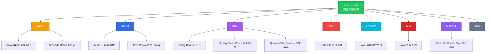
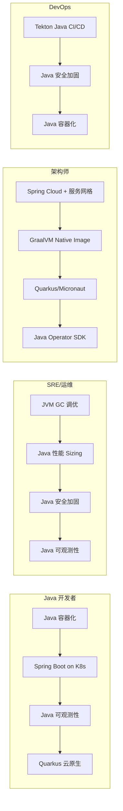
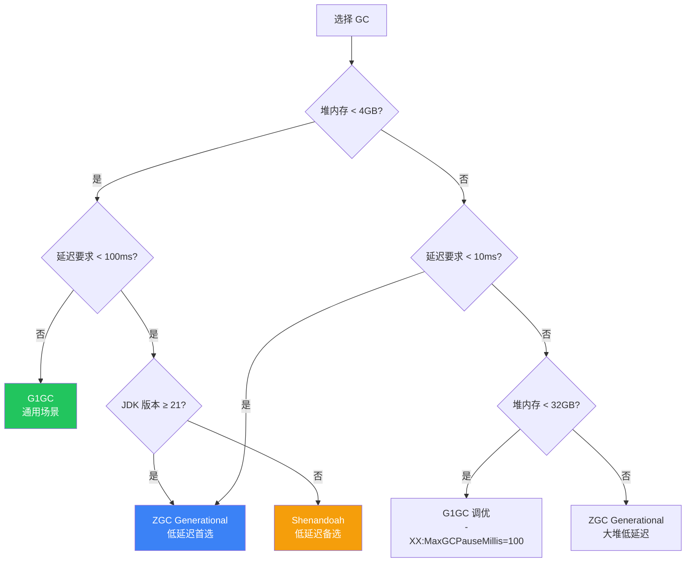

> **生产环境安全提示**
>
> 本文档包含可直接执行的运维命令。执行前请确认：当前目标集群与 Namespace 是否正确；是否具备足够的 RBAC 权限；是否已在非生产环境验证。命令风险等级标注：🔴 高风险（可能造成数据丢失或服务中断）、🟡 中风险（会修改集群状态，但通常可回滚）、🟢 低风险/只读（信息收集，无副作用）。


# Java on [[Kubernetes|Kubernetes]] 综合实践指南

> **一站式 Java + Kubernetes 知识入口** | 12 篇专题指南 | 覆盖从容器化到生产的完整生命周期
> **适用版本**: JDK 17+ / Spring Boot 3.x / Quarkus 3.x / GraalVM for JDK 17+ / Kubernetes v1.28+
> **最后更新**: 2026-04-30

---

## 一、概述

Java 是企业级后端开发的第一大语言，Kubernetes 是容器编排的事实标准。两者的结合构成了现代云原生应用的基石。然而，将 Java 应用**生产级别**地运行在 Kubernetes 上，需要深入理解 JVM 在容器中的行为、GC 在 cgroups 限制下的表现、镜像构建优化策略、探针与优雅停机、配置管理、安全加固、可观测性整合等众多领域。

本指南是 Java on Kubernetes 的**统一知识入口**，整合了 12 个深度专题，覆盖从开发到运维的完整生命周期。每个专题均包含完整的代码示例、生产级配置模板、架构设计图、故障排查手册和性能调优参数。

### 1.1 为什么 Java on Kubernetes 需要专门指南

传统 Java 应用的运维假设是"独占物理机/虚拟机"，而 Kubernetes 带来了根本性的变化：

| 维度 | 传统部署 | Kubernetes 部署 |
|------|---------|----------------|
| 资源模型 | 物理内存/CPU 为边界 | cgroups 限制，需容器感知 |
| 网络模型 | 固定 IP | [[Service|Service]]/DNS 动态发现 |
| 配置管理 | 本地配置文件 | ConfigMap/Secret 动态注入 |
| 生命周期 | 手动启停 | 探针驱动的自动化生命周期管理 |
| 日志 | 本地文件轮转 | stdout → 日志收集器 |
| 弹性 | 手动扩缩 | HPA/VPA 自动伸缩 |
| 密钥 | 文件/密钥库 | Secret + External Secrets Operators]] Operator |
| 发布 | 停机部署 | 滚动更新 + 金丝雀 |

### 1.2 核心技术栈全景



---

## 二、专题指南索引

### 2.1 容器化 (2 篇)

| # | 指南 | 说明 | 难度 |
|---|------|------|------|
| 1 | [Java 容器化最佳实践](./容器运行时/12-java-containerization-guide.md) | Dockerfile 模板、Jib/Buildpacks、分层 JAR、多架构构建、安全加固 | 中级 |
| 2 | [GraalVM Native Image 指南](./专项技术/99-graalvm-native-image-guide.md) | Spring Boot 3 原生编译、Quarkus/Micronaut 原生、Metadata 配置、K8s 部署 | 高级 |

### 2.2 运行时 (2 篇)

| # | 指南 | 说明 | 难度 |
|---|------|------|------|
| 3 | JVM GC 容器调优深度指南](./故障诊断/99-jvm-gc-container-tuning-guide.md) | G1GC/ZGC/Shenandoah 对比、容器感知参数、GC 监控告警 | 高级 |
| 4 | [Java 性能调优与资源 Sizing](./故障诊断/99-java-performance-resource-sizing-guide.md) | 资源 Sizing 公式、启动优化、线程池调优、CDS/AppCDS | 高级 |

### 2.3 框架 (3 篇)

| # | 指南 | 说明 | 难度 |
|---|------|------|------|
| 5 | [Spring Boot on Kubernetes](./工作负载/99-spring-boot-kubernetes-guide.md) | 探针、配置管理、优雅停机、数据库连接池、生产 Deployment | 中级 |
| 6 | [Spring Cloud K8s + 服务网格](./网络/99-spring-cloud-kubernetes-service-mesh-guide.md) | Spring Cloud → K8s 原生映射、Istio 集成、Resilience4j、迁移路径 | 高级 |
| 7 | [Quarkus/Micronaut 云原生 Java](./专项技术/99-quarkus-micronaut-cloud-native-java-guide.md) | Quarkus vs Micronaut vs Spring Boot、Dev Services、反应式编程 | 中级 |

### 2.4 CI/CD (1 篇)

| # | 指南 | 说明 | 难度 |
|---|------|------|------|
| 8 | [Tekton Java CI/CD 流水线](./发布变更/99-tekton-java-cicd-guide.md) | Maven/Gradle Task、Jib 构建、安全扫描、GitOps 集成 | 中级 |

### 2.5 可观测性 (1 篇)

| # | 指南 | 说明 | 难度 |
|---|------|------|------|
| 9 | [Java 可观测性整合指南](./可观测性/99-java-observability-kubernetes-guide.md) | Micrometer + JMX Exporter + OTel Agent + 日志 JSON + Grafana Dashboard | 高级 |

### 2.6 安全 (1 篇)

| # | 指南 | 说明 | 难度 |
|---|------|------|------|
| 10 | [Java 安全加固指南](./安全/99-java-security-kubernetes-guide.md) | SecurityContext、KeyStore/TrustStore、OAuth2、SBOM、NetworkPolicy | 高级 |

### 2.7 平台开发 (1 篇)

| # | 指南 | 说明 | 难度 |
|---|------|------|------|
| 11 | [Java K8s Client / Operator SDK](./平台工程/99-java-k8s-client-operator-guide.md) | fabric8/client-java、Java Operator SDK、Informer 模式 | 高级 |

### 2.8 运维 (1 篇)

| # | 指南 | 说明 | 难度 |
|---|------|------|------|
| 12 | [Java 性能与资源 Sizing](./故障诊断/99-java-performance-resource-sizing-guide.md) | 容器资源公式、启动优化、线程池、连接池 Sizing | 高级 |

---

## 三、快速开始路线图

### 3.1 按角色推荐阅读路径



### 3.2 按阶段推荐阅读路径

| 阶段 | 推荐指南 | 目标 |
|------|---------|------|
| **入门** | Java 容器化 → Spring Boot on K8s | 将 Java 应用部署到 K8s |
| **进阶** | JVM GC 调优 → Java 可观测性 → Java 安全加固 | 生产级运维能力 |
| **高级** | Spring Cloud + 服务网格 → GraalVM Native Image | 架构优化 |
| **专家** | Java Operator SDK → Quarkus/Micronaut | 平台级开发 |

---

## 四、Java on K8s 核心速查

### 4.1 关键 JVM 参数速查

```bash
# ===== 容器感知 (JDK 11+ 默认开启，JDK 8u191+ 需手动开启) =====
-XX:+UseContainerSupport

# ===== 堆内存配置（推荐使用百分比，而非固定值） =====
-XX:MaxRAMPercentage=75.0       # 最大堆 = 容器内存限制 × 75%
-XX:InitialRAMPercentage=50.0   # 初始堆 = 容器内存限制 × 50%

# ===== GC 选择 =====
-XX:+UseG1GC                     # 通用场景（JDK 11+ 默认）
-XX:+UseZGC -XX:+ZGenerational   # 低延迟场景（JDK 21+ 推荐）
-XX:+UseShenandoahGC             # 低延迟场景（JDK 17+ 可用）

# ===== 元空间 =====
-XX:MaxMetaspaceSize=256m        # 限制元空间上限，防止泄漏

# ===== 线程栈 =====
-Xss512k                         # 每线程栈大小（默认 1M，高并发可降至 512k）

# ===== 健康检查端口分离 =====
-Dserver.port=8080               # 业务端口
-Dmanagement.server.port=8081    # 管理端口（探针、metrics）
```

### 4.2 JVM GC 选择决策树



### 4.3 生产 Deployment 最小集

```yaml
apiVersion: apps/v1
kind: Deployment
metadata:
  name: myapp
  namespace: production
  labels:
    app: myapp
    version: v1
spec:
  replicas: 3
  selector:
    matchLabels:
      app: myapp
  strategy:
    type: RollingUpdate
    rollingUpdate:
      maxSurge: 25%
      maxUnavailable: 0
  template:
    metadata:
      labels:
        app: myapp
        version: v1
      annotations:
        prometheus.io/scrape: "true"
        prometheus.io/port: "8081"
        prometheus.io/path: "/actuator/prometheus"
    spec:
      terminationGracePeriodSeconds: 60
      serviceAccountName: myapp
      securityContext:
        runAsNonRoot: true
        runAsUser: 1001
        fsGroup: 1001
        seccompProfile:
          type: RuntimeDefault
      containers:
        - name: app
          image: registry.example.com/myapp:1.0.0
          ports:
            - name: http
              containerPort: 8080
            - name: management
              containerPort: 8081
          env:
            - name: JAVA_OPTS
              value: >-
                -XX:+UseContainerSupport
                -XX:MaxRAMPercentage=75.0
                -XX:InitialRAMPercentage=50.0
                -XX:+UseG1GC
                -XX:MaxGCPauseMillis=100
                -XX:MaxMetaspaceSize=256m
                -Dserver.port=8080
                -Dmanagement.server.port=8081
            - name: SPRING_PROFILES_ACTIVE
              value: "production"
            - name: POD_NAME
              valueFrom:
                fieldRef:
                  fieldPath: metadata.name
            - name: POD_NAMESPACE
              valueFrom:
                fieldRef:
                  fieldPath: metadata.namespace
            - name: NODE_NAME
              valueFrom:
                fieldRef:
                  fieldPath: spec.nodeName
          startupProbe:
            httpGet:
              path: /actuator/health/readiness
              port: management
            periodSeconds: 2
            failureThreshold: 30
          livenessProbe:
            httpGet:
              path: /actuator/health/liveness
              port: management
            periodSeconds: 10
            failureThreshold: 3
          readinessProbe:
            httpGet:
              path: /actuator/health/readiness
              port: management
            periodSeconds: 5
            failureThreshold: 3
          resources:
            requests:
              memory: "768Mi"
              cpu: "250m"
            limits:
              memory: "1Gi"
              cpu: "1000m"
          securityContext:
            allowPrivilegeEscalation: false
            readOnlyRootFilesystem: true
            capabilities:
              drop: ["ALL"]
          volumeMounts:
            - name: tmp
              mountPath: /tmp
            - name: logs
              mountPath: /app/logs
      volumes:
        - name: tmp
          emptyDir: {}
        - name: logs
          emptyDir: {}
      topologySpreadConstraints:
        - maxSkew: 1
          topologyKey: topology.kubernetes.io/zone
          whenUnsatisfiable: DoNotSchedule
          labelSelector:
            matchLabels:
              app: myapp
```

### 4.4 容器资源 Sizing 公式

```
容器内存限制 = JVM 堆 + 元空间 + 线程栈 + 直接内存 + GC 开销 + Native 内存 + 安全余量

具体公式:
  JVM 堆        = 容器内存限制 × 75%  (MaxRAMPercentage)
  元空间         = 128-256MB           (MaxMetaspaceSize)
  线程栈         = 线程数 × Xss        (默认 200线程 × 512K ≈ 100MB)
  直接内存       = 32-64MB             (DirectByteBuffer)
  GC 开销        = JVM 堆 × 10-20%    (GC 内部数据结构)
  Native 内存    = 50-100MB            (JIT、JNI、malloc)
  安全余量       = 容器内存限制 × 10%

经验公式:
  容器内存限制 ≈ JVM 堆 × 1.5
  CPU 请求     = 目标 QPS × 平均延迟 × 1.3
  CPU 限制     = CPU 请求 × 4 (允许突发)
```

| 应用类型 | 推荐内存 Request | 推荐内存 Limit | 推荐CPU Request | 推荐CPU Limit |
|---------|-----------------|---------------|----------------|--------------|
| 轻量级 API | 256Mi | 512Mi | 100m | 500m |
| 普通 Web 服务 | 512Mi | 1Gi | 250m | 1000m |
| 数据库密集型 | 1Gi | 2Gi | 500m | 2000m |
| 批处理任务 | 1Gi | 4Gi | 500m | 2000m |
| Native Image | 64Mi | 128Mi | 50m | 500m |

---

## 五、常见问题速查

### 5.1 问题 → 指南映射

| 问题 | 指南 | 关键章节 |
|------|------|---------|
| OOMKilled | JVM GC 调优 → 容器内存分配公式 | 第六节 |
| 启动慢被杀 | Spring Boot on K8s → 探针配置 | 第二节 |
| GC 暂停过长 | JVM GC 调优 → ZGC 章节 | 第四节 |
| 镜像太大 | Java 容器化 → 镜像瘦身策略 | 第八节 |
| 配置无法注入 | Spring Boot on K8s → 配置管理 | 第三节 |
| 连接池耗尽 | Spring Boot on K8s → 数据库连接池 | 第六节 |
| 日志乱码/分散 | Java 可观测性 → 日志结构化 | 第五节 |
| 追踪断链 | Java 可观测性 → 分布式追踪 | 第八节 |
| 安全扫描不通过 | Java 安全加固 → 容器运行时安全 | 第二节 |
| Spring Cloud 迁移 | Spring Cloud K8s + 服务网格 → 迁移路径 | 第六节 |

### 5.2 快速诊断命令

> ⚠️ **🟡 中危变更** — 变更集群资源状态，建议先 --dry-run 或 diff 确认
> - `kubectl exec`：进入容器执行命令，可能改变容器状态

``` bash
# 🟡 中风险：会修改集群/资源状态，执行前请确认目标、影响范围与授权
# ===== 查看 Pod OOM 状态 =====
kubectl get events --field-selector reason=OOMKilling -n production

# ===== 查看 Pod 内存/CPU 实际使用 =====
kubectl top pod -l app=myapp -n production --containers

# ===== 查看 JVM 堆内存使用（通过 Actuator） =====
kubectl exec -n production $POD -- \
  curl -s http://localhost:8081/actuator/metrics/jvm.memory.used?tag=area:heap

# ===== 查看 GC 暂停时间 =====
kubectl exec -n production $POD -- \
  curl -s http://localhost:8081/actuator/metrics/jvm.gc.pause

# ===== 查看线程死锁 =====
kubectl exec -n production $POD -- \
  curl -s http://localhost:8081/actuator/threaddump | python3 -m json.tool

# ===== 查看连接池状态 =====
kubectl exec -n production $POD -- \
  curl -s http://localhost:8081/actuator/metrics/hikaricp.connections.active

# ===== 获取 GC 日志（需要在 JAVA_OPTS 中配置 -Xlog:gc*） =====
kubectl logs -n production $POD --tail=500 | grep -i "gc|pause|oom"

# ===== 查看 Pod 退出原因 =====
kubectl get pod $POD -n production -o jsonpath='{.status.containerStatuses[0].lastState}'

# ===== 端到端健康检查 =====
kubectl exec -n production $POD -- \
  curl -s http://localhost:8081/actuator/health | python3 -m json.tool
```
---

## 六、技术矩阵

### 6.1 框架 × 能力矩阵

| 能力 | Spring Boot | Spring Cloud | Quarkus | Micronaut | Native Image |
|------|------------|-------------|---------|-----------|-------------|
| K8s 探针 | Actuator | Actuator | 原生支持 | 原生支持 | 部分支持 |
| 配置注入 | ConfigMap | Spring Cloud K8s | ConfigMapping | @ConfigurationProperties | 有限支持 |
| 服务发现 | K8s DNS | Spring Cloud K8s | 原生 K8s | 原生 K8s | 支持 |
| 可观测性 | Micrometer | Micrometer | Micrometer | Micrometer | 有限 |
| 原生编译 | Spring AOT | 不支持 | 原生支持 | 原生支持 | 核心能力 |
| 启动时间 | 2-5s | 5-15s | 0.5-2s | 0.5-1s | 10-50ms |
| 内存占用 | 200-500MB | 400-800MB | 50-150MB | 50-100MB | 30-80MB |
| 生态成熟度 | 极高 | 高 | 中高 | 中 | 中 |
| 社区规模 | 最大 | 大 | 中大 | 中 | 中大 |

### 6.2 GC × 场景矩阵

| GC | 适用堆大小 | 暂停目标 | 适用场景 | JDK 版本 |
|----|----------|---------|---------|---------|
| G1GC | 1-32GB | 100-200ms | 通用 Web 服务 | JDK 11+ |
| ZGC Generational | 1-16TB | < 1ms | 低延迟交易系统 | JDK 21+ |
| Shenandoah | 1-512GB | < 10ms | 实时分析 | JDK 17+ |
| Serial | < 512MB | N/A | 小型批处理 | JDK 8+ |
| Parallel | 1-8GB | 吞吐优先 | 批处理 ETL | JDK 8+ |

### 6.3 镜像构建方式对比

| 方式 | 构建工具 | 镜像大小 | 构建速度 | 多架构 | 安全性 |
|------|---------|---------|---------|--------|--------|
| Multi-Stage Dockerfile | Docker | 中 | 慢 | 支持 | 中 |
| Jib | Maven/Gradle | 小 | 快 | 支持 | 高 |
| Buildpacks | pack/kpack | 小 | 中 | 支持 | 高 |
| Quarkus Container | Maven/Gradle | 极小 | 中 | 支持 | 高 |
| Native Image | native-image | 极小 | 慢 | 支持 | 高 |

---

## 七、生产环境检查清单

### 7.1 部署前检查清单

```yaml
# Java 应用 Kubernetes 部署生产检查清单

# ===== 1. 容器镜像 =====
# - [ ] 使用 JRE 而非 JDK 基础镜像（或 distroless）
# - [ ] 非 root 用户运行（runAsNonRoot: true）
# - [ ] 只读文件系统（readOnlyRootFilesystem: true）
# - [ ] 无多余工具（curl, wget, shell）
# - [ ] 镜像大小 < 300MB（JVM 模式）或 < 100MB（Native 模式）
# - [ ] 镜像已通过 Trivy/Snyk 安全扫描

# ===== 2. JVM 参数 =====
# - [ ] 开启容器感知（-XX:+UseContainerSupport）
# - [ ] 使用 MaxRAMPercentage 而非 -Xmx 固定值
# - [ ] 配置 GC（G1GC/ZGC/Shenandoah）
# - [ ] 限制 MaxMetaspaceSize
# - [ ] 管理端口与业务端口分离

# ===== 3. 探针配置 =====
# - [ ] StartupProbe 配置（避免慢启动被杀）
# - [ ] LivenessProbe 不检查外部依赖
# - [ ] ReadinessProbe 检查所有关键依赖
# - [ ] 探针使用管理端口（8081）

# ===== 4. 资源配置 =====
# - [ ] requests 和 limits 都已配置
# - [ ] 内存 limit = 堆 × 1.5
# - [ ] CPU limit ≥ 4 × CPU request
# - [ ] 配置了 HPA

# ===== 5. 安全 =====
# - [ ] SecurityContext 配置正确
# - [ ] capabilities drop ALL
# - [ ] ServiceAccount 最小权限
# - [ ] NetworkPolicy 限制入出站

# ===== 6. 可观测性 =====
# - [ ] Micrometer + Prometheus 指标
# - [ ] 结构化 JSON 日志
# - [ ] 分布式追踪（OTel Agent）
# - [ ] JVM/GC 告警规则

# ===== 7. 弹性 =====
# - [ ] PDB 配置（minAvailable: 1）
# - [ ] topologySpreadConstraints（跨可用区）
# - [ ] terminationGracePeriodSeconds ≥ 60
# - [ ] 优雅停机已实现
```

### 7.2 快速生成生产 Deployment 脚本

```bash
#!/bin/bash
# generate-java-deployment.sh
# 根据输入参数生成生产级 Java Deployment

set -euo pipefail

APP_NAME=${1:?"Usage: $0 <app-name> <namespace> <image> <memory-limit>"}
NAMESPACE=${2:?"Usage: $0 <app-name> <namespace> <image> <memory-limit>"}
IMAGE=${3:?"Usage: $0 <app-name> <namespace> <image> <memory-limit>"}
MEMORY_LIMIT=${4:?"Usage: $0 <app-name> <namespace> <image> <memory-limit>"}

MEMORY_REQUEST=$(echo "$MEMORY_LIMIT" | sed 's/Gi/Mi/' | awk '{
    val=$1; gsub(/[^0-9]/,"",val);
    unit=$1; gsub(/[0-9]/,"",unit);
    if (unit=="Gi") printf "%.0fMi", val*768;
    else if (unit=="Mi") printf "%.0fMi", val*0.75;
}')

cat <<EOF
apiVersion: apps/v1
kind: Deployment
metadata:
  name: ${APP_NAME}
  namespace: ${NAMESPACE}
  labels:
    app: ${APP_NAME}
    version: v1
    managed-by: java-k8s-generator
spec:
  replicas: 3
  selector:
    matchLabels:
      app: ${APP_NAME}
  strategy:
    type: RollingUpdate
    rollingUpdate:
      maxSurge: 25%
      maxUnavailable: 0
  template:
    metadata:
      labels:
        app: ${APP_NAME}
        version: v1
      annotations:
        prometheus.io/scrape: "true"
        prometheus.io/port: "8081"
        prometheus.io/path: "/actuator/prometheus"
    spec:
      terminationGracePeriodSeconds: 60
      securityContext:
        runAsNonRoot: true
        runAsUser: 1001
        fsGroup: 1001
        seccompProfile:
          type: RuntimeDefault
      containers:
        - name: app
          image: ${IMAGE}
          ports:
            - name: http
              containerPort: 8080
            - name: management
              containerPort: 8081
          env:
            - name: JAVA_OPTS
              value: "-XX:+UseContainerSupport -XX:MaxRAMPercentage=75.0 -XX:+UseG1GC"
            - name: SPRING_PROFILES_ACTIVE
              value: "production"
          startupProbe:
            httpGet: { path: /actuator/health/readiness, port: management }
            periodSeconds: 2
            failureThreshold: 30
          livenessProbe:
            httpGet: { path: /actuator/health/liveness, port: management }
            periodSeconds: 10
            failureThreshold: 3
          readinessProbe:
            httpGet: { path: /actuator/health/readiness, port: management }
            periodSeconds: 5
            failureThreshold: 3
          resources:
            requests: { memory: "${MEMORY_REQUEST}", cpu: "250m" }
            limits: { memory: "${MEMORY_LIMIT}", cpu: "1000m" }
          securityContext:
            allowPrivilegeEscalation: false
            readOnlyRootFilesystem: true
            capabilities:
              drop: ["ALL"]
          volumeMounts:
            - name: tmp
              mountPath: /tmp
      volumes:
        - name: tmp
          emptyDir: {}
      topologySpreadConstraints:
        - maxSkew: 1
          topologyKey: topology.kubernetes.io/zone
          whenUnsatisfiable: DoNotSchedule
          labelSelector:
            matchLabels:
              app: ${APP_NAME}
EOF
```

---

## 八、参考资源

### 8.1 官方文档

- [Spring Boot 官方文档 - Kubernetes](https://docs.spring.io/spring-boot/docs/current/reference/html/deployment.html#deployment.cloud.kubernetes)
- [GraalVM Native Image 文档](https://docs.oracle.com/en/graalvm/enterprise/22/docs/reference-manual/native-image/)
- [OpenTelemetry Java Instrumentation](https://github.com/open-telemetry/opentelemetry-java-instrumentation)
- [Java Operator SDK](https://github.com/java-operator-sdk/java-operator-sdk)
- [Quarkus 官方文档](https://quarkus.io/guides/)
- [Micronaut 官方文档](https://docs.micronaut.io/)

### 8.2 规范与标准

- [W3C Trace Context 规范](https://www.w3.org/TR/trace-context/)
- [OpenTelemetry 语义约定](https://opentelemetry.io/docs/specs/semconv/)
- [CIS Kubernetes Benchmark](https://www.cisecurity.org/benchmark/kubernetes)
- [NIST 容器安全指南](https://csrc.nist.gov/publications/detail/sp/800-190/final)

### 8.3 工具与生态

- [Jib - Java 容器镜像构建](https://github.com/GoogleContainerTools/jib)
- [Buildpacks - 云原生构建](https://buildpacks.io/)
- [Trivy - 容器安全扫描](https://github.com/aquasecurity/trivy)
- [JMX Exporter - Prometheus JMX 指标](https://github.com/prometheus/jmx_exporter)
- [Micrometer - 指标门面](https://micrometer.io/)
- [Grafana JVM Dashboard (4701)](https://grafana.com/grafana/dashboards/4701)

## Related

- Domain-34: CNCF Landscape 开源项目 — Cross-reference
- [[23-实体/15-参考与索引/release-notes-networking.md|发布说明索引 — 网络]] — Cross-reference
- 网络 MOC — Cross-reference
- Topic 应用层架构设计最佳实践 — Cross-reference
- topic-application-architecture MOC — Cross-reference
- [[22-概念/10-最佳实践/bp-common-best-practices.md|Kubernetes 通用最佳实践参考]] — Cross-reference
- [[35-元数据/metadata/KUDIG Knowledge Base Architecture.md|KUDIG Knowledge Base Architecture]] — Cross-reference
- [[15-AI基础设施/01-基础设施/03-gpu-scheduling-management.md|GPU 调度与管理]] — Cross-reference
- [[15-AI基础设施/01-基础设施/05-distributed-training-frameworks.md|分布式训练框架]] — Cross-reference
- 发布变更 MOC — Cross-reference
- [[26-技能/04-工作负载/pod/培训/learn-decision-tree-mermaid.md|故障排查决策树 - Mermaid 可视化版]] — Cross-reference
- [[26-技能/04-工作负载/daemonset/skill-22-daemonset-failure.md|DaemonSet 故障诊断与修复 / DaemonSet Failure Diagnosis & Remediation]] — Cross-reference
- [[10-平台工程/02-运维/06-monitoring-alerting-system.md|监控告警体系]] — Cross-reference
- Domain 30: 企业级灾备与业务连续性 (Enterprise Disaster Recovery & Business Continuity) — Cross-reference
- [[23-实体/15-参考与索引/ecosystem-changelog.md|生态组件变更日志索引]] — Cross-reference
- [[21-生态参考/03-领域索引/cluster-index.md|Cluster 集群知识图谱索引]]
- [[21-生态参考/03-领域索引/pvc-index.md|PVC 知识图谱索引]]
- [[21-生态参考/03-领域索引/terway-index.md|Terway 知识图谱索引]]
- [[21-生态参考/03-领域索引/nginx-ingress-index.md|nginx-ingress-controller 知识图谱索引]]
- [[21-生态参考/03-领域索引/higress-index.md|Higress 知识图谱索引]]

## 相关合成分析

- [[22-概念/07-调度与资源/gpu-scheduling-ai-workloads.md|gpu-scheduling-ai-workloads]]


<!-- risk-assessed -->
