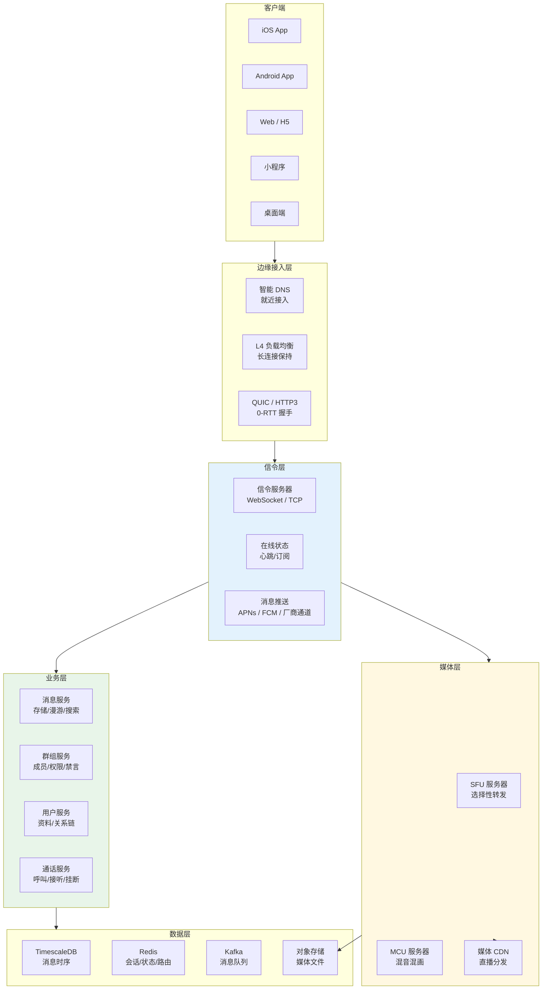
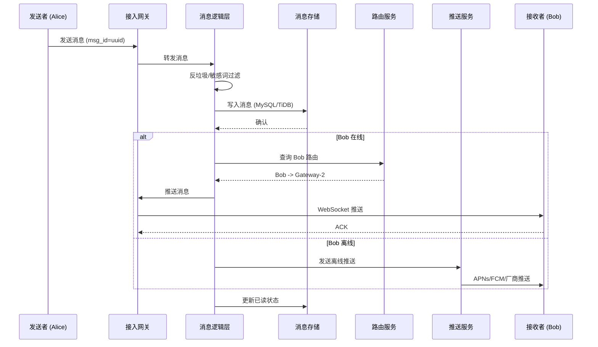
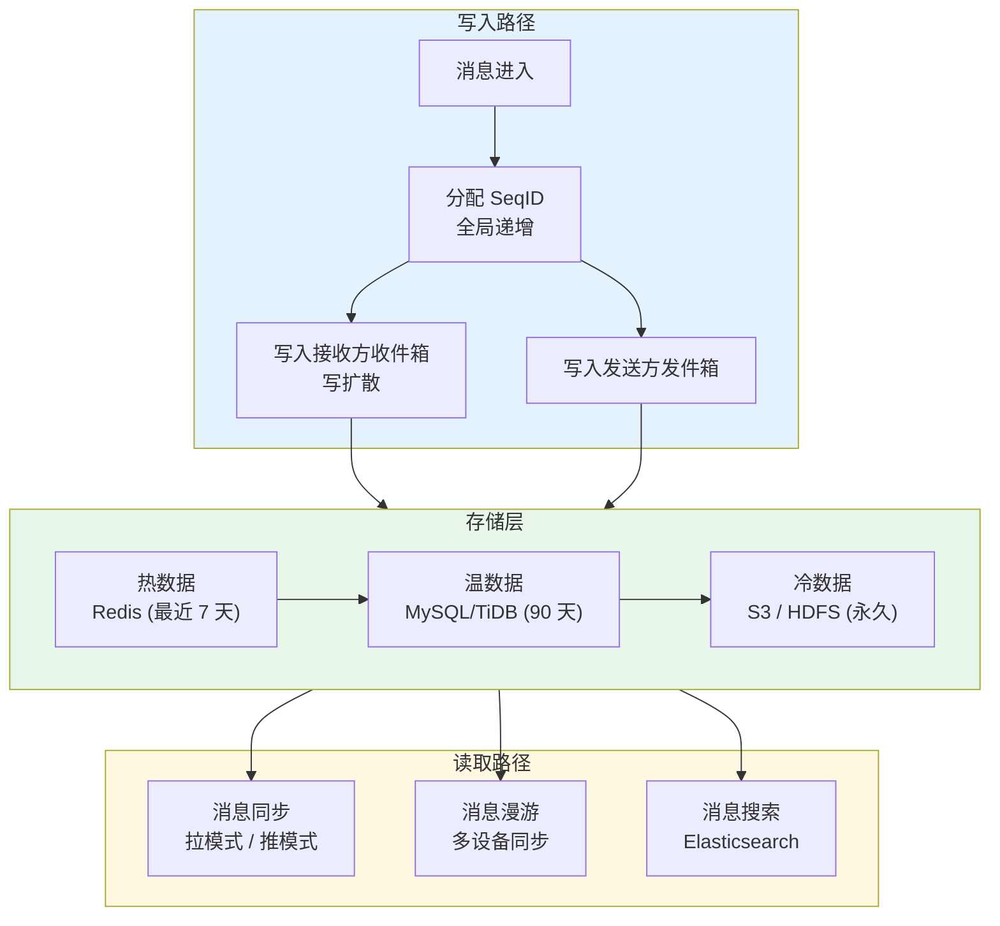
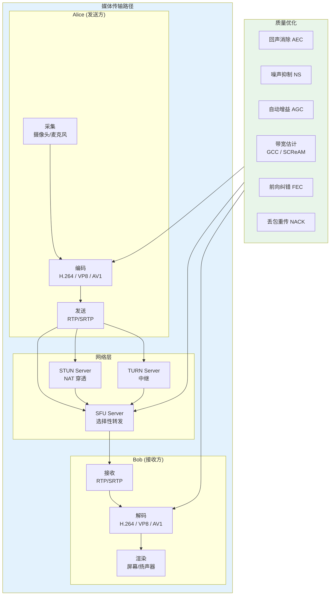
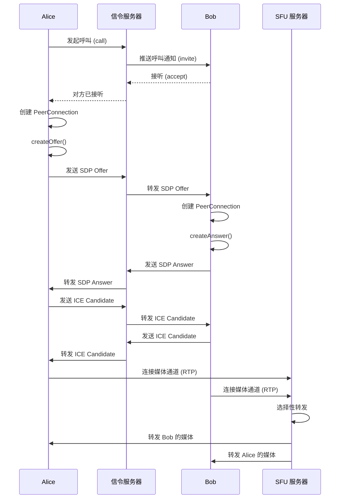
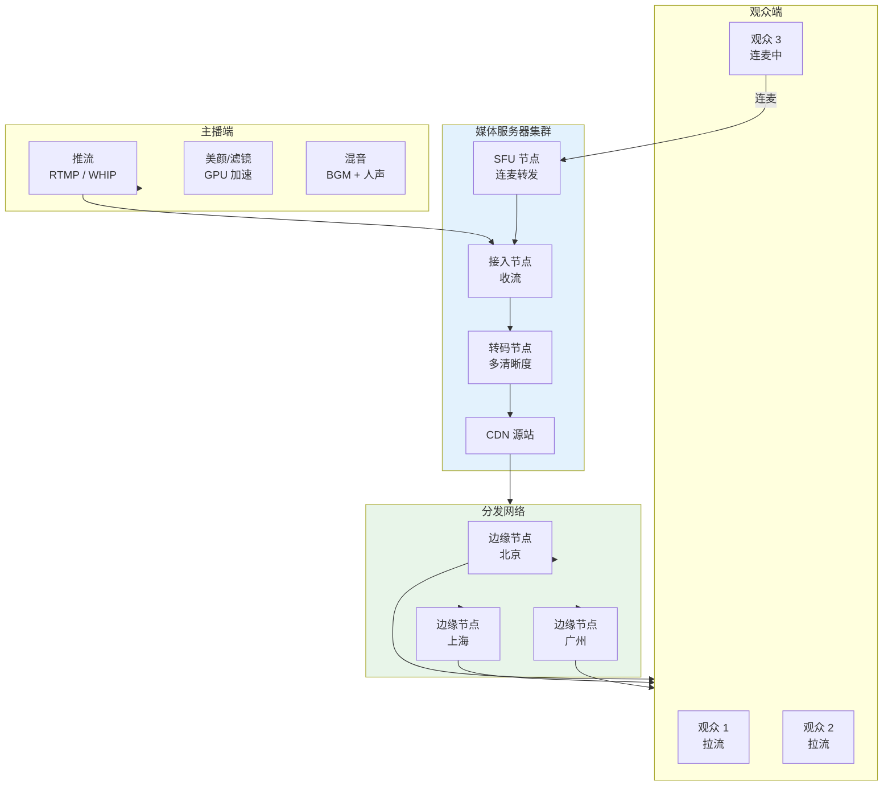
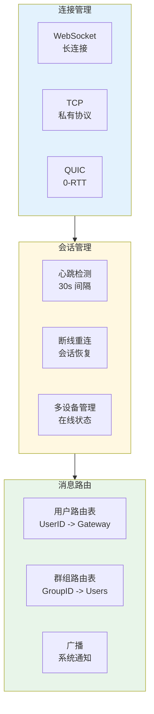
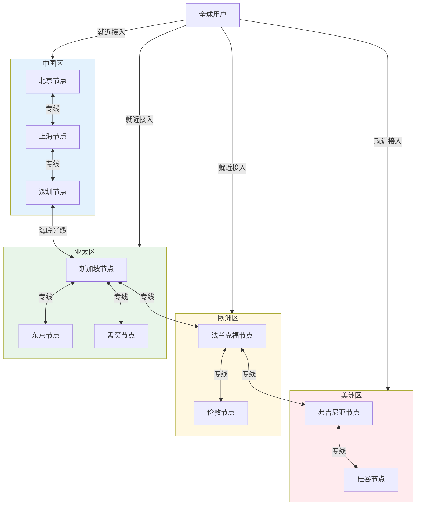
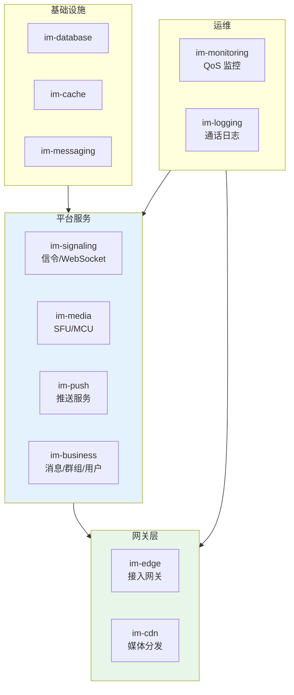

> **生产环境安全提示**
>
> 本文档包含可直接执行的运维命令。执行前请确认：当前目标集群与 Namespace 是否正确；是否具备足够的 RBAC 权限；是否已在非生产环境验证。命令风险等级标注：🔴 高风险（可能造成数据丢失或服务中断）、🟡 中风险（会修改集群状态，但通常可回滚）、🟢 低风险/只读（信息收集，无副作用）。


title: 实时通信 IM/RTC 架构设计
description: '# 实时通信 (IM / RTC) [[Kubernetes|Kubernetes]] 生产架构设计'
category: application-architecture
tags:
- k8s
- architecture
- industry
- [[Prometheus|prometheus]]
- redis
- mysql
- kafka
- elasticsearch
- [[StatefulSet|statefulset]]
- gateway
last_updated: 2026-05-18
difficulty: expert
reading_level: expert
audience:
- 实时通信架构师
- 音视频工程师
- 后端开发工程师
estimated_read_time: 5min
intent_queries:
- 即时通讯 IM 即时消息 Kubernetes 部署
- 音视频通话 WebRTC SFU MCU 架构
- 实时消息推送信令服务设计
- 消息存储漫游搜索系统
- 阿里云 RTC 实时音视频
trigger_keywords:
- 即时通讯
- IM聊天
- RTC音视频通话
- WebRTC
- SFU选择性转发
- MCU混音混画
- 信令服务器
- 消息推送
- 阿里云RTC
- 实时消息
related_domains:
- 网络
- 故障诊断
related_topics:
- topic-im-rtc-architecture
- topic-streaming-architecture
authors:
- name: KUDIG Team
  role: contributor
k8s_versions:
- '1.28'
- '1.29'
- '1.30'
- '1.31'
- '1.32'
---

# 实时通信 (IM / RTC) Kubernetes 生产架构设计

> **适用场景**: 即时消息 / 音视频通话 / 直播连麦 / 在线客服 / 会议系统  
> **适用版本**: Kubernetes v1.29 - v1.33  
> **最后更新**: 2026-04-24  
> **目标读者**: 实时通信架构师、音视频工程师、后端 TL

---

<!-- chunk: 📋 目录 -->## 📋 目录

- [一、整体架构全景](#一整体架构全景)
- [二、IM 消息系统架构](#二im-消息系统架构)
- [三、音视频通话 (RTC) 架构](#三音视频通话-rtc-架构)
- [四、直播连麦架构](#四直播连麦架构)
- [五、信令服务器架构](#五信令服务器架构)
- [六、媒体服务器架构](#六媒体服务器架构)
- [七、全球加速网络架构](#七全球加速网络架构)
- [八、K8s 部署架构](#八k8s-部署架构)

---

<!-- chunk: 一、整体架构全景 -->## 一、整体架构全景



---

<!-- chunk: 二、IM 消息系统架构 -->## 二、IM 消息系统架构

## 消息收发流程



## 消息存储模型



## 消息队列 K8s 配置

```yaml
apiVersion: apps/v1
kind: StatefulSet
metadata:
  name: im-message-router
  namespace: im-system
spec:
  serviceName: im-message-router
  replicas: 5
  selector:
    matchLabels:
      app: im-message-router
  template:
    metadata:
      labels:
        app: im-message-router
    spec:
      affinity:
        podAntiAffinity:
          requiredDuringSchedulingIgnoredDuringExecution:
            - labelSelector:
                matchExpressions:
                  - key: app
                    operator: In
                    values:
                      - im-message-router
              topologyKey: kubernetes.io/hostname
      containers:
        - name: router
          image: im/message-router:v3.0
          ports:
            - containerPort: 8080
              name: http
            - containerPort: 9090
              name: grpc
            - containerPort: 10000
              name: websocket
          env:
            - name: KAFKA_BROKERS
              value: "kafka-0.kafka:9092,kafka-1.kafka:9092,kafka-2.kafka:9092"
            - name: REDIS_CLUSTER
              value: "redis-cluster:6379"
            - name: WS_MAX_CONNECTIONS
              value: "100000"
          resources:
            requests:
              cpu: "2"
              memory: "4Gi"
            limits:
              cpu: "4"
              memory: "8Gi"
          livenessProbe:
            httpGet:
              path: /health/live
              port: 8080
            initialDelaySeconds: 30
            periodSeconds: 10
---
# WebSocket 长连接负载均衡
apiVersion: v1
kind: Service
metadata:
  name: im-gateway
  namespace: im-system
  annotations:
    service.beta.kubernetes.io/aws-load-balancer-type: nlb
    service.beta.kubernetes.io/aws-load-balancer-backend-protocol: tcp
spec:
  type: LoadBalancer
  selector:
    app: im-message-router
  ports:
    - name: websocket
      port: 10000
      targetPort: 10000
      protocol: TCP
  sessionAffinity: ClientIP
  sessionAffinityConfig:
    clientIP:
      timeoutSeconds: 10800  # 3 小时会话保持
```

---

<!-- chunk: 三、音视频通话 (RTC) 架构 -->## 三、音视频通话 (RTC) 架构



## WebRTC 信令流程



---

<!-- chunk: 四、直播连麦架构 -->## 四、直播连麦架构



---

<!-- chunk: 五、信令服务器架构 -->## 五、信令服务器架构



---

<!-- chunk: 六、媒体服务器架构 -->## 六、媒体服务器架构

```mermaid
flowchart TB
    subgraph Ingest["媒体接入"]
        RTMP["RTMP 推流<br/>传统直播"]
        SRT["SRT 推流<br/>低延迟"]
        WHIP["WHIP 推流<br/>WebRTC"]
        RTP["RTP 接入<br/>RTC"]
    end

    subgraph Process["媒体处理"]
        DEMUX["解封装<br/>FLV / MP4 / WebM"]
        DECODE["解码<br/>FFmpeg / 硬件"]
        FILTER["滤镜处理<br/>水印/字幕/叠加"]
        ENCODE["编码<br/>多码率输出"]
        MUX["封装<br/>HLS / DASH / FLV"]
    end

    subgraph Output["输出分发"]
        HLS["HLS<br/>m3u8 + ts"]
        DASH["DASH<br">MPD + fmp4"]
        FLV["HTTP-FLV<br/>低延迟"]
        WEBRTC_OUT["WebRTC<br">超低延迟"]
    end

    Ingest --> Process --> Output

    style Process fill:#e3f2fd
    style Output fill:#e8f5e9
```

## Media Server K8s 部署 (基于 Mediasoup / Janus)

```yaml
apiVersion: apps/v1
kind: Deployment
metadata:
  name: mediasoup-worker
  namespace: im-media
spec:
  replicas: 10
  selector:
    matchLabels:
      app: mediasoup-worker
  template:
    metadata:
      labels:
        app: mediasoup-worker
    spec:
      hostNetwork: true  # WebRTC 需要公网 IP
      nodeSelector:
        node-type: media
      tolerations:
        - key: node-type
          operator: Equal
          value: media
          effect: NoSchedule
      containers:
        - name: mediasoup
          image: im/mediasoup-worker:v2.0
          ports:
            - containerPort: 10000
              protocol: UDP
              name: rtp
            - containerPort: 20000
              protocol: UDP
              name: rtcp
          env:
            - name: RTC_MIN_PORT
              value: "10000"
            - name: RTC_MAX_PORT
              value: "10100"
            - name: WORKER_NUM
              value: "4"
          resources:
            requests:
              cpu: "4"
              memory: "4Gi"
            limits:
              cpu: "8"
              memory: "8Gi"
          securityContext:
            capabilities:
              add:
                - NET_BIND_SERVICE
---
# 媒体节点池 (GPU / 高网络吞吐)
apiVersion: karpenter.sh/v1
kind: NodePool
metadata:
  name: media-nodes
spec:
  template:
    spec:
      requirements:
        - key: node.kubernetes.io/instance-type
          operator: In
          values: ["c7.8xlarge", "g7.2xlarge"]
        - key: karpenter.sh/capacity-type
          operator: In
          values: ["on-demand"]
      taints:
        - key: node-type
          value: media
          effect: NoSchedule
  limits:
    cpu: 500
```

---

<!-- chunk: 七、全球加速网络架构 -->## 七、全球加速网络架构



---

<!-- chunk: 八、K8s 部署架构 -->## 八、K8s 部署架构

## Namespace 组织



## RTC 质量监控告警

```yaml
apiVersion: monitoring.coreos.com/v1
kind: PrometheusRule
metadata:
  name: im-quality-alerts
  namespace: im-monitoring
spec:
  groups:
    - name: rtc-quality
      rules:
        - alert: RTCAudioQualityDegraded
          expr: |
            (
              sum(rate(rtc_audio_packet_loss_ratio[1m]))
              by (room_id, user_id)
            ) > 0.05
          for: 30s
          labels:
            severity: warning
          annotations:
            summary: "RTC 音频丢包率超过 5%"

        - alert: RTCVideoFreeze
          expr: |
            (
              sum(rate(rtc_video_freeze_count[1m]))
              by (room_id, user_id)
            ) > 0
          for: 1m
          labels:
            severity: critical
          annotations:
            summary: "RTC 视频出现卡顿"

        - alert: WebSocketConnectionDrop
          expr: |
            (
              im_websocket_connections -
              im_websocket_connections  offset 5m
            ) < -1000
          for: 1m
          labels:
            severity: critical
          annotations:
            summary: "WebSocket 连接数骤降超过 1000"
```

---

<!-- chunk: 参考链接 -->## 参考链接

- [WebRTC 官方文档](https://webrtc.org/getting-started/overview)
- [Mediasoup 文档](https://mediasoup.org/documentation/)
- [Janus Gateway](https://janus.conf.meetecho.com/)
- [WebTransport / WHIP / WHEP](https://datatracker.ietf.org/)

---

<!-- chunk: Obsidian 相关文档 -->## Obsidian 相关文档

- topic-application-architecture MOC
- [[04-应用模式/02-行业架构/README.md|Topic 应用层架构设计最佳实践]]
- [[04-应用模式/02-行业架构/01-ecommerce-architecture.md|电商系统 Kubernetes 生产架构设计]]
- [[04-应用模式/02-行业架构/02-mini-program-architecture.md|小程序平台架构设计]]
- [[04-应用模式/02-行业架构/03-cms-architecture.md|内容管理系统 CMS 架构设计]]
- [[04-应用模式/02-行业架构/05-online-education-architecture.md|在线教育平台 Kubernetes 生产架构设计]]
- [[04-应用模式/02-行业架构/06-fintech-architecture.md|金融科技FinTech Kubernetes生产架构设计]]
- [[04-应用模式/02-行业架构/07-iot-platform-architecture.md|物联网 IoT 平台架构设计]]
- [[04-应用模式/02-行业架构/08-ai-ml-inference-architecture.md|AI/ML 推理服务 Kubernetes 生产架构设计]]
- [[04-应用模式/02-行业架构/09-gaming-backend-architecture.md|游戏后端 Kubernetes 生产架构设计]]
- [[04-应用模式/02-行业架构/10-social-media-architecture.md|社交媒体平台Kubernetes生产架构设计]]
- [[04-应用模式/02-行业架构/11-smart-retail-architecture.md|智慧零售与新零售Kubernetes生产架构设计]]

## Related

- 20-microservice-governance-architecture

## See Also

- 02-mini-program-architecture
- 03-cms-architecture
- 05-online-education-architecture
- 06-fintech-architecture


<!-- risk-assessed -->
