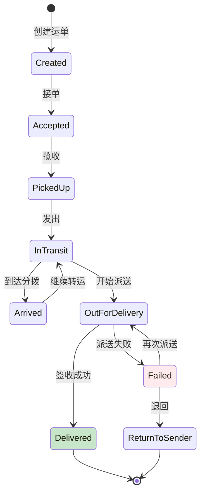

> **生产环境安全提示**
>
> 本文档包含可直接执行的运维命令。执行前请确认：当前目标集群与 Namespace 是否正确；是否具备足够的 RBAC 权限；是否已在非生产环境验证。命令风险等级标注：🔴 高风险（可能造成数据丢失或服务中断）、🟡 中风险（会修改集群状态，但通常可回滚）、🟢 低风险/只读（信息收集，无副作用）。


title: 智慧物流与供应链Kubernetes生产架构设计
description: '# 智慧物流与供应链 [[Kubernetes|Kubernetes]] 生产架构设计'
category: application-architecture
tags:
- k8s
- architecture
- industry
- redis
- operator
last_updated: '2026-05-18'
difficulty: advanced
reading_level: advanced
audience:
- 物流行业架构师
- 供应链技术负责人
- 阿里云解决方案架构师
- WMS/TMS开发者
estimated_read_time: 5min
intent_queries:
- 智慧物流系统K8s架构设计
- OMS订单履约全链路架构
- 仓储管理WMS边缘部署
- TMS运输路径优化
- 物流跟踪大数据可视化
trigger_keywords:
- 智慧物流
- 供应链
- WMS
- TMS
- OMS
- 仓储管理
- 运输优化
- 物流跟踪
- 跨境物流
- 即时配送
related_domains:
- 集群基础
- 网络
- domain-7-observability
- domain-5-iot-edge-computing
related_topics:
- 应用模式/topic-application-architecture/26-aviation-travel
- 应用模式/topic-application-architecture/11-smart-retail-architecture
- 应用模式/topic-application-architecture/29-agritech-iot
- 工作负载/topic-functions/04-high-concurrency-system
authors:
- name: KUDIG Team
  role: contributor
k8s_versions:
- '1.28'
- '1.29'
- '1.30'
- '1.31'
- '1.32'
---

# 智慧物流与供应链 Kubernetes 生产架构设计

> **适用场景**: 快递快运 / 仓配一体 / 冷链物流 / 跨境物流 / 即时配送 / 供应链协同  
> **云厂商**: 阿里云 ACK + 产品体系  
> **适用版本**: Kubernetes v1.29 - v1.33  
> **最后更新**: 2026-04-24  
> **目标读者**: 物流行业架构师、供应链技术负责人、阿里云解决方案架构师

---

<!-- chunk: 📋 目录 -->## 📋 目录

- [一、整体架构全景](#一整体架构全景)
- [二、订单履约全链路架构](#二订单履约全链路架构)
- [三、仓储管理 (WMS) 架构](#三仓储管理-wms-架构)
- [四、运输管理 (TMS) 与路径优化](#四运输管理-tms-与路径优化)
- [五、末端配送与骑手调度架构](#五末端配送与骑手调度架构)
- [六、物流跟踪与可视化架构](#六物流跟踪与可视化架构)
- [七、供应链协同与预测架构](#七供应链协同与预测架构)
- [八、ACK 阿里云部署架构](#八ack-阿里云部署架构)

---

<!-- chunk: 一、整体架构全景 -->## 一、整体架构全景

```mermaid
flowchart TB
    subgraph Shipper["货主/商家"]
        ECOM["电商平台"]
        MERCHANT["品牌商家"]
        FACTORY["工厂/制造商"]
    end

    subgraph Platform["物流平台 (ACK)"]
        OMS["订单管理系统<br/>OMS"]
        WMS["仓储管理系统<br/>WMS"]
        TMS["运输管理系统<br/>TMS"]
        DMS["配送管理系统<br/>DMS"]
        BMS["计费管理系统<br/>BMS"]
    end

    subgraph Execution["执行层"]
        WAREHOUSE["智能仓库<br/>AGV/机械臂/分拣"]
        LINE_HAUL["干线运输<br">整车/零担"]
        LAST_MILE["末端配送<br">骑手/快递柜"]
        CROSS_BORDER["跨境通关<br">报关/保税"]
    end

    subgraph IOT["IoT 感知层"]
        GPS["GPS/北斗<br">车辆定位"]
        RFID_WAREHOUSE["RFID<br">仓储盘点"]
        SENSOR["温湿度传感器<br">冷链监控"]
        E_LOCK["电子锁<br">在途安全"]
    end

    subgraph Recipient["收件人"]
        CONSUMER["C 端消费者"]
        BUSINESS["B 端企业"]
    end

    Shipper --> Platform --> Execution --> Recipient
    IOT --> Execution --> Platform

    style Platform fill:#e3f2fd
    style Execution fill:#e8f5e9
    style IOT fill:#fff8e1
```

## 阿里云产品映射

| 架构层 | 阿里云方案 | 说明 |
|:---|:---|:---|
| 容器平台 | **ACK Pro** + **ACK@Edge** | 中心调度 + 仓库/网点边缘节点 |
| API 网关 | **MSE 云原生网关** / **API 网关** | 开放平台对接货主系统 |
| 数据库 | **PolarDB-X** (分布式) / **Lindorm** | 海量运单/轨迹数据 |
| 缓存 | **云数据库 Redis 企业版** (Tair) | 路由/状态/会话 |
| 消息队列 | **RocketMQ 5.0** | 异步解耦/事件驱动 |
| 大数据 | **MaxCompute** + **实时计算 Flink** | 路径优化/预测 |
| 地图服务 | **阿里云 Maps** / **高德** | 路径规划/地理围栏 |
| IoT 平台 | **阿里云 IoT 平台** | 设备接入/规则引擎 |
| 监控 | **ARMS** + **SLS** | 全链路追踪 |

---

<!-- chunk: 二、订单履约全链路架构 -->## 二、订单履约全链路架构

```mermaid
flowchart LR
    subgraph Step1["① 接单"]
        RECEIVE["接收订单<br/>电商平台/OMS"]
        SPLIT["订单拆分<br">子单/包裹"]
    end

    subgraph Step2["② 仓储"]
        ALLOCATE["库存分配<br">就近/成本/时效"]
        PICK["拣货<br">波次/路径"]
        PACK["打包<br">称重/贴单"]
        HANDOVER["交接出库"]
    end

    subgraph Step3["③ 运输"]
        COLLECT["揽收<br">网点/上门"]
        SORT["分拨中心<br">自动分拣"]
        LINEHAUL["干线运输<br">整车/航空"]
        DELIVERY_STATION["到达网点"]
    end

    subgraph Step4["④ 末端"]
        DISPATCH["派件调度<br">骑手/快递员"]
        OUT_DELIVERY["派送中"]
        SIGN["签收<br">本人/代收/快递柜"]
    end

    Step1 --> Step2 --> Step3 --> Step4

    style Step1 fill:#e3f2fd
    style Step2 fill:#e8f5e9
    style Step3 fill:#fff8e1
    style Step4 fill:#ffccbc
```

## 履约状态机



---

<!-- chunk: 三、仓储管理 (WMS) 架构 -->## 三、仓储管理 (WMS) 架构

```mermaid
flowchart TB
    subgraph Inbound["入库"]
        RECEIVE["收货<br/>预约/到货"]
        QC["质检<br">抽检/全检"]
        PUTAWAY["上架<br">库位分配"]
    end

    subgraph Inventory["库内管理"]
        MOVE["移库<br">补货/整理"]
        COUNT["盘点<br">循环/全盘"]
        FREEZE["冻结<br">异常/临期"]
    end

    subgraph Outbound["出库"]
        WAVE["波次<br">批次聚合"]
        PICKING["拣货<br">摘果/播种"]
        CHECK["复核<br">扫码校验"]
        PACKING["打包<br">耗材/称重"]
        SHIP["发运<br">交接"]
    end

    Inbound --> Inventory --> Outbound

    style Inbound fill:#e3f2fd
    style Inventory fill:#fff8e1
    style Outbound fill:#e8f5e9
```

## 智能仓库 K8s 边缘部署

```yaml
apiVersion: apps/v1
kind: Deployment
metadata:
  name: wms-edge-controller
  namespace: logistics-edge
spec:
  replicas: 1
  selector:
    matchLabels:
      app: wms-edge-controller
  template:
    metadata:
      labels:
        app: wms-edge-controller
    spec:
      nodeName: edge-warehouse-hangzhou-001
      containers:
        - name: wms
          image: registry.cn-hangzhou.aliyuncs.com/logistics/wms-edge:v1.5
          ports:
            - containerPort: 8080
          env:
            - name: WAREHOUSE_ID
              value: "HZ-RDC-001"
            - name: AGV_CONTROLLER_ENDPOINT
              value: "http://agv-controller.local:5000"
            - name: CONVEYOR_CONTROLLER_ENDPOINT
              value: "http://conveyor.local:5001"
            - name: CLOUD_SYNC_MODE
              value: "realtime"  # realtime / batch
          resources:
            requests:
              cpu: "1"
              memory: "2Gi"
            limits:
              cpu: "4"
              memory: "8Gi"
          volumeMounts:
            - name: warehouse-data
              mountPath: /data
      volumes:
        - name: warehouse-data
          hostPath:
            path: /opt/wms/data
            type: DirectoryOrCreate
```

---

<!-- chunk: 四、运输管理 (TMS) 与路径优化 -->## 四、运输管理 (TMS) 与路径优化

```mermaid
flowchart TB
    subgraph Plan["运输计划"]
        DEMAND["运输需求<br">订单/预测"]
        CAPACITY["运力资源<br">自有/三方"]
        OPTIMIZE["智能调度<br">路径/装载/成本"]
    end

    subgraph Execute["运输执行"]
        DISPATCH["派车<br">司机/车辆分配"]
        TRACK["在途跟踪<br">GPS/北斗"]
        EVENT["事件管理<br">异常/延误"]
        POD["回单<br">电子签收"]
    end

    subgraph Cost["成本结算"]
        CALC["运费计算<br">里程/重量/时效"]
        VERIFY["对账<br">司机/承运商"]
        PAYMENT["支付<br">运费结算"]
    end

    Plan --> Execute --> Cost

    style Plan fill:#e3f2fd
    style Execute fill:#e8f5e9
    style Cost fill:#fff8e1
```

---

<!-- chunk: 五、末端配送与骑手调度架构 -->## 五、末端配送与骑手调度架构

```mermaid
flowchart TB
    subgraph OrderPool["订单池"]
        INSTANT["即时订单<br">外卖/生鲜"]
        SAME_DAY["当日达<br">电商"]
        APPOINTMENT["预约单<br">定时送达"]
    end

    subgraph RiderPool["运力池"]
        ONLINE["在线骑手<br">实时位置"]
        CAPACITY["运力评估<br">接单能力"]
        SCORE["骑手评分<br">服务/时效"]
    end

    subgraph Algorithm["调度算法"]
        MATCH["订单匹配<br">距离/方向/负载"]
        BATCH["订单合并<br">顺路单"]
        ROUTE["路径规划<br">多订单优化"]
    end

    subgraph Execute["执行"]
        PICKUP["到店取货"]
        DELIVER["送货上门"]
        COMPLETE["签收完成"]
    end

    OrderPool & RiderPool --> Algorithm --> Execute

    style Algorithm fill:#e3f2fd
    style Execute fill:#e8f5e9
```

---

<!-- chunk: 六、物流跟踪与可视化架构 -->## 六、物流跟踪与可视化架构

```mermaid
flowchart TB
    subgraph DataSource["数据来源"]
        SCAN["扫描节点<br">揽收/分拣/派送"]
        GPS_DATA["GPS 数据<br">车辆/骑手"]
        IOT_DATA["IoT 传感器<br">温湿度/震动"]
        MANUAL["人工录入<br">异常备注"]
    end

    subgraph Processing["数据处理"]
        STREAM["流处理<br">Flink"]
        CLEAN["数据清洗<br">去重/补全"]
        ENRICH["数据增强<br">地址/时效"]
    end

    subgraph Display["可视化"]
        MAP["地图轨迹<br">实时位置"]
        TIMELINE["时间轴<br">节点跟踪"]
        DASHBOARD["监控大屏<br">全局视图"]
        API["查询 API<br">物流详情"]
    end

    DataSource --> Processing --> Display

    style Processing fill:#e3f2fd
    style Display fill:#e8f5e9
```

---

<!-- chunk: 七、供应链协同与预测架构 -->## 七、供应链协同与预测架构

```mermaid
flowchart TB
    subgraph Demand["需求侧"]
        SALES["销售预测<br">历史/趋势/促销"]
        SEASONAL["季节性<br">节假日/大促"]
        PROMOTION["促销活动<br">双11/618"]
    end

    subgraph Supply["供给侧"]
        INVENTORY["库存水平<br">现有/在途"]
        PRODUCTION["生产计划<br">产能/交期"]
        PROCUREMENT["采购计划<br">供应商"]
    end

    subgraph Optimize["智能优化"]
        FORECAST["预测模型<br">ML / 时序"]
        REPLENISH["补货建议<br">自动下单"]
        ALLOCATION["库存分配<br">仓间调拨"]
    end

    Demand --> Optimize --> Supply

    style Optimize fill:#e3f2fd
    style Supply fill:#e8f5e9
```

---

<!-- chunk: 八、ACK 阿里云部署架构 -->## 八、ACK 阿里云部署架构

## 物流平台 ACK 多集群架构

```mermaid
flowchart TB
    subgraph ControlPlane["管控集群 (ACK Pro)"]
        API["API 网关<br">MSE"]
        PLATFORM["平台服务<br">OMS/WMS/TMS"]
        DATA["数据中台<br">MaxCompute"]
    end

    subgraph EdgeClusters["边缘集群 (ACK@Edge)"]
        subgraph RDC1["华东 RDC"]
            W1["WMS 边缘"]
            T1["TMS 边缘"]
        end

        subgraph RDC2["华南 RDC"]
            W2["WMS 边缘"]
            T2["TMS 边缘"]
        end
    end

    subgraph IOTLayer["IoT 层"]
        DEVICE1["仓储设备<br">AGV/RFID"]
        DEVICE2["运输设备<br">GPS/电子锁"]
        DEVICE3["末端设备<br">快递柜/PDA"]
    end

    ControlPlane --> EdgeClusters --> IOTLayer
    IOTLayer -.->|数据上报| EdgeClusters -.->|汇聚| ControlPlane

    style ControlPlane fill:#e3f2fd
    style EdgeClusters fill:#e8f5e9
```

## 物流轨迹数据 Lindorm 配置

```yaml
# Lindorm 时序数据表 (物流轨迹)
# 适用于海量 GPS/扫描事件存储
apiVersion: v1
kind: ConfigMap
metadata:
  name: lindorm-schema
  namespace: logistics-data
data:
  trajectory.sql: |
    CREATE TABLE logistics_trajectory (
      waybill_id VARCHAR,
      event_time TIMESTAMP,
      event_type VARCHAR,
      location_geo POINT,
      warehouse_code VARCHAR,
      operator_id VARCHAR,
      device_id VARCHAR,
      status VARCHAR,
      PRIMARY KEY (waybill_id, event_time)
    )
    WITH (
      TTL = '90d',
      COMPRESSION = 'ZSTD'
    );
---
# 轨迹查询服务
apiVersion: apps/v1
kind: Deployment
metadata:
  name: trajectory-query-service
  namespace: logistics-data
spec:
  replicas: 5
  selector:
    matchLabels:
      app: trajectory-query
  template:
    metadata:
      labels:
        app: trajectory-query
    spec:
      containers:
        - name: query
          image: registry.cn-hangzhou.aliyuncs.com/logistics/trajectory-query:v1.0
          env:
            - name: LINDORM_URL
              valueFrom:
                secretKeyRef:
                  name: lindorm-credentials
                  key: url
            - name: CACHE_REDIS
              value: "r-bp1xxxxxxxxx.redis.rds.aliyuncs.com:6379"
          resources:
            requests:
              cpu: "1"
              memory: "2Gi"
            limits:
              cpu: "4"
              memory: "8Gi"
```

---

<!-- chunk: 参考链接 -->## 参考链接

- [阿里云物流行业解决方案](https://www.aliyun.com/solution/scenario/logistics)
- [阿里云 IoT 平台](https://www.aliyun.com/product/iot)
- [阿里云 Lindorm](https://www.aliyun.com/product/lindorm)
- [阿里云 PolarDB-X](https://www.aliyun.com/product/drds)

---

<!-- chunk: Obsidian 相关文档 -->## Obsidian 相关文档

- topic-application-architecture KUDIG Database — Global MOC
- [[04-应用模式/02-行业架构/README.md|Topic 应用层架构设计最佳实践]]
- [[04-应用模式/02-行业架构/01-ecommerce-architecture.md|电商系统 Kubernetes 生产架构设计]]
- [[04-应用模式/02-行业架构/02-mini-program-architecture.md|小程序平台架构设计]]
- [[04-应用模式/02-行业架构/03-cms-architecture.md|内容管理系统 CMS 架构设计]]
- [[04-应用模式/02-行业架构/04-im-rtc-architecture.md|实时通信 IM/RTC 架构设计]]
- [[04-应用模式/02-行业架构/05-online-education-architecture.md|在线教育平台 Kubernetes 生产架构设计]]
- [[04-应用模式/02-行业架构/06-fintech-architecture.md|金融科技FinTech Kubernetes生产架构设计]]
- [[04-应用模式/02-行业架构/07-iot-platform-architecture.md|物联网 IoT 平台架构设计]]
- [[04-应用模式/02-行业架构/08-ai-ml-inference-architecture.md|AI/ML 推理服务 Kubernetes 生产架构设计]]
- [[04-应用模式/02-行业架构/09-gaming-backend-architecture.md|游戏后端 Kubernetes 生产架构设计]]
- [[04-应用模式/02-行业架构/10-social-media-architecture.md|社交媒体平台Kubernetes生产架构设计]]

## See Also

- 10-social-media-architecture
- 11-smart-retail-architecture
- 13-digital-government-architecture
- 14-smart-healthcare-architecture


<!-- risk-assessed -->
