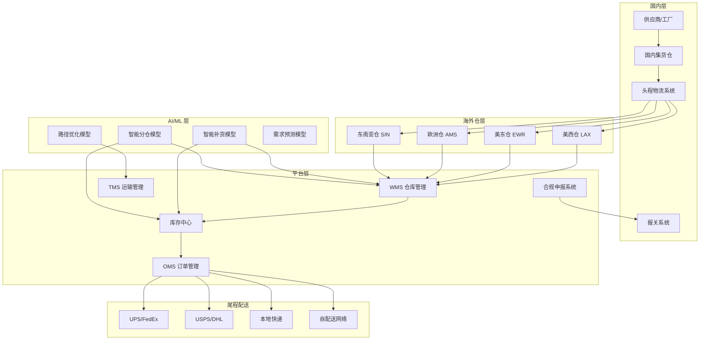
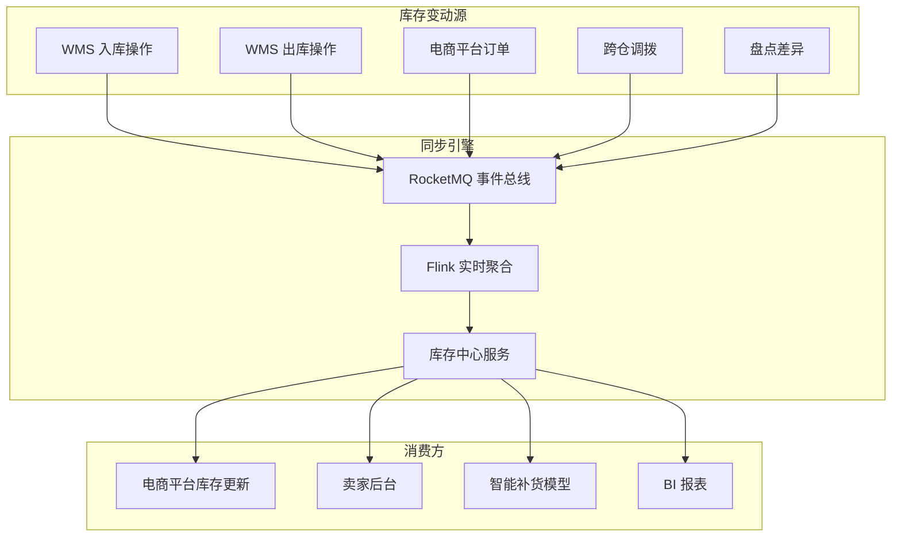

> **生产环境安全提示**
>
> 本文档包含可直接执行的运维命令。执行前请确认：当前目标集群与 Namespace 是否正确；是否具备足够的 RBAC 权限；是否已在非生产环境验证。命令风险等级标注：🔴 高风险（可能造成数据丢失或服务中断）、🟡 中风险（会修改集群状态，但通常可回滚）、🟢 低风险/只读（信息收集，无副作用）。


title: 跨境电商海外仓架构设计
description: '# 跨境电商海外仓架构设计 — 阿里云视角'
category: application-architecture
tags:
- k8s
- architecture
- industry
- [[prometheus|prometheus]]
- grafana
- opa
- redis
- mysql
- gateway
- rag
last_updated: 2026-05-18
difficulty: advanced
reading_level: advanced
audience:
- 跨境电商架构师
- 物流系统工程师
- SRE
estimated_read_time: 5min
intent_queries:
- 跨境电商海外仓 [[kubernetes|Kubernetes]] WMS
- 多区域仓库 Kubernetes 分布式部署
- 跨境物流 订单履约 K8s
- 库存同步 RocketMQ Kubernetes
- 跨境合规 GDPR 海关 K8s
trigger_keywords:
- 海外仓
- 跨境物流
- WMS
- OMS
- TMS
- 库存同步
- GDPR
- Kubernetes
- 阿里云
related_domains:
- 集群基础
- 生产运维
related_topics:
- 55-crossborder-dtc
- 31-instant-retail
- 12-smart-logistics-architecture
authors:
- name: KUDIG Team
  role: contributor
k8s_versions:
- '1.28'
- '1.29'
- '1.30'
- '1.31'
- '1.32'
---

# 跨境电商海外仓架构设计 — 阿里云视角

> **适用版本**: Kubernetes v1.29 - v1.33 | **最后更新**: 2026-04-24
> **作者**: 阿里云解决方案架构师 | **标签**: `#海外仓` `#跨境物流` `#WMS` `#阿里云`

---

<!-- chunk: 目录 -->## 目录

1. [行业概述](#1-行业概述)
2. [业务场景](#2-业务场景)
3. [架构设计](#3-架构设计)
4. [核心技术栈](#4-核心技术栈)
5. [Kubernetes 部署方案](#5-kubernetes-部署方案)
6. [数据架构](#6-数据架构)
7. [AI/ML 组件](#7-aiml-组件)
8. [安全与合规](#8-安全与合规)
9. [最佳实践](#9-最佳实践)
10. [反模式](#10-反模式)
11. [参考资源](#11-参考资源)

---

<!-- chunk: 1. 行业概述 -->## 1. 行业概述

## 1.1 市场规模与趋势

海外仓是跨境电商的关键物流基础设施，直接影响物流时效、消费者体验和运营成本。全球跨境电商市场规模预计从 2024 年的 6 万亿美元增长到 2030 年的 15 万亿美元。海外仓作为跨境物流核心模式，以"本地发货、快速送达"优势替代传统直邮模式，市场渗透率持续提升。

| 指标 | 2024 年 | 2026 年（预测） | 2030 年（预测） |
|:---|:---|:---|:---|
| 全球跨境电商规模 | $6T | $9T | $15T |
| 海外仓市场规模 | $80B | $150B | $400B |
| 中国卖家海外仓数量 | 2000+ | 3500+ | 8000+ |
| 平均尾程配送时效 | 3-5 天 | 2-3 天 | 1-2 天 |
| 退货率 | 8-12% | 6-9% | 4-6% |

## 1.2 行业痛点

| 痛点 | 说明 | 数字化转型驱动 |
|:---|:---|:---|
| 多仓协同 | 美东/美西/欧洲/东南亚多仓管理 | 分布式 WMS + 实时同步 |
| 库存精准 | SKU 多、批次管理复杂、库存差异 | 实时库存同步 + AI 补货 |
| 订单履约 | B2C 一件代发 + B2B 转运模式混合 | 灵活履约引擎 |
| 海关合规 | 各国进口税务要求差异大 | 自动化合规申报 |
| 退货处理 | 跨境退货成本高、流程复杂 | 本地退货仓 + 智能质检 |
| 尾程配送 | 多物流商比价与追踪 | TMS 集成 + 智能分拨 |

## 1.3 数字化转型架构影响

海外仓系统需要支持全球多区域分布式部署、多时区多语言、实时库存同步、多电商平台对接、多物流商集成和各国税务合规。架构核心是高可用的分布式 WMS 系统，需要就近部署到各仓库区域以降低延迟。

---

<!-- chunk: 2. 业务场景 -->## 2. 业务场景

## 2.1 智能入库管理

覆盖从国内集货到海外仓入库的全流程：收货预约、卸货验收、质检抽检、条码扫描、库位分配、上架入库。系统需要支持 ASN（预到货通知）、质检规则配置、异常处理（短缺/损坏/多收），并与头程物流系统对接跟踪在途货物。

## 2.2 精准库存管理

实现多仓库存实时可视、批次/效期管理、库位级精确管理、安全库存预警。支持跨仓调拨、库存冻结/解冻、盘点管理（动盘/盲盘/全盘）。库存数据需实时同步至各电商平台，避免超卖。

## 2.3 高效订单履约

支持 B2C 一件代发和B2B 整箱转运两种模式。B2C 订单从电商平台实时抓取，经智能分仓、波次拣货、打包贴标、称重出库、尾程配送。系统需要支持每分钟数千单的峰值处理能力。

## 2.4 退货逆向物流

处理消费者退货申请，支持本地退货仓接收、质检分级（可二次销售/维修/销毁）、换标重新上架。系统需要与电商平台退货流程联动，自动更新库存和财务数据。

## 2.5 头程物流管理

管理从国内到海外仓的运输过程，包括集货、报关、海运/空运/铁路、清关、海外内陆运输。系统需要提供全程可视化追踪、ETA 预测和异常预警。

---

<!-- chunk: 3. 架构设计 -->## 3. 架构设计

## 3.1 海外仓全景架构



---

<!-- chunk: 4. 核心技术栈 -->## 4. 核心技术栈

| Component | Purpose | Technology | License |
|:---|:---|:---|:---|
| Container Orchestration | Multi-region deployment | ACK Pro (多区域集群) | Proprietary |
| WMS Core | Warehouse management system | 自研 WMS (Spring Boot) | Proprietary |
| Order Engine | High-throughput order processing | 自研 OMS (Go) | Proprietary |
| Relational DB | Business data | PolarDB MySQL (多区域) | Proprietary |
| Cache | Hot data caching | Redis Enterprise (集群) | Proprietary |
| Message Queue | Event-driven architecture | Apache RocketMQ 5.x | Apache 2.0 |
| Object Storage | Documents & images | OSS (多区域) | Proprietary |
| Stream Processing | Real-time inventory sync | Flink | Apache 2.0 |
| Search Engine | Product & order search | OpenSearch | Apache 2.0 |
| AI Platform | Demand forecast & optimization | PAI | Proprietary |
| CDN | Global content delivery | Aliyun DCDN | Proprietary |
| Monitoring | Observability | ARMS + SLS + Grafana | Proprietary / Apache 2.0 |
| API Gateway | Multi-platform integration | Aliyun API Gateway | Proprietary |

---

<!-- chunk: 5. Kubernetes 部署方案 -->## 5. Kubernetes 部署方案

## 5.1 WMS 核心服务 Deployment

```yaml
apiVersion: apps/v1
kind: Deployment
metadata:
  name: wms-core
  namespace: crossborder-warehouse
  labels:
    app: wms-core
    region: us-west
spec:
  replicas: 4
  selector:
    matchLabels:
      app: wms-core
  strategy:
    rollingUpdate:
      maxSurge: 1
      maxUnavailable: 0
  template:
    metadata:
      labels:
        app: wms-core
        region: us-west
      annotations:
        prometheus.io/scrape: "true"
        prometheus.io/port: "9090"
    spec:
      affinity:
        podAntiAffinity:
          preferredDuringSchedulingIgnoredDuringExecution:
            - weight: 100
              podAffinityTerm:
                labelSelector:
                  matchLabels:
                    app: wms-core
                topologyKey: topology.kubernetes.io/zone
      nodeSelector:
        region: us-west
        node-pool: wms-core
      containers:
        - name: wms
          image: registry.cn-hangzhou.aliyuncs.com/cbwms/wms-core:v4.0.0
          ports:
            - containerPort: 8080
              name: http
            - containerPort: 9090
              name: metrics
          env:
            - name: WAREHOUSE_CODE
              value: "US-WEST-LAX"
            - name: WAREHOUSE_TIMEZONE
              value: "America/Los_Angeles"
            - name: DB_HOST
              valueFrom:
                configMapKeyRef:
                  name: wms-config
                  key: db-host
            - name: DB_PASSWORD
              valueFrom:
                secretKeyRef:
                  name: wms-secrets
                  key: db-password
            - name: REDIS_URL
              valueFrom:
                secretKeyRef:
                  name: wms-secrets
                  key: redis-url
            - name: ROCKETMQ_NAMESRV
              valueFrom:
                configMapKeyRef:
                  name: wms-config
                  key: rocketmq-namesrv
            - name: INVENTORY_SYNC_MODE
              value: "realtime"
            - name: PICKING_STRATEGY
              value: "wave-optimized"
          resources:
            requests:
              memory: "4Gi"
              cpu: "2000m"
            limits:
              memory: "8Gi"
              cpu: "4000m"
          readinessProbe:
            httpGet:
              path: /health/ready
              port: 8080
            initialDelaySeconds: 20
            periodSeconds: 5
          livenessProbe:
            httpGet:
              path: /health/live
              port: 8080
            initialDelaySeconds: 40
            periodSeconds: 10
```

## 5.2 订单处理服务 Deployment

```yaml
apiVersion: apps/v1
kind: Deployment
metadata:
  name: order-processor
  namespace: crossborder-warehouse
spec:
  replicas: 6
  selector:
    matchLabels:
      app: order-processor
  template:
    metadata:
      labels:
        app: order-processor
    spec:
      containers:
        - name: order
          image: registry.cn-hangzhou.aliyuncs.com/cbwms/order-processor:v3.0.0
          ports:
            - containerPort: 8080
          env:
            - name: MAX_ORDERS_PER_MINUTE
              value: "5000"
            - name: WAVE_INTERVAL_SECONDS
              value: "300"
            - name: ROUTING_STRATEGY
              value: "cost-time-balanced"
          resources:
            requests:
              memory: "2Gi"
              cpu: "1000m"
            limits:
              memory: "4Gi"
              cpu: "2000m"
```

## 5.3 ConfigMap, Service 与 Secret

```yaml
apiVersion: v1
kind: ConfigMap
metadata:
  name: wms-config
  namespace: crossborder-warehouse
data:
  db-host: "polardb-us-west.rds.aliyuncs.com:3306"
  rocketmq-namesrv: "rocketmq-cluster.crossborder-warehouse.svc.cluster.local:9876"
  inventory-sync-interval: "5s"
  wave-config: |
    {
      "wave_interval_seconds": 300,
      "max_orders_per_wave": 500,
      "picking_strategy": "zone-based",
      "sorting_strategy": "carrier-group"
    }
  carrier-config: |
    {
      "us": [
        {"carrier": "UPS", "service": "Ground", "weight_limit_kg": 30},
        {"carrier": "FedEx", "service": "Home Delivery", "weight_limit_kg": 30},
        {"carrier": "USPS", "service": "Priority Mail", "weight_limit_kg": 20}
      ],
      "eu": [
        {"carrier": "DHL", "service": "Parcel", "weight_limit_kg": 30},
        {"carrier": "PostNL", "service": "Standard", "weight_limit_kg": 20}
      ]
    }
  customs-config: |
    {
      "hs_code_auto_match": true,
      "value_declaration_threshold_usd": 800,
      "vat_countries": ["DE", "FR", "NL", "UK"]
    }
---
apiVersion: v1
kind: Service
metadata:
  name: wms-core
  namespace: crossborder-warehouse
spec:
  selector:
    app: wms-core
  ports:
    - name: http
      port: 8080
      targetPort: 8080
    - name: metrics
      port: 9090
      targetPort: 9090
  type: ClusterIP
---
apiVersion: v1
kind: Secret
metadata:
  name: wms-secrets
  namespace: crossborder-warehouse
type: Opaque
stringData:
  db-password: "encrypted-password-placeholder"
  redis-url: "redis://:password@redis-cluster.rds.aliyuncs.com:6379/0"
  platform-api-keys: "encrypted-api-keys"
  customs-certificate: "encrypted-cert"
```

---

<!-- chunk: 6. 数据架构 -->## 6. 数据架构

## 6.1 库存实时同步数据流



## 6.2 数据流说明

- **库存同步**: 任何库存变动通过 RocketMQ 事件总线广播，经 Flink 实时聚合后更新库存中心
- **订单流**: 电商平台订单通过 API 网关接入 OMS，经智能分仓后路由至对应仓库 WMS
- **物流追踪**: 尾程物流商通过 EDI/API 回传物流轨迹，实时更新订单状态
- **合规数据**: 报关/清关数据经合规系统处理后自动生成申报文件

---

<!-- chunk: 7. AI/ML 组件 -->## 7. AI/ML 组件

## 7.1 核心模型

| 模型 | 用途 | 输入 | 输出 | 框架 |
|:---|:---|:---|:---|:---|
| 需求预测 | 各仓 SKU 销量预测 | 历史销量/促销/季节 | 未来 30 天销量 | Prophet + LSTM |
| 智能补货 | 最优补货量和时机 | 需求预测/在途/安全库存 | 补货建议单 | OR-Tools |
| 智能分仓 | 订单最优发货仓 | 收货地址/库存/运费 | 推荐发货仓 | Greedy + ML |
| 路径优化 | 拣货路径优化 | 订单行/库位布局 | 最优拣货路径 | TSP Solver |
| 异常检测 | 库存异常/订单异常 | 库存流水/订单数据 | 异常标记 | Isolation Forest |

---

<!-- chunk: 8. 安全与合规 -->## 8. 安全与合规

## 8.1 行业法规与标准

| 法规/标准 | 适用范围 | 架构要求 |
|:---|:---|:---|
| GDPR | 欧洲/英国数据保护 | 数据最小化 + 跨境传输合规 |
| CCPA | 加州消费者隐私保护 | 数据删除权 + 披露权 |
| 各国海关法规 | 进出口合规申报 | 自动化报关系统 |
| VAT/销售税 | 各国税务合规 | 自动税额计算 + 申报 |
| PCI-DSS | 支付数据安全 | 支付信息加密 + 令牌化 |
| 数据出境安全评估 | 中国数据出境 | 数据本地化 + 安全评估 |

## 8.2 安全架构要点

- **多区域部署**: 各海外仓就近部署 WMS 节点，降低延迟
- **数据本地化**: 欧洲/美国用户数据本地存储，符合 GDPR/CCPA
- **支付安全**: 支付信息通过令牌化处理，不落库
- **API 安全**: 电商平台对接使用 OAuth2 + API 签名
- **审计日志**: 所有操作完整审计追踪

---

<!-- chunk: 9. 最佳实践 -->## 9. 最佳实践

1. **多区域就近部署**: 每个海外仓区域部署独立的 WMS 集群，库存数据通过事件总线最终一致
2. **波次拣货优化**: 按时间窗口聚合订单为拣货波次，优化拣货路径，提升拣货效率 40%
3. **库存安全水位**: AI 根据销量预测和补货周期自动计算安全库存，避免断货和积压
4. **多平台统一**: 统一对接 Amazon/Shopify/eBay/TikTok 等平台，库存和订单集中管理
5. **实时物流追踪**: 尾程物流轨迹实时获取并同步至电商平台，提升消费者体验
6. **自动化合规**: 根据目的地国家自动计算关税/VAT，生成报关文件
7. **退货本地化**: 就近退货仓处理，质检分级后重新上架或销毁，降低退货成本
8. **弹性伸缩**: 促销旺季（黑五/双十一）自动扩容订单处理服务
9. **跨仓调拨智能优化**: AI 根据各仓库存和需求预测，建议跨仓调拨方案
10. **条码化管理**: 入库-上架-拣货-出库全链路条码扫描，确保操作准确率 99.9%+

---

<!-- chunk: 10. 反模式 -->## 10. 反模式

1. **单区域集中部署**: 所有海外仓业务集中部署在国内，海外仓操作延迟高。应就近部署
2. **库存定时同步**: 每小时/每天同步库存，导致超卖。应实现事件驱动的实时同步
3. **忽视税务合规**: 不自动计算各国 VAT/销售税，导致合规风险。应部署自动税务引擎
4. **手工报关**: 依赖人工填写报关信息，效率低且易错。应实现自动化报关系统
5. **缺乏退货策略**: 跨境退货成本高于商品价值时仍退回国内。应制定分级退货策略

---

<!-- chunk: 11. 参考资源 -->## 11. 参考资源

- [跨境电商综试区政策](http://www.mofcom.gov.cn/)
- [GDPR 官方文本](https://gdpr-info.eu/)
- [CCPA 加州消费者隐私法](https://oag.ca.gov/privacy/ccpa)
- [Shopify 开发者文档](https://shopify.dev/)
- [Amazon SP-API](https://developer.amazonservices.com/)
- [阿里云全球基础设施](https://www.alibabacloud.com/global-locations)
- [Apache RocketMQ 文档](https://rocketmq.apache.org/docs/)

---

**维护者**: 阿里云解决方案架构师团队 | **许可证**: MIT

---

<!-- chunk: Obsidian 相关文档 -->## Obsidian 相关文档

- topic-application-architecture MOC
- [[04-应用模式/02-行业架构/README.md|Topic 应用层架构设计最佳实践]]
- [[04-应用模式/02-行业架构/01-ecommerce-architecture.md|电商系统 Kubernetes 生产架构设计]]
- [[04-应用模式/02-行业架构/02-mini-program-architecture.md|小程序平台架构设计]]
- [[04-应用模式/02-行业架构/03-cms-architecture.md|内容管理系统 CMS 架构设计]]
- [[04-应用模式/02-行业架构/04-im-rtc-architecture.md|实时通信 IM/RTC 架构设计]]
- [[04-应用模式/02-行业架构/05-online-education-architecture.md|在线教育平台 Kubernetes 生产架构设计]]
- [[04-应用模式/02-行业架构/06-fintech-architecture.md|金融科技FinTech Kubernetes生产架构设计]]
- [[04-应用模式/02-行业架构/07-iot-platform-architecture.md|物联网 IoT 平台架构设计]]
- [[04-应用模式/02-行业架构/08-ai-ml-inference-architecture.md|AI/ML 推理服务 Kubernetes 生产架构设计]]
- [[04-应用模式/02-行业架构/09-gaming-backend-architecture.md|游戏后端 Kubernetes 生产架构设计]]
- [[04-应用模式/02-行业架构/10-social-media-architecture.md|社交媒体平台Kubernetes生产架构设计]]

## See Also

- 31-instant-retail
- 32-smart-restaurant
- 34-sportstech
- 35-metaverse-digital-twin


<!-- risk-assessed -->
