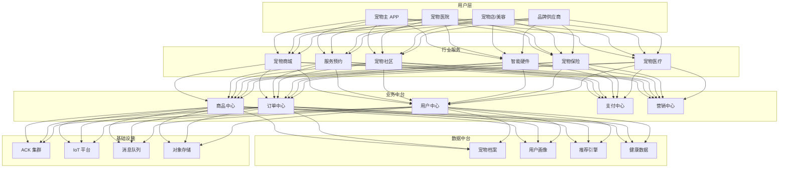
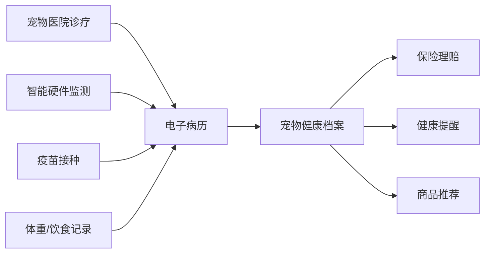
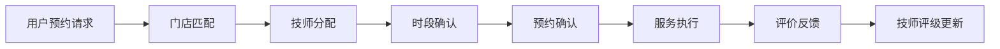

> **生产环境安全提示**
>
> 本文档包含可直接执行的运维命令。执行前请确认：当前目标集群与 Namespace 是否正确；是否具备足够的 RBAC 权限；是否已在非生产环境验证。命令风险等级标注：🔴 高风险（可能造成数据丢失或服务中断）、🟡 中风险（会修改集群状态，但通常可回滚）、🟢 低风险/只读（信息收集，无副作用）。


title: 宠物经济架构设计
description: '# 宠物经济架构设计 — 阿里云视角'
category: application-architecture
tags:
- k8s
- architecture
- industry
- redis
- mysql
last_updated: 2026-05-18
difficulty: intermediate
reading_level: intermediate
audience:
- 宠物行业架构师
- 宠物平台开发者
- 宠物 IoT 解决方案工程师
- 阿里云新零售解决方案架构师
estimated_read_time: 5min
intent_queries:
- 宠物经济平台 [[kubernetes|Kubernetes]] 部署架构
- 宠物电商服务预约调度系统
- 宠物智能硬件 IoT 设备管理
- 宠物保险理赔自动化
- 宠物健康档案数据管理
trigger_keywords:
- 宠物经济
- 宠物电商
- 宠物服务
- 宠物保险
- 宠物医疗
- 宠物社区
- 智能硬件
- 宠物食品
- 宠物医院
- 宠物美容
related_domains:
- 网络
- domain-5-edge-computing
- domain-7-ai-ml-platform
related_topics:
- 应用模式/topic-application-architecture/49-livestream-ecommerce
- 应用模式/topic-application-architecture/56-smart-elderly-care
authors:
- name: KUDIG Team
  role: contributor
k8s_versions:
- '1.28'
- '1.29'
- '1.30'
- '1.31'
- '1.32'
---

# 宠物经济架构设计 — 阿里云视角

> **适用版本**: Kubernetes v1.29 - v1.33 | **最后更新**: 2026-05-18
> **作者**: 阿里云解决方案架构师 | **标签**: `#宠物经济` `#宠物电商` `#宠物服务` `#阿里云`

---

## 目录

1. [概述](#1-概述)
2. [设计原则](#2-设计原则)
3. [架构模式](#3-架构模式)
4. [实现示例](#4-实现示例)
5. [在 Kubernetes 上的部署](#5-在-kubernetes-上的部署)
6. [最佳实践](#6-最佳实践)
7. [反模式](#7-反模式)
8. [参考资源](#8-参考资源)

---

## 1. 概述

宠物经济是全球增长最快的消费赛道之一。中国宠物市场规模已超过 3000 亿元，涵盖宠物食品、用品、医疗、服务、社交、智能硬件等多个子行业。随着宠物"拟人化"趋势的加深，消费者对宠物产品和服务的品质要求越来越高，催生了精品宠物食品、宠物医疗保险、宠物行为训练、宠物殡葬等细分市场。

宠物经济平台的核心业务特征是"电商+服务+内容+IoT"四合一：电商（宠物食品/用品/药品的在线销售）、服务（洗护/医疗/寄养/训练的预约调度）、内容（宠物短视频/社区/知识问答）、IoT（智能喂食器/饮水机/定位器的设备管理）。这四个业务线共享用户数据和宠物档案，需要统一的数据中台支撑。

从架构角度看，宠物经济平台是一个典型的多业务融合电商平台。技术挑战包括：商品非标化（宠物食品规格多样，SKU 管理复杂）、服务预约调度（多门店/多技师/多时段的资源调度）、内容审核（UGC 宠物内容的合规审核）、IoT 设备管理（百万级智能设备的连接和数据采集）、即时配送（宠物食品小时达的物流体系）。

### 1.1 行业背景

| 挑战 | 说明 | 架构影响 |
|:---|:---|:---|
| 商品非标 | 宠物食品/用品规格多样 | 灵活商品体系 + 属性管理 |
| 服务预约 | 洗护/医疗/寄养多类型 | 日历调度引擎 + 资源管理 |
| 内容社区 | UGC 宠物短视频/图文 | 内容审核 + 推荐系统 |
| 智能硬件 | 喂食器/饮水机/定位器 | IoT 平台 + 设备管理 |
| 即时配送 | 宠物食品小时达 | 同城配送 + 库存管理 |

### 1.2 核心场景

- **宠物电商**: 主粮/零食/用品/处方药销售，支持按宠物类型/品种/年龄推荐
- **服务预约**: 宠物医院/洗护/美容/寄养/训练的在线预约和调度
- **宠物社区**: 晒宠/问答/知识/领养等内容社区
- **智能硬件**: 智能喂食器/饮水机/定位器的连接管理和数据展示
- **宠物保险**: 医疗险/意外险/第三者责任险的投保和理赔

---

## 2. 设计原则

### 2.1 宠物为中心原则

传统电商以用户为中心，宠物经济平台需要以"宠物"为中心建立数据模型。每只宠物有独立的档案（品种、年龄、体重、健康记录、饮食偏好），推荐算法基于宠物特征而非仅用户行为。

### 2.2 服务标准化原则

宠物服务（洗护、医疗等）具有很强的非标性，不同门店/技师的服务质量差异大。平台需要建立服务标准化体系：标准服务流程（SOP）、技师认证体系、用户评价体系、服务纠纷处理机制。

### 2.3 内容安全原则

宠物社区的内容需要审核把关：防止虐待动物内容传播、防止虚假宠物医疗信息、保护用户隐私（宠物主人信息不泄露）。采用 AI 审核+人工审核的双重机制。

### 2.4 合规经营原则

宠物经济涉及多项监管要求：处方兽药销售需要兽药经营许可证和执业兽医处方；活体交易需要动物检疫证明；宠物医疗需要动物诊疗许可证。系统需要将合规检查嵌入业务流程。

---

## 3. 架构模式

### 3.1 宠物经济平台全景架构



### 3.2 宠物健康档案数据流



### 3.3 服务预约调度



---

## 4. 实现示例

### 4.1 宠物档案管理

```go
package pet

import (
    "time"
)

type PetType string

const (
    PetDog PetType = "dog"
    PetCat PetType = "cat"
)

type Pet struct {
    ID          string
    OwnerID     string
    Name        string
    Type        PetType
    Breed       string
    BirthDate   time.Time
    Weight      float64
    Gender      string
    IsNeutered  bool
    ChipID      string
    Allergies   []string
    Medications []string
}

type HealthRecord struct {
    ID          string
    PetID       string
    Type        string
    Date        time.Time
    Description string
    VetID       string
    Attachments []string
}

type PetProfileService struct {
    pets    map[string]*Pet
    records map[string][]*HealthRecord
}

func NewPetProfileService() *PetProfileService {
    return &PetProfileService{
        pets:    make(map[string]*Pet),
        records: make(map[string][]*HealthRecord),
    }
}

func (s *PetProfileService) CreatePet(pet *Pet) error {
    s.pets[pet.ID] = pet
    return nil
}

func (s *PetProfileService) AddHealthRecord(record *HealthRecord) error {
    s.records[record.PetID] = append(s.records[record.PetID], record)
    return nil
}

func (s *PetProfileService) GetPetProfile(petID string) (*Pet, []*HealthRecord) {
    pet := s.pets[petID]
    records := s.records[petID]
    return pet, records
}
```

### 4.2 智能推荐服务

```python
from dataclasses import dataclass
from typing import List

@dataclass
class Pet:
    pet_type: str
    breed: str
    age_months: int
    weight_kg: float
    allergies: List[str]
    activity_level: str

class PetProductRecommender:
    def recommend(self, pet: Pet, category: str = None) -> List[dict]:
        recommendations = []

        if category is None or category == "food":
            recommendations.extend(self._recommend_food(pet))
        if category is None or category == "toys":
            recommendations.extend(self._recommend_toys(pet))
        if category is None or category == "health":
            recommendations.extend(self._recommend_health(pet))

        return sorted(recommendations, key=lambda x: x['score'], reverse=True)

    def _recommend_food(self, pet: Pet) -> List[dict]:
        if pet.age_months < 12:
            life_stage = "puppy" if pet.pet_type == "dog" else "kitten"
        elif pet.age_months < 84:
            life_stage = "adult"
        else:
            life_stage = "senior"

        size = "small" if pet.weight_kg < 10 else \
               "medium" if pet.weight_kg < 25 else "large"

        return [{
            'product_id': f"food-{life_stage}-{size}",
            'name': f"{life_stage.title()} Formula {size.title()} Breed",
            'score': 0.9,
            'reason': f"适合{life_stage}期{size}型{pet.pet_type}",
        }]

    def _recommend_toys(self, pet: Pet) -> List[dict]:
        activity = pet.activity_level
        return [{
            'product_id': f"toy-{activity}",
            'name': f"Interactive {activity.title()} Toy",
            'score': 0.7,
            'reason': f"适合{activity}活跃度的宠物",
        }]

    def _recommend_health(self, pet: Pet) -> List[dict]:
        products = []
        if pet.age_months > 84:
            products.append({
                'product_id': "supp-joint",
                'name': "Joint Support Supplement",
                'score': 0.8,
                'reason': "老年宠物关节保健",
            })
        return products
```

---

## 5. 在 Kubernetes 上的部署

```yaml
apiVersion: apps/v1
kind: Deployment
metadata:
  name: pet-shop
  namespace: pet-economy
spec:
  replicas: 5
  selector:
    matchLabels:
      app: pet-shop
  template:
    metadata:
      labels:
        app: pet-shop
    spec:
      containers:
        - name: shop
          image: registry.cn-hangzhou.aliyuncs.com/pet/shop:v2.0.0
          ports:
            - containerPort: 8080
          env:
            - name: RECOMMEND_API
              value: "http://recommend-service:8080"
            - name: DB_HOST
              valueFrom:
                configMapKeyRef:
                  name: pet-config
                  key: db-host
          resources:
            requests:
              memory: "1Gi"
              cpu: "500m"
            limits:
              memory: "2Gi"
              cpu: "1000m"
```

---

## 6. 最佳实践

- **宠物画像**: 建立完整的宠物档案（品种/年龄/体重/健康/饮食偏好），驱动个性化推荐
- **服务 SOP**: 将洗护/医疗等服务流程标准化，确保服务质量一致性
- **内容审核**: AI + 人工双重审核，防止违规内容传播
- **合规检查**: 处方药销售自动校验兽医处方，活体交易校验检疫证明
- **IoT 设备管理**: 使用 MQTT 协议管理百万级智能设备，支持 OTA 升级

## 7. 反模式

### 7.1 忽视处方药合规

在线销售宠物处方药不需要兽医处方，违反兽药管理条例。

**解决方案**: 处方药销售流程嵌入处方审核环节，用户上传处方图片后由执业兽医在线审核通过后方可购买。

### 7.2 通用推荐算法

使用通用电商推荐算法推荐宠物商品，忽视宠物的品种/年龄/体重差异。

**解决方案**: 建立宠物画像体系，推荐算法同时考虑宠物特征和用户行为。例如，幼犬推荐幼犬粮，大型犬推荐大型犬专用粮。

### 7.3 服务质量无管控

平台上不同门店的服务质量参差不齐，用户投诉率高。

**解决方案**: 建立技师认证体系、服务标准流程和用户评价机制。低评分门店自动降权或下架。

---

## 8. 参考资源

### 8.1 阿里云组件映射

| 功能域 | **阿里云云原生方案** |
|:---|:---|
| 容器平台 | **ACK Pro** |
| 数据库 | **PolarDB MySQL** |
| 缓存 | **Redis 企业版** |
| IoT | **IoT 平台** |
| AI | **视觉智能 + NLP** |
| 对象存储 | **OSS + CDN** |
| 可观测性 | **ARMS + SLS** |

### 8.2 生产检查清单

- [ ] 兽药销售资质校验流程
- [ ] 活体运输合规验证
- [ ] 宠物智能硬件接入测试
- [ ] UGC 内容审核准确率 > 95%
- [ ] 同城配送时效验证 < 2h
- [ ] 宠物数据隐私保护措施

---

**维护者**: 阿里云解决方案架构师团队 | **许可证**: MIT

---

## Obsidian 相关文档

- topic-application-architecture KUDIG Database — Global MOC
- [[04-应用模式/02-行业架构/README.md|[[37-归档/domain-indexes/app-patterns/README-from-domain-42|Topic 应用层架构设计最佳实践]]]]
- [[04-应用模式/02-行业架构/01-ecommerce-architecture.md|电商系统 Kubernetes 生产架构设计]]
- [[04-应用模式/02-行业架构/02-mini-program-architecture.md|小程序平台架构设计]]
- [[04-应用模式/02-行业架构/03-cms-architecture.md|内容管理系统 CMS 架构设计]]
- [[04-应用模式/02-行业架构/04-im-rtc-architecture.md|实时通信 IM/RTC 架构设计]]
- [[04-应用模式/02-行业架构/05-online-education-architecture.md|在线教育平台 Kubernetes 生产架构设计]]
- [[04-应用模式/02-行业架构/06-fintech-architecture.md|金融科技FinTech Kubernetes生产架构设计]]
- [[04-应用模式/02-行业架构/07-iot-platform-architecture.md|物联网 IoT 平台架构设计]]
- [[04-应用模式/02-行业架构/08-ai-ml-inference-architecture.md|AI/ML 推理服务 Kubernetes 生产架构设计]]
- [[04-应用模式/02-行业架构/09-gaming-backend-architecture.md|游戏后端 Kubernetes 生产架构设计]]
- [[04-应用模式/02-行业架构/10-social-media-architecture.md|社交媒体平台Kubernetes生产架构设计]]

## See Also

- 35-metaverse-digital-twin
- 36-carbon-esg-management
- 38-supply-chain-finance
- 39-smart-campus


<!-- risk-assessed -->
