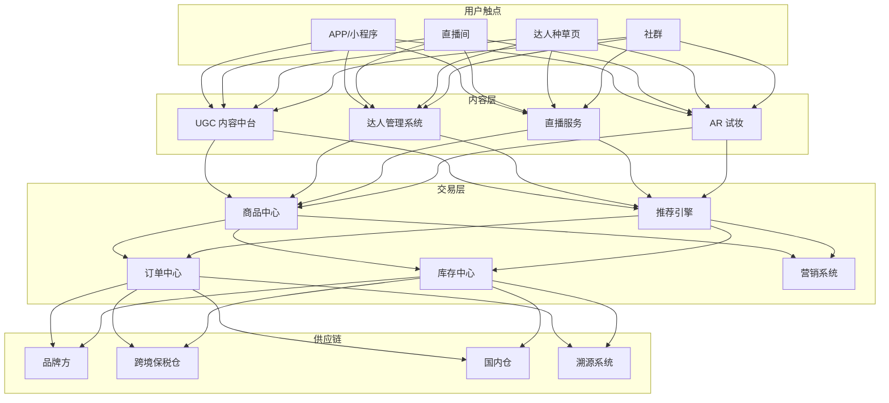
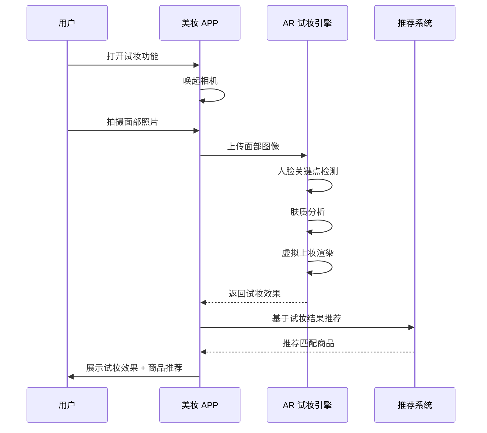
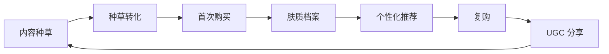

> **生产环境安全提示**
>
> 本文档包含可直接执行的运维命令。执行前请确认：当前目标集群与 Namespace 是否正确；是否具备足够的 RBAC 权限；是否已在非生产环境验证。命令风险等级标注：🔴 高风险（可能造成数据丢失或服务中断）、🟡 中风险（会修改集群状态，但通常可回滚）、🟢 低风险/只读（信息收集，无副作用）。


title: 美妆电商架构设计
description: '# 美妆电商架构设计 — 阿里云视角'
category: application-architecture
tags:
- k8s
- architecture
- industry
- redis
- mysql
- hpa
- operator
- rag
last_updated: 2026-05-18
difficulty: intermediate
reading_level: intermediate
audience:
- 电商架构师
- 云原生工程师
- SRE
- 解决方案架构师
estimated_read_time: 5min
intent_queries:
- 阿里云美妆电商解决方案 直播带货 K8s部署
- 美妆电商 AR试妆 [[Kubernetes|Kubernetes]] 架构
- 跨境美妆保税仓 电商架构设计
- 个性化推荐 美妆电商 技术架构
- 区块链溯源 化妆品防伪 架构
trigger_keywords:
- 美妆电商
- 种草
- 直播带货
- AR试妆
- 个性化推荐
- 正品溯源
- 跨境保税
- 阿里云
related_domains:
- 集群基础
- 生产运维
- domain-11-ai-infra
related_topics:
- 01-ecommerce-architecture
- 31-instant-retail
- 55-crossborder-dtc
authors:
- name: KUDIG Team
  role: contributor
k8s_versions:
- '1.28'
- '1.29'
- '1.30'
- '1.31'
- '1.32'
---

# 美妆电商架构设计 — 阿里云视角

> **适用版本**: Kubernetes v1.29 - v1.33 | **最后更新**: 2026-04-24
> **作者**: 阿里云解决方案架构师 | **标签**: `#美妆电商` `#种草` `#直播带货` `#阿里云`

---

## 目录

1. [行业背景](#1-行业背景)
2. [业务架构](#2-业务架构)
3. [技术架构](#3-技术架构)
4. [核心数据流](#4-核心数据流)
5. [安全与合规](#5-安全与合规)
6. [可观测性](#6-可观测性)
7. [阿里云组件映射](#7-阿里云组件映射)
8. [生产检查清单](#8-生产检查清单)

---

## 1. 行业背景

### 1.1 业务特点

美妆电商融合内容种草、直播带货、个性化推荐：

| 挑战 | 说明 | 架构影响 |
|:---|:---|:---|
| 内容驱动 | 图文/短视频种草转化 | 内容中台 + CDN |
| 个性化强 | 肤质/肤色/偏好差异大 | AI 推荐 + 智能试妆 |
| 直播爆发 | 大促期间流量 100x | 弹性伸缩 + 预热 |
| 假货风险 | 美妆品假货泛滥 | 溯源 + 正品验证 |
| 成分合规 | 各国化妆品法规差异 | 合规引擎 |

### 1.2 核心场景

- **内容种草**: UGC 图文/短视频 + 达人推荐
- **AI 试妆**: AR 虚拟试妆/试色
- **直播带货**: 美妆专场直播
- **个性化推荐**: 基于肤质/偏好的商品推荐
- **正品溯源**: 从品牌到消费者全链路追踪

---

## 2. 业务架构

### 2.1 美妆电商全景架构



### 2.2 AI 试妆时序



---

## 3. 技术架构

### 3.1 K8s 部署

```yaml
# 推荐引擎 Deployment
apiVersion: apps/v1
kind: Deployment
metadata:
  name: beauty-recommend
  namespace: beauty-ecommerce
spec:
  replicas: 8
  selector:
    matchLabels:
      app: beauty-recommend
  template:
    metadata:
      labels:
        app: beauty-recommend
    spec:
      affinity:
        podAntiAffinity:
          preferredDuringSchedulingIgnoredDuringExecution:
            - weight: 100
              podAffinityTerm:
                labelSelector:
                  matchExpressions:
                    - key: app
                      operator: In
                      values: [beauty-recommend]
                topologyKey: topology.kubernetes.io/zone
      containers:
        - name: recommend
          image: registry.cn-hangzhou.aliyuncs.com/beauty/recommend:v3.0.0
          ports:
            - containerPort: 8080
          env:
            - name: MODEL_PATH
              value: "/models/beauty-rec-v2"
            - name: REDIS_CLUSTER
              value: "redis-cluster:6379"
          resources:
            requests:
              memory: "4Gi"
              cpu: "2000m"
            limits:
              memory: "8Gi"
              cpu: "4000m"
          volumeMounts:
            - name: model-volume
              mountPath: /models
      volumes:
        - name: model-volume
          persistentVolumeClaim:
            claimName: beauty-model-pvc
```

```yaml
# 直播服务 HPA
apiVersion: autoscaling/v2
kind: HorizontalPodAutoscaler
metadata:
  name: live-stream-hpa
  namespace: beauty-ecommerce
spec:
  scaleTargetRef:
    apiVersion: apps/v1
    kind: Deployment
    name: live-stream-service
  minReplicas: 5
  maxReplicas: 100
  metrics:
    - type: Resource
      resource:
        name: cpu
        target:
          type: Utilization
          averageUtilization: 70
    - type: Pods
      pods:
        metric:
          name: concurrent_viewers
        target:
          type: AverageValue
          averageValue: "500"
```

---

## 4. 核心数据流

### 4.1 种草-转化-复购闭环



---

## 5. 安全与合规

- **正品溯源**: 区块链商品溯源
- **成分合规**: 各国化妆品成分法规
- **用户隐私**: 面部图像数据保护

---

## 6. 可观测性

- **试妆响应**: P99 < 2s
- **直播卡顿率**: < 1%
- **推荐 CTR**: > 10%

---

## 7. 阿里云组件映射

| 功能域 | **阿里云云原生方案** |
|:---|:---|
| 容器平台 | **ACK Pro** |
| AI 试妆 | **PAI / 视觉智能** |
| 直播 | **视频直播 + CDN** |
| 数据库 | **PolarDB MySQL** |
| 缓存 | **Redis 企业版** |
| 对象存储 | **OSS + CDN** |
| 区块链 | **蚂蚁链 BaaS** |
| 可观测性 | **ARMS + SLS** |

---

## 8. 生产检查清单

- [ ] AR 试妆准确率验证
- [ ] 直播弹性伸缩压测
- [ ] 正品溯源链路完整
- [ ] 成分合规数据库更新
- [ ] 面部图像隐私加密

---

**维护者**: 阿里云解决方案架构师团队 | **许可证**: MIT

---

## Obsidian 相关文档

- topic-application-architecture KUDIG Database — Global MOC
- [[04-应用模式/02-行业架构/README.md|[[Topic 应用层架构设计最佳实践|Topic 应用层架构设计最佳实践]]]]
- [[04-应用模式/02-行业架构/01-ecommerce-architecture.md|电商系统 Kubernetes 生产架构设计]]
- [[04-应用模式/02-行业架构/02-mini-program-architecture.md|小程序平台架构设计]]
- [[04-应用模式/02-行业架构/03-cms-architecture.md|内容管理系统 CMS 架构设计]]
- [[04-应用模式/02-行业架构/04-im-rtc-architecture.md|实时通信 IM/RTC 架构设计]]
- [[04-应用模式/02-行业架构/05-online-education-architecture.md|在线教育平台 Kubernetes 生产架构设计]]
- [[04-应用模式/02-行业架构/06-fintech-architecture.md|金融科技FinTech Kubernetes生产架构设计]]
- [[04-应用模式/02-行业架构/07-iot-platform-architecture.md|物联网 IoT 平台架构设计]]
- [[04-应用模式/02-行业架构/08-ai-ml-inference-architecture.md|AI/ML 推理服务 Kubernetes 生产架构设计]]
- [[04-应用模式/02-行业架构/09-gaming-backend-architecture.md|游戏后端 Kubernetes 生产架构设计]]
- [[04-应用模式/02-行业架构/10-social-media-architecture.md|社交媒体平台Kubernetes生产架构设计]]

## See Also

- 39-smart-campus
- 40-cloud-gaming
- 42-secondhand-circular
- 43-enterprise-im


<!-- risk-assessed -->
