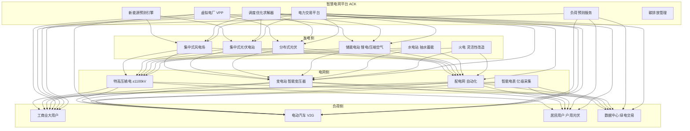
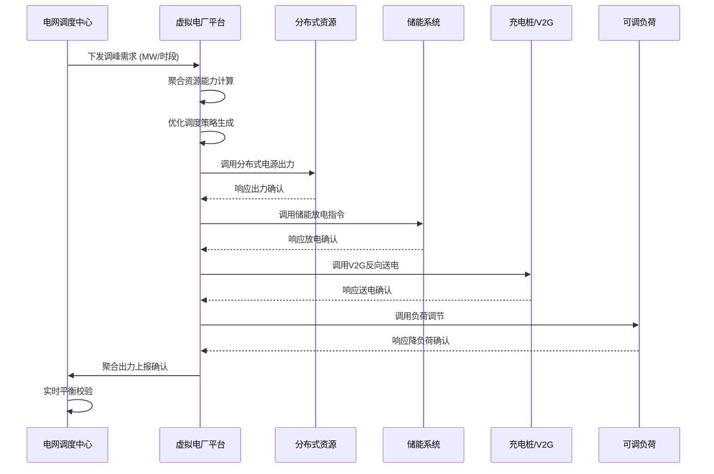
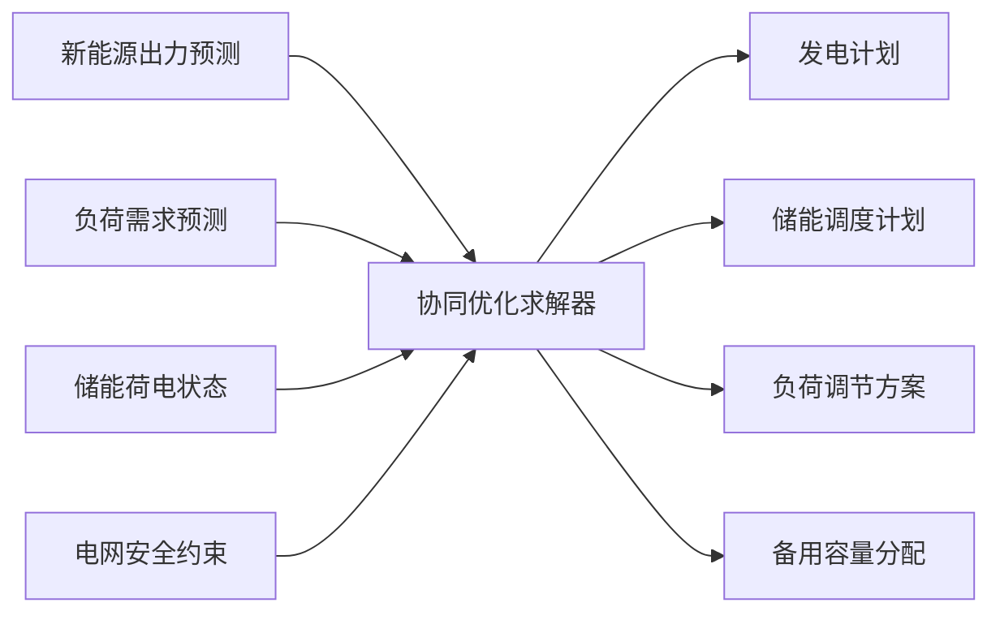
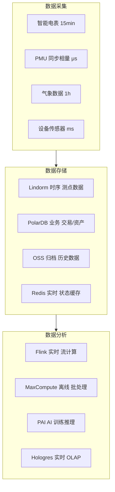

> **生产环境安全提示**
>
> 本文档包含可直接执行的运维命令。执行前请确认：当前目标集群与 Namespace 是否正确；是否具备足够的 RBAC 权限；是否已在非生产环境验证。命令风险等级标注：🔴 高风险（可能造成数据丢失或服务中断）、🟡 中风险（会修改集群状态，但通常可回滚）、🟢 低风险/只读（信息收集，无副作用）。


title: 智慧电网架构设计
description: '# 智慧电网架构设计 — 阿里云视角'
category: application-architecture
tags:
- k8s
- architecture
- industry
- [[flux|flux]]
- redis
- mysql
- postgresql
- kafka
- hpa
- [[daemonset|daemonset]]
last_updated: '2026-05-18'
difficulty: expert
reading_level: expert
audience:
- 电力系统架构师
- 能源互联网开发者
- AI预测工程师
- 阿里云解决方案架构师
estimated_read_time: 5min
intent_queries:
- 智慧电网系统架构设计
- 虚拟电厂VPP调度优化
- 新能源功率预测AI
- 电力时序数据库Lindorm
- 配电自动化边缘计算
trigger_keywords:
- 智慧电网
- 虚拟电厂
- VPP
- 新能源预测
- 负荷预测
- 电力现货
- 配电自动化
- 源网荷储
- 电力市场
- 等保三级
related_domains:
- 集群基础
- domain-9-ai-ml
- domain-5-iot-edge-computing
- domain-7-observability
related_topics:
- 应用模式/topic-application-architecture/96-carbon-capture
- 应用模式/topic-application-architecture/51-smart-manufacturing-mes
- 应用模式/topic-application-architecture/80-tsn-network
- 工作负载/topic-functions/05-iot-edge-computing
authors:
- name: KUDIG Team
  role: contributor
k8s_versions:
- '1.28'
- '1.29'
- '1.30'
- '1.31'
- '1.32'
---

# 智慧电网架构设计 — 阿里云视角

> **适用版本**: Kubernetes v1.29 - v1.33 | **最后更新**: 2026-04-24
> **作者**: 阿里云解决方案架构师 | **标签**: `#智慧电网` `#虚拟电厂` `#负荷预测` `#阿里云`

---

<!-- chunk: 目录 -->## 目录

1. [行业概述](#1-行业概述)
2. [业务场景](#2-业务场景)
3. [架构设计](#3-架构设计)
4. [核心技术栈](#4-核心技术栈)
5. [K8s 部署方案](#5-k8s-部署方案)
6. [数据架构](#6-数据架构)
7. [AI/ML 组件](#7-aiml-组件)
8. [安全合规](#8-安全合规)
9. [最佳实践](#9-最佳实践)
10. [反模式](#10-反模式)
11. [参考资源](#11-参考资源)

---

<!-- chunk: 1. 行业概述 -->## 1. 行业概述

## 1.1 行业背景

智慧电网是新型电力系统的核心基础设施，实现源网荷储协同互动。在"双碳"目标驱动下，中国电力系统正在经历从传统火电为主向新能源为主的深刻转型。截至 2025 年底，中国风电和光伏装机容量分别超过 4 亿千瓦和 6 亿千瓦，新能源占比持续提升。这一转型带来了电网运行方式的根本性变化：新能源出力具有间歇性和波动性，需要更加灵活的调度手段；分布式电源海量接入，需要更智能的配电网管理；电力市场化改革深入推进，需要支撑多样化的交易品种。

智慧电网平台的信息化需求涵盖：新能源功率预测（短期/超短期/长期）、虚拟电厂（VPP）资源聚合与调度、需求响应（DR）管理、配电自动化（FA）、源网荷储协同优化、电力现货市场交易。这些需求对计算资源（AI 推理+优化求解）、存储资源（海量时序测点数据）和实时性（毫秒级保护控制）提出了极高要求。

## 1.2 行业挑战

| 挑战 | 说明 | 架构影响 |
|:---|:---|:---|
| 新能源波动 | 风电/光伏间歇性出力，预测误差大 | AI 预测模型 + 储能调度优化 |
| 负荷峰谷差 | 用电高峰供需矛盾加剧，尖峰负荷频现 | 需求响应 + 虚拟电厂削峰填谷 |
| 分布式接入 | 海量分布式电源并网，即插即用需求 | 边缘计算 ACK@Edge + 协议适配 |
| 电网安全 | 网络攻击风险升高，国家级威胁 | 零信任架构 + 等保三级 |
| 实时平衡 | 发用电实时平衡，频率稳定要求高 | 毫秒级控制 + 安全自动装置 |
| 市场化交易 | 现货市场实时出清，多品种并行 | 高并发交易引擎 + 清算系统 |
| 海量数据 | 亿级智能电表数据采集，PB 级存储 | 时序数据库 Lindorm + 数据湖 |

## 1.3 市场格局

中国电网投资规模持续增长，"十四五"期间电网投资总额超过 3 万亿元。国家电网和南方电网是两大电网运营商，分别覆盖 26 个和 5 个省份。智慧电网建设由两大电网主导，同时也催生了一批技术服务商：国电南瑞、许继电气、国网信通等传统电力设备企业，以及阿里云、华为云等云服务商。虚拟电厂、电力交易、综合能源服务等细分赛道吸引了大量创新企业。

---

<!-- chunk: 2. 业务场景 -->## 2. 业务场景

## 2.1 新能源功率预测

风电和光伏功率预测是电网调度的基础。短期预测（未来 72 小时）用于日前计划和检修安排；超短期预测（未来 4 小时，15 分钟分辨率）用于实时调度和 AGC；长期预测（月度/年度）用于中长期交易。预测需要融合气象数据（NWP 数值天气预报）、历史功率数据、设备运行状态等多源数据，利用 AI 模型（LSTM、Transformer、图神经网络）进行高精度预测。

## 2.2 虚拟电厂（VPP）

虚拟电厂通过信息通信技术将分布式电源、储能、可调负荷等资源聚合起来，作为一个整体参与电网调度和电力市场。核心功能包括：资源注册与认证、实时状态监测、聚合能力评估、优化调度策略生成、指令下发与执行跟踪、收益结算。VPP 需要协调成千上万个分布式资源，响应电网调度指令的延迟要求 < 100ms。

## 2.3 需求响应（DR）

在电网负荷紧张时段，通过价格信号或激励机制引导用户侧调整用电行为。场景包括：削峰需求响应（降低高峰负荷）、填谷需求响应（增加低谷用电）、紧急需求响应（应对突发供需失衡）。需求响应管理需要实时监测负荷变化、快速计算可调容量、自动执行响应策略。

## 2.4 配电自动化

配电网问题的快速定位、隔离和恢复供电。核心功能包括：馈线自动化（FA）故障定位隔离、配电网自愈重构、分布式电源孤岛检测、配电网状态估计。配电自动化需要在毫秒级检测问题，在秒级完成隔离和转供。

## 2.5 源网荷储协同

多能互补优化调度是新型电力系统的核心运行模式。通过协调风电、光伏、水电、火电、储能、可调负荷等多种资源，在满足电网安全约束的前提下，实现经济最优调度。协同优化需要构建大规模数学规划模型（混合整数线性规划 MILP），求解时间要求在分钟级以内。

---

<!-- chunk: 3. 架构设计 -->## 3. 架构设计

## 3.1 智慧电网全景架构



## 3.2 虚拟电厂调度时序



## 3.3 源网荷储协同优化



---

<!-- chunk: 4. 核心技术栈 -->## 4. 核心技术栈

| 类别 | 开源工具/平台 | 阿里云方案 | 说明 |
|:---|:---|:---|:---|
| 功率预测 | Prophet, N-BEATS, Transformer | PAI 模型训练 | 风电/光伏功率预测 |
| 优化求解 | Pyomo, Gurobi, CPLEX | E-HPC 分布式求解 | MILP 调度优化 |
| 时序数据库 | InfluxDB, TDengine | Lindorm 时序引擎 | 亿级测点高频采集 |
| 实时计算 | Flink, Kafka Streams | 实时计算 Flink 版 | 功率/负荷实时计算 |
| 边缘计算 | KubeEdge, OpenYurt | ACK@Edge | 变电站/场站边缘 |
| 协议适配 | IEC 61850, IEC 104, Modbus | IoT 平台协议解析 | 电力设备通信 |
| 仿真建模 | PSS/E, PowerWorld, OpenDSS | E-HPC 仿真集群 | 电网潮流/稳定计算 |
| 数字孪生 | Unity, Cesium | DataV + 3D 可视化 | 电网全景可视化 |
| 消息队列 | Kafka, Pulsar | RocketMQ | 事件驱动/异步解耦 |
| 数据库 | MySQL, PostgreSQL | PolarDB + OceanBase | 结构化业务数据 |

---

<!-- chunk: 5. K8s 部署方案 -->## 5. K8s 部署方案

## 5.1 新能源预测引擎

```yaml
apiVersion: apps/v1
kind: Deployment
metadata:
  name: power-forecast-engine
  namespace: smart-grid
spec:
  replicas: 3
  selector:
    matchLabels:
      app: power-forecast
  template:
    metadata:
      labels:
        app: power-forecast
    spec:
      nodeSelector:
        accelerator: nvidia-t4
      runtimeClassName: nvidia
      affinity:
        podAntiAffinity:
          preferredDuringSchedulingIgnoredDuringExecution:
            - weight: 100
              podAffinityTerm:
                labelSelector:
                  matchLabels:
                    app: power-forecast
                topologyKey: topology.kubernetes.io/zone
      containers:
        - name: forecast
          image: registry.cn-hangzhou.aliyuncs.com/grid/power-forecast:v3.0.0-gpu
          ports:
            - containerPort: 8080
              name: http
            - containerPort: 9090
              name: metrics
          env:
            - name: FORECAST_HORIZON_HOURS
              value: "72"
            - name: FORECAST_RESOLUTION
              value: "15min"
            - name: WEATHER_API_KEY
              valueFrom:
                secretKeyRef:
                  name: weather-api-secret
                  key: key
            - name: LINDORM_URL
              valueFrom:
                secretKeyRef:
                  name: grid-db-secret
                  key: lindorm-url
            - name: MODEL_PATH
              value: "/models/wind-solar-transformer-v3"
          resources:
            requests:
              nvidia.com/gpu: 1
              memory: "8Gi"
              cpu: "4000m"
            limits:
              nvidia.com/gpu: 1
              memory: "16Gi"
              cpu: "8000m"
          volumeMounts:
            - name: model-storage
              mountPath: /models
      volumes:
        - name: model-storage
          persistentVolumeClaim:
            claimName: forecast-model-pvc
```

## 5.2 边缘测控 DaemonSet

```yaml
apiVersion: apps/v1
kind: DaemonSet
metadata:
  name: substation-edge-controller
  namespace: smart-grid
spec:
  selector:
    matchLabels:
      app: substation-edge-controller
  template:
    metadata:
      labels:
        app: substation-edge-controller
    spec:
      hostNetwork: true
      nodeSelector:
        node-type: substation-edge
      tolerations:
        - key: "dedicated"
          operator: "Equal"
          value: "power-grid"
          effect: "NoSchedule"
      containers:
        - name: controller
          image: registry.cn-hangzhou.aliyuncs.com/grid/substation-ctrl:v2.5.0
          securityContext:
            privileged: true
          env:
            - name: IEC61850_SERVER
              value: "192.168.100.1"
            - name: IEC104_SLAVE_ADDR
              value: "192.168.100.2:2404"
            - name: CONTROL_CYCLE_MS
              value: "100"
            - name: CLOUD_SYNC_URL
              value: "https://grid-platform.aliyuncs.com/api/edge/sync"
            - name: EDGE_NODE_ID
              valueFrom:
                fieldRef:
                  fieldPath: spec.nodeName
          resources:
            requests:
              memory: "2Gi"
              cpu: "2000m"
            limits:
              memory: "4Gi"
              cpu: "4000m"
          volumeMounts:
            - name: edge-data
              mountPath: /data
            - name: certs
              mountPath: /etc/certs
              readOnly: true
      volumes:
        - name: edge-data
          hostPath:
            path: /opt/grid/edge-data
            type: DirectoryOrCreate
        - name: certs
          secret:
            secretName: grid-edge-certs
```

## 5.3 VPP 调度优化服务

```yaml
apiVersion: apps/v1
kind: Deployment
metadata:
  name: vpp-optimizer
  namespace: smart-grid
spec:
  replicas: 2
  selector:
    matchLabels:
      app: vpp-optimizer
  template:
    metadata:
      labels:
        app: vpp-optimizer
    spec:
      containers:
        - name: optimizer
          image: registry.cn-hangzhou.aliyuncs.com/grid/vpp-optimizer:v2.0.0
          ports:
            - containerPort: 8080
          env:
            - name: SOLVER_TYPE
              value: "cplex"
            - name: MAX_RESOURCES
              value: "100000"
            - name: OPTIMIZATION_WINDOW_HOURS
              value: "24"
            - name: DB_URL
              valueFrom:
                secretKeyRef:
                  name: grid-db-secret
                  key: polardb-url
          resources:
            requests:
              memory: "16Gi"
              cpu: "8000m"
            limits:
              memory: "32Gi"
              cpu: "16000m"
```

---

<!-- chunk: 6. 数据架构 -->## 6. 数据架构

## 6.1 数据分层



## 6.2 数据存储策略

| 数据类型 | 存储方案 | 保留策略 | 写入频率 | 数据量级 |
|:---|:---|:---|:---|:---|
| 电表采集数据 | Lindorm 时序 | 3 年热 + 7 年冷 | 15 分钟 | 亿级测点 |
| PMU 相量数据 | Lindorm 时序 | 1 个月热 + 1 年冷 | 毫秒级 | TB/天 |
| 气象预报数据 | PolarDB + OSS | 1 年 | 1 小时 | GB/天 |
| 电力交易数据 | PolarDB MySQL | 永久 | 秒级 | GB/天 |
| 设备台账数据 | PolarDB MySQL | 永久 | 天级 | TB 级 |
| 调度指令日志 | OSS + SLS | 10 年 | 秒级 | TB/月 |

---

<!-- chunk: 7. AI/ML 组件 -->## 7. AI/ML 组件

## 7.1 AI 应用矩阵

| AI 场景 | 模型/算法 | 输入数据 | 输出 | 硬件需求 |
|:---|:---|:---|:---|:---|
| 风电功率预测 | Transformer + CNN | NWP + 历史功率 | 72h 功率曲线 | T4 GPU |
| 光伏功率预测 | LSTM + 注意力 | 辐照 + 云图 | 72h 功率曲线 | T4 GPU |
| 负荷预测 | Prophet + DeepAR | 历史负荷 + 气象 | 96 点负荷曲线 | CPU |
| VPP 资源评估 | 图神经网络 | 资源拓扑 + 历史 | 可调度容量 | CPU |
| 故障诊断 | CNN + 知识图谱 | 波形 + 告警 | 问题类型/位置 | T4 GPU |
| 线损分析 | XGBoost + 回归 | 量测数据 | 线损率/异常 | CPU |
| 电压越限预警 | LSTM 异常检测 | PMU 数据 | 预警信号 | CPU |
| 碳排放核算 | 规则引擎 + ML | 发电量 + 燃料 | 碳排放量 | CPU |

---

<!-- chunk: 8. 安全合规 -->## 8. 安全合规

## 8.1 安全体系

| 安全层级 | 措施 | 技术实现 |
|:---|:---|:---|
| 网络安全 | 生产控制区与管理信息区隔离 | 网闸 + VLAN + NetworkPolicy |
| 身份认证 | 统一身份认证与访问控制 | IDaaS + RBAC + MFA |
| 通信加密 | 电力数据传输加密 | TLS 1.3 + 国密 SM2/SM4 |
| 数据安全 | 敏感数据脱敏加密 | KMS + 字段级加密 |
| 审计追踪 | 操作日志不可篡改 | SLS 审计 + WORM 存储 |
| 安全监测 | 网络流量分析与入侵检测 | 云安全中心 +态势感知 |

## 8.2 合规框架

- **电力监控系统安全防护规定**: 安全分区、网络专用、横向隔离、纵向认证
- **等保 2.0 三级**: 电力关键信息基础设施等级保护
- **关键信息基础设施保护条例**: 电力 CII 安全保护要求
- **电力行业信息安全等级保护**: 行业专项合规
- **数据安全法**: 电力数据分类分级管理

---

<!-- chunk: 9. 最佳实践 -->## 9. 最佳实践

- **预测精度保障**: 风电预测准确率 > 85%，光伏 > 90%，通过集成学习和多模型融合提升精度
- **调度响应实时性**: VPP 调度指令端到端延迟 < 100ms，使用 Redis 缓存资源状态
- **边缘自治能力**: 变电站边缘节点断网后可独立运行 24 小时，保障基本控制功能
- **数据质量管理**: 建立测点数据质量评估体系，自动识别坏数据和缺失数据
- **弹性伸缩**: 应对午高峰和极端天气场景的计算弹性，使用 HPA + 预热策略
- **数字孪生**: 构建电网数字孪生模型，支持仿真推演和预案验证

---

<!-- chunk: 10. 反模式 -->## 10. 反模式

## 10.1 忽视电力安全分区

将生产控制区和管理信息区部署在同一网络平面，违反电力监控系统安全防护规定。

**解决方案**: 严格执行安全分区原则，生产控制区（I/II 区）与管理信息区（III/IV 区）通过网闸物理隔离，ACK 集群分别部署在不同安全区。

## 10.2 边缘节点无自治

边缘节点完全依赖云端控制，网络中断时变电站失去控制能力。

**解决方案**: 边缘节点部署 ACK@Edge，具备本地自治能力。关键控制逻辑在边缘本地执行，网络恢复后自动同步数据。

## 10.3 预测模型不更新

功率预测模型训练后长期不更新，模型老化导致预测精度持续下降。

**解决方案**: 建立模型自动重训练机制，每日使用最新数据增量训练，定期评估模型精度并触发全量重训。

---

<!-- chunk: 11. 参考资源 -->## 11. 参考资源

## 11.1 阿里云组件映射

| 功能域 | 阿里云云原生方案 | 说明 |
|:---|:---|:---|
| 容器平台 | **ACK Pro + ACK@Edge** | 中心+边缘云边协同 |
| AI 平台 | **PAI** | 功率预测模型训练与推理 |
| 时序数据库 | **Lindorm** | 亿级测点高频采集存储 |
| 实时计算 | **实时计算 Flink 版** | 功率/负荷实时流计算 |
| 关系数据库 | **PolarDB + OceanBase** | 交易/台账业务数据 |
| 对象存储 | **OSS + DLF** | 历史数据归档与数据湖 |
| IoT 平台 | **阿里云 IoT** | 设备接入与协议解析 |
| 数字孪生 | **DataV + 3D 可视化** | 电网全景数字孪生 |
| 可观测性 | **ARMS + SLS** | 全链路监控与审计 |

## 11.2 生产检查清单

- [ ] 新能源预测模型准确率验证（风电 > 85%，光伏 > 90%）
- [ ] 虚拟电厂资源聚合能力端到端测试
- [ ] 电网安全稳定约束校验通过
- [ ] 边缘测控实时性 < 100ms 验证
- [ ] 电力监控系统等保三级合规审计
- [ ] 边缘节点断网自治能力 24h 测试
- [ ] 数据质量管理体系建立
- [ ] 安全分区与网闸隔离验证

---

**维护者**: 阿里云解决方案架构师团队 | **许可证**: MIT

---

<!-- chunk: Obsidian 相关文档 -->## Obsidian 相关文档

- topic-application-architecture MOC
- [[04-应用模式/02-行业架构/README.md|Topic 应用层架构设计最佳实践]]
- [[04-应用模式/02-行业架构/01-ecommerce-architecture.md|电商系统 Kubernetes 生产架构设计]]
- [[04-应用模式/02-行业架构/02-mini-program-architecture.md|小程序平台架构设计]]
- [[04-应用模式/02-行业架构/03-cms-architecture.md|内容管理系统 CMS 架构设计]]
- [[04-应用模式/02-行业架构/04-im-rtc-architecture.md|实时通信 IM/RTC 架构设计]]
- [[04-应用模式/02-行业架构/05-online-education-architecture.md|在线教育平台 Kubernetes 生产架构设计]]
- [[04-应用模式/02-行业架构/06-fintech-architecture.md|金融科技FinTech Kubernetes生产架构设计]]
- [[04-应用模式/02-行业架构/07-iot-platform-architecture.md|物联网 IoT 平台架构设计]]
- [[04-应用模式/02-行业架构/08-ai-ml-inference-architecture.md|AI/ML 推理服务 Kubernetes 生产架构设计]]
- [[04-应用模式/02-行业架构/09-gaming-backend-architecture.md|游戏后端 Kubernetes 生产架构设计]]
- [[04-应用模式/02-行业架构/10-social-media-architecture.md|社交媒体平台Kubernetes生产架构设计]]

## See Also

- 59-industrial-internet-platform
- 60-v2x-autonomous-driving
- 62-distributed-energy
- 63-industrial-visual-inspection

## Related

- topic-application-architecture MOC — Cross-reference


<!-- risk-assessed -->
