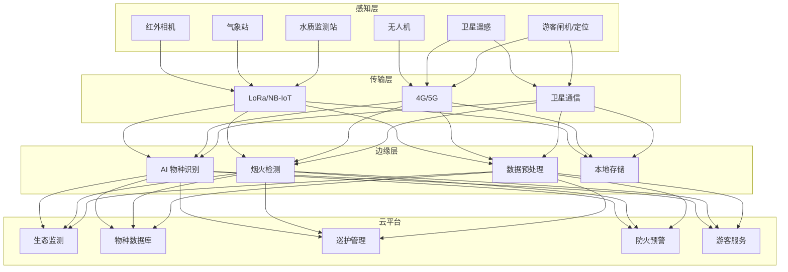

> **生产环境安全提示**
>
> 本文档包含可直接执行的运维命令。执行前请确认：当前目标集群与 Namespace 是否正确；是否具备足够的 RBAC 权限；是否已在非生产环境验证。命令风险等级标注：🔴 高风险（可能造成数据丢失或服务中断）、🟡 中风险（会修改集群状态，但通常可回滚）、🟢 低风险/只读（信息收集，无副作用）。


title: 国家公园智慧化架构设计
description: '# 国家公园架构设计 — 阿里云视角'
category: application-architecture
tags:
- k8s
- architecture
- industry
- scheduler
- gpu
- nvidia
last_updated: 2026-05-18
difficulty: intermediate
reading_level: intermediate
audience:
- 国家公园信息化建设负责人
- IoT架构师
- 环保领域工程师
estimated_read_time: 5min
intent_queries:
- 国家公园智慧巡护 IoT 监测系统
- 野生动物 AI 物种识别监测
- 森林防火预警系统架构
- 边缘计算 LoRa 广覆盖
- 阿里云 ACK Edge 野外部署
trigger_keywords:
- 国家公园
- 智慧巡护
- 野生动物监测
- AI物种识别
- 红外相机
- 森林防火
- LoRa广域网
- 边缘计算
- 生态保护
- 卫星通信
related_domains:
- 网络
- 故障诊断
related_topics:
- topic-iot-platform-architecture
- topic-edge-computing
authors:
- name: KUDIG Team
  role: contributor
k8s_versions:
- '1.28'
- '1.29'
- '1.30'
- '1.31'
- '1.32'
---

# 国家公园架构设计 — 阿里云视角

> **适用版本**: [[kubernetes|Kubernetes]] v1.29 - v1.33 | **最后更新**: 2026-04-24
> **作者**: 阿里云解决方案架构师 | **标签**: `#国家公园` `#生态保护` `#智慧巡护` `#阿里云`

---

## 目录

1. [概述](#1-概述)
2. [设计原则](#2-设计原则)
3. [架构模式](#3-架构模式)
4. [实现示例](#4-实现示例)
5. [在 Kubernetes 上的部署](#5-在-kubernetes-上的部署)
6. [最佳实践](#6-最佳实践)
7. [反模式](#7-反模式)
8. [参考资源](#8-参考资源)

---

## 1. 概述

国家公园是自然保护地体系的顶层设计，以保护具有国家代表性的自然生态系统为核心目的。中国已设立三江源、大熊猫、东北虎豹、海南热带雨林、武夷山等第一批国家公园，总面积约 23 万平方公里。国家公园的信息化建设目标是利用物联网、AI、大数据等技术实现生态保护的科学化、巡护管理的智能化、游客服务的便捷化。

国家公园信息化面临独特挑战：监测范围广（数万平方公里）、通信基础设施薄弱（偏远地区无 4G/5G 覆盖）、设备环境恶劣（高海拔/深林/湿地）、电力供应困难（离网供电）、数据类型多样（红外相机图像/声纹/气象/水质/卫星遥感）。这些约束决定了系统必须采用卫星通信+LoRa/NB-IoT+边缘计算+云平台的组合架构。

### 1.1 行业背景

| 挑战 | 说明 | 架构影响 |
|:---|:---|:---|
| 面积大 | 数万平方公里监测 | 卫星遥感+无人机+地面传感器 |
| 环境恶劣 | 高海拔/深林/湿地 | 工业级耐候设备+太阳能供电 |
| 物种保护 | 珍稀动植物监测 | AI 识别+个体追踪 |
| 防火防灾 | 森林火灾/地质灾害 | 实时预警+应急响应 |
| 游客管理 | 生态旅游与保护平衡 | 预约/分流/承载量控制 |

### 1.2 核心场景

- **生态监测**: 水质/空气/土壤/植被/气象等多要素长期监测
- **野生动物监测**: 红外相机/声纹识别/无人机巡检/AI 物种识别
- **智慧巡护**: 巡护轨迹管理/事件上报/应急调度
- **防火预警**: 卫星热点监测/视频烟火识别/气象风险分析
- **游客服务**: 预约入园/智慧导览/科普教育/安全预警

---

## 2. 设计原则

### 2.1 低功耗广覆盖原则

国家公园的大部分区域缺乏电网和通信网络覆盖。传感器和监测设备需要采用低功耗设计（太阳能+蓄电池供电，续航 > 6 个月），使用 LoRa/NB-IoT 等低功耗广域网络（LPWAN）传输数据。

### 2.2 边缘优先原则

在公园管理中心部署边缘计算节点，实现 AI 物种识别、烟火检测等实时分析。原始图像和视频数据量大，不适合全部上传云端。边缘节点在本地完成分析后，只上传识别结果和告警信息。

### 2.3 非干扰原则

监测系统不得干扰野生动物的正常活动。红外相机使用无闪光设计，声学监测设备使用被动采集模式，无人机巡检保持安全距离。所有监测数据用于保护决策，不得用于商业目的。

### 2.4 数据共享原则

生态监测数据属于公共资源，应在符合安全要求的前提下向科研机构和公众开放。建立数据共享平台，提供标准化的数据访问 API，支撑跨机构科学研究和公众科普教育。

---

## 3. 架构模式

### 3.1 国家公园全景架构



---

## 4. 实现示例

### 4.1 AI 物种识别服务

```python
from dataclasses import dataclass
from typing import List

@dataclass
class SpeciesDetection:
    species_name: str
    confidence: float
    bbox: tuple
    individual_id: str = ""

class WildlifeRecognizer:
    def detect(self, image_path: str) -> List[SpeciesDetection]:
        detections = self._run_model(image_path)
        results = []
        for det in detections:
            if det['confidence'] > 0.5:
                individual = self._match_individual(det)
                results.append(SpeciesDetection(
                    species_name=det['class'],
                    confidence=det['confidence'],
                    bbox=det['bbox'],
                    individual_id=individual,
                ))
        return results

    def _run_model(self, image_path: str) -> list:
        return []

    def _match_individual(self, detection: dict) -> str:
        return ""
```

### 4.2 巡护调度系统

```go
package patrol

import (
    "time"
)

type PatrolTask struct {
    ID          string
    RouteID     string
    RangerID    string
    StartTime   time.Time
    EndTime     time.Time
    Status      string
    Events      []PatrolEvent
}

type PatrolEvent struct {
    Type      string
    Latitude  float64
    Longitude float64
    Timestamp time.Time
    Photos    []string
    Notes     string
}

type PatrolScheduler struct {
    tasks  map[string]*PatrolTask
}

func (ps *PatrolScheduler) CreateTask(task *PatrolTask) error {
    ps.tasks[task.ID] = task
    return nil
}
```

---

## 5. 在 Kubernetes 上的部署

```yaml
apiVersion: apps/v1
kind: Deployment
metadata:
  name: wildlife-recognition
  namespace: national-park
spec:
  replicas: 2
  selector:
    matchLabels:
      app: wildlife-recognition
  template:
    metadata:
      labels:
        app: wildlife-recognition
    spec:
      nodeSelector:
        accelerator: nvidia-t4
      runtimeClassName: nvidia
      containers:
        - name: recognizer
          image: registry.cn-hangzhou.aliyuncs.com/park/wildlife-recognition:v2.0.0-gpu
          env:
            - name: SPECIES_DATABASE
              value: "/data/species-db"
            - name: CONFIDENCE_THRESHOLD
              value: "0.5"
          resources:
            requests:
              nvidia.com/gpu: 1
              memory: "8Gi"
              cpu: "4000m"
            limits:
              nvidia.com/gpu: 1
              memory: "16Gi"
              cpu: "8000m"
```

---

## 6. 最佳实践

- **太阳能+蓄电池**: 野外设备采用太阳能板+蓄电池供电，续航 6 个月以上
- **LoRa 组网**: 使用 LoRa 网关+终端的组网方式，覆盖半径 5-15km
- **AI 边缘识别**: 红外相机图像在边缘节点进行 AI 识别，减少数据传输量
- **数据开放**: 生态数据通过标准 API 向科研机构开放

## 7. 反模式

- **4G 全覆盖思路**: 试图在全部区域建设 4G 网络，成本极高。应使用 LoRa+卫星混合通信
- **实时视频回传**: 将所有红外相机视频实时回传，带宽不够。应在边缘做 AI 筛选
- **忽视设备耐候性**: 使用普通商用设备部署在野外，很快损坏。应采用工业级防水防尘设备

---

## 8. 参考资源

### 8.1 阿里云组件映射

| 功能域 | **阿里云云原生方案** |
|:---|:---|
| 容器平台 | **ACK Edge** |
| IoT | **阿里云 IoT 平台** |
| AI | **PAI + 视觉智能** |
| 数据库 | **PolarDB + Lindorm** |
| 对象存储 | **OSS** |
| 可观测性 | **ARMS + SLS** |

### 8.2 生产检查清单

- [ ] 物种识别模型准确率 > 90%
- [ ] 火情预警误报率 < 5%
- [ ] 野外设备续航 > 6 个月
- [ ] 游客承载量系统压力测试
- [ ] 生态数据隐私保护

---

**维护者**: 阿里云解决方案架构师团队 | **许可证**: MIT

---

## Obsidian 相关文档

- topic-application-architecture KUDIG Database — Global MOC
- [[04-应用模式/02-行业架构/README.md|[[37-归档/domain-indexes/app-patterns/README-from-domain-42|Topic 应用层架构设计最佳实践]]]]
- [[04-应用模式/02-行业架构/01-ecommerce-architecture.md|电商系统 Kubernetes 生产架构设计]]
- [[04-应用模式/02-行业架构/02-mini-program-architecture.md|小程序平台架构设计]]
- [[04-应用模式/02-行业架构/03-cms-architecture.md|内容管理系统 CMS 架构设计]]
- [[04-应用模式/02-行业架构/04-im-rtc-architecture.md|实时通信 IM/RTC 架构设计]]
- [[04-应用模式/02-行业架构/05-online-education-architecture.md|在线教育平台 Kubernetes 生产架构设计]]
- [[04-应用模式/02-行业架构/06-fintech-architecture.md|金融科技FinTech Kubernetes生产架构设计]]
- [[04-应用模式/02-行业架构/07-iot-platform-architecture.md|物联网 IoT 平台架构设计]]
- [[04-应用模式/02-行业架构/08-ai-ml-inference-architecture.md|AI/ML 推理服务 Kubernetes 生产架构设计]]
- [[04-应用模式/02-行业架构/09-gaming-backend-architecture.md|游戏后端 Kubernetes 生产架构设计]]
- [[04-应用模式/02-行业架构/10-social-media-architecture.md|社交媒体平台Kubernetes生产架构设计]]

## See Also

- 82-legaltech
- 83-cultural-digitization
- 85-hydrogen-energy
- 86-solid-state-battery

## Related

- topic-application-architecture MOC — Cross-reference


<!-- risk-assessed -->
