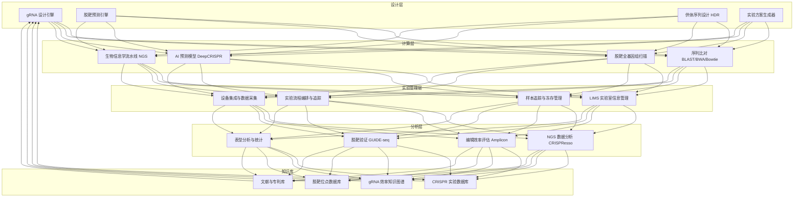

> **生产环境安全提示**
>
> 本文档包含可直接执行的运维命令。执行前请确认：当前目标集群与 Namespace 是否正确；是否具备足够的 RBAC 权限；是否已在非生产环境验证。命令风险等级标注：🔴 高风险（可能造成数据丢失或服务中断）、🟡 中风险（会修改集群状态，但通常可回滚）、🟢 低风险/只读（信息收集，无副作用）。


title: 基因编辑CRISPR架构设计
description: '# 基因编辑 CRISPR 架构设计 — 阿里云视角'
category: application-architecture
tags:
- k8s
- architecture
- industry
- docker
- mysql
- job
- rbac
- [[NetworkPolicy|networkpolicy]]
- gpu
last_updated: 2026-05-18
difficulty: expert
reading_level: expert
audience:
- 生物科技IT负责人
- 基因治疗研究员
- 计算生物学工程师
- HPC架构师
estimated_read_time: 5min
intent_queries:
- CRISPR gene editing [[Kubernetes|kubernetes]] architecture
- 基因编辑K8s高性能计算
- gRNA设计AI平台
- 脱靶检测HPC架构
- 生物信息学K8s
trigger_keywords:
- CRISPR
- 基因编辑
- gRNA
- 脱靶检测
- 基因治疗
- 生物信息学
- CRISPR架构
- 基因编辑K8s
- NGS分析
- 基因组数据
related_domains:
- 集群基础
- 网络
related_topics:
- nanomaterials
- solid-state-battery
- smart-elderly-care
authors:
- name: KUDIG Team
  role: contributor
k8s_versions:
- '1.28'
- '1.29'
- '1.30'
- '1.31'
- '1.32'
---

# 基因编辑 CRISPR 架构设计 — 阿里云视角

> **适用版本**: Kubernetes v1.29 - v1.33 | **最后更新**: 2026-04-24
> **作者**: 阿里云解决方案架构师 | **标签**: `#CRISPR` `#基因编辑` `#gRNA设计` `#脱靶检测` `#阿里云`

---

<!-- chunk: 目录 -->## 目录

1. [行业概述](#1-行业概述)
2. [业务场景](#2-业务场景)
3. [架构设计](#3-架构设计)
4. [核心技术栈](#4-核心技术栈)
5. [K8s 部署方案](#5-k8s-部署方案)
6. [数据架构](#6-数据架构)
7. [AI/ML 组件](#7-aiml-组件)
8. [安全合规](#8-安全合规)
9. [最佳实践](#9-最佳实践)
10. [反模式](#10-反模式)
11. [参考资源](#11-参考资源)

---

<!-- chunk: 1. 行业概述 -->## 1. 行业概述

## 1.1 行业背景

CRISPR-Cas9 基因编辑技术是 21 世纪最具革命性的生物技术突破，2020 年 Jennifer Doudna 和 Emmanuelle Charpentier 因此获得诺贝尔化学奖。CRISPR 利用引导 RNA（gRNA）引导 Cas9 蛋白到靶 DNA 位点，实现双链断裂和精准编辑。该技术广泛应用于基础研究（基因功能解析）、药物开发（靶点验证/细胞治疗）、农业育种（抗病/高产作物）、基因治疗（镰刀贫血症/杜氏肌营养不良症已进入临床）。

CRISPR 基因编辑平台的信息化需求涵盖设计、计算、实验和分析四个阶段。gRNA 设计阶段需要 AI 模型预测引导序列的效率和特异性；脱靶分析阶段需要全基因组范围搜索可能的脱靶位点（比对数十亿碱基）；实验数据管理阶段需要 LIMS 系统管理样本和实验流程；结果分析阶段需要生物信息学流水线处理 NGS 测序数据评估编辑效率。

## 1.2 行业挑战

| 挑战 | 说明 | 架构影响 |
|:---|:---|:---|
| gRNA 设计复杂 | 高效特异的引导 RNA 设计需要多维度评估 | AI 预测模型 + 多指标排序 |
| 脱靶检测 | 非预期编辑位点的全基因组搜索 | 高性能比对引擎 + GPU 加速 |
| 实验设计复杂 | 多重编辑/大片段删除/碱基编辑方案 | 自动化设计 + 方案生成 |
| 数据量大 | NGS 测序数据 TB 级，全基因组比对 CPU 密集 | 分布式计算 + E-HPC |
| 伦理合规 | 人类基因编辑严格限制，生殖系编辑全球禁止 | 审批流程 + 数据隔离 + 审计 |
| 可复现性 | 实验条件和参数记录不完整导致结果不可复现 | 版本化 + 容器化 + 全流程记录 |
| 知识积累 | 编辑效率和脱靶经验分散在文献和实验室 | 知识图谱 + 数据库 |

## 1.3 市场格局

全球 CRISPR 基因编辑市场快速增长，预计到 2030 年将超过 100 亿美元。Editas Medicine、CRISPR Therapeutics、Intellia Therapeutics、Beam Therapeutics 是全球领先的基因编辑治疗公司。中国在该领域发展迅速，编辑治疗（EDITAS 中国合作伙伴）、博雅辑因、瑞风生物等企业正在推进多个临床项目。工具端，Synthego、IDT、Twist Bioscience 提供 gRNA 合成和 CRISPR 试剂盒。计算工具方面，Benchling、BenchSci 提供 SaaS 化的基因设计平台。

---

<!-- chunk: 2. 业务场景 -->## 2. 业务场景

## 2.1 gRNA 设计与筛选

gRNA 设计是 CRISPR 实验的第一步也是最关键的步骤。设计流程：输入目标基因区域→搜索所有 NGG PAM 位点→候选 gRNA 序列提取→On-target 效率预测（DeepCRISPR/Azimuth 模型评分）→Off-target 脱靶评分（全基因组比对）→GC 含量/二级结构/特异性评估→多维度加权排序输出 Top-N 候选。高优先级的 gRNA 需要同时满足高编辑效率（On-target > 80%）和低脱靶风险（Off-target 位点 < 5 个）。

## 2.2 脱靶分析

全基因组脱靶位点检测和风险评估是 CRISPR 安全性的关键保障。计算预测方法：将候选 gRNA 序列与参考基因组进行比对（允许 1-4 个错配），记录所有潜在脱靶位点，综合评估位置、错配类型、染色体区域等因素给出脱靶评分。实验验证方法：GUIDE-seq（全基因组脱靶检测）、CIRCLE-seq（体外脱靶检测）、DISCOVER-seq（细胞内脱靶检测）。脱靶分析需要高性能比对引擎，人类基因组 30 亿碱基的比对在 CPU 密集模式下需要数十分钟。

## 2.3 细胞系构建

基因敲除/敲入实验管理是 CRISPR 实验平台的核心功能。流程包括：实验方案设计（gRNA 选择/供体模板设计/递送方式选择）→质粒/病毒制备→细胞转染/电转→抗生素筛选/单克隆分离→基因型鉴定（PCR+Sanger 测序/NGS 测序）→表型验证。平台需要管理整个流程的样本追踪、实验记录、数据存储和结果分析。

## 2.4 功能筛选

CRISPR 文库筛选用于全基因组规模的功能基因发现。场景包括：全基因组 CRISPR 敲除文库（GeCKO/ Brunello）筛选耐药基因、癌细胞必需基因、免疫治疗靶点等。流程：文库设计与合成→慢病毒包装与感染（MOI < 0.3）→选择压力施加→基因组 DNA 提取→NGS 测序→sgRNA 丰度分析（MAGeCK/RIGER）→候选基因鉴定。

## 2.5 基因治疗

体内/体外基因编辑的临床前研究。体外编辑（Ex vivo）：细胞提取→基因编辑→扩增→回输（如 CAR-T 细胞治疗）。体内编辑（In vivo）：AAV/LNP 递送 CRISPR 系统到目标组织。基因治疗场景需要符合 GMP/GCP 规范，数据管理需要满足 FDA/NMPA 监管要求。

---

<!-- chunk: 3. 架构设计 -->## 3. 架构设计

## 3.1 CRISPR 平台全景架构



## 3.2 gRNA 设计流程


## 3.3 实验数据管理


---

<!-- chunk: 4. 核心技术栈 -->## 4. 核心技术栈

| 类别 | 开源工具 | 阿里云方案 | 说明 |
|:---|:---|:---|:---|
| gRNA 设计 | CHOPCHOP, GuideScan, CRISPOR | 自研 AI 模型部署 PAI-EAS | gRNA 候选搜索与评分 |
| 脱靶预测 | Cas-OFFinder, FlashFry, CRISPRitz | E-HPC 高性能比对 | 全基因组脱靶扫描 |
| On-target 预测 | DeepCRISPR, Azimuth, CRISPRscan | PAI 模型训练推理 | 编辑效率预测 |
| 序列比对 | BWA, Bowtie2, BLAST+ | ACK 批处理 Job | 全基因组比对 |
| NGS 分析 | CRISPResso2, Amplicon-seq | Argo Workflows 流水线 | 编辑效率评估 |
| 文库分析 | MAGeCK, PinAPL-Py | MaxCompute 分布式计算 | sgRNA 丰度分析 |
| 基因组浏览 | IGV, JBrowse | Web 版本部署 | 结果可视化 |
| 实验管理 | LabKey, 自研 LIMS | PolarDB + Web 前端 | 实验数据管理 |
| 数据格式 | FASTQ, BAM, VCF, BED | OSS 存储 | 标准生物信息格式 |

---

<!-- chunk: 5. K8s 部署方案 -->## 5. K8s 部署方案

## 5.1 gRNA 设计服务

```yaml
apiVersion: apps/v1
kind: Deployment
metadata:
  name: grna-design-service
  namespace: crispr
spec:
  replicas: 3
  selector:
    matchLabels:
      app: grna-design
  template:
    metadata:
      labels:
        app: grna-design
    spec:
      affinity:
        podAntiAffinity:
          preferredDuringSchedulingIgnoredDuringExecution:
            - weight: 100
              podAffinityTerm:
                labelSelector:
                  matchLabels:
                    app: grna-design
                topologyKey: topology.kubernetes.io/zone
      containers:
        - name: design
          image: registry.cn-hangzhou.aliyuncs.com/crispr/grna-design:v3.0.0
          ports:
            - containerPort: 8080
          env:
            - name: MODEL_PATH
              value: "/models/deepcrispr-v3"
            - name: GENOME_REF_PATH
              value: "/data/genomes"
            - name: OFFTARGET_ENGINE
              value: "cas-offinder"
            - name: DB_URL
              valueFrom:
                secretKeyRef:
                  name: crispr-db-secret
                  key: url
          resources:
            requests:
              memory: "8Gi"
              cpu: "4000m"
            limits:
              memory: "16Gi"
              cpu: "8000m"
          volumeMounts:
            - name: models
              mountPath: /models
            - name: genomes
              mountPath: /data/genomes
              readOnly: true
      volumes:
        - name: models
          persistentVolumeClaim:
            claimName: crispr-models-pvc
        - name: genomes
          persistentVolumeClaim:
            claimName: genome-ref-pvc
```

## 5.2 脱靶分析批处理

```yaml
apiVersion: batch/v1
kind: Job
metadata:
  name: offtarget-analysis-{{ANALYSIS_ID}}
  namespace: crispr
  labels:
    pipeline: offtarget-analysis
spec:
  backoffLimit: 3
  ttlSecondsAfterFinished: 86400
  template:
    spec:
      containers:
        - name: analysis
          image: registry.cn-hangzhou.aliyuncs.com/crispr/off-target:v2.0.0
          command: ["python", "analyze_offtarget.py"]
          args:
            - "--grna-sequence"
            - "{{GRNA_SEQ}}"
            - "--genome-ref"
            - "hg38"
            - "--max-mismatches"
            - "4"
            - "--output"
            - "/output/offtarget_results.json"
          env:
            - name: GENOME_REF
              value: "hg38"
            - name: ANALYSIS_ID
              value: "{{ANALYSIS_ID}}"
          resources:
            requests:
              memory: "32Gi"
              cpu: "16000m"
            limits:
              memory: "64Gi"
              cpu: "32000m"
          volumeMounts:
            - name: genome-data
              mountPath: /data/genomes
              readOnly: true
            - name: output
              mountPath: /output
      volumes:
        - name: genome-data
          persistentVolumeClaim:
            claimName: genome-ref-pvc
        - name: output
          persistentVolumeClaim:
            claimName: crispr-output-pvc
      restartPolicy: Never
```

## 5.3 NGS 分析流水线

```yaml
apiVersion: argoproj.io/v1alpha1
kind: Workflow
metadata:
  name: crispr-ngs-analysis
  namespace: crispr
spec:
  entrypoint: ngs-pipeline
  templates:
    - name: ngs-pipeline
      dag:
        tasks:
          - name: quality-control
            template: fastqc
          - name: trim
            template: trimmomatic
            dependencies: [quality-control]
          - name: align
            template: bwa-align
            dependencies: [trim]
          - name: crisperesso
            template: edit-efficiency
            dependencies: [align]
    - name: fastqc
      container:
        image: biocontainers/fastqc:v0.12.1
        command: [fastqc]
        args: ["/input/{{inputs.parameters.fastq}}", "-o", "/output"]
    - name: trimmomatic
      container:
        image: biocontainers/trimmomatic:v0.39
        command: [trimmomatic]
    - name: bwa-align
      container:
        image: biocontainers/bwa:v0.7.17
        command: [bwa, mem]
    - name: edit-efficiency
      container:
        image: registry.cn-hangzhou.aliyuncs.com/crispr/crispresso:v2.2.0
        command: ["CRISPResso"]
        args: ["--fastq_r1", "/input/trimmed.fastq", "--amplicon_seq", "{{inputs.parameters.amplicon}}"]
```

---

<!-- chunk: 6. 数据架构 -->## 6. 数据架构

## 6.1 数据分层

| 数据类型 | 存储方案 | 格式 | 保留策略 | 数据量 |
|:---|:---|:---|:---|:---|
| 参考基因组 | OSS 标准存储 | FASTA/FAI | 永久 | GB 级/物种 |
| gRNA 设计结果 | PolarDB MySQL | JSON/关系 | 永久 | MB 级/次 |
| 脱靶分析结果 | PolarDB + OSS | JSON/BED | 永久 | MB 级/次 |
| NGS 测序数据 | OSS 归档 | FASTQ/BAM/VCF | 永久 | GB-TB/次 |
| 实验记录 | PolarDB MySQL | 关系 | 10 年 | GB 级 |
| 知识库 | 图数据库 GDB | 三元组 | 永久 | TB 级 |

---

<!-- chunk: 7. AI/ML 组件 -->## 7. AI/ML 组件

| AI 场景 | 模型/算法 | 输入 | 输出 | 说明 |
|:---|:---|:---|:---|:---|
| On-target 预测 | DeepCRISPR (CNN) | gRNA 序列 + 染色体特征 | 编辑效率评分 0-1 | 深度学习模型 |
| Off-target 预测 | CRISPRnet (RNN) | gRNA + 候选脱靶序列 | 脱靶概率评分 | 序列比对+ML |
| gRNA 特异性 | Azimuth 2.0 | 30nt 序列特征 | 规则化评分 | 随机森林 |
| 编辑效率优化 | Transformer | 历史实验数据 | 最优 gRNA 推荐 | 迁移学习 |
| 实验异常检测 | LSTM Autoencoder | 设备传感器流 | 异常告警 | 时序异常检测 |
| 文献知识抽取 | NER + 关系抽取 | PubMed 文献 | 基因-疾病关联 | BERT-based |

---

<!-- chunk: 8. 安全合规 -->## 8. 安全合规

## 8.1 安全体系

| 安全层级 | 措施 | 技术实现 |
|:---|:---|:---|
| 基因数据隐私 | 基因组数据端到端加密 | AES-256 + KMS 密钥管理 |
| 访问控制 | 基于角色的细粒度权限 | RBAC + 项目级隔离 |
| 伦理审查 | 人类基因编辑强制审批 | 工作流审批 + 电子签名 |
| 数据隔离 | 不同物种/项目数据隔离 | Namespace + NetworkPolicy |
| 审计追踪 | 所有操作可追溯 | SLS 审计日志 + 不可篡改 |
| 致病筛查 | 基因合成自动筛查 | BLAST 比对致病数据库 |

## 8.2 合规框架

- **生物安全法**: 基因编辑生物安全管理，高风险实验审批
- **人类遗传资源管理条例**: 基因组数据出境审批，采样知情同意
- **赫尔辛基宣言**: 人体实验伦理原则
- **FDA/EMA/NMPA**: 基因治疗产品监管要求
- **GMP/GLP/GCP**: 药品生产/实验室/临床试验质量管理规范

---

<!-- chunk: 9. 最佳实践 -->## 9. 最佳实践

- **gRNA 设计优化**: 使用 DeepCRISPR 等深度学习模型预测 gRNA 活性，结合 GC 含量、二级结构和脱靶评分多维度评估
- **脱靶全面分析**: 结合计算预测（Cas-OFFinder 全基因组扫描）和实验验证（GUIDE-seq/CIRCLE-seq），不依赖单一方法
- **数据版本化**: 使用 DVC 管理参考基因组和实验数据，确保分析可复现
- **容器化生信软件**: 使用 Docker/Singularity 封装生物信息学软件（BWA、GATK、CRISPResso），避免版本依赖问题
- **知识库沉淀**: 将每次实验的 gRNA、编辑条件、编辑效率等数据结构化存储到知识库，为后续设计提供参考
- **伦理前置审查**: 在实验设计阶段嵌入伦理审查流程，涉及人类基因编辑的实验必须经伦理委员会审批后方可执行

---

<!-- chunk: 10. 反模式 -->## 10. 反模式

## 10.1 忽视脱靶风险

仅依赖计算预测脱靶位点，不进行实验验证，可能遗漏实际存在的脱靶编辑。

**解决方案**: 计算预测和实验验证双管齐下。使用 GUIDE-seq/CIRCLE-seq 等无偏倚方法进行全基因组脱靶检测，将实验结果反馈优化预测模型。

## 10.2 基因数据明文存储

基因组数据未加密存储在服务器上，存在数据泄露风险。

**解决方案**: 所有基因组数据使用 AES-256 加密存储（KMS 管理密钥），传输过程使用 TLS 1.3。脱敏展示（只显示编辑位点附近序列）。

## 10.3 忽视伦理审批

跳过伦理审查直接进行人类基因编辑实验，违反法规和伦理原则。

**解决方案**: 建立强制的电子化伦理审批流程，涉及人类基因编辑的实验必须在系统中提交伦理审查申请，获得伦理委员会电子签名批准后方可进入实验阶段。

---

<!-- chunk: 11. 参考资源 -->## 11. 参考资源

## 11.1 阿里云组件映射

| 功能域 | 阿里云云原生方案 | 说明 |
|:---|:---|:---|
| 容器平台 | **ACK Pro** | 计算任务调度 |
| 高性能计算 | **E-HPC** | 全基因组比对并行计算 |
| AI 平台 | **PAI-DSW + PAI-EAS** | 模型训练与推理服务 |
| 数据库 | **PolarDB + 图数据库 GDB** | 业务数据+知识图谱 |
| 对象存储 | **OSS** | 基因组数据存储 |
| 工作流 | **ACK + Argo Workflows** | NGS 分析流水线 |
| 可观测性 | **ARMS + SLS** | 全链路监控 |

## 11.2 生产检查清单

- [ ] gRNA 特异性评分模型准确率 > 85%
- [ ] 脱靶检测灵敏度验证（已知脱靶位点检出率 > 95%）
- [ ] 编辑效率 > 80%（标准条件下）
- [ ] 伦理审批流程完整性测试
- [ ] 基因数据加密存储验证
- [ ] NGS 分析流水线准确性与标准工具对比验证
- [ ] 致病序列筛查数据库更新到最新版本
- [ ] 参考基因组版本正确性校验

---

**维护者**: 阿里云解决方案架构师团队 | **许可证**: MIT

---

<!-- chunk: Obsidian 相关文档 -->## Obsidian 相关文档

- topic-application-architecture MOC
- [[04-应用模式/02-行业架构/README.md|Topic 应用层架构设计最佳实践]]
- [[04-应用模式/02-行业架构/01-ecommerce-architecture.md|电商系统 Kubernetes 生产架构设计]]
- [[04-应用模式/02-行业架构/02-mini-program-architecture.md|小程序平台架构设计]]
- [[04-应用模式/02-行业架构/03-cms-architecture.md|内容管理系统 CMS 架构设计]]
- [[04-应用模式/02-行业架构/04-im-rtc-architecture.md|实时通信 IM/RTC 架构设计]]
- [[04-应用模式/02-行业架构/05-online-education-architecture.md|在线教育平台 Kubernetes 生产架构设计]]
- [[04-应用模式/02-行业架构/06-fintech-architecture.md|金融科技FinTech Kubernetes生产架构设计]]
- [[04-应用模式/02-行业架构/07-iot-platform-architecture.md|物联网 IoT 平台架构设计]]
- [[04-应用模式/02-行业架构/08-ai-ml-inference-architecture.md|AI/ML 推理服务 Kubernetes 生产架构设计]]
- [[04-应用模式/02-行业架构/09-gaming-backend-architecture.md|游戏后端 Kubernetes 生产架构设计]]
- [[04-应用模式/02-行业架构/10-social-media-architecture.md|社交媒体平台Kubernetes生产架构设计]]

## See Also

- 87-flexible-manufacturing
- 88-nanomaterials
- 90-neuromorphic-computing
- 91-urban-air-mobility

## Related

- topic-application-architecture MOC — Cross-reference


<!-- risk-assessed -->
