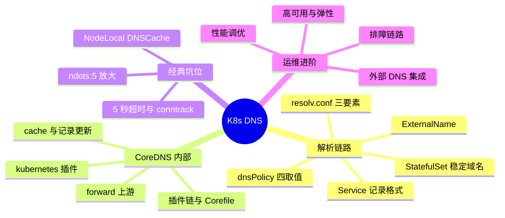
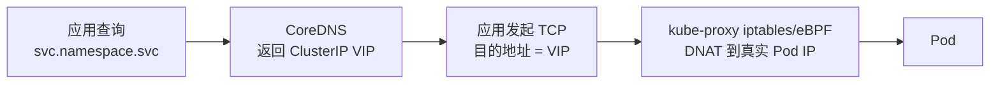
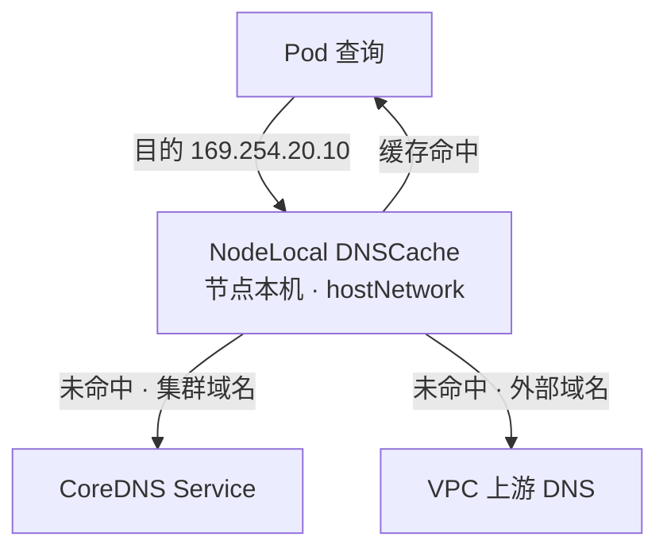

# K8s CoreDNS 快问快答（19 题）

理论底座见 [[05-网络/01-K8s网络核心/12-dns-service-discovery-coredns.md|DNS 服务发现与 CoreDNS 详解]]，网络域姊妹篇见 [[05-网络/01-K8s网络核心/58-kubernetes-network-quick-qa.md|K8s 网络快问快答（56 题）]]。本文与两篇同体例：先遮住答案口述，再对照关键词补全，最后沿"深挖"链接回语料源文件精读。

---

## 话题覆盖清单

| 题号 | 话题域 | 核心考点 |
|------|--------|---------|
| 1 | Pod 解析链路 | /etc/resolv.conf、clusterDNS、search 域 |
| 2 | Service DNS 记录 | A 记录格式、ClusterIP vs Headless 返回值 |
| 3 | StatefulSet 稳定域名 | governing service、pod-name 级 A 记录 |
| 4 | ExternalName | CNAME 直指、无代理语义 |
| 5 | CoreDNS 架构与插件链 | Corefile 结构、插件顺序即执行序 |
| 6 | kubernetes 插件 | 集群内记录生成、pods verified/insecure |
| 7 | forward 上游 | 集群外域名、/etc/resolv.conf 透传 |
| 8 | cache 插件 | TTL、success/denial 缓存 |
| 9 | 记录更新机制 | API watch、查询时生成 vs 预建 |
| 10 | VIP 与 DNS 的关系 | DNS 只答 IP，转发靠 kube-proxy |
| 11 | ndots:5 放大 | 外部域名全后缀尝试、查询放大 |
| 12 | DNS 5 秒超时 | 并行 A/AAAA 查询 + conntrack 竞态 |
| 13 | NodeLocal DNSCache | link-local IP、绕开 conntrack、接口缓存 |
| 14 | CoreDNS 高可用 | 副本/HPA/cluster-proportional-autoscaler/DaemonSet |
| 15 | 自定义 zone 与多集群 | stub zone、多集群服务发现 |
| 16 | 性能调优 | cache 容量、prefetch、serve_stale、限速 |
| 17 | 排障链路 | resolv.conf → svc → endpoints → CoreDNS 日志 |
| 18 | 外部 DNS 集成 | ExternalDNS、私网解析、企业内网 DNS 对接 |
| 19 | dnsPolicy | ClusterFirst/Default/None/WithHostNet 四取值 |

**知识地图**：19 题归并为四大板块——答题先定位板块，再展开考点。



---

### 1. Pod 里的 DNS 解析走什么链路？/etc/resolv.conf 里三行各是什么意思？

> **一句话**：kubelet 把 `nameserver` 写成 kube-system 里 kube-dns 服务的 ClusterIP，`search` 给出四级后缀补全，`options ndots:5` 决定短名是否先走 search 拼接。

Pod 内 `/etc/resolv.conf` 典型内容：

```text
nameserver 10.96.0.10
search default.svc.cluster.local svc.cluster.local cluster.local
options ndots:5
```

| 行 | 含义 |
|----|------|
| `nameserver 10.96.0.10` | kubelet `--cluster-dns` 下发的 DNS 服务 VIP（服务名叫 kube-dns，实际后端是 CoreDNS） |
| `search ...` | 短名补全后缀，从本命名空间到集群根域，共 3-4 条 |
| `options ndots:5` | 域名点数 ≥5 才视为"绝对域名"直接查询，否则先按 search 列表逐个拼接 |

**解析顺序**：应用发起查询 → glibc/musl 按 resolv.conf 规则生成查询 → 发往 nameserver VIP → kube-proxy/eBPF 把 VIP 转发到某个 CoreDNS Pod → CoreDNS 按插件链应答。

深挖：[[05-网络/01-K8s网络核心/12-dns-service-discovery-coredns.md|DNS 服务发现与 CoreDNS 详解]]

### 2. Service 的 DNS 名字怎么构成？ClusterIP 服务和 Headless 服务的 A 记录各返回什么？

> **一句话**：完整名是 `<svc>.<namespace>.svc.cluster.local`；ClusterIP 服务返回一条 ClusterIP，Headless 服务返回所有就绪 Pod IP 的集合。

| 服务类型 | A 记录返回 | 备注 |
|----------|-----------|------|
| ClusterIP | 1 条 = Service VIP | 后续转发与 DNS 无关，靠 kube-proxy |
| Headless（`clusterIP: None`） | 每个就绪 Pod 各一条 A 记录 | 客户端自己选 IP，天然做客户端负载均衡 |
| SRV 记录 | `_port-name._protocol.<svc>.<ns>.svc.cluster.local` | 可查出端口与权重，gRPC/服务网格常用 |

**关键点**：只有 `Ready` 的 endpoint 才会进 DNS 应答——readiness 探针通过 DNS 生效。同名短名 `svc` 在同命名空间内可直接解析（search 第一条就是本 ns）。

深挖：[[05-网络/01-K8s网络核心/13-dns-service-discovery.md|DNS 服务发现]]

### 3. StatefulSet 的 Pod 为什么有稳定的网络身份？域名怎么拼？

> **一句话**：配合 headless governing service，每个 Pod 得到 `<pod-name>.<svc>.<ns>.svc.cluster.local` 的专属 A 记录——重建不变，缩容才回收。

**两条域名**：

```text
# Pod 专属（稳定身份，写入 etcd 的 PVC/应用拓扑都认它）
web-0.web.default.svc.cluster.local → 10.244.1.5
# 集群内通用（随 Pod 调度漂移，一般不用）
web-0.default.svc.cluster.local
```

**稳定的原因**：StatefulSet 控制器按序号重建 Pod，`web-0` 永远叫 `web-0`，governing service 为它保留同名 A 记录——这是主从复制拓扑（`host` 写 `web-0` 永远指向同一个"逻辑节点"）的基础。深挖：[[02-工作负载/01-核心工作负载/03-statefulset-advanced-operations.md|StatefulSet 高级运维]]

### 4. ExternalName 类型的 Service 做什么？和普通 Service 的本质区别？

> **一句话**：ExternalName 在 DNS 层返回一条 CNAME 直指外部域名，集群内没有任何代理转发——它是纯 DNS 别名，不是流量入口。

```yaml
apiVersion: v1
kind: Service
metadata:
  name: external-db
spec:
  type: ExternalName
  externalName: db.rds.aliyuncs.com
```

应用访问 `external-db.default.svc.cluster.local` → CoreDNS 返回 CNAME `db.rds.aliyuncs.com` → 应用自己向该域名解析并直连。**本质区别**：ClusterIP/NodePort 有 VIP 和转发规则，ExternalName 没有——换库只改这条别名，应用零配置变更；但端口、协议、健康检查统统管不了。

### 5. CoreDNS 的插件链怎么工作？Corefile 的结构是什么？

> **一句话**：Corefile 按 zone 分块，块内插件按书写顺序组成执行链，查询进链后逐个处理，命中即返回。

```core
.:53 {
    errors
    health
    ready
    kubernetes cluster.local in-addr.arpa ip6.arpa {
        pods insecure
        fallthrough in-addr.arpa ip6.arpa
    }
    prometheus :9153
    forward . /etc/resolv.conf
    cache 30
    loop
    reload
    loadbalance
}
```

**三个要点**：① 顶层 `.:53` 表示服务根 zone、监听 53 端口（可再写 `example.com:53 { ... }` 块精确匹配其他 zone）；② **查询类插件的书写顺序 = 执行顺序**——`kubernetes` 在 `forward` 前面，集群内域名不会漏到上游；而 `health`/`ready`/`prometheus`/`reload` 等属安装型插件，只在启动时生效、不参与查询链；③ `fallthrough` 决定本插件未命中时是否继续往下走（kubernetes 插件默认未命中直接 NXDOMAIN，不 fallthrough 就查不了外部域名）。

深挖：[[05-网络/01-K8s网络核心/15-coredns-configuration-corefile.md|CoreDNS Corefile 配置详解]]、[[05-网络/01-K8s网络核心/16-coredns-plugins-reference.md|CoreDNS 插件参考]]

### 6. kubernetes 插件做什么？`pods insecure` 和 `pods verified` 差在哪？

> **一句话**：kubernetes 插件监听 API Server 生成集群内记录；`pods` 参数控制 Pod IP 记录的反查与生成策略，verified 防 IP 伪造。

| 职责 | 说明 |
|------|------|
| watch Service/EndpointSlice | 实时生成 svc 的 A/SRV 记录 |
| zone 参数 | `cluster.local in-addr.arpa ip6.arpa`——正向域 + 两个反查域 |
| `pods disabled`（默认） | 不生成 Pod IP 记录（StatefulSet 除外，由 endpoint 记录提供） |
| `pods insecure` | 对任意 `ip.ns.pod.cluster.local` 查询返回该 IP——方便但有伪造面 |
| `pods verified` | 仅当该 IP 确实属于对应 Pod 才应答，需查 API，开销略高 |

深挖：[[05-网络/01-K8s网络核心/14-coredns-architecture-principles.md|CoreDNS 架构原理]]

### 7. 集群外域名怎么解析？forward 插件的 `/etc/resolv.conf` 是谁的？

> **一句话**：kubernetes 插件 fallthrough 后由 forward 接管，`forward . /etc/resolv.conf` 读的是 CoreDNS Pod 自己的 resolv.conf——通常继承自宿主机节点 DNS。

**链路**：`nginx.baidu.com`（点数 2 < 5，先按 search 依次拼出 `nginx.baidu.com.default.svc.cluster.local.` 等 3 个集群域名，逐个未命中）→ 最后查绝对名 `nginx.baidu.com.` → kubernetes 插件 fallthrough → forward 按 `/etc/resolv.conf` 的上游逐个尝试（云厂商通常指向 VPC 内网 DNS，能解析 RDS 内网域名）。**两个坑**：① CoreDNS Pod 用 `dnsPolicy: Default` 时 resolv.conf 来自节点，上游就是节点 DNS；② 上游不通表现为全集群外部域名解析失败——排障先看 forward 上游连通性。

### 8. cache 插件怎么配？缓存 TTL 谁说了算？

> **一句话**：`cache 30` 设上限 30 秒，实际 TTL 取"记录自带 TTL 与配置上限"的较小值；success 与 denial 分开存。

```core
cache {
    success 4096 30   # 容量 4096 条，TTL 上限 30s
    denial 1024 5     # NXDOMAIN 缓存 5s
}
```

**要点**：① 缓存时长 = min(记录自身 TTL, 配置上限)——集群内 Service 记录 TTL 默认 5s，因此把 cache 上限调到 5s 以上并不能延长集群记录的缓存窗口，只会影响上游记录；② denial 缓存能挡住高频查询不存在域名的放大；③ 缓存按条目存在 CoreDNS Pod 内存，扩副本各自独立——命中率要看 per-pod 指标。

深挖：[[05-网络/01-K8s网络核心/29-coredns-troubleshooting-optimization.md|CoreDNS 排障与优化]]

### 9. Service 变更后 DNS 记录多久生效？CoreDNS 是轮询还是推送？

> **一句话**：kubernetes 插件经 API Server watch 推送增量，秒级生效；无轮询、无需重启。

**机制四件套**：① 记录 TTL：kubernetes 插件默认给 Service/Endpoint 记录 5s TTL（可用 `ttl` 参数调），端点变更最多 5s 内全网生效；② 记录生成：informer 内存表随事件更新，新查询立即命中——无生效延迟、无重启；③ 轮询对比：老版本 kube-dns 周期性主动查询 API，变更感知到分钟级——这也是社区迁移 CoreDNS 的核心原因之一（见 [[05-网络/01-K8s网络核心/31-kube-dns-legacy-guide.md|kube-dns 遗留架构]]）；④ watch 断链：informer 重连后先 LIST 全量再续 watch，期间记录仍可用（旧数据），不会查空。

### 10. DNS 解析只返回一个虚拟 IP，应用为什么连得上？DNS 和 kube-proxy 各管什么？

> **一句话**：DNS 管"名字→VIP"，kube-proxy 管"VIP→真实 Pod"——两段解耦，DNS 完全不感知后端转发。



**面试落点**：这解释了三个现象——① 换 Service 后端不需要等 DNS TTL；② `nslookup` 永远只见 VIP，看不到 Pod；③ Headless 服务没有 VIP，DNS 直接返回 Pod IP，客户端绕过 kube-proxy 直连。

### 11. ndots:5 为什么会放大查询量？怎么治？

> **一句话**：外部域名点数不足 5 会被先按 3-4 条 search 后缀拼接、全部失败后才查真名，单次解析膨胀 5 倍以上；治理靠绝对域名结尾加点、调低 ndots、NodeLocal 缓存。

**例子**：`curl baidu.com`（ndots=1）→ 依次尝试 `baidu.com.default.svc.cluster.local.`、`baidu.com.svc.cluster.local.`、`baidu.com.cluster.local.`、`baidu.com.`——前 3 次打到 CoreDNS 又 fallthrough 到上游，全是无效查询。**治理三板斧**：① 代码里写 `baidu.com.`（结尾带点 = 绝对域名，跳过 search）；② Pod spec `dnsConfig` 调低 `ndots: 2`；③ NodeLocal DNSCache 在节点上吃掉重复查询（第 13 题）。

深挖：[[05-网络/01-K8s网络核心/58-kubernetes-network-quick-qa.md|K8s 网络快问快答第 49 题]]

### 12. DNS 查询偶发 5 秒超时的根因是什么？两种缓解手段是什么？

> **一句话**：glibc 并行发 A+AAAA 两个查询，源端口相同时 conntrack 插入竞态丢包，DNS 等满 5 秒重试；缓解靠 NodeLocal DNSCache 与 `single-request-reopen` 换端口重发。

**竞态时序**：glibc 把 A 与 AAAA 查询**并行**发出且共用同一源端口的 UDP socket → 内核 conntrack 为两条"五元组相同"的流各建一条 NAT 表项 → 后插入的表项覆盖/冲突，其中一条回复被丢弃 → glibc 收到一条回复后要等满 resolv.conf 的 `timeout`（默认 5s）才重试被丢的那条——表现为"解析偶发整整 5 秒"。musl libc 默认串行发 A、AAAA，同样存在"丢一条等 5s"的问题且不支持 `single-request-reopen`。**缓解**：① **NodeLocal DNSCache**——Pod 查询目标改为本机 link-local IP，不做 NAT，从根上绕开 conntrack（第 13 题）；② **resolv.conf `options single-request-reopen`**——glibc 为第二个查询换一个 socket（新源端口）发送，错开冲突；另有 `single-request`（改为串行）、关闭 IPv6（减半查询）等变体。

深挖：[[05-网络/01-K8s网络核心/58-kubernetes-network-quick-qa.md|K8s 网络快问快答第 44 题]]

### 13. NodeLocal DNSCache 的原理是什么？为什么说它一箭双雕？

> **一句话**：DaemonSet 以 hostNetwork 在节点 169.254.20.10 上起缓存，kubelet 把 clusterDNS 改指 link-local IP——Pod 查询不出节点（缓存命中），且不经过 Service VIP/conntrack（竞态消失）。



**一箭双雕**：① 性能——热记录在节点本地应答，延迟从毫秒级降到微秒级，CoreDNS 集群压力下降一个量级；② 稳定——到 link-local IP 的 UDP 不经 NAT/conntrack，5 秒超时竞态根除。**部署要点**：kubelet `--cluster-dns` 换成 `169.254.20.10`，节点上建 dummy 网卡绑定该 IP；客户端侧握手超时配置要与缓存 TTL 配平。

### 14. CoreDNS 怎么做高可用？为什么扩容要按节点比例而不是 Pod 比例？

> **一句话**：多副本 + cluster-proportional-autoscaler 按节点/核数线性扩容，或直接 DaemonSet 每节点一份——DNS QPS 随 Pod 数增长，与副本数无关。

| 方案 | 做法 | 适用 |
|------|------|------|
| Deployment + HPA | 基于 CPU/自定义 QPS 指标扩缩 | 中小集群 |
| cluster-proportional-autoscaler | 按节点数/核数线性映射副本数 | 大集群、节点数波动 |
| DaemonSet | 每节点一个实例，天然横向扩展 | 超大规模/网络策略严格 |

**关键认知**：DNS 服务 VIP 由 kube-proxy 转发到各副本，副本间无状态、无同步——扩副本即扩容。但 DNS 流量五元组哈希可能把大量查询打向同一副本（源端口集中），必要时配 `loadbalance` 插件或调 conntrack 策略。

### 15. 怎么给集群加自定义域名 zone？多集群服务发现怎么做 DNS？

> **一句话**：Corefile 加一个 zone 块（可用 file/etcd/forward 插件）承载自定义或存根区；多集群场景早期 federation 插件已弃用，现在主流是各集群独立 DNS + 网关层/多集群控制面统一域名。

**自定义 zone**：

```core
corp.example.com:53 {
    file /etc/coredns/zones/corp.example.com.db   # 静态 zone 文件
    # 或 etcd corp.example.com { ... }            # 动态记录
}
```

通过 CoreDNS ConfigMap 挂载（`reload` 插件热加载）。**多集群**：单集群内的 `cluster.local` 不能跨集群解析——跨集群服务发现要么靠 Gateway/多集群控制面把远端服务映射成本地 Service，要么统一上游权威 DNS + `forward` 到跨集群 DNS 服务。私有云混合场景常见"存根区"：把企业内网 zone forward 到企业 DNS 服务器。

深挖：[[05-网络/01-K8s网络核心/52-dns-advanced-external-integration.md|DNS 高级集成与外部 DNS]]

### 16. CoreDNS 性能调优从哪几处下手？每节点 DNS QPS 怎么估算？

> **一句话**：扩副本/缓存上限、prefetch 热域、serve_stale 兜底、ratelimit 防滥用、resources 给足；QPS 经验值 = Pod 数 × 每秒请求活动，ndots 修复后常降一个量级。

| 调优点 | 配置 | 收益 |
|--------|------|------|
| 缓存 | `cache` 容量与 TTL | 命中率 90%+ 时源查询骤减 |
| 预取 | `prefetch 10 1m 10%`（1 分钟内查询 ≥10 次且 TTL 剩余 <10% 时提前刷新） | 热域名过期前刷新，削峰 |
| 陈旧应答 | `serve_stale` | 上游抖动时用旧记录兜底 |
| 限速 | `ratelimit 1000` | 防单 Pod 异常刷爆 |
| 资源 | requests/limits + HPA | 防限流 CPU 引发超时 |

**估算口径**：先取 CoreDNS `prometheus :9153` 的 QPS/副本与 Pod 总数的比值做基线；ndots 修复与 NodeLocal 部署是收益最大的两刀，先做这两刀再谈加副本。

深挖：[[05-网络/01-K8s网络核心/29-coredns-troubleshooting-optimization.md|CoreDNS 排障与优化]]

### 17. 集群域名解析失败，按什么链路排查？

> **一句话**：Pod 内验证 → resolv.conf → kube-dns Service/Endpoints → CoreDNS Pod 日志 → 上游，五层逐级收窄。

```text
1. Pod 内：nslookup kubernetes.default（区分集群内/外域名失败）
2. cat /etc/resolv.conf（nameserver、ndots 是否被 dnsConfig 覆盖）
3. kubectl -n kube-system get svc,endpoints kube-dns（Endpoints 为空 = CoreDNS 副本没就绪）
4. kubectl -n kube-system logs <coredns-pod>（errors/log 插件输出）
5. CoreDNS Pod 内 curl apiserver 健康端点（watch 断链 = 记录不更新）
6. 外部域名失败：再查 forward 上游（节点 /etc/resolv.conf、VPC DNS）
```

**高频根因**：Endpoints 空（副本挂了）、Corefile 改坏 reload 失败、网络策略挡了 53 端口、apiserver watch 断开导致记录陈旧、NodeLocal 与 CoreDNS 版本不匹配。深挖：[[05-网络/01-K8s网络核心/29-coredns-troubleshooting-optimization.md|CoreDNS 排障与优化]]

### 18. Service/Ingress 怎么自动注册到外部 DNS？企业内网域名怎么打通？

> **一句话**：ExternalDNS 控制器 watch Service/Ingress 注解，把记录同步到云 DNS/私有 zone；企业内网打通靠 CoreDNS forward 存根区指回企业 DNS。

**ExternalDNS 模式**：给 Ingress 打 `external-dns.alpha.kubernetes.io/hostname: app.example.com` → 控制器在 Route53/阿里云 DNS/私有 zone 创建 A/CNAME 记录——Ingress IP 变更自动跟随，替代手工维护 zone 文件。**内网打通**：Corefile 加 `forward internal.corp 10.0.0.53` 把企业 zone 转给内网 DNS；反向地，企业侧把 `*.apps.cluster.corp` 委派给集群入口。**私有 zone 场景**（RDS 内网域名、混合云）是生产最高频集成点。

深挖：[[05-网络/01-K8s网络核心/52-dns-advanced-external-integration.md|DNS 高级集成与外部 DNS]]

### 19. dnsPolicy 的四种取值分别是什么行为？hostNetwork 的 Pod 为什么必须特殊配置？

> **一句话**：ClusterFirst（默认，短名先走集群 DNS）、Default（直接继承节点 resolv.conf）、None（完全自管，必须配 dnsConfig）、ClusterFirstWithHostNet（hostNetwork Pod 用集群 DNS）——hostNetwork Pod 默认行为是"用节点 DNS"，不显式设置就解析不了 Service。

| dnsPolicy | 生效对象 | 行为 |
|-----------|---------|------|
| ClusterFirst（默认） | 普通 Pod | 短名先按 search 拼集群域名，不命中再转发上游 |
| Default | 普通 Pod | resolv.conf 与节点一致，绕过集群 DNS——适合大量外呼的应用 |
| None | 任意 Pod | 内置配置全清空，必须用 `dnsConfig` 显式给 nameserver/search/options |
| ClusterFirstWithHostNet | hostNetwork Pod | 让共享宿主机网络栈的 Pod 仍走集群 DNS |

**关键坑**：hostNetwork Pod（DaemonSet 监控采集、NodeLocal 本身）在 `networking.k8s.io` 视角与节点同身份，dnsPolicy 语义会退化为 Default——不写 `dnsPolicy: ClusterFirstWithHostNet` 就无法解析 `*.svc.cluster.local`。`dnsConfig` 可与任一策略叠加，用来调 ndots、追加 search 域。

深挖：[[05-网络/01-K8s网络核心/56-hostnetwork-hostport-deep-dive.md|HostNetwork 与 HostPort 深度解析]]、[[05-网络/01-K8s网络核心/12-dns-service-discovery-coredns.md|DNS 服务发现与 CoreDNS 详解]]

---

## 面试官追问模拟（追问链）

**场景**：业务反馈"外部域名解析偶发整整 5 秒失败"，流量集中在某个 Java 服务。

- **追问 1：先做什么定位？**——分域验证：集群内域名（`kubernetes.default`）是否正常；出问题的域名是否都是外部域；是否集中在调用方 Pod；`dig +time=1 +tries=1` 复现统计超时比例。
- **追问 2：为什么恰好是 5 秒？**——glibc 并行发 A/AAAA 且共用源端口 → conntrack 竞态丢一条回复 → 等满 resolv.conf 默认 timeout 5s 才重试（第 12 题）。
- **追问 3：短期止血与长期方案分别是什么？**——短期：该 Pod `dnsConfig` 加 `single-request-reopen` 或降低 ndots；长期：全集群部署 NodeLocal DNSCache，把查询挡在节点本机、绕开 conntrack。
- **追问 4：NodeLocal 部署要注意什么？**——kubelet `--cluster-dns` 换成 link-local IP（169.254.20.10）；daemonset 镜像版本与 CoreDNS 匹配；hostNetwork Pod 的 dnsPolicy 要配 ClusterFirstWithHostNet（第 19 题）；灰度先改单节点观察。
- **追问 5：怎么证明修复有效？**——对比修复前后 DNS 客户端 5s 超时率指标、NodeLocal 缓存命中率、CoreDNS QPS 下降幅度；用 `kubectl debug` 进 Pod 抓包确认查询目标已变为 link-local IP。

---

## 速答速记表（19 题一句话版）

复习用：遮住答案，只看"一句话答案"列口述展开，再对照"记忆钩子"自检。

| 题号 | 一句话答案 | 记忆钩子 |
|------|-----------|---------|
| 1 | resolv.conf 三行：nameserver 指 kube-dns VIP、search 四级后缀、ndots:5 决定补全策略 | 三行三作用 |
| 2 | `<svc>.<ns>.svc.cluster.local`；ClusterIP 返 VIP，Headless 返全部就绪 Pod IP | VIP 与 Pod 集 |
| 3 | StatefulSet + headless service 给每副本 `<pod>.<svc>.<ns>.svc...` 稳定 A 记录 | 序号即身份 |
| 4 | ExternalName 返回 CNAME 直指外部，无代理无端口——纯 DNS 别名 | 只改名不管流量 |
| 5 | Corefile 按 zone 分块，插件顺序即执行序，fallthrough 控制未命中走向 | 顺序即链路 |
| 6 | kubernetes 插件 watch API 生成集群记录；pods insecure 全应答、verified 校验 IP | watch 生记录 |
| 7 | forward 接管集群外域名，resolv.conf 是 CoreDNS Pod 自己的（继承节点） | 上游在节点 |
| 8 | cache 上限与记录 TTL 取小；success/denial 分开；集群记录 TTL 本就 5s | 缓存有上限 |
| 9 | API watch 推送增量、秒级生效，kube-dns 轮询才是分钟级 | 推送非轮询 |
| 10 | DNS 管名字到 VIP，kube-proxy 管 VIP 到 Pod——两段解耦 | 两段两管 |
| 11 | ndots:5 让短名先拼 3-4 条 search 全试一遍；治：结尾加点/调低 ndots/NodeLocal | 先错几轮才对 |
| 12 | 并行 A+AAAA 同源端口撞 conntrack 丢包，等满 5s；治：NodeLocal、single-request-reopen | 双查撞表 |
| 13 | 节点 link-local 缓存，查询不出节点不进 conntrack——性能稳定双收益 | 本机应答 |
| 14 | 多副本 + 按节点比例扩容（autoscaler/DaemonSet）；副本无状态 | 按节点扩 |
| 15 | Corefile 加 zone 块（file/etcd/forward）做自定义区；多集群靠统一上游或网关映射 | 加块即加域 |
| 16 | cache/prefetch/serve_stale/ratelimit/资源五处下手；先修 ndots 再扩容 | 五刀先修根 |
| 17 | Pod 内验证→resolv.conf→svc/endpoints→CoreDNS 日志→上游，五层收窄 | 五层往下查 |
| 18 | ExternalDNS 同步注解到云 DNS；企业 zone 用 forward 存根区指回内网 DNS | 注解上云 |
| 19 | ClusterFirst 默认、Default 继承节点、None 全自管、WithHostNet 给 hostNetwork 用；hostNetwork 不配就解析不了 Service | 四取值一个坑 |

---

## 自练检查清单

- 能否 60 秒讲清"应用发起 `svc` 短名查询"到"拿到 ClusterIP"的完整链路（第 1、10 题）？
- ndots:5 放大与 5 秒超时两个经典坑，能否各说出根因 + 两种缓解（第 11、12 题）？
- dnsPolicy 四取值与 hostNetwork 的坑能否一句话说清（第 19 题）？
- 被问"CoreDNS 记录怎么更新"时，能否答出 watch 推送而非轮询，并对比 kube-dns（第 9 题）？
- 排障五层链路（第 17 题）能否不看稿默写？追问链"5 秒超时"场景能否完整走一遍？
- NodeLocal DNSCache 的"一箭双雕"能否从原理层解释（第 13 题）？

---

## 相关链接

- [[05-网络/01-K8s网络核心/58-kubernetes-network-quick-qa.md|K8s 网络快问快答（56 题）]]
- [[05-网络/01-K8s网络核心/12-dns-service-discovery-coredns.md|DNS 服务发现与 CoreDNS 详解]]
- [[05-网络/01-K8s网络核心/13-dns-service-discovery.md|DNS 服务发现]]
- [[05-网络/01-K8s网络核心/14-coredns-architecture-principles.md|CoreDNS 架构原理]]
- [[05-网络/01-K8s网络核心/15-coredns-configuration-corefile.md|CoreDNS Corefile 配置详解]]
- [[05-网络/01-K8s网络核心/16-coredns-plugins-reference.md|CoreDNS 插件参考]]
- [[05-网络/01-K8s网络核心/29-coredns-troubleshooting-optimization.md|CoreDNS 排障与优化]]
- [[05-网络/01-K8s网络核心/31-kube-dns-legacy-guide.md|kube-dns 遗留架构]]
- [[05-网络/01-K8s网络核心/52-dns-advanced-external-integration.md|DNS 高级集成与外部 DNS]]
- [[02-工作负载/01-核心工作负载/03-statefulset-advanced-operations.md|StatefulSet 高级运维]]
