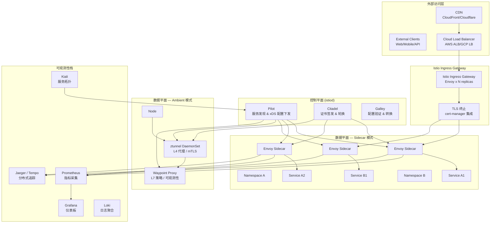

> **生产环境安全提示**
>
> 本文档包含可直接执行的运维命令。执行前请确认：当前目标集群与 Namespace 是否正确；是否具备足够的 RBAC 权限；是否已在非生产环境验证。命令风险等级标注：🔴 高风险（可能造成数据丢失或服务中断）、🟡 中风险（会修改集群状态，但通常可回滚）、🟢 低风险/只读（信息收集，无副作用）。


# [[Istio|Istio]] 企业级服务网格架构与实践

> **最后更新**: 2026-04-24 | **适用版本**: Istio v1.29+ | **难度**: 高级

---

<!-- chunk: 概述 -->## 概述

Istio 是业界领先的开源服务网格平台，由 Google、IBM、Lyft 于2017年联合推出，2023年正式成为 CNCF 毕业项目。作为企业级微服务架构的核心基础设施，Istio 提供了流量管理、安全控制、可观测性和策略执行四大核心能力。通过将通信逻辑从应用代码中剥离到基础设施层（Sidecar 代理或节点级代理），Istio 使得微服务治理变得透明化、声明式和可编程。

Istio 的技术架构在2026年已经非常成熟，支持两种数据平面模式：传统的 Sidecar 模式（每个 Pod 注入一个 [[Envoy|Envoy]] 代理）和新兴的 Ambient 模式（节点级 ztunnel + 按需 Waypoint Proxy）。两种模式可以共存于同一个集群，为企业提供了平滑的迁移路径。Istio 的控制平面 istiod 集成了服务发现（Pilot）、证书管理（Citadel）和配置验证（Galley）三大功能，以单二进制方式运行，大幅简化了部署和运维。

本文档从生产环境运维专家角度，深入探讨 Istio 的企业级部署架构、流量管理实战、安全策略配置、可观测性集成、性能调优和故障排查。所有配置均基于 Istio v1.29，涵盖传统 Sidecar 模式和新兴的 Ambient Mesh 模式，并提供可直接用于生产环境的完整 YAML 配置。

## Istio 企业级架构全景



---

<!-- chunk: 核心配置 — 企业级部署 -->## 核心配置 — 企业级部署

## IstioOperator 高可用部署

```yaml
apiVersion: install.istio.io/v1alpha1
kind: IstioOperator
metadata:
  name: istio-production
  namespace: istio-system
spec:
  profile: default
  meshConfig:
    accessLogFile: /dev/stdout
    accessLogEncoding: JSON
    defaultConfig:
      holdApplicationUntilProxyStarts: true
      tracing:
        zipkin:
          address: zipkin.istio-system:9411
        sampling: 10.0
    outboundTrafficPolicy:
      mode: REGISTRY_ONLY
    enableAutoMtls: true
    rootNamespace: istio-system
    extensionProviders:
      - name: otel-collector
        envoyOtelAls:
          service: otel-collector.monitoring.svc.cluster.local
          port: 4317
      - name: prometheus
        prometheus:
          port: 15090

  components:
    pilot:
      enabled: true
      k8s:
        resources:
          requests:
            cpu: "500m"
            memory: "2Gi"
          limits:
            cpu: "2000m"
            memory: "4Gi"
        replicaCount: 3
        nodeSelector:
          node-role.kubernetes.io/infra: "true"
        tolerations:
          - key: "dedicated"
            operator: "Equal"
            value: "istio"
            effect: "NoSchedule"
        affinity:
          podAntiAffinity:
            preferredDuringSchedulingIgnoredDuringExecution:
              - weight: 100
                podAffinityTerm:
                  labelSelector:
                    matchLabels:
                      app: istiod
                  topologyKey: kubernetes.io/hostname
        hpaSpec:
          minReplicas: 3
          maxReplicas: 10
          metrics:
            - type: Resource
              resource:
                name: cpu
                target:
                  type: Utilization
                  averageUtilization: 80

    ingressGateways:
      - name: istio-ingressgateway
        enabled: true
        k8s:
          resources:
            requests:
              cpu: "200m"
              memory: "256Mi"
            limits:
              cpu: "2000m"
              memory: "1Gi"
          replicaCount: 3
          service:
            type: LoadBalancer
            annotations:
              service.beta.kubernetes.io/aws-load-balancer-type: "nlb"
              service.beta.kubernetes.io/aws-load-balancer-internal: "false"
            ports:
              - port: 80
                targetPort: 8080
                name: http2
              - port: 443
                targetPort: 8443
                name: https
              - port: 15443
                targetPort: 15443
                name: tls
          hpaSpec:
            minReplicas: 3
            maxReplicas: 20
            metrics:
              - type: Resource
                resource:
                  name: cpu
                  target:
                    type: Utilization
                    averageUtilization: 60
          affinity:
            podAntiAffinity:
              preferredDuringSchedulingIgnoredDuringExecution:
                - weight: 100
                  podAffinityTerm:
                    labelSelector:
                      matchLabels:
                        app: istio-ingressgateway
                    topologyKey: kubernetes.io/hostname

    egressGateways:
      - name: istio-egressgateway
        enabled: true
        k8s:
          resources:
            requests:
              cpu: "100m"
              memory: "128Mi"
            limits:
              cpu: "1000m"
              memory: "512Mi"
          replicaCount: 2

    cni:
      enabled: true
      k8s:
        resources:
          requests:
            cpu: "100m"
            memory: "128Mi"
          limits:
            cpu: "500m"
            memory: "512Mi"

  values:
    global:
      proxy:
        resources:
          requests:
            cpu: "100m"
            memory: "128Mi"
          limits:
            cpu: "2000m"
            memory: "1Gi"
        holdApplicationUntilProxyStarts: true
        tracer: "zipkin"
      logging:
        level: "default:warning"
    pilot:
      autoscaleEnabled: true
      traceSampling: 10.0
```

## Istio Sidecar 资源限制 — 全局配置

```yaml
apiVersion: networking.istio.io/v1
kind: Sidecar
metadata:
  name: default-sidecar
  namespace: istio-system
spec:
  egress:
    - hosts:
        - "./*"
        - "istio-system/*"
        - "monitoring/*"
        - "tracing/*"
  outboundTrafficPolicy:
    mode: REGISTRY_ONLY
---
apiVersion: networking.istio.io/v1
kind: Sidecar
metadata:
  name: production-sidecar
  namespace: production
spec:
  ingress:
    - port:
        number: 8080
        protocol: HTTP
        name: http
      defaultEndpoint: "127.0.0.1:8080"
      tls:
        httpsRedirect: false
  egress:
    - hosts:
        - "production/*"
        - "istio-system/*"
        - "monitoring/*"
        - "tracing/*"
        - "database/*"
        - "cache/*"
    - captureMode: NONE
      hosts:
        - "external-services/*"
  outboundTrafficPolicy:
    mode: REGISTRY_ONLY
```

---

<!-- chunk: 流量管理实战 -->## 流量管理实战

## 虚拟服务 — 完整流量路由

```yaml
apiVersion: networking.istio.io/v1
kind: VirtualService
metadata:
  name: bookinfo-routes
  namespace: default
spec:
  hosts:
    - bookinfo.example.com
  gateways:
    - bookinfo-gateway
  http:
    - name: productpage
      match:
        - uri:
            prefix: /productpage
        - uri:
            prefix: /static
        - uri:
            prefix: /login
        - uri:
            prefix: /logout
        - uri:
            prefix: /api/v1/products
      route:
        - destination:
            host: productpage
            port:
              number: 9080
      timeout: 10s
      retries:
        attempts: 3
        perTryTimeout: 3s
        retryOn: 5xx,reset,connect-failure,refused-stream

    - name: reviews-v2-priority
      match:
        - headers:
            end-user:
              exact: jason
      route:
        - destination:
            host: reviews
            port:
              number: 9080
            subset: v2
      timeout: 5s

    - name: reviews-canary
      route:
        - destination:
            host: reviews
            port:
              number: 9080
            subset: v1
          weight: 75
        - destination:
            host: reviews
            port:
              number: 9080
            subset: v2
          weight: 25
      retries:
        attempts: 3
        perTryTimeout: 2s
        retryOn: 5xx,reset,connect-failure
      timeout: 10s
      fault:
        delay:
          percentage:
            value: 0.1
          fixedDelay: 5s

    - name: ratings-mirror
      route:
        - destination:
            host: ratings
            port:
              number: 9080
            subset: v1
          weight: 100
      mirror:
        host: ratings
        subset: v2
      mirrorPercentage:
        value: 10
```

## 目标规则 — 连接池与异常检测

```yaml
apiVersion: networking.istio.io/v1
kind: DestinationRule
metadata:
  name: reviews-policy
  namespace: default
spec:
  host: reviews
  trafficPolicy:
    loadBalancer:
      simple: LEAST_CONN
      localityLbSetting:
        enabled: true
        failover:
          - from: us-west-2
            to: us-east-1
    connectionPool:
      tcp:
        maxConnections: 200
        connectTimeout: 5s
        tcpKeepalive:
          time: 7200s
          interval: 75s
      http:
        http1MaxPendingRequests: 1000
        http2MaxRequests: 1000
        maxRequestsPerConnection: 10
        maxRetries: 3
        idleTimeout: 60s
        h2UpgradePolicy: DEFAULT
    outlierDetection:
      consecutive5xxErrors: 5
      interval: 30s
      baseEjectionTime: 60s
      maxEjectionPercent: 50
      minHealthPercent: 25
      consecutiveGatewayErrors: 3
  subsets:
    - name: v1
      labels:
        version: v1
      trafficPolicy:
        loadBalancer:
          simple: ROUND_ROBIN
    - name: v2
      labels:
        version: v2
      trafficPolicy:
        loadBalancer:
          simple: LEAST_REQUEST
```

## Gateway API 配置 (推荐新标准)

```yaml
apiVersion: gateway.networking.k8s.io/v1
kind: Gateway
metadata:
  name: bookinfo-gateway
  namespace: default
spec:
  gatewayClassName: istio
  listeners:
    - name: https
      protocol: HTTPS
      port: 443
      tls:
        mode: Terminate
        certificateRefs:
          - name: bookinfo-cert
      allowedRoutes:
        namespaces:
          from: Same
    - name: http
      protocol: HTTP
      port: 80
      allowedRoutes:
        namespaces:
          from: Same
---
apiVersion: gateway.networking.k8s.io/v1
kind: HTTPRoute
metadata:
  name: bookinfo-http-route
  namespace: default
spec:
  parentRefs:
    - name: bookinfo-gateway
  hostnames:
    - "bookinfo.example.com"
  rules:
    - matches:
        - path:
            type: PathPrefix
            value: /productpage
      backendRefs:
        - name: productpage
          port: 9080
    - matches:
        - path:
            type: PathPrefix
            value: /api/v1/products
      backendRefs:
        - name: productpage
          port: 9080
          weight: 90
        - name: productpage-canary
          port: 9080
          weight: 10
```

## EnvoyFilter — 自定义 WASM 扩展

```yaml
apiVersion: networking.istio.io/v1alpha3
kind: EnvoyFilter
metadata:
  name: custom-access-logger
  namespace: istio-system
spec:
  workloadSelector:
    labels:
      istio: ingressgateway
  configPatches:
    - applyTo: HTTP_FILTER
      match:
        context: GATEWAY
        listener:
          filterChain:
            filter:
              name: envoy.filters.network.http_connection_manager
              subFilter:
                name: envoy.filters.http.router
      patch:
        operation: INSERT_BEFORE
        value:
          name: envoy.filters.http.wasm
          typed_config:
            "@type": type.googleapis.com/envoy.extensions.filters.http.wasm.v3.Wasm
            config:
              name: custom_access_logger
              vm_config:
                runtime: envoy.wasm.runtime.v8
                code:
                  local:
                    filename: /etc/envoy/wasm/access_logger.wasm
                allow_precompiled: true
              configuration:
                "@type": type.googleapis.com/google.protobuf.StringValue
                value: |
                  {
                    "log_format": "method=%REQ(:METHOD)% path=%REQ(X-ENVOY-ORIGINAL-PATH?:PATH)% status=%RESPONSE_CODE% duration=%DURATION%",
                    "output_sink": "stdout",
                    "include_internal_headers": false
                  }
```

---

<!-- chunk: 安全策略 -->## 安全策略

## mTLS 全局严格模式

```yaml
apiVersion: security.istio.io/v1beta1
kind: PeerAuthentication
metadata:
  name: default
  namespace: istio-system
spec:
  mtls:
    mode: STRICT
---
apiVersion: security.istio.io/v1beta1
kind: PeerAuthentication
metadata:
  name: legacy-permissive
  namespace: legacy
spec:
  mtls:
    mode: PERMISSIVE
  selector:
    matchLabels:
      app: legacy-service
```

## 授权策略 — 零信任安全

```yaml
apiVersion: security.istio.io/v1beta1
kind: AuthorizationPolicy
metadata:
  name: deny-all-default
  namespace: default
spec:
  action: DENY
---
apiVersion: security.istio.io/v1beta1
kind: AuthorizationPolicy
metadata:
  name: allow-from-gateway
  namespace: default
spec:
  selector:
    matchLabels:
      app: productpage
  action: ALLOW
  rules:
    - from:
        - source:
            namespaces: ["istio-system"]
            principals: ["cluster.local/ns/istio-system/sa/istio-ingressgateway-service-account"]
      to:
        - operation:
            methods: ["GET", "POST"]
            paths: ["/productpage", "/api/v1/products"]
    - from:
        - source:
            principals: ["cluster.local/ns/default/sa/reviews"]
      to:
        - operation:
            methods: ["GET"]
            paths: ["/health"]
    - from:
        - source:
            principals: ["cluster.local/ns/default/sa/details"]
      to:
        - operation:
            methods: ["GET"]
            paths: ["/details/*"]
```

## JWT 认证配置

```yaml
apiVersion: security.istio.io/v1beta1
kind: RequestAuthentication
metadata:
  name: jwt-auth
  namespace: default
spec:
  selector:
    matchLabels:
      app: productpage
  jwtRules:
    - issuer: "https://accounts.google.com"
      jwksUri: "https://www.googleapis.com/oauth2/v3/certs"
      audiences: ["bookinfo.example.com"]
      forwardOriginalToken: true
---
apiVersion: security.istio.io/v1beta1
kind: AuthorizationPolicy
metadata:
  name: require-jwt
  namespace: default
spec:
  selector:
    matchLabels:
      app: productpage
  action: ALLOW
  rules:
    - from:
        - source:
            requestPrincipals: ["https://accounts.google.com/*"]
```

---

<!-- chunk: 可观测性 — Kiali, Jaeger, Prometheus 集成 -->## 可观测性 — Kiali, Jaeger, Prometheus 集成

## Telemetry 配置

```yaml
apiVersion: telemetry.istio.io/v1alpha1
kind: Telemetry
metadata:
  name: default-telemetry
  namespace: istio-system
spec:
  metrics:
    - providers:
        - name: prometheus
      overrides:
        - matchers:
          - metric="ALL_METRICS"
          - tagOverrides=""
          - request_method=""
          - value="request.method"
          - request_host=""
          - value="request.host"
  accessLogging:
    - providers:
        - name: otel-collector
      filter:
        expression: "response.code >= 400"
  tracing:
    - providers:
        - name: otel-collector
      randomSamplingPercentage: 10.0
      customTags:
        user_id:
          header:
            name: x-user-id
            defaultValue: "unknown"
```

## Prometheus 告警规则

```yaml
apiVersion: monitoring.coreos.com/v1
kind: PrometheusRule
metadata:
  name: istio-alerts
  namespace: istio-system
spec:
  groups:
    - name: istio.rules
      rules:
        - alert: IstioComponentDown
          expr: up{job=~"istiod|istio-proxy"} == 0
          for: 5m
          labels:
            severity: critical
          annotations:
            summary: "Istio component {{ $labels.instance }} is down"
            description: "The Istio component on instance {{ $labels.instance }} has been down for more than 5 minutes. Check the pod status and logs for errors."

        - alert: HighRequestLatency
          expr: histogram_quantile(0.99, rate(istio_request_duration_milliseconds_bucket[1m])) > 1000
          for: 2m
          labels:
            severity: warning
          annotations:
            summary: "99th percentile latency above 1s for {{ $labels.destination_service }}"
            description: "The 99th percentile request latency for destination service {{ $labels.destination_service }} has exceeded 1 second for more than 2 minutes."

        - alert: HighErrorRate
          expr: |
            sum(rate(istio_requests_total{response_code=~"5.."}[1m])) by (destination_service)
            /
            sum(rate(istio_requests_total[1m])) by (destination_service) > 0.05
          for: 2m
          labels:
            severity: warning
          annotations:
            summary: "Error rate above 5% for {{ $labels.destination_service }}"
            description: "The server-side error rate for destination service {{ $labels.destination_service }} has been above 5% for more than 2 minutes."

        - alert: HighConnectionRate
          expr: rate(istio_tcp_connections_opened_total[1m]) > 100
          for: 5m
          labels:
            severity: warning
          annotations:
            summary: "High TCP connection rate for {{ $labels.destination_service }}"
            description: "The TCP connection opening rate for destination service {{ $labels.destination_service }} has been above 100 per second for 5 minutes."

        - alert: CertificateExpiringSoon
          expr: istio_cert_expiry_timestamp - time() < 86400 * 7
          for: 1h
          labels:
            severity: warning
          annotations:
            summary: "Certificate expiring in less than 7 days"
            description: "A TLS certificate used by the Istio mesh is expiring within 7 days. Check Citadel certificate rotation status."

        - alert: PilotPushPressure
          expr: sum(rate(pilot_xds_pushes[1m])) > 1000
          for: 5m
          labels:
            severity: warning
          annotations:
            summary: "High xDS push rate detected on istiod"
            description: "The istiod control plane is pushing xDS configurations at a rate exceeding 1000 per second. This may indicate configuration instability."

        - alert: SidecarResourceExhaustion
          expr: container_memory_working_set_bytes{container="istio-proxy"} / container_spec_memory_limit_bytes{container="istio-proxy"} > 0.9
          for: 3m
          labels:
            severity: warning
          annotations:
            summary: "Istio sidecar proxy memory usage above 90% on {{ $labels.pod }}"
            description: "The Istio sidecar proxy on pod {{ $labels.pod }} in namespace {{ $labels.namespace }} is using more than 90% of its memory limit."

        - alert: IstioHigh4xxErrorRate
          expr: |
            sum(rate(istio_requests_total{response_code=~"4.."}[5m])) by (destination_service, source_workload)
            /
            sum(rate(istio_requests_total[5m])) by (destination_service, source_workload) > 0.2
          for: 5m
          labels:
            severity: info
          annotations:
            summary: "High 4xx error rate from {{ $labels.source_workload }} to {{ $labels.destination_service }}"
            description: "Client error rate above 20% from source workload {{ $labels.source_workload }} to destination {{ $labels.destination_service }}."
```

---

<!-- chunk: 性能调优 -->## 性能调优

## Sidecar 资源与并发优化

```yaml
apiVersion: v1
kind: ConfigMap
metadata:
  name: istio-sidecar-injector
  namespace: istio-system
data:
  values: |
    proxy:
      resources:
        requests:
          cpu: "100m"
          memory: "128Mi"
        limits:
          cpu: "2000m"
          memory: "1Gi"
      concurrency: 2
      holdApplicationUntilProxyStarts: true
    global:
      proxy:
        tracer: "zipkin"
```

## 连接池全局调优

```yaml
apiVersion: networking.istio.io/v1
kind: DestinationRule
metadata:
  name: global-connection-settings
  namespace: istio-system
spec:
  host: "*.local"
  trafficPolicy:
    connectionPool:
      tcp:
        maxConnections: 200
        connectTimeout: 5s
      http:
        http1MaxPendingRequests: 1024
        http2MaxRequests: 1024
        maxRequestsPerConnection: 10
        maxRetries: 3
        idleTimeout: 120s
    tls:
      mode: ISTIO_MUTUAL
```

## istiod 性能调优

```yaml
apiVersion: apps/v1
kind: Deployment
metadata:
  name: istiod
  namespace: istio-system
spec:
  template:
    spec:
      containers:
        - name: discovery
          env:
            - name: PILOT_PUSH_THROTTLE_COUNT
              value: "100"
            - name: PILOT_DEBOUNCE_AFTER
              value: "1s"
            - name: PILOT_DEBOUNCE_MAX
              value: "10s"
            - name: PILOT_ENABLE_STATUS_WORKLOAD_ENTRY
              value: "true"
            - name: PILOT_FILTER_GATEWAY_CLUSTER_CONFIG
              value: "true"
            - name: PILOT_EVICTION_INTERVAL
              value: "30s"
            - name: CACHE_LOG
              value: "true"
            - name: PILOT_CERT_PROVIDER
              value: "istiod"
```

---

<!-- chunk: 故障排查 -->## 故障排查

## 诊断脚本

> ⚠️ **🟡 中危变更** — 变更集群资源状态，建议先 --dry-run 或 diff 确认
> - `kubectl exec`：进入容器执行命令，可能改变容器状态

``` bash
# 🟡 中风险：会修改集群/资源状态，执行前请确认目标、影响范围与授权
#!/bin/bash

echo "=== 1. Istio 组件状态 ==="
kubectl get pods -n istio-system -o wide
echo ""

echo "=== 2. Sidecar 注入检查 ==="
kubectl get mutatingwebhookconfiguration istio-sidecar-injector -o yaml | grep -A5 namespaceSelector
echo ""

echo "=== 3. 代理同步状态 ==="
istioctl proxy-status
echo ""

echo "=== 4. 代理配置检查 ==="
istioctl proxy-config cluster deployment/productpage-v1 -n default
echo ""

echo "=== 5. 路由配置 ==="
kubectl get virtualservices -A -o yaml | grep -A3 "hosts:"
kubectl get destinationrules -A -o yaml | grep -A3 "host:"
echo ""

echo "=== 6. 安全策略 ==="
kubectl get peerauthentication -A
kubectl get authorizationpolicy -A
kubectl get requestauthentication -A
echo ""

echo "=== 7. 资源使用 ==="
kubectl top pods -n istio-system
echo ""

echo "=== 8. 日志分析 ==="
kubectl logs -n istio-system -l app=istiod --tail=100 | grep -iE "error|warn"
echo ""

echo "=== 9. 配置分析 ==="
istioctl analyze -A 2>&1
echo ""

echo "=== 10. 端到端连通性 ==="
kubectl exec -n default deploy/sleep -- curl -s -o /dev/null -w "HTTP %{http_code}, Time: %{time_total}s\n" http://productpage:9080/productpage
echo ""

echo "=== 11. 证书检查 ==="
istioctl proxy-config secret deployment/productpage-v1 -n default
echo ""

echo "=== 12. Gateway 状态 ==="
kubectl get gateway -A
kubectl get httproute -A
echo ""

echo "=== 13. Ambient 状态 (如启用) ==="
kubectl get ns -L istio.io/dataplane-mode
kubectl get pods -n istio-system -l app=ztunnel
echo ""

echo "=== 14. 性能指标 ==="
kubectl exec -n default deploy/productpage-v1 -c istio-proxy -- \
  curl -s http://localhost:15090/stats/prometheus | grep -E "upstream_rq_time|downstream_cx_active"
```
## Istio 安装验证 — Shell 输出示例

``` bash
# 🟢 低风险：只读/信息收集，通常无副作用
$ istioctl verify-install
1 Istio control planes detected, checking --revision "default" only
✔ Istio control plane "default" is installed in namespace "istio-system"
✔ Istiod pod istiod-6f9c6b7b4c-2xk8j is healthy
✔ Istiod pod istiod-6f9c6b7b4c-5mnpq is healthy
✔ Istiod pod istiod-6f9c6b7b4c-8rtyl is healthy
✔ Ingress gateway "istio-ingressgateway" is installed and healthy
✔ Egress gateway "istio-egressgateway" is installed and healthy
✔ CNI DaemonSet "istio-cni-node" is running on all nodes
✔ No issues detected during installation verification

$ istioctl proxy-status
PROXY                                                  CLUSTER     CDS    LDS    EDS    RDS    ECDS    ISTIOD                      VERSION
istio-ingressgateway-7d68b4fbb6-abc12.istio-system     Kubernetes  SYNCED SYNCED SYNCED SYNCED SYNCED istiod-6f9c6b7b4c-2xk8j     1.29.0
productpage-v1-6b746f74dc-xyz34.default               Kubernetes  SYNCED SYNCED SYNCED SYNCED SYNCED istiod-6f9c6b7b4c-5mnpq     1.29.0
reviews-v1-545db77b95-def56.default                   Kubernetes  SYNCED SYNCED SYNCED SYNCED SYNCED istiod-6f9c6b7b4c-8rtyl     1.29.0
reviews-v2-7bf8f9696f-ghi78.default                   Kubernetes  SYNCED SYNCED SYNCED SYNCED SYNCED istiod-6f9c6b7b4c-2xk8j     1.29.0
ratings-v1-5745f4bdfc-jkl90.default                   Kubernetes  SYNCED SYNCED SYNCED SYNCED SYNCED istiod-6f9c6b7b4c-5mnpq     1.29.0
```
## istioctl analyze — 配置验证输出示例

``` bash
# 🟢 低风险：只读/信息收集，通常无副作用
$ istioctl analyze -A

✔ No validation issues found when analyzing all namespaces.

Info [IST0102]: Namespace "default" has no injection annotation or label.
  This means that Pods in this namespace will not have sidecar injection enabled by default.

Warn [IST0135]: VirtualService "bookinfo-routes" has a fault injection delay of 5s configured.
  Fault injection is enabled which may impact production traffic.

Info [IST0108]: DestinationRule "reviews-policy" uses outlier detection with baseEjectionTime 60s.
  Outlier detection is configured for host "reviews" in namespace "default".

✔ Configuration analysis completed with 0 errors, 1 warning, 2 informational messages.

```
## 常见问题速查

| 症状 | 可能原因 | 诊断命令 | 解决方案 |
|:---|:---|:---|:---|
| 503 UH (No Healthy Host) | outlier detection 驱逐所有端点 | `istioctl proxy-config endpoint` | 检查 Pod 健康状态，调整 outlier 阈值 |
| Sidecar 未注入 | namespace 缺少 label | `kubectl get ns -L istio-injection` | `kubectl label ns default istio-injection=enabled` |
| mTLS 连接失败 | STRICT 模式但客户端无 Sidecar | `istioctl proxy-config secret` | 确认双方都有 Sidecar 或用 PERMISSIVE |
| 配置不生效 | VirtualService hosts 不匹配 | `istioctl analyze` | 检查 hosts、gateway 绑定 |
| 延迟异常 | 连接池耗尽 | `istioctl proxy-config cluster` | 调整 maxConnections、pendingRequests |
| 证书过期 | Citadel 签发异常 | `istioctl proxy-config secret` | 重启 istiod，检查根证书 |
| xDS 不推送 | istiod 资源不足 | `kubectl top pods -n istio-system` | 增加 istiod 资源 |
| 流量未路由 | Gateway 未关联 | `kubectl get virtualservice -o yaml` | 检查 gateways 字段 |
| EnvoyFilter 冲突 | 自定义过滤器不兼容 | `kubectl get envoyfilter -A` | 检查优先级和兼容性 |
| Ambient Pod 不通 | ztunnel 未运行 | `kubectl get pods -l app=ztunnel` | 检查 DaemonSet 状态和节点资源 |
| Waypoint 不生效 | 未部署 waypoint | `istioctl waypoint list` | `istioctl waypoint apply -n <ns>` |
| ingress 503 NR | 路由规则未匹配请求 | `istioctl proxy-config route` | 检查 VirtualService match 条件 |
| P0.5 CPU spike | 大量 xDS 推送 | `pilot_xds_pushes` metric | 检查配置变更频率和 debounce 参数 |

---

<!-- chunk: Istio 参数参考 -->## Istio 参数参考

## istiod 关键环境变量

| 环境变量 | 默认值 | 说明 | 推荐值 (生产) |
|:---|:---|:---|:---|
| PILOT_PUSH_THROTTLE_COUNT | 100 | 每次 xDS 推送的最大配置数量 | 100 |
| PILOT_DEBOUNCE_AFTER | 100ms | 配置变更后的去抖动等待时间 | 1s |
| PILOT_DEBOUNCE_MAX | 10s | 去抖动最大等待时间 | 10s |
| PILOT_ENABLE_STATUS_WORKLOAD_ENTRY | false | 是否为 WorkloadEntry 同步状态 | true |
| PILOT_FILTER_GATEWAY_CLUSTER_CONFIG | false | 是否过滤 Gateway 不需要的集群配置 | true |
| PILOT_EVICTION_INTERVAL | 0s | 清理无效代理配置的间隔 | 30s |
| PILOT_CERT_PROVIDER | istiod | 证书提供者类型 | istiod |
| ENABLE_DEBUG_ON_HTTP | true | 是否启用 /debug 端点 | false (生产) |
| KUBE_API_REQUEST_TIMEOUT | 60s | [[17-系统基础/06-知识字典/fundamentals/the-kubernetes-api.md|Kubernetes API]] 请求超时 | 60s |
| PILOT_WORKLOAD_ENTRY_GRACE_PERIOD | 30s | WorkloadEntry 注入后的宽限期 | 30s |
| PILOT_SIDECAR_ENABLE_INBOUND_PASSTHROUGH_PORTS | true | 是否允许入站流量直通 | 按需 |

## DestinationRule 连接池参数

| 参数 | 默认值 | 说明 | 推荐范围 |
|:---|:---|:---|:---|
| tcp.maxConnections | 4294967295 | TCP 连接池最大连接数 | 100-500 |
| tcp.connectTimeout | 10s | TCP 连接超时 | 1s-10s |
| http.http1MaxPendingRequests | 4294967295 | HTTP/1.1 待处理请求最大数 | 100-1000 |
| http.http2MaxRequests | 4294967295 | HTTP/2 最大并发请求数 | 100-1000 |
| http.maxRequestsPerConnection | 4294967295 | 每连接最大请求数 (0=无限制) | 10-100 |
| http.maxRetries | 4294967295 | 最大并发重试数 | 3-5 |
| http.idleTimeout | 1h | 空闲连接超时 | 60s-300s |
| http.h2UpgradePolicy | DEFAULT | HTTP/1.1 升级策略 | DEFAULT |

---

<!-- chunk: 最佳实践 -->## 最佳实践

## 部署最佳实践

```yaml
部署最佳实践清单:
  1. 渐进式部署策略:
     - 测试环境完整验证 → 生产环境金丝雀发布 → 全量部署
     - 先部署控制平面 → 再逐步开启 Sidecar 注入
     - 使用 istioctl analyze 预检所有配置
     - 每个 VirtualService/DestinationRule 单独部署和验证

  2. 资源规划:
     - istiod: 3副本, 500m-2 CPU, 2-4GB 内存
     - ingress gateway: 3+ 副本, HPA 自动扩缩 (CPU 60%)
     - sidecar: 100m-2 CPU, 128Mi-1GB 内存
     - ztunnel (Ambient): 100m-2 CPU, 128Mi-1GB 每节点

  3. 安全加固:
     - 全局 STRICT mTLS (PeerAuthentication)
     - 默认 deny-all 授权策略 (AuthorizationPolicy)
     - 启用 JWT 验证 (对外服务用 RequestAuthentication)
     - 证书自动轮换 (24h TTL, cert-manager集成)

  4. 可观测性:
     - 采样率: 生产 10%, 测试 100%
     - Prometheus + Grafana + Kiali + Jaeger 完整栈
     - 关键告警: 组件状态、延迟 > 1s、错误率 > 5%、证书过期

  5. 变更管理:
     - 严格的配置审批流程 (GitOps)
     - istioctl analyze 预检所有配置变更
     - 渐进式发布策略 (金丝雀 → 灰度 → 全量)
     - 配置版本控制和回滚能力
```

---

---

<!-- chunk: 多集群部署 — Istio multi-cluster -->## 多集群部署 — Istio Multi-Cluster

## 多集群架构概述

Istio 多集群部署是企业级服务网格的关键能力之一。在多集群场景下，多个 Kubernetes 集群通过 Istio 控制平面互联，实现跨集群的服务发现、流量路由和 mTLS 加密通信。Istio 支持两种主要的多集群拓扑：共享控制平面（单网络）和独立控制平面（多网络）。共享控制平面模式适用于同一 VPC 内的多个集群，通过跨集群的 Pod 直达通信实现最低延迟；独立控制平面模式适用于跨区域、跨云厂商的部署，通过东西向网关进行跨集群流量转发。

## 多集群部署前置条件

在开始多集群部署之前，需要确保以下条件已满足：每个集群的 Kubernetes 版本不低于 1.28，集群间的网络可达性已验证（跨集群 Pod CIDR 不重叠或通过 NAT 网关连通），每个集群已安装 Istio CNI 插件，DNS 解析能够跨集群工作（使用 Istio 的 ServiceEntry 或外部 DNS 配置）。此外，需要确保证书信任链共享——所有集群使用相同的 Root CA 证书，以便跨集群的 mTLS 握手能够成功建立。

## 多集群安装命令

> ⚠️ **🟡 中危变更** — 变更集群资源状态，建议先 --dry-run 或 diff 确认
> - `kubectl apply/create/replace`：创建/变更集群资源
> - `kubectl exec`：进入容器执行命令，可能改变容器状态

``` bash
# 🟡 中风险：会修改集群/资源状态，执行前请确认目标、影响范围与授权
export CTX_EAST="east-cluster"
export CTX_WEST="west-cluster"

# Create shared root CA certificates for both clusters
mkdir -p certs
pushd certs
touch {east-west}-ca.{key,crt}
openssl req -x509 -new -nodes -key root-ca.key -sha256 -days 3650 -out root-ca.crt -subj "/CN=Istio Root CA/O=Istio"

# Install Istio on East cluster with east-west gateway
istioctl install --context $CTX_EAST --set profile=default \
  --set values.global.meshID=mesh1 \
  --set values.global.multiCluster.clusterName=east \
  --set values.global.network=network1 \
  --set values.cni.cniBinDir=/opt/cni/bin \
  -y

# Install Istio on West cluster with east-west gateway
istioctl install --context $CTX_WEST --set profile=default \
  --set values.global.meshID=mesh1 \
  --set values.global.multiCluster.clusterName=west \
  --set values.global.network=network2 \
  --set values.cni.cniBinDir=/opt/cni/bin \
  -y

# Create remote secret for cross-cluster discovery
istioctl create-remote-secret --context $CTX_EAST --name east | \
  kubectl apply --context $CTX_WEST -f -

istioctl create-remote-secret --context $CTX_WEST --name west | \
  kubectl apply --context $CTX_EAST -f -

# Install east-west gateway on both clusters
samples/multicluster/gen-eastwest-gateway.sh --mesh mesh1 --cluster east --network network1 | \
  istioctl install --context $CTX_EAST -y -f -

samples/multicluster/gen-eastwest-gateway.sh --mesh mesh1 --cluster west --network network2 | \
  istioctl install --context $CTX_WEST -y -f -

# Expose services via east-west gateway
kubectl apply --context $CTX_EAST -f samples/multicluster/expose-services.yaml
kubectl apply --context $CTX_WEST -f samples/multicluster/expose-services.yaml

# Verify cross-cluster connectivity
kubectl exec --context $CTX_WEST -n sample deploy/sleep -- \
  curl -s http://helloworld.sample.svc.cluster.local:5000/hello
```
## 多集群流量管理配置

```yaml
apiVersion: networking.istio.io/v1
kind: VirtualService
metadata:
  name: helloworld-cross-cluster
  namespace: sample
spec:
  hosts:
    - helloworld.sample.svc.cluster.local
  http:
    - route:
        - destination:
            host: helloworld.sample.svc.cluster.local
            port:
              number: 5000
          weight: 70
        - destination:
            host: helloworld.sample.svc.cluster.local
            port:
              number: 5000
          weight: 30
      retries:
        attempts: 3
        perTryTimeout: 5s
        retryOn: 5xx,reset,connect-failure
      timeout: 15s
---
apiVersion: networking.istio.io/v1
kind: DestinationRule
metadata:
  name: helloworld-dr
  namespace: sample
spec:
  host: helloworld.sample.svc.cluster.local
  trafficPolicy:
    connectionPool:
      tcp:
        maxConnections: 100
      http:
        http1MaxPendingRequests: 100
        maxRequestsPerConnection: 10
    outlierDetection:
      consecutive5xxErrors: 5
      interval: 30s
      baseEjectionTime: 60s
      maxEjectionPercent: 50
```

---

<!-- chunk: Istio 扩展 — WasmPlugin 自定义过滤器 -->## Istio 扩展 — WasmPlugin 自定义过滤器

## WasmPlugin 配置示例

WasmPlugin 是 Istio 扩展数据平面行为的推荐方式，通过 WebAssembly（WASM）技术在 Envoy 代理中运行自定义过滤器。WasmPlugin 相比传统的 EnvoyFilter 具有更好的隔离性（沙箱执行）、更安全的运行时（崩溃不影响代理进程）和更灵活的开发语言选择（Rust、Go、C++、AssemblyScript 均可）。以下是一个完整的请求头修改 WasmPlugin 配置示例：

```yaml
apiVersion: extensions.istio.io/v1alpha1
kind: WasmPlugin
metadata:
  name: custom-header-injection
  namespace: istio-system
spec:
  selector:
    matchLabels:
      istio: ingressgateway
  url: oci://registry.example.com/wasm/header-injector:v1.0.0
  imagePullPolicy: IfNotPresent
  imagePullSecret: registry-credentials
  phase: AUTHN
  priority: 1000
  pluginConfig:
    json: |
      {
        "headers_to_add": [
          {"name": "X-Custom-Source", "value": "istio-mesh"},
          {"name": "X-Mesh-Region", "value": "us-west-2"},
          {"name": "X-Request-Trace-Enabled", "value": "true"}
        ],
        "headers_to_remove": [
          "X-Powered-By",
          "Server"
        ],
        "log_level": "info",
        "enable_metrics": true
      }
  vmConfig:
    runtime: null
    env:
      - name: LOG_LEVEL
        value: "info"
```

## WasmPlugin 故障排查

> ⚠️ **🟡 中危变更** — 变更集群资源状态，建议先 --dry-run 或 diff 确认
> - `kubectl exec`：进入容器执行命令，可能改变容器状态

``` bash
# 🟡 中风险：会修改集群/资源状态，执行前请确认目标、影响范围与授权
echo "=== WasmPlugin 状态检查 ==="
kubectl get wasmplugin -A

echo "=== WASM 日志检查 ==="
kubectl logs -n istio-system deploy/istio-ingressgateway -c istio-proxy --tail=100 | grep -i wasm

echo "=== WASM 统计指标 ==="
kubectl exec -n istio-system deploy/istio-ingressgateway -c istio-proxy -- \
  curl -s http://localhost:15000/stats/prometheus | grep wasm

echo "=== Envoy 配置中的 WASM 过滤器 ==="
istioctl proxy-config listener deploy/istio-ingressgateway -n istio-system --json | \
  jq '.[].filterChains[].filters[].typed_config.http_filters[] | select(.name | contains("wasm"))'
```
---

**文档版本**: v2.0
**最后更新**: 2026-04-24
**适用版本**: Istio v1.29+

---

<!-- chunk: Obsidian 相关文档 -->## Obsidian 相关文档

- 网络 MOC
- [[05-网络/README.md|Domain 03: 企业级服务网格与微服务治理 (Enterprise Service Mesh & Microser...]]
- Domain-26 服务网格与微服务 — 开源项目索引
- Linkerd 企业级服务网格深度实践
- Consul Connect 企业级服务网格管理
- Envoy Proxy 企业级服务网格数据平面深度实践
- Dapr (Distributed Application Runtime) Enterprise 深度实践
- Traefik Mesh Enterprise Service Mesh 深度实践
- 服务网格对比与选型决策指南
- Istio Ambient Mesh 与 L7 策略深度实践
- 微服务弹性模式深度实践 — Circuit Breaker, Retry, Timeout, Bulkhead, Rat...
- API 网关与服务网格集成深度实践

## See Also

- 99-linkerd-service-mesh-guide
- 99-spring-cloud-kubernetes-service-mesh-guide
- 02-linkerd-enterprise-service-mesh
- 03-consul-connect-enterprise

## Related

- [[21-生态参考/03-领域索引/service-mesh-index.md|Service Mesh 服务网格知识图谱索引]]

## 相关合成分析

- [[22-概念/05-安全/service-mesh-zero-trust-security.md|Service Mesh 零信任安全架构]]


```

<!-- risk-assessed -->
