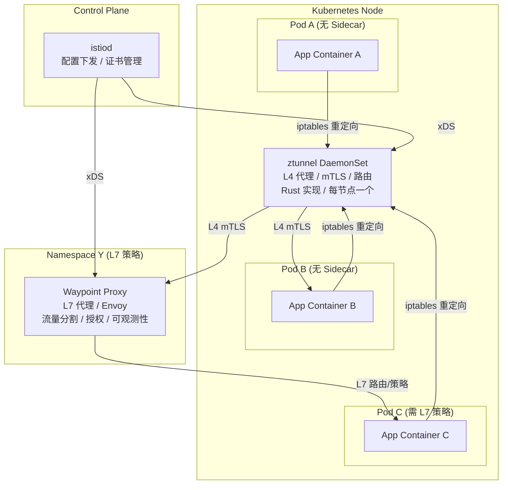

> **生产环境安全提示**
>
> 本文档包含可直接执行的运维命令。执行前请确认：当前目标集群与 Namespace 是否正确；是否具备足够的 RBAC 权限；是否已在非生产环境验证。命令风险等级标注：🔴 高风险（可能造成数据丢失或服务中断）、🟡 中风险（会修改集群状态，但通常可回滚）、🟢 低风险/只读（信息收集，无副作用）。


# [[Istio|Istio]] Ambient Mesh 与 L7 策略深度实践

> **最后更新**: 2026-04-24
> **适用版本**: Istio v1.29+ (Ambient GA)
> **难度**: 高级

---

<!-- chunk: 概述 -->## 概述

Istio Ambient Mesh 代表了服务网格架构的下一代演进方向。传统的 Sidecar 模式虽然功能成熟，但在资源开销、Pod 启动延迟、运维复杂度等方面存在固有局限。Ambient Mesh 通过将代理能力从每个 Pod 的 Sidecar 中抽离到节点级的共享代理（ztunnel）和按需部署的 L7 代理（waypoint proxy），实现了"无 Sidecar"的服务网格体验。

2026年，Istio v1.29 正式将 Ambient Mesh 标记为 GA（General Availability），标志着这项技术已具备生产环境部署的成熟度。本文档从生产环境运维专家的角度，全面覆盖 Ambient Mesh 的架构原理、ztunnel 配置、waypoint proxy 部署、L4/L7 策略配置、从 Sidecar 模式的迁移策略，以及生产环境的故障排查和性能调优实践。

## Ambient Mesh 架构全景



---

<!-- chunk: 一、Ambient Mesh 核心组件 -->## 一、Ambient Mesh 核心组件

## 1.1 ztunnel 节点级代理

ztunnel 是 Ambient Mesh 的核心组件，以 DaemonSet 形式在每个 Kubernetes 节点上运行一个实例。它基于 Rust 实现，负责 L4 层的流量处理、mTLS 加密和基础路由功能：

```yaml
apiVersion: apps/v1
kind: DaemonSet
metadata:
  name: ztunnel
  namespace: istio-system
  labels:
    app: ztunnel
    istio.io/dataplane-mode: ambient
spec:
  selector:
    matchLabels:
      app: ztunnel
  template:
    metadata:
      labels:
        app: ztunnel
        istio.io/dataplane-mode: ambient
    spec:
      serviceAccountName: ztunnel
      hostNetwork: true
      dnsPolicy: ClusterFirstWithHostNet
      tolerations:
        - operator: Exists
      priorityClassName: system-node-critical
      containers:
        - name: ztunnel
          image: gcr.io/istio-release/ztunnel:1.29.0
          securityContext:
            capabilities:
              add:
                - NET_ADMIN
            privileged: false
          resources:
            requests:
              cpu: "100m"
              memory: "128Mi"
            limits:
              cpu: "2000m"
              memory: "1Gi"
          env:
            - name: ISTIO_META_CLUSTER_ID
              value: "Kubernetes"
            - name: ISTIO_META_NODE_NAME
              valueFrom:
                fieldRef:
                  fieldPath: spec.nodeName
          ports:
            - name: health
              containerPort: 15021
            - name: dns
              containerPort: 15053
```

ztunnel 核心能力：

| 能力 | 说明 |
|:---|:---|
| L4 代理 | TCP 连接代理，支持 HTTP/2 和 [[gRPC|gRPC]] 的透传 |
| mTLS | 基于 [[SPIFFE|SPIFFE]] 身份的自动证书管理，每Pod粒度的身份标识 |
| HBONE 隧道 | HTTP-Based Overlay Network Encapsulation，用于跨节点通信 |
| 健康检查 | 代为执行服务健康检查，减少应用负担 |
| 指标导出 | L4 层连接指标、字节计数、错误率 |
| DNS 代理 | 节点级 DNS 解析，支持 K8s [[Service|Service]] 发现 |

## 1.2 Waypoint Proxy L7 代理

Waypoint Proxy 是按需部署的 Envoy 代理实例，负责 L7 层的高级流量管理和安全策略。当命名空间或服务需要 L7 能力时（如流量分割、基于 HTTP 的授权策略、故障注入等），才需要部署 waypoint：

```yaml
apiVersion: networking.istio.io/v1
kind: ServiceEntry
metadata:
  name: waypoint-for-namespace
  namespace: production
  annotations:
    istio.io/for-waypoint: "true"
spec:
  hosts:
    - "production.svc.cluster.local"
  location: MESH_INTERNAL
  resolution: NONE
---
apiVersion: apps/v1
kind: Deployment
metadata:
  name: waypoint-proxy
  namespace: production
spec:
  replicas: 2
  selector:
    matchLabels:
      istio.io/waypoint-for: namespace
  template:
    metadata:
      labels:
        istio.io/waypoint-for: namespace
      annotations:
        sidecar.istio.io/inject: "false"
    spec:
      containers:
        - name: istio-proxy
          image: gcr.io/istio-release/proxyv2:1.29.0
          args:
            - proxy
            - waypoint
          resources:
            requests:
              cpu: "100m"
              memory: "128Mi"
            limits:
              cpu: "1000m"
              memory: "1Gi"
          ports:
            - name: http-envoy-prom
              containerPort: 15090
```

---

<!-- chunk: 二、安装与配置 -->## 二、安装与配置

## 2.1 Ambient 模式安装

``` bash
# 🟢 低风险：只读/信息收集，通常无副作用
istioctl install --set profile=ambient \
  --set values.global.proxy.holdApplicationUntilProxyStarts=true \
  --set meshConfig.accessLogEncoding=JSON \
  --set meshConfig.accessLogFile=/dev/stdout \
  --set meshConfig.defaultConfig.tracing.zipkin.address=zipkin.istio-system:9411 \
  -y

istioctl verify-install
```
## 2.2 Ambient 安装验证输出

``` bash
# 🟢 低风险：只读/信息收集，通常无副作用
$ istioctl verify-install

✔ Istio control plane "default" is installed in namespace "istio-system"
✔ Istiod pod istiod-6f9c6b7b4c-2xk8j is healthy
✔ Istiod pod istiod-6f9c6b7b4c-5mnpq is healthy
✔ Istiod pod istiod-6f9c6b7b4c-8rtyl is healthy
✔ Ingress gateway "istio-ingressgateway" is installed and healthy
✔ CNI DaemonSet "istio-cni-node" is running on all nodes
✔ ztunnel DaemonSet "ztunnel" is running on all nodes
✔ Ambient mesh components verified successfully

$ kubectl get pods -n istio-system -o wide
NAME                                    READY   STATUS    RESTARTS   AGE   IP            NODE
istiod-6f9c6b7b4c-2xk8j                1/1     Running   0          5m    10.0.1.10    node-1
istiod-6f9c6b7b4c-5mnpq                1/1     Running   0          5m    10.0.1.11    node-2
istiod-6f9c6b7b4c-8rtyl                1/1     Running   0          5m    10.0.1.12    node-3
istio-ingressgateway-7d68b4fbb6-abc12  1/1     Running   0          5m    10.0.2.10    node-1
istio-ingressgateway-7d68b4fbb6-def34  1/1     Running   0          5m    10.0.2.11    node-2
istio-cni-node-abcde                   1/1     Running   0          5m    10.0.3.10    node-1
istio-cni-node-fghij                   1/1     Running   0          5m    10.0.3.11    node-2
istio-cni-node-klmno                   1/1     Running   0          5m    10.0.3.12    node-3
ztunnel-abcde                          1/1     Running   0          5m    10.0.3.10    node-1
ztunnel-fghij                          1/1     Running   0          5m    10.0.3.11    node-2
ztunnel-klmno                          1/1     Running   0          5m    10.0.3.12    node-3

$ kubectl get ns -L istio.io/dataplane-mode
NAME              STATUS   AGE   DATAPLANE MODE
default           Active   30d   ambient
production        Active   30d   ambient
staging           Active   30d   ambient
istio-system      Active   30d   
kube-system       Active   30d   
monitoring        Active   30d   
```
## 2.2 命名空间加入 Ambient 数据平面

> ⚠️ **🟡 中危变更** — 变更集群资源状态，建议先 --dry-run 或 diff 确认
> - `kubectl label/annotate`：改元数据可能影响选择器/控制器

``` bash
# 🟡 中风险：会修改集群/资源状态，执行前请确认目标、影响范围与授权
kubectl label namespace default istio.io/dataplane-mode=ambient

kubectl label namespace production istio.io/dataplane-mode=ambient

kubectl label namespace production istio.io/use-waypoint=namespace-waypoint

kubectl label namespace staging istio.io/dataplane-mode=ambient istio.io/use-waypoint=none
```
## 2.3 按服务级别控制 Waypoint 使用

```yaml
apiVersion: v1
kind: Service
metadata:
  name: reviews
  namespace: default
  labels:
    istio.io/use-waypoint: reviews-waypoint
spec:
  selector:
    app: reviews
  ports:
    - name: http
      port: 9080
      targetPort: 9080
---
apiVersion: v1
kind: Service
metadata:
  name: ratings
  namespace: default
  labels:
    istio.io/use-waypoint: none
spec:
  selector:
    app: ratings
  ports:
    - name: http
      port: 9080
      targetPort: 9080
```

---

<!-- chunk: 三、L4 策略配置 -->## 三、L4 策略配置

## 3.1 ztunnel L4 安全策略

Ambient 模式下，L4 层的安全策略由 ztunnel 直接执行，无需 waypoint 参与：

```yaml
apiVersion: security.istio.io/v1beta1
kind: AuthorizationPolicy
metadata:
  name: allow-within-namespace
  namespace: default
spec:
  action: ALLOW
  rules:
    - from:
        - source:
            namespaces: ["default"]
      to:
        - operation:
            ports: ["9080"]
---
apiVersion: security.istio.io/v1beta1
kind: AuthorizationPolicy
metadata:
  name: deny-all-default
  namespace: production
spec:
  action: DENY
  rules:
    - from:
        - source:
            notNamespaces: ["production", "istio-system"]
---
apiVersion: security.istio.io/v1beta1
kind: PeerAuthentication
metadata:
  name: default
  namespace: istio-system
spec:
  mtls:
    mode: STRICT
```

## 3.2 L4 流量可观测性

```yaml
apiVersion: telemetry.istio.io/v1alpha1
kind: Telemetry
metadata:
  name: default-ambient
  namespace: istio-system
spec:
  accessLogging:
    - providers:
        - name: envoy
  metrics:
    - providers:
        - name: prometheus
```

## 3.3 ztunnel Prometheus 告警规则

```yaml
apiVersion: monitoring.coreos.com/v1
kind: PrometheusRule
metadata:
  name: ambient-ztunnel-alerts
  namespace: istio-system
spec:
  groups:
    - name: ztunnel.rules
      rules:
        - alert: ZtunnelPodDown
          expr: up{job="ztunnel"} == 0
          for: 2m
          labels:
            severity: critical
          annotations:
            summary: "ztunnel DaemonSet pod is down on node {{ $labels.instance }}"
            description: "The ztunnel node-level proxy on node {{ $labels.instance }} has been down for more than 2 minutes. All Ambient mesh traffic on this node is affected."

        - alert: ZtunnelHighConnectionRate
          expr: rate(istio_connections_opened_total{reporter="ztunnel"}[5m]) > 500
          for: 5m
          labels:
            severity: warning
          annotations:
            summary: "High connection rate on ztunnel"
            description: "The ztunnel proxy is opening more than 500 connections per second. This may indicate a traffic spike or connection leak."

        - alert: ZtunnelHighErrorRate
          expr: |
            sum(rate(istio_connections_failed_total{reporter="ztunnel"}[5m])) by (node)
            /
            sum(rate(istio_connections_opened_total{reporter="ztunnel"}[5m])) by (node) > 0.1
          for: 3m
          labels:
            severity: warning
          annotations:
            summary: "High connection failure rate on ztunnel node {{ $labels.node }}"
            description: "More than 10% of connections are failing on ztunnel for node {{ $labels.node }}."

        - alert: WaypointHighLatency
          expr: histogram_quantile(0.99, rate(istio_request_duration_milliseconds_bucket{reporter="waypoint"}[5m])) > 2000
          for: 5m
          labels:
            severity: warning
          annotations:
            summary: "Waypoint proxy P99 latency above 2 seconds"
            description: "The waypoint proxy is experiencing high latency. Consider scaling up waypoint replicas."
```

---

<!-- chunk: 四、L7 策略配置 -->## 四、L7 策略配置

## 4.1 Waypoint 上的流量管理

```yaml
apiVersion: networking.istio.io/v1
kind: VirtualService
metadata:
  name: reviews-route
  namespace: default
spec:
  hosts:
    - reviews
  http:
    - matchers:
      - - headers=""
      - end-user=""
      - exact="jason"
      - route=""
      - - destination=""
      - host="reviews"
      - subset="v2"
    - route:
        - destination:
            host: reviews
            subset: v1
          weight: 75
        - destination:
            host: reviews
            subset: v2
          weight: 25
      retries:
        attempts: 3
        perTryTimeout: 2s
        retryOn: 5xx,reset,connect-failure
      timeout: 10s
---
apiVersion: networking.istio.io/v1
kind: DestinationRule
metadata:
  name: reviews
  namespace: default
spec:
  host: reviews
  trafficPolicy:
    loadBalancer:
      simple: LEAST_CONN
    connectionPool:
      tcp:
        maxConnections: 100
      http:
        http1MaxPendingRequests: 1000
        maxRequestsPerConnection: 10
    outlierDetection:
      consecutive5xxErrors: 5
      interval: 30s
      baseEjectionTime: 30s
      maxEjectionPercent: 50
  subsets:
    - name: v1
      labels:
        version: v1
    - name: v2
      labels:
        version: v2
```

## 4.2 L7 授权策略

```yaml
apiVersion: security.istio.io/v1beta1
kind: AuthorizationPolicy
metadata:
  name: reviews-l7-policy
  namespace: default
spec:
  selector:
    matchLabels:
      app: reviews
  action: ALLOW
  rules:
    - from:
        - source:
            principals: ["cluster.local/ns/default/sa/bookinfo-productpage"]
      to:
        - operation:
            methods: ["GET"]
            paths: ["/reviews/*"]
    - from:
        - source:
            namespaces: ["default"]
      to:
        - operation:
            methods: ["GET", "POST"]
            paths: ["/reviews/health"]
      when:
        - key: request.headers[x-user-role]
          values: ["admin"]
```

## 4.3 故障注入

```yaml
apiVersion: networking.istio.io/v1
kind: VirtualService
metadata:
  name: ratings-fault
  namespace: default
spec:
  hosts:
    - ratings
  http:
    - fault:
        delay:
          percentage:
            value: 10
          fixedDelay: 5s
      route:
        - destination:
            host: ratings
            subset: v1
    - fault:
        abort:
          percentage:
            value: 5
          httpStatus: 500
      route:
        - destination:
            host: ratings
            subset: v1
```

## 4.4 流量镜像

```yaml
apiVersion: networking.istio.io/v1
kind: VirtualService
metadata:
  name: reviews-mirror
  namespace: default
spec:
  hosts:
    - reviews
  http:
    - route:
        - destination:
            host: reviews
            subset: v1
          weight: 100
      mirror:
        host: reviews
        subset: v2
      mirrorPercentage:
        value: 10
```

---

<!-- chunk: 五、从 Sidecar 迁移到 Ambient -->## 五、从 Sidecar 迁移到 Ambient

## 5.1 迁移架构


## 5.2 迁移操作步骤

> ⚠️ **🟡 中危变更** — 变更集群资源状态，建议先 --dry-run 或 diff 确认
> - `kubectl label/annotate`：改元数据可能影响选择器/控制器
> - `kubectl rollout undo/restart`：触发滚动变更，影响副本

``` bash
# 🟡 中风险：会修改集群/资源状态，执行前请确认目标、影响范围与授权
# Phase 2: 安装 Ambient 组件 (与现有 Sidecar 共存)
istioctl install --set profile=ambient -y

# Phase 3: 逐命名空间迁移
# Step 1: 将命名空间加入 Ambient 数据平面
kubectl label namespace default istio.io/dataplane-mode=ambient

# Step 2: 移除 Sidecar 注入标签
kubectl label namespace default istio-injection-

# Step 3: 重启命名空间中的 Pod
kubectl rollout restart deployment -n default

# Step 4: 验证 ztunnel 已接管流量
istioctl proxy-status
kubectl logs -n istio-system daemonset/ztunnel --tail=50

# Step 5: 验证 mTLS 连接
istioctl analyze -n default

# Step 6: 性能对比测试
fortio load -t 60s -qps 1000 http://reviews:9080/reviews/0
```
## 5.3 迁移验证输出

> ⚠️ **🟡 中危变更** — 变更集群资源状态，建议先 --dry-run 或 diff 确认
> - `kubectl rollout undo/restart`：触发滚动变更，影响副本

``` bash
# 🟡 中风险：会修改集群/资源状态，执行前请确认目标、影响范围与授权
$ kubectl rollout restart deployment -n default
deployment.apps/productpage-v1 restarted
deployment.apps/reviews-v1 restarted
deployment.apps/reviews-v2 restarted
deployment.apps/ratings-v1 restarted
deployment.apps/details-v1 restarted

$ istioctl proxy-status
NAME                                                   CLUSTER     CDS    LDS    EDS    RDS    ECDS    ISTIOD                      VERSION
ztunnel-abcde.istio-system                              Kubernetes  SYNCED SYNCED SYNCED ---    ---    istiod-6f9c6b7b4c-2xk8j     1.29.0
ztunnel-fghij.istio-system                              Kubernetes  SYNCED SYNCED SYNCED ---    ---    istiod-6f9c6b7b4c-5mnpq     1.29.0
ztunnel-klmno.istio-system                              Kubernetes  SYNCED SYNCED SYNCED ---    ---    istiod-6f9c6b7b4c-8rtyl     1.29.0
waypoint-proxy-7b9f8c6d4f-abc12.default                 Kubernetes  SYNCED SYNCED SYNCED SYNCED SYNCED istiod-6f9c6b7b4c-2xk8j     1.29.0
waypoint-proxy-7b9f8c6d4f-def34.default                 Kubernetes  SYNCED SYNCED SYNCED SYNCED SYNCED istiod-6f9c6b7b4c-5mnpq     1.29.0

$ istioctl analyze -n default
✔ No validation issues found when analyzing namespace "default".
✔ Ambient mode configuration is valid.
✔ All ztunnel pods are synced and healthy.
```
## 5.4 迁移注意事项

```yaml
兼容性检查:
  EnvoyFilter: 部分 EnvoyFilter 可能不兼容 Ambient，需要逐一验证
  Sidecar 资源: Sidecar 资源在 Ambient 模式不适用
  WorkloadEntry: VM 工作负载仍需 Sidecar
  TCP 服务: L4 功能由 ztunnel 提供，完全兼容
  HTTP 服务: L7 功能需要 waypoint，确保已部署
  JWT 验证: 需要 waypoint 支持
  WASM 扩展: 需要 waypoint 支持

不支持迁移的场景:
  - 使用自定义 EnvoyFilter 的服务
  - 需要自定义 Sidecar 资源的服务
  - VM/裸金属工作负载
  - 使用 iptables 规则特殊配置的 Pod
```

---

<!-- chunk: 六、可观测性配置 -->## 六、可观测性配置

## 六、Ambient 模式监控栈

```yaml
apiVersion: telemetry.istio.io/v1alpha1
kind: Telemetry
metadata:
  name: ambient-telemetry
  namespace: istio-system
spec:
  accessLogging:
    - providers:
        - name: otel-collector
  metrics:
    - providers:
        - name: prometheus
      overrides:
        - matchers:
          - metric="ALL_METRICS"
          - tagOverrides=""
          - source_canonical_service=""
          - value="source_workload"
          - destination_canonical_service=""
          - value="destination_workload"
  tracing:
    - providers:
        - name: otel-collector
      randomSamplingPercentage: 10.0
---
apiVersion: v1
kind: ConfigMap
metadata:
  name: istio-otel-collector
  namespace: istio-system
data:
  otel-collector-config: |
    receivers:
      otlp:
        protocols:
          grpc:
            endpoint: 0.0.0.0:4317
          http:
            endpoint: 0.0.0.0:4318
    exporters:
      prometheus:
        endpoint: 0.0.0.0:8889
      jaeger:
        endpoint: jaeger-collector.istio-system:14250
        tls:
          insecure: true
      elasticsearch:
        endpoints:
          - http://elasticsearch.istio-system:9200
    service:
      pipelines:
        metrics:
          receivers: [otlp]
          exporters: [prometheus]
        traces:
          receivers: [otlp]
          exporters: [jaeger]
        logs:
          receivers: [otlp]
          exporters: [elasticsearch]
```

## 6.2 ztunnel 关键指标

```promql
istio_connections_opened_total{reporter="ztunnel"}
istio_connections_closed_total{reporter="ztunnel"}
istio_bytes_sent_total{reporter="ztunnel"}
istio_bytes_received_total{reporter="ztunnel"}
istio_request_duration_milliseconds_bucket{reporter="ztunnel"}
```

## 6.3 Waypoint 关键指标

```promql
istio_requests_total{reporter="waypoint"}
istio_request_duration_milliseconds_bucket{reporter="waypoint"}
istio_request_bytes_bucket{reporter="waypoint"}
istio_response_bytes_bucket{reporter="waypoint"}
envoy_cluster_upstream_cx_active{cluster_name="waypoint"}
```

---

<!-- chunk: 七、性能调优 -->## 七、性能调优

## 7.1 ztunnel 资源配置

```yaml
apiVersion: apps/v1
kind: DaemonSet
metadata:
  name: ztunnel
  namespace: istio-system
spec:
  template:
    spec:
      containers:
        - name: ztunnel
          resources:
            requests:
              cpu: "100m"
              memory: "128Mi"
            limits:
              cpu: "2000m"
              memory: "1Gi"
          env:
            - name: ZTUNNEL_MAX_CONNECTIONS
              value: "100000"
            - name: ZTUNNEL_WORKER_THREADS
              value: "4"
            - name: ZTUNNEL_LOG_LEVEL
              value: "warn"
```

## 7.2 Waypoint 资源配置

```yaml
apiVersion: autoscaling/v2
kind: HorizontalPodAutoscaler
metadata:
  name: waypoint-hpa
  namespace: production
spec:
  scaleTargetRef:
    apiVersion: apps/v1
    kind: Deployment
    name: waypoint-proxy
  minReplicas: 2
  maxReplicas: 10
  metrics:
    - type: Resource
      resource:
        name: cpu
        target:
          type: Utilization
          averageUtilization: 70
    - type: Pods
      pods:
        metric:
          name: istio_requests_per_second
        target:
          type: AverageValue
          averageValue: "1000"
```

## 7.3 性能基准对比

```yaml
Sidecar vs Ambient 性能基准:
  测试场景: 100 并发, 1000 RPS, 持续 60s

  Sidecar 模式:
    P50 延迟增加: 1.8ms
    P99 延迟增加: 4.2ms
    内存/Pod: ~120MB
    CPU/Pod: ~150m
    总资源 (1000 Pod): ~120GB RAM

  Ambient 模式 (L4 only):
    P50 延迟增加: 0.3ms
    P99 延迟增加: 0.8ms
    内存/节点: ~50MB (ztunnel)
    CPU/节点: ~80m (ztunnel)
    总资源 (50 节点): ~2.5GB RAM

  Ambient 模式 (L4 + L7 waypoint):
    P50 延迟增加: 1.0ms
    P99 延迟增加: 2.5ms
    内存: ztunnel(50MB/节点) + waypoint(200MB×5)
    总资源: ~3.5GB RAM
```

## 7.4 Ambient Mesh 参数参考

| 参数 | 组件 | 默认值 | 说明 | 推荐值 (生产) |
|:---|:---|:---|:---|:---|
| ZTUNNEL_MAX_CONNECTIONS | ztunnel | 100000 | 最大并发连接数 | 100000 |
| ZTUNNEL_WORKER_THREADS | ztunnel | 4 | 工作线程数 | 4-8 |
| ZTUNNEL_LOG_LEVEL | ztunnel | info | 日志级别 | warn |
| proxy.concurrency | waypoint | 2 | Envoy 并发工作线程 | 2-4 |
| minReplicas | waypoint | 1 | 最小副本数 | 2 |
| maxReplicas | waypoint | 5 | 最大副本数 | 10 |
| averageUtilization | waypoint HPA | 80 | CPU 目标利用率 | 70 |

---

<!-- chunk: 八、故障排查 -->## 八、故障排查

## 8.1 Ambient 故障排查命令

> ⚠️ **🟡 中危变更** — 变更集群资源状态，建议先 --dry-run 或 diff 确认
> - `kubectl exec`：进入容器执行命令，可能改变容器状态

``` bash
# 🟡 中风险：会修改集群/资源状态，执行前请确认目标、影响范围与授权
#!/bin/bash

echo "=== ztunnel 状态检查 ==="
kubectl get pods -n istio-system -l app=ztunnel -o wide
kubectl logs -n istio-system daemonset/ztunnel --tail=50

echo "=== Waypoint 状态检查 ==="
kubectl get pods -A -l istio.io/waypoint-for

echo "=== Ambient 命名空间检查 ==="
kubectl get ns -l istio.io/dataplane-mode=ambient

echo "=== ztunnel 配置检查 ==="
istioctl proxy-config cluster ztunnel-xxxxx -n istio-system

echo "=== Waypoint 配置检查 ==="
istioctl proxy-config route waypoint-proxy-xxxxx -n production

echo "=== mTLS 连接验证 ==="
istioctl proxy-status

echo "=== 流量验证 ==="
kubectl exec -n default deploy/sleep -- curl -s http://reviews:9080/reviews/0 -o /dev/null -w "%{http_code}\n"

echo "=== ztunnel DNS 检查 ==="
kubectl exec -n istio-system daemonset/ztunnel -- nslookup reviews.default.svc.cluster.local

echo "=== 分析配置问题 ==="
istioctl analyze -A
```
## 8.2 ztunnel 日志分析输出

``` bash
# 🟢 低风险：只读/信息收集，通常无副作用
$ kubectl logs -n istio-system daemonset/ztunnel --tail=30

2026-04-24T10:00:01.123Z INFO ztunnel::proxy::inbound: accepted inbound connection src=10.0.1.5:38214 dst=10.0.2.10:9080
2026-04-24T10:00:01.124Z INFO ztunnel::proxy::outbound: proxying to upstream src=10.0.1.5 dst=10.0.2.10:9080 via HBONE
2026-04-24T10:00:01.156Z DEBUG ztunnel::tls: TLS handshake completed with peer identity=spiffe://cluster.local/ns/default/sa/productpage
2026-04-24T10:00:01.200Z INFO ztunnel::proxy::inbound: connection closed src=10.0.1.5:38214 duration=77ms bytes_sent=2048 bytes_recv=512
2026-04-24T10:00:02.001Z WARN ztunnel::proxy::outbound: connection failed to upstream 10.0.3.5:9080 error=connection refused
2026-04-24T10:00:05.123Z INFO ztunnel::dns: resolved reviews.default.svc.cluster.local -> [10.0.2.10, 10.0.2.11, 10.0.2.12]
2026-04-24T10:00:10.456Z INFO ztunnel::proxy::inbound: accepted inbound connection src=10.0.1.8:42156 dst=10.0.2.11:9080

```
## 8.3 常见问题与解决

| 问题 | 原因 | 诊断命令 | 解决方案 |
|:---|:---|:---|:---|
| Pod 无法通信 | 命名空间未加入 Ambient | `kubectl get ns -L istio.io/dataplane-mode` | `kubectl label ns <ns> istio.io/dataplane-mode=ambient` |
| mTLS 失败 | ztunnel 未运行 | `kubectl get pods -l app=ztunnel` | 检查 DaemonSet 状态和节点资源 |
| L7 策略不生效 | 缺少 waypoint | `istioctl waypoint list` | `istioctl waypoint apply -n <ns>` |
| 延迟异常 | waypoint 资源不足 | `kubectl top pods -l istio.io/waypoint-for` | 增加 waypoint 副本和资源 |
| DNS 解析失败 | ztunnel DNS 代理异常 | `kubectl logs -l app=ztunnel` | 检查 ztunnel 日志、CoreDNS 配置 |
| EnvoyFilter 冲突 | 自定义过滤器不兼容 | `kubectl get envoyfilter -A` | 移除或迁移到 WASM waypoint |
| Sidecar 残留 | 双重注入 | `kubectl get pod -o yaml` | 清除 Sidecar annotation 后重启 |
| 503 UH | 目标服务无健康端点 | `istioctl proxy-config endpoint` | 检查 Pod readiness、服务端口 |
| HBONE 超时 | 跨节点隧道失败 | `kubectl logs -l app=ztunnel` | 检查节点间网络连通性 |
| Waypoint 不启动 | 资源不足或镜像拉取失败 | `kubectl describe deploy waypoint-proxy` | 检查资源限制和镜像拉取策略 |

---

<!-- chunk: 九、最佳实践 -->## 九、最佳实践

## 9.1 部署最佳实践

```yaml
推荐策略:
  1. 新部署优先使用 Ambient 模式
  2. 现有 Sidecar 逐步迁移，不急于全面切换
  3. L4 需求优先使用 ztunnel (不部署 waypoint)
  4. 仅对需要 L7 策略的服务/命名空间部署 waypoint
  5. 使用 istioctl analyze 定期检查配置
  6. 保持 Istio 版本更新 (N-1 策略)
```

## 9.2 Waypoint 设计原则

```yaml
Waypoint 粒度选择:
  命名空间级 (推荐):
    - 一个命名空间共享一个 waypoint
    - 适合大多数场景
    - 资源开销最小

  服务级:
    - 每个关键服务独立 waypoint
    - 适合高流量/高隔离需求
    - 资源开销较大

  不使用 Waypoint:
    - 纯 L4 通信场景
    - 性能极致敏感场景
    - ztunnel 足够满足需求
```

---

<!-- chunk: 十、Ambient Mesh 生产环境部署检查清单 -->## 十、Ambient Mesh 生产环境部署检查清单

## 部署前验证步骤

在将 Istio Ambient Mesh 部署到生产环境之前，需要按照以下检查清单逐项验证，确保所有关键条件已满足。这些检查项涵盖了基础设施兼容性、控制平面健康状态、数据平面功能验证和安全策略确认等维度。每一步的验证命令和预期输出都已列出，方便运维人员快速执行。

```yaml
Ambient_Mesh_生产检查清单:
  基础设施检查:
    - Kubernetes 集群版本 >= 1.28: kubectl version --short
    - 节点资源充足 (每节点至少 2 CPU / 4GB 可用): kubectl describe node | grep Allocatable
    - CNI 插件兼容性验证: istioctl verify-install
    - iptables/nftables 可用性确认 (ztunnel 需要NET_ADMIN capability)
    - 节点间 Pod CIDR 不重叠或路由已配置

  控制平面检查:
    - istiod 运行正常: kubectl get pods -n istio-system -l app=istiod
    - istiod 副本数 >= 3: kubectl get deploy istiod -n istio-system
    - istiod 资源使用正常: kubectl top pods -n istio-system
    - xDS 配置同步正常: istioctl proxy-status
    - HPA 配置正确: kubectl get hpa -n istio-system

  ztunnel 检查:
    - ztunnel DaemonSet 已部署: kubectl get ds -n istio-system -l app=ztunnel
    - 每个节点一个 ztunnel Pod: kubectl get pods -n istio-system -l app=ztunnel -o wide
    - ztunnel 资源使用正常: kubectl top pods -n istio-system -l app=ztunnel
    - ztunnel 日志无严重错误: kubectl logs -n istio-system ds/ztunnel --tail=50

  Waypoint 检查:
    - Waypoint Deployment 已创建: kubectl get deploy -A -l istio.io/waypoint-for
    - Waypoint HPA 已配置: kubectl get hpa -A
    - Waypoint 代理同步正常: istioctl proxy-status | grep waypoint
    - L7 策略已生效: istioctl proxy-config route <waypoint-pod> -n <namespace>

  安全策略检查:
    - mTLS STRICT 模式: kubectl get peerauthentication -A
    - 默认 deny-all 授权策略: kubectl get authorizationpolicy -A
    - 证书有效期检查: istioctl proxy-config secret <ztunnel-pod> -n istio-system
    - 网络策略配合: kubectl get networkpolicy -A

  功能验证:
    - 命名空间已加入 Ambient: kubectl get ns -L istio.io/dataplane-mode
    - 跨 Pod mTLS 通信: kubectl exec <pod> -- curl -s http://<service>/health
    - L7 路由规则生效: 发送测试请求验证 VirtualService 规则
    - 可观测性指标采集: curl Prometheus API 查询 istio_requests_total
    - 告警规则已配置: kubectl get prometheusrule -A
```

## Ambient Mesh 端到端验证脚本

``` bash
# 🟢 低风险：只读/信息收集，通常无副作用
#!/bin/bash
set -e

echo "========================================="
echo "  Ambient Mesh 端到端验证脚本"
echo "========================================="

PASS=0
FAIL=0

check() {
  local description=$1
  local command=$2
  local expected=$3
  
  echo -n "Checking: $description ... "
  result=$(eval "$command" 2>&1) || true
  
  if echo "$result" | grep -q "$expected"; then
    echo "PASS"
    PASS=$((PASS + 1))
  else
    echo "FAIL (expected: $expected)"
    FAIL=$((FAIL + 1))
  fi
}

check "istiod is running" \
  "kubectl get pods -n istio-system -l app=istiod --no-headers | grep Running" \
  "Running"

check "istiod has 3+ replicas" \
  "kubectl get deploy istiod -n istio-system -o jsonpath='{.spec.replicas}'" \
  "3"

check "ztunnel DaemonSet exists" \
  "kubectl get ds ztunnel -n istio-system --no-headers" \
  "ztunnel"

check "ztunnel pods on all nodes" \
  "kubectl get pods -n istio-system -l app=ztunnel --no-headers | grep -c Running" \
  ""

check "Ambient namespace labeled" \
  "kubectl get ns default -L istio.io/dataplane-mode --no-headers" \
  "ambient"

check "mTLS STRICT enabled" \
  "kubectl get peerauthentication default -n istio-system -o jsonpath='{.spec.mtls.mode}'" \
  "STRICT"

check "deny-all authorization policy" \
  "kubectl get authorizationpolicy deny-all-default -n default -o jsonpath='{.spec.action}'" \
  "DENY"

echo ""
echo "========================================="
echo "  Results: $PASS passed, $FAIL failed"
echo "========================================="

if [ $FAIL -gt 0 ]; then
  echo "Some checks failed. Please review and fix before proceeding to production."
  exit 1
else
  echo "All checks passed. Ambient Mesh is ready for production traffic."
  exit 0
fi
```
---

<!-- chunk: 参考链接 -->## 参考链接

- [Istio Ambient 官方文档](https://istio.io/latest/docs/ambient/)
- [ztunnel 设计文档](https://github.com/istio/ztunnel)
- [Ambient Mesh 迁移指南](https://istio.io/latest/docs/ambient/usage/migrate-from-sidecar/)
- [Istio Gateway API](https://istio.io/latest/docs/tasks/traffic-management/ingress/gateway-api/)

---

<!-- chunk: 十一、Ambient Mesh 与 Sidecar 模式详细对比 -->## 十一、Ambient Mesh 与 Sidecar 模式详细对比

## 两种模式的核心差异

Istio 的 Sidecar 模式和 Ambient 模式代表了服务网格架构的两个不同阶段。Sidecar 模式通过在每个应用 Pod 中注入一个独立的 Envoy 代理（约 100MB 内存），提供完整的 L4 和 L7 功能。这种模式在2023年之前是唯一选择，功能最为成熟和稳定。Ambient 模式通过将代理能力从 Pod 级别提升到节点级别，使用 Rust 实现的 ztunnel（约 50MB 每节点）处理 L4 流量和 mTLS，仅在需要 L7 功能时才按需部署 Waypoint Proxy。这种架构大幅降低了资源开销——在一个 50 节点、1000 个 Pod 的集群中，Sidecar 模式需要约 100GB 代理内存，而 Ambient L4 模式仅需约 2.5GB。

## 功能完整性对比

| 功能 | Sidecar 模式 | Ambient L4 (ztunnel) | Ambient L7 (Waypoint) | 说明 |
|:---|:---|:---|:---|:---|
| 自动 mTLS | 完整支持 | 完整支持 | 完整支持 | 两种模式均支持基于 SPIFFE 的身份认证 |
| L4 访问控制 | 完整支持 | 完整支持 | 完整支持 | 命名空间和端口级别授权 |
| L7 路由规则 | 完整支持 | 不支持 | 完整支持 | VirtualService 需要 Waypoint |
| 流量分割/金丝雀 | 完整支持 | 不支持 | 完整支持 | 需要通过 Waypoint 代理实现 |
| 故障注入 | 完整支持 | 不支持 | 完整支持 | 延迟和中断注入 |
| 流量镜像 | 完整支持 | 不支持 | 完整支持 | 镜像到影子服务 |
| JWT 验证 | 完整支持 | 不支持 | 完整支持 | 需要 RequestAuthentication |
| WASM 扩展 | 完整支持 | 不支持 | 部分支持 | 部分过滤器尚未迁移 |
| EnvoyFilter | 完整支持 | 不支持 | 不支持 | 自定义 Envoy 过滤器 |
| TCP 服务路由 | 完整支持 | 完整支持 | 完整支持 | L4 层面的 TCP 代理 |
| gRPC 服务 | 完整支持 | 透传 | 完整支持 | L7 需要 Waypoint |
| Pod 启动影响 | 增加 3-5s | 无影响 | 无影响 | Sidecar 注入导致启动延迟 |
| 资源开销 | ~100MB/Pod | ~50MB/节点 | ~200MB/实例 | Ambient 大幅节省资源 |

---

<!-- chunk: Obsidian 相关文档 -->## Obsidian 相关文档

- 网络 MOC
- [[05-网络/README.md|Domain 03: 企业级服务网格与微服务治理 (Enterprise Service Mesh & Microser...]]
- Domain-26 服务网格与微服务 — 开源项目索引
- Istio 企业级服务网格架构与实践
- Linkerd 企业级服务网格深度实践
- Consul Connect 企业级服务网格管理
- Envoy Proxy 企业级服务网格数据平面深度实践
- Dapr (Distributed Application Runtime) Enterprise 深度实践
- Traefik Mesh Enterprise Service Mesh 深度实践
- 服务网格对比与选型决策指南
- 微服务弹性模式深度实践 — Circuit Breaker, Retry, Timeout, Bulkhead, Rat...
- API 网关与服务网格集成深度实践

## See Also

- 06-traefik-mesh-enterprise
- 07-service-mesh-comparison-selection
- 09-microservice-resilience-patterns
- 10-api-gateway-service-mesh-integration

```

<!-- risk-assessed -->
