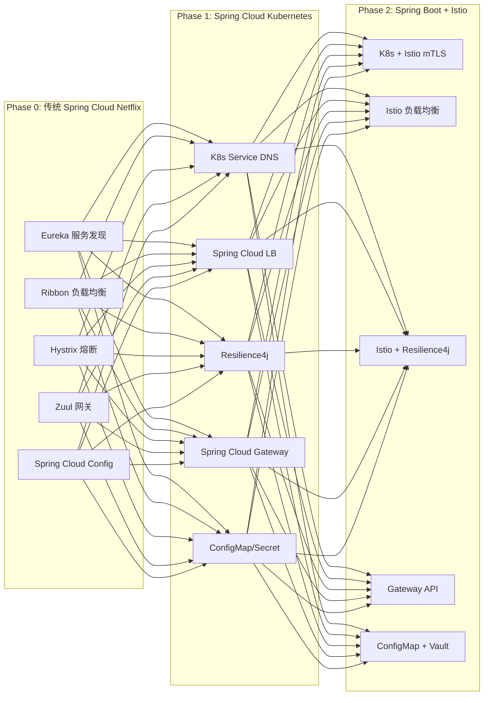
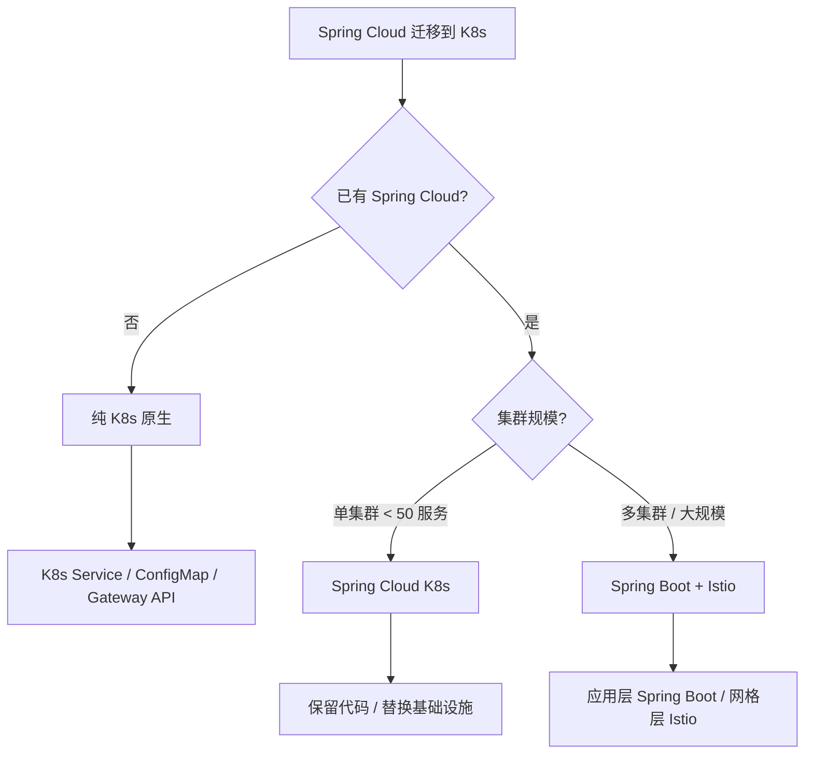
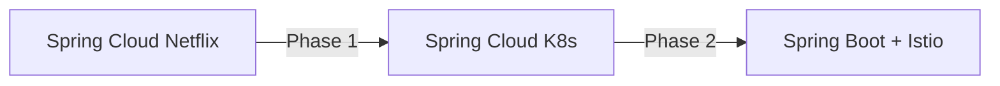
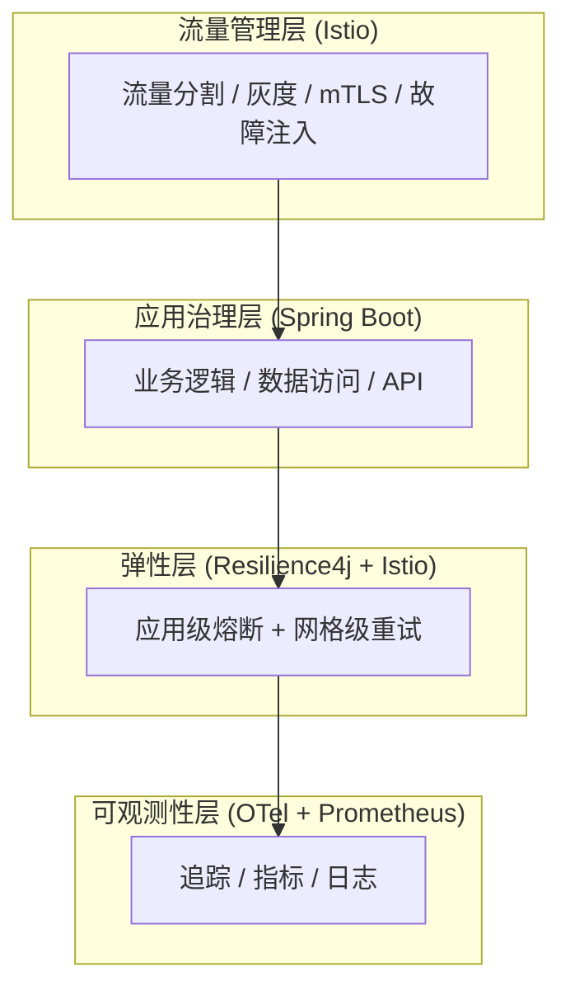

> **生产环境安全提示**
>
> 本文档包含可直接执行的运维命令。执行前请确认：当前目标集群与 Namespace 是否正确；是否具备足够的 RBAC 权限；是否已在非生产环境验证。命令风险等级标注：🔴 高风险（可能造成数据丢失或服务中断）、🟡 中风险（会修改集群状态，但通常可回滚）、🟢 低风险/只读（信息收集，无副作用）。


# Spring Cloud [[kubernetes|Kubernetes]] 与服务网格集成指南

> **适用版本**: Spring Cloud 2024.0+ / Spring Cloud Kubernetes 3.x / [[istio|Istio]] v1.29+
> **最后更新**: 2026-04-24
> **难度**: 高级

---

<!-- chunk: 概述 -->## 概述

Spring Cloud 是 Java 生态中最成熟的微服务框架，但在 Kubernetes 环境中，许多 Spring Cloud 组件的功能已被 K8s 原生能力替代。本指南深入探讨 Spring Cloud 微服务迁移到 Kubernetes 的策略、Spring Cloud Kubernetes 的配置实践、与 Istio 服务网格的集成模式，以及 Resilience4j 容错和分布式事务的完整方案。目标是帮助企业从传统的 Spring Cloud Netflix 架构平滑演进到"Spring Boot 应用 + Kubernetes 基础设施 + Istio 服务网格"的现代云原生架构。

## 迁移架构演进



---

<!-- chunk: 一、Spring Cloud 与 K8s 原生能力映射 -->## 一、Spring Cloud 与 K8s 原生能力映射

## 1.1 能力映射表

| Spring Cloud 组件 | K8s 原生替代 | 推荐策略 |
|:---|:---|:---|
| Eureka (服务发现) | K8s Service + DNS | **使用 K8s 原生** |
| Spring Cloud Config | K8s ConfigMap + Secret | **使用 K8s 原生** |
| Ribbon/LoadBalancer | K8s Service (kube-proxy) | **使用 K8s 原生** |
| Zuul/Spring Cloud Gateway | K8s [[ingress\|Ingress]] / Gateway API | 按需选择 |
| Hystrix (熔断) | Resilience4j / Istio | Resilience4j (应用级) |
| Spring Cloud Sleuth | [[opentelemetry\|OpenTelemetry]] | **使用 OTel** |
| Spring Cloud Bus | K8s Event / ConfigMap Watch | 按需选择 |
| Spring Cloud Stream | Kafka / RabbitMQ on K8s | 保留 |
| Spring Cloud Security | K8s RBAC + Istio mTLS | 按需组合 |

## 1.2 架构决策树



---

<!-- chunk: 二、Spring Cloud Kubernetes 配置 -->## 二、Spring Cloud Kubernetes 配置

## 2.1 依赖配置

```xml
<dependencyManagement>
    <dependencies>
        <dependency>
            <groupId>org.springframework.cloud</groupId>
            <artifactId>spring-cloud-dependencies</artifactId>
            <version>2024.0.1</version>
            <type>pom</type>
            <scope>import</scope>
        </dependency>
    </dependencies>
</dependencyManagement>

<dependencies>
    <dependency>
        <groupId>org.springframework.cloud</groupId>
        <artifactId>spring-cloud-starter-kubernetes-fabric8</artifactId>
    </dependency>
    <dependency>
        <groupId>org.springframework.cloud</groupId>
        <artifactId>spring-cloud-starter-kubernetes-fabric8-config</artifactId>
    </dependency>
    <dependency>
        <groupId>org.springframework.cloud</groupId>
        <artifactId>spring-cloud-starter-loadbalancer</artifactId>
    </dependency>
    <dependency>
        <groupId>org.springframework.cloud</groupId>
        <artifactId>spring-cloud-starter-openfeign</artifactId>
    </dependency>
    <dependency>
        <groupId>io.github.resilience4j</groupId>
        <artifactId>resilience4j-spring-boot3</artifactId>
    </dependency>
    <dependency>
        <groupId>io.github.resilience4j</groupId>
        <artifactId>resilience4j-reactor</artifactId>
    </dependency>
</dependencies>
```

## 2.2 核心配置

```yaml
spring:
  application:
    name: order-service
  cloud:
    kubernetes:
      discovery:
        enabled: true
        all-namespaces: false
        service-labels:
          app-type: spring-boot
      config:
        enabled: true
        name: ${spring.application.name}-config
        namespace: ${KUBERNETES_NAMESPACE:default}
      secrets:
        enabled: true
        name: ${spring.application.name}-secrets
        namespace: ${KUBERNETES_NAMESPACE:default}
      reload:
        enabled: true
        mode: event
        strategy: refresh
```

## 2.3 RBAC 配置

```yaml
apiVersion: v1
kind: ServiceAccount
metadata:
  name: spring-app-sa
  namespace: production
---
apiVersion: rbac.authorization.k8s.io/v1
kind: Role
metadata:
  name: spring-app-reader
  namespace: production
rules:
  - apiGroups: [""]
    resources: ["configmaps", "secrets", "services", "endpoints", "pods"]
    verbs: ["get", "list", "watch"]
---
apiVersion: rbac.authorization.k8s.io/v1
kind: RoleBinding
metadata:
  name: spring-app-reader-binding
  namespace: production
roleRef:
  apiGroup: rbac.authorization.k8s.io
  kind: Role
  name: spring-app-reader
subjects:
  - kind: ServiceAccount
    name: spring-app-sa
```

---

<!-- chunk: 三、服务发现集成 -->## 三、服务发现集成

## 3.1 K8s Service 替代 Eureka

```java
@Configuration
public class ServiceDiscoveryConfig {
    @LoadBalanced
    @Bean
    public RestTemplate restTemplate() {
        return new RestTemplate();
    }
}

@Service
public class OrderService {
    @LoadBalanced
    private final RestTemplate restTemplate;

    public UserDto getUser(Long userId) {
        return restTemplate.getForObject(
            "http://user-service/api/users/" + userId, UserDto.class
        );
    }
}
```

## 3.2 OpenFeign 集成

```java
@FeignClient(name = "user-service", url = "http://user-service.production.svc.cluster.local:8080")
public interface UserClient {
    @GetMapping("/api/users/{id}")
    UserDto getUser(@PathVariable("id") Long id);

    @GetMapping("/api/users")
    List<UserDto> listUsers();
}
```

## 3.3 K8s Service 定义

```yaml
apiVersion: v1
kind: Service
metadata:
  name: user-service
  labels:
    app: user-service
    app-type: spring-boot
spec:
  selector:
    app: user-service
  ports:
    - name: http
      port: 8080
      targetPort: 8080
  type: ClusterIP
```

---

<!-- chunk: 四、配置管理集成 -->## 四、配置管理集成

## 4.1 ConfigMap 配置中心

```yaml
apiVersion: v1
kind: ConfigMap
metadata:
  name: order-service-config
  namespace: production
data:
  application.yml: |
    server:
      port: 8080
    spring:
      datasource:
        hikari:
          maximum-pool-size: 15
          minimum-idle: 3
    resilience4j:
      circuitbreaker:
        instances:
          user-service:
            sliding-window-size: 10
            failure-rate-threshold: 50
            wait-duration-in-open-state: 30s
    feign:
      client:
        config:
          default:
            connect-timeout: 5000
            read-timeout: 10000
```

## 4.2 Secret 管理

```yaml
apiVersion: v1
kind: Secret
metadata:
  name: order-service-secrets
  namespace: production
type: Opaque
stringData:
  SPRING_DATASOURCE_USERNAME: "app_user"
  SPRING_DATASOURCE_PASSWORD: "s3cur3P@ssw0rd"
  SPRING_REDIS_PASSWORD: "r3disP@ss"
```

## 4.3 配置热更新

```java
@RestController
@RefreshScope
public class DynamicConfigController {
    @Value("${app.feature.enabled:false}")
    private boolean featureEnabled;

    @Value("${app.max-retries:3}")
    private int maxRetries;

    @GetMapping("/config")
    public Map<String, Object> getConfig() {
        return Map.of("featureEnabled", featureEnabled, "maxRetries", maxRetries);
    }
}
```

---

<!-- chunk: 五、Spring Cloud Gateway on K8s -->## 五、Spring Cloud Gateway on K8s

## 5.1 Gateway 部署

```yaml
server:
  port: 8080
spring:
  cloud:
    gateway:
      discovery:
        locator:
          enabled: true
          lower-case-service-id: true
      routes:
        - id: user-service
          uri: http://user-service.production.svc.cluster.local:8080
          predicates:
            - Path=/api/users/**
          filters:
            - name: CircuitBreaker
              args:
                name: user-service-cb
                fallbackUri: forward:/fallback/users
        - id: order-service
          uri: http://order-service.production.svc.cluster.local:8080
          predicates:
            - Path=/api/orders/**
          filters:
            - name: RequestRateLimiter
              args:
                redis-rate-limiter.replenishRate: 100
                redis-rate-limiter.burstCapacity: 200
                key-resolver: "#{@ipKeyResolver}"
```

## 5.2 K8s 部署

```yaml
apiVersion: apps/v1
kind: Deployment
metadata:
  name: spring-cloud-gateway
spec:
  replicas: 2
  selector:
    matchLabels:
      app: spring-cloud-gateway
  template:
    metadata:
      labels:
        app: spring-cloud-gateway
      annotations:
        sidecar.istio.io/inject: "true"
    spec:
      containers:
        - name: gateway
          image: registry.example.com/spring-cloud-gateway:v1.0.0
          ports:
            - containerPort: 8080
          resources:
            requests:
              memory: "512Mi"
              cpu: "200m"
            limits:
              memory: "1Gi"
              cpu: "1000m"
          env:
            - name: JAVA_OPTS
              value: "-XX:+UseContainerSupport -XX:MaxRAMPercentage=75.0"
```

---

<!-- chunk: 六、Spring Cloud 与 Istio 对比与迁移 -->## 六、Spring Cloud 与 Istio 对比与迁移

## 6.1 能力对比

| 能力 | Spring Cloud | Istio | 建议 |
|:---|:---|:---|:---|
| 服务发现 | K8s Discovery | Pilot + K8s | K8s 原生 |
| 负载均衡 | Spring LB | Envoy Sidecar | Istio (透明) |
| 熔断 | Resilience4j | OutlierDetection | 两者皆可 |
| 限流 | Redis RL | Envoy RL | Istio (全局) |
| 重试 | Spring Retry | VirtualService | Istio (透明) |
| mTLS | Spring Security | Istio 自动 | Istio (零代码) |
| 追踪 | Micrometer | Envoy 注入 | OTel Agent |
| 灰度发布 | 自定义 | Istio + Argo | Istio |

## 6.2 迁移路径



## 6.3 Phase 1: 移除 Eureka/Ribbon

```yaml
# 移除依赖:
# spring-cloud-starter-netflix-eureka-client
# spring-cloud-starter-netflix-ribbon

# 添加:
# spring-cloud-starter-kubernetes-fabric8
# spring-cloud-starter-loadbalancer

# 移除配置:
# eureka.client.service-url.defaultZone
# 移除 @EnableEurekaClient
```

## 6.4 Phase 2: 引入 Istio

```yaml
apiVersion: apps/v1
kind: Deployment
metadata:
  name: user-service
spec:
  template:
    metadata:
      annotations:
        sidecar.istio.io/inject: "true"
        traffic.sidecar.istio.io/includeInboundPorts: "8080"
```

## 6.5 迁移验证输出

> ⚠️ **🟡 中危变更** — 变更集群资源状态，建议先 --dry-run 或 diff 确认
> - `kubectl exec`：进入容器执行命令，可能改变容器状态

``` bash
# 🟡 中风险：会修改集群/资源状态，执行前请确认目标、影响范围与授权
$ kubectl get pods -n production -o wide
NAME                             READY   STATUS    RESTARTS   AGE   IP           NODE
order-service-7b9f8c6d4f-abc12   2/2     Running   0          5m    10.0.1.10   node-1
order-service-7b9f8c6d4f-def34   2/2     Running   0          5m    10.0.1.11   node-2
order-service-7b9f8c6d4f-ghi56   2/2     Running   0          5m    10.0.1.12   node-3
user-service-5c8d7e9f1a-jkl78    2/2     Running   0          5m    10.0.2.10   node-1
user-service-5c8d7e9f1a-mno90    2/2     Running   0          5m    10.0.2.11   node-2

$ kubectl exec -n production deploy/order-service -c istio-proxy -- curl -s http://localhost:15000/config_dump | jq '.configs[0].dynamic_active_configs | length'
12

$ istioctl proxy-status
NAME                                                   CLUSTER     CDS    LDS    EDS    RDS    ECDS    ISTIOD                      VERSION
order-service-7b9f8c6d4f-abc12.production              Kubernetes  SYNCED SYNCED SYNCED SYNCED SYNCED istiod-6f9c6b7b4c-2xk8j     1.29.0
order-service-7b9f8c6d4f-def34.production              Kubernetes  SYNCED SYNCED SYNCED SYNCED SYNCED istiod-6f9c6b7b4c-5mnpq     1.29.0
order-service-7b9f8c6d4f-ghi56.production              Kubernetes  SYNCED SYNCED SYNCED SYNCED SYNCED istiod-6f9c6b7b4c-8rtyl     1.29.0
user-service-5c8d7e9f1a-jkl78.production               Kubernetes  SYNCED SYNCED SYNCED SYNCED SYNCED istiod-6f9c6b7b4c-2xk8j     1.29.0
user-service-5c8d7e9f1a-mno90.production               Kubernetes  SYNCED SYNCED SYNCED SYNCED SYNCED istiod-6f9c6b7b4c-5mnpq     1.29.0
```
---

<!-- chunk: 七、混合模式最佳实践 -->## 七、混合模式最佳实践

## 7.1 分层治理模型



## 7.2 避免双重重试

```yaml
# 方案一: Istio 管理重试, Spring 不重试
resilience4j:
  retry:
    instances:
      user-service:
        max-attempts: 1

# Istio VirtualService
apiVersion: networking.istio.io/v1
kind: VirtualService
metadata:
  name: user-service
spec:
  hosts: [user-service]
  http:
    - route:
        - destination:
            host: user-service
      retries:
        attempts: 3
        perTryTimeout: 2s
        retryOn: 5xx,reset,connect-failure
```

---

<!-- chunk: 八、Resilience4j 容错 -->## 八、Resilience4j 容错

## 8.1 完整配置

```yaml
resilience4j:
  circuitbreaker:
    instances:
      user-service:
        sliding-window-type: COUNT_BASED
        sliding-window-size: 10
        failure-rate-threshold: 50
        slow-call-duration-threshold: 3s
        slow-call-rate-threshold: 80
        wait-duration-in-open-state: 30s
        permitted-number-of-calls-in-half-open-state: 3
        minimum-number-of-calls: 5
  ratelimiter:
    instances:
      user-service:
        limit-for-period: 100
        limit-refresh-period: 1s
        timeout-duration: 5s
  retry:
    instances:
      user-service:
        max-attempts: 3
        wait-duration: 1s
        retry-exceptions:
          - java.io.IOException
          - java.util.concurrent.TimeoutException
  timelimiter:
    instances:
      user-service:
        timeout-duration: 5s
  bulkhead:
    instances:
      user-service:
        maxConcurrentCalls: 20
        maxWaitDuration: 3s
```

## 8.2 使用示例

```java
@Service
public class OrderService {
    @CircuitBreaker(name = "user-service", fallbackMethod = "getUserFallback")
    @Retry(name = "user-service")
    @RateLimiter(name = "user-service")
    @TimeLimiter(name = "user-service")
    public CompletableFuture<UserDto> getUser(Long userId) {
        return CompletableFuture.supplyAsync(() -> userClient.getUser(userId));
    }

    private CompletableFuture<UserDto> getUserFallback(Long userId, Exception e) {
        return CompletableFuture.completedFuture(
            UserDto.builder().id(userId).name("Unavailable").source("fallback").build()
        );
    }
}
```

---

<!-- chunk: 九、分布式事务 (Seata) -->## 九、分布式事务 (Seata)

## 9.1 Seata on K8s

```yaml
apiVersion: apps/v1
kind: Deployment
metadata:
  name: seata-server
spec:
  replicas: 3
  selector:
    matchLabels:
      app: seata-server
  template:
    metadata:
      labels:
        app: seata-server
    spec:
      containers:
        - name: seata-server
          image: apache/seata-server:2.2.0
          ports:
            - containerPort: 8091
            - containerPort: 7091
          env:
            - name: SEATA_CONFIG_NAME
              value: "file:/seata-server/config/application"
          resources:
            requests:
              memory: "512Mi"
              cpu: "250m"
            limits:
              memory: "1Gi"
              cpu: "1000m"
```

## 9.2 Seata Server 完整配置

```yaml
server:
  port: 7091

seata:
  config:
    type: nacos
    nacos:
      server-addr: nacos.production.svc.cluster.local:8848
      namespace: seata
      group: SEATA_GROUP
      username: nacos
      password: nacos_password
  registry:
    type: nacos
    nacos:
      application: seata-server
      server-addr: nacos.production.svc.cluster.local:8848
      namespace: seata
      group: SEATA_GROUP
      cluster: default
  store:
    mode: db
    db:
      datasource: druid
      db-type: mysql
      driver-class-name: com.mysql.cj.jdbc.Driver
      url: jdbc:mysql://mysql.production.svc.cluster.local:3306/seata?rewriteBatchedStatements=true
      user: seata_user
      password: seata_password
      min-conn: 10
      max-conn: 100
      global-table: global_table
      branch-table: branch_table
      lock-table: lock_table
      distributed-lock-table: distributed_lock
      query-limit: 1000
      max-wait: 5000
  security:
    secretKey: SeataSecretKey
    tokenValidityInMilliseconds: 1800000
    ignore:
      urls: /,/**/*.css,/**/*.js,/**/*.html,/**/*.map,/**/*.svg,/**/*.png,/**/*.ico,/console-fe/public/**
```

---

<!-- chunk: 十、微服务可观测性集成 -->## 十、微服务可观测性集成

## 10.1 Spring Boot + OTel + Prometheus

```yaml
management:
  endpoints:
    web:
      exposure:
        include: health,info,prometheus,metrics
  metrics:
    tags:
      application: ${spring.application.name}
    distribution:
      percentiles-histogram:
        http.server.requests: true
        resilience4j.circuitbreaker.calls: true
```

## 10.2 K8s ServiceMonitor

```yaml
apiVersion: monitoring.coreos.com/v1
kind: ServiceMonitor
metadata:
  name: spring-app-metrics
  labels:
    release: prometheus
spec:
  selector:
    matchLabels:
      app-type: spring-boot
  namespaceSelector:
    matchNames:
      - production
  endpoints:
    - port: management
      path: /actuator/prometheus
      interval: 15s
```

## 10.3 Spring Boot Actuator 完整配置

```yaml
management:
  server:
    port: 8081
  endpoints:
    web:
      exposure:
        include: health,info,prometheus,metrics,circuitbreakers,env,beans,configprops
      base-path: /actuator
  endpoint:
    health:
      show-details: when-authorized
      probes:
        enabled: true
      group:
        readiness:
          include: readinessState,redis,kafka,datasource
        liveness:
          include: livenessState,diskSpace
  metrics:
    tags:
      application: ${spring.application.name}
      namespace: ${KUBERNETES_NAMESPACE:default}
    distribution:
      percentiles-histogram:
        http.server.requests: true
        resilience4j.circuitbreaker.calls: true
      slo:
        http.server.requests: 50ms,100ms,200ms,500ms,1s,5s
    export:
      prometheus:
        enabled: true
  health:
    circuitbreakers:
      enabled: true
    ratelimiters:
      enabled: true
    diskspace:
      threshold: 100MB
```

---

<!-- chunk: 参考链接 -->## 参考链接

- [Spring Boot on K8s](../../02-%E5%B7%A5%E4%BD%9C%E8%B4%9F%E8%BD%BD/01-%E6%A0%B8%E5%BF%83%E5%B7%A5%E4%BD%9C%E8%B4%9F%E8%BD%BD/99-spring-boot-kubernetes-guide.md)
- [Istio 服务网格指南](./99-istio-service-mesh-guide.md)
- [Java 可观测性](../../09-%E5%8F%AF%E8%A7%82%E6%B5%8B%E6%80%A7/01-%E6%80%BB%E8%A7%88/99-java-observability-kubernetes-guide.md)
- [Java 安全加固](../../08-%E5%AE%89%E5%85%A8/06-%E5%90%88%E8%A7%84%E5%AE%A1%E8%AE%A1/99-java-security-kubernetes-guide.md)

---

<!-- chunk: 十一、Spring Cloud Kubernetes 高级配置 -->## 十一、Spring Cloud Kubernetes 高级配置

## 11.1 Spring Boot 生产级 Deployment

```yaml
apiVersion: apps/v1
kind: Deployment
metadata:
  name: order-service
  namespace: production
  labels:
    app: order-service
    version: v1
    app-type: spring-boot
spec:
  replicas: 3
  selector:
    matchLabels:
      app: order-service
  strategy:
    type: RollingUpdate
    rollingUpdate:
      maxSurge: 1
      maxUnavailable: 0
  template:
    metadata:
      labels:
        app: order-service
        version: v1
        app-type: spring-boot
      annotations:
        sidecar.istio.io/inject: "true"
        traffic.sidecar.istio.io/includeInboundPorts: "8080"
        proxy.istio.io/config: |
          proxyStatsMatcher:
            inclusionRegexps:
              - ".*upstream.*"
              - ".*downstream.*"
    spec:
      serviceAccountName: spring-app-sa
      terminationGracePeriodSeconds: 60
      containers:
        - name: order-service
          image: registry.example.com/order-service:v1.5.0
          ports:
            - name: http
              containerPort: 8080
            - name: management
              containerPort: 8081
          env:
            - name: JAVA_OPTS
              value: "-XX:+UseContainerSupport -XX:MaxRAMPercentage=75.0 -XX:+UseG1GC"
            - name: SPRING_PROFILES_ACTIVE
              value: "production,kubernetes"
            - name: KUBERNETES_NAMESPACE
              valueFrom:
                fieldRef:
                  fieldPath: metadata.namespace
            - name: POD_NAME
              valueFrom:
                fieldRef:
                  fieldPath: metadata.name
          envFrom:
            - secretRef:
                name: order-service-secrets
          resources:
            requests:
              cpu: "200m"
              memory: "512Mi"
            limits:
              cpu: "1000m"
              memory: "1Gi"
          readinessProbe:
            httpGet:
              path: /actuator/health/readiness
              port: 8081
            initialDelaySeconds: 30
            periodSeconds: 10
          livenessProbe:
            httpGet:
              path: /actuator/health/liveness
              port: 8081
            initialDelaySeconds: 60
            periodSeconds: 15
          volumeMounts:
            - name: config
              mountPath: /config
              readOnly: true
      volumes:
        - name: config
          configMap:
            name: order-service-config
---
apiVersion: v1
kind: Service
metadata:
  name: order-service
  namespace: production
  labels:
    app: order-service
    app-type: spring-boot
spec:
  selector:
    app: order-service
  ports:
    - name: http
      port: 8080
      targetPort: 8080
    - name: management
      port: 8081
      targetPort: 8081
  type: ClusterIP
```

## 11.2 Istio VirtualService for Spring Boot

```yaml
apiVersion: networking.istio.io/v1
kind: VirtualService
metadata:
  name: order-service-vs
  namespace: production
spec:
  hosts:
    - order-service
  http:
    - matchers:
      - - headers=""
      - x-version=""
      - exact="v2"
      - route=""
      - - destination=""
      - host="order-service"
      - subset="v2"
      - retries=""
      - attempts="3"
      - perTryTimeout="2s"
      - retryOn="5xx,reset,connect-failure"
    - route:
        - destination:
            host: order-service
            subset: v1
          weight: 90
        - destination:
            host: order-service
            subset: v2
          weight: 10
      timeout: 10s
---
apiVersion: networking.istio.io/v1
kind: DestinationRule
metadata:
  name: order-service-dr
  namespace: production
spec:
  host: order-service
  trafficPolicy:
    connectionPool:
      tcp:
        maxConnections: 100
      http:
        http1MaxPendingRequests: 50
        maxRequestsPerConnection: 10
    outlierDetection:
      consecutive5xxErrors: 5
      interval: 30s
      baseEjectionTime: 60s
      maxEjectionPercent: 50
  subsets:
    - name: v1
      labels:
        version: v1
    - name: v2
      labels:
        version: v2
```

---

<!-- chunk: 十二、迁移检查清单 -->## 十二、迁移检查清单

```yaml
Phase_1_移除Eureka_Ribbon:
  checklist:
    - 移除 spring-cloud-starter-netflix-eureka-client 依赖
    - 添加 spring-cloud-starter-kubernetes-fabric8 依赖
    - 移除 @EnableEurekaClient 注解
    - 移除 eureka.client.service-url 配置
    - 将 RestTemplate + @LoadBalanced 的 URL 改为 K8s Service DNS
    - 将 Feign Client 的 url 改为 K8s Service DNS
    - 验证服务发现通过 K8s DNS 正常工作
    - 验证负载均衡通过 K8s Service 正常工作

Phase_2_引入Istio:
  checklist:
    - 启用命名空间的 istio-injection=enabled 标签
    - 配置 PeerAuthentication STRICT mTLS
    - 创建默认 deny-all AuthorizationPolicy
    - 为每个服务创建 VirtualService 和 DestinationRule
    - 验证 Istio Sidecar 正常注入和运行
    - 验证 mTLS 连接正常
    - 配置 Kiali 监控面板
    - 配置 Prometheus + Grafana 指标采集

Phase_3_弹性策略协同:
  checklist:
    - 确定重试策略归属 (Istio 或 Resilience4j, 不重复)
    - 配置分层超时 (客户端 → 网关 → Istio → 应用 → 数据库)
    - 配置 Istio OutlierDetection 作为节点级熔断
    - 配置 Resilience4j CircuitBreaker 作为应用级熔断
    - 配置 Resilience4j RateLimiter 作为业务级限流
    - 配置 Fallback 降级逻辑
    - 验证端到端弹性策略工作正常
    - 配置 Prometheus 告警规则

Phase_4_生产验证:
  checklist:
    - 执行全链路压测
    - 验证金丝雀发布流程
    - 验证灰度发布流程
    - 验证故障注入和弹性恢复
    - 验证可观测性 (指标/追踪/日志) 端到端工作
    - 验证安全策略 (mTLS/Authorization/JWT)
    - 验证证书轮换
    - 验证滚动升级无服务中断
```

---

<!-- chunk: 十三、Spring Boot on K8s 故障排查 -->## 十三、Spring Boot on K8s 故障排查

## 13.1 诊断脚本

> ⚠️ **🟡 中危变更** — 变更集群资源状态，建议先 --dry-run 或 diff 确认
> - `kubectl exec`：进入容器执行命令，可能改变容器状态

``` bash
# 🟡 中风险：会修改集群/资源状态，执行前请确认目标、影响范围与授权
#!/bin/bash

echo "=== 1. Pod 状态检查 ==="
kubectl get pods -n production -l app-type=spring-boot -o wide
echo ""

echo "=== 2. Sidecar 注入检查 ==="
kubectl get pods -n production -o jsonpath='{range .items[*]}{.metadata.name}{"\t"}{.spec.containers[*].name}{"\n"}{end}'
echo ""

echo "=== 3. 健康检查 ==="
for pod in $(kubectl get pods -n production -l app-type=spring-boot -o jsonpath='{.items[*].metadata.name}'); do
  echo "Pod: $pod"
  kubectl exec -n production $pod -c order-service -- curl -s http://localhost:8081/actuator/health | jq '.status'
done
echo ""

echo "=== 4. Istio 代理状态 ==="
istioctl proxy-status | grep production
echo ""

echo "=== 5. mTLS 验证 ==="
kubectl exec -n production deploy/order-service -c istio-proxy -- curl -s http://localhost:15000/config_dump | jq '.configs[0].dynamic_active_configs | length'
echo ""

echo "=== 6. 服务连通性 ==="
kubectl exec -n production deploy/order-service -c order-service -- curl -s http://user-service:8080/actuator/health | jq '.status'
echo ""

echo "=== 7. ConfigMap 热更新 ==="
kubectl get configmap order-service-config -n production -o yaml | head -20
echo ""

echo "=== 8. 日志分析 ==="
kubectl logs -n production deploy/order-service -c order-service --tail=30 | grep -iE "error|warn|exception"
echo ""

echo "=== 9. 资源使用 ==="
kubectl top pods -n production -l app-type=spring-boot
echo ""

echo "=== 10. Resilience4j 状态 ==="
kubectl exec -n production deploy/order-service -c order-service -- curl -s http://localhost:8081/actuator/health | jq '.components.circuitBreakers'
```
---

<!-- chunk: 十四、Spring Boot 3.x + Istio 集成常见问题 -->## 十四、Spring Boot 3.x + Istio 集成常见问题

## 14.1 问题诊断参考表

| 症状 | 可能原因 | 诊断命令 | 解决方案 |
|:---|:---|:---|:---|
| 应用启动慢 (60s+) | Sidecar 注入导致 iptables 重定向 | `kubectl describe pod` | 启用 holdApplicationUntilProxyStarts |
| mTLS 握手失败 | STRICT 模式但无 Sidecar | `istioctl proxy-status` | 确认 namespace 有 istio-injection=enabled 标签 |
| Actuator 404 | management port 未在 Sidecar 配置中 | `istioctl proxy-config listener` | 添加 traffic.sidecar.istio.io/includeInboundPorts |
| ConfigMap 不热更新 | spring-cloud-kubernetes reload 未配置 | 检查 application.yml 配置 | 启用 spring.cloud.kubernetes.reload.enabled=true |
| Feign 调用超时 | Istio 超时 + Feign 超时冲突 | 检查两层超时配置 | Istio 超时 > Feign 超时 |
| 双重重试放大流量 | Resilience4j + Istio 都重试 | 检查 retry 配置 | 只在一层配置重试 |
| K8s DNS 解析失败 | CoreDNS 配置不包含 Consul 域 | `nslookup service-name` | 配置 CoreDNS stubDomains |
| JVM OOM in Container | 未启用容器感知 GC | 检查 JAVA_OPTS | -XX:+UseContainerSupport -XX:MaxRAMPercentage=75.0 |
| HPA 不触发 | 自定义指标未注册 | `kubectl get --raw /apis/custom.metrics.k8s.io` | 配置 Prometheus Adapter |
| gRPC 负载不均衡 | kube-proxy iptables 不感知 gRPC | 检查 K8s Service 配置 | 使用 Istio client-side LB (LEAST_CONN) |

## 14.2 JVM 参数优化参考

| 参数 | 默认值 | 说明 | 推荐值 (K8s + Istio) |
|:---|:---|:---|:---|
| -XX:+UseContainerSupport | Java 10+ 自动 | 启用容器感知内存和 CPU | 启用 |
| -XX:MaxRAMPercentage | 25% | JVM 最大堆内存占容器内存百分比 | 75.0 |
| -XX:+UseG1GC | - | 垃圾收集器选择 | G1GC (推荐) |
| -XX:MaxGCPauseMillis | 200ms | GC 最大暂停时间目标 | 100ms |
| -XX:+UseStringDeduplication | false | 字符串去重减少内存 | 启用 |
| -Djava.security.egd | - | SecureRandom 熵源 | file:/dev/./urandom |
| -XX:+ExitOnOutOfMemoryError | false | OOM 时退出而非继续运行 | 启用 |
| -XX:MaxDirectMemorySize | 0 (无限制) | NIO 直接内存限制 | 256M |
| -Dspring.backgroundpreinitializer.ignore | false | 跳过后台预初始化 | true (加速启动) |

---

<!-- chunk: 十五、Spring Boot 3.x + Istio 生产环境调优 -->## 十五、Spring Boot 3.x + Istio 生产环境调优

## 15.1 启动优化

Spring Boot 应用在 Istio Sidecar 模式下的启动时间通常会增加 3-5 秒，这是由于 Sidecar 注入后 iptables 规则的设置和 Envoy 代理的初始化。为了优化启动时间，建议采取以下措施：第一，启用 `holdApplicationUntilProxyStarts: true`，确保 Envoy 代理完全就绪后才启动应用容器，避免应用在代理未就绪时发起请求导致连接失败；第二，使用 Spring Boot 3.x 的 Lazy Initialization（`spring.main.lazy-initialization=true`），将非关键 Bean 的初始化延迟到首次使用时；第三，启用 Spring Framework 6.x 的 AOT（Ahead-Of-Time）编译，通过 GraalVM Native Image 实现毫秒级启动；第四，优化 JVM 参数，使用 `-Dspring.backgroundpreinitializer.ignore=true` 跳过后台预初始化。

## 15.2 内存优化

Spring Boot 应用在 Kubernetes 环境中的内存配置需要特别注意。首先，必须启用容器感知 GC（`-XX:+UseContainerSupport`），否则 JVM 可能无法正确识别容器的内存限制。其次，使用 `MaxRAMPercentage` 替代固定的 `-Xmx` 参数，这样 JVM 会根据容器的内存限制动态调整堆大小。对于使用 Istio Sidecar 的场景，需要为 Sidecar 代理预留内存——建议容器内存限制至少比 JVM 堆内存大 30%，以容纳非堆内存（线程栈、直接内存、Metaspace）和 Sidecar 代理的内存使用。例如，如果容器内存限制为 1GB，则 MaxRAMPercentage 应设置为 75%（约 750MB 堆），剩余 250MB 供非堆内存和 Sidecar 使用。

## 15.3 Istio Sidecar 与 Spring Boot 生命周期协调

Spring Boot 应用与 Istio Sidecar 的生命周期协调是确保零停机部署的关键。在 Pod 终止时，Kubernetes 先发送 SIGTERM 给应用容器和 Sidecar 容器，然后等待 terminationGracePeriodSeconds 后发送 SIGKILL。如果 Sidecar 先于应用退出，正在处理中的请求将无法完成。推荐的配置策略：设置 `terminationGracePeriodSeconds: 60`，配置 Spring Boot 的 `server.shutdown=graceful`，启用 Istio 的 `holdApplicationUntilProxyStarts: true`，并使用 preStop hook 延迟应用容器的 SIGTERM 信号，确保 Sidecar 在应用容器终止后才退出。

```yaml
spec:
  terminationGracePeriodSeconds: 60
  containers:
    - name: order-service
      lifecycle:
        preStop:
          exec:
            command: ["/bin/sh", "-c", "sleep 10"]
```

---

<!-- chunk: Obsidian 相关文档 -->## Obsidian 相关文档

- 网络 MOC
- [[05-网络/README.md|Domain 03: 企业级服务网格与微服务治理 (Enterprise Service Mesh & Microser...]]
- Domain-26 服务网格与微服务 — 开源项目索引
- Istio 企业级服务网格架构与实践
- Linkerd 企业级服务网格深度实践
- Consul Connect 企业级服务网格管理
- Envoy Proxy 企业级服务网格数据平面深度实践
- Dapr (Distributed Application Runtime) Enterprise 深度实践
- Traefik Mesh Enterprise Service Mesh 深度实践
- 服务网格对比与选型决策指南
- Istio Ambient Mesh 与 L7 策略深度实践
- 微服务弹性模式深度实践 — Circuit Breaker, Retry, Timeout, Bulkhead, Rat...

## See Also

- 99-istio-service-mesh-guide
- 99-linkerd-service-mesh-guide
- 01-istio-enterprise-service-mesh
- 02-linkerd-enterprise-service-mesh

## Related

- [[21-生态参考/03-领域索引/service-mesh-index.md|Service Mesh 服务网格知识图谱索引]]


<!-- risk-assessed -->
