> **生产环境安全提示**
>
> 本文档包含可直接执行的运维命令。执行前请确认：当前目标集群与 Namespace 是否正确；是否具备足够的 RBAC 权限；是否已在非生产环境验证。命令风险等级标注：🔴 高风险（可能造成数据丢失或服务中断）、🟡 中风险（会修改集群状态，但通常可回滚）、🟢 低风险/只读（信息收集，无副作用）。


# eBPF 性能优化实践 (eBPF Performance Optimization Practice)

> **作者**: kudig.io 技术团队  
> **版本**: v1.0  
> **更新日期**: 2026-03-03  
> **适用版本**: Linux Kernel 5.10+, LLVM/Clang 12+

---

<!-- chunk: 目录 (Table of Contents) -->## 目录 (Table of Contents)

1. [eBPF 性能基础与瓶颈分析](#1-ebpf-性能基础与瓶颈分析)
2. [XDP 性能优化](#2-xdp-性能优化)
3. [TC 性能优化](#3-tc-性能优化)
4. [Map 性能优化](#4-map-性能优化)
5. [验证器优化](#5-验证器优化)
6. [内存管理与栈优化](#6-内存管理与栈优化)
7. [Tail Call 与程序链优化](#7-tail-call-与程序链优化)
8. [大规模部署性能调优](#8-大规模部署性能调优)
9. [性能测试与基准方法](#9-性能测试与基准方法)
10. [生产案例与最佳实践](#10-生产案例与最佳实践)

---

<!-- chunk: 1. eBPF 性能基础与瓶颈分析 -->## 1. eBPF 性能基础与瓶颈分析

## 1.1 eBPF 执行模型与性能特征

eBPF（Extended Berkeley Packet Filter）程序运行于 Linux 内核的 JIT 编译执行环境中，其性能特征与传统内核模块、用户态程序存在显著差异。理解 eBPF 的执行模型是进行性能优化的前提。

```mermaid
graph TB
    subgraph "eBPF 执行流水线"
        A[用户态程序] -->|bpf() 系统调用| B[BPF 字节码加载]
        B --> C[验证器 Verifier]
        C --> D[JIT 编译器]
        D --> E[内核 JIT 代码]
        E --> F[程序执行]
    end

    subgraph "性能关键路径"
        F -->|网络钩子| G[XDP/TC/Socket]
        F -->|内核钩子| H[Kprobe/Tracepoint]
        F -->|系统调用| I[Syscall Hook]
    end

    subgraph "数据交换层"
        G & H & I <-->|高效读写| J[BPF Maps]
        J <-->|用户态访问| A
    end

    style C fill:#ff9999
    style D fill:#99ff99
    style J fill:#9999ff
```

## 1.1.1 JIT 编译性能

Linux 内核的 eBPF JIT 编译器将 BPF 字节码转换为本地机器码，极大提升了执行效率。

| 执行模式 | 相对性能 | 适用场景 |
|---------|--------|---------|
| 解释器模式 | 1x (基准) | 调试环境 |
| JIT 模式 | 4-10x | 生产环境 |
| XDP Native | 10-50x | 高速网络 |
| XDP Offload | 50-200x | SmartNIC |

> ⚠️ **🟠 高危操作** — 影响业务流量或节点状态，需变更工单+影响评估+计划回滚
> - `sysctl -w`：实时修改内核参数，全局生效

```bash
# 查看 JIT 编译状态
cat /proc/sys/net/core/bpf_jit_enable

# 启用 JIT 编译
sysctl -w net.core.bpf_jit_enable=1

# 启用 JIT 硬化（安全加固）
sysctl -w net.core.bpf_jit_harden=2

# 查看 JIT 编译详情
echo 2 > /proc/sys/net/core/bpf_jit_enable
# 查看内核日志获取 JIT 输出
dmesg | grep "JIT"
```

## 1.1.2 性能瓶颈分类

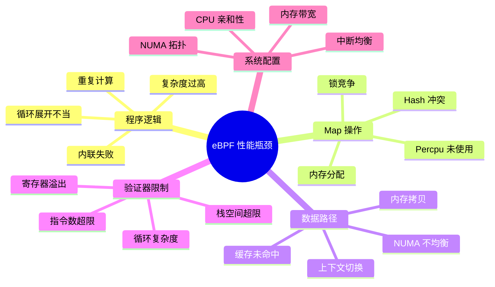

## 1.2 性能分析工具链

## 1.2.1 BPF 内置性能分析

```c
// 使用 BPF_PERF_EVENT_ARRAY 进行性能采样
#include <linux/bpf.h>
#include <bpf/bpf_helpers.h>
#include <linux/perf_event.h>

struct {
    __uint(type, BPF_MAP_TYPE_PERF_EVENT_ARRAY);
    __uint(key_size, sizeof(int));
    __uint(value_size, sizeof(int));
    __uint(max_entries, 256);
} perf_map SEC(".maps");

// 性能统计结构
struct perf_stats {
    __u64 count;
    __u64 total_ns;
    __u64 max_ns;
    __u64 min_ns;
};

struct {
    __uint(type, BPF_MAP_TYPE_PERCPU_ARRAY);
    __uint(key_size, sizeof(__u32));
    __uint(value_size, sizeof(struct perf_stats));
    __uint(max_entries, 1);
} stats_map SEC(".maps");

// 性能测量宏
#define BPF_PERF_START(ts) \
    __u64 ts = bpf_ktime_get_ns()

#define BPF_PERF_END(ts, stats_key) do { \
    __u64 elapsed = bpf_ktime_get_ns() - ts; \
    __u32 key = stats_key; \
    struct perf_stats *s = bpf_map_lookup_elem(&stats_map, &key); \
    if (s) { \
        s->count++; \
        s->total_ns += elapsed; \
        if (elapsed > s->max_ns) s->max_ns = elapsed; \
        if (s->min_ns == 0 || elapsed < s->min_ns) s->min_ns = elapsed; \
    } \
} while(0)

SEC("xdp")
int xdp_perf_monitor(struct xdp_md *ctx)
{
    BPF_PERF_START(start_ts);
    
    // 程序主要逻辑...
    void *data = (void *)(long)ctx->data;
    void *data_end = (void *)(long)ctx->data_end;
    
    // 处理数据包
    // ...
    
    BPF_PERF_END(start_ts, 0);
    
    return XDP_PASS;
}

char LICENSE[] SEC("license") = "GPL";
```

## 1.2.2 perf 与 eBPF 协同分析

```bash
#!/bin/bash
# eBPF 程序性能分析脚本

# 使用 perf 分析 eBPF 程序 CPU 占用
perf stat -e cycles,instructions,cache-misses,cache-references \
    -p $(pgrep -f "your_ebpf_loader") \
    sleep 10

# 使用 bpftool 查看程序统计
bpftool prog show
bpftool prog dump xlated id <prog_id>

# 查看 JIT 代码
bpftool prog dump jited id <prog_id>

# 获取 Map 统计
bpftool map show
bpftool map dump id <map_id>

# 使用 flamegraph 生成 eBPF 火焰图
perf record -F 99 -a -g -- sleep 30
perf script | stackcollapse-perf.pl > out.perf-folded
flamegraph.pl out.perf-folded > perf.svg
```

## 1.3 性能基准测试框架

```c
// ebpf_benchmark.c - eBPF 基准测试框架
#include <stdio.h>
#include <stdlib.h>
#include <time.h>
#include <bpf/libbpf.h>
#include <bpf/bpf.h>

#define BENCH_ITERATIONS 1000000
#define WARM_UP_ITERS    10000

typedef struct {
    const char *name;
    uint64_t total_ns;
    uint64_t min_ns;
    uint64_t max_ns;
    uint64_t iterations;
} bench_result_t;

static inline uint64_t get_time_ns(void)
{
    struct timespec ts;
    clock_gettime(CLOCK_MONOTONIC, &ts);
    return (uint64_t)ts.tv_sec * 1000000000ULL + ts.tv_nsec;
}

bench_result_t run_benchmark(const char *name, 
                             int (*bench_fn)(int map_fd),
                             int map_fd)
{
    bench_result_t result = {
        .name = name,
        .min_ns = UINT64_MAX,
        .max_ns = 0,
        .iterations = BENCH_ITERATIONS,
    };

    // 预热阶段
    for (int i = 0; i < WARM_UP_ITERS; i++) {
        bench_fn(map_fd);
    }

    // 正式基准测试
    for (int i = 0; i < BENCH_ITERATIONS; i++) {
        uint64_t start = get_time_ns();
        bench_fn(map_fd);
        uint64_t elapsed = get_time_ns() - start;

        result.total_ns += elapsed;
        if (elapsed < result.min_ns) result.min_ns = elapsed;
        if (elapsed > result.max_ns) result.max_ns = elapsed;
    }

    return result;
}

void print_bench_result(const bench_result_t *r)
{
    printf("%-40s | avg: %6lu ns | min: %6lu ns | max: %6lu ns | "
           "throughput: %.2f M ops/s\n",
           r->name,
           r->total_ns / r->iterations,
           r->min_ns,
           r->max_ns,
           (double)r->iterations / (r->total_ns / 1000.0));
}
```

---

<!-- chunk: 2. XDP 性能优化 -->## 2. XDP 性能优化

## 2.1 XDP 工作模式深度对比

XDP（eXpress Data Path）是 eBPF 在网络性能优化中最重要的技术，提供三种工作模式，各有适用场景。

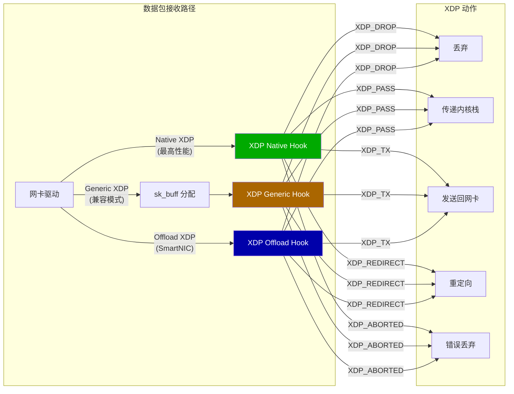

## 2.1.1 Native XDP 性能优化

```c
// xdp_native_optimized.c
// Native XDP 优化程序示例
#include <linux/bpf.h>
#include <linux/if_ether.h>
#include <linux/ip.h>
#include <linux/ipv6.h>
#include <linux/tcp.h>
#include <linux/udp.h>
#include <bpf/bpf_helpers.h>
#include <bpf/bpf_endian.h>

// 编译器优化提示
#define likely(x)   __builtin_expect(!!(x), 1)
#define unlikely(x) __builtin_expect(!!(x), 0)

// 使用 __always_inline 确保关键路径内联
#define FORCE_INLINE __attribute__((always_inline))

// IP 黑名单 Map（使用 LPM TRIE 高效最长前缀匹配）
struct {
    __uint(type, BPF_MAP_TYPE_LPM_TRIE);
    __type(key, struct bpf_lpm_trie_key);
    __uint(value_size, sizeof(__u8));
    __uint(max_entries, 65536);
    __uint(map_flags, BPF_F_NO_PREALLOC);
} blocklist SEC(".maps");

// Per-CPU 统计（避免锁竞争）
struct xdp_stats {
    __u64 rx_packets;
    __u64 rx_bytes;
    __u64 dropped_packets;
    __u64 passed_packets;
};

struct {
    __uint(type, BPF_MAP_TYPE_PERCPU_ARRAY);
    __type(key, __u32);
    __type(value, struct xdp_stats);
    __uint(max_entries, 1);
} stats SEC(".maps");

// 以太网头部解析（强制内联）
static FORCE_INLINE
int parse_ethhdr(void *data, void *data_end, 
                 struct ethhdr **eth, __u16 *proto)
{
    struct ethhdr *ethh = data;
    
    // 边界检查（验证器要求）
    if (ethh + 1 > (struct ethhdr *)data_end)
        return -1;
    
    *eth = ethh;
    *proto = bpf_ntohs(ethh->h_proto);
    
    return sizeof(struct ethhdr);
}

// IPv4 头部解析（强制内联）
static FORCE_INLINE
int parse_iphdr(void *data, void *data_end, 
                int offset, struct iphdr **ip)
{
    struct iphdr *iph = data + offset;
    
    if (iph + 1 > (struct iphdr *)data_end)
        return -1;
    
    // 验证 IP 头部长度
    int hdr_len = iph->ihl * 4;
    if (hdr_len < sizeof(struct iphdr))
        return -1;
    
    if ((void *)iph + hdr_len > data_end)
        return -1;
    
    *ip = iph;
    return offset + hdr_len;
}

// 更新统计（Per-CPU 无锁）
static FORCE_INLINE
void update_stats(int action, __u32 pkt_len)
{
    __u32 key = 0;
    struct xdp_stats *s = bpf_map_lookup_elem(&stats, &key);
    if (!s) return;
    
    s->rx_packets++;
    s->rx_bytes += pkt_len;
    
    if (action == XDP_DROP)
        s->dropped_packets++;
    else
        s->passed_packets++;
}

SEC("xdp")
int xdp_optimized_filter(struct xdp_md *ctx)
{
    void *data = (void *)(long)ctx->data;
    void *data_end = (void *)(long)ctx->data_end;
    __u32 pkt_len = ctx->data_end - ctx->data;
    
    struct ethhdr *eth;
    __u16 proto;
    int offset;
    
    // 解析以太网头
    offset = parse_ethhdr(data, data_end, &eth, &proto);
    if (unlikely(offset < 0)) {
        update_stats(XDP_DROP, pkt_len);
        return XDP_DROP;
    }
    
    // 快速路径：非 IP 包直接放行
    if (likely(proto != ETH_P_IP && proto != ETH_P_IPV6)) {
        update_stats(XDP_PASS, pkt_len);
        return XDP_PASS;
    }
    
    if (proto == ETH_P_IP) {
        struct iphdr *ip;
        offset = parse_iphdr(data, data_end, offset, &ip);
        if (unlikely(offset < 0)) {
            update_stats(XDP_DROP, pkt_len);
            return XDP_DROP;
        }
        
        // LPM 前缀匹配检查黑名单
        struct {
            __u32 prefixlen;
            __u32 addr;
        } lpm_key = {
            .prefixlen = 32,
            .addr = ip->saddr,
        };
        
        if (bpf_map_lookup_elem(&blocklist, &lpm_key)) {
            update_stats(XDP_DROP, pkt_len);
            return XDP_DROP;
        }
    }
    
    update_stats(XDP_PASS, pkt_len);
    return XDP_PASS;
}

char LICENSE[] SEC("license") = "GPL";
```

## 2.2 AF_XDP 零拷贝优化

AF_XDP（Address Family XDP）提供了内核到用户空间的零拷贝数据传输能力，是高性能用户态网络处理的关键技术。

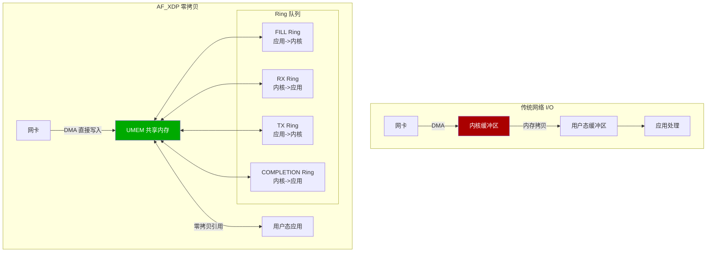

## 2.2.1 AF_XDP UMEM 配置

```c
// af_xdp_zero_copy.c - AF_XDP 零拷贝实现
#include <linux/if_xdp.h>
#include <sys/mman.h>
#include <sys/socket.h>
#include <linux/if_link.h>
#include <bpf/xsk.h>

#define NUM_FRAMES      4096
#define FRAME_SIZE      XSK_UMEM__DEFAULT_FRAME_SIZE  // 4096 bytes
#define UMEM_SIZE       (NUM_FRAMES * FRAME_SIZE)

// UMEM 结构
struct umem_info {
    void            *buffer;        // UMEM 内存区域
    struct xsk_umem *umem;          // libbpf UMEM 句柄
    struct xsk_ring_prod fq;        // FILL Ring
    struct xsk_ring_cons cq;        // COMPLETION Ring
};

// XSK Socket 结构
struct xsk_socket_info {
    struct xsk_ring_cons rx;        // RX Ring
    struct xsk_ring_prod tx;        // TX Ring
    struct xsk_socket   *xsk;       // libbpf XSK 句柄
    struct umem_info    *umem;
    
    uint32_t outstanding_tx;        // 待完成的 TX 包
};

// 初始化 UMEM
static int init_umem(struct umem_info *umem_info)
{
    // 分配 UMEM 内存（使用大页提升性能）
    umem_info->buffer = mmap(NULL, UMEM_SIZE,
                             PROT_READ | PROT_WRITE,
                             MAP_PRIVATE | MAP_ANONYMOUS | MAP_HUGETLB,
                             -1, 0);
    
    if (umem_info->buffer == MAP_FAILED) {
        // 大页分配失败，回退到普通内存
        umem_info->buffer = mmap(NULL, UMEM_SIZE,
                                 PROT_READ | PROT_WRITE,
                                 MAP_PRIVATE | MAP_ANONYMOUS,
                                 -1, 0);
    }
    
    if (umem_info->buffer == MAP_FAILED) {
        perror("mmap UMEM");
        return -1;
    }

    // 配置 UMEM
    struct xsk_umem_config umem_cfg = {
        .fill_size      = XSK_RING_PROD__DEFAULT_NUM_DESCS,
        .comp_size      = XSK_RING_CONS__DEFAULT_NUM_DESCS,
        .frame_size     = FRAME_SIZE,
        .frame_headroom = XSK_UMEM__DEFAULT_FRAME_HEADROOM,
        .flags          = 0,
    };

    int ret = xsk_umem__create(&umem_info->umem,
                               umem_info->buffer, UMEM_SIZE,
                               &umem_info->fq, &umem_info->cq,
                               &umem_cfg);
    if (ret) {
        fprintf(stderr, "xsk_umem__create failed: %s\n", strerror(-ret));
        return -1;
    }

    // 预填充 FILL Ring
    uint32_t idx;
    int stock = xsk_ring_prod__reserve(&umem_info->fq, 
                                        NUM_FRAMES / 2, &idx);
    
    for (int i = 0; i < stock; i++) {
        *xsk_ring_prod__fill_addr(&umem_info->fq, idx++) = 
            (uint64_t)(i * FRAME_SIZE);
    }
    
    xsk_ring_prod__submit(&umem_info->fq, stock);
    
    return 0;
}

// 高性能 RX 处理循环
static int rx_process_batch(struct xsk_socket_info *xsk, 
                            int batch_size)
{
    uint32_t idx_rx = 0, idx_fq = 0;
    int rcvd, stock_frames;
    
    // 批量接收数据包
    rcvd = xsk_ring_cons__peek(&xsk->rx, batch_size, &idx_rx);
    if (!rcvd)
        return 0;
    
    // 补充 FILL Ring
    stock_frames = xsk_prod_nb_free(&xsk->umem->fq, 
                                     xsk_cons_nb_avail(&xsk->rx, batch_size));
    
    if (stock_frames > 0) {
        int ret = xsk_ring_prod__reserve(&xsk->umem->fq, 
                                          stock_frames, &idx_fq);
        
        for (int i = 0; i < ret; i++) {
            // 回收已处理帧到 FILL Ring
            uint64_t addr = xsk_ring_cons__rx_desc(&xsk->rx, 
                                idx_rx + i)->addr;
            *xsk_ring_prod__fill_addr(&xsk->umem->fq, idx_fq++) = 
                xsk_umem__extract_addr(addr);
        }
        
        xsk_ring_prod__submit(&xsk->umem->fq, ret);
    }
    
    // 处理接收到的数据包
    for (int i = 0; i < rcvd; i++) {
        const struct xdp_desc *desc = 
            xsk_ring_cons__rx_desc(&xsk->rx, idx_rx++);
        
        uint64_t addr = xsk_umem__add_offset_to_addr(desc->addr);
        uint8_t *pkt = xsk_umem__get_data(xsk->umem->buffer, addr);
        uint32_t len = desc->len;
        
        // 零拷贝处理数据包
        process_packet(pkt, len);
    }
    
    xsk_ring_cons__release(&xsk->rx, rcvd);
    
    return rcvd;
}
```

## 2.3 XDP 批处理优化

```c
// xdp_batch_processing.c - XDP 批处理优化
#include <linux/bpf.h>
#include <bpf/bpf_helpers.h>
#include <linux/if_ether.h>
#include <linux/ip.h>

// CPU Map 用于批量重定向（减少跨 CPU 传递开销）
struct {
    __uint(type, BPF_MAP_TYPE_CPUMAP);
    __type(key, __u32);
    __uint(value_size, sizeof(struct bpf_cpumap_val));
    __uint(max_entries, 64);  // 最大 CPU 数量
} cpu_map SEC(".maps");

// DEVMAP 用于批量网卡重定向
struct {
    __uint(type, BPF_MAP_TYPE_DEVMAP_HASH);
    __type(key, __u32);
    __uint(value_size, sizeof(struct bpf_devmap_val));
    __uint(max_entries, 256);
} dev_map SEC(".maps");

// XDP 批量重定向到 CPU Map（实现 RSS 替代）
SEC("xdp")
int xdp_cpu_redirect(struct xdp_md *ctx)
{
    void *data = (void *)(long)ctx->data;
    void *data_end = (void *)(long)ctx->data_end;
    
    struct ethhdr *eth = data;
    if (eth + 1 > (struct ethhdr *)data_end)
        return XDP_ABORTED;
    
    // 基于 IP 五元组哈希计算目标 CPU
    __u32 cpu = 0;
    
    if (bpf_ntohs(eth->h_proto) == ETH_P_IP) {
        struct iphdr *ip = data + sizeof(struct ethhdr);
        if (ip + 1 > (struct iphdr *)data_end)
            return XDP_ABORTED;
        
        // 简单哈希：源IP XOR 目标IP
        __u32 hash = ip->saddr ^ ip->daddr;
        hash ^= hash >> 16;
        hash ^= hash >> 8;
        
        // 获取可用 CPU 数量
        __u32 num_cpus = bpf_num_possible_cpus();
        cpu = hash % num_cpus;
    }
    
    // 重定向到目标 CPU（批量处理由 CPUMAP 内部完成）
    return bpf_redirect_map(&cpu_map, cpu, 0);
}

// XDP 批量转发到网卡
SEC("xdp")
int xdp_dev_redirect(struct xdp_md *ctx)
{
    void *data = (void *)(long)ctx->data;
    void *data_end = (void *)(long)ctx->data_end;
    
    struct ethhdr *eth = data;
    if (eth + 1 > (struct ethhdr *)data_end)
        return XDP_ABORTED;
    
    // 查找目标网卡接口索引
    __u32 ifindex = 0;
    
    // ... 路由查找逻辑 ...
    
    // 批量重定向（DEVMAP 支持批量发送）
    return bpf_redirect_map(&dev_map, ifindex, BPF_F_BROADCAST);
}

char LICENSE[] SEC("license") = "GPL";
```

---

<!-- chunk: 3. TC 性能优化 -->## 3. TC 性能优化

## 3.1 TC Direct Action 模式

TC（Traffic Control）子系统中的 eBPF 程序支持 Direct Action 模式，允许 BPF 程序直接返回 TC 动作，避免了多个 classifer/action 之间的传递开销。

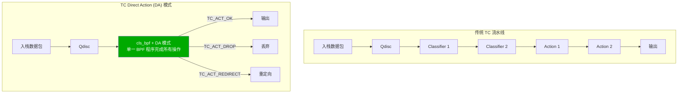

## 3.1.1 TC Direct Action 实现

```c
// tc_direct_action.c - TC Direct Action 优化
#include <linux/bpf.h>
#include <linux/pkt_cls.h>
#include <linux/if_ether.h>
#include <linux/ip.h>
#include <linux/tcp.h>
#include <bpf/bpf_helpers.h>
#include <bpf/bpf_endian.h>

// TC 返回码（Direct Action 模式）
#define TC_ACT_OK           0   // 继续处理
#define TC_ACT_RECLASSIFY   1   // 重新分类
#define TC_ACT_SHOT         2   // 丢弃
#define TC_ACT_PIPE         3   // 管道
#define TC_ACT_STOLEN       4   // 接管
#define TC_ACT_QUEUED       5   // 入队
#define TC_ACT_REPEAT       6   // 重复
#define TC_ACT_REDIRECT     7   // 重定向

// 连接跟踪 Map
struct conn_key {
    __u32 src_ip;
    __u32 dst_ip;
    __u16 src_port;
    __u16 dst_port;
    __u8  proto;
    __u8  pad[3];
};

struct conn_val {
    __u64 packets;
    __u64 bytes;
    __u64 last_seen;
    __u8  state;    // TCP 状态
};

struct {
    __uint(type, BPF_MAP_TYPE_LRU_HASH);
    __type(key, struct conn_key);
    __type(value, struct conn_val);
    __uint(max_entries, 1000000);   // 100 万并发连接
} conn_table SEC(".maps");

// 快速解析数据包头部
static __always_inline
int parse_pkt_headers(struct __sk_buff *skb,
                      struct ethhdr **eth,
                      struct iphdr **ip,
                      struct tcphdr **tcp)
{
    void *data = (void *)(long)skb->data;
    void *data_end = (void *)(long)skb->data_end;
    int offset = 0;
    
    // 以太网头
    *eth = data + offset;
    if (*eth + 1 > (struct ethhdr *)data_end)
        return -1;
    offset += sizeof(struct ethhdr);
    
    // IP 头
    if (bpf_ntohs((*eth)->h_proto) != ETH_P_IP)
        return -2;  // 非 IPv4
    
    *ip = data + offset;
    if (*ip + 1 > (struct iphdr *)data_end)
        return -1;
    
    int ip_hdr_len = (*ip)->ihl * 4;
    if (ip_hdr_len < sizeof(struct iphdr))
        return -1;
    offset += ip_hdr_len;
    
    // TCP 头（仅 TCP 包）
    if ((*ip)->protocol != IPPROTO_TCP)
        return 0;   // 非 TCP，但解析成功
    
    *tcp = data + offset;
    if (*tcp + 1 > (struct tcphdr *)data_end)
        return -1;
    
    return 0;
}

// TC 入站过滤（Direct Action 模式）
SEC("tc")
int tc_ingress_filter(struct __sk_buff *skb)
{
    struct ethhdr *eth = NULL;
    struct iphdr  *ip  = NULL;
    struct tcphdr *tcp = NULL;
    
    int ret = parse_pkt_headers(skb, &eth, &ip, &tcp);
    if (ret < 0)
        return TC_ACT_SHOT;     // 格式错误包，直接丢弃
    
    if (!ip)
        return TC_ACT_OK;       // 非 IP 包，直接放行
    
    // 构建连接跟踪 Key
    struct conn_key key = {};
    key.src_ip = ip->saddr;
    key.dst_ip = ip->daddr;
    key.proto  = ip->protocol;
    
    if (tcp) {
        key.src_port = bpf_ntohs(tcp->source);
        key.dst_port = bpf_ntohs(tcp->dest);
    }
    
    // 查找或创建连接跟踪条目
    struct conn_val *conn = bpf_map_lookup_elem(&conn_table, &key);
    if (conn) {
        // 更新现有连接（Per-CPU LRU，无锁竞争）
        __sync_fetch_and_add(&conn->packets, 1);
        __sync_fetch_and_add(&conn->bytes, skb->len);
        conn->last_seen = bpf_ktime_get_ns();
    } else {
        // 新建连接
        struct conn_val new_conn = {
            .packets   = 1,
            .bytes     = skb->len,
            .last_seen = bpf_ktime_get_ns(),
            .state     = tcp ? 1 : 0,
        };
        bpf_map_update_elem(&conn_table, &key, &new_conn, BPF_NOEXIST);
    }
    
    return TC_ACT_OK;
}

// TC 出站 QoS 整形（Direct Action）
SEC("tc")
int tc_egress_qos(struct __sk_buff *skb)
{
    // 标记数据包优先级（用于 QoS 整形）
    // DSCP 标记：优先流量标记为 CS4 (100)
    
    struct iphdr *ip = (void *)(long)skb->data + sizeof(struct ethhdr);
    void *data_end   = (void *)(long)skb->data_end;
    
    if (ip + 1 > (struct iphdr *)data_end)
        return TC_ACT_OK;
    
    // 根据目标端口设置 DSCP
    if (ip->protocol == IPPROTO_TCP) {
        struct tcphdr *tcp = (void *)ip + ip->ihl * 4;
        if (tcp + 1 > (struct tcphdr *)data_end)
            return TC_ACT_OK;
        
        __u16 dport = bpf_ntohs(tcp->dest);
        
        // 高优先级端口（如 SSH, DNS）
        if (dport == 22 || dport == 53) {
            // 设置 DSCP CS4 (Expedited Forwarding)
            bpf_skb_store_bytes(skb, sizeof(struct ethhdr) + 1,
                               &(__u8){0xa0}, 1, BPF_F_RECOMPUTE_CSUM);
        }
    }
    
    return TC_ACT_OK;
}

char LICENSE[] SEC("license") = "GPL";
```

## 3.2 TC 硬件卸载优化

```bash
#!/bin/bash
# TC 硬件卸载配置脚本

INTERFACE="eth0"

# 检查网卡是否支持 TC 卸载
ethtool -k $INTERFACE | grep -E "hw-tc-offload|xdp-offload"

# 启用 TC 硬件卸载
ethtool -K $INTERFACE hw-tc-offload on

# 加载支持 TC 卸载的 BPF 程序
tc qdisc add dev $INTERFACE clsact

# 添加 TC 入站过滤（支持硬件卸载）
tc filter add dev $INTERFACE ingress \
    bpf object-file tc_direct_action.o \
    section tc \
    direct-action \
    offload   # 启用硬件卸载

# 验证是否成功卸载到硬件
tc filter show dev $INTERFACE ingress

# 查看 TC 统计信息
tc -s filter show dev $INTERFACE ingress
```

---

<!-- chunk: 4. Map 性能优化 -->## 4. Map 性能优化

## 4.1 Map 类型选择策略

Map 是 eBPF 程序的核心数据结构，选择合适的 Map 类型对性能至关重要。

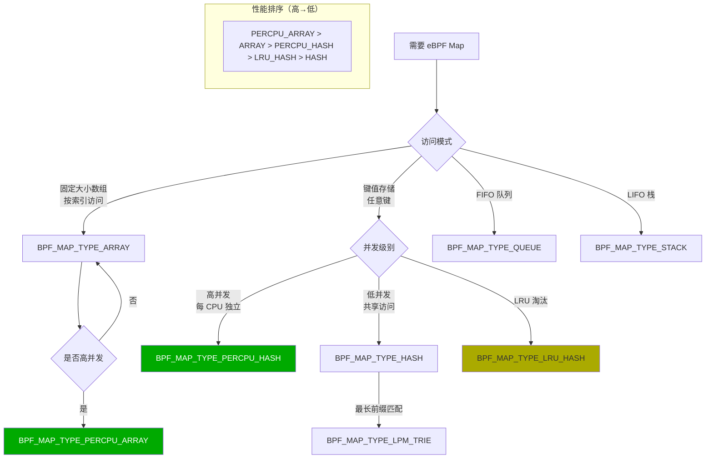

## 4.1.1 Per-CPU Map 性能优化

```c
// percpu_map_optimization.c - Per-CPU Map 优化
#include <linux/bpf.h>
#include <bpf/bpf_helpers.h>

// 对比：普通 Hash Map（有锁竞争）
struct {
    __uint(type, BPF_MAP_TYPE_HASH);
    __type(key, __u32);
    __type(value, __u64);
    __uint(max_entries, 65536);
} normal_hash SEC(".maps");

// 优化：Per-CPU Hash Map（无锁，CPU 本地）
struct {
    __uint(type, BPF_MAP_TYPE_PERCPU_HASH);
    __type(key, __u32);
    __type(value, __u64);
    __uint(max_entries, 65536);
} percpu_hash SEC(".maps");

// 优化：Per-CPU Array（最高性能）
struct {
    __uint(type, BPF_MAP_TYPE_PERCPU_ARRAY);
    __type(key, __u32);
    __type(value, __u64);
    __uint(max_entries, 256);   // 小尺寸，适合频繁访问
} percpu_array SEC(".maps");

// 统计计数器：使用 Per-CPU Array 避免锁
struct pkt_counter {
    __u64 rx_pkts;
    __u64 rx_bytes;
    __u64 tx_pkts;
    __u64 tx_bytes;
    __u64 drops;
    __u64 errors;
    // 对齐到缓存行（64字节）防止 false sharing
    __u64 pad[2];
};

struct {
    __uint(type, BPF_MAP_TYPE_PERCPU_ARRAY);
    __type(key, __u32);
    __type(value, struct pkt_counter);
    __uint(max_entries, 1);
} pkt_stats SEC(".maps");

SEC("xdp")
int xdp_percpu_demo(struct xdp_md *ctx)
{
    __u32 key = 0;
    struct pkt_counter *counter = bpf_map_lookup_elem(&pkt_stats, &key);
    if (!counter)
        return XDP_PASS;
    
    // Per-CPU Map：无需原子操作，直接更新本 CPU 的副本
    counter->rx_pkts++;
    counter->rx_bytes += (ctx->data_end - ctx->data);
    
    return XDP_PASS;
}

// 用户态聚合 Per-CPU 统计
// (userspace code)
/*
void aggregate_percpu_stats(int map_fd) {
    __u32 key = 0;
    int num_cpus = libbpf_num_possible_cpus();
    struct pkt_counter values[num_cpus];
    
    bpf_map_lookup_elem(map_fd, &key, values);
    
    struct pkt_counter total = {};
    for (int i = 0; i < num_cpus; i++) {
        total.rx_pkts  += values[i].rx_pkts;
        total.rx_bytes += values[i].rx_bytes;
        total.drops    += values[i].drops;
    }
    
    printf("RX: %llu pkts, %llu bytes, %llu drops\n",
           total.rx_pkts, total.rx_bytes, total.drops);
}
*/

char LICENSE[] SEC("license") = "GPL";
```

## 4.2 Map Batch 操作

Kernel 5.6+ 引入了 Map Batch 操作，允许一次系统调用完成多个 Map 条目的读写，显著降低系统调用开销。

```c
// map_batch_operations.c - Map 批量操作示例
#include <bpf/libbpf.h>
#include <bpf/bpf.h>
#include <stdio.h>
#include <stdlib.h>

#define BATCH_SIZE 1024

// 批量查找 Map 条目
int batch_lookup_map(int map_fd, int total_entries)
{
    __u32 keys[BATCH_SIZE];
    __u64 values[BATCH_SIZE];
    __u32 count = BATCH_SIZE;
    __u32 batch_out = 0;
    void *in_batch = NULL;
    int ret;
    int total_read = 0;
    
    while (1) {
        ret = bpf_map_lookup_batch(map_fd,
                                   in_batch,    // 上一批次结束位置
                                   &batch_out,  // 当前批次开始（输出）
                                   keys,
                                   values,
                                   &count,
                                   NULL);
        
        if (ret && ret != -ENOENT) {
            fprintf(stderr, "bpf_map_lookup_batch: %s\n", 
                    strerror(-ret));
            return -1;
        }
        
        total_read += count;
        
        // 处理这批数据
        for (int i = 0; i < count; i++) {
            // 处理 keys[i] 和 values[i]
            process_entry(keys[i], values[i]);
        }
        
        if (ret == -ENOENT)
            break;  // 已遍历所有条目
        
        in_batch = &batch_out;
        count = BATCH_SIZE;
    }
    
    printf("Total entries read: %d\n", total_read);
    return total_read;
}

// 批量更新 Map 条目
int batch_update_map(int map_fd, __u32 *keys, __u64 *values, int count)
{
    __u32 batch_count = count;
    
    int ret = bpf_map_update_batch(map_fd,
                                    keys, values,
                                    &batch_count,
                                    NULL);
    if (ret) {
        fprintf(stderr, "bpf_map_update_batch failed: %s "
                "(updated %u/%d entries)\n",
                strerror(-ret), batch_count, count);
        return -1;
    }
    
    printf("Updated %u entries in single syscall\n", batch_count);
    return batch_count;
}

// 批量删除 Map 条目
int batch_delete_expired(int map_fd, uint64_t timeout_ns)
{
    __u32 keys[BATCH_SIZE];
    struct conn_val values[BATCH_SIZE];
    __u32 count = BATCH_SIZE;
    __u32 batch_out = 0;
    void *in_batch = NULL;
    
    __u32 del_keys[BATCH_SIZE];
    int del_count = 0;
    uint64_t now = get_time_ns();
    int ret;
    
    // 先查找过期条目
    while (1) {
        ret = bpf_map_lookup_batch(map_fd, in_batch, &batch_out,
                                    keys, values, &count, NULL);
        
        for (int i = 0; i < count; i++) {
            if (now - values[i].last_seen > timeout_ns) {
                del_keys[del_count++] = keys[i];
            }
        }
        
        if (ret == -ENOENT) break;
        in_batch = &batch_out;
        count = BATCH_SIZE;
    }
    
    // 批量删除过期条目
    if (del_count > 0) {
        __u32 deleted = del_count;
        bpf_map_delete_batch(map_fd, del_keys, &deleted, NULL);
        printf("Deleted %u expired entries\n", deleted);
    }
    
    return del_count;
}
```

## 4.3 Map 预分配与内存优化

```c
// map_prealloc_config.c - Map 预分配配置

// 方法1：预分配所有条目（减少运行时内存分配开销）
struct {
    __uint(type, BPF_MAP_TYPE_HASH);
    __type(key, __u32);
    __type(value, __u64);
    __uint(max_entries, 65536);
    // 不设置 BPF_F_NO_PREALLOC，默认预分配所有条目
} preallocated_map SEC(".maps");

// 方法2：按需分配（节省内存，适合稀疏访问）
struct {
    __uint(type, BPF_MAP_TYPE_HASH);
    __type(key, __u32);
    __type(value, __u64);
    __uint(max_entries, 1000000);  // 100万条目，但按需分配
    __uint(map_flags, BPF_F_NO_PREALLOC);
} on_demand_map SEC(".maps");

// 方法3：NUMA 感知内存分配
// (通过 bpf_map_create 的 NUMA node 参数)
/*
struct bpf_map_create_opts opts = {
    .sz         = sizeof(opts),
    .numa_node  = 0,    // NUMA node 0
    .map_flags  = BPF_F_NUMA_NODE,
};
*/
```

---

<!-- chunk: 5. 验证器优化 -->## 5. 验证器优化

## 5.1 验证器工作原理

eBPF 验证器（Verifier）是 eBPF 安全的核心，但也是程序复杂度的限制因素。了解验证器的工作原理有助于编写更高效、合规的程序。

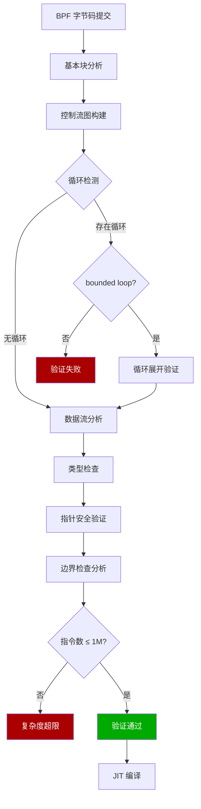

## 5.2 循环优化技术

```c
// verifier_loop_optimization.c - 循环优化技术

// 方法1：使用 #pragma unroll 展开循环（适合固定次数的小循环）
SEC("xdp")
int xdp_loop_unroll(struct xdp_md *ctx)
{
    __u8 result = 0;
    __u8 data[16] = {};  // 假设已正确获取
    
    // 手动展开循环（避免验证器复杂度问题）
    #pragma unroll
    for (int i = 0; i < 16; i++) {
        result ^= data[i];
    }
    
    return XDP_PASS;
}

// 方法2：有界循环（Kernel 5.3+）
SEC("xdp")
int xdp_bounded_loop(struct xdp_md *ctx)
{
    void *data = (void *)(long)ctx->data;
    void *data_end = (void *)(long)ctx->data_end;
    
    // 有界循环：验证器可以推断循环次数上界
    // 条件：循环变量必须向单一方向变化且有明确界限
    for (int i = 0; i < 64; i++) {  // 明确上界
        if (data + i + 1 > data_end)
            break;
        
        __u8 *byte = data + i;
        // 处理每个字节
        (void)byte;
    }
    
    return XDP_PASS;
}

// 方法3：bpf_loop 辅助函数（Kernel 5.17+，最灵活）
struct loop_ctx {
    void *data;
    void *data_end;
    __u32 found;
    __u32 search_value;
};

static int search_callback(__u32 index, void *ctx_ptr)
{
    struct loop_ctx *ctx = ctx_ptr;
    
    if (ctx->data + index + 1 > ctx->data_end)
        return 1;  // 停止循环
    
    __u8 *byte = ctx->data + index;
    if (*byte == ctx->search_value) {
        ctx->found = 1;
        return 1;  // 找到，停止循环
    }
    
    return 0;  // 继续循环
}

SEC("xdp")
int xdp_bpf_loop(struct xdp_md *ctx)
{
    struct loop_ctx lctx = {
        .data  = (void *)(long)ctx->data,
        .data_end = (void *)(long)ctx->data_end,
        .found = 0,
        .search_value = 0x45,  // 搜索 IPv4 版本字段
    };
    
    __u32 max_iter = ctx->data_end - ctx->data;
    if (max_iter > 1500) max_iter = 1500;  // 限制最大迭代次数
    
    // bpf_loop：验证器友好的可变次数循环
    bpf_loop(max_iter, search_callback, &lctx, 0);
    
    if (lctx.found)
        return XDP_PASS;
    
    return XDP_DROP;
}

char LICENSE[] SEC("license") = "GPL";
```

## 5.3 内联函数与代码复用

```c
// inline_optimization.c - 内联函数优化

// 强制内联：确保关键路径无函数调用开销
static __always_inline
__u32 compute_hash(__u32 src_ip, __u32 dst_ip, 
                   __u16 src_port, __u16 dst_port)
{
    // Fowler-Noll-Vo (FNV) 哈希
    __u32 hash = 2166136261UL;
    
    hash ^= src_ip;
    hash *= 16777619;
    hash ^= dst_ip;
    hash *= 16777619;
    hash ^= ((__u32)src_port << 16) | dst_port;
    hash *= 16777619;
    
    return hash;
}

// 避免不必要的内联：大型函数分离为 Tail Call
// 这样可以绕过单个 BPF 程序的指令数限制
struct {
    __uint(type, BPF_MAP_TYPE_PROG_ARRAY);
    __uint(key_size, sizeof(__u32));
    __uint(value_size, sizeof(__u32));
    __uint(max_entries, 8);
} prog_array SEC(".maps");

#define PROG_HEAVY_PROCESSING 0
#define PROG_LOG_AND_AUDIT    1
#define PROG_RATE_LIMIT       2

SEC("xdp")
int xdp_main_entry(struct xdp_md *ctx)
{
    // 轻量级快速路径处理
    void *data = (void *)(long)ctx->data;
    void *data_end = (void *)(long)ctx->data_end;
    
    struct ethhdr *eth = data;
    if (eth + 1 > (struct ethhdr *)data_end)
        return XDP_DROP;
    
    __u16 proto = bpf_ntohs(eth->h_proto);
    
    if (proto == ETH_P_IP) {
        // 需要深度处理，使用 Tail Call 跳转
        bpf_tail_call(ctx, &prog_array, PROG_HEAVY_PROCESSING);
        // Tail Call 失败则继续
    }
    
    return XDP_PASS;
}

char LICENSE[] SEC("license") = "GPL";
```

## 5.4 栈空间优化

eBPF 程序栈空间限制为 512 字节，合理管理栈空间是避免验证器失败的关键。

```c
// stack_optimization.c - 栈空间优化

// 问题示例：大型结构体占满栈空间
// BAD: 
// struct large_struct { char data[400]; } s;  // 占用 400 字节栈空间

// 优化方法1：使用 BPF_MAP_TYPE_PERCPU_ARRAY 作为"堆"
struct large_buffer {
    char data[4096];    // 大型缓冲区放 Map 中
};

struct {
    __uint(type, BPF_MAP_TYPE_PERCPU_ARRAY);
    __type(key, __u32);
    __type(value, struct large_buffer);
    __uint(max_entries, 1);
} scratch_map SEC(".maps");

SEC("xdp")
int xdp_large_buffer(struct xdp_md *ctx)
{
    __u32 key = 0;
    struct large_buffer *buf = bpf_map_lookup_elem(&scratch_map, &key);
    if (!buf)
        return XDP_PASS;
    
    // 安全使用大缓冲区（存储在 Map 中，不占用栈）
    bpf_probe_read_kernel(buf->data, sizeof(buf->data), 
                          (void *)(long)ctx->data);
    
    return XDP_PASS;
}

// 优化方法2：使用 ringbuf 替代 perf_event（更高效）
struct event_data {
    __u64 timestamp;
    __u32 src_ip;
    __u32 dst_ip;
    __u16 src_port;
    __u16 dst_port;
    __u8  proto;
    __u8  action;
    char  comm[16];
};

struct {
    __uint(type, BPF_MAP_TYPE_RINGBUF);
    __uint(max_entries, 256 * 1024);    // 256KB 环形缓冲区
} events SEC(".maps");

SEC("xdp")
int xdp_ringbuf_output(struct xdp_md *ctx)
{
    // 从 Ring Buffer 预留空间（避免栈上分配大结构）
    struct event_data *event = bpf_ringbuf_reserve(&events, 
                                                    sizeof(*event), 0);
    if (!event)
        return XDP_PASS;
    
    event->timestamp = bpf_ktime_get_ns();
    // 填充其他字段...
    
    bpf_ringbuf_submit(event, 0);
    
    return XDP_PASS;
}

char LICENSE[] SEC("license") = "GPL";
```

---

<!-- chunk: 6. 内存管理与栈优化 -->## 6. 内存管理与栈优化

## 6.1 内存访问模式优化

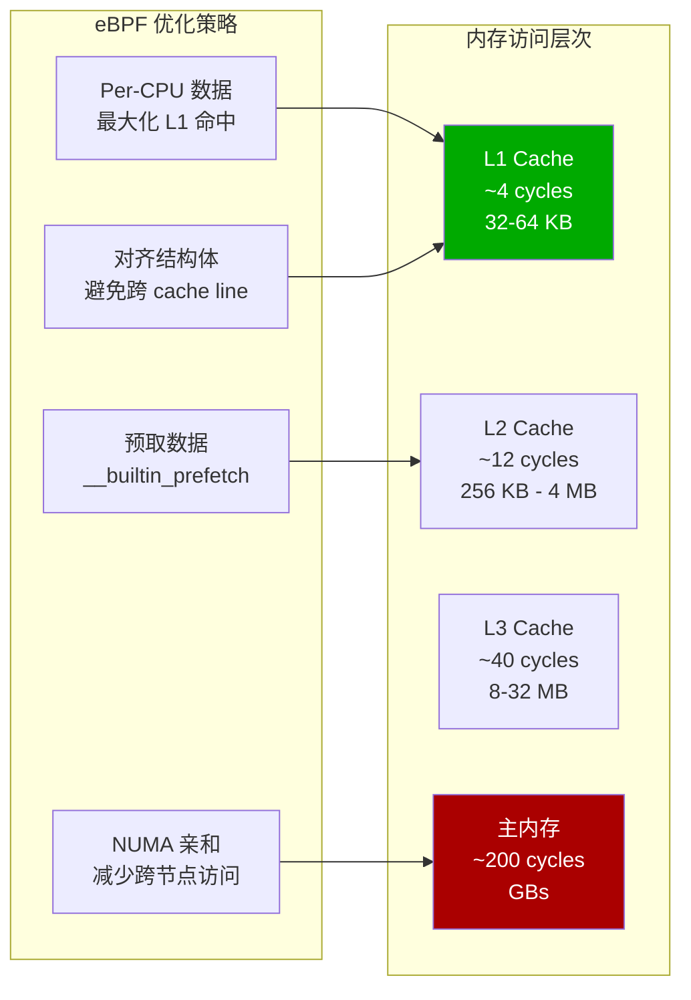

## 6.1.1 Cache 友好的数据结构设计

```c
// cache_friendly_structures.c - 缓存友好数据结构

// BAD: 结构体成员顺序导致 padding，浪费缓存行
struct bad_layout {
    __u8   flags;       // 1 byte
    __u64  timestamp;   // 8 bytes (7 bytes padding before)
    __u16  port;        // 2 bytes
    __u32  ip;          // 4 bytes (2 bytes padding before)
    __u8   proto;       // 1 byte
    // Total: 1+7+8+2+2+4+1 = 25 bytes, padded to 32
};

// GOOD: 按大小降序排列，最小化 padding
struct good_layout {
    __u64  timestamp;   // 8 bytes
    __u32  ip;          // 4 bytes
    __u16  port;        // 2 bytes
    __u8   proto;       // 1 byte
    __u8   flags;       // 1 byte
    // Total: 16 bytes, perfectly aligned
} __attribute__((packed));

// 缓存行对齐（64字节）防止 false sharing
struct __attribute__((aligned(64))) percpu_counter {
    __u64  rx_pkts;
    __u64  rx_bytes;
    __u64  tx_pkts;
    __u64  tx_bytes;
    // Pad to 64 bytes
    __u64  pad[4];
};

// BPF Map Key 优化：使用最小必要字段
struct flow_key {
    __u32 src_ip;
    __u32 dst_ip;
    __u16 src_port;
    __u16 dst_port;
    __u8  proto;
    __u8  pad[3];   // 显式 padding 确保对齐
} __attribute__((packed));

// 数据预取优化（适用于已知访问模式）
static __always_inline
void prefetch_next_packet(void *next_pkt)
{
    // 提前预取下一个数据包到 L1 cache
    __builtin_prefetch(next_pkt, 0, 3);  // 读取，高时间局部性
}
```

## 6.2 BPF Ring Buffer 高效内存管理

```c
// ringbuf_management.c - Ring Buffer 高效使用

#include <linux/bpf.h>
#include <bpf/bpf_helpers.h>

// Ring Buffer Map（比 perf_event_array 更高效）
struct {
    __uint(type, BPF_MAP_TYPE_RINGBUF);
    __uint(max_entries, 1 << 20);   // 1MB 环形缓冲区
} ringbuf SEC(".maps");

struct network_event {
    __u64  timestamp_ns;
    __u32  src_ip;
    __u32  dst_ip;
    __u16  src_port;
    __u16  dst_port;
    __u8   proto;
    __u8   direction;  // 0=ingress, 1=egress
    __u16  pkt_len;
    __u32  cpu;
    // 可变长度负载（可选）
};

// 高效写入 Ring Buffer（无拷贝）
SEC("tc")
int tc_capture_events(struct __sk_buff *skb)
{
    // 方法1：reserve + submit（两步法，允许直接修改）
    struct network_event *event;
    event = bpf_ringbuf_reserve(&ringbuf, sizeof(*event), 0);
    if (!event)
        return TC_ACT_OK;  // 缓冲区满，但不影响数据包处理
    
    // 直接填写事件（无中间拷贝）
    event->timestamp_ns = bpf_ktime_get_ns();
    event->src_ip    = skb->remote_ip4;
    event->dst_ip    = skb->local_ip4;
    event->pkt_len   = skb->len;
    event->cpu       = bpf_get_smp_processor_id();
    
    // 提交事件到用户态
    bpf_ringbuf_submit(event, 0);
    
    return TC_ACT_OK;
}

// 方法2：output（一步法，使用栈上数据）
SEC("kprobe/tcp_sendmsg")
int kprobe_tcp_sendmsg(struct pt_regs *ctx)
{
    struct network_event event = {};
    
    event.timestamp_ns = bpf_ktime_get_ns();
    event.cpu          = bpf_get_smp_processor_id();
    
    // 一次调用完成拷贝和提交
    bpf_ringbuf_output(&ringbuf, &event, sizeof(event), 0);
    
    return 0;
}

char LICENSE[] SEC("license") = "GPL";
```

---

<!-- chunk: 7. Tail Call 与程序链优化 -->## 7. Tail Call 与程序链优化

## 7.1 Tail Call 机制与性能

Tail Call 允许 eBPF 程序跳转到另一个 BPF 程序，绕过单个程序的指令数限制，实现程序链式处理。

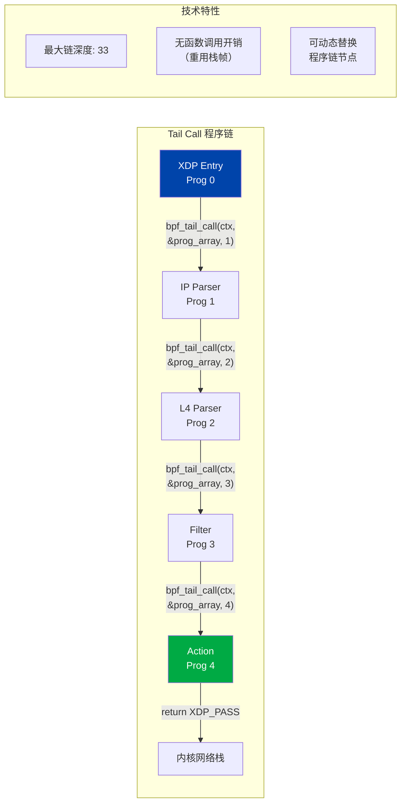

## 7.1.1 Tail Call 程序链实现

```c
// tail_call_chain.c - 程序链优化实现

#include <linux/bpf.h>
#include <linux/if_ether.h>
#include <linux/ip.h>
#include <linux/tcp.h>
#include <linux/udp.h>
#include <bpf/bpf_helpers.h>

// 程序索引定义
#define PROG_PARSE_ETH   0
#define PROG_PARSE_IP    1
#define PROG_PARSE_L4    2
#define PROG_FILTER      3
#define PROG_FORWARD     4

struct {
    __uint(type, BPF_MAP_TYPE_PROG_ARRAY);
    __uint(key_size, sizeof(__u32));
    __uint(value_size, sizeof(__u32));
    __uint(max_entries, 8);
} prog_array SEC(".maps");

// 解析状态（通过 Per-CPU Map 在程序间传递）
struct parse_state {
    __u16 eth_proto;
    __u8  ip_proto;
    __u8  ip_hdr_len;
    __u32 src_ip;
    __u32 dst_ip;
    __u16 src_port;
    __u16 dst_port;
    __u8  tcp_flags;
    __u32 offset;       // 当前解析偏移
};

struct {
    __uint(type, BPF_MAP_TYPE_PERCPU_ARRAY);
    __type(key, __u32);
    __type(value, struct parse_state);
    __uint(max_entries, 1);
} parse_state_map SEC(".maps");

// Prog 0: 入口 + 以太网解析
SEC("xdp/parse_eth")
int prog_parse_eth(struct xdp_md *ctx)
{
    __u32 key = 0;
    struct parse_state *state = bpf_map_lookup_elem(&parse_state_map, &key);
    if (!state) return XDP_ABORTED;
    
    void *data = (void *)(long)ctx->data;
    void *data_end = (void *)(long)ctx->data_end;
    
    struct ethhdr *eth = data;
    if (eth + 1 > (struct ethhdr *)data_end)
        return XDP_DROP;
    
    // 保存解析状态
    state->eth_proto = bpf_ntohs(eth->h_proto);
    state->offset    = sizeof(struct ethhdr);
    
    // 跳转到 IP 解析
    bpf_tail_call(ctx, &prog_array, PROG_PARSE_IP);
    
    return XDP_PASS;
}

// Prog 1: IP 头解析
SEC("xdp/parse_ip")
int prog_parse_ip(struct xdp_md *ctx)
{
    __u32 key = 0;
    struct parse_state *state = bpf_map_lookup_elem(&parse_state_map, &key);
    if (!state) return XDP_ABORTED;
    
    if (state->eth_proto != ETH_P_IP)
        return XDP_PASS;    // 非 IP，放行
    
    void *data = (void *)(long)ctx->data;
    void *data_end = (void *)(long)ctx->data_end;
    
    struct iphdr *ip = data + state->offset;
    if (ip + 1 > (struct iphdr *)data_end)
        return XDP_DROP;
    
    state->src_ip     = ip->saddr;
    state->dst_ip     = ip->daddr;
    state->ip_proto   = ip->protocol;
    state->ip_hdr_len = ip->ihl * 4;
    state->offset    += state->ip_hdr_len;
    
    bpf_tail_call(ctx, &prog_array, PROG_PARSE_L4);
    
    return XDP_PASS;
}

// Prog 2: L4 解析
SEC("xdp/parse_l4")
int prog_parse_l4(struct xdp_md *ctx)
{
    __u32 key = 0;
    struct parse_state *state = bpf_map_lookup_elem(&parse_state_map, &key);
    if (!state) return XDP_ABORTED;
    
    void *data = (void *)(long)ctx->data;
    void *data_end = (void *)(long)ctx->data_end;
    
    if (state->ip_proto == IPPROTO_TCP) {
        struct tcphdr *tcp = data + state->offset;
        if (tcp + 1 > (struct tcphdr *)data_end)
            return XDP_DROP;
        
        state->src_port  = bpf_ntohs(tcp->source);
        state->dst_port  = bpf_ntohs(tcp->dest);
        state->tcp_flags = (tcp->fin | (tcp->syn << 1) | 
                           (tcp->rst << 2) | (tcp->psh << 3) |
                           (tcp->ack << 4));
    } else if (state->ip_proto == IPPROTO_UDP) {
        struct udphdr *udp = data + state->offset;
        if (udp + 1 > (struct udphdr *)data_end)
            return XDP_DROP;
        
        state->src_port = bpf_ntohs(udp->source);
        state->dst_port = bpf_ntohs(udp->dest);
    }
    
    bpf_tail_call(ctx, &prog_array, PROG_FILTER);
    
    return XDP_PASS;
}

char LICENSE[] SEC("license") = "GPL";
```

## 7.2 BPF-to-BPF 函数调用优化

```c
// bpf_function_calls.c - BPF 函数调用优化

// Kernel 4.16+ 支持 BPF 子函数调用（非 Tail Call）
// 允许代码复用同时保持验证器分析

#include <linux/bpf.h>
#include <bpf/bpf_helpers.h>

// 子函数：可被多个程序调用
// 注意：不使用 __always_inline，允许作为子函数
static int __noinline
check_rate_limit(__u32 ip, __u64 now)
{
    // 速率限制逻辑...
    struct {
        __uint(type, BPF_MAP_TYPE_LRU_HASH);
        __type(key, __u32);
        __type(value, __u64);
        __uint(max_entries, 65536);
    } rate_map;
    
    __u64 *last_seen = bpf_map_lookup_elem(&rate_map, &ip);
    if (last_seen && (now - *last_seen) < 1000000) {  // 1ms
        return 1;  // 限速
    }
    
    bpf_map_update_elem(&rate_map, &ip, &now, BPF_ANY);
    return 0;  // 放行
}

// 通过函数调用复用代码（避免复制粘贴导致的验证器复杂度翻倍）
static int __noinline
parse_and_filter(void *data, void *data_end, 
                 __u32 *out_src_ip, __u32 *out_action)
{
    struct ethhdr *eth = data;
    if (eth + 1 > (struct ethhdr *)data_end)
        return -1;
    
    if (bpf_ntohs(eth->h_proto) != ETH_P_IP)
        return -2;
    
    struct iphdr *ip = data + sizeof(struct ethhdr);
    if (ip + 1 > (struct iphdr *)data_end)
        return -1;
    
    *out_src_ip = ip->saddr;
    *out_action = XDP_PASS;
    return 0;
}

SEC("xdp")
int xdp_with_functions(struct xdp_md *ctx)
{
    void *data = (void *)(long)ctx->data;
    void *data_end = (void *)(long)ctx->data_end;
    
    __u32 src_ip = 0, action = 0;
    
    if (parse_and_filter(data, data_end, &src_ip, &action) < 0)
        return XDP_DROP;
    
    __u64 now = bpf_ktime_get_ns();
    if (check_rate_limit(src_ip, now))
        return XDP_DROP;
    
    return action;
}

char LICENSE[] SEC("license") = "GPL";
```

---

<!-- chunk: 8. 大规模部署性能调优 -->## 8. 大规模部署性能调优

## 8.1 多网卡并行处理架构

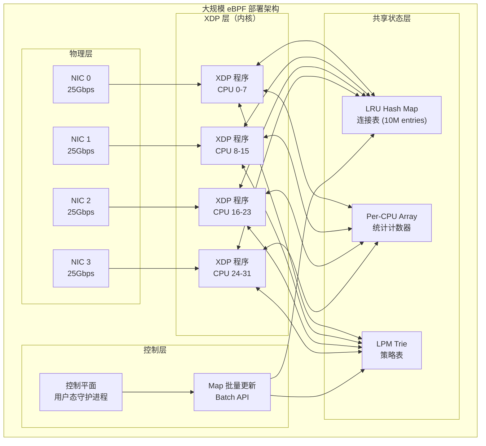

## 8.1.1 NUMA 感知部署配置

> ⚠️ **🟠 高危操作** — 影响业务流量或节点状态，需变更工单+影响评估+计划回滚
> - `systemctl stop/restart`：停止/重启系统服务，影响节点上所有容器

``` bash
# 🟢 低风险：只读/信息收集，通常无副作用
#!/bin/bash
# numa_aware_ebpf_deploy.sh - NUMA 感知 eBPF 部署

# 查看 NUMA 拓扑
numactl --hardware
lscpu | grep -E "NUMA|Socket|CPU"

# 查看网卡 NUMA 节点
cat /sys/class/net/eth0/device/numa_node
cat /sys/class/net/eth1/device/numa_node

# 绑定中断到对应 NUMA 节点的 CPU
# 首先查找网卡中断
grep "eth0" /proc/interrupts | awk '{print $1}' | tr -d ':'

# 将 eth0 的中断绑定到 NUMA node 0 的 CPU (0-15)
for irq in $(grep "eth0" /proc/interrupts | awk '{print $1}' | tr -d ':'); do
    echo "0000ffff" > /proc/irq/$irq/smp_affinity  # CPU 0-15
done

# 加载 eBPF 程序时指定 NUMA node
# libbpf API: bpf_map_create_opts.numa_node

# 设置 irqbalance 排除手动绑定的中断
systemctl stop irqbalance

# 配置 RSS（Receive Side Scaling）队列数量匹配 CPU 数
ethtool -L eth0 combined 16   # 16 队列（匹配 NUMA node 0 的 CPU 数）
ethtool -L eth1 combined 16

# 验证队列配置
ethtool -l eth0
```
## 8.2 BPF 程序热更新（Zero-Downtime Update）

```c
// hot_update_manager.c - 零停机 BPF 程序热更新

#include <bpf/libbpf.h>
#include <bpf/bpf.h>
#include <linux/if_link.h>
#include <net/if.h>

// 原子替换 XDP 程序（零停机）
int hot_update_xdp_program(const char *ifname, 
                            const char *new_obj_file,
                            const char *prog_section)
{
    int ifindex = if_nametoindex(ifname);
    if (!ifindex) {
        perror("if_nametoindex");
        return -1;
    }
    
    // 1. 加载新程序
    struct bpf_object *new_obj = bpf_object__open(new_obj_file);
    if (!new_obj) {
        fprintf(stderr, "Failed to open BPF object\n");
        return -1;
    }
    
    // 2. 重用现有 Maps（避免状态丢失）
    struct bpf_object *old_obj = get_current_bpf_object();
    if (old_obj) {
        // 将旧程序的 Map 固定到 bpffs，新程序重用
        bpf_object__for_each_map(old_obj, map) {
            char pin_path[256];
            snprintf(pin_path, sizeof(pin_path), 
                     "/sys/fs/bpf/maps/%s", bpf_map__name(map));
            bpf_map__pin(map, pin_path);
        }
        
        // 新程序从 bpffs 重用 Maps
        bpf_object__for_each_map(new_obj, map) {
            char pin_path[256];
            snprintf(pin_path, sizeof(pin_path),
                     "/sys/fs/bpf/maps/%s", bpf_map__name(map));
            bpf_map__reuse_fd(map, bpf_obj_get(pin_path));
        }
    }
    
    // 3. 加载并验证新程序
    if (bpf_object__load(new_obj)) {
        fprintf(stderr, "Failed to load new BPF object\n");
        bpf_object__close(new_obj);
        return -1;
    }
    
    struct bpf_program *new_prog = 
        bpf_object__find_program_by_title(new_obj, prog_section);
    if (!new_prog) {
        fprintf(stderr, "Program section not found\n");
        return -1;
    }
    
    int new_fd = bpf_program__fd(new_prog);
    
    // 4. 原子替换 XDP 程序（BPF_XDP_FLAGS_UPDATE_IF_NOEXIST 不会中断流量）
    // 使用 XDP_FLAGS_REPLACE 进行原子替换
    struct bpf_xdp_attach_opts attach_opts = {
        .sz = sizeof(attach_opts),
        .old_prog_fd = get_current_xdp_prog_fd(ifindex),
    };
    
    int ret = bpf_xdp_attach(ifindex, new_fd, 
                              XDP_FLAGS_DRV_MODE | XDP_FLAGS_REPLACE,
                              &attach_opts);
    if (ret) {
        fprintf(stderr, "XDP atomic replace failed: %s\n", 
                strerror(-ret));
        return -1;
    }
    
    printf("XDP program hot-updated on %s\n", ifname);
    return 0;
}
```

## 8.3 大规模 Map 管理

```bash
#!/bin/bash
# large_scale_map_management.sh - 大规模 Map 管理

# 监控 Map 内存使用
watch -n 1 'cat /proc/meminfo | grep -E "BpfMap|Mlocked"'

# 查看所有 BPF Map 内存占用
bpftool map show | awk '{
    if (/type/) { split($0, a, " "); type=a[4] }
    if (/max_entries/) { split($0, b, " "); entries=b[2] }
    if (/bytes_memlock/) { split($0, c, " "); mem=c[2]; 
                           printf "type=%-20s entries=%-10s mem=%s\n", 
                                  type, entries, mem }
}'

# 设置系统级 BPF Map 内存限制
# 默认限制可能不足以支持大规模部署
ulimit -l unlimited  # 解除 memlock 限制（root 操作）

# 或通过 systemd 配置
# LimitMEMLOCK=infinity

# 监控 Map 使用率（通过 bpftool + prometheus）
cat << 'EOF' > /usr/local/bin/bpf_map_exporter.sh
#!/bin/bash
# 导出 BPF Map 指标到 Prometheus

METRICS_FILE="/var/lib/node_exporter/textfile_collector/bpf_maps.prom"

echo "# HELP bpf_map_entries Current number of entries in BPF map" > $METRICS_FILE
echo "# TYPE bpf_map_entries gauge" >> $METRICS_FILE

bpftool map show -j | jq -r '.[] | 
    "bpf_map_entries{name=\"\(.name)\",type=\"\(.type)\"} \(.bytes_memlock)"' \
    >> $METRICS_FILE
EOF
chmod +x /usr/local/bin/bpf_map_exporter.sh
```

---

<!-- chunk: 9. 性能测试与基准方法 -->## 9. 性能测试与基准方法

## 9.1 网络数据路径基准测试

```bash
#!/bin/bash
# network_benchmark.sh - 网络性能基准测试

# ===== 工具准备 =====
# 安装 pktgen（内核数据包生成器）
modprobe pktgen

# ===== XDP 丢弃性能测试 =====
# 测试纯 XDP_DROP 性能（理论上限）
cat << 'EOF' > /proc/net/pktgen/kpktgend_0
rem_device_all
add_device eth0@0
EOF

cat << 'EOF' > /proc/net/pktgen/eth0@0
count 10000000
clone_skb 0
pkt_size 64
delay 0
dst 192.168.1.1
dst_mac 00:00:00:00:00:01
EOF

# 开始测试
echo "start" > /proc/net/pktgen/pgctrl

# 等待完成并获取结果
sleep 15
cat /proc/net/pktgen/eth0@0 | grep -E "pps|Result"

# ===== XDP 转发性能测试（使用 trex） =====
# TRex 是高性能流量生成工具
# ./trex-console
# > start -f stl/imix.py -m 100%

# ===== BPF Map 操作性能基准 =====
cat << 'EOF' > /tmp/map_bench.py
#!/usr/bin/env python3
import time
import ctypes
from bcc import BPF

# 测试不同 Map 类型的查找性能
bpf_text = """
#include <linux/bpf.h>

BPF_HASH(hash_map, u32, u64, 65536);
BPF_PERCPU_HASH(percpu_hash_map, u32, u64, 65536);
BPF_ARRAY(array_map, u64, 65536);
BPF_PERCPU_ARRAY(percpu_array_map, u64, 65536);

int bench_hash(struct pt_regs *ctx) {
    u32 key = bpf_get_prandom_u32() & 0xFFFF;
    u64 *val = hash_map.lookup(&key);
    if (val) (*val)++;
    return 0;
}

int bench_percpu_hash(struct pt_regs *ctx) {
    u32 key = bpf_get_prandom_u32() & 0xFFFF;
    u64 *val = percpu_hash_map.lookup(&key);
    if (val) (*val)++;
    return 0;
}
"""

b = BPF(text=bpf_text)

# 预填充 Maps
for i in range(65536):
    b["hash_map"][ctypes.c_uint32(i)] = ctypes.c_uint64(i)
    b["percpu_hash_map"][ctypes.c_uint32(i)] = ctypes.c_uint64(i)

ITERATIONS = 1_000_000

print("BPF Map 查找性能基准:")
print(f"{'Map 类型':<25} {'时间(ms)':<15} {'QPS':<15}")
print("-" * 55)

# 测试每种 Map 类型的查找性能
for map_name, map_obj in [
    ("HASH", b["hash_map"]),
    ("PERCPU_HASH", b["percpu_hash_map"]),
    ("ARRAY", b["array_map"]),
    ("PERCPU_ARRAY", b["percpu_array_map"]),
]:
    start = time.perf_counter()
    for i in range(ITERATIONS):
        map_obj.get(i % 65536)
    elapsed_ms = (time.perf_counter() - start) * 1000
    qps = ITERATIONS / (elapsed_ms / 1000) / 1_000_000
    
    print(f"{map_name:<25} {elapsed_ms:<15.1f} {qps:.2f}M ops/s")

EOF
python3 /tmp/map_bench.py
```

## 9.2 性能指标与监控

```python
#!/usr/bin/env python3
# ebpf_performance_monitor.py - eBPF 性能监控系统

from bcc import BPF
import ctypes
import time
import json

MONITORING_PROG = """
#include <linux/bpf.h>
#include <linux/sched.h>
#include <bpf/bpf_helpers.h>

// 程序执行时延直方图
BPF_HISTOGRAM(latency_hist, u64, 100);

// 每秒 PPS 计数器
BPF_PERCPU_ARRAY(pps_counter, u64, 1);

// 错误计数器
BPF_ARRAY(error_counter, u64, 10);

// 追踪 XDP 程序执行时延
TRACEPOINT_PROBE(net, xdp_exception)
{
    // 记录异常
    u32 key = args->act;  // XDP 动作类型
    u64 *cnt = error_counter.lookup(&key);
    if (cnt) (*cnt)++;
    return 0;
}
"""

class EBPFMonitor:
    def __init__(self):
        self.b = BPF(text=MONITORING_PROG)
        self.last_pps = {}
        
    def get_stats(self):
        stats = {}
        
        # 读取 PPS 计数器
        pps_map = self.b["pps_counter"]
        total_pps = sum(v.value for v in pps_map.values())
        stats["pps"] = total_pps
        
        # 读取延迟直方图
        hist = self.b["latency_hist"]
        latency_data = {}
        for k, v in hist.items():
            if v.value > 0:
                latency_data[k.value] = v.value
        stats["latency_histogram"] = latency_data
        
        # 读取错误计数器
        error_map = self.b["error_counter"]
        errors = {}
        xdp_actions = {0: "ABORTED", 1: "DROP", 2: "PASS", 
                       3: "TX", 4: "REDIRECT"}
        for k, v in error_map.items():
            if v.value > 0:
                action = xdp_actions.get(k.value, f"UNKNOWN_{k.value}")
                errors[action] = v.value
        stats["errors"] = errors
        
        return stats
    
    def run_monitoring_loop(self, interval=1):
        print(f"{'时间':<12} {'PPS':>12} {'平均延迟':>12} {'P99延迟':>12} {'错误数':>10}")
        print("-" * 60)
        
        while True:
            time.sleep(interval)
            stats = self.get_stats()
            
            # 计算延迟百分位
            hist = stats.get("latency_histogram", {})
            total_samples = sum(hist.values())
            avg_latency = "N/A"
            p99_latency = "N/A"
            
            if total_samples > 0:
                # 计算加权平均
                weighted_sum = sum(k * v for k, v in hist.items())
                avg_latency = f"{weighted_sum / total_samples:.1f}ns"
                
                # 计算 P99
                p99_threshold = total_samples * 0.99
                cumulative = 0
                for k in sorted(hist.keys()):
                    cumulative += hist[k]
                    if cumulative >= p99_threshold:
                        p99_latency = f"{k}ns"
                        break
            
            total_errors = sum(stats.get("errors", {}).values())
            ts = time.strftime("%H:%M:%S")
            
            print(f"{ts:<12} {stats['pps']:>12,} {avg_latency:>12} "
                  f"{p99_latency:>12} {total_errors:>10,}")

if __name__ == "__main__":
    monitor = EBPFMonitor()
    monitor.run_monitoring_loop()
```

## 9.3 基准测试报告模板

```markdown
<!-- chunk: eBPF XDP 性能基准报告 -->## eBPF XDP 性能基准报告

## 测试环境
- CPU: Intel Xeon E5-2699 v4 @ 2.20GHz (44 cores, 88 threads)
- 内存: 128GB DDR4-2133
- 网卡: Intel X710-DA4 (4x 10Gbps)
- 内核: Linux 5.15.0-LTS
- eBPF JIT: 启用

## XDP 性能测试结果

| 程序类型 | 模式 | 包大小(bytes) | 吞吐量(Mpps) | CPU使用率 | 延迟(ns) |
|---------|------|-------------|------------|---------|---------|
| XDP_DROP | Generic | 64 | 3.2 | 100% | 312 |
| XDP_DROP | Native | 64 | 24.5 | 45% | 41 |
| XDP_DROP | Offload | 64 | 120 | 2% | 8 |
| L3 Filter | Native | 64 | 18.3 | 65% | 55 |
| L4 Filter | Native | 64 | 14.7 | 78% | 68 |
| Full L7 | Native | 1500 | 8.9 | 82% | 112 |

## Map 操作性能

| Map 类型 | 操作 | QPS(M/s) | P99延迟(ns) |
|---------|------|---------|-----------|
| HASH | lookup | 8.2 | 245 |
| PERCPU_HASH | lookup | 45.7 | 22 |
| ARRAY | lookup | 312 | 3.2 |
| PERCPU_ARRAY | lookup | 890 | 1.1 |
| LRU_HASH | lookup | 6.1 | 328 |
```

---

<!-- chunk: 10. 生产案例与最佳实践 -->## 10. 生产案例与最佳实践

## 10.1 生产案例：高频交易网络加速

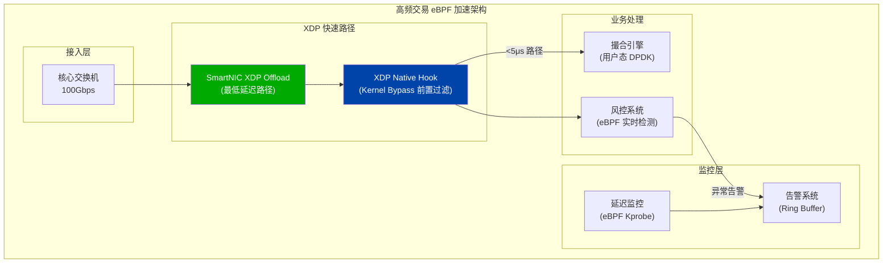

```c
// hft_latency_monitor.c - 高频交易延迟监控
#include <linux/bpf.h>
#include <linux/socket.h>
#include <bpf/bpf_helpers.h>
#include <bpf/bpf_tracing.h>

// 延迟直方图（纳秒级分辨率）
struct {
    __uint(type, BPF_MAP_TYPE_ARRAY);
    __type(key, __u32);
    __type(value, __u64);
    __uint(max_entries, 1000);  // 0-1000ns 直方图
} latency_hist SEC(".maps");

// 时间戳记录（使用 Socket Cookie 跟踪单个连接）
struct {
    __uint(type, BPF_MAP_TYPE_LRU_HASH);
    __type(key, __u64);     // socket cookie
    __type(value, __u64);   // 发送时间戳
    __uint(max_entries, 65536);
} ts_map SEC(".maps");

// 追踪 TCP 发送时间戳
SEC("kprobe/tcp_sendmsg")
int trace_tcp_send(struct pt_regs *ctx)
{
    struct sock *sk = (struct sock *)PT_REGS_PARM1(ctx);
    
    __u64 cookie = bpf_get_socket_cookie_kern(sk);
    __u64 ts = bpf_ktime_get_ns();
    
    bpf_map_update_elem(&ts_map, &cookie, &ts, BPF_ANY);
    
    return 0;
}

// 追踪 TCP ACK 接收（计算 RTT）
SEC("kprobe/tcp_ack")
int trace_tcp_ack(struct pt_regs *ctx)
{
    struct sock *sk = (struct sock *)PT_REGS_PARM1(ctx);
    
    __u64 cookie = bpf_get_socket_cookie_kern(sk);
    __u64 *send_ts = bpf_map_lookup_elem(&ts_map, &cookie);
    
    if (send_ts) {
        __u64 rtt_ns = bpf_ktime_get_ns() - *send_ts;
        
        // 记录到直方图（纳秒分辨率，限制 1000ns 内）
        __u32 bucket = rtt_ns < 1000 ? (__u32)rtt_ns : 999;
        __u64 *cnt = bpf_map_lookup_elem(&latency_hist, &bucket);
        if (cnt)
            __sync_fetch_and_add(cnt, 1);
        
        bpf_map_delete_elem(&ts_map, &cookie);
    }
    
    return 0;
}

char LICENSE[] SEC("license") = "GPL";
```

## 10.2 生产案例：云原生网络加速

```yaml
# cilium-performance-config.yaml
# Cilium 生产环境高性能配置

apiVersion: v1
kind: ConfigMap
metadata:
  name: cilium-config
  namespace: kube-system
data:
  # XDP 加速（需要支持 Native XDP 的网卡）
  enable-xdp-acceleration: "native"
  
  # 禁用 kube-proxy（完全使用 eBPF 替代）
  kube-proxy-replacement: "strict"
  
  # eBPF Host Routing（绕过 iptables）
  enable-host-routing: "true"
  
  # BPF Map 容量配置（根据集群规模调整）
  bpf-ct-global-tcp-max: "2000000"    # 连接跟踪 TCP: 2M
  bpf-ct-global-any-max: "1000000"    # 连接跟踪 UDP: 1M
  bpf-lb-map-max: "65536"             # 负载均衡表: 64K
  bpf-policy-map-max: "65536"         # 策略表: 64K
  
  # 带宽管理
  enable-bandwidth-manager: "true"
  
  # 本地重定向（同节点直接转发，bypass 网络栈）
  enable-local-redirect-policy: "true"
  
  # Cluster Mesh 高性能模式
  cluster-mesh-enable-endpoint-sync: "true"
  
  # 协议栈优化
  enable-ipv4-fragment-tracking: "true"
  
  # JIT 性能优化
  # 通过 DaemonSet 环境变量传递
```

## 10.3 最佳实践总结

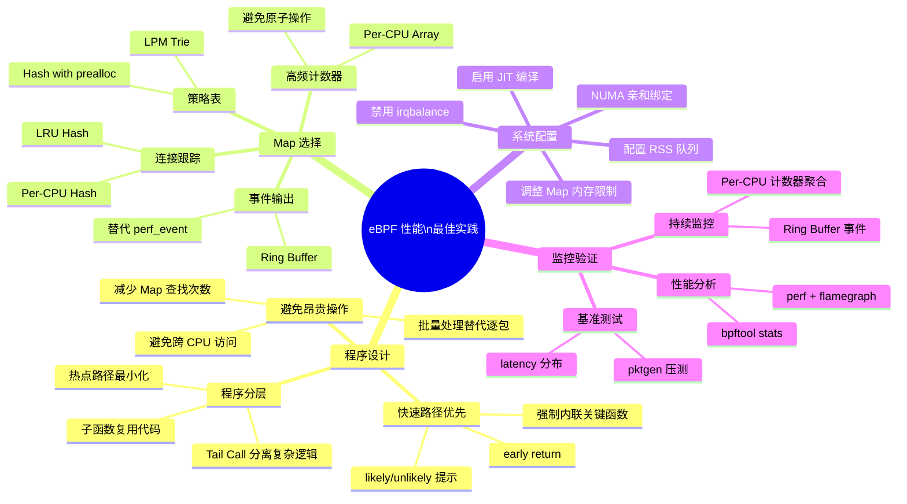

## 10.3.1 性能清单（Performance Checklist）

> ⚠️ **🟠 高危操作** — 影响业务流量或节点状态，需变更工单+影响评估+计划回滚
> - `sysctl -w`：实时修改内核参数，全局生效

```bash
#!/bin/bash
# ebpf_performance_checklist.sh

echo "============================================="
echo "       eBPF 性能优化检查清单"
echo "============================================="

# 1. JIT 状态检查
echo ""
echo "[ 1 ] JIT 编译状态"
JIT=$(cat /proc/sys/net/core/bpf_jit_enable)
if [ "$JIT" -eq "1" ] || [ "$JIT" -eq "2" ]; then
    echo "  ✓ BPF JIT 编译已启用 (值: $JIT)"
else
    echo "  ✗ BPF JIT 未启用，执行: sysctl -w net.core.bpf_jit_enable=1"
fi

# 2. XDP 模式检查
echo ""
echo "[ 2 ] XDP 程序模式"
for iface in $(ip link show | grep "^[0-9]" | awk '{print $2}' | tr -d ':'); do
    XDP_INFO=$(ip link show dev $iface | grep xdp)
    if [ -n "$XDP_INFO" ]; then
        if echo "$XDP_INFO" | grep -q "xdpdrv"; then
            echo "  ✓ $iface: Native XDP (最高性能)"
        elif echo "$XDP_INFO" | grep -q "xdpoffload"; then
            echo "  ✓ $iface: Offload XDP (极致性能)"
        elif echo "$XDP_INFO" | grep -q "xdpgeneric"; then
            echo "  ⚠ $iface: Generic XDP (兼容模式，性能较低)"
        fi
    fi
done

# 3. NUMA 绑定检查
echo ""
echo "[ 3 ] NUMA 亲和性"
for iface in $(ip link show | grep "^[0-9]" | awk '{print $2}' | tr -d ':'); do
    if [ -f /sys/class/net/$iface/device/numa_node ]; then
        NUMA_NODE=$(cat /sys/class/net/$iface/device/numa_node)
        echo "  网卡 $iface 位于 NUMA node: $NUMA_NODE"
    fi
done

# 4. 大页内存
echo ""
echo "[ 4 ] 大页内存状态"
HPS=$(cat /sys/kernel/mm/hugepages/hugepages-2048kB/free_hugepages)
if [ "$HPS" -gt "0" ]; then
    echo "  ✓ 2MB 大页可用: $HPS 页"
else
    echo "  ⚠ 建议配置大页内存用于 UMEM: echo 1024 > /proc/sys/vm/nr_hugepages"
fi

# 5. BPF Map 内存限制
echo ""
echo "[ 5 ] BPF Map 内存限制"
MEMLOCK=$(ulimit -l)
if [ "$MEMLOCK" == "unlimited" ]; then
    echo "  ✓ memlock 无限制"
else
    echo "  ⚠ memlock 限制: ${MEMLOCK}KB，建议设置为 unlimited"
fi

echo ""
echo "============================================="
echo "检查完成，请根据上述建议进行优化配置"
echo "============================================="
```

## 10.3.2 性能优化路线图

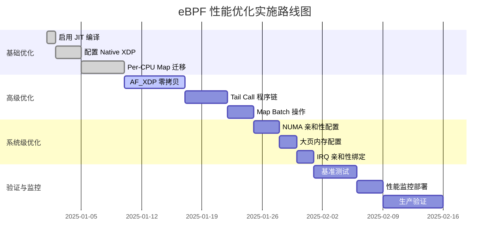

---

<!-- chunk: 参考资料 (References) -->## 参考资料 (References)

## 官方文档
- [Linux Kernel BPF Documentation](https://www.kernel.org/doc/html/latest/bpf/)
- [Cilium BPF and XDP Reference Guide](https://docs.cilium.io/en/stable/bpf/)
- [libbpf Documentation](https://libbpf.readthedocs.io/)

## 技术论文
- "The eXpress Data Path: Fast Programmable Packet Processing in the Operating System Kernel" - Toke Høiland-Jørgensen et al.
- "AF_XDP: Sending and Receiving Packets without the Socket Layer" - Magnus Karlsson, Björn Töpel
- "Programmable Packet Filtering at Line Rate" - Cloudflare Research

## 工具与框架
- [bpftool](https://github.com/torvalds/linux/tree/master/tools/bpf/bpftool) - BPF 系统工具
- [BCC Tools](https://github.com/iovisor/bcc) - BPF 编译工具集
- [libbpf-bootstrap](https://github.com/libbpf/libbpf-bootstrap) - 现代 eBPF 开发框架
- [xdp-tools](https://github.com/xdp-project/xdp-tools) - XDP 实用工具集

## 性能基准
- [XDP 性能测试数据集](https://github.com/xdp-project/xdp-paper)
- [Cilium 性能基准报告](https://cilium.io/blog/2021/05/11/cni-benchmark)

---

*本文档由 kudig.io 技术团队编写，持续更新中。如发现错误或有改进建议，请提交 Issue。*

---

<!-- chunk: Obsidian 相关文档 -->## Obsidian 相关文档

- domain-35-ebpf-technology KUDIG Database — Global MOC
- [[05-网络/README.md|[[Domain 35: eBPF 技术体系 (eBPF Technology Stack)|Domain 35: eBPF 技术体系 (eBPF Technology Stack)]]]]
- Domain-35 eBPF 技术 — 开源项目索引
- eBPF 架构基础与程序类型 (eBPF Architecture Fundamentals and Program T...
- [[05-网络/05-eBPF/02-ebpf-map-types-data-structures.md|02 ebpf map types data structures]]
- Cilium CNI 架构与部署 (Cilium CNI Architecture and Deployment)
- Cilium 网络策略 L3/L4/L7 (Cilium Network Policy L3/L4/L7)
- Cilium Service Mesh 无 Sidecar 架构 (Cilium Service Mesh Sideca...
- Tetragon 运行时安全 (Tetragon Runtime Security)
- Hubble 网络可观测性 (Hubble Network Observability)
- bcc 与 bpftrace 工具链 (bcc and bpftrace Tools)
- eBPF 安全应用案例 (eBPF Security Applications and Use Cases)

## See Also

- 07-hubble-network-observability
- 08-bcc-bpftrace-tools
- 10-ebpf-security-applications
- 01-ebpf-architecture-fundamentals


<!-- risk-assessed -->
