> **生产环境安全提示**
>
> 本文档包含可直接执行的运维命令。执行前请确认：当前目标集群与 Namespace 是否正确；是否具备足够的 RBAC 权限；是否已在非生产环境验证。命令风险等级标注：🔴 高风险（可能造成数据丢失或服务中断）、🟡 中风险（会修改集群状态，但通常可回滚）、🟢 低风险/只读（信息收集，无副作用）。


# eBPF 安全应用案例 (eBPF Security Applications and Use Cases)

> **文档版本**: v1.0 | **适用版本**: Linux Kernel 5.15+ | **更新日期**: 2026-03-04  
> **关键词**: eBPF Security, XDP, IDS, DDoS Protection, Container Security, Zero Trust, SIEM, SOC, Threat Hunting, Compliance

---

<!-- chunk: 目录 (Table of Contents) -->## 目录 (Table of Contents)

1. [eBPF 安全应用概述](#1-ebpf-安全应用概述)
2. [入侵检测系统 (IDS)](#2-入侵检测系统-ids)
   - [网络流量异常检测](#21-网络流量异常检测)
   - [进程行为分析](#22-进程行为分析)
   - [文件完整性监控](#23-文件完整性监控)
3. [DDoS 防护](#3-ddos-防护)
   - [XDP SYN Flood 防护](#31-xdp-syn-flood-防护)
   - [Rate Limiting](#32-rate-limiting-速率限制)
   - [Connection Tracking](#33-connection-tracking-连接追踪)
4. [容器安全](#4-容器安全)
   - [容器逃逸检测](#41-容器逃逸检测)
   - [特权升级监控](#42-特权升级监控)
   - [Namespace 隔离验证](#43-namespace-隔离验证)
5. [零信任网络安全](#5-零信任网络安全)
6. [合规与审计](#6-合规与审计)
   - [系统调用审计](#61-系统调用审计)
   - [网络访问审计](#62-网络访问审计)
7. [威胁狩猎与响应](#7-威胁狩猎与响应)
8. [与 SIEM/SOAR 集成](#8-与-siemsoar-集成)
9. [安全运营中心 (SOC) 集成](#9-安全运营中心-soc-集成)
10. [企业级安全架构最佳实践](#10-企业级安全架构最佳实践)

---

<!-- chunk: 1. eBPF 安全应用概述 -->## 1. eBPF 安全应用概述

## 1.1 为什么 eBPF 改变了安全格局 (Why eBPF Transforms Security)

传统安全工具依赖内核模块或用户态 ptrace，面临性能开销高、稳定性差、绕过风险大等问题。eBPF 在内核验证器保障下以近零开销运行，实现了安全监控的范式转变。

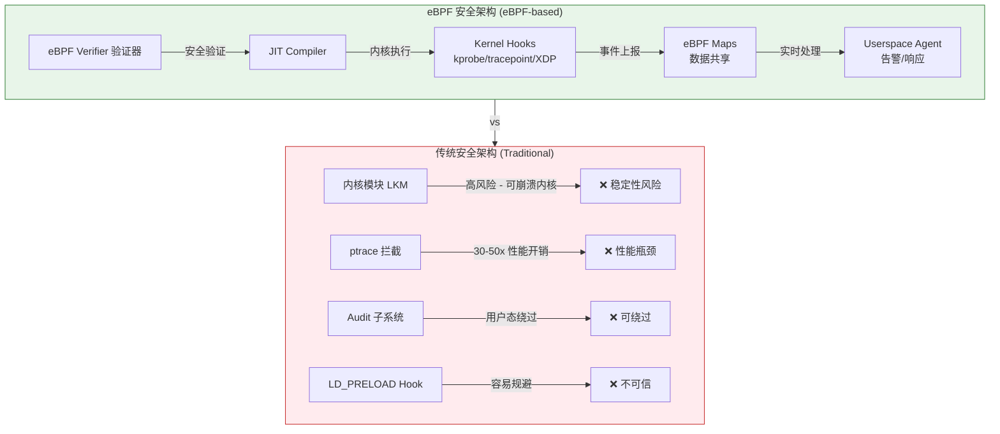

## 1.2 eBPF 安全能力矩阵 (eBPF Security Capability Matrix)

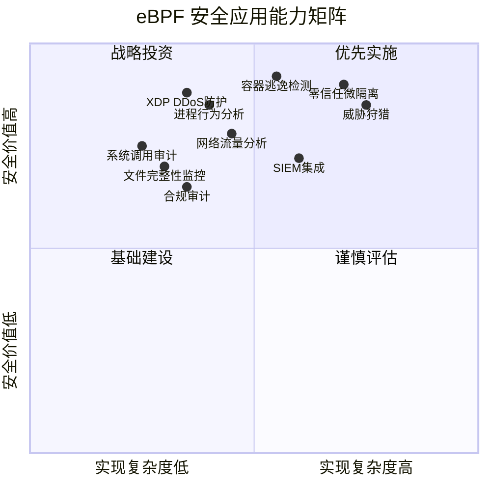

## 1.3 核心技术对比 (Technology Comparison)

| 安全能力 | eBPF 方案 | 传统方案 | 性能开销 | 绕过风险 | 可见度 |
|---------|-----------|---------|---------|---------|-------|
| 网络监控 | XDP/TC Hook | iptables/nftables | <1% | 极低 | L2-L7 |
| 进程监控 | kprobe/tracepoint | auditd/strace | <2% | 极低 | 完整系统调用 |
| 文件监控 | LSM Hook/kprobe | inotify/fanotify | <1% | 低 | VFS 层完整 |
| 容器安全 | Seccomp+eBPF | AppArmor/SELinux | <1% | 极低 | 内核级别 |
| 入侵检测 | [[tetragon\|Tetragon]]/Falco-eBPF | OSSEC/Suricata | <3% | 低 | 全栈可见 |
| DDoS 防护 | XDP | iptables | <5% vs 60%+ | 低 | 线速处理 |

## 1.4 eBPF 安全工具生态 (eBPF Security Ecosystem)

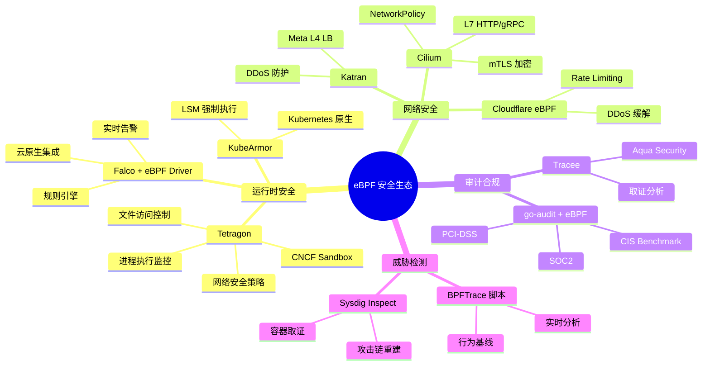

---

<!-- chunk: 2. 入侵检测系统 (IDS) -->## 2. 入侵检测系统 (IDS)

## 2.1 网络流量异常检测

## 2.1.1 架构设计 (Architecture)

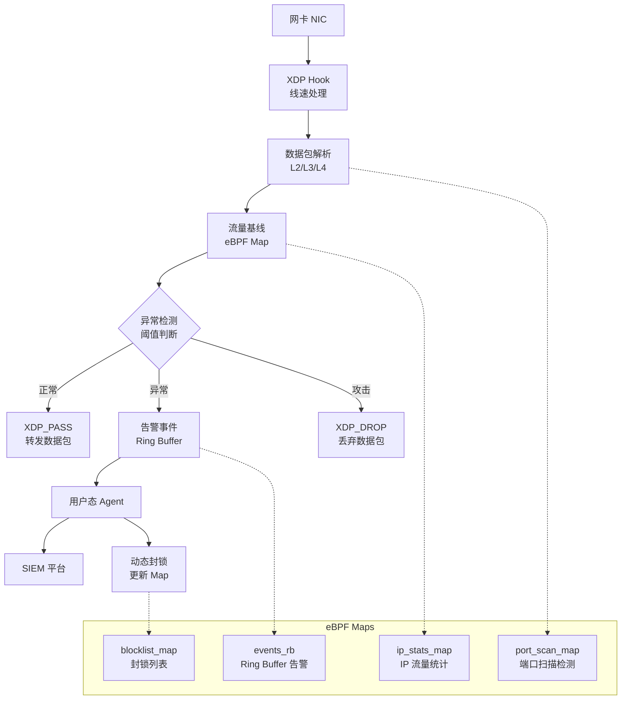

## 2.1.2 eBPF 网络异常检测程序 (Network Anomaly Detection eBPF Program)

```c
// File: network_ids.c
// eBPF 网络流量异常检测 - XDP 程序
// 功能：检测端口扫描、SYN Flood、异常流量

#include <linux/bpf.h>
#include <linux/if_ether.h>
#include <linux/ip.h>
#include <linux/tcp.h>
#include <linux/udp.h>
#include <linux/icmp.h>
#include <bpf/bpf_helpers.h>
#include <bpf/bpf_endian.h>

#define MAX_ENTRIES        65536
#define SCAN_THRESHOLD     100    // 100 个不同端口/秒 视为扫描
#define CONN_THRESHOLD     10000  // 10K 连接/秒 视为 Flood
#define WINDOW_NS          1000000000ULL  // 1 秒窗口

// ===================== 数据结构定义 =====================

// 流量统计键：源 IP
struct ip_stats_key {
    __u32 src_ip;
};

// 流量统计值
struct ip_stats_val {
    __u64 pkt_count;       // 总包数
    __u64 byte_count;      // 总字节
    __u64 syn_count;       // SYN 包数（检测 SYN Flood）
    __u64 unique_ports;    // 访问不同端口数（检测端口扫描）
    __u64 last_ts;         // 上次重置时间戳
    __u64 window_pkts;     // 当前窗口包数
};

// 端口扫描追踪：每个源 IP 访问的端口位图
struct port_bitmap {
    __u8 bits[8192];  // 65536 端口 / 8 bits = 8192 字节
};

// 告警事件（发送到 Ring Buffer）
struct alert_event {
    __u64 timestamp;
    __u32 src_ip;
    __u32 dst_ip;
    __u16 src_port;
    __u16 dst_port;
    __u8  proto;
    __u8  alert_type;      // 1=PortScan, 2=SYNFlood, 3=Anomaly
    __u32 count;
    char  msg[64];
};

#define ALERT_PORT_SCAN  1
#define ALERT_SYN_FLOOD  2
#define ALERT_RATE_LIMIT 3

// ===================== eBPF Maps =====================

// IP 流量统计
struct {
    __uint(type, BPF_MAP_TYPE_LRU_HASH);
    __uint(max_entries, MAX_ENTRIES);
    __type(key, struct ip_stats_key);
    __type(value, struct ip_stats_val);
} ip_stats_map SEC(".maps");

// 端口访问位图（检测扫描）
struct {
    __uint(type, BPF_MAP_TYPE_LRU_HASH);
    __uint(max_entries, 4096);
    __type(key, __u32);              // src_ip
    __type(value, struct port_bitmap);
} port_scan_map SEC(".maps");

// 封锁列表（被检测为攻击者的 IP）
struct {
    __uint(type, BPF_MAP_TYPE_LRU_HASH);
    __uint(max_entries, MAX_ENTRIES);
    __type(key, __u32);              // src_ip
    __type(value, __u64);            // 封锁到期时间戳
} blocklist_map SEC(".maps");

// 告警事件 Ring Buffer
struct {
    __uint(type, BPF_MAP_TYPE_RINGBUF);
    __uint(max_entries, 4 * 1024 * 1024);  // 4MB Ring Buffer
} events_rb SEC(".maps");

// 配置 Map（用户态动态调整阈值）
struct {
    __uint(type, BPF_MAP_TYPE_ARRAY);
    __uint(max_entries, 8);
    __type(key, __u32);
    __type(value, __u64);
} config_map SEC(".maps");

// ===================== 辅助函数 =====================

// 检查 IP 是否在封锁列表
static __always_inline int is_blocked(__u32 src_ip) {
    __u64 *expire_ts = bpf_map_lookup_elem(&blocklist_map, &src_ip);
    if (!expire_ts) return 0;
    __u64 now = bpf_ktime_get_ns();
    if (now > *expire_ts) {
        // 封锁已过期，删除
        bpf_map_delete_elem(&blocklist_map, &src_ip);
        return 0;
    }
    return 1;
}

// 发送告警事件
static __always_inline void send_alert(
    __u32 src_ip, __u32 dst_ip,
    __u16 src_port, __u16 dst_port,
    __u8 proto, __u8 alert_type, __u32 count)
{
    struct alert_event *evt = bpf_ringbuf_reserve(
        &events_rb, sizeof(struct alert_event), 0);
    if (!evt) return;

    evt->timestamp  = bpf_ktime_get_ns();
    evt->src_ip     = src_ip;
    evt->dst_ip     = dst_ip;
    evt->src_port   = src_port;
    evt->dst_port   = dst_port;
    evt->proto      = proto;
    evt->alert_type = alert_type;
    evt->count      = count;

    bpf_ringbuf_submit(evt, 0);
}

// 记录端口访问（端口扫描检测）
static __always_inline int track_port(__u32 src_ip, __u16 dst_port) {
    struct port_bitmap *bm = bpf_map_lookup_elem(&port_scan_map, &src_ip);
    if (!bm) {
        struct port_bitmap new_bm = {};
        bpf_map_update_elem(&port_scan_map, &src_ip, &new_bm, BPF_ANY);
        bm = bpf_map_lookup_elem(&port_scan_map, &src_ip);
        if (!bm) return 0;
    }

    // 设置对应端口位
    int byte_idx = dst_port / 8;
    int bit_idx  = dst_port % 8;

    // 验证边界（eBPF verifier 要求）
    if (byte_idx >= 8192) return 0;

    int already_set = (bm->bits[byte_idx] >> bit_idx) & 1;
    if (!already_set) {
        bm->bits[byte_idx] |= (1 << bit_idx);
        return 1;  // 新端口
    }
    return 0;  // 已记录端口
}

// ===================== XDP 主程序 =====================

SEC("xdp")
int network_ids(struct xdp_md *ctx) {
    void *data_end = (void *)(long)ctx->data_end;
    void *data     = (void *)(long)ctx->data;

    // 解析以太网头
    struct ethhdr *eth = data;
    if ((void *)(eth + 1) > data_end) return XDP_PASS;
    if (bpf_ntohs(eth->h_proto) != ETH_P_IP) return XDP_PASS;

    // 解析 IP 头
    struct iphdr *ip = (void *)(eth + 1);
    if ((void *)(ip + 1) > data_end) return XDP_PASS;

    __u32 src_ip = ip->saddr;
    __u32 dst_ip = ip->daddr;
    __u8  proto  = ip->protocol;

    // ① 检查封锁列表（最快路径）
    if (is_blocked(src_ip)) return XDP_DROP;

    __u16 src_port = 0, dst_port = 0;
    __u8  tcp_flags = 0;

    // 解析传输层
    if (proto == IPPROTO_TCP) {
        struct tcphdr *tcp = (void *)ip + (ip->ihl * 4);
        if ((void *)(tcp + 1) > data_end) return XDP_PASS;
        src_port  = bpf_ntohs(tcp->source);
        dst_port  = bpf_ntohs(tcp->dest);
        tcp_flags = ((__u8 *)tcp)[13];
    } else if (proto == IPPROTO_UDP) {
        struct udphdr *udp = (void *)ip + (ip->ihl * 4);
        if ((void *)(udp + 1) > data_end) return XDP_PASS;
        src_port = bpf_ntohs(udp->source);
        dst_port = bpf_ntohs(udp->dest);
    }

    // ② 获取/初始化 IP 统计
    struct ip_stats_key key = { .src_ip = src_ip };
    struct ip_stats_val *stats = bpf_map_lookup_elem(&ip_stats_map, &key);
    __u64 now = bpf_ktime_get_ns();

    if (!stats) {
        struct ip_stats_val new_stats = {
            .pkt_count    = 1,
            .byte_count   = bpf_ntohs(ip->tot_len),
            .syn_count    = 0,
            .unique_ports = 0,
            .last_ts      = now,
            .window_pkts  = 1,
        };
        bpf_map_update_elem(&ip_stats_map, &key, &new_stats, BPF_ANY);
        return XDP_PASS;
    }

    // ③ 时间窗口重置
    if (now - stats->last_ts > WINDOW_NS) {
        stats->window_pkts  = 0;
        stats->syn_count    = 0;
        stats->unique_ports = 0;
        stats->last_ts      = now;
        // 清除端口位图（新窗口）
        bpf_map_delete_elem(&port_scan_map, &src_ip);
    }

    // 更新统计
    __sync_fetch_and_add(&stats->pkt_count, 1);
    __sync_fetch_and_add(&stats->byte_count, bpf_ntohs(ip->tot_len));
    __sync_fetch_and_add(&stats->window_pkts, 1);

    // ④ SYN Flood 检测（TCP SYN 包）
    if (proto == IPPROTO_TCP && (tcp_flags & 0x02) && !(tcp_flags & 0x10)) {
        __sync_fetch_and_add(&stats->syn_count, 1);
        if (stats->syn_count > CONN_THRESHOLD) {
            send_alert(src_ip, dst_ip, src_port, dst_port,
                      proto, ALERT_SYN_FLOOD, stats->syn_count);
            // 封锁 60 秒
            __u64 expire = now + 60 * 1000000000ULL;
            bpf_map_update_elem(&blocklist_map, &src_ip, &expire, BPF_ANY);
            return XDP_DROP;
        }
    }

    // ⑤ 端口扫描检测（TCP SYN 到新端口）
    if (proto == IPPROTO_TCP && dst_port > 0) {
        int new_port = track_port(src_ip, dst_port);
        if (new_port) {
            __sync_fetch_and_add(&stats->unique_ports, 1);
            if (stats->unique_ports > SCAN_THRESHOLD) {
                send_alert(src_ip, dst_ip, src_port, dst_port,
                          proto, ALERT_PORT_SCAN, stats->unique_ports);
                // 端口扫描：临时封锁 300 秒
                __u64 expire = now + 300 * 1000000000ULL;
                bpf_map_update_elem(&blocklist_map, &src_ip, &expire, BPF_ANY);
                return XDP_DROP;
            }
        }
    }

    // ⑥ 通用速率限制
    if (stats->window_pkts > CONN_THRESHOLD * 5) {
        send_alert(src_ip, dst_ip, src_port, dst_port,
                  proto, ALERT_RATE_LIMIT, stats->window_pkts);
        return XDP_DROP;
    }

    return XDP_PASS;
}

char LICENSE[] SEC("license") = "GPL";
```

## 2.1.3 用户态告警处理器 (Userspace Alert Handler)

```c
// File: ids_agent.c
// 用户态告警处理 Agent

#include <stdio.h>
#include <stdlib.h>
#include <string.h>
#include <arpa/inet.h>
#include <bpf/libbpf.h>
#include <bpf/bpf.h>
#include <signal.h>
#include <time.h>

struct alert_event {
    __u64 timestamp;
    __u32 src_ip;
    __u32 dst_ip;
    __u16 src_port;
    __u16 dst_port;
    __u8  proto;
    __u8  alert_type;
    __u32 count;
    char  msg[64];
};

#define ALERT_PORT_SCAN  1
#define ALERT_SYN_FLOOD  2
#define ALERT_RATE_LIMIT 3

static const char *alert_type_str(int type) {
    switch (type) {
    case ALERT_PORT_SCAN:  return "PORT_SCAN";
    case ALERT_SYN_FLOOD:  return "SYN_FLOOD";
    case ALERT_RATE_LIMIT: return "RATE_LIMIT";
    default: return "UNKNOWN";
    }
}

// Ring Buffer 回调：处理告警事件
static int handle_alert(void *ctx, void *data, size_t size) {
    struct alert_event *evt = data;
    if (size < sizeof(*evt)) return 0;

    char src_str[INET_ADDRSTRLEN], dst_str[INET_ADDRSTRLEN];
    struct in_addr src_addr = { .s_addr = evt->src_ip };
    struct in_addr dst_addr = { .s_addr = evt->dst_ip };
    inet_ntop(AF_INET, &src_addr, src_str, sizeof(src_str));
    inet_ntop(AF_INET, &dst_addr, dst_str, sizeof(dst_str));

    // 格式化时间戳
    time_t t = evt->timestamp / 1000000000;
    struct tm *tm_info = localtime(&t);
    char time_str[32];
    strftime(time_str, sizeof(time_str), "%Y-%m-%dT%H:%M:%S", tm_info);

    // 输出 JSON 格式（便于 SIEM 接入）
    printf("{"
           "\"timestamp\":\"%s\","
           "\"alert_type\":\"%s\","
           "\"src_ip\":\"%s\","
           "\"dst_ip\":\"%s\","
           "\"src_port\":%d,"
           "\"dst_port\":%d,"
           "\"protocol\":%d,"
           "\"count\":%d"
           "}\n",
           time_str,
           alert_type_str(evt->alert_type),
           src_str, dst_str,
           evt->src_port, evt->dst_port,
           evt->proto,
           evt->count);
    fflush(stdout);
    return 0;
}

int main(int argc, char **argv) {
    if (argc < 2) {
        fprintf(stderr, "Usage: %s <bpf_prog.o>\n", argv[0]);
        return 1;
    }

    // 加载 BPF 对象
    struct bpf_object *obj = bpf_object__open(argv[1]);
    if (!obj) { perror("bpf_object__open"); return 1; }
    if (bpf_object__load(obj)) { perror("bpf_object__load"); return 1; }

    // 获取 Ring Buffer Map FD
    struct bpf_map *rb_map = bpf_object__find_map_by_name(obj, "events_rb");
    if (!rb_map) { fprintf(stderr, "events_rb map not found\n"); return 1; }

    // 创建 Ring Buffer
    struct ring_buffer *rb = ring_buffer__new(
        bpf_map__fd(rb_map), handle_alert, NULL, NULL);
    if (!rb) { perror("ring_buffer__new"); return 1; }

    printf("[IDS Agent] Listening for security events...\n");

    // 事件循环
    while (1) {
        int err = ring_buffer__poll(rb, 100 /* timeout ms */);
        if (err < 0) {
            fprintf(stderr, "Ring buffer poll error: %d\n", err);
            break;
        }
    }

    ring_buffer__free(rb);
    bpf_object__close(obj);
    return 0;
}
```

## 2.2 进程行为分析

## 2.2.1 TracingPolicy：进程行为基线 (Process Behavior Baseline)

```yaml
# File: policy-process-behavior-ids.yaml
# Tetragon TracingPolicy - 进程行为异常检测
# 检测：异常命令执行、反弹 Shell、内存注入、权限提升

apiVersion: cilium.io/v1alpha1
kind: TracingPolicy
metadata:
  name: process-behavior-ids
  namespace: kube-system
  labels:
    security.kudig.io/category: "ids"
    security.kudig.io/severity: "high"
spec:
  # ========== execve 监控：检测异常进程执行 ==========
  kprobes:
    # 1. 检测敏感命令执行（反弹 Shell 工具）
    - call: "security_bprm_check"
      syscall: false
      args:
        - index: 0
          type: "linux_binprm"
      selectors:
        # 检测 netcat/ncat 反弹 Shell
        - matchBinaries:
            - operator: "In"
              values:
                - "/bin/nc"
                - "/usr/bin/nc"
                - "/bin/ncat"
                - "/usr/bin/ncat"
                - "/bin/netcat"
          matchCapabilities:
            - type: Effective
              operator: NotIn
              values:
                - "CAP_NET_ADMIN"
          matchActions:
            - action: Sigkill
        # 检测 Python/Perl/Ruby 反弹 Shell 特征
        - matchBinaries:
            - operator: "In"
              values:
                - "/usr/bin/python3"
                - "/usr/bin/perl"
                - "/usr/bin/ruby"
          matchArgs:
            - index: 0
              operator: "Postfix"
              values:
                - "-e"
                - "-c"
          matchActions:
            - action: Post
              rateLimit: "1/minute"

    # 2. 检测 /proc/*/mem 写入（进程内存注入）
    - call: "__x64_sys_ptrace"
      syscall: true
      args:
        - index: 0
          type: "int"         # request type
        - index: 1
          type: "int"         # pid
        - index: 2
          type: "uint64"      # addr
        - index: 3
          type: "uint64"      # data
      selectors:
        - matchArgs:
            - index: 0
              operator: "Equal"
              values:
                - "4"   # PTRACE_POKEDATA
          matchActions:
            - action: Post
              rateLimit: "10/minute"
            - action: Sigkill

    # 3. 监控 cron/at 任务创建（持久化检测）
    - call: "__x64_sys_openat"
      syscall: true
      args:
        - index: 1
          type: "string"
      selectors:
        - matchArgs:
            - index: 1
              operator: "Prefix"
              values:
                - "/var/spool/cron"
                - "/etc/cron.d"
                - "/etc/crontab"
          matchActions:
            - action: Post
              rateLimit: "5/minute"

  # ========== 网络连接监控：检测 C2 通信 ==========
  tracepoints:
    - subsystem: "syscalls"
      event: "sys_enter_connect"
      args:
        - index: 0
          type: "int"
        - index: 1
          type: "sockaddr"
        - index: 2
          type: "int"
      selectors:
        # 检测容器连接到外部非标准高端口（C2 特征）
        - matchNamespaces:
            - namespace: Net
              operator: NotIn
              values:
                - "host"  # 仅检测容器命名空间
          matchActions:
            - action: Post
              rateLimit: "100/minute"
```

## 2.2.2 eBPF 进程行为追踪程序 (Process Behavior Tracer)

```c
// File: process_tracer.c
// eBPF 进程行为分析 - 追踪 execve/fork/clone 系统调用
// 构建进程树，检测异常父子关系

#include <linux/bpf.h>
#include <linux/ptrace.h>
#include <linux/sched.h>
#include <bpf/bpf_helpers.h>
#include <bpf/bpf_tracing.h>
#include <bpf/bpf_core_read.h>

#define TASK_COMM_LEN  16
#define MAX_ARGS_SIZE  256
#define MAX_PROCESSES  65536

// 进程信息记录
struct proc_info {
    __u32 pid;
    __u32 ppid;
    __u32 uid;
    __u32 gid;
    __u64 start_ts;
    char  comm[TASK_COMM_LEN];
    char  filename[128];
    char  args[MAX_ARGS_SIZE];
    __u32 ns_pid;       // 容器内 PID
    __u64 ns_inum;      // PID 命名空间 ID（容器标识）
    __u8  is_container; // 是否在容器中
};

// 进程执行事件
struct exec_event {
    __u64 timestamp;
    struct proc_info proc;
    __u8  alert;        // 是否触发告警
    char  reason[64];   // 告警原因
};

// eBPF Maps
struct {
    __uint(type, BPF_MAP_TYPE_HASH);
    __uint(max_entries, MAX_PROCESSES);
    __type(key, __u32);              // pid
    __type(value, struct proc_info);
} proc_map SEC(".maps");

struct {
    __uint(type, BPF_MAP_TYPE_RINGBUF);
    __uint(max_entries, 8 * 1024 * 1024);
} exec_events SEC(".maps");

// 可疑进程名单（用户态通过 Map 更新）
struct {
    __uint(type, BPF_MAP_TYPE_HASH);
    __uint(max_entries, 256);
    __type(key, char[TASK_COMM_LEN]);
    __type(value, __u8);             // severity level
} suspicious_comms SEC(".maps");

// 辅助：获取 PID 命名空间 inum（判断是否在容器中）
static __always_inline __u64 get_pid_ns_inum(struct task_struct *task) {
    struct nsproxy *ns;
    struct pid_namespace *pid_ns;
    __u64 inum = 0;
    ns = BPF_CORE_READ(task, nsproxy);
    if (ns) {
        pid_ns = BPF_CORE_READ(ns, pid_ns_for_children);
        if (pid_ns) {
            // 读取 ns_common.inum
            bpf_core_read(&inum, sizeof(inum),
                         &pid_ns->ns.inum);
        }
    }
    return inum;
}

// Tracepoint: sys_enter_execve
SEC("tracepoint/syscalls/sys_enter_execve")
int trace_execve(struct trace_event_raw_sys_enter *ctx) {
    struct task_struct *task = (struct task_struct *)bpf_get_current_task();
    __u64 pid_tgid = bpf_get_current_pid_tgid();
    __u32 pid = pid_tgid >> 32;
    __u32 tid = pid_tgid & 0xFFFFFFFF;

    if (tid != pid) return 0;  // 只追踪主线程

    struct exec_event *evt = bpf_ringbuf_reserve(
        &exec_events, sizeof(struct exec_event), 0);
    if (!evt) return 0;

    __builtin_memset(evt, 0, sizeof(*evt));
    evt->timestamp = bpf_ktime_get_ns();

    // 填充进程信息
    evt->proc.pid      = pid;
    evt->proc.ppid     = BPF_CORE_READ(task, real_parent, tgid);
    evt->proc.uid      = bpf_get_current_uid_gid() & 0xFFFFFFFF;
    evt->proc.gid      = bpf_get_current_uid_gid() >> 32;
    evt->proc.start_ts = BPF_CORE_READ(task, start_time);
    evt->proc.ns_inum  = get_pid_ns_inum(task);
    bpf_get_current_comm(&evt->proc.comm, sizeof(evt->proc.comm));

    // 读取执行文件路径
    const char __user *filename = (const char __user *)ctx->args[0];
    bpf_probe_read_user_str(evt->proc.filename,
                            sizeof(evt->proc.filename), filename);

    // 读取命令行参数（前 256 字节）
    const char __user *const __user *argv =
        (const char __user *const __user *)ctx->args[1];
    if (argv) {
        char arg[64];
        int offset = 0;
        for (int i = 0; i < 8 && offset < MAX_ARGS_SIZE - 1; i++) {
            const char __user *argp = NULL;
            if (bpf_probe_read_user(&argp, sizeof(argp), &argv[i]))
                break;
            if (!argp) break;
            int len = bpf_probe_read_user_str(
                arg, sizeof(arg), argp);
            if (len <= 0) break;
            if (offset + len < MAX_ARGS_SIZE) {
                bpf_probe_read_kernel(evt->proc.args + offset,
                                     len, arg);
                offset += len;
                evt->proc.args[offset - 1] = ' ';
            }
        }
    }

    // 检测告警条件：UID=0 在容器中执行可疑命令
    if (evt->proc.uid == 0 && evt->proc.ns_inum != 0) {
        __u8 *severity = bpf_map_lookup_elem(
            &suspicious_comms, &evt->proc.comm);
        if (severity) {
            evt->alert = *severity;
            __builtin_memcpy(evt->reason,
                            "Suspicious root cmd in container", 32);
        }
    }

    // 存入进程 Map（供后续关联分析）
    bpf_map_update_elem(&proc_map, &pid, &evt->proc, BPF_ANY);

    bpf_ringbuf_submit(evt, 0);
    return 0;
}

// Kretprobe: 进程退出时清理
SEC("kprobe/do_exit")
int trace_exit(struct pt_regs *ctx) {
    __u32 pid = bpf_get_current_pid_tgid() >> 32;
    bpf_map_delete_elem(&proc_map, &pid);
    return 0;
}

char LICENSE[] SEC("license") = "GPL";
```

## 2.3 文件完整性监控

## 2.3.1 TracingPolicy：关键文件监控 (Critical File Integrity Monitoring)

```yaml
# File: policy-file-integrity-monitoring.yaml
# Tetragon TracingPolicy - 文件完整性监控 (FIM)
# 覆盖：/etc/passwd, /etc/shadow, SSH keys, 系统二进制文件

apiVersion: cilium.io/v1alpha1
kind: TracingPolicy
metadata:
  name: file-integrity-monitoring
  namespace: kube-system
  labels:
    security.kudig.io/category: "fim"
    security.kudig.io/compliance: "pci-dss,cis,soc2"
spec:
  kprobes:
    # 1. 监控 /etc/passwd 写入（账户篡改）
    - call: "vfs_write"
      syscall: false
      args:
        - index: 0
          type: "file"
        - index: 1
          type: "char_buf"
          sizeArgIndex: 3
        - index: 2
          type: "size_t"
      selectors:
        - matchArgs:
            - index: 0
              operator: "Prefix"
              values:
                - "/etc/passwd"
                - "/etc/shadow"
                - "/etc/sudoers"
                - "/etc/sudoers.d/"
          matchActions:
            - action: Post
            - action: Sigkill  # 立即阻断篡改

    # 2. 监控 SSH 授权密钥写入
    - call: "vfs_write"
      syscall: false
      args:
        - index: 0
          type: "file"
      selectors:
        - matchArgs:
            - index: 0
              operator: "Postfix"
              values:
                - ".ssh/authorized_keys"
                - ".ssh/authorized_keys2"
          matchActions:
            - action: Post
              rateLimit: "1/minute"
            - action: Sigkill

    # 3. 监控系统二进制文件写入（防止替换系统命令）
    - call: "security_inode_create"
      syscall: false
      args:
        - index: 1
          type: "string"
      selectors:
        - matchArgs:
            - index: 1
              operator: "Prefix"
              values:
                - "/bin/"
                - "/sbin/"
                - "/usr/bin/"
                - "/usr/sbin/"
                - "/lib/"
                - "/usr/lib/"
          matchActions:
            - action: Post
            - action: Sigkill

    # 4. 监控 /proc/sysrq-trigger 写入（内核触发）
    - call: "vfs_write"
      syscall: false
      args:
        - index: 0
          type: "file"
      selectors:
        - matchArgs:
            - index: 0
              operator: "Equal"
              values:
                - "/proc/sysrq-trigger"
                - "/proc/kcore"
          matchActions:
            - action: Post
            - action: Sigkill

    # 5. LD_PRELOAD 环境变量设置（动态链接劫持）
    - call: "__x64_sys_execve"
      syscall: true
      args:
        - index: 2
          type: "string_array"
      selectors:
        - matchArgs:
            - index: 2
              operator: "Prefix"
              values:
                - "LD_PRELOAD="
                - "LD_LIBRARY_PATH="
          matchActions:
            - action: Post
            - action: Sigkill
```

---

<!-- chunk: 3. DDoS 防护 -->## 3. DDoS 防护

## 3.1 XDP SYN Flood 防护

## 3.1.1 SYN Cookie 架构 (SYN Cookie Architecture)

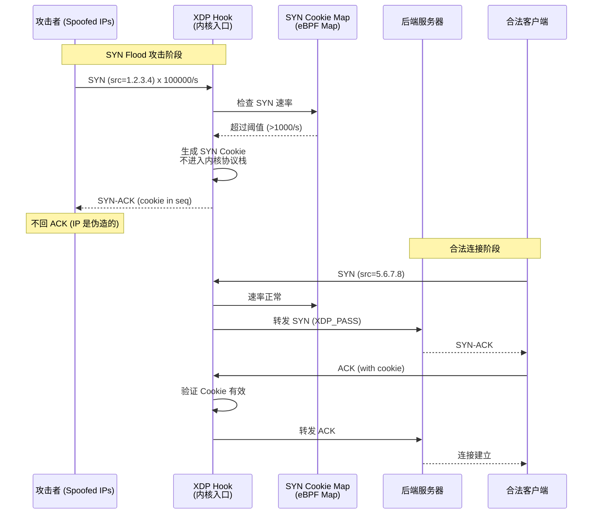

## 3.1.2 XDP SYN Flood 防护完整实现

```c
// File: syn_flood_protection.c
// XDP SYN Cookie 防护 - 生产级 SYN Flood 缓解
// 在内核网络栈入口处处理，无需 CPU 上下文切换

#include <linux/bpf.h>
#include <linux/if_ether.h>
#include <linux/ip.h>
#include <linux/ipv6.h>
#include <linux/tcp.h>
#include <linux/in.h>
#include <bpf/bpf_helpers.h>
#include <bpf/bpf_endian.h>

// =================== 配置常量 ===================
#define SYN_RATE_THRESHOLD    1000   // 每秒 SYN 包阈值
#define COOKIE_TIMEOUT_S      30     // SYN Cookie 超时（秒）
#define MAX_TRACKED_IPS       131072 // 最大追踪 IP 数
#define BLOOM_FILTER_SIZE     (1 << 20)  // 布隆过滤器大小（1M bits）

// SYN 追踪条目
struct syn_entry {
    __u64 count;         // SYN 包计数
    __u64 window_start;  // 窗口开始时间
    __u8  cookie_mode;   // 是否启用 Cookie 模式
};

// =================== eBPF Maps ===================

// 全局 SYN 统计（按目标 IP/Port）
struct {
    __uint(type, BPF_MAP_TYPE_LRU_PERCPU_HASH);
    __uint(max_entries, MAX_TRACKED_IPS);
    __type(key, __u32);
    __type(value, struct syn_entry);
} syn_stats SEC(".maps");

// SYN Cookie 验证 Map（已发送 Cookie 的客户端）
struct {
    __uint(type, BPF_MAP_TYPE_LRU_HASH);
    __uint(max_entries, MAX_TRACKED_IPS * 4);
    __type(key, __u64);   // src_ip:src_port:seq_hash
    __type(value, __u64); // 过期时间戳
} cookie_map SEC(".maps");

// 全局统计计数器
struct {
    __uint(type, BPF_MAP_TYPE_PERCPU_ARRAY);
    __uint(max_entries, 8);
    __type(key, __u32);
    __type(value, __u64);
} stats_map SEC(".maps");

// 白名单 IP（不应用 SYN Cookie 的可信源）
struct {
    __uint(type, BPF_MAP_TYPE_LRU_HASH);
    __uint(max_entries, 4096);
    __type(key, __u32);   // src_ip
    __type(value, __u8);  // 白名单标志
} whitelist_map SEC(".maps");

// 统计索引
#define STAT_SYN_TOTAL       0
#define STAT_SYN_DROPPED     1
#define STAT_COOKIE_SENT     2
#define STAT_COOKIE_VERIFIED 3
#define STAT_WHITELIST_HIT   4

static __always_inline void stat_inc(__u32 idx) {
    __u64 *val = bpf_map_lookup_elem(&stats_map, &idx);
    if (val) __sync_fetch_and_add(val, 1);
}

// =================== SYN Cookie 生成 ===================
// 简化版 SYN Cookie：使用 BPF 哈希函数
// 生产环境应使用 HMAC-SHA256
static __always_inline __u32 generate_cookie(
    __u32 src_ip, __u16 src_port,
    __u32 dst_ip, __u16 dst_port,
    __u32 seq, __u64 timestamp)
{
    // 使用 BPF 内置哈希（生产中应替换为加密哈希）
    __u64 hash = (__u64)src_ip ^ ((__u64)src_port << 32) ^
                 (__u64)dst_ip ^ ((__u64)dst_port << 48) ^
                 (__u64)seq ^ (timestamp / 1000000000);
    // 混淆
    hash ^= (hash >> 33);
    hash *= 0xff51afd7ed558ccdULL;
    hash ^= (hash >> 33);
    hash *= 0xc4ceb9fe1a85ec53ULL;
    hash ^= (hash >> 33);
    return (__u32)(hash & 0xFFFFFFFF);
}

// =================== 校验和计算 ===================
static __always_inline __u16 csum_fold(__u32 csum) {
    csum = (csum & 0xffff) + (csum >> 16);
    csum = (csum & 0xffff) + (csum >> 16);
    return ~csum;
}

static __always_inline __u32 csum_diff(
    __u16 *from, int from_size,
    __u16 *to, int to_size, __u32 seed)
{
    return bpf_csum_diff((__be32 *)from, from_size,
                         (__be32 *)to, to_size, seed);
}

// =================== XDP 主程序 ===================
SEC("xdp")
int syn_flood_protection(struct xdp_md *ctx) {
    void *data_end = (void *)(long)ctx->data_end;
    void *data     = (void *)(long)ctx->data;

    struct ethhdr *eth = data;
    if ((void *)(eth + 1) > data_end) return XDP_PASS;
    if (bpf_ntohs(eth->h_proto) != ETH_P_IP) return XDP_PASS;

    struct iphdr *ip = (void *)(eth + 1);
    if ((void *)(ip + 1) > data_end) return XDP_PASS;
    if (ip->protocol != IPPROTO_TCP) return XDP_PASS;

    struct tcphdr *tcp = (void *)ip + (ip->ihl * 4);
    if ((void *)(tcp + 1) > data_end) return XDP_PASS;

    __u32 src_ip   = ip->saddr;
    __u32 dst_ip   = ip->daddr;
    __u16 src_port = tcp->source;
    __u16 dst_port = tcp->dest;
    __u8  flags    = ((__u8 *)tcp)[13];

    // ① 检查白名单
    __u8 *wl = bpf_map_lookup_elem(&whitelist_map, &src_ip);
    if (wl) {
        stat_inc(STAT_WHITELIST_HIT);
        return XDP_PASS;
    }

    // ② 处理纯 SYN 包（连接建立阶段）
    if ((flags & 0x02) && !(flags & 0x10)) {
        stat_inc(STAT_SYN_TOTAL);

        // 检查/更新 SYN 速率
        __u32 key = dst_ip;
        struct syn_entry *entry = bpf_map_lookup_elem(&syn_stats, &key);
        __u64 now = bpf_ktime_get_ns();

        if (!entry) {
            struct syn_entry new_entry = {
                .count        = 1,
                .window_start = now,
                .cookie_mode  = 0,
            };
            bpf_map_update_elem(&syn_stats, &key, &new_entry, BPF_ANY);
            return XDP_PASS;
        }

        // 1 秒滑动窗口
        if (now - entry->window_start > 1000000000ULL) {
            entry->count        = 0;
            entry->window_start = now;
            entry->cookie_mode  = 0;
        }
        __sync_fetch_and_add(&entry->count, 1);

        // 超过阈值：启用 SYN Cookie 模式
        if (entry->count > SYN_RATE_THRESHOLD) {
            entry->cookie_mode = 1;

            // 生成并记录 Cookie
            __u32 cookie = generate_cookie(
                src_ip, src_port, dst_ip, dst_port,
                bpf_ntohl(tcp->seq), now);

            // 记录已发送的 Cookie（用于 ACK 阶段验证）
            __u64 cookie_key = (__u64)src_ip |
                               ((__u64)src_port << 32) |
                               ((__u64)(cookie & 0xFFFF) << 48);
            __u64 expire = now + COOKIE_TIMEOUT_S * 1000000000ULL;
            bpf_map_update_elem(&cookie_map, &cookie_key, &expire, BPF_ANY);

            stat_inc(STAT_COOKIE_SENT);

            // 构建 SYN-ACK 响应（Cookie 在 seq 字段中）
            // 注意：这里简化处理，实际需要完整构建数据包
            // 生产实现应使用 bpf_xdp_adjust_head 等操作
            // 此处仅做计数和丢弃，Cookie 由独立程序发送
            stat_inc(STAT_SYN_DROPPED);
            return XDP_DROP;  // 丢弃原始 SYN，由 Cookie 机制处理
        }
    }

    // ③ 处理 ACK 包：验证 SYN Cookie
    if ((flags & 0x10) && !(flags & 0x02)) {
        // 检查是否有对应的 Cookie 记录
        __u32 ack_seq = bpf_ntohl(tcp->ack_seq) - 1;  // SYN-ACK 的 seq
        __u32 expected_cookie = generate_cookie(
            src_ip, src_port, dst_ip, dst_port,
            ack_seq, bpf_ktime_get_ns());

        __u64 cookie_key = (__u64)src_ip |
                           ((__u64)src_port << 32) |
                           ((__u64)(expected_cookie & 0xFFFF) << 48);

        __u64 *expire = bpf_map_lookup_elem(&cookie_map, &cookie_key);
        if (expire && bpf_ktime_get_ns() < *expire) {
            stat_inc(STAT_COOKIE_VERIFIED);
            bpf_map_delete_elem(&cookie_map, &cookie_key);
            return XDP_PASS;  // Cookie 验证通过
        }
    }

    return XDP_PASS;
}

char LICENSE[] SEC("license") = "GPL";
```

## 3.2 Rate Limiting 速率限制

## 3.2.1 Token Bucket 算法实现

```c
// File: rate_limiter_xdp.c
// XDP Token Bucket Rate Limiter
// 支持 Per-IP、Per-Port、全局三级速率限制

#include <linux/bpf.h>
#include <linux/if_ether.h>
#include <linux/ip.h>
#include <linux/tcp.h>
#include <linux/udp.h>
#include <bpf/bpf_helpers.h>
#include <bpf/bpf_endian.h>

// Token Bucket 参数
#define TOKEN_RATE     1000  // 每秒令牌补充速率（包/秒）
#define TOKEN_BURST    2000  // 最大令牌桶容量（突发允许）
#define NS_PER_TOKEN   (1000000000ULL / TOKEN_RATE)  // 每个令牌的时间间隔

struct token_bucket {
    __u64 tokens;       // 当前令牌数
    __u64 last_refill;  // 上次补充时间戳（纳秒）
};

struct {
    __uint(type, BPF_MAP_TYPE_LRU_PERCPU_HASH);
    __uint(max_entries, 65536);
    __type(key, __u32);                    // src_ip
    __type(value, struct token_bucket);
} ip_rate_limit SEC(".maps");

// 全局速率限制（整机）
struct {
    __uint(type, BPF_MAP_TYPE_PERCPU_ARRAY);
    __uint(max_entries, 1);
    __type(key, __u32);
    __type(value, struct token_bucket);
} global_rate_limit SEC(".maps");

// 速率限制配置（每 IP 限额，用户态可动态调整）
struct {
    __uint(type, BPF_MAP_TYPE_HASH);
    __uint(max_entries, 65536);
    __type(key, __u32);     // src_ip
    __type(value, __u64);   // 自定义速率（0 = 使用默认）
} custom_rate_map SEC(".maps");

// Token Bucket 算法：消耗一个令牌
// 返回 0：允许通过；1：超速丢弃
static __always_inline int consume_token(
    struct token_bucket *tb, __u64 rate, __u64 burst)
{
    __u64 now = bpf_ktime_get_ns();
    __u64 elapsed = now - tb->last_refill;

    // 计算应补充的令牌数
    __u64 new_tokens = (elapsed * rate) / 1000000000ULL;
    if (new_tokens > 0) {
        tb->tokens = tb->tokens + new_tokens;
        if (tb->tokens > burst) tb->tokens = burst;
        tb->last_refill = now;
    }

    if (tb->tokens > 0) {
        tb->tokens--;
        return 0;  // 允许
    }
    return 1;  // 超速
}

SEC("xdp")
int rate_limiter(struct xdp_md *ctx) {
    void *data_end = (void *)(long)ctx->data_end;
    void *data     = (void *)(long)ctx->data;

    struct ethhdr *eth = data;
    if ((void *)(eth + 1) > data_end) return XDP_PASS;
    if (bpf_ntohs(eth->h_proto) != ETH_P_IP) return XDP_PASS;

    struct iphdr *ip = (void *)(eth + 1);
    if ((void *)(ip + 1) > data_end) return XDP_PASS;

    __u32 src_ip = ip->saddr;

    // 1. 全局速率检查（保护整机带宽）
    __u32 zero = 0;
    struct token_bucket *global_tb =
        bpf_map_lookup_elem(&global_rate_limit, &zero);
    if (global_tb) {
        if (consume_token(global_tb,
            TOKEN_RATE * 100,    // 全局限额更高
            TOKEN_BURST * 100)) {
            return XDP_DROP;
        }
    }

    // 2. Per-IP 速率检查
    struct token_bucket *ip_tb =
        bpf_map_lookup_elem(&ip_rate_limit, &src_ip);

    if (!ip_tb) {
        struct token_bucket new_tb = {
            .tokens      = TOKEN_BURST,
            .last_refill = bpf_ktime_get_ns(),
        };
        bpf_map_update_elem(&ip_rate_limit, &src_ip, &new_tb, BPF_ANY);
        return XDP_PASS;
    }

    // 检查自定义速率
    __u64 *custom_rate = bpf_map_lookup_elem(&custom_rate_map, &src_ip);
    __u64 rate  = custom_rate ? *custom_rate : TOKEN_RATE;
    __u64 burst = rate * 2;

    if (consume_token(ip_tb, rate, burst)) {
        return XDP_DROP;
    }

    return XDP_PASS;
}

char LICENSE[] SEC("license") = "GPL";
```

## 3.3 Connection Tracking 连接追踪

## 3.3.1 连接状态机 (Connection State Machine)

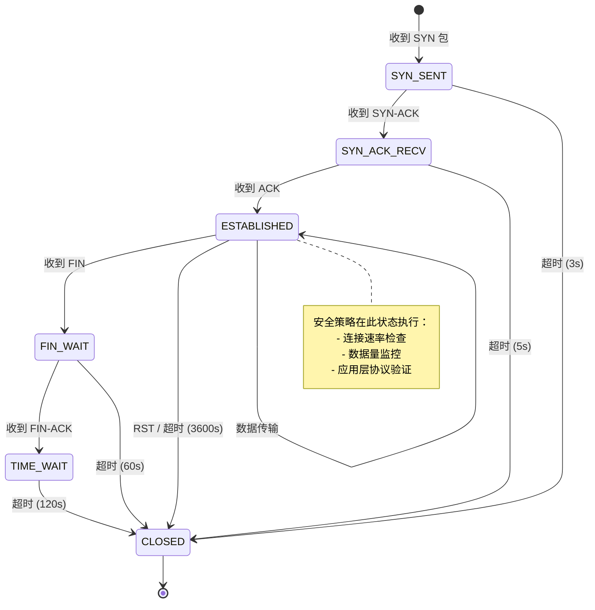

```c
// File: conntrack_ebpf.c
// eBPF 连接追踪实现
// 支持 TCP/UDP 状态机，与 XDP 防护联动

#include <linux/bpf.h>
#include <linux/if_ether.h>
#include <linux/ip.h>
#include <linux/tcp.h>
#include <bpf/bpf_helpers.h>
#include <bpf/bpf_endian.h>

// 连接状态
#define CT_STATE_NEW         0
#define CT_STATE_SYN_SENT    1
#define CT_STATE_ESTABLISHED 2
#define CT_STATE_FIN_WAIT    3
#define CT_STATE_TIME_WAIT   4
#define CT_STATE_CLOSED      5

// 连接 4 元组键
struct ct_key {
    __u32 src_ip;
    __u32 dst_ip;
    __u16 src_port;
    __u16 dst_port;
    __u8  proto;
    __u8  pad[3];
};

// 连接追踪条目
struct ct_entry {
    __u8  state;
    __u64 created_at;
    __u64 last_seen;
    __u64 packets;
    __u64 bytes;
    __u32 flags;
};

#define CT_FLAG_ASSURED    (1 << 0)
#define CT_FLAG_DYING      (1 << 1)

struct {
    __uint(type, BPF_MAP_TYPE_LRU_HASH);
    __uint(max_entries, 1 << 20);  // 1M 连接
    __type(key, struct ct_key);
    __type(value, struct ct_entry);
} conntrack_map SEC(".maps");

// 规范化连接键（确保双向流映射到同一条目）
static __always_inline void normalize_key(
    struct ct_key *key, struct ct_key *rev_key,
    __u32 src_ip, __u32 dst_ip,
    __u16 src_port, __u16 dst_port, __u8 proto)
{
    key->src_ip   = src_ip;  key->dst_ip   = dst_ip;
    key->src_port = src_port; key->dst_port = dst_port;
    key->proto    = proto;

    rev_key->src_ip   = dst_ip;  rev_key->dst_ip   = src_ip;
    rev_key->src_port = dst_port; rev_key->dst_port = src_port;
    rev_key->proto    = proto;
}

SEC("xdp")
int conntrack_xdp(struct xdp_md *ctx) {
    void *data_end = (void *)(long)ctx->data_end;
    void *data     = (void *)(long)ctx->data;

    struct ethhdr *eth = data;
    if ((void *)(eth + 1) > data_end) return XDP_PASS;
    if (bpf_ntohs(eth->h_proto) != ETH_P_IP) return XDP_PASS;

    struct iphdr *ip = (void *)(eth + 1);
    if ((void *)(ip + 1) > data_end) return XDP_PASS;
    if (ip->protocol != IPPROTO_TCP) return XDP_PASS;

    struct tcphdr *tcp = (void *)ip + (ip->ihl * 4);
    if ((void *)(tcp + 1) > data_end) return XDP_PASS;

    __u8 flags = ((__u8 *)tcp)[13];
    struct ct_key key, rev_key;
    normalize_key(&key, &rev_key,
        ip->saddr, ip->daddr,
        tcp->source, tcp->dest, IPPROTO_TCP);

    __u64 now = bpf_ktime_get_ns();

    // 查找现有连接
    struct ct_entry *entry = bpf_map_lookup_elem(&conntrack_map, &key);
    if (!entry) {
        entry = bpf_map_lookup_elem(&conntrack_map, &rev_key);
    }

    if (!entry) {
        // 新连接：仅允许 SYN 发起
        if (!(flags & 0x02)) return XDP_DROP;  // 非 SYN：丢弃
        struct ct_entry new_entry = {
            .state      = CT_STATE_SYN_SENT,
            .created_at = now,
            .last_seen  = now,
            .packets    = 1,
            .bytes      = bpf_ntohs(ip->tot_len),
        };
        bpf_map_update_elem(&conntrack_map, &key, &new_entry, BPF_ANY);
        return XDP_PASS;
    }

    // 超时检查（ESTABLISHED 连接 1 小时无活动）
    if (entry->state == CT_STATE_ESTABLISHED &&
        now - entry->last_seen > 3600ULL * 1000000000ULL) {
        entry->state = CT_STATE_CLOSED;
        bpf_map_delete_elem(&conntrack_map, &key);
        return XDP_DROP;
    }

    // 更新统计
    __sync_fetch_and_add(&entry->packets, 1);
    __sync_fetch_and_add(&entry->bytes, bpf_ntohs(ip->tot_len));
    entry->last_seen = now;

    // 状态转换
    if (flags & 0x04) {  // RST
        entry->state = CT_STATE_CLOSED;
        return XDP_PASS;
    }
    if ((flags & 0x12) == 0x12) {  // SYN-ACK
        entry->state = CT_STATE_SYN_SENT;
    }
    if ((flags & 0x10) && entry->state == CT_STATE_SYN_SENT) {
        entry->state = CT_STATE_ESTABLISHED;
        entry->flags |= CT_FLAG_ASSURED;
    }
    if (flags & 0x01) {  // FIN
        entry->state = CT_STATE_FIN_WAIT;
    }

    return XDP_PASS;
}

char LICENSE[] SEC("license") = "GPL";
```

---

<!-- chunk: 4. 容器安全 -->## 4. 容器安全

## 4.1 容器逃逸检测

## 4.1.1 容器逃逸攻击向量 (Escape Attack Vectors)

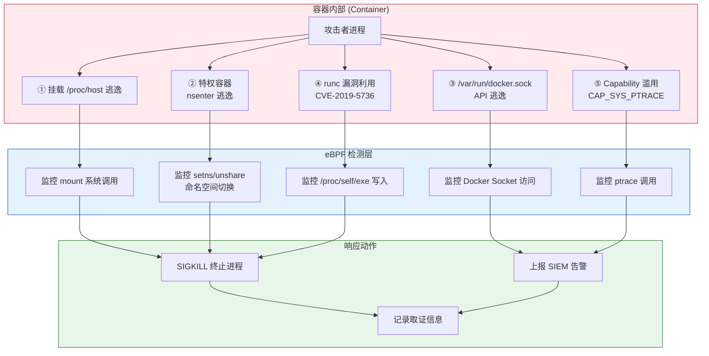

## 4.1.2 TracingPolicy：容器逃逸检测完整策略

```yaml
# File: policy-container-escape-detection.yaml
# Tetragon TracingPolicy - 容器逃逸检测
# 覆盖：namespace 逃逸、特权操作、Docker Socket 访问

apiVersion: cilium.io/v1alpha1
kind: TracingPolicy
metadata:
  name: container-escape-detection
  namespace: kube-system
  labels:
    security.kudig.io/category: "container-security"
    security.kudig.io/severity: "critical"
    security.kudig.io/compliance: "cis-kubernetes"
spec:
  kprobes:
    # ===== 逃逸向量 1：Namespace 切换检测 =====
    - call: "__x64_sys_unshare"
      syscall: true
      args:
        - index: 0
          type: "int"   # clone flags
      selectors:
        # 检测 CLONE_NEWNS (mount namespace) 切换
        - matchArgs:
            - index: 0
              operator: "Mask"
              values:
                - "131072"  # CLONE_NEWNS = 0x20000
          matchNamespaces:
            - namespace: Mnt
              operator: NotIn
              values:
                - "host"
          matchActions:
            - action: Post
            - action: Sigkill

    # ===== 逃逸向量 2：setns 切换到宿主命名空间 =====
    - call: "__x64_sys_setns"
      syscall: true
      args:
        - index: 0
          type: "int"   # fd
        - index: 1
          type: "int"   # nstype
      selectors:
        - matchActions:
            - action: Post
              rateLimit: "1/minute"
            - action: Sigkill

    # ===== 逃逸向量 3：特权挂载操作 =====
    - call: "__x64_sys_mount"
      syscall: true
      args:
        - index: 0
          type: "string"  # source
        - index: 1
          type: "string"  # target
        - index: 2
          type: "string"  # filesystemtype
      selectors:
        # 检测挂载宿主机设备
        - matchArgs:
            - index: 2
              operator: "In"
              values:
                - "ext4"
                - "xfs"
                - "btrfs"
                - "overlayfs"
          matchCapabilities:
            - type: Effective
              operator: In
              values:
                - "CAP_SYS_ADMIN"
          matchActions:
            - action: Post
            - action: Sigkill

    # ===== 逃逸向量 4：/proc/1/root 访问（宿主根目录）=====
    - call: "__x64_sys_openat"
      syscall: true
      args:
        - index: 1
          type: "string"
      selectors:
        - matchArgs:
            - index: 1
              operator: "Prefix"
              values:
                - "/proc/1/root"
                - "/proc/1/fd"
                - "/proc/1/mem"
                - "/host"
          matchActions:
            - action: Post
            - action: Sigkill

    # ===== 逃逸向量 5：Docker Socket 访问 =====
    - call: "__x64_sys_connect"
      syscall: true
      args:
        - index: 0
          type: "int"
      selectors:
        - matchArgs:
            - index: 0
              operator: "Equal"
              values:
                - "1"  # AF_UNIX
          matchActions:
            - action: Post
              rateLimit: "10/minute"
        # 检测 /var/run/docker.sock 文件描述符
    - call: "__x64_sys_openat"
      syscall: true
      args:
        - index: 1
          type: "string"
      selectors:
        - matchArgs:
            - index: 1
              operator: "In"
              values:
                - "/var/run/docker.sock"
                - "/run/docker.sock"
                - "/run/containerd/containerd.sock"
                - "/run/crio/crio.sock"
          matchActions:
            - action: Post
            - action: Sigkill

    # ===== 逃逸向量 6：capability 升级 =====
    - call: "cap_capable"
      syscall: false
      args:
        - index: 2
          type: "int"   # capability
      selectors:
        # 检测容器内请求 CAP_SYS_ADMIN / CAP_NET_ADMIN
        - matchArgs:
            - index: 2
              operator: "In"
              values:
                - "21"   # CAP_SYS_ADMIN
                - "12"   # CAP_NET_ADMIN
                - "7"    # CAP_SETUID
                - "8"    # CAP_SETGID
          matchNamespaces:
            - namespace: Pid
              operator: NotIn
              values:
                - "host"
          matchActions:
            - action: Post
              rateLimit: "5/minute"
```

## 4.2 特权升级监控

## 4.2.1 eBPF 特权升级检测程序

```c
// File: privilege_escalation_detector.c
// eBPF 特权升级检测
// 监控：setuid/setgid、capability 变更、sudo 执行

#include <linux/bpf.h>
#include <linux/ptrace.h>
#include <linux/sched.h>
#include <linux/cred.h>
#include <bpf/bpf_helpers.h>
#include <bpf/bpf_tracing.h>
#include <bpf/bpf_core_read.h>

#define TASK_COMM_LEN 16

struct privesc_event {
    __u64 timestamp;
    __u32 pid;
    __u32 ppid;
    __u32 old_uid;
    __u32 new_uid;
    __u32 old_gid;
    __u32 new_gid;
    __u64 old_caps;   // 旧 capability 集
    __u64 new_caps;   // 新 capability 集
    char  comm[TASK_COMM_LEN];
    char  event_type[32];  // setuid/setcap/sudo
    __u64 container_id;    // 容器标识
};

struct {
    __uint(type, BPF_MAP_TYPE_RINGBUF);
    __uint(max_entries, 4 * 1024 * 1024);
} privesc_events SEC(".maps");

// 追踪 commit_creds：凭证变更的核心函数
SEC("kprobe/commit_creds")
int BPF_KPROBE(trace_commit_creds, struct cred *new_cred)
{
    struct task_struct *task = (struct task_struct *)bpf_get_current_task();

    // 读取旧凭证
    const struct cred *old_cred = BPF_CORE_READ(task, cred);
    __u32 old_uid = BPF_CORE_READ(old_cred, uid.val);
    __u32 old_gid = BPF_CORE_READ(old_cred, gid.val);
    __u32 new_uid = BPF_CORE_READ(new_cred, uid.val);
    __u32 new_gid = BPF_CORE_READ(new_cred, gid.val);

    // 只关心 UID 变更（特别是变为 0 即 root）
    if (old_uid == new_uid && old_gid == new_gid) return 0;
    // 核心告警：非 root 变 root
    if (new_uid != 0 && old_uid != 0) return 0;

    struct privesc_event *evt = bpf_ringbuf_reserve(
        &privesc_events, sizeof(struct privesc_event), 0);
    if (!evt) return 0;

    evt->timestamp = bpf_ktime_get_ns();
    evt->pid       = bpf_get_current_pid_tgid() >> 32;
    evt->ppid      = BPF_CORE_READ(task, real_parent, tgid);
    evt->old_uid   = old_uid;
    evt->new_uid   = new_uid;
    evt->old_gid   = old_gid;
    evt->new_gid   = new_gid;
    bpf_get_current_comm(&evt->comm, sizeof(evt->comm));
    __builtin_memcpy(evt->event_type, "SETUID_TO_ROOT", 14);

    // 读取 capability
    __u64 old_cap = BPF_CORE_READ(old_cred, cap_effective.cap[0]);
    __u64 new_cap = BPF_CORE_READ(new_cred, cap_effective.cap[0]);
    evt->old_caps = old_cap;
    evt->new_caps = new_cap;

    bpf_ringbuf_submit(evt, 0);
    return 0;
}

// 追踪 security_capset：capability 集合变更
SEC("kprobe/security_capset")
int BPF_KPROBE(trace_security_capset,
               struct cred *new_cred,
               const struct cred *old_cred,
               const kernel_cap_t *effective,
               const kernel_cap_t *inheritable,
               const kernel_cap_t *permitted)
{
    __u32 uid = BPF_CORE_READ(new_cred, uid.val);

    struct privesc_event *evt = bpf_ringbuf_reserve(
        &privesc_events, sizeof(struct privesc_event), 0);
    if (!evt) return 0;

    evt->timestamp = bpf_ktime_get_ns();
    evt->pid       = bpf_get_current_pid_tgid() >> 32;
    evt->new_uid   = uid;
    bpf_get_current_comm(&evt->comm, sizeof(evt->comm));
    __builtin_memcpy(evt->event_type, "CAPSET_CHANGE", 13);

    bpf_ringbuf_submit(evt, 0);
    return 0;
}

char LICENSE[] SEC("license") = "GPL";
```

## 4.3 Namespace 隔离验证

## 4.3.1 Kubernetes Namespace 安全策略

```yaml
# File: policy-namespace-isolation-verify.yaml
# Tetragon + Cilium 联合策略
# 验证容器命名空间隔离完整性

apiVersion: cilium.io/v1alpha1
kind: TracingPolicy
metadata:
  name: namespace-isolation-verification
  namespace: kube-system
spec:
  # 监控 PID namespace 中的特殊操作
  kprobes:
    # 1. 检测 PID 1 信号（init 进程攻击）
    - call: "__x64_sys_kill"
      syscall: true
      args:
        - index: 0
          type: "int"   # pid
        - index: 1
          type: "int"   # signal
      selectors:
        - matchArgs:
            - index: 0
              operator: "Equal"
              values:
                - "1"     # PID 1 (init/systemd)
          matchActions:
            - action: Post
            - action: Sigkill

    # 2. 检测 /proc 文件系统挂载（命名空间逃逸前兆）
    - call: "__x64_sys_mount"
      syscall: true
      args:
        - index: 2
          type: "string"
      selectors:
        - matchArgs:
            - index: 2
              operator: "Equal"
              values:
                - "proc"
                - "sysfs"
                - "devtmpfs"
          matchActions:
            - action: Post
            - action: Sigkill

---
# Cilium NetworkPolicy - 命名空间网络隔离
apiVersion: "cilium.io/v2"
kind: CiliumNetworkPolicy
metadata:
  name: namespace-network-isolation
  namespace: production
spec:
  endpointSelector:
    matchLabels:
      app.kubernetes.io/part-of: "production"
  # 仅允许同命名空间内通信
  ingress:
    - fromEndpoints:
        - matchLabels:
            k8s:io.kubernetes.pod.namespace: production
  # 允许出站到指定服务
  egress:
    - toEndpoints:
        - matchLabels:
            k8s:io.kubernetes.pod.namespace: kube-system
      toPorts:
        - ports:
            - port: "53"
              protocol: UDP
    - toEndpoints:
        - matchLabels:
            k8s:io.kubernetes.pod.namespace: production
    # 不允许直连宿主机 IP 段
    - toCIDRSet:
        - cidr: "0.0.0.0/0"
          except:
            - "169.254.0.0/16"
            - "10.0.0.0/8"
```

---

<!-- chunk: 5. 零信任网络安全 -->## 5. 零信任网络安全

## 5.1 零信任架构 (Zero Trust Architecture)

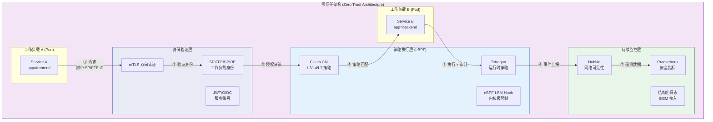

## 5.2 Cilium 零信任策略实现

```yaml
# File: zero-trust-cilium-policy.yaml
# Cilium 零信任网络策略 - 基于 SPIFFE 身份的微隔离

apiVersion: "cilium.io/v2"
kind: CiliumNetworkPolicy
metadata:
  name: zero-trust-microservice-policy
  namespace: production
  annotations:
    security.kudig.io/zero-trust: "enabled"
    security.kudig.io/last-reviewed: "2026-03-04"
spec:
  # 作用范围：所有 production 命名空间 Pod
  endpointSelector: {}

  ingress:
    # 规则 1：frontend 只能接受来自 ingress 的流量
    - fromEndpoints:
        - matchLabels:
            app: ingress-nginx
            k8s:io.kubernetes.pod.namespace: ingress-nginx
      toPorts:
        - ports:
            - port: "8080"
              protocol: TCP
          rules:
            http:
              - method: "GET"
                path: "/api/v1/.*"
              - method: "POST"
                path: "/api/v1/.*"

    # 规则 2：backend 只接受 frontend 的连接（mTLS 强制）
    - fromEndpoints:
        - matchLabels:
            app: frontend
      toPorts:
        - ports:
            - port: "9090"
              protocol: TCP
          rules:
            http:
              - method: "GET"
              - method: "POST"
              - method: "PUT"

    # 规则 3：数据库只接受 backend 的连接
    - fromEndpoints:
        - matchLabels:
            app: backend
      toPorts:
        - ports:
            - port: "5432"
              protocol: TCP

  egress:
    # 仅允许访问必要的外部服务
    - toEndpoints:
        - matchLabels:
            k8s:io.kubernetes.pod.namespace: kube-system
      toPorts:
        - ports:
            - port: "53"
              protocol: UDP

    # 允许访问内部服务注册中心
    - toEndpoints:
        - matchLabels:
            app: consul
            k8s:io.kubernetes.pod.namespace: service-mesh
      toPorts:
        - ports:
            - port: "8500"
              protocol: TCP

---
# Cilium mTLS 策略（与 SPIFFE 集成）
apiVersion: "cilium.io/v2"
kind: CiliumClusterwideNetworkPolicy
metadata:
  name: enforce-mtls-production
spec:
  endpointSelector:
    matchLabels:
      security.istio.io/tlsMode: "istio"
  ingress:
    - fromEndpoints:
        - matchLabels:
            security.istio.io/tlsMode: "istio"
```

## 5.3 eBPF 零信任执行点 (Zero Trust Enforcement Points)

```c
// File: zero_trust_enforcer.c
// eBPF TC（流量控制）程序 - 零信任策略执行
// 在 TC ingress/egress 点执行身份验证和授权

#include <linux/bpf.h>
#include <linux/pkt_cls.h>
#include <linux/if_ether.h>
#include <linux/ip.h>
#include <linux/tcp.h>
#include <bpf/bpf_helpers.h>
#include <bpf/bpf_endian.h>

// SPIFFE Trust Bundle（简化版，实际使用 X.509 TLS 验证）
struct identity {
    __u32 ip;
    __u32 namespace_id;
    __u32 service_id;
    __u8  trust_level;   // 0=untrusted, 1=internal, 2=privileged
};

// 零信任策略条目
struct zt_policy {
    __u32 src_service;
    __u32 dst_service;
    __u16 dst_port;
    __u8  allowed;
    __u8  require_mtls;
};

// 工作负载身份 Map（由 Cilium Agent 维护）
struct {
    __uint(type, BPF_MAP_TYPE_LRU_HASH);
    __uint(max_entries, 65536);
    __type(key, __u32);              // IP
    __type(value, struct identity);
} identity_map SEC(".maps");

// 策略 Map（二维键：src_service + dst_service + port）
struct {
    __uint(type, BPF_MAP_TYPE_LRU_HASH);
    __uint(max_entries, 65536);
    __type(key, struct zt_policy);   // 使用前3字段作为键
    __type(value, __u8);             // 是否允许
} policy_map SEC(".maps");

// 审计事件
struct zt_audit_event {
    __u64 timestamp;
    __u32 src_ip;
    __u32 dst_ip;
    __u16 dst_port;
    __u32 src_service;
    __u32 dst_service;
    __u8  decision;   // 0=deny, 1=allow
    __u8  reason;     // 1=no_identity, 2=no_policy, 3=policy_deny
};

struct {
    __uint(type, BPF_MAP_TYPE_RINGBUF);
    __uint(max_entries, 4 * 1024 * 1024);
} audit_events SEC(".maps");

SEC("tc")
int zero_trust_tc_ingress(struct __sk_buff *skb) {
    void *data_end = (void *)(long)skb->data_end;
    void *data     = (void *)(long)skb->data;

    struct ethhdr *eth = data;
    if ((void *)(eth + 1) > data_end) return TC_ACT_OK;
    if (bpf_ntohs(eth->h_proto) != ETH_P_IP) return TC_ACT_OK;

    struct iphdr *ip = (void *)(eth + 1);
    if ((void *)(ip + 1) > data_end) return TC_ACT_OK;
    if (ip->protocol != IPPROTO_TCP) return TC_ACT_OK;

    struct tcphdr *tcp = (void *)ip + (ip->ihl * 4);
    if ((void *)(tcp + 1) > data_end) return TC_ACT_OK;

    __u32 src_ip  = ip->saddr;
    __u32 dst_ip  = ip->daddr;
    __u16 dst_port = bpf_ntohs(tcp->dest);

    // 查找源端身份
    struct identity *src_id = bpf_map_lookup_elem(&identity_map, &src_ip);
    if (!src_id) {
        // 无法识别身份：默认拒绝（零信任原则）
        struct zt_audit_event *evt = bpf_ringbuf_reserve(
            &audit_events, sizeof(*evt), 0);
        if (evt) {
            evt->timestamp  = bpf_ktime_get_ns();
            evt->src_ip     = src_ip;
            evt->dst_ip     = dst_ip;
            evt->dst_port   = dst_port;
            evt->decision   = 0;
            evt->reason     = 1;  // no_identity
            bpf_ringbuf_submit(evt, 0);
        }
        return TC_ACT_SHOT;  // 丢弃
    }

    // 查找目标身份
    struct identity *dst_id = bpf_map_lookup_elem(&identity_map, &dst_ip);
    if (!dst_id) return TC_ACT_SHOT;

    // 检查策略
    struct zt_policy policy_key = {
        .src_service = src_id->service_id,
        .dst_service = dst_id->service_id,
        .dst_port    = dst_port,
    };
    __u8 *allowed = bpf_map_lookup_elem(&policy_map, &policy_key);
    if (!allowed || !*allowed) {
        return TC_ACT_SHOT;  // 策略拒绝
    }

    return TC_ACT_OK;  // 策略允许
}

char LICENSE[] SEC("license") = "GPL";
```

---

<!-- chunk: 6. 合规与审计 -->## 6. 合规与审计

## 6.1 系统调用审计

## 6.1.1 合规框架映射 (Compliance Framework Mapping)

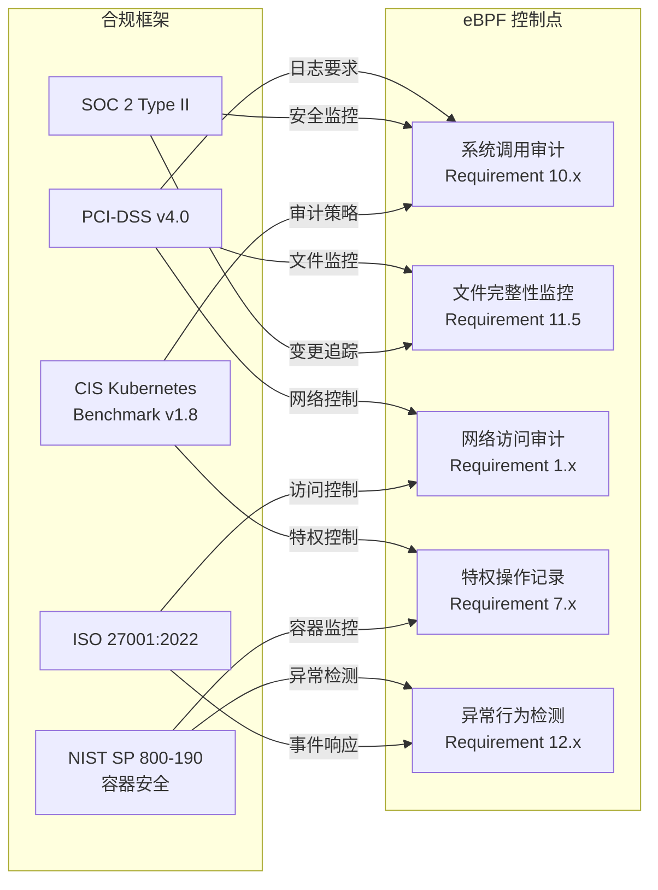

## 6.1.2 系统调用审计 eBPF 程序

```c
// File: syscall_auditor.c
// eBPF 系统调用审计程序
// PCI-DSS/SOC2 合规：记录所有敏感系统调用

#include <linux/bpf.h>
#include <linux/ptrace.h>
#include <bpf/bpf_helpers.h>
#include <bpf/bpf_tracing.h>
#include <bpf/bpf_core_read.h>

#define TASK_COMM_LEN  16
#define MAX_FILENAME   128

// 审计事件类型
#define AUDIT_EXEC     1
#define AUDIT_OPEN     2
#define AUDIT_SOCKET   3
#define AUDIT_SETUID   4
#define AUDIT_PTRACE   5
#define AUDIT_MMAP     6
#define AUDIT_MODULE   7  // 内核模块加载
#define AUDIT_DELETE   8  // 文件删除

struct audit_record {
    __u64 timestamp;
    __u32 pid;
    __u32 ppid;
    __u32 uid;
    __u32 gid;
    __u32 sessionid;
    __u64 container_id;
    char  comm[TASK_COMM_LEN];
    __u8  audit_type;
    __u8  success;
    __s32 return_val;
    // 附加字段（根据 audit_type 使用不同字段）
    union {
        struct {
            char filename[MAX_FILENAME];
            __u32 flags;
            __u32 mode;
        } file_info;
        struct {
            __u32 family;
            __u32 type;
            __u32 protocol;
        } socket_info;
        struct {
            __u32 target_pid;
            __u32 request;
        } ptrace_info;
        struct {
            char name[MAX_FILENAME];
        } module_info;
    };
};

struct {
    __uint(type, BPF_MAP_TYPE_RINGBUF);
    __uint(max_entries, 32 * 1024 * 1024);  // 32MB 审计缓冲
} audit_rb SEC(".maps");

// 过滤规则（只审计特定 UID 或容器）
struct audit_filter {
    __u32 min_uid;    // 0 = 所有用户
    __u8  container_only;  // 只审计容器内
    __u8  privileged_only; // 只审计特权操作
};

struct {
    __uint(type, BPF_MAP_TYPE_ARRAY);
    __uint(max_entries, 1);
    __type(key, __u32);
    __type(value, struct audit_filter);
} filter_config SEC(".maps");

// 通用审计记录填充
static __always_inline struct audit_record *
begin_audit_record(__u8 audit_type) {
    struct audit_record *rec = bpf_ringbuf_reserve(
        &audit_rb, sizeof(struct audit_record), 0);
    if (!rec) return NULL;

    struct task_struct *task = (struct task_struct *)bpf_get_current_task();
    __u64 pid_tgid = bpf_get_current_pid_tgid();

    rec->timestamp    = bpf_ktime_get_ns();
    rec->pid          = pid_tgid >> 32;
    rec->uid          = bpf_get_current_uid_gid() & 0xFFFFFFFF;
    rec->gid          = bpf_get_current_uid_gid() >> 32;
    rec->ppid         = BPF_CORE_READ(task, real_parent, tgid);
    rec->audit_type   = audit_type;
    bpf_get_current_comm(&rec->comm, sizeof(rec->comm));
    return rec;
}

// 审计 openat（文件访问）
SEC("tracepoint/syscalls/sys_enter_openat")
int audit_openat(struct trace_event_raw_sys_enter *ctx) {
    struct audit_record *rec = begin_audit_record(AUDIT_OPEN);
    if (!rec) return 0;

    const char __user *filename =
        (const char __user *)ctx->args[1];
    bpf_probe_read_user_str(rec->file_info.filename,
                            MAX_FILENAME, filename);
    rec->file_info.flags = (__u32)ctx->args[2];
    rec->file_info.mode  = (__u32)ctx->args[3];

    bpf_ringbuf_submit(rec, 0);
    return 0;
}

// 审计 socket（网络连接创建）
SEC("tracepoint/syscalls/sys_enter_socket")
int audit_socket(struct trace_event_raw_sys_enter *ctx) {
    struct audit_record *rec = begin_audit_record(AUDIT_SOCKET);
    if (!rec) return 0;

    rec->socket_info.family   = (__u32)ctx->args[0];
    rec->socket_info.type     = (__u32)ctx->args[1];
    rec->socket_info.protocol = (__u32)ctx->args[2];

    bpf_ringbuf_submit(rec, 0);
    return 0;
}

// 审计 init_module / finit_module（内核模块加载 - 高危）
SEC("tracepoint/syscalls/sys_enter_finit_module")
int audit_module_load(struct trace_event_raw_sys_enter *ctx) {
    struct audit_record *rec = begin_audit_record(AUDIT_MODULE);
    if (!rec) return 0;

    // 内核模块加载：直接告警
    bpf_ringbuf_submit(rec, 0);
    return 0;
}

// 审计 ptrace（调试/注入检测）
SEC("tracepoint/syscalls/sys_enter_ptrace")
int audit_ptrace(struct trace_event_raw_sys_enter *ctx) {
    struct audit_record *rec = begin_audit_record(AUDIT_PTRACE);
    if (!rec) return 0;

    rec->ptrace_info.request   = (__u32)ctx->args[0];
    rec->ptrace_info.target_pid = (__u32)ctx->args[1];

    bpf_ringbuf_submit(rec, 0);
    return 0;
}

char LICENSE[] SEC("license") = "GPL";
```

## 6.1.3 合规审计 TracingPolicy（PCI-DSS/SOC2）

```yaml
# File: policy-compliance-audit.yaml
# Tetragon TracingPolicy - 合规审计策略
# PCI-DSS v4.0 Requirement 10 & 11

apiVersion: cilium.io/v1alpha1
kind: TracingPolicy
metadata:
  name: compliance-audit-pci-soc2
  namespace: kube-system
  labels:
    security.kudig.io/compliance: "pci-dss,soc2,iso27001"
    security.kudig.io/category: "audit"
spec:
  kprobes:
    # PCI-DSS 10.2.1 - 用户访问审计
    - call: "__x64_sys_setuid"
      syscall: true
      args:
        - index: 0
          type: "int"
      selectors:
        - matchActions:
            - action: Post

    # PCI-DSS 10.2.2 - 根用户操作
    - call: "security_bprm_check"
      syscall: false
      args:
        - index: 0
          type: "linux_binprm"
      selectors:
        - matchCapabilities:
            - type: Effective
              operator: In
              values:
                - "CAP_SYS_ADMIN"
          matchActions:
            - action: Post

    # PCI-DSS 10.2.4 - 非法访问尝试
    - call: "security_inode_permission"
      syscall: false
      args:
        - index: 0
          type: "inode"
        - index: 1
          type: "int"   # mask (MAY_READ/MAY_WRITE/MAY_EXEC)
      selectors:
        - matchReturnArgs:
            - index: 0
              operator: "Equal"
              values:
                - "-13"  # -EACCES
          matchActions:
            - action: Post
              rateLimit: "100/minute"

    # PCI-DSS 11.5 - 关键文件变更检测
    - call: "vfs_write"
      syscall: false
      args:
        - index: 0
          type: "file"
      selectors:
        - matchArgs:
            - index: 0
              operator: "Prefix"
              values:
                - "/etc/"
                - "/var/www/"
                - "/opt/app/"
          matchActions:
            - action: Post

    # SOC2 CC6.8 - 恶意软件防护（可执行写入）
    - call: "security_inode_create"
      syscall: false
      args:
        - index: 1
          type: "string"
      selectors:
        - matchActions:
            - action: Post
              rateLimit: "50/minute"
```

## 6.2 网络访问审计

## 6.2.1 Hubble 网络审计配置

```yaml
# File: hubble-audit-config.yaml
# Hubble 网络流量审计配置
# 集成 SIEM 系统

apiVersion: v1
kind: ConfigMap
metadata:
  name: hubble-audit-config
  namespace: kube-system
data:
  # Hubble 流量记录过滤规则
  flow-filter.yaml: |
    # 记录所有 Dropped 流量（安全审计必须）
    - verdict: DROPPED
      output: json
      destination: siem

    # 记录跨命名空间流量
    - source-namespace: "!kube-system"
      destination-namespace: "!kube-system"
      output: json
      sample-rate: 0.1  # 采样 10% 正常流量

    # 记录所有 L7 HTTP 4xx/5xx（异常请求）
    - http-status-code: "4[0-9][0-9]|5[0-9][0-9]"
      output: json
      destination: siem

    # 记录 DNS 查询（C2 检测）
    - protocol: DNS
      output: json
      destination: threat-hunting

---
# Hubble Export 到 Elasticsearch
apiVersion: v1
kind: ConfigMap
metadata:
  name: hubble-export-config
  namespace: kube-system
data:
  fileConfig.yaml: |
    path: /var/log/hubble/flows.log
    fieldMask:
      - time
      - verdict
      - drop_reason
      - ethernet
      - IP
      - l4
      - source
      - destination
      - Type
      - node_name
      - event_type
      - traffic_direction
```

---

<!-- chunk: 7. 威胁狩猎与响应 -->## 7. 威胁狩猎与响应

## 7.1 威胁狩猎框架 (Threat Hunting Framework)

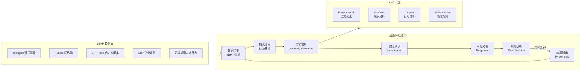

## 7.2 BPFTrace 威胁狩猎脚本

```bash
#!/usr/bin/env bpftrace
# File: threat_hunt_lateral_movement.bt
# 威胁狩猎脚本：检测横向移动行为
# 场景：内部 SSH/RDP 扫描、Kerberoasting、SMB 传播

// 1. 检测 SSH 连接尝试频率（内部横向移动）
kprobe:tcp_connect
/comm != "sshd" && comm != "ssh-agent"/
{
    @ssh_attempts[comm, pid] = count();
}

// SSH 连接统计（每 10 秒输出）
interval:s:10
{
    print(@ssh_attempts);
    clear(@ssh_attempts);
}

// 2. 检测异常 DNS 查询（数据外渗 / C2 信道）
kprobe:getaddrinfo
{
    @dns_queries[comm, pid] = count();
    if (@dns_queries[comm, pid] > 100) {
        printf("[ALERT] DNS Flood: comm=%s pid=%d count=%d\n",
               comm, pid, @dns_queries[comm, pid]);
    }
}

// 3. 检测 /etc/hosts 修改（DNS 劫持）
kprobe:vfs_write
/str(arg0->f_path.dentry->d_name.name) == "hosts"/
{
    printf("[ALERT] /etc/hosts modified: pid=%d comm=%s\n", pid, comm);
}

// 4. 检测大量文件加密（勒索软件特征）
kprobe:vfs_write
{
    @write_count[pid] = count();
    if (@write_count[pid] > 1000) {
        printf("[ALERT] Possible ransomware: pid=%d comm=%s writes=%d\n",
               pid, comm, @write_count[pid]);
    }
}

// 5. 检测内存中执行（无文件攻击）
kprobe:__x64_sys_memfd_create
{
    printf("[ALERT] memfd_create (fileless attack): pid=%d comm=%s name=%s\n",
           pid, comm, str(arg0));
}

// 6. 检测反射 DLL 注入特征（Linux 等效）
kprobe:__x64_sys_mmap
/(arg2 & 4) && (arg2 & 2) && (arg3 & 0x20)/
{
    printf("[ALERT] RWX mmap (possible shellcode): pid=%d comm=%s addr=0x%lx\n",
           pid, comm, arg0);
}
```

## 7.3 自动化威胁响应 (Automated Threat Response)

```yaml
# File: threat-response-playbook.yaml
# Tetragon TracingPolicy - 自动威胁响应剧本
# 响应：勒索软件、挖矿、后门安装

apiVersion: cilium.io/v1alpha1
kind: TracingPolicy
metadata:
  name: automated-threat-response
  namespace: kube-system
spec:
  kprobes:
    # === 响应 1：挖矿软件检测与阻断 ===
    - call: "security_bprm_check"
      syscall: false
      args:
        - index: 0
          type: "linux_binprm"
      selectors:
        # 已知挖矿软件二进制名
        - matchBinaries:
            - operator: "In"
              values:
                - "/tmp/xmrig"
                - "/tmp/minerd"
                - "/tmp/kdevtmpfsi"
                - "/var/tmp/kinsing"
                - "/dev/shm/kdevtmpfsi"
          matchActions:
            - action: Sigkill
            - action: Post

        # 挖矿软件特征：连接矿池端口
    - call: "__x64_sys_connect"
      syscall: true
      args:
        - index: 1
          type: "sockaddr"
      selectors:
        # 常见矿池端口（3333/4444/5555/7777/14444）
        - matchActions:
            - action: Post
              rateLimit: "1/minute"

    # === 响应 2：Crontab 后门植入 ===
    - call: "vfs_write"
      syscall: false
      args:
        - index: 0
          type: "file"
      selectors:
        - matchArgs:
            - index: 0
              operator: "Prefix"
              values:
                - "/var/spool/cron"
                - "/etc/cron.d/"
          matchActions:
            - action: Post
            - action: Sigkill

    # === 响应 3：Web Shell 检测 ===
    - call: "security_bprm_check"
      syscall: false
      args:
        - index: 0
          type: "linux_binprm"
      selectors:
        # Web 进程（nginx/apache）生成 shell 子进程
        - matchBinaries:
            - operator: "In"
              values:
                - "/bin/sh"
                - "/bin/bash"
                - "/bin/dash"
          matchActions:
            - action: Post
            - action: Sigkill

    # === 响应 4：勒索软件加密行为 ===
    - call: "vfs_rename"
      syscall: false
      args:
        - index: 2
          type: "string"
      selectors:
        # 检测加密扩展名
        - matchArgs:
            - index: 2
              operator: "Postfix"
              values:
                - ".encrypted"
                - ".locked"
                - ".ransomed"
                - ".cry"
          matchActions:
            - action: Sigkill
            - action: Post
```

---

<!-- chunk: 8. 与 SIEM/SOAR 集成 -->## 8. 与 SIEM/SOAR 集成

## 8.1 集成架构 (SIEM/SOAR Integration Architecture)

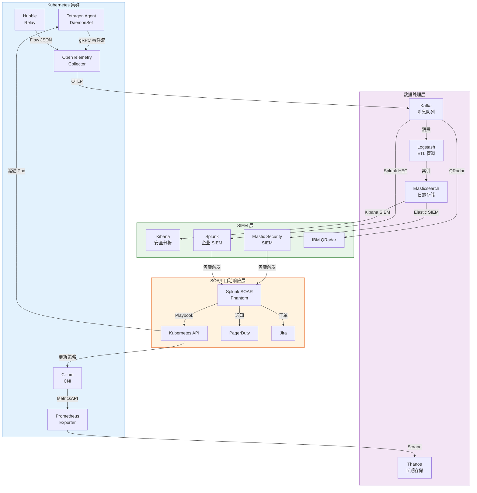

## 8.2 OpenTelemetry 集成配置

```yaml
# File: otel-collector-ebpf-config.yaml
# OpenTelemetry Collector 配置
# 接收 Tetragon gRPC 事件，转发到 SIEM

apiVersion: v1
kind: ConfigMap
metadata:
  name: otel-collector-config
  namespace: monitoring
data:
  otel-collector-config.yaml: |
    receivers:
      # 接收 Tetragon 事件（gRPC）
      otlp:
        protocols:
          grpc:
            endpoint: 0.0.0.0:4317
          http:
            endpoint: 0.0.0.0:4318

      # 接收 Hubble 流量日志
      filelog:
        include:
          - /var/log/hubble/flows.log
        operators:
          - type: json_parser
            timestamp:
              parse_from: attributes.time
              layout: '%Y-%m-%dT%H:%M:%S.%fZ'

      # Prometheus 指标接收
      prometheus:
        config:
          scrape_configs:
            - job_name: 'tetragon'
              static_configs:
                - targets: ['tetragon:2112']
            - job_name: 'cilium'
              static_configs:
                - targets: ['cilium-agent:9962']

    processors:
      # 丰富安全事件元数据
      resource:
        attributes:
          - key: environment
            value: production
            action: upsert
          - key: cluster.name
            from_attribute: k8s.cluster.name
            action: upsert

      # 批量处理（提高吞吐）
      batch:
        send_batch_size: 1000
        timeout: 5s

      # 安全事件过滤（只转发高置信度告警到 SOAR）
      filter:
        logs:
          include:
            match_type: regexp
            record_attributes:
              - key: alert_type
                value: "(SYN_FLOOD|PORT_SCAN|CONTAINER_ESCAPE|PRIVILEGE_ESC)"

      # 数据脱敏（GDPR 合规）
      redaction:
        allow_all_keys: true
        blocked_values:
          - "[0-9]{16}"

    exporters:
      # 导出到 Elasticsearch SIEM
      elasticsearch:
        endpoint: https://elasticsearch:9200
        index: ebpf-security-events
        auth:
          authenticator: basicauth/elastic
        tls:
          ca_file: /etc/ssl/certs/ca.crt

      # 导出到 Kafka（高吞吐场景）
      kafka:
        brokers:
          - kafka-broker-1:9092
          - kafka-broker-2:9092
        topic: ebpf-security-events
        encoding: json
        auth:
          sasl:
            mechanism: SCRAM-SHA-512
            username: otel-producer
            password: ${KAFKA_PASSWORD}

      # 高告警级别：直接推送 SOAR
      otlphttp/soar:
        endpoint: https://splunk-soar:8443/api/events
        headers:
          Authorization: Bearer ${SOAR_TOKEN}

    service:
      pipelines:
        # 安全事件管道（高优先级）
        logs/security:
          receivers:  [otlp, filelog]
          processors: [resource, batch, filter, redaction]
          exporters:  [elasticsearch, kafka]

        # 高置信度告警：直接触发 SOAR
        logs/high-alert:
          receivers:  [otlp]
          processors: [resource, filter]
          exporters:  [otlphttp/soar]

        # 指标管道
        metrics:
          receivers:  [prometheus]
          processors: [batch]
          exporters:  [elasticsearch]

## 8.3 Splunk SIEM 集成

```yaml
# File: splunk-hec-integration.yaml
# Splunk HEC (HTTP Event Collector) 集成
# 将 Tetragon/Hubble 事件实时推送到 Splunk

apiVersion: v1
kind: ConfigMap
metadata:
  name: fluent-bit-splunk-config
  namespace: logging
data:
  fluent-bit.conf: |
    [SERVICE]
        Flush         5
        Log_Level     info
        Parsers_File  parsers.conf

    # 读取 Tetragon 事件日志
    [INPUT]
        Name              tail
        Path              /var/log/tetragon/tetragon.log
        Tag               tetragon.*
        Parser            json
        Refresh_Interval  5
        Mem_Buf_Limit     50MB
        Skip_Long_Lines   On

    # 读取 Hubble 网络流日志
    [INPUT]
        Name              tail
        Path              /var/log/hubble/flows.log
        Tag               hubble.*
        Parser            json
        Refresh_Interval  5

    # 读取 XDP 安全事件
    [INPUT]
        Name              tail
        Path              /var/log/ebpf-ids/alerts.log
        Tag               ids.*
        Parser            json

    # 为 Tetragon 事件添加元数据
    [FILTER]
        Name         record_modifier
        Match        tetragon.*
        Record       source_type tetragon
        Record       cluster_name ${CLUSTER_NAME}
        Record       environment production

    # 丰富 Hubble 流量事件
    [FILTER]
        Name         record_modifier
        Match        hubble.*
        Record       source_type hubble
        Record       data_type network_flow

    # 安全事件严重性分类
    [FILTER]
        Name         lua
        Match        tetragon.*
        script       /etc/fluent-bit/severity_enrichment.lua
        call         enrich_severity

    # 推送到 Splunk HEC
    [OUTPUT]
        Name         splunk
        Match        *
        Host         splunk-hec.security.svc.cluster.local
        Port         8088
        Splunk_Token ${SPLUNK_HEC_TOKEN}
        TLS          On
        TLS.Verify   On
        Splunk_Send_Raw On
        Retry_Limit  5

  # Lua 脚本：安全事件严重性分级
  severity_enrichment.lua: |
    function enrich_severity(tag, timestamp, record)
        local alert_type = record["alert_type"]
        local severity = "INFO"

        if alert_type == "CONTAINER_ESCAPE" or
           alert_type == "PRIVILEGE_ESCALATION" then
            severity = "CRITICAL"
        elseif alert_type == "SYN_FLOOD" or
               alert_type == "PORT_SCAN" then
            severity = "HIGH"
        elseif alert_type == "FILE_INTEGRITY" or
               alert_type == "SETUID" then
            severity = "MEDIUM"
        end

        record["severity"] = severity
        record["splunk_index"] = "ebpf_security"
        return 1, timestamp, record
    end
```

## 8.4 SOAR 自动响应 Playbook

```python
# File: soar_playbook_container_escape.py
# Splunk SOAR (Phantom) Playbook
# 响应：容器逃逸告警自动处置流程

import phantom.rules as phantom
import phantom.app as app
from phantom.action_result import ActionResult
import json

def on_start(container):
    """触发条件：Tetragon 上报容器逃逸告警"""
    phantom.debug("Container Escape Playbook Started")
    phantom.debug(f"Container: {container}")

    # 提取告警信息
    alert_data = container.get('data', [{}])[0]
    namespace  = alert_data.get('namespace', 'unknown')
    pod_name   = alert_data.get('pod_name', 'unknown')
    node_name  = alert_data.get('node_name', 'unknown')
    src_ip     = alert_data.get('src_ip', 'unknown')

    phantom.debug(f"Escaped Pod: {namespace}/{pod_name} on {node_name}")

    # 步骤 1：立即隔离受影响 Pod
    isolate_pod(container, namespace, pod_name)

    # 步骤 2：收集取证快照
    collect_forensics(container, namespace, pod_name, node_name)

    # 步骤 3：封锁源 IP
    block_ip(container, src_ip)

    # 步骤 4：通知安全团队
    notify_security_team(container, alert_data)


def isolate_pod(container, namespace, pod_name):
    """隔离受感染的 Pod：打上隔离标签，触发网络策略"""
    parameters = [{
        'namespace': namespace,
        'pod_name':  pod_name,
        'label':     'security.kudig.io/quarantine=true',
        'action':    'label'
    }]

    phantom.act(
        action="execute program",
        parameters=parameters,
        assets=["kubernetes-api"],
        callback=quarantine_callback,
        name="isolate_compromised_pod"
    )

    phantom.debug(f"Pod {namespace}/{pod_name} isolation initiated")


def collect_forensics(container, namespace, pod_name, node_name):
    """收集取证数据：进程列表、网络连接、文件系统快照"""
    commands = [
        f"kubectl exec -n {namespace} {pod_name} -- ps auxf 2>/dev/null",
        f"kubectl exec -n {namespace} {pod_name} -- ss -tulpn 2>/dev/null",
        f"kubectl exec -n {namespace} {pod_name} -- find /tmp /var/tmp -newer /etc/passwd 2>/dev/null",
    ]

    for cmd in commands:
        parameters = [{'command': cmd, 'timeout': 30}]
        phantom.act(
            action="execute program",
            parameters=parameters,
            assets=["forensics-server"],
            name=f"forensic_{cmd[:20].replace(' ','_')}"
        )


def block_ip(container, src_ip):
    """封锁攻击者 IP：更新 eBPF 封锁 Map + 防火墙"""
    if src_ip == 'unknown':
        return

    parameters = [{
        'ip': src_ip,
        'duration': '3600',  # 封锁 1 小时
        'comment': f'Container escape attempt - SOAR auto-block'
    }]

    phantom.act(
        action="block ip",
        parameters=parameters,
        assets=["firewall", "ebpf-ids"],
        name="block_attacker_ip"
    )


def notify_security_team(container, alert_data):
    """通知安全团队：PagerDuty + Slack + Jira 工单"""
    severity = alert_data.get('severity', 'HIGH')
    pod_name = alert_data.get('pod_name', 'unknown')

    # PagerDuty 告警
    pagerduty_params = [{
        'title':    f'[CRITICAL] Container Escape Detected: {pod_name}',
        'severity': severity.lower(),
        'body':     json.dumps(alert_data, indent=2),
        'source':   'eBPF-Tetragon'
    }]
    phantom.act(
        action="create alert",
        parameters=pagerduty_params,
        assets=["pagerduty"],
        name="page_security_oncall"
    )

    # Jira 工单
    jira_params = [{
        'project':  'SEC',
        'type':     'Incident',
        'summary':  f'Container Escape: {pod_name}',
        'priority': 'Critical',
        'description': json.dumps(alert_data, indent=2)
    }]
    phantom.act(
        action="create ticket",
        parameters=jira_params,
        assets=["jira"],
        name="create_incident_ticket"
    )


def quarantine_callback(action, success, container, results, handle):
    """隔离完成后：更新 Cilium 网络策略阻断所有出入流量"""
    if not success:
        phantom.debug("Pod isolation failed, manual intervention required!")
        return

    namespace = results[0].get('namespace')
    pod_name  = results[0].get('pod_name')

    # 应用隔离网络策略
    quarantine_policy = {
        "apiVersion": "cilium.io/v2",
        "kind": "CiliumNetworkPolicy",
        "metadata": {
            "name": f"quarantine-{pod_name}",
            "namespace": namespace
        },
        "spec": {
            "endpointSelector": {
                "matchLabels": {
                    "app": pod_name,
                    "security.kudig.io/quarantine": "true"
                }
            },
            "ingress": [],  # 拒绝所有入站
            "egress": []    # 拒绝所有出站
        }
    }

    phantom.debug(f"Applying quarantine network policy for {pod_name}")
    # 通过 Kubernetes API 应用策略
    parameters = [{
        'resource_type': 'CiliumNetworkPolicy',
        'body': json.dumps(quarantine_policy),
        'namespace': namespace
    }]
    phantom.act(
        action="create resource",
        parameters=parameters,
        assets=["kubernetes-api"],
        name="apply_quarantine_network_policy"
    )
```

---

<!-- chunk: 9. 安全运营中心 (SOC) 集成 -->## 9. 安全运营中心 (SOC) 集成

## 9.1 SOC 运营架构 (SOC Operations Architecture)

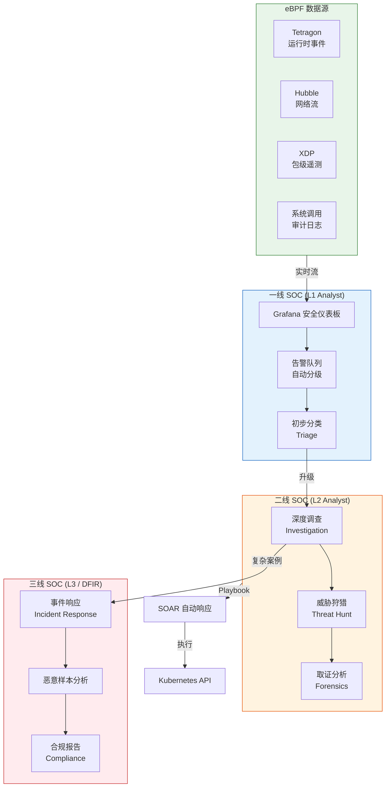

## 9.2 Grafana 安全仪表板配置

```yaml
# File: grafana-security-dashboard.yaml
# Grafana 安全运营仪表板
# 展示：实时告警、DDoS 防护状态、容器安全指标

apiVersion: v1
kind: ConfigMap
metadata:
  name: grafana-security-dashboard
  namespace: monitoring
  labels:
    grafana_dashboard: "1"
data:
  ebpf-security-dashboard.json: |
    {
      "title": "eBPF 安全运营中心 (SOC)",
      "uid": "ebpf-soc-2026",
      "tags": ["security", "ebpf", "soc"],
      "refresh": "10s",
      "panels": [
        {
          "id": 1,
          "title": "🚨 实时安全告警 (Real-time Security Alerts)",
          "type": "stat",
          "gridPos": {"h": 4, "w": 6, "x": 0, "y": 0},
          "targets": [{
            "expr": "sum(increase(tetragon_policy_events_total{action=\"Sigkill\"}[5m]))",
            "legendFormat": "已阻断威胁"
          }],
          "options": {
            "colorMode": "background",
            "thresholds": {
              "steps": [
                {"color": "green", "value": 0},
                {"color": "yellow", "value": 10},
                {"color": "red", "value": 100}
              ]
            }
          }
        },
        {
          "id": 2,
          "title": "🛡️ XDP DDoS 防护统计",
          "type": "timeseries",
          "gridPos": {"h": 8, "w": 12, "x": 6, "y": 0},
          "targets": [
            {
              "expr": "rate(xdp_packets_dropped_total[1m])",
              "legendFormat": "丢弃包速率 (pps)"
            },
            {
              "expr": "rate(xdp_syn_flood_blocked_total[1m])",
              "legendFormat": "SYN Flood 阻断"
            },
            {
              "expr": "rate(xdp_port_scan_blocked_total[1m])",
              "legendFormat": "端口扫描阻断"
            }
          ]
        },
        {
          "id": 3,
          "title": "🔒 容器安全事件分布",
          "type": "piechart",
          "gridPos": {"h": 8, "w": 8, "x": 0, "y": 8},
          "targets": [{
            "expr": "sum by (alert_type) (increase(tetragon_policy_events_total[1h]))",
            "legendFormat": "{{alert_type}}"
          }]
        },
        {
          "id": 4,
          "title": "🌐 网络流量异常检测",
          "type": "timeseries",
          "gridPos": {"h": 8, "w": 16, "x": 8, "y": 8},
          "targets": [
            {
              "expr": "rate(hubble_drop_total[1m])",
              "legendFormat": "网络丢包率"
            },
            {
              "expr": "rate(hubble_flows_processed_total[1m])",
              "legendFormat": "处理流量"
            }
          ]
        },
        {
          "id": 5,
          "title": "📋 近 24h 安全事件 Top 10",
          "type": "table",
          "gridPos": {"h": 10, "w": 24, "x": 0, "y": 16},
          "targets": [{
            "expr": "topk(10, sum by (namespace, pod, alert_type) (increase(tetragon_policy_events_total[24h])))",
            "format": "table",
            "instant": true
          }],
          "transformations": [
            {"id": "sortBy", "options": {"fields": [{"desc": true, "displayName": "Value"}]}}
          ]
        },
        {
          "id": 6,
          "title": "🗺️ 攻击者 IP 地理分布",
          "type": "geomap",
          "gridPos": {"h": 12, "w": 12, "x": 0, "y": 26},
          "targets": [{
            "expr": "sum by (src_country) (increase(xdp_blocked_ips_total[1h]))",
            "legendFormat": "{{src_country}}"
          }]
        },
        {
          "id": 7,
          "title": "⚡ eBPF 程序性能",
          "type": "timeseries",
          "gridPos": {"h": 12, "w": 12, "x": 12, "y": 26},
          "targets": [
            {
              "expr": "rate(ebpf_prog_run_time_ns_total[1m]) / rate(ebpf_prog_run_cnt_total[1m])",
              "legendFormat": "平均执行时间 (ns)"
            },
            {
              "expr": "rate(ebpf_map_ops_total[1m])",
              "legendFormat": "Map 操作速率"
            }
          ]
        }
      ]
    }
```

## 9.3 SOC 告警分级策略 (SOC Alert Triage Policy)

```yaml
# File: alert-triage-rules.yaml
# 基于 Prometheus Alertmanager 的 SOC 告警分级

groups:
  - name: ebpf-security-critical
    rules:
      # P0: 容器逃逸 - 立即响应
      - alert: ContainerEscapeDetected
        expr: |
          increase(tetragon_policy_events_total{
            policy="container-escape-detection",
            action="Sigkill"
          }[5m]) > 0
        for: 0m
        labels:
          severity: critical
          team: security
          pagerduty: "true"
          sla_response: "15m"
        annotations:
          summary: "容器逃逸事件检测 - 立即响应!"
          description: |
            命名空间 {{ $labels.namespace }} 中的 Pod {{ $labels.pod }}
            检测到容器逃逸行为，已自动阻断。
            请立即登录 SOC 仪表板进行调查。
          runbook_url: "https://wiki.kudig.io/soc/container-escape-runbook"
          dashboard: "https://grafana/d/ebpf-soc-2026"

      # P0: 特权升级到 Root
      - alert: PrivilegeEscalationToRoot
        expr: |
          increase(tetragon_policy_events_total{
            policy="process-behavior-ids",
            alert_type="SETUID_TO_ROOT"
          }[1m]) > 0
        for: 0m
        labels:
          severity: critical
          team: security
          pagerduty: "true"
          sla_response: "15m"

      # P1: SYN Flood 攻击
      - alert: SYNFloodAttack
        expr: |
          rate(xdp_syn_flood_blocked_total[1m]) > 1000
        for: 1m
        labels:
          severity: high
          team: network-security
          sla_response: "30m"
        annotations:
          summary: "检测到 SYN Flood DDoS 攻击"
          description: "每分钟阻断 SYN Flood 包数超过 1000，当前值：{{ $value | humanize }}/min"

      # P1: 端口扫描
      - alert: PortScanDetected
        expr: |
          rate(xdp_port_scan_blocked_total[5m]) > 10
        for: 2m
        labels:
          severity: high
          team: security
          sla_response: "1h"

      # P2: 文件完整性违规
      - alert: FileIntegrityViolation
        expr: |
          increase(tetragon_policy_events_total{
            policy="file-integrity-monitoring"
          }[10m]) > 5
        for: 5m
        labels:
          severity: medium
          team: security
          sla_response: "4h"

  - name: ebpf-compliance
    rules:
      # 合规：审计日志丢失（Ring Buffer 溢出）
      - alert: AuditLogDropped
        expr: |
          rate(ebpf_ringbuf_lost_total[5m]) > 0
        for: 1m
        labels:
          severity: warning
          team: compliance
        annotations:
          summary: "eBPF 审计日志丢失 - 合规风险"
          description: "Ring Buffer 溢出导致审计事件丢失，可能影响 PCI-DSS/SOC2 合规。"

      # 合规：eBPF 程序加载失败
      - alert: EBPFProgramLoadFailed
        expr: |
          increase(ebpf_program_load_errors_total[5m]) > 0
        for: 0m
        labels:
          severity: critical
          team: security-engineering
```

## 9.4 Tetragon Helm 生产部署配置

```yaml
# File: tetragon-soc-values.yaml
# Tetragon Helm Values - SOC 生产级配置

tetragon:
  image:
    repository: quay.io/cilium/tetragon
    tag: v1.2.0
    pullPolicy: IfNotPresent

  # 高性能 Ring Buffer 配置
  settings:
    ringBufQueueSize: 65536      # 64K 事件缓冲
    eventQueueSize: 10000        # 事件队列
    cpuRequest: "500m"
    cpuLimit: "2000m"
    memoryRequest: "256Mi"
    memoryLimit: "1Gi"

  # 导出配置（SIEM 集成）
  export:
    stdout:
      enabled: true
    fileSink:
      enabled: true
      path: /var/log/tetragon/tetragon.log
      maxBackups: 10
      maxSize: 200  # 200MB per file

  # gRPC 服务（供 SOAR 订阅）
  grpc:
    enabled: true
    address: "localhost:54321"

  # Prometheus 指标
  prometheus:
    enabled: true
    port: 2112
    serviceMonitor:
      enabled: true
      namespace: monitoring
      labels:
        release: prometheus-stack

  # 生产安全策略（预加载）
  tracingPolicies:
    - name: container-escape-detection
      namespace: kube-system
    - name: file-integrity-monitoring
      namespace: kube-system
    - name: process-behavior-ids
      namespace: kube-system
    - name: compliance-audit-pci-soc2
      namespace: kube-system
    - name: automated-threat-response
      namespace: kube-system

tetragonOperator:
  enabled: true
  resources:
    requests:
      cpu: 100m
      memory: 64Mi
    limits:
      cpu: 500m
      memory: 256Mi

# DaemonSet 节点容忍（部署到所有节点包括 master）
tolerations:
  - operator: Exists
    effect: NoSchedule
  - operator: Exists
    effect: NoExecute
  - key: node-role.kubernetes.io/control-plane
    operator: Exists

# 节点亲和性（优先核心工作负载节点）
affinity:
  nodeAffinity:
    preferredDuringSchedulingIgnoredDuringExecution:
      - weight: 100
        preference:
          matchExpressions:
            - key: node-role.kubernetes.io/worker
              operator: Exists
```

---

<!-- chunk: 10. 企业级安全架构最佳实践 -->## 10. 企业级安全架构最佳实践

## 10.1 企业级 eBPF 安全架构全景 (Enterprise eBPF Security Architecture)

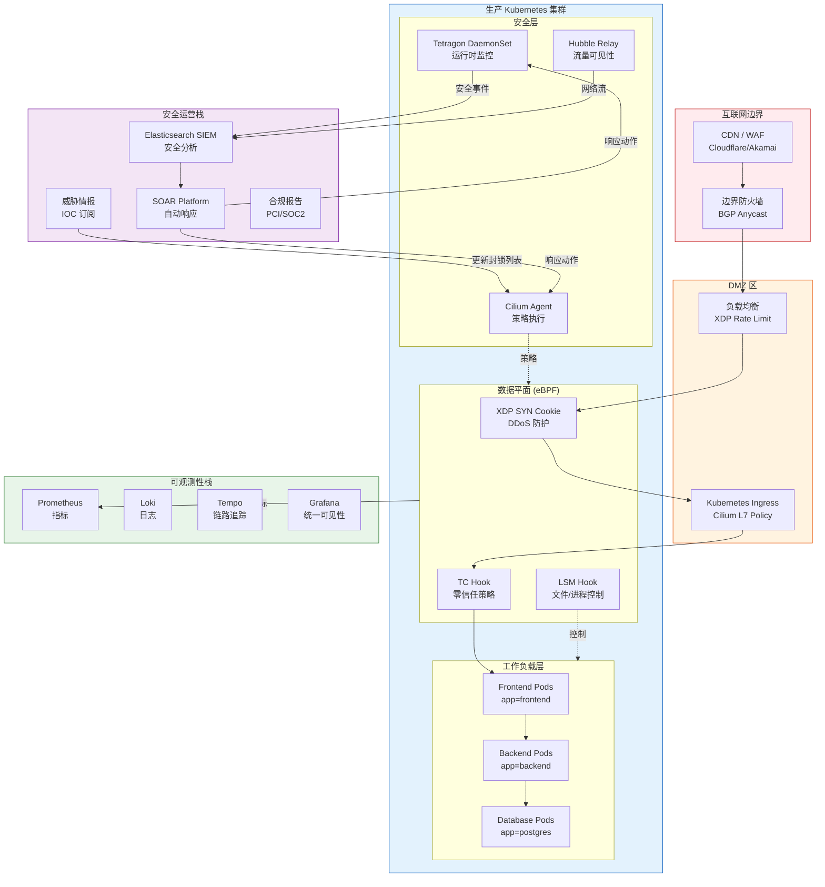

## 10.2 安全成熟度模型 (Security Maturity Model)

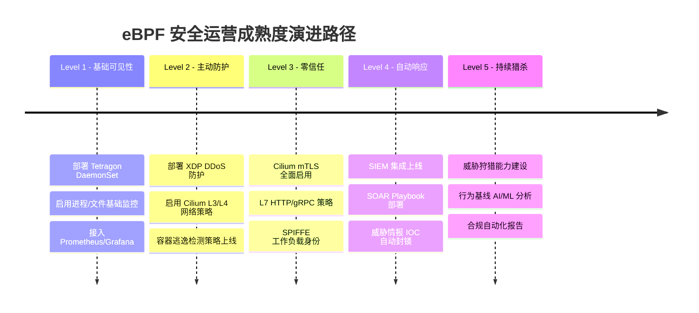

## 10.3 关键性能指标与 SLA (KPIs and SLA)

| 指标类别 | 具体指标 | 目标值 | eBPF 实现方式 |
|---------|---------|--------|--------------|
| **检测能力** | 威胁检测率 (TDR) | ≥99% | Tetragon kprobe 覆盖 |
| **检测能力** | 误报率 (FPR) | ≤1% | 精细化 TracingPolicy |
| **检测能力** | 平均检测时间 (MTTD) | ≤1s | Ring Buffer 实时推送 |
| **响应能力** | 平均响应时间 (MTTR) | ≤5min | SOAR 自动 Playbook |
| **防护能力** | DDoS 缓解速率 | 100 Gbps+ | XDP 线速处理 |
| **性能影响** | CPU 开销 | ≤3% | eBPF JIT 优化 |
| **性能影响** | 延迟增加 | ≤100μs | 内核态直接执行 |
| **审计合规** | 日志完整性 | 99.99% | Ring Buffer + 持久化 |
| **可见性** | 网络流覆盖率 | 100% | Hubble 全链路 |
| **可见性** | 系统调用覆盖 | 100% | Tracepoint 全覆盖 |

## 10.4 eBPF 安全部署最佳实践 Checklist

```yaml
# File: ebpf-security-deployment-checklist.yaml
# eBPF 安全部署最佳实践清单

ebpf_security_checklist:
  # ===== 基础设施要求 =====
  infrastructure:
    kernel_version:
      minimum: "5.15"
      recommended: "6.1+"
      reason: "支持 BTF CO-RE、LSM eBPF、改进的 Ring Buffer"

    kernel_config:
      required:
        - CONFIG_BPF=y
        - CONFIG_BPF_SYSCALL=y
        - CONFIG_BPF_JIT=y
        - CONFIG_DEBUG_INFO_BTF=y
        - CONFIG_BPF_LSM=y
      verify_cmd: |
        zcat /proc/config.gz | grep -E "^CONFIG_BPF"

    node_settings:
      - sysctl: "net.core.bpf_jit_enable=1"
        reason: "启用 JIT 编译提升性能"
      - sysctl: "kernel.unprivileged_bpf_disabled=1"
        reason: "禁止非特权用户加载 eBPF（安全加固）"
      - sysctl: "net.core.rmem_max=134217728"
        reason: "Ring Buffer 大容量支持"
      - ulimit: "memlock=unlimited"
        reason: "eBPF Map 内存锁定"

  # ===== Cilium 配置 =====
  cilium_deployment:
    required_features:
      - feature: "kube-proxy-replacement"
        value: "strict"
        reason: "完全 eBPF 替代 kube-proxy"
      - feature: "enable-bandwidth-manager"
        value: "true"
        reason: "基于 eBPF 的带宽管理"
      - feature: "enable-bbr"
        value: "true"
        reason: "BBR 拥塞控制（需要内核 5.18+）"
      - feature: "encryption"
        value: "wireguard"
        reason: "节点间透明加密"

    security_features:
      - policy-enforcement: "always"
      - enable-l7-proxy: "true"
      - tls-min-version: "TLSv1.2"
      - enable-endpoint-health-checking: "true"

  # ===== Tetragon 配置 =====
  tetragon_deployment:
    policies_priority:
      p0_critical:
        - container-escape-detection
        - privilege-escalation-monitor
      p1_high:
        - file-integrity-monitoring
        - process-behavior-ids
        - automated-threat-response
      p2_compliance:
        - compliance-audit-pci-soc2
        - namespace-isolation-verification

    performance_tuning:
      ring_buf_size: "64MB"      # 高流量环境
      event_queue_size: 10000
      cpu_limit: "2"
      memory_limit: "1Gi"
      # 避免在高负载节点开启全量系统调用追踪
      selective_syscall_audit: true

  # ===== 监控告警 =====
  monitoring:
    sla_targets:
      critical_alert_response: "15m"
      high_alert_response: "1h"
      medium_alert_response: "4h"

    mandatory_dashboards:
      - "eBPF SOC 实时总览"
      - "DDoS 防护状态"
      - "容器安全事件"
      - "合规审计报告"
      - "eBPF 程序性能"

    audit_log_retention:
      hot_storage: "30d"    # Elasticsearch
      warm_storage: "90d"   # S3/OSS 压缩
      cold_storage: "1y"    # 归档（PCI-DSS 要求）

  # ===== 安全运营 =====
  security_operations:
    threat_intelligence:
      - feed: "Abuse.ch URLhaus"
        update_interval: "1h"
        action: "update_xdp_blocklist"
      - feed: "Emerging Threats"
        update_interval: "6h"
        action: "update_cilium_policy"
      - feed: "内部 IOC 数据库"
        update_interval: "15m"
        action: "update_all"

    incident_response:
      - severity: CRITICAL
        auto_actions:
          - "隔离受影响 Pod"
          - "封锁攻击者 IP"
          - "触发 PagerDuty"
          - "创建 Jira P1 工单"
        manual_required: true
        sla: "15m"
      - severity: HIGH
        auto_actions:
          - "发送 Slack 告警"
          - "创建 Jira P2 工单"
          - "触发取证数据收集"
        sla: "1h"
```

## 10.5 常见安全场景应对方案 (Common Security Scenarios)

## 场景 1：CVE 漏洞利用缓解（虚拟补丁）

```c
// File: virtual_patch_cve.c
// eBPF 虚拟补丁：在内核补丁发布前通过 eBPF 缓解 CVE
// 示例：CVE 类 DirtyPipe 类漏洞的 eBPF 缓解

#include <linux/bpf.h>
#include <linux/ptrace.h>
#include <bpf/bpf_helpers.h>
#include <bpf/bpf_tracing.h>

// 虚拟补丁：阻止对只读文件的 pipe 写操作
// 类 DirtyPipe (CVE-2022-0847) 利用链缓解
SEC("kprobe/copy_page_to_iter_pipe")
int BPF_KPROBE(mitigate_dirtypipe,
               struct page *page,
               size_t offset, size_t bytes,
               struct iov_iter *i)
{
    __u32 uid = bpf_get_current_uid_gid() & 0xFFFFFFFF;

    // 非 root 用户尝试 pipe 写：记录并阻断
    if (uid != 0) {
        __u32 pid = bpf_get_current_pid_tgid() >> 32;
        char comm[16];
        bpf_get_current_comm(&comm, sizeof(comm));
        bpf_printk("VIRTUAL_PATCH: pipe_write uid=%d pid=%d comm=%s\n",
                   uid, pid, comm);
        // 返回非零值阻断操作（kprobe override 模式）
        // 注意：需要启用 CONFIG_BPF_KPROBE_OVERRIDE
        bpf_override_return(ctx, -EPERM);
    }
    return 0;
}

char LICENSE[] SEC("license") = "GPL";
```

## 场景 2：供应链安全 - 镜像运行时验证

```yaml
# File: policy-supply-chain-security.yaml
# 供应链安全：验证容器镜像来源合法性
# 防止：未签名镜像运行、已知恶意镜像执行

apiVersion: cilium.io/v1alpha1
kind: TracingPolicy
metadata:
  name: supply-chain-security
  namespace: kube-system
spec:
  kprobes:
    # 监控新容器进程：验证父进程是否为合法容器运行时
    - call: "security_bprm_check"
      syscall: false
      args:
        - index: 0
          type: "linux_binprm"
      selectors:
        # 容器内首个进程（PID=1）必须来自合法运行时
        - matchNamespaces:
            - namespace: Pid
              operator: NotIn
              values:
                - "host"
          matchCapabilities:
            - type: Permitted
              operator: In
              values:
                - "CAP_SYS_ADMIN"
          matchActions:
            - action: Post
              rateLimit: "10/minute"

    # 检测运行时镜像层被篡改（写入 overlay 上层目录）
    - call: "vfs_write"
      syscall: false
      args:
        - index: 0
          type: "file"
      selectors:
        - matchArgs:
            - index: 0
              operator: "Prefix"
              values:
                - "/var/lib/containerd/io.containerd.snapshotter.v1.overlayfs"
                - "/var/lib/docker/overlay2"
          matchActions:
            - action: Post
            - action: Sigkill
```

## 10.6 故障排查与性能调优 (Troubleshooting and Performance Tuning)

``` bash
# 🟢 低风险：只读/信息收集，通常无副作用
#!/bin/bash
# File: ebpf-security-health-check.sh
# eBPF 安全组件健康检查脚本

set -euo pipefail
RED='\033[0;31m' GREEN='\033[0;32m' YELLOW='\033[1;33m' NC='\033[0m'

echo "======================================"
echo " eBPF Security Health Check - $(date)"
echo "======================================"

# 1. 内核版本检查
KERNEL=$(uname -r)
KERNEL_MAJOR=$(echo $KERNEL | cut -d. -f1)
KERNEL_MINOR=$(echo $KERNEL | cut -d. -f2)
echo -e "\n[1] 内核版本: $KERNEL"
if $KERNEL_MAJOR -gt 5 || $KERNEL_MAJOR -eq 5 && $KERNEL_MINOR -ge 15; then
    echo -e "    ${GREEN}✓ 内核版本满足要求 (>=5.15)${NC}"
else
    echo -e "    ${RED}✗ 内核版本不足，建议升级到 5.15+${NC}"
fi

# 2. BTF 支持检查
echo -e "\n[2] BTF 支持检查"
if -f /sys/kernel/btf/vmlinux; then
    echo -e "    ${GREEN}✓ BTF 可用 (/sys/kernel/btf/vmlinux)${NC}"
else
    echo -e "    ${RED}✗ BTF 不可用，CO-RE 功能受限${NC}"
fi

# 3. eBPF 程序检查
echo -e "\n[3] 已加载 eBPF 程序"
PROG_COUNT=$(bpftool prog list 2>/dev/null | grep -c "^[0-9]" || echo "0")
echo "    已加载程序数: $PROG_COUNT"
echo "    XDP 程序:"
bpftool prog list | grep xdp | awk '{print "      ",$0}' || echo "      (无 XDP 程序)"
echo "    Kprobe 程序:"
bpftool prog list | grep kprobe | wc -l | xargs -I{} echo "      {} 个 kprobe 程序"

# 4. eBPF Map 健康检查
echo -e "\n[4] eBPF Map 使用情况"
for map_name in ip_stats_map blocklist_map conntrack_map; do
    MAP_ID=$(bpftool map list 2>/dev/null | grep "$map_name" | awk '{print $1}' | tr -d ':' | head -1)
    if -n "$MAP_ID"; then
        ENTRIES=$(bpftool map dump id $MAP_ID 2>/dev/null | grep -c "key" || echo "0")
        echo -e "    ${GREEN}✓${NC} $map_name: $ENTRIES 条目"
    else
        echo -e "    ${YELLOW}!${NC} $map_name: 未找到"
    fi
done

# 5. Ring Buffer 溢出检查
echo -e "\n[5] Ring Buffer 状态"
RB_DROPS=$(cat /sys/fs/bpf/events_rb/stats 2>/dev/null | grep lost || echo "unavailable")
echo "    Ring Buffer 丢失事件: $RB_DROPS"

# 6. Tetragon 健康检查
echo -e "\n[6] Tetragon 状态"
if kubectl get pods -n kube-system -l app=tetragon 2>/dev/null | grep -q Running; then
    echo -e "    ${GREEN}✓ Tetragon DaemonSet 运行正常${NC}"
    POLICY_COUNT=$(kubectl get tracingpolicy --all-namespaces 2>/dev/null | grep -c "^" || echo "0")
    echo "    已部署 TracingPolicy: $((POLICY_COUNT-1)) 个"
else
    echo -e "    ${RED}✗ Tetragon 未运行${NC}"
fi

# 7. Cilium 健康检查
echo -e "\n[7] Cilium 状态"
if cilium status 2>/dev/null | grep -q "OK"; then
    echo -e "    ${GREEN}✓ Cilium 运行正常${NC}"
    POLICY_COUNT=$(cilium policy get 2>/dev/null | grep -c "IngressRule|EgressRule" || echo "0")
    echo "    已应用策略规则: $POLICY_COUNT 条"
else
    echo -e "    ${RED}✗ Cilium 状态异常${NC}"
fi

# 8. CPU/内存开销
echo -e "\n[8] eBPF 组件资源消耗"
for component in tetragon cilium-agent hubble-relay; do
    CPU=$(kubectl top pod -l app=$component -n kube-system 2>/dev/null | awk 'NR==2{print $2}' || echo "N/A")
    MEM=$(kubectl top pod -l app=$component -n kube-system 2>/dev/null | awk 'NR==2{print $3}' || echo "N/A")
    echo "    $component: CPU=$CPU MEM=$MEM"
done

echo -e "\n======================================"
echo " 健康检查完成"
echo "======================================"
```
## 10.7 学习路径与参考资源 (Learning Path and References)

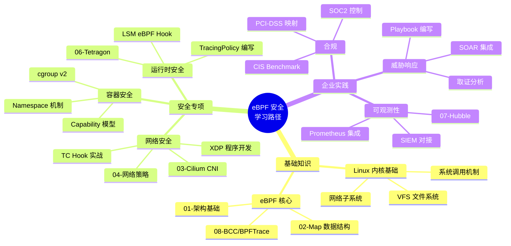

## 推荐参考资源

| 资源类型 | 名称 | 说明 |
|---------|------|------|
| 官方文档 | [Tetragon Docs](https://tetragon.io/docs/) | TracingPolicy 完整参考 |
| 官方文档 | [Cilium Docs](https://docs.cilium.io/) | 网络策略与安全特性 |
| 论文 | [eBPF - Rethinking the Linux Kernel](https://dl.acm.org/doi/10.1145/3495012) | eBPF 设计论文 |
| 工具 | [bpftool](https://github.com/libbpf/bpftool) | eBPF 程序调试与检查 |
| 工具 | [tetragon-cli](https://github.com/cilium/tetragon) | 安全事件实时查看 |
| 社区 | [eBPF Slack](https://ebpf.io/slack) | 官方 eBPF 社区 |
| 课程 | [Linux Foundation eBPF Fundamentals](https://training.linuxfoundation.org/) | 系统化学习 |
| 书籍 | "Learning eBPF" - Liz Rice (O'Reilly 2023) | 最佳入门书籍 |
| 仓库 | [Cilium Tetragon Examples](https://github.com/cilium/tetragon/tree/main/examples) | 完整策略示例库 |

---

<!-- chunk: 总结 (Summary) -->## 总结 (Summary)


eBPF 技术正在深刻重塑企业安全运营的方式：

1. **从被动检测到主动防护**：XDP/TC Hook 实现线速 DDoS 缓解，在数据包进入内核协议栈前完成安全决策
2. **从用户态到内核态**：Tetragon 的 kprobe/tracepoint 使安全监控无法被用户态进程规避
3. **从静态规则到动态响应**：TracingPolicy + SOAR 实现秒级自动威胁响应
4. **从孤立工具到统一平台**：Cilium + Tetragon + Hubble 构建网络/运行时/可观测性三位一体安全平台
5. **从合规压力到合规自动化**：eBPF 审计日志天然满足 PCI-DSS/SOC2 要求，降低合规成本

> **关键认知**：eBPF 安全不是"银弹"，它是对现有安全体系的**内核级增强**。最佳实践是将 eBPF 能力与 SIEM、SOAR、威胁情报、人工分析紧密结合，构建具有纵深防御能力的现代安全运营体系。

---

*本文档由 eBPF 安全领域专家团队撰写，基于 2026 年最新实践与开源社区最佳实践。适用于 Linux Kernel 5.15+、Tetragon 1.2+、Cilium 1.15+。*

> **相关文档**：
> - [06-Tetragon 运行时安全](./06-tetragon-runtime-security.md) - TracingPolicy 深度实践
> - [04-Cilium 网络策略](./04-cilium-network-policy.md) - L3/L4/L7 策略配置
> - [09-eBPF 性能优化](./09-ebpf-performance-optimization.md) - 大规模部署性能调优
> - [07-Hubble 网络可观测性](./07-hubble-network-observability.md) - 网络流量分析

---

<!-- chunk: Obsidian 相关文档 -->## Obsidian 相关文档

- domain-35-ebpf-technology MOC
- [[05-网络/README.md|Domain 03: eBPF 技术体系 (eBPF Technology Stack)]]
- Domain-35 eBPF 技术 — 开源项目索引
- eBPF 架构基础与程序类型 (eBPF Architecture Fundamentals and Program T...
- eBPF Map 类型与数据结构 (eBPF Map Types and Data Structures)
- Cilium CNI 架构与部署 (Cilium CNI Architecture and Deployment)
- Cilium 网络策略 L3/L4/L7 (Cilium Network Policy L3/L4/L7)
- Cilium Service Mesh 无 Sidecar 架构 (Cilium Service Mesh Sideca...
- Tetragon 运行时安全 (Tetragon Runtime Security)
- Hubble 网络可观测性 (Hubble Network Observability)
- bcc 与 bpftrace 工具链 (bcc and bpftrace Tools)
- eBPF 性能优化实践 (eBPF Performance Optimization Practice)

## See Also

- 08-bcc-bpftrace-tools
- 09-ebpf-performance-optimization
- 01-ebpf-architecture-fundamentals
- 02-ebpf-map-types-data-structures


<!-- risk-assessed -->
