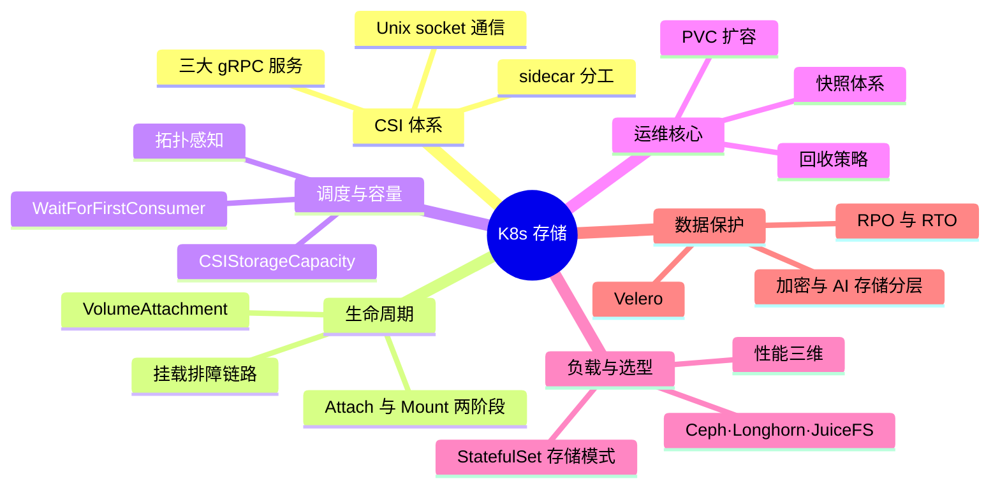
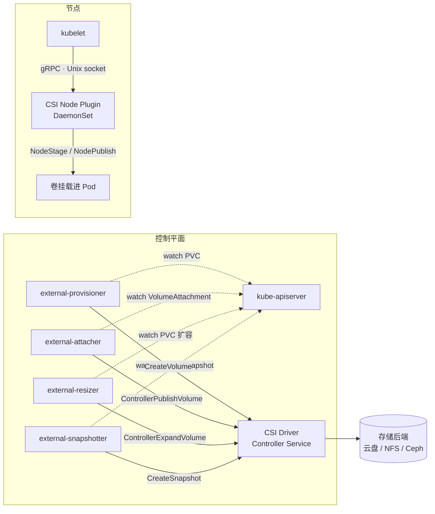
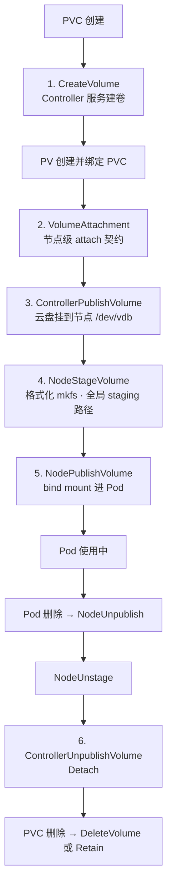
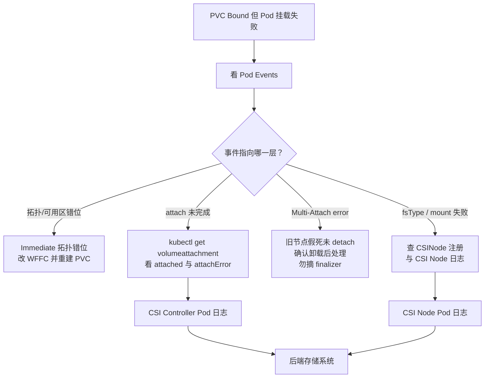
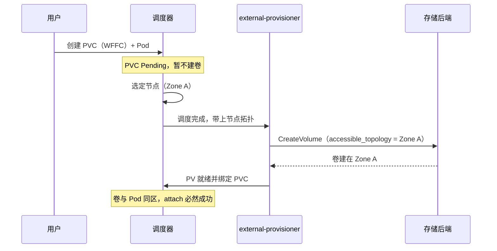

# K8s 存储高级快问快答（12 题）

入门版 61 题速查见 [[06-存储/01-K8s存储/22-k8s-storage-quick-qa.md|K8s 存储快问快答（61 题）]]，联动机制详解见 [[06-存储/01-K8s存储/21-storageclass-pvc-pv-interview-notes.md|StorageClass、PVC、PV 联动机制面经]]。本文 12 道高难度题与网络域快问快答同体例：先遮住答案口述，再对照关键词补全，最后沿"深挖"链接回语料源文件精读。

---

## 话题覆盖清单

| 题号 | 话题域 | 核心考点 |
|------|--------|---------|
| 1 | CSI 架构 | 三大 gRPC 服务、sidecar 组件分工、Unix socket 通信 |
| 2 | Attach/Mount 两阶段 | VolumeAttachment 对象模型、ControllerPublishVolume vs NodeStage/Publish |
| 3 | 卷挂载排障 | Bound 但挂不上、Multi-Attach、排查链路 |
| 4 | 拓扑调度 | WaitForFirstConsumer、topology keys、CSIStorageCapacity |
| 5 | PVC 扩容 | 在线/离线扩容、Resizing 卡住、文件系统扩展 |
| 6 | 快照体系 | VolumeSnapshot/Content/Class、快照≠备份、一致性级别 |
| 7 | 回收策略 | Delete/Retain、Released 状态、claimRef 清理坑 |
| 8 | StatefulSet 存储 | volumeClaimTemplates、缩容 PVC 残留、Local PV vs 网络盘 |
| 9 | 性能调优 | 存储类型对比、StorageClass 性能参数、mountOptions、fsType |
| 10 | 分布式存储选型 | Ceph/Longhorn/OpenEBS/JuiceFS/NFS |
| 11 | 备份容灾 | 快照 vs 备份 vs Velero、RTO/RPO、恢复演练 |
| 12 | 加密与 AI 存储 | 静态加密 KMS、AI 训练存储分层与缓存 |

**知识地图**：12 题归并为六大板块——答题先定位板块，再展开考点；每片叶子对应正文某题的拿分点。



---

### 1. CSI 驱动有哪三个 gRPC 服务？external-provisioner 这些 sidecar 各管什么？kubelet 为什么用 Unix socket 连 Node 插件？

> **一句话**：CSI 驱动 = Identity / Controller / Node 三个 gRPC 服务；sidecar 监听 API 对象驱动 Controller 服务，kubelet 经 Unix socket 直连本机 Node 服务执行 mount。

**三大服务**：

| 服务 | 职责 | 调用方 |
|------|------|--------|
| Identity | GetPluginInfo/Probe，驱动发现与探活 | sidecar、kubelet |
| Controller | CreateVolume/DeleteVolume/ControllerPublishVolume/ControllerExpandVolume/CreateSnapshot | Controller Pod 内的 sidecar |
| Node | NodeStageVolume/NodePublishVolume/NodeUnpublish/GetStats | kubelet（本机直连） |

**sidecar 分工**：external-provisioner（watch PVC → CreateVolume → 创建 PV）、external-attacher（watch VolumeAttachment → ControllerPublishVolume → 置 `status.attached=true`）、external-resizer（watch PVC 扩容 → ControllerExpandVolume）、external-snapshotter（watch VolumeSnapshot → CreateSnapshot）。CSI Driver 本身只实现 gRPC 接口，"监听谁"全由 sidecar 完成——这就是同一套驱动能同时接 API 对象和 kubelet 的原因。

**Unix socket**：Node 服务必须在本节点执行 mount，kubelet 与 DaemonSet 方式部署的 node plugin 通过主机路径下的 Unix socket 直连 gRPC——不暴露网络端口，无服务发现，权限收敛在本机。



深挖：[[06-存储/05-存储网络/02-csi-driver-architecture.md|Kubernetes CSI Driver 架构与实现]]、[[06-存储/01-K8s存储/06-csi-drivers-integration.md|CSI 驱动集成与运维管理]]

### 2. Attach 和 Mount 是两个什么层次的动作？VolumeAttachment 对象在里面扮演什么角色？为什么不能手动删它的 finalizer？

> **一句话**：Attach 让卷对节点可见（控制面），Mount 把卷挂进 Pod（kubelet）；VolumeAttachment 是 attach 事实的存档——手动摘 finalizer 可能造成多节点双挂载、文件系统损坏。

**层次区分**：Attach 是**节点级**动作——让一块云盘/iSCSI 卷"对某个节点可见"（云 API 层 AttachDisk），由控制平面执行：in-tree 走 AD Controller，CSI 走 external-attacher 调 `ControllerPublishVolume`。Mount 是 **Pod 级**动作——由 kubelet VolumeManager 先 `NodeStageVolume`（格式化/mkfs，挂到节点全局 staging 路径，每卷只做一次），再 `NodePublishVolume`（bind mount 进 Pod 目录）。



**VolumeAttachment 是 attach 事实在 etcd 的物化**：AD Controller 创建对象（`spec.attacher` 是路由键，指向处理它的 CSI driver）→ external-attacher 调云 API 成功后置 `status.attached=true` 并写入 `attachmentMetadata`（设备路径）→ kubelet 在 mount 前**先确认 attached==true，否则一直等**。`finalizers: external-attacher/<driver>` 保证 unpublish 完成前对象不会消失。

**风险**：强制删 VA 或手动摘 finalizer 会让控制器与底层云盘状态脱节——轻则后续 attach 永久失败，重则同一块卷被两个节点同时挂载，**文件系统直接损坏**。任何 VA 写操作前必须确认目标设备已在节点上卸载。

深挖：[[06-存储/01-K8s存储/20-volume-attachment-controller.md|VolumeAttachment 与 Attach/Detach 控制器]]

### 3. PVC 已 Bound 但 Pod 一直挂载失败，按什么链路排查？Multi-Attach error 的根因与处置？

> **一句话**：沿 Pod Events → PVC → PV → StorageClass → VolumeAttachment → CSI Controller → CSI Node → 后端逐层验证；Multi-Attach 多为节点假死未 detach + Pod 强制漂移。

**排查链路**（不要只看 Pod）：

```text
Pod Events → PVC → PV → StorageClass
  → VolumeAttachment（attached？attachError？）
  → CSI Controller Pod（provisioner/attacher 日志）
  → CSI Node Pod（node plugin 日志、CSINode 是否注册）
  → 后端存储系统
```

**Bound 但挂不上的高频根因**：卷与节点不同可用区（Immediate 模式建卷早于调度，拓扑错位）；CSI node plugin 未就绪或 node-driver-registrar 没把节点写进 CSINode；`fsType` 不被支持；`mountOptions` 错误（如 NFS 版本不匹配）；权限或后端认证失败。

**Multi-Attach error**：RWO 卷被两个节点争用。典型时序——节点 NotReady 假死，其上的卷未完成 detach，控制器把 Pod 强制漂移到新节点再 attach，冲突爆发。处置：先确认旧节点上设备已卸载（或节点确已死亡），让 AD Controller 完成 detach；在确认卸载前**不要**碰 VolumeAttachment 的 finalizer（第 2 题的风险）。



深挖：[[06-存储/01-K8s存储/10-pv-pvc-troubleshooting.md|PV/PVC 故障排查]]、[[06-存储/01-K8s存储/20-volume-attachment-controller.md|VolumeAttachment 与 Attach/Detach 控制器]]

### 4. WaitForFirstConsumer 解决什么问题？拓扑键怎么生效？CSIStorageCapacity 又补了哪块短板？

> **一句话**：WFFC 把建卷推迟到调度器选定节点之后，让卷与 Pod 同拓扑；CSIStorageCapacity 再让调度时就校验后端容量。

**Immediate 的坑**：PVC 一创建就建卷，而卷落在哪个可用区与 Pod 调度无关——云盘建在 A 区、Pod 被调度到 B 区，attach 永久失败。

**WFFC（WaitForFirstConsumer）**：PVC 先保持 Pending，等第一个 Pod 触发调度、调度器**选定节点**后，才按该节点的拓扑（`topology.kubernetes.io/zone`/`region`）创建或绑定卷——卷与 Pod 同区是调度决策的一部分。CSI 驱动在 CreateVolume 请求里收到 `accessible_topology` 约束；Local PV 必须配 WFFC + PV nodeAffinity 才能工作。



**CSIStorageCapacity**：它补的是"调度成功但容量不足"——调度器把卷调度到节点后，CreateVolume 才发现后端池容量不够，Pod 反复重建。有了 CSIStorageCapacity 对象（`21 号` KEP），调度器在**调度时**就能校验目标拓扑下的剩余容量，提前把 Pod 排除。

深挖：[[06-存储/01-K8s存储/05-storageclass-dynamic-provisioning.md|StorageClass 动态供给]]、[[06-存储/07-AI存储与高级/05-csi-topology-awareness.md|CSI 拓扑感知调度]]、[[06-存储/01-K8s存储/21-csi-storage-capacity-tracking.md|CSI 存储容量跟踪]]

### 5. PVC 扩容的完整链路是什么？在线与离线的分界在哪？卡在 Resizing 怎么办？

> **一句话**：链路 = patch PVC → 云盘扩容（ControllerExpandVolume）→ 文件系统扩展（resize2fs/xfs_growfs）；只能扩不能缩，仅动态供给可扩。

**前提**：StorageClass `allowVolumeExpansion: true`；**只能扩不能缩**；仅动态供给的 PVC 可扩（静态 PV 会报 `only dynamically provisioned pvc can be resized`）。

**链路**：修改 `spec.resources.requests.storage` → external-resizer 调 `ControllerExpandVolume`（云盘侧扩容）→ kubelet 扩展文件系统（`resize2fs`/`xfs_growfs`）。验证看 `kubectl get pvc -w` 的 status.capacity 与 Pod 内 `df -h`。

**在线 vs 离线**：ext4/XFS 都支持在线扩展，云盘 CSI 实现到位即全程在线；CSI 不支持在线扩容或存储类型受限时，走离线——`scale sts --replicas=0` 解挂载 → patch PVC → 节点扩 FS → 恢复副本。

**卡 Resizing**：多因 CSI 驱动未实现扩容接口，升级驱动；云盘扩了但 FS 没扩，是 NodeExpand 环节缺失，手动 resize。NAS 扩容本质是改配额、即时生效；本地盘不支持扩容，只能重建加数据迁移。

深挖：[[06-存储/01-K8s存储/03-pvc-expansion-guide.md|PVC 扩容指南]]

### 6. VolumeSnapshot 三个对象各是什么？为什么说快照不是备份？crash-consistent 和 application-consistent 差在哪？

> **一句话**：快照是同后端的 COW 时间点副本（crash-consistent），备份是独立存储的完整副本；应用一致要靠冻结（flush/fsfreeze）。

**对象模型**：VolumeSnapshotClass（driver + deletionPolicy，模板）、VolumeSnapshot（namespace 级，指向源 PVC）、VolumeSnapshotContent（集群级，真实快照的"PV 对应物"，由 external-snapshotter 创建）。

**快照≠备份**：快照通常基于**写时复制（COW）**，秒级完成，且与源卷同处一个存储后端——后端整体故障（可用区级灾难、误删存储池）时快照随之陪葬。备份是**独立于源存储**的完整副本（拉到对象存储、可跨区域），慢但抗灾难。生产口径：快照做高频 RPO，备份做异地容灾，两者叠加。

**一致性分级**：crash-consistent = 突然断电级别的瞬间副本，文件系统可恢复但应用内存态丢失；application-consistent = 预先执行应用冻结（数据库 flush、`fsfreeze`）再打快照。数据库不冻结直接打快照，可能丢最近未落盘事务——这就是"有快照还丢数据"的典型事故。

**恢复与克隆**：新 PVC 的 `dataSource` 指向 `kind: VolumeSnapshot` 即恢复；指向 `kind: PersistentVolumeClaim` 即同 PVC 克隆。

深挖：[[06-存储/01-K8s存储/18-volume-snapshot-scheduling.md|VolumeSnapshot 定时快照策略]]、[[06-存储/05-存储网络/02-csi-driver-architecture.md|Kubernetes CSI Driver 架构与实现]]

### 7. Delete 与 Retain 的差异？PV 卡在 Released 怎么复用？生产怎么防云盘误删？

> **一句话**：Delete 连后端真卷一起删，Retain 保数据但 PV 进 Released——清 claimRef 才能重绑。

**Delete**：PVC 删除 → PV 删除 → **后端真实卷也被删除**（动态供给的云盘场景），方便但误删即数据蒸发。**Retain**：PVC 删除后 PV 与后端数据保留，PV 进入 **Released**。

**Released 复用**：数据还在，但 PV 不能直接被新 PVC 绑定——需要管理员清理 PV 的 `claimRef`（`kubectl patch pv <name> --type json -p '[{"op":"remove","path":"/spec/claimRef"}]'` 或编辑后字段），PV 回到 Available 才能重绑。操作前必须确认数据归属，避免旧数据被新租户接走。

**防误删**：数据库与关键数据一律 Retain；再叠一层后端兜底——云账号层的磁盘回收站/快照策略，K8s 层的 Delete 挡不住"人删除 PV 对象"这类事故。

深挖：[[06-存储/01-K8s存储/02-pv-architecture-fundamentals.md|PV/PVC 架构基础]]

### 8. StatefulSet 的 volumeClaimTemplates 为什么不可变？缩容后 PVC 为什么残留？数据库和 Kafka 各该怎么选存储？

> **一句话**：每副本一盘（data-mysql-0/1/2）且模板不可变；缩容不删 PVC 是防误删特性；数据库走网络盘、大吞吐场景才考虑 Local PV。

**volumeClaimTemplates**：为每个副本生成独立 PVC（`data-mysql-0/1/2`），Pod 重建按序号重绑同名 PVC，存储身份随序号稳定。**模板不可变**——修改模板只影响新建副本，存量 PVC 原样不动；要改规格只能逐副本走"新模板 + 数据迁移"。**缩容不删 PVC**：K8s 有意保留，防止缩容误删数据；残留 PVC 要手工清理，且清理后重建副本才能拿到全新盘。

**选型**：MySQL/PostgreSQL 走网络盘（RWO），看重跨节点漂移能力与快照备份；Kafka/ES 这类大吞吐场景，Local PV（本地盘）性能最优——顺序写延迟最低，但**强节点耦合**：必须 WFFC + PV `nodeAffinity` 钉死节点，Broker 重调度受限，副本机制要靠应用层扛节点损失。

深挖：[[06-存储/04-有状态应用存储/01-stateful-app-storage-patterns.md|有状态应用存储模式]]

### 9. 给一张存储类型性能对比表，并说说 StorageClass 性能参数、mountOptions、fsType 各自怎么影响性能？

> **一句话**：性能看 IOPS/吞吐/延迟三维——Local SSD 最优、对象存储延迟最高；调参在 SC 性能等级、mountOptions、fsType 三处下手。

| 存储类型 | IOPS | 吞吐 | 延迟 | 适用 |
|----------|------|------|------|------|
| Local SSD | 100k+ | 1GB/s+ | <0.1ms | 数据库、缓存 |
| 云 SSD | 25k-100k | 350MB/s | <1ms | 通用负载 |
| 云高效盘 | 5k-25k | 150MB/s | 1-3ms | 开发测试 |
| NFS/NAS | 变化大 | 100-500MB/s | 1-10ms | 共享存储 |
| 对象存储 | N/A | 高吞吐 | 50-200ms | 大文件、备份 |

**StorageClass 参数**：阿里云 `cloud_essd` + `performanceLevel: PL1-PL3`（性能等级换钱）；AWS gp3 的 `iops`/`throughput` 与容量解耦、独立计费——按需配平，不为闲置 IOPS 买单。

**mountOptions**：`noatime`/`nodiratime` 省掉每次读的元数据写；NFS 四件套 `nfsvers=4.1`、`rsize=1048576`、`wsize=1048576`（1MB 读写块）、`hard` + `timeo=600`/`retrans=2`（故障时不静默报 IO 错误）。

**fsType**：ext4 通用稳健；XFS 大文件与高并发场景更强，两者都支持在线扩容。压测按基准测试方法论用 fio 建立基线，监控盯 IOPS/吞吐/延迟三维与饱和度。

深挖：[[06-存储/01-K8s存储/09-storage-performance-tuning.md|存储性能调优]]、[[06-存储/07-AI存储与高级/06-filesystem-comparison-ext4-xfs-zfs.md|节点文件系统对比]]、[[06-存储/07-AI存储与高级/07-storage-benchmarking-methodology.md|存储基准测试方法论]]

### 10. Ceph、Longhorn、OpenEBS、JuiceFS、NFS 各适合什么场景？选型的第一性问题是什么？

> **一句话**：先问"块还是文件、要不要 RWX、运维复杂度能接受多少"——需要 RWX 才谈 NFS/CephFS/JuiceFS，纯块场景云盘优先。

| 方案 | 定位 | 复杂度 | 适用 |
|------|------|-------|------|
| Rook-Ceph | RBD/CephFS/对象一体 | 高（专职团队） | 大规模统一存储 |
| Longhorn | K8s 原生块存储，副本+快照/备份到 S3 | 低 | 中小规模、边缘、简易 HA |
| OpenEBS | 模块化（LocalPV/Jiva/cStor） | 中 | LocalPV 兼顾性能与简单 |
| JuiceFS | 元数据+对象存储的分布式 FS，RWX | 中 | AI/大数据共享读写 |
| NFS | 最简单 RWX | 低 | 共享配置、低性能需求 |

**第一性问题**：先问"要块还是文件、要 RWX 吗、能接受多高的运维复杂度"——需要 RWX 再谈文件系统（NFS/CephFS/JuiceFS）；只要 RWO 块存储，云盘 > Longhorn > Ceph RBD 的运维成本序，性能序相反。JuiceFS 的缓存策略（节点缓存命中率）直接决定 AI 场景实际吞吐。

深挖：[[06-存储/03-分布式存储/02-rook-ceph-production.md|Rook-Ceph 生产部署与运维]]、[[06-存储/03-分布式存储/03-longhorn-production.md|Longhorn 生产部署与运维]]、[[06-存储/03-分布式存储/04-openebs-production.md|OpenEBS 生产部署与运维]]、[[06-存储/03-分布式存储/05-juicefs-distributed-filesystem.md|JuiceFS 生产部署指南]]

### 11. CSI 快照、Velero 备份、存储后端复制三层怎么配合？RTO/RPO 怎么定？

> **一句话**：快照管 RPO（高频、同后端），Velero 管集群可重建（YAML+PV 数据），后端复制管基础设施冗余；RPO≈备份间隔，RTO≈恢复速度。

**三层分工**：CSI 快照 = 同后端时间点副本，分钟级、高频、管 RPO（第 6 题的边界：不抗后端灾难）；Velero = 集群级备份——**资源对象（YAML）+ PV 数据**打包到对象存储，支持跨集群恢复，管"整个集群/命名空间可重建"；存储后端复制（云盘跨 AZ 快照复制、Ceph 池复制）管基础设施层冗余。

**RPO** = 可接受的数据丢失窗口 ≈ 快照/备份间隔——每小时快照，最坏丢 1 小时数据，数据库通常要更细的 binlog 增量；**RTO** = 恢复时长目标，取决于恢复速度（快照恢复分钟级 vs 对象存储回灌小时级）。

**落地**：定时快照策略（VolumeSnapshot 级 schedule）+ 备份到独立对象存储 + **定期恢复演练**——没演练过的备份等于没有备份。

深挖：[[06-存储/01-K8s存储/11-storage-backup-disaster-recovery.md|存储备份与灾难恢复]]、[[06-存储/01-K8s存储/16-storage-disaster-recovery.md|存储容灾]]、[[06-存储/07-AI存储与高级/09-velero-production-deep-dive.md|Velero 生产深度指南]]

### 12. 存储静态加密怎么做、性能代价多大？AI 训练场景的存储为什么要分层与缓存？

> **一句话**：卷级加密 SC 一行参数、个位数损耗、密钥交 KMS；AI 存储靠"对象底座 + POSIX 层 + 节点缓存"分层救吞吐。

**静态加密**：最常用卷级加密——StorageClass `parameters: {encrypted: "true", kmsKeyId: <BYOK>}`，云盘落盘前加密、I/O 路径透明解密，性能损耗通常为个位数百分比；更上层还有文件系统级与应用级（自带加密）加密，密钥管理交 KMS，轮换与审计在 KMS 侧做。

**AI 训练存储**：训练数据吞吐是第一瓶颈，对象存储直读延迟 50-200ms，GPU 等 IO 等不起——所以要**分层**：对象存储（MinIO/云 OSS）做数据底座与资产层 → JuiceFS/并行文件系统（WekaFS/Lustre）提供 POSIX 与并发读 → 节点侧缓存（JuiceFS cache、本地 NVMe）把热数据集拉到离 GPU 最近的位置，缓存命中率决定实际吞吐。配合数据分层与生命周期归档（冷数据下沉、checkpoint 归档）控制成本。

深挖：[[06-存储/01-K8s存储/19-storage-encryption-at-rest.md|存储加密与密钥管理]]、[[06-存储/07-AI存储与高级/01-minio-object-storage-ai.md|MinIO 对象存储 for AI/ML]]、[[06-存储/07-AI存储与高级/02-high-perf-ai-storage-weka-lustre.md|AI 高性能存储]]、[[06-存储/07-AI存储与高级/04-data-tiering-ilm-archival.md|数据分层与生命周期管理]]

---

## 自练检查清单

- 每题能否在 90 秒内口述完主链路（如第 5 题扩容链路、第 2 题两阶段）？
- 是否至少有一处"踩过坑"式细节（如 Released 清 claimRef、快照丢事务、Multi-Attach）？
- 被追问"为什么这么设计"时，能否说出第 4 题 WFFC 与第 6 题快照边界的动机？
- 12 题的话题覆盖清单能否不看稿复述出一半以上？

---

## 相关链接

- [[06-存储/01-K8s存储/22-k8s-storage-quick-qa.md|K8s 存储快问快答（61 题）]]
- [[06-存储/01-K8s存储/21-storageclass-pvc-pv-interview-notes.md|StorageClass、PVC、PV 联动机制面经]]
- [[06-存储/01-K8s存储/02-pv-architecture-fundamentals.md|PV/PVC 架构基础]]
- [[06-存储/01-K8s存储/05-storageclass-dynamic-provisioning.md|StorageClass 动态供给]]
- [[06-存储/01-K8s存储/06-csi-drivers-integration.md|CSI 驱动集成与运维管理]]
- [[06-存储/01-K8s存储/10-pv-pvc-troubleshooting.md|PV/PVC 故障排查]]
- [[06-存储/01-K8s存储/20-volume-attachment-controller.md|VolumeAttachment 与 Attach/Detach 控制器]]
- [[06-存储/05-存储网络/02-csi-driver-architecture.md|Kubernetes CSI Driver 架构与实现]]
- [[06-存储/01-K8s存储/09-storage-performance-tuning.md|存储性能调优]]
- [[06-存储/04-有状态应用存储/01-stateful-app-storage-patterns.md|有状态应用存储模式]]
