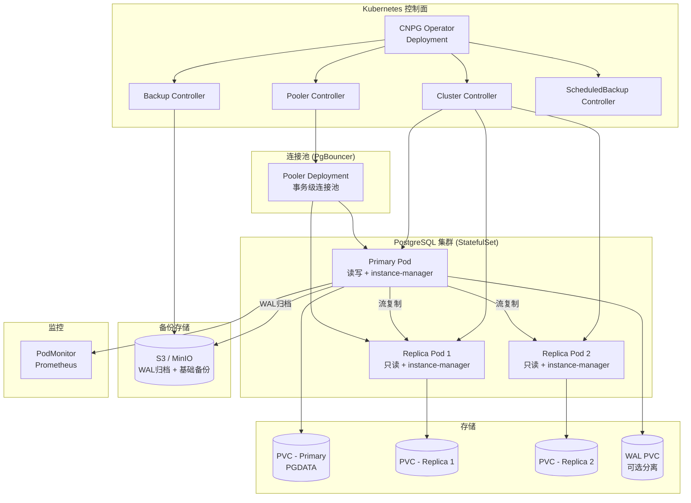

> **生产环境安全提示**
>
> 本文档包含可直接执行的运维命令。执行前请确认：当前目标集群与 Namespace 是否正确；是否具备足够的 RBAC 权限；是否已在非生产环境验证。命令风险等级标注：🔴 高风险（可能造成数据丢失或服务中断）、🟡 中风险（会修改集群状态，但通常可回滚）、🟢 低风险/只读（信息收集，无副作用）。


# [[CloudNativePG|CloudNativePG]] 企业级 PostgreSQL 运维指南

> **适用版本**: CloudNativePG v1.25  
> **最后更新**: 2026-04-26  
> **难度**: 中级 → 高级

---

<!-- chunk: 概述 -->## 概述

CloudNativePG（CNPG）是一个由 EDB 主导开发、已进入 CNCF Sandbox 的 PostgreSQL [[Kubernetes|Kubernetes]] Operator。它以声明式 CRD 方式管理 PostgreSQL 集群的完整生命周期，包括集群创建、主从复制、自动故障转移、备份恢复、连接池管理、版本升级和监控集成。与 Zalando Postgres Operator 和 Crunchy PGO 并列为 K8s 上 PostgreSQL 运维的三大主流方案。

CloudNativePG 的核心设计理念是"原生 K8s 集成、零外部依赖"。它不依赖 PgPool 或 Patroni 等外部组件，而是通过 Pod 内的 instance manager 进程实现复制管理、故障检测和 WAL 归档。这使得 CNPG 的架构简洁、运维门槛低，适合从中小规模到企业级的各种场景。

本文档系统覆盖 CNPG 的部署、配置、高可用、备份、监控、连接池、升级和生态集成，提供生产级 YAML 配置和运维脚本。

## CloudNativePG 架构深度解析

CloudNativePG 的架构设计充分考虑了 Kubernetes 的特性，将 PostgreSQL 的运维最佳实践与 K8s 的声明式 API 深度融合。理解其内部工作原理对于正确配置和故障排查至关重要。

**Instance Manager** 是 CNPG 的核心组件，它作为一个 sidecar 容器运行在每个 PostgreSQL Pod 中。Instance Manager 负责管理 PostgreSQL 实例的生命周期：启动和停止 PostgreSQL、执行主从复制配置、管理 WAL 归档、收集监控指标、以及执行故障检测和自动恢复。Instance Manager 通过 PostgreSQL 的 streaming replication 协议管理主从关系，通过查询 `pg_stat_replication` 监控复制状态。

**故障检测和自动故障转移**机制是 CNPG 高可用能力的核心。CNPG 使用 K8s 的 Pod readiness probe 来检测 PostgreSQL 实例的健康状态。当 Primary Pod 的 readiness probe 连续失败（默认 30 秒）时，CNPG 会触发故障转移流程：选择 LSN（Log Sequence Number）最大的 Replica 作为新的 Primary，执行 `pg_ctl promote` 提升它，然后更新 [[Service|Service]] 的 endpoints 将流量指向新的 Primary。整个故障转移过程通常在 30-60 秒内完成。

**WAL 归档和备份**是 CNPG 数据安全的重要保障。CNPG 使用 Barman Cloud 作为备份引擎，支持 S3、GCS 和 Azure Blob 作为备份存储。WAL 归档是连续的（每产生一个 WAL 文件就上传），确保可以恢复到任意时间点（PITR）。基础备份（Base Backup）可以通过 `ScheduledBackup` CRD 定时执行，也可以通过 `Backup` CRD 按需执行。备份数据使用 gzip 或 zstd 压缩，支持并行上传以加速大型数据库的备份。

**滚动升级机制**确保 PostgreSQL 版本升级的零停机。当修改 `Cluster` CRD 中的 `imageName` 字段时，CNPG 会按照特定的顺序执行升级：先逐一升级所有 Replica（确保每个 Replica 都成功启动并完成 recovery），然后执行一次 switchover 将升级后的 Replica 提升为 Primary，最后升级旧 Primary。这个过程中，应用连接通过 PgBouncer 连接池保持，不会因为短暂的主从切换而中断。

**连接池集成**是 CNPG 区别于其他 PostgreSQL Operator 的一个亮点。CNPG 内置了 PgBouncer 集成，通过 `Pooler` CRD 管理 PgBouncer 实例。PgBouncer 以 Deployment 方式部署（独立于 PostgreSQL StatefulSet），支持事务级连接池（`pool_mode=transaction`），可以将数千个客户端连接复用到数百个 PostgreSQL 服务端连接。CNPG 还自动为 PgBouncer 创建专用的 PostgreSQL 用户（`_cnpg_pooler_pgbouncer`），并配置 `pg_hba.conf` 允许连接池连接。

**监控集成**方面，CNPG 在每个 PostgreSQL Pod 中暴露 Prometheus 指标端口（默认 9187），无需额外部署 Exporter。指标覆盖 PostgreSQL 的核心统计信息（连接数、事务数、缓存命中率、复制延迟等），可以直接通过 PodMonitor 或 ServiceMonitor 接入 Prometheus。CNPG 还支持自定义查询指标，通过 ConfigMap 定义额外的 SQL 查询来采集业务相关的指标。

---

<!-- chunk: 架构设计 -->## 架构设计

## CloudNativePG 架构图



## 核心特性对比

| 特性 | CloudNativePG | Zalando PG Operator | Crunchy PGO |
|:---|:---|:---|:---|
| CNCF 状态 | Sandbox | 无 | 无 |
| 复制管理 | 内置 instance-manager | Patroni | 内置 |
| 故障转移 | 自动（基于 PG） | 自动（基于 Patroni） | 自动 |
| 连接池 | 内置 PgBouncer | 外部 PgBouncer | 内置 |
| 备份 | Barman Cloud + WAL-G | WAL-E / pgBackRest | pgBackRest |
| PITR | 支持 | 支持 | 支持 |
| 滚动升级 | 支持 | 支持 | 支持 |
| 监控 | 内置 Prometheus | 需手动配置 | 内置 |
| 许可证 | Apache-2.0 | MIT | Apache-2.0 |

---

<!-- chunk: 核心组件配置 -->## 核心组件配置

## Operator 安装

> ⚠️ **🟡 中危变更** — 变更集群资源状态，建议先 --dry-run 或 diff 确认
> - `helm upgrade/install`：部署/升级 release
> - `kubectl apply/create/replace`：创建/变更集群资源

``` bash
# 🟡 中风险：会修改集群/资源状态，执行前请确认目标、影响范围与授权
kubectl apply -f \
  https://raw.githubusercontent.com/cloudnative-pg/cloudnative-pg/release-1.25/releases/cnpg-1.25.0.yaml

# 或使用 Helm
helm repo add cnpg https://cloudnative-pg.github.io/charts
helm install cnpg cnpg/cloudnative-pg \
  --namespace cnpg-system \
  --create-namespace \
  --set replicaCount=2 \
  --set resources.requests.cpu=200m \
  --set resources.requests.memory=256Mi \
  --set resources.limits.cpu=1 \
  --set resources.limits.memory=512Mi
```
## 生产级集群配置

```yaml
apiVersion: postgresql.cnpg.io/v1
kind: Cluster
metadata:
  name: production-db
  namespace: database
  labels:
    app: production-db
    environment: production
spec:
  instances: 3

  imageName: ghcr.io/cloudnative-pg/postgresql:17.4

  imagePullPolicy: IfNotPresent

  inheritedMetadata:
    labels:
      app: production-db
    annotations:
      prometheus.io/scrape: "true"
      prometheus.io/port: "9187"

  storage:
    size: 200Gi
    storageClass: gp3-encrypted
    resizeInUseVolumes: true

  walStorage:
    size: 50Gi
    storageClass: gp3-encrypted

  resources:
    requests:
      memory: "8Gi"
      cpu: "4"
    limits:
      memory: "16Gi"
      cpu: "8"

  priorityClassName: database-critical

  affinity:
    enablePodAntiAffinity: true
    topologyKey: kubernetes.io/hostname
    nodeSelector:
      node-role.kubernetes.io/database: "true"
    tolerations:
      - key: "dedicated"
        operator: "Equal"
        value: "database"
        effect: "NoSchedule"

  topologySpreadConstraints:
    - maxSkew: 1
      topologyKey: topology.kubernetes.io/zone
      whenUnsatisfiable: DoNotSchedule
      labelSelector:
        matchLabels:
          cnpg.io/cluster: production-db

  postgresql:
    parameters:
      max_connections: "300"
      shared_buffers: "4GB"
      effective_cache_size: "12GB"
      maintenance_work_mem: "1GB"
      checkpoint_completion_target: "0.9"
      wal_buffers: "16MB"
      default_statistics_target: "100"
      random_page_cost: "1.1"
      effective_io_concurrency: "200"
      work_mem: "14MB"
      min_wal_size: "2GB"
      max_wal_size: "8GB"
      log_min_duration_statement: "500"
      log_checkpoints: "on"
      log_connections: "on"
      log_disconnections: "on"
      log_lock_waits: "on"
      track_activities: "on"
      track_counts: "on"
      track_io_timing: "on"
      autovacuum_max_workers: "4"
      autovacuum_naptime: "1min"
      autovacuum_vacuum_scale_factor: "0.1"
      autovacuum_analyze_scale_factor: "0.05"
      ssl: "on"
      ssl_min_protocol_version: "TLSv1.2"
    synchronous:
      method: any
      number: 1
      dataDurability: preferred
    pg_hba:
      - hostssl all all 0.0.0.0/0 scram-sha-256
      - hostssl replication _cnpg_pooler_pgbouncer all scram-sha-256

  monitoring:
    enabled: true
    customQueriesConfigMap:
      - name: cnpg-custom-queries
        key: queries
    podMonitor:
      enabled: true
      interval: 15s

  backup:
    enabled: true
    retentionPolicy: "30d"
    barmanObjectStore:
      destinationPath: "s3://company-pg-backups/cnpg/production-db"
      endpointURL: "https://s3.cn-north-1.amazonaws.com.cn"
      s3Credentials:
        accessKeyId:
          name: aws-creds
          key: ACCESS_KEY_ID
        secretAccessKey:
          name: aws-creds
          key: ACCESS_SECRET_KEY
      wal:
        compression: gzip
        encryption: AES256
        maxParallel: 8
      data:
        compression: gzip
        encryption: AES256
        jobs: 4
        additionalCommandArgs:
          - "--min-chunk-size=50MB"
          - "--read-timeout=120"

  bootstrap:
    initdb:
      database: appdb
      owner: appuser
      secret:
        name: appuser-password
      postInitSQLRefs:
        configMapRefs:
          - name: init-scripts
            key: create_extensions.sql

  managed:
    roles:
      - name: app_readonly
        ensure: present
        comment: "Application read-only role"
        login: true
        inRole:
          - pg_read_all_data
        passwordSecret:
          name: app-readonly-password
      - name: monitoring_user
        ensure: present
        comment: "Monitoring role"
        login: true
        inRole:
          - pg_monitor

  env:
    - name: TZ
      value: "Asia/Shanghai"

  serviceAccountTemplate:
    metadata:
      annotations:
        eks.amazonaws.com/role-arn: "arn:aws:iam::123456789012:role/cnpg-s3"
```

## 初始化 SQL

```sql
-- create_extensions.sql
CREATE EXTENSION IF NOT EXISTS pgcrypto;
CREATE EXTENSION IF NOT EXISTS "uuid-ossp";
CREATE EXTENSION IF NOT EXISTS pg_stat_statements;
CREATE EXTENSION IF NOT EXISTS pg_trgm;
CREATE EXTENSION IF NOT EXISTS btree_gin;
CREATE EXTENSION IF NOT EXISTS pgaudit;

-- 设置默认权限
ALTER DEFAULT PRIVILEGES IN SCHEMA public GRANT SELECT ON TABLES TO app_readonly;
```

---

<!-- chunk: 性能调优 -->## 性能调优

## 参数计算公式

```
CNPG PostgreSQL 参数参考（16GB 内存 Pod）：

shared_buffers            = Pod 内存 × 25% = 4GB
effective_cache_size      = Pod 内存 × 75% = 12GB
work_mem                  = (Pod 内存 - shared_buffers) / (max_connections × 3)
                        = (16 - 4)GB / (300 × 3) = ~14MB
maintenance_work_mem      = Pod 内存 × 5% = ~800MB → 1GB
wal_buffers               = shared_buffers × 0.03% = ~1.2MB → 16MB
max_wal_size              = shared_buffers × 2 = 8GB
min_wal_size              = shared_buffers × 0.5 = 2GB
```

## 关键调优参数

| 参数 | 默认值 | 推荐值 | 说明 |
|:---|:---|:---|:---|
| `max_connections` | 100 | 200-300 | 配合 PgBouncer 连接池 |
| `shared_buffers` | 128MB | Pod 内存 25% | 不要超过 Pod 内存的 40% |
| `effective_cache_size` | 4GB | Pod 内存 75% | 规划器参考值 |
| `work_mem` | 4MB | 14-32MB | 过大可能导致 OOM |
| `random_page_cost` | 4.0 | 1.1 | SSD 存储适用 |
| `effective_io_concurrency` | 1 | 200 | SSD 存储适用 |
| `autovacuum_max_workers` | 3 | 4 | 高写入场景 |

---

<!-- chunk: 高可用与容灾 -->## 高可用与容灾

## 同步复制配置

```yaml
spec:
  postgresql:
    synchronous:
      method: any
      number: 1
      dataDurability: preferred
```

## 故障转移机制

```
故障检测流程:
  1. instance-manager 检测到 Primary 无响应 (默认 30s)
  2. Operator 通过 Pod readiness 感知异常
  3. 选举 LSN 最大的 Replica 作为新 Primary
  4. 执行 promote 操作
  5. 更新 Service endpoints
  6. 重定向其他 Replica 到新 Primary

RTO: ~30 秒
RPO: 近零（同步复制）/ < 1秒（异步复制）
```

## 手动管理操作

``` bash
# 🟢 低风险：只读/信息收集，通常无副作用
# 查看集群状态
kubectl cnpg status production-db -n database

# 手动切换主节点
kubectl cnpg promote production-db production-db-2 -n database

# 查看复制延迟
kubectl cnpg replication production-db -n database

# 证书轮换
kubectl cnpg certificate production-db --rotate -n database

# 触发手动备份
kubectl cnpg backup production-db -n database

# 查看 WAL 归档状态
kubectl cnpg logs production-db -n database --timestamps | grep "archive"

# 重新加入失败的 Replica
kubectl cnpg hibernate production-db -n database
```
---

<!-- chunk: 备份恢复 -->## 备份恢复

## 定时备份

```yaml
apiVersion: postgresql.cnpg.io/v1
kind: ScheduledBackup
metadata:
  name: production-daily-backup
  namespace: database
spec:
  schedule: "0 2 * * *"
  backupOwnerReference: self
  cluster:
    name: production-db
  method: barmanObjectStore
  immediate: false
```

## 按需备份

> ⚠️ **🟡 中危变更** — 变更集群资源状态，建议先 --dry-run 或 diff 确认
> - `kubectl apply/create/replace`：创建/变更集群资源

``` bash
# 🟡 中风险：会修改集群/资源状态，执行前请确认目标、影响范围与授权
kubectl apply -f - <<EOF
apiVersion: postgresql.cnpg.io/v1
kind: Backup
metadata:
  name: manual-backup-$(date +%Y%m%d)
  namespace: database
spec:
  cluster:
    name: production-db
  method: barmanObjectStore
EOF

# 查看备份状态
kubectl get backups -n database
kubectl describe backup manual-backup-$(date +%Y%m%d) -n database
```
## PITR 时间点恢复

```yaml
apiVersion: postgresql.cnpg.io/v1
kind: Cluster
metadata:
  name: production-db-recovery
  namespace: database
spec:
  instances: 3
  imageName: ghcr.io/cloudnative-pg/postgresql:17.4

  storage:
    size: 200Gi
    storageClass: gp3-encrypted

  bootstrap:
    recovery:
      source: production-db-source
      recoveryTarget:
        targetTime: "2026-04-26 15:30:00+08:00"
        exclusive: true

  externalClusters:
    - name: production-db-source
      barmanObjectStore:
        destinationPath: "s3://company-pg-backups/cnpg/production-db"
        s3Credentials:
          accessKeyId:
            name: aws-creds
            key: ACCESS_KEY_ID
          secretAccessKey:
            name: aws-creds
            key: ACCESS_SECRET_KEY
        wal:
          maxParallel: 8
```

## 从现有集群克隆

```yaml
apiVersion: postgresql.cnpg.io/v1
kind: Cluster
metadata:
  name: production-db-clone
  namespace: database
spec:
  instances: 2
  imageName: ghcr.io/cloudnative-pg/postgresql:17.4
  storage:
    size: 100Gi
    storageClass: gp3-encrypted
  bootstrap:
    recovery:
      source: production-db
  externalClusters:
    - name: production-db
      connectionParameters:
        host: production-db-rw.database.svc.cluster.local
        user: streaming_replica
        sslmode: require
```

---

<!-- chunk: 监控告警 -->## 监控告警

## Prometheus 监控集成

```yaml
apiVersion: monitoring.coreos.com/v1
kind: PodMonitor
metadata:
  name: cnpg-production-db
  namespace: monitoring
  labels:
    release: prometheus
spec:
  selector:
    matchLabels:
      cnpg.io/cluster: production-db
  namespaceSelector:
    matchNames:
      - database
  podMetricsEndpoints:
    - port: metrics
      interval: 15s
      scrapeTimeout: 10s
      path: /metrics
```

## 告警规则

```yaml
groups:
  - name: cnpg.rules
    rules:
      - alert: CNPGClusterNotHealthy
        expr: cnpg_collector_up == 0
        for: 5m
        labels:
          severity: critical
        annotations:
          summary: "CloudNativePG 集群不健康"

      - alert: CNPGReplicationLag
        expr: cnpg_pg_stat_replication_pg_wal_lsn_diff / 1024 / 1024 > 100
        for: 5m
        labels:
          severity: warning
        annotations:
          summary: "PostgreSQL 复制延迟超过 100MB"

      - alert: CNPGBackupFailed
        expr: cnpg_backups_count{phase="failed"} > 0
        for: 1h
        labels:
          severity: critical
        annotations:
          summary: "CloudNativePG 备份失败"

      - alert: CNPGConnectionsHigh
        expr: |
          cnpg_pg_stat_activity_count /
          on(cluster) cnpg_pg_settings_setting{name="max_connections"} > 0.8
        for: 5m
        labels:
          severity: warning
        annotations:
          summary: "PostgreSQL 连接数接近上限"

      - alert: CNPGWALArchiveStuck
        expr: |
          cnpg_pg_stat_archiver_archived_count -
          cnpg_pg_stat_archiver_archived_count offset 1h == 0
        for: 2h
        labels:
          severity: critical
        annotations:
          summary: "WAL 归档过去 2 小时无进展"

      - alert: CNPGDatabaseBloat
        expr: |
          cnpg_pg_stat_user_tables_n_dead_tup /
          (cnpg_pg_stat_user_tables_n_live_tup + cnpg_pg_stat_user_tables_n_dead_tup) > 0.2
        for: 30m
        labels:
          severity: info
        annotations:
          summary: "表膨胀超过 20%"
```

---

<!-- chunk: 连接池与多租户 -->## 连接池与多租户

## PgBouncer 连接池

```yaml
apiVersion: postgresql.cnpg.io/v1
kind: Pooler
metadata:
  name: production-db-pooler-rw
  namespace: database
spec:
  cluster:
    name: production-db
  instances: 3
  type: rw
  pgbouncer:
    poolMode: transaction
    parameters:
      max_client_conn: "10000"
      default_pool_size: "25"
      min_pool_size: "5"
      reserve_pool_size: "5"
      reserve_pool_timeout: "3"
      server_idle_timeout: "600"
      server_lifetime: "3600"
      server_connect_timeout: "15"
      server_login_retry: "3"
      query_timeout: "30"
      query_wait_timeout: "120"
      client_idle_timeout: "0"
      client_login_timeout: "15"
      tcp_keepalive: "1"
      tcp_keepcnt: "3"
      tcp_keepidle: "600"
      tcp_keepintvl: "30"
      log_connections: "0"
      log_disconnections: "0"
      log_pooler_errors: "1"
      stats_period: "60"
      verbose: "0"
  template:
    metadata:
      labels:
        app: production-db-pooler
    spec:
      topologySpreadConstraints:
        - maxSkew: 1
          topologyKey: topology.kubernetes.io/zone
          whenUnsatisfiable: DoNotSchedule
          labelSelector:
            matchLabels:
              cnpg.io/pooler: production-db-pooler-rw
```

## 多租户命名空间隔离

```yaml
# team-a-database.yaml
apiVersion: postgresql.cnpg.io/v1
kind: Cluster
metadata:
  name: team-a-db
  namespace: team-a
spec:
  instances: 3
  imageName: ghcr.io/cloudnative-pg/postgresql:17.4
  storage:
    size: 50Gi
    storageClass: gp3-encrypted
  resources:
    requests:
      memory: "2Gi"
      cpu: "1"
    limits:
      memory: "4Gi"
      cpu: "2"
  backup:
    enabled: true
    retentionPolicy: "14d"
    barmanObjectStore:
      destinationPath: "s3://company-pg-backups/cnpg/team-a"
      s3Credentials:
        accessKeyId:
          name: aws-creds
          key: ACCESS_KEY_ID
        secretAccessKey:
          name: aws-creds
          key: ACCESS_SECRET_KEY
```

---

<!-- chunk: 升级与维护 -->## 升级与维护

## 滚动升级

> ⚠️ **🟡 中危变更** — 变更集群资源状态，建议先 --dry-run 或 diff 确认
> - `kubectl edit/patch`：修改运行中的资源

``` bash
# 🟡 中风险：会修改集群/资源状态，执行前请确认目标、影响范围与授权
# 修改 imageName 触发滚动升级
kubectl patch cluster production-db -n database --type merge -p \
  '{"spec":{"imageName":"ghcr.io/cloudnative-pg/postgresql:17.5"}}'

# 监控升级进度
kubectl cnpg status production-db -n database

# 升级顺序：
# 1. 先升级所有 Replica（逐一重启）
# 2. 执行 switchover（将最新 Replica 提升为主）
# 3. 升级旧主（现为 Replica）
```
## 维护窗口

```yaml
spec:
  nodeMaintenanceWindow:
    enabled: true
    inProgress: true
    reusePVC: false
```

## Major 版本升级

> ⚠️ **🟡 中危变更** — 变更集群资源状态，建议先 --dry-run 或 diff 确认
> - `kubectl apply/create/replace`：创建/变更集群资源

``` bash
# 🟡 中风险：会修改集群/资源状态，执行前请确认目标、影响范围与授权
# CNPG 支持 major 版本升级（如 15 → 17）
# 通过 pg_upgrade 方式

# 1. 创建新版本的集群，从旧集群恢复
kubectl apply -f - <<EOF
apiVersion: postgresql.cnpg.io/v1
kind: Cluster
metadata:
  name: production-db-v17
  namespace: database
spec:
  instances: 3
  imageName: ghcr.io/cloudnative-pg/postgresql:17.4
  storage:
    size: 200Gi
    storageClass: gp3-encrypted
  bootstrap:
    recovery:
      source: production-db-v15
  externalClusters:
    - name: production-db-v15
      barmanObjectStore:
        destinationPath: "s3://company-pg-backups/cnpg/production-db"
        s3Credentials:
          accessKeyId:
            name: aws-creds
            key: ACCESS_KEY_ID
          secretAccessKey:
            name: aws-creds
            key: ACCESS_SECRET_KEY
EOF
```
---

<!-- chunk: 运维管理 -->## 运维管理

## 日常运维脚本

``` bash
# 🟢 低风险：只读/信息收集，通常无副作用
#!/bin/bash
# cnpg_ops.sh - CloudNativePG 运维脚本
set -euo pipefail

NS="database"
CLUSTER="production-db"

status() {
    echo "=== CNPG Cluster Status ==="
    kubectl cnpg status "$CLUSTER" -n "$NS"

    echo ""
    echo "--- Pods ---"
    kubectl get pods -n "$NS" -l "cnpg.io/cluster=$CLUSTER" -o wide

    echo ""
    echo "--- PVCs ---"
    kubectl get pvc -n "$NS" -l "cnpg.io/cluster=$CLUSTER"

    echo ""
    echo "--- Recent Events ---"
    kubectl get events -n "$NS" --sort-by='.lastTimestamp' | tail -20
}

backup_now() {
    local name="manual-$(date +%Y%m%d-%H%M%S)"
    echo "Creating backup: $name"
    kubectl cnpg backup "$CLUSTER" -n "$NS" --backup-name "$name"
    echo "Backup $name created"
}

list_backups() {
    kubectl get backups -n "$NS" -o wide
}

switchover() {
    local target="${1:-}"
    if -n "$target"; then
        kubectl cnpg promote "$CLUSTER" "$target" -n "$NS"
    else
        kubectl cnpg promote "$CLUSTER" -n "$NS"
    fi
}

logs() {
    local pod="${1:-}"
    if -n "$pod"; then
        kubectl logs -n "$NS" "$pod" -c postgres --tail=200
    else
        kubectl logs -n "$NS" -l "cnpg.io/cluster=$CLUSTER" -c postgres --tail=100
    fi
}

case "${1:-status}" in
    status)     status ;;
    backup)     backup_now ;;
    backups)    list_backups ;;
    switchover) switchover "${2:-}" ;;
    logs)       logs "${2:-}" ;;
    *)          echo "Usage: $0 {status|backup|backups|switchover [pod]|logs [pod]}" ;;
esac
```
---

<!-- chunk: 最佳实践 -->## 最佳实践

1. **存储分离**: 高写入场景将 WAL 存储与数据存储分离到不同卷
2. **连接池**: 始终通过 PgBouncer 连接，不直连 PostgreSQL
3. **备份验证**: 定期在测试环境恢复备份验证完整性
4. **资源配额**: 为每个 namespace 设置 ResourceQuota 防止资源争抢
5. **PDB 配置**: 配置 PodDisruptionBudget 保证最少可用实例数
6. **TLS 加密**: 启用 SSL 连接，使用 cert-manager 自动管理证书
7. **监控先行**: 部署前先配置好 Prometheus 监控和告警

---

<!-- chunk: 故障排查 -->## 故障排查

## 常见问题速查表

| 问题现象 | 可能原因 | 排查方法 | 解决方案 |
|:---|:---|:---|:---|
| Pod CrashLoopBackOff | 资源不足/配置错误 | `kubectl describe pod` / `kubectl logs` | 增大资源配额/修复配置 |
| 复制延迟大 | 网络慢/大事务 | `kubectl cnpg replication` | 检查网络/拆分大事务 |
| 备份失败 | S3 权限/网络 | `kubectl describe backup` | 检查 IAM 权限和网络 |
| WAL 归档堆积 | S3 不可达 | 检查 `pg_stat_archiver` | 修复 S3 连接 |
| 连接池耗尽 | 慢查询/连接泄漏 | PgBouncer `SHOW POOLS` | 优化查询/增大 pool |
| 升级卡住 | Replica 不健康 | `kubectl cnpg status` | 先修复 Replica |
| PVC 绑定失败 | StorageClass 不存在 | `kubectl describe pvc` | 检查 StorageClass |
| 内存 OOM | shared_buffers 过大 | 查看 Pod 内存限制 | 降低参数/增大 limit |

---

<!-- chunk: 生态集成 -->## 生态集成

```
CloudNativePG (PostgreSQL)
    |
    ├── Debezium CDC ---> Kafka (Strimzi)
    |                        |
    |                        ├── Consumer: 数据仓库
    |                        ├── Consumer: 缓存更新
    |                        └── Consumer: 事件驱动微服务
    |
    ├── pgAdmin / CloudBeaver ---> 管理 UI
    |
    ├── Grafana + Prometheus ---> 监控可视化
    |
    └── 定期备份 ---> S3 (长期归档)
```

## 参考链接

- [CloudNativePG 官方文档](https://cloudnative-pg.io/documentation/)
- [CloudNativePG GitHub](https://github.com/cloudnative-pg/cloudnative-pg)
- [PostgreSQL 17 文档](https://www.postgresql.org/docs/17/)
- [Barman 备份文档](https://docs.pgbarman.org/)
- [Strimzi Kafka Operator](https://strimzi.io/)
- [Debezium CDC](https://debezium.io/)

---

**文档版本**: v2.0  
**最后更新**: 2026-04-26  
**适用版本**: CloudNativePG v1.25

---

<!-- chunk: Obsidian 相关文档 -->## Obsidian 相关文档

- domain-28-enterprise-database-middleware MOC
- [[07-数据库中间件/README.md|Domain 16: 企业级数据库与中间件运维 (Enterprise Database & Middleware Op...]]
- Domain-28 企业数据库与中间件 — 开源项目索引
- MySQL 企业级数据库运维管理
- PostgreSQL 企业级数据库高可用架构
- 分布式数据库企业级实践深度指南
- 数据库中间件 Kubernetes 企业级实践
- MongoDB 企业级数据库运维深度实践
- Redis 企业级缓存运维深度实践
- Redis Kubernetes Operator 企业级实践
- Kafka Kubernetes 企业级实践 — Strimzi Operator 深度指南

## See Also

- 07-redis-kubernetes-operator
- 08-kafka-kubernetes-strimzi
- 01-mysql-enterprise-database
- 02-postgresql-enterprise-database


<!-- risk-assessed -->
